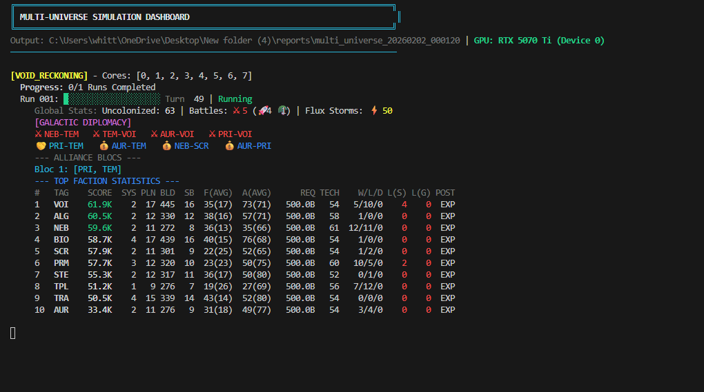
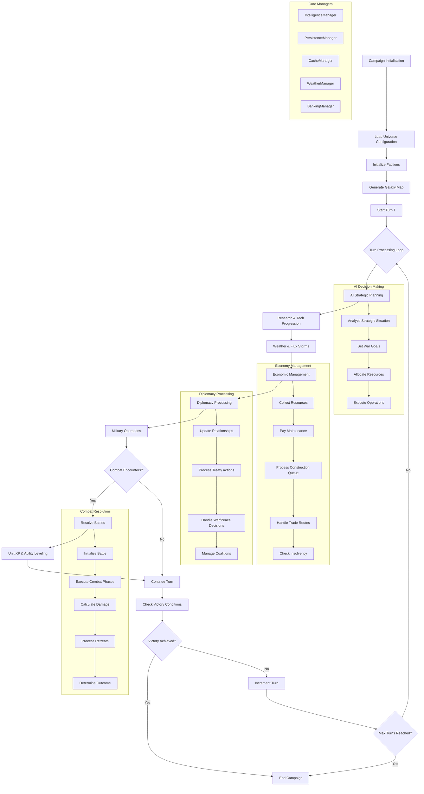
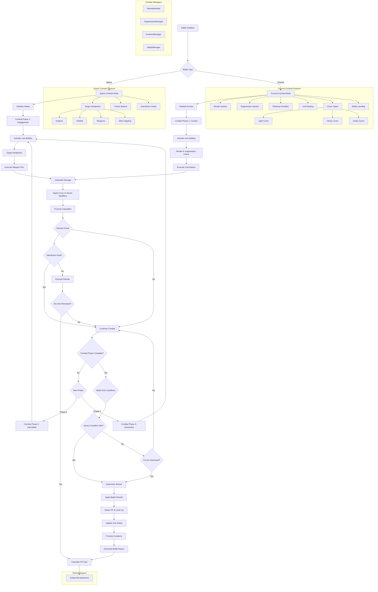
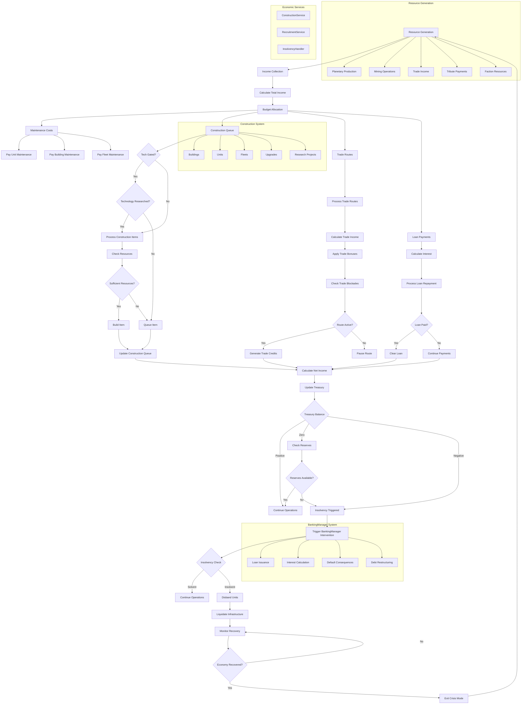
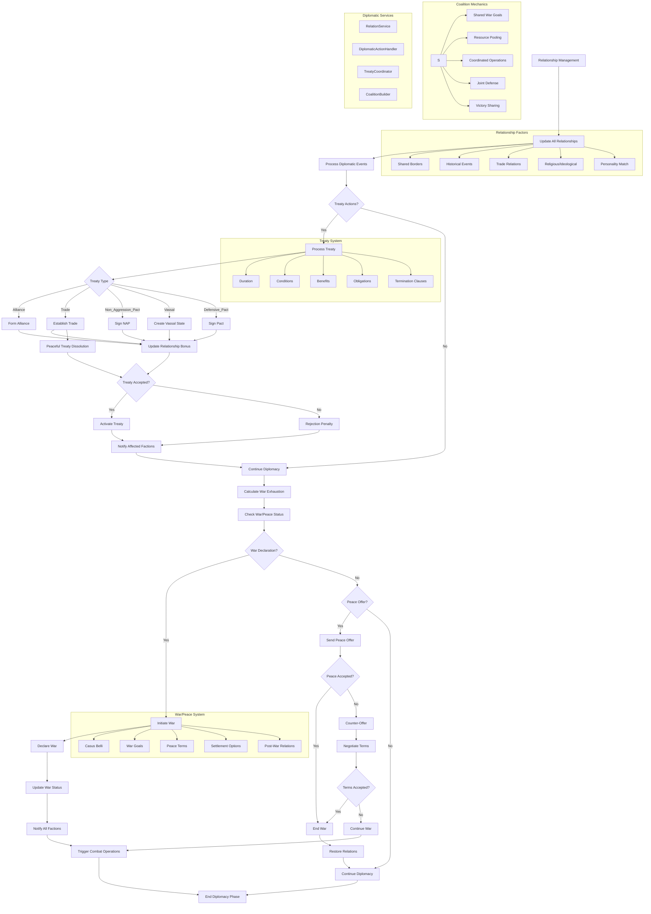

# Multi-Universe Strategy Engine

[](https://www.python.org/)
[](LICENSE)
[](#project-status)
[](#rust-combat-engine)
[](#gpu-acceleration)
[](#dashboard-v2)

<!-- GitHub Topics -->
[](https://github.com/topics/strategy-game)
[](https://github.com/topics/simulation)
[](https://github.com/topics/python)
[](https://github.com/topics/rust)
[](https://github.com/topics/4x-game)
[](https://github.com/topics/game-engine)


A complex, text-based 4X strategy engine featuring trait-based faction evolution and professional architectural patterns.

> **The "Gap" in the Python Market**: Unlike simple hobby projects or massive C++ engines, this framework provides a serious, architecturally mature simulation engine in Python, utilizing advanced patterns (Dependency Injection, Managers, Event Bus) for deep economic, diplomatic, and genetic modeling.
>
> **The "Headless" Advantage**: This is not a "game engine" in the graphical sense, but a **Headless 4X Simulation Framework**. It is designed for technical users interested in AI Training (Reinforcement Learning), Data Science (Campaign Analytics), and robust Backend Logic for web-based strategy games.

## Table of Contents

- [Overview](#overview)
- [Quick Reference](#quick-reference)
- [Core Features](#core-features)
- [Map Systems](#map-systems)
  - [Galactic System Maps](#galactic-system-maps)
  - [Planetary Maps](#planetary-maps)
- [Space Combat System](#space-combat-system)
- [Ground Combat System](#ground-combat-system)
- [System Architecture](#system-architecture)
- [Terminal Dashboard](#terminal-dashboard)
- [GPU Acceleration](#gpu-acceleration)
- [Analytics Engine](#analytics-engine)
- [AI System](#ai-system)
- [Project Structure](#project-structure)
- [Testing](#testing)
- [Docker Deployment](#docker-deployment)
- [Contributing](#contributing)
- [Documentation](#documentation)
- [Project Status](#project-status)

## Overview

The **Multi-Universe Strategy Engine** is a sophisticated grand strategy campaign simulator / 4X game engine built around the **Void Reckoning** universe—an original science fiction setting featuring ten unique factions engaged in galactic warfare.

### Core Philosophy

The engine follows a **multi-universe architecture** where the core simulation layer remains universe-agnostic, while universe-specific assets, rules, and AI behaviors are loaded dynamically from the `universes/` directory. This enables easy addition of new game universes without modifying the core engine.

### Real-Time Simulation Architecture

The engine uses a high-frequency real-time resolution for battles, allowing for complex interactions between units, environments, and tactical support layers. Combat can be resolved using efficient calculation modes optimized for different simulation scales:

- **Efficient Resolution**: Uses raw health and damage values for massive-scale simulations.
- **Detailed Resolution**: High-fidelity combat with integrated tactical systems for hyper-detailed resolution with GPU acceleration.

## Quick Reference

| Command | Description |
|---------|-------------|
| `python run.py` | Launch interactive menu (11 options) |
| `python run.py campaign --universe void_reckoning` | Run campaign simulation |
| `python run.py dashboard` | Launch Terminal Dashboard (Demo Batch) |
| `python run.py simulate --mode duel` | Run tactical combat |
| `python run.py validate` | Validate configurations |
| `pytest` | Run test suite |
| `docker-compose up -d` | Deploy with Docker |

## Core Features

### Strategic Systems

- ⚔️ **Ten Unique Factions**: Templars of the Flux, Transcendent Order, Steel-Bound Syndicate, Bio-Tide Collective, Algorithmic Hierarchy, Nebula Drifters, Aurelian Hegemony, Void-Spawn Entities, Scrap-Lord Marauders, Primeval Sentinels
- 🧠 **Adaptive AI**: Strategic planner featuring **Proactive Economic Reserving** (early-game scaling), theater manager (Multi-front coordination), industrial allocator (RECOVERY mode), intelligence coordinator, and individual faction personalities.
- 🌀 **Portal System**: Interstellar travel through portal networks and queue-based fleet transfers with reality anchors for cross-universe traversal.
- 🚁 **Task Force Management**: AI fleet coordination with SCOUT, RAID, DEF, ASSAULT types
- 🏆 **Victory Conditions**: Flexible victory states including Conquest, Elimination, and Defender Survival.

### Combat Systems

- 🚀 **Real-Time Battle Simulator**: High-fidelity, physics-based combat resolution with integrated space and ground layers.
- 🌌 **Empire at War Style Space Combat**: Tactical fleet engagements featuring targetable **Hardpoints** (Engines, Shields, Weapons) and ship crippling mechanics.
- 🪖 **Total War Style Ground Combat**: Scale-based planetary warfare with **Morale & Suppression** systems, flanking penalties, and unit routing.
- 🎯 **Tactical Support**: Off-map **Orbital Bombardment** provided by fleets in orbit to ground units.
- 🛡️ **Cover & Terrain**: Dynamic cover system (Light/Heavy) affecting unit survival and mitigating damage.

- 🎲 **Faction Mechanics**: Unique resource systems and 11+ ability types synchronized with real-time state, managed by pluggable faction mechanics engine.
- 🏗️ **Modular Ship Design**: **Stellaris/Thrawn's Revenge Style** architecture with Bow/Core/Stern sections and specialized slot types (S/M/L/X/P/G/H).
- 🧬 **Research & Tech Tree**: **Stellaris-Style** card draw system with **Hull & Unit Tech Locks**, ensuring that advanced ship classes and ground units (e.g., Heavy Walkers, Titans) require dedicated research. Features infinite procedural tech scaling and RP-based progression.
- 🧲 **Specialized Utility Modules**: Advanced ship roles including **Tractor Beams** (gravitational slowing) and **Interdiction Fields** (warp-suppression to prevent enemy retreat), supported by dedicated `T` and `I` slot architectures.
- 🌟 **Unit Ability Progression**: **Context-Aware Leveling** system where units gain XP and level up, utilizing an integrated `AbilityManager` to discover and use faction-specific abilities dynamically mid-combat.
- 🔫 **Unified Weapon Database**: Cross-Universe schema integrating Warhammer 40k, Star Wars, and Star Trek weapon archetypes.

### Combat Components

The combat system includes a comprehensive set of components for detailed simulation:

| Component | File | Description |
|-----------|-------|-------------|
| **Combat Calculator** | `src/combat/calculators/combat_calculator.py` | Core combat calculations and damage resolution |
| **Weapon Executor** | `src/combat/execution/weapon_executor.py` | Handles weapon firing and effects |
| **Grid Manager** | `src/combat/grid/grid_manager.py` | Manages tactical grid positioning |
| **Tracking Manager** | `src/combat/tracking/tracking_manager.py` | Tracks combat events and state changes |
| **Real-Time Replay** | `src/combat/reporting/real_time_replay.py` | Generates combat replays |

### Combat Components (Unit Stats)

| Component | File | Description |
|-----------|-------|-------------|
| **Armor Component** | `src/combat/components/armor_component.py` | Manages unit armor and damage mitigation |
| **Crew Component** | `src/combat/components/crew_component.py` | Tracks crew status and casualties |
| **Health Component** | `src/combat/components/health_component.py` | Manages unit health and damage |
| **Morale Component** | `src/combat/components/morale_component.py` | Handles morale and routing |
| **Movement Component** | `src/combat/components/movement_component.py` | Manages unit movement capabilities |
| **Stats Component** | `src/combat/components/stats_component.py` | Core unit statistics |
| **Trait Component** | `src/combat/components/trait_component.py` | Manages unit traits |
| **Weapon Component** | `src/combat/components/weapon_component.py` | Manages weapon systems and firing |

### Combat Tactical Systems

| System | File | Description |
|---------|-------|-------------|
| **Mass Combat Resolver** | `src/combat/tactical/mass_combat_resolver.py` | Resolves large-scale combat efficiently |
| **Movement Calculator** | `src/combat/tactical/movement_calculator.py` | Calculates unit movement on tactical grid |
| **Salvage Processor** | `src/combat/tactical/salvage_processor.py` | Handles post-combat salvage |
| **Target Selector** | `src/combat/tactical/target_selector.py` | Selects optimal targets for units |
| **Victory Checker** | `src/combat/victory/victory_checker.py` | Determines combat victory conditions |

### Combat Real-Time Systems

| System | File | Description |
|---------|-------|-------------|
| **Formation Manager** | `src/combat/real_time/formation_manager.py` | Manages unit formations |
| **Map Manager** | `src/combat/real_time/map_manager.py` | Handles real-time map updates |
| **Morale Manager** | `src/combat/real_time/morale_manager.py` | Real-time morale tracking |
| **Simulation Loop** | `src/combat/real_time/simulation_loop.py` | Main real-time simulation loop |
| **Steering Manager** | `src/combat/real_time/steering_manager.py` | Handles unit steering behaviors |

### Map Systems

The engine features two distinct map types that operate at different scales and serve different gameplay purposes.

#### Galactic System Maps

Galactic maps provide the strategic layer where fleets move between star systems and factions expand their empires.

| Feature | Description | File Reference |
|---------|-------------|----------------|
| **Star System Generation** | Procedural generation of star systems with planets, resources, and strategic value | `src/managers/galaxy_generator.py` |
| **Graph-Based Navigation** | Systems connected via edges with distance-based travel costs | `src/services/pathfinding_service.py` |
| **Portal Networks** | Inter-universe travel through portal networks with reality anchors | `src/managers/portal_manager.py` |
| **Fog of War** | Intelligence system limiting visibility of enemy movements and system contents | `src/managers/intelligence_manager.py` |
| **Flux Storms** | Dynamic weather events affecting navigation routes and fleet movement | `src/managers/weather_manager.py` |

**Key Mechanics:**

- **System Topology**: Each star system contains multiple planets that can be colonized and developed
- **Navigation Graph**: Fleets move along hyperlanes between systems with travel times based on distance
- **Portal Traversal**: Special portal structures enable travel between different universes or distant regions
- **Intelligence System**: Players only have visibility of systems within sensor range or shared intelligence
- **Dynamic Weather**: Flux storms can block routes, damage fleets, or create temporary safe passages

#### Planetary Maps

Planetary maps provide the tactical layer where ground combat and infrastructure development occur.

| Feature | Description | File Reference |
|---------|-------------|----------------|
| **Hex-Based Surfaces** | Planets represented as hexagonal grids for tactical movement | `src/core/hex_lib.py` |
| **Terrain Types** | Various terrain types (plains, mountains, forests, urban) with different effects | `src/combat/tactical_grid.py` |
| **Building Placement** | Infrastructure construction on specific hex tiles with adjacency bonuses | `src/services/construction_service.py` |
| **Ground Unit Movement** | Units move across hexes with terrain-based movement costs | `src/combat/tactical/movement_calculator.py` |
| **Orbital Bombardment** | Fleets in orbit can support ground units with targeted strikes | `src/combat/tactical/orbital_support.py` |

**Terrain Effects:**

| Terrain Type | Movement Cost | Cover Bonus | Special Effects |
|--------------|---------------|-------------|-----------------|
| **Plains** | 1.0x | None | Standard movement |
| **Mountains** | 3.0x | Heavy Cover | Blocks vehicle movement |
| **Forests** | 1.5x | Light Cover | Reduces visibility |
| **Urban** | 1.2x | Heavy Cover | Building destruction possible |
| **Desert** | 1.3x | None | Heat effects on units |
| **Water** | 2.0x | None | Requires amphibious units |

### Space Combat System

Space combat occurs between fleets in the strategic layer, featuring real-time tactical engagements with detailed ship mechanics.

| Feature | Description | File Reference |
|---------|-------------|----------------|
| **Real-Time Tactical Combat** | High-frequency resolution for complex fleet engagements | `src/combat/space_combat.py` |
| **Fleet Formations** | Pre-combat positioning affecting engagement outcomes | `src/combat/real_time/formation_manager.py` |
| **Ship-to-Ship Combat** | Individual ship targeting and damage resolution | `src/combat/execution/weapon_executor.py` |
| **Weapon Systems** | Diverse weapon types with different ranges and damage profiles | `src/combat/components/weapon_component.py` |
| **Shields, Armor, Hull** | Layered defense system with regeneration mechanics | `src/combat/components/armor_component.py`, `src/combat/components/health_component.py` |
| **Tactical Abilities** | Ship-mounted abilities activated during combat | `src/combat/abilities/space_abilities.json` |
| **Retreat Mechanics** | Disengagement with interdiction field restrictions | `src/managers/combat/retreat_handler.py` |
| **Victory Conditions** | Multiple win conditions (fleet destruction, capture, etc.) | `src/combat/victory/victory_checker.py` |

**Combat Mechanics:**

- **Target Hardpoints**: Ships have targetable subsystems (Engines, Shields, Weapons) that can be disabled
- **Formation Impact**: Pre-battle positioning determines initial engagement ranges and target availability
- **Weapon Variety**: Lasers, missiles, railguns, torpedoes, and special weapons with unique behaviors
- **Shield Regeneration**: Shields regenerate over time when not taking damage
- **Armor Penetration**: Different weapons have varying effectiveness against armor types
- **Critical Hits**: Chance to deal bonus damage or disable subsystems
- **Crippling**: Ships can be disabled without destroyed, allowing for capture or salvage

**Utility Modules:**

| Module Type | Slot | Effect |
|-------------|------|--------|
| **Tractor Beam** | T | Slows enemy ships, prevents retreat |
| **Interdiction Field** | I | Suppresses warp drives, blocks retreat |
| **Shield Booster** | S | Enhances shield regeneration |
| **Repair Drone** | R | Repairs hull damage during combat |
| **ECM Suite** | E | Reduces enemy accuracy |

### Ground Combat System

Ground combat occurs on planetary hex maps, featuring tactical positioning, cover mechanics, and combined arms warfare.

| Feature | Description | File Reference |
|---------|-------------|----------------|
| **Hex-Based Tactical Grid** | Combat occurs on hexagonal maps with terrain effects | `src/combat/tactical_grid.py` |
| **Unit Types** | Infantry, vehicles, heroes with different roles and capabilities | `data/ground/unit_classes.json` |
| **Cover Mechanics** | Light and heavy cover providing damage reduction | `src/combat/tactical/cover_system.py` |
| **Building Combat** | Structures can be occupied, damaged, or destroyed | `src/combat/tactical/building_combat.py` |
| **Orbital Support** | Fleets provide bombardment and reinforcement support | `src/combat/tactical/orbital_support.py` |
| **Morale System** | Units break and rout when morale reaches critical levels | `src/combat/components/morale_component.py` |
| **Suppression System** | Heavy fire suppresses units, reducing combat effectiveness | `src/managers/combat/suppression_manager.py` |
| **Invasion Mechanics** | Orbital drops and planetary assault sequences | `src/managers/combat/invasion_manager.py` |
| **Victory Conditions** | Elimination, capture objectives, or morale collapse | `src/combat/victory/victory_checker.py` |

**Unit Categories:**

| Unit Type | Role | Strengths | Weaknesses |
|-----------|------|-----------|------------|
| **Infantry** | Frontline, capture | High morale, cover bonus | Low damage, vulnerable to AoE |
| **Vehicles** | Fire support, breakthrough | High damage, armor | Limited cover use, expensive |
| **Heroes** | Leadership, special abilities | Buff allies, powerful abilities | Limited availability, high value |
| **Artillery** | Indirect fire support | Long range, area damage | Weak in direct combat |
| **Aircraft** | Mobility, reconnaissance | High mobility, bypass terrain | Vulnerable to AA, fuel limits |

**Cover System:**

| Cover Type | Damage Reduction | Availability |
|------------|------------------|---------------|
| **Light Cover** | 25% | Forests, craters, debris |
| **Heavy Cover** | 50% | Buildings, bunkers, fortifications |
| **Urban Cover** | 40% | City blocks, ruins |
| **No Cover** | 0% | Open terrain, plains |

**Morale States:**

| State | Effect | Recovery |
|-------|--------|----------|
| **Steady** | Normal combat effectiveness | N/A |
| **Shaken** | -20% accuracy, -10% damage | Rally from heroes |
| **Broken** | Cannot attack, -50% movement | Retreat to safe hex |
| **Routed** | Flees battlefield, removed | Cannot recover |

### Performance & Analytics

- ⚡ **Rust Combat Engine**: High-performance tactical calculations via native Rust integration for massive-scale combat
- 🚀 **GPU Acceleration**: Full CuPy support with automatic CUDA detection, multi-GPU support, and device selection strategies
- ⚡ **Parallel Execution**: Simulate multiple campaign scenarios simultaneously on dedicated CPU cores
- 📊 **Analytics Engine**: Economic health analysis, military efficiency tracking, industrial analysis, research analytics with predictive modeling
- 🔔 **Alert System**: Real-time alerts with severity levels (CRITICAL, WARNING, INFO) triggered by anomaly detection
- 📡 **Telemetry System**: Comprehensive event tracking with real-time metrics aggregation
- 🔍 **Observability System**: Causal tracing, replay analysis, and snapshot management for debugging complex interactions
- 📢 **Event Bus**: Central event dispatcher with subscriber pattern for loose coupling between systems
- 🎯 **Command Pattern**: Action system with command bus for undo/redo capabilities and audit trails

### User Interface

- 🎮 **Terminal Dashboard**: High-performance, low-latency CLI visualization for real-time campaign monitoring and batch results.
- 💻 **15 CLI Commands**: Comprehensive simulation control via command-line interface
- 🖥️ **Interactive Menu**: 11-option menu system for easy access to all features

### Developer Tools

- 🐳 **Docker Support**: Multi-stage Dockerfile for FastAPI backend + React frontend with Docker Compose configuration
- 📂 **70+ Utility Scripts**: Maintenance and analysis tools in `scripts/` and `tools/`
- 🧪 **Comprehensive Testing**: pytest with specific markers for targeted verification
- 📚 **Extensive Documentation**: 30+ markdown files covering all aspects of the engine

## System Architecture

### Software Architecture

The engine has been refactored to use a modular, decoupled architecture:

- **Service Locator**: Centralized dependency injection (`src/core/service_locator.py`).
- **Repository Pattern**: Data access abstraction for Factions, Fleets, Planets, and Units (`src/repositories/`).
- **Command Pattern**: Encapsulated actions with Undo/Redo support (`src/commands/`).
- **Event Bus**: Decoupled event-driven communication (`src/core/event_bus.py`).

### Gameplay Loop Flowchart

The following flowchart illustrates the complete gameplay loop from campaign initialization to victory conditions:



### Combat System Flowchart

The following flowchart illustrates the combat resolution process from battle initiation to victory/defeat outcomes:



### Economy Flowchart

The following flowchart illustrates the economic system from resource generation to insolvency handling:



### Diplomacy Flowchart

The following flowchart illustrates the diplomacy system from relationship management to war/peace decisions:



## Core Systems

The engine includes a comprehensive set of core systems that provide the foundational functionality for all simulation operations.

### Core System Components

| System | File | Description |
|---------|-------|-------------|
| **Ascension System** | `src/core/ascension_system.py` | Manages faction ascension mechanics and progression paths |
| **Civic System** | `src/core/civic_system.py` | Handles civic policies and their effects on faction behavior |
| **Ethics System** | `src/core/ethics_system.py` | Manages faction ethics and ideological alignment |
| **Origin System** | `src/core/origin_system.py` | Defines faction origins and starting bonuses |
| **Trait Synergy System** | `src/core/trait_synergy.py` | Calculates synergistic effects between traits |
| **Trait Tree System** | `src/core/trait_tree.py` | Manages trait progression trees and unlocks |
| **Universe Evolution System** | `src/core/universe_evolution.py` | Handles universe state evolution over time |
| **Expanded Stats System** | `src/core/expanded_stats.py` | Extended statistics tracking and analysis |
| **Ship Sections System** | `src/core/ship_sections.py` | Manages modular ship section architecture |
| **Ship Design System** | `src/core/ship_design_system.py` | Handles ship design and configuration |
| **Hex Library** | `src/core/hex_lib.py` | Hexagonal grid utilities for map generation |
| **Simulation Topology** | `src/core/simulation_topology.py` | Manages simulation spatial topology |
| **Payload Registry** | `src/core/payload_registry.py` | Registry for ability payloads and effects |
| **Personality Synthesizer** | `src/core/personality_synthesizer.py` | Generates AI personality profiles |
| **Multi-Registry Loader** | `src/core/multi_registry_loader.py` | Loads multiple data registries efficiently |
| **Universe Physics** | `src/core/universe_physics.py` | Defines physics constants and rules |
| **Ground Combat System** | `src/core/ground_combat_system.py` | Core ground combat mechanics |
| **Game Config** | `src/core/game_config.py` | Centralized game configuration |
| **DI Container** | `src/core/di_container.py` | Dependency injection container |

### Manager Layer

The manager layer coordinates between core systems and provides high-level operations:

| Manager | File | Description |
|---------|-------|-------------|
| **Fleet Queue Manager** | `src/managers/fleet_queue_manager.py` | Manages fleet construction queues |
| **Galaxy State Manager** | `src/managers/galaxy_state_manager.py` | Tracks and updates galaxy state |
| **Scenario Manager** | `src/managers/scenario_manager.py` | Manages game scenarios and setup |
| **Persistence Manager** | `src/managers/persistence_manager.py` | Handles save/load operations |
| **Cache Manager** | `src/managers/cache_manager.py` | Manages data caching for performance |
| **Treaty Coordinator** | `src/managers/treaty_coordinator.py` | Coordinates diplomatic treaties |
| **Invasion Manager** | `src/managers/combat/invasion_manager.py` | Manages planetary invasions |
| **Retreat Handler** | `src/managers/combat/retreat_handler.py` | Handles unit retreat mechanics |
| **Suppression Manager** | `src/managers/combat/suppression_manager.py` | Manages suppression effects |

## Installation

### Prerequisites

- **Python 3.8+** (tested up to 3.11)
- **CUDA Toolkit 11.x, 12.x, or 13.x** (for GPU acceleration)
- **NVIDIA GPU** with Compute Capability 7.0+ (for GPU acceleration)

### Step 1: Install Core Dependencies

```bash
pip install -r requirements.txt
```

### Step 2: Install GPU Dependencies (Optional)

For GPU acceleration, install the appropriate CuPy package for your CUDA version:

```bash
# For CUDA 11.x
pip install cupy-cuda11x

# For CUDA 12.x
pip install cupy-cuda12x
```

If no GPU is available, the engine will automatically fall back to NumPy.

### Step 3: Install Development Dependencies (Optional)

```bash
pip install -r requirements-dev.txt
```

### Step 4: Install Console Alias (Optional)

```bash
pip install -e .
```

This enables the `sim-engine` console command as an alternative to `python run.py`.

## Quickstart

### 1. Launch Interactive Menu

```bash
python run.py
```

The interactive menu provides 11 options:

| Option | Description |
|--------|-------------|
| 0 | Quit |
| 1 | Quick Campaign (30-turn simulation) |
| 2 | Batch Campaign (100-run simulation) |
| 3 | Multi-Universe Parallel Simulation |
| 4 | Tactical Combat (Duel, Royale, Fleet Battles) |
| 5 | Data Validation |
| 6 | Select Active Universe |
| 7 | Cross-Universe Duel (1v1) |
| 8 | Multi-Universe Fleet Battle (Mixed) |
| 9 | Launch Live Dashboard |
| 10 | Custom Report Export |

### 2. Run a Campaign

```bash
# Quick campaign
python run.py campaign --universe void_reckoning --quick

# With GPU acceleration
python run.py campaign --universe void_reckoning --gpu --gpu-strategy auto
```

### 3. Launch Dashboard

```bash
# Launch Terminal Dashboard
python run.py dashboard --universe void_reckoning
```

### 4. Run Tactical Combat

```bash
# 1v1 duel
python run.py simulate --mode duel --units "Templar Initiate" "Bio-Morph Ravager" --universe void_reckoning

# Fleet battle
python run.py simulate --mode fleet --faction1 Templars_of_the_Flux --faction2 BioTide_Collective
```

### 5. Validate Configuration

```bash
python run.py validate --universe void_reckoning
```

## Void Reckoning Factions

The Void Reckoning universe features ten distinct factions, each with unique doctrines, units, and strategic capabilities:

| Faction | Playstyle | Key Strengths |
| :--- | :--- | :--- |
| **Templars of the Flux** | Religious Warriors | Fanatical morale, heavy infantry, orbital bombardment |
| **Transcendent Order** | Psychic Mastery | Telekinetic abilities, mind control, flux manipulation |
| **Steel-Bound Syndicate** | Industrial Might | Heavy armor, mass production, siege warfare |
| **Bio-Tide Collective** | Biological Horde | Rapid reproduction, swarm tactics, biological weapons |
| **Algorithmic Hierarchy** | Technological Supremacy | Advanced robotics, hacking, drone swarms |
| **Nebula Drifters** | Raiders & Pirates | Hit-and-run tactics, stealth, boarding actions |
| **Aurelian Hegemony** | Diplomatic Empire | Trade networks, allied fleets, shield technology |
| **Void-Spawn Entities** | Dimensional Invaders | Teleportation, corruption, dark energy weapons |
| **Scrap-Lord Marauders** | Resource Scavengers | Salvage mechanics, improvised weapons, survival tactics |
| **Primeval Sentinels** | Precursor Civilization | Ancient technology, time manipulation, powerful artifacts |

### Faction-Specific Resources

Each faction has unique resources that drive their mechanics:

- **Conviction** (Templars): Gained through combat, spent on powerful abilities
- **Flux Energy** (Transcendent): Generated by resonators, used for psychic powers
- **Industrial Capacity** (Steel-Bound): Built through factories, used for production
- **Biomass** (Bio-Tide): Gained by consuming enemies, used for reproduction
- **Processing Power** (Algorithmic): Generated by data centers, used for hacking
- **Salvage** (Nebula Drifters): Gained by raiding, used for repairs
- **Trade Credits** (Aurelian Hegemony): Generated by trade, used for alliances
- **Corruption** (Void-Spawn): Spread by entities, used for dark powers
- **Scrap** (Scrap-Lord): Collected from debris, used for improvisation
- **Time Energy** (Primeval Sentinels): Generated by curators, used for temporal abilities

### Available Universes

The engine supports multiple universes:

- **Void Reckoning** (Active) - Original science fiction setting with ten unique factions
- **Void Alpha** - Enhanced version of Void Reckoning with tech tree graphs and expanded infrastructure
- **Void Beta** - Alternative timeline of Void Reckoning with same factions and tech tree graphs
- **Cosmic Ascendancy** - A diverse galaxy containing Federation, Theocratic, and Cybernetic factions
- **Procedural Sandbox** - Procedurally generated universe for testing

**Note**: Only Void Reckoning is currently active. Multi-universe architecture is preserved for future expansion.

## CLI Commands

The engine supports 15 CLI commands for comprehensive simulation control.

### Command List

| Command | Description |
|---------|-------------|
| `CampaignCommand` | Run campaign simulations with various configurations |
| `SimulateCommand` | Execute tactical combat simulations (duels, royales, fleet battles) |
| `ValidateCommand` | Validate configuration files and registries |
| `ConfigCommand` | Manage and view configuration settings |
| `MultiUniverseCommand` | Run parallel multi-universe simulations |
| `DashboardCommand` | Launch Terminal Dashboard Demo (Batch Simulation) |
| `ValidatePortalsCommand` | Validate portal network topology and connectivity |
| `ListPortalsCommand` | List available portals in the active universe |
| `TestPortalCommand` | Test portal traversal between locations |
| `AnalyzeCommand` | Run analysis tools on simulation data |
| `QueryCommand` | Query simulation reports with advanced filtering |
| `CrossUniverseDuelCommand` | Execute 1v1 duels between units from different universes |
| `CrossUniverseBattleCommand` | Execute fleet battles between different universes |
| `GenerateCommand` | Generate registries and configuration files |
| `ExportCommand` | Export simulation data in various formats |
| `HelpCommand` | Display help information for commands |

### Command Examples

```bash
# Run a campaign with specific universe
python run.py campaign --universe void_reckoning --quick

# Run parallel simulation with custom configuration
python run.py multi-universe --config config/unified_simulation_config.json

# Query simulation reports with advanced filtering
python run.py query --faction Templars_of_the_Flux --category combat --search "Orbital Bombardment"

# Validate configuration files
python run.py validate --universe void_reckoning

# Validate portal network
python run.py validate-portals --universe void_reckoning

# List available portals
python run.py list-portals --universe void_reckoning

# Test portal traversal
python run.py test-portal --source "Templars_of_the_Flux" --destination "BioTide_Collective"

# Duel between specific units
python run.py simulate --mode duel --units "Templar Initiate" "Bio-Morph Ravager" --universe void_reckoning

# Generate registries
python run.py generate --universe void_reckoning

# Launch Terminal Dashboard Demo
python run.py dashboard --universe void_reckoning

# Run with GPU acceleration (auto device selection)
python run.py campaign --universe void_reckoning --gpu --gpu-strategy auto

# Run with specific GPU
python run.py campaign --universe void_reckoning --gpu --gpu-device 0

# Run analytics on simulation results
python run.py export analytics --universe void_reckoning --output-dir reports/exports --formats pdf excel

# Cross-universe duel
python run.py cross-universe-duel --unit1 "void_reckoning:Templars_of_the_Flux:Templar Initiate" --unit2 "custom_universe:Custom_Faction:Custom Warrior"

# Cross-universe fleet battle
python run.py cross-universe-battle --universe1 void_reckoning --universe2 custom_universe --faction1 Templars_of_the_Flux --faction2 Custom_Faction

## Dashboard

The engine includes both a high-fidelity **Terminal Dashboard** and a modern **Dashboard V2** (FastAPI + React) for comprehensive simulation monitoring and control.

### Terminal Dashboard

The **Terminal Dashboard** is the primary interface for monitoring and controlling simulation campaigns. It provides a high-performance, low-latency CLI visualization optimized for real-time campaign monitoring and batch result analysis. This is the **recommended interface** for most users, especially for long-running simulations and batch campaigns.

> **Note**: Dashboard V2 (FastAPI + React) is currently a **Work In Progress**. While it offers a modern web-based interface, the Terminal Dashboard remains the most stable and feature-complete option for production use.

#### Overview

The Terminal Dashboard is designed for technical users who need:

- **Real-time visibility** into simulation progress without the overhead of a web browser
- **Batch campaign monitoring** with aggregated statistics across multiple simulation runs
- **Low-latency updates** for immediate feedback on simulation state
- **Resource-efficient monitoring** that doesn't compete with the simulation for CPU/GPU resources

**Key Advantages:**

| Advantage | Description |
|-----------|-------------|
| **Performance** | Minimal overhead (~1-2% CPU), allowing full simulation resources |
| **Reliability** | No browser dependencies, runs in any terminal environment |
| **Flexibility** | Works over SSH, in containers, and in headless environments |
| **Integration** | Easy to pipe output to logs, monitoring tools, or CI/CD pipelines |
| **Simplicity** | No additional services or dependencies required |

**When to Use Terminal Dashboard vs Dashboard V2:**

| Scenario | Recommended Interface |
|----------|----------------------|
| Long-running batch campaigns | Terminal Dashboard |
| SSH/remote monitoring | Terminal Dashboard |
| CI/CD integration | Terminal Dashboard |
| Resource-constrained environments | Terminal Dashboard |
| Interactive exploration | Dashboard V2 (when complete) |
| Visual analytics and charts | Dashboard V2 (when complete) |
| Team collaboration | Dashboard V2 (when complete) |

#### Installation & Setup

The Terminal Dashboard requires no additional installation beyond the core engine dependencies. All necessary components are included in the main installation.

**Prerequisites:**

- **Python 3.8+** (tested up to 3.11)
- **Terminal Requirements**: Any ANSI-compatible terminal (Windows Terminal, iTerm2, GNOME Terminal, etc.)
- **Screen Size**: Minimum 80 columns × 24 lines recommended for optimal display

**Configuration Options:**

The dashboard behavior can be configured via environment variables and command-line flags:

| Environment Variable | Description | Default |
|---------------------|-------------|---------|
| `DASHBOARD_REFRESH_RATE` | Update interval in milliseconds | 500 |
| `DASHBOARD_SHOW_DETAILS` | Show detailed faction stats | true |
| `DASHBOARD_COLOR_SCHEME` | Color scheme (auto/light/dark) | auto |
| `DASHBOARD_LOG_OUTPUT` | Enable logging to file | false |
| `DASHBOARD_MAX_HISTORY` | Maximum history lines to keep | 1000 |

**Configuration File:**

You can create a `config/dashboard_config.json` file for persistent settings:

```json
{
  "refresh_rate": 500,
  "show_details": true,
  "color_scheme": "auto",
  "log_output": false,
  "max_history": 1000,
  "display_options": {
    "show_faction_stats": true,
    "show_galactic_summary": true,
    "show_postures": true,
    "show_diplomacy": true,
    "show_batch_summary": true
  }
}
```

**File References:**

- Dashboard Provider: [`src/reporting/dashboard_provider.py`](src/reporting/dashboard_provider.py)
- Dashboard Command: [`src/cli/commands/dashboard_cmd.py`](src/cli/commands/dashboard_cmd.py)
- Dashboard Config: [`config/dashboard_config.json`](config/dashboard_config.json)

#### Usage

**Launching the Dashboard:**

```bash
# Interactive demo mode (uses pre-generated demo data)
python run.py dashboard

# Monitor an active campaign (auto-attaches to running simulation)
python run.py dashboard --monitor

# Monitor a specific simulation run by ID
python run.py dashboard --run-id <run_id>

# Specify universe for monitoring
python run.py dashboard --universe void_reckoning

# Batch campaign with live dashboard
python run.py campaign --universe void_reckoning --batch --turns 100

# Multi-universe simulation with dashboard
python run.py multi-universe --config config/void_reckoning_config.json
```

**Command-Line Options:**

| Flag | Description | Default |
|------|-------------|---------|
| `--monitor` | Monitor active simulation runs | false |
| `--run-id` | Specific simulation run ID to monitor | latest |
| `--universe` | Universe to monitor | active universe |
| `--refresh-rate` | Update interval in milliseconds | 500 |
| `--no-color` | Disable colored output | false |
| `--quiet` | Suppress non-critical messages | false |
| `--verbose` | Show detailed debug information | false |
| `--log-file` | Write dashboard output to file | none |

**Interactive Controls:**

While the dashboard is running, you can use the following keyboard shortcuts:

| Key | Action |
|-----|--------|
| `q` / `Ctrl+C` | Quit dashboard |
| `p` | **Pause/Resume updates** (freezes currently displayed data) |
| `r` | Force refresh |
| `d` | Toggle detailed faction stats table |
| `s` | Toggle global galactic summary |
| `y` | Toggle galactic diplomacy and alliance blocs |
| `f` | Filter factions by name/tag |
| `h` | Toggle help overlay |
| `1-9` | Quick filter by faction index |

**Output Modes:**

The dashboard supports multiple output modes for different use cases:

```bash
# Standard terminal output (default)
python run.py dashboard

# Quiet mode (minimal output, critical updates only)
python run.py dashboard --quiet

# Verbose mode (detailed debug information)
python run.py dashboard --verbose

# Log to file (for later analysis)
python run.py dashboard --log-file dashboard.log

# Pipe to monitoring tools
python run.py dashboard | grep "CRITICAL" > alerts.log
```

#### Display Elements

The Terminal Dashboard displays multiple panels of information, each showing different aspects of the simulation state.

**Main Display Layout:**

```
╔══════════════════════════════════════════════════════════════════════════════╗
║ MULTI-UNIVERSE SIMULATION DASHBOARD                                          ║
╚══════════════════════════════════════════════════════════════════════════════╝
Output: C:\Users\whitt\OneDrive\Desktop\New folder (4)\reports\multi_universe_20260204_170327 | GPU: RTX 5070 Ti (Device 0)
────────────────────────────────────────────────────────────────────────────────

[VOID_RECKONING] - Cores: [0, 1, 2, 3, 4, 5, 6, 7]
  Progress: 0/1 Runs Completed
  Run 001: ░░░░░░░░░░░░░░░░░░░░ Turn  43 | Running
     Global Stats: Uncolonized: 0 | Battles: ⚔ 196 (🚀74 🪖122) | Flux Storms: ⚡ 50
     [GALACTIC DIPLOMACY]
     ⚔ 1TPL-1TRA   ⚔ 2TPL-1TRA   ⚔ 3ALG-2TPL   ⚔ 2TPL-3VOI
     ⚔ 1SCR-2TPL   ⚔ 3PRM-2TPL   ⚔ 3TPL-3TRA   ⚔ 1STE-3TPL
     ⚔ 3BIO-3TPL   ⚔ 1ALG-3TPL   ⚔ 3TPL-2VOI   ⚔ 1BIO-1TRA
     ⚔ 3ALG-1TRA   ⚔ 2NEB-1TRA   ⚔ 1TRA-1VOI   ⚔ 3PRM-1TRA
     ⚔ 1ALG-2TRA   ⚔ 2ALG-2TRA   ⚔ 2TRA-2VOI   ⚔ 3SCR-2TRA
     ⚔ 3NEB-3TRA   ⚔ 3TRA-2VOI   ⚔ 1PRM-3TRA   ⚔ 1STE-2STE
     ⚔ 2BIO-1STE   ⚔ 3BIO-1STE   ⚔ 2AUR-1STE   ⚔ 2SCR-1STE
     ⚔ 3NEB-2STE   ⚔ 2AUR-2STE   ⚔ 2STE-2VOI   ⚔ 2STE-3VOI
     ⚔ 1SCR-2STE   ⚔ 2SCR-2STE   ⚔ 1PRM-2STE   ⚔ 2ALG-3STE
     ⚔ 2NEB-3STE   ⚔ 2PRM-3STE   ⚔ 3ALG-1BIO   ⚔ 1BIO-1NEB
     ⚔ 1AUR-1BIO   ⚔ 2AUR-1BIO   ⚔ 3AUR-1BIO   ⚔ 1BIO-3VOI
     ⚔ 1AUR-2BIO   ⚔ 2AUR-2BIO   ⚔ 3BIO-3NEB   ⚔ 2AUR-3BIO
     ⚔ 3BIO-2SCR   ⚔ 1ALG-3NEB   ⚔ 1ALG-2VOI   ⚔ 1ALG-3SCR
     ⚔ 2ALG-2VOI   ⚔ 2ALG-3SCR   ⚔ 2ALG-2PRM   ⚔ 3ALG-1AUR
     ⚔ 3ALG-3AUR   ⚔ 3ALG-1VOI   ⚔ 3ALG-3VOI   ⚔ 3ALG-3PRM
     ⚔ 3AUR-1NEB   ⚔ 1NEB-3VOI   ⚔ 1NEB-1PRM   ⚔ 2NEB-1VOI
     ⚔ 2NEB-2PRM   ⚔ 1AUR-3PRM   ⚔ 2AUR-1SCR   ⚔ 2AUR-2SCR
     ⚔ 3AUR-3VOI   ⚔ 3AUR-1SCR   ⚔ 3PRM-1VOI   ⚔ 2VOI-3VOI
     ⚔ 3SCR-2VOI   ⚔ 1PRM-2VOI   ⚔ 1PRM-3VOI   ⚔ 1SCR-2SCR
     💰 3ALG-2STE
     --- TOP FACTION STATISTICS ---
     #   TAG    SCORE  SYS  OWN(A)  CON(A) CTY    B(AVG)  SB  F(AVG)  A(AVG)      REQ   T    W/L/D L(S) L(G) POST
     1   1BIO   51.8K    3  9(7.0)  4(3.5)  77  369(4.8)   9   47(8)  60(36)    47.3M  29  90/40/0   17    0  EXP
     2   1NEB   50.2K    3  8(7.0)  4(5.2)  77  365(4.7)   6   43(8)  48(40)    49.1M  27  76/34/0   48    0  EXP
     3   1AUR   44.3K    2  8(7.0)  3(2.3)  63  322(5.1)   7   55(6)  69(33)    46.2M  26  61/60/0    0   27  EXP
     4   1STE   41.3K    2  6(7.0)  6(3.5)  63  314(5.0)   5  41(10)  74(31)    47.3M  23  56/56/0    5    2  EXP
     5   2BIO   41.0K    1  7(7.0)  3(2.3)  56  261(4.7)   6  26(13)  58(34)    46.5M  27  89/50/0    0    0  EXP
     6   3PRM   40.6K    2 10(7.0)  1(7.0)  77  394(5.1)   9   59(7)  76(39)    48.1M  16  23/39/0    2    0  EXP
     7   3VOI   38.6K    1  9(7.0)  2(0.0)  63  319(5.1)   9   43(9)  57(42)    45.9M  21  21/29/0    2    0  EXP
     8   2ALG   37.7K    1  8(7.0)  3(2.3)  63  319(5.1)   8  27(15)  81(30)    47.4M  19 117/31/0    3    0  BAL
     9   3ALG   37.4K    2  9(7.0)  2(3.5)  70  359(5.1)   7  16(16)  56(43)    47.4M  17  24/84/0  126    0  EXP
     10  2VOI   37.0K    4  8(7.0)  6(4.7)  84  414(4.9)   8   41(9)  61(39)    46.1M  13 31/122/0   17    0  EXP
     11  1SCR   36.7K    2  9(7.0)  2(3.5)  70  357(5.1)   9  32(15)  92(32)    46.5M  16  40/13/0    0    0  EXP
     12  3STE   36.0K    3 10(7.0)  3(4.7)  84  433(5.2)   9  40(11)  63(39)    43.5M  14  34/51/0    0    2  EXP
     13  2AUR   35.9K    5 10(7.0)  4(5.2)  91  452(5.0)   8  20(22)  88(32)    42.8M  13  74/36/0    5    1  EXP
     14  3TRA   35.5K    2  9(7.0)  2(3.5)  70  335(4.8)   8  32(15)  56(44)    46.0M  17   33/7/0    0    0  EXP
     15  1ALG   35.3K    2  7(7.0)  4(3.5)  63  301(4.8)   7  36(10)  66(31)    50.7M  14 151/41/0    1    0  EXP
     16  2TRA   35.1K    2  8(7.0)  3(4.7)  70  347(5.0)   9   37(9)  58(43)    48.6M  13  21/77/0    9    3  EXP
     17  2TPL   34.9K    2 10(7.0)  2(3.5)  77  400(5.2)   9   53(9)  64(41)    45.3M  13  18/38/0    3    0  EXP
     18  3TPL   34.8K    2  8(7.0)  4(3.5)  70  343(4.9)   6   30(6)  53(41)    49.5M  13  47/39/0    7    0  EXP
     19  2PRM   34.7K    2  9(7.0)  2(3.5)  70  335(4.8)   9   59(7)  66(40)    49.3M  12  30/42/0    4    0  EXP
     20  2STE   34.5K    3  9(7.0)  4(3.5)  77  372(4.8)   8   49(8)  77(39)    45.0M  14  16/29/0    4   19  EXP
     21  2SCR   33.5K    2  9(7.0)  2(3.5)  70  354(5.1)   8  24(18)  64(39)    49.2M  11  23/86/0    0    0  EXP
     22  3SCR   32.8K    2 10(7.0)  2(3.5)  77  388(5.0)  10  37(10)  63(41)    43.9M  13  20/63/0    0    0  EXP
     23  1PRM   32.7K    1  9(7.0)  1(0.0)  63  313(5.0)   9  33(13)  60(43)    45.6M  16  27/30/0    7    0  EXP
     24  1VOI   31.7K    3  8(7.0)  5(4.2)  77  376(4.9)   8  22(20)  80(36)    47.5M   9  27/38/0    0    0  EXP
     25  1TRA   31.1K    2  7(7.0)  5(4.2)  70  364(5.2)   7   72(5)  54(40)    47.6M   9  34/47/0    4    3  EXP
     26  3AUR   29.8K    1  7(7.0)  3(0.0)  49  257(5.2)   7   50(8)  58(41)    47.8M  14  20/87/0    4    2  EXP
     27  3BIO   27.5K    2  7(7.0)  4(1.8)  56  276(4.9)   7   52(7)  54(41)    47.9M  10  19/50/0    3    0  EXP
     28  2NEB   26.3K    2  7(7.0)  5(1.4)  56  283(5.1)   7  34(13)  47(42)    43.7M  13  31/58/0    4    3  EXP
     29  3NEB   25.7K    2 10(7.0)  2(3.5)  77  375(4.9)  10  37(12)  77(38)    44.2M   6   7/31/0    5    0  EXP
     30  1TPL   24.3K    1 10(7.0)  0(0.0)  70  378(5.4)  10  36(14)  70(41)    44.5M   5   12/9/0    2    0  EXP
```

**Color Coding and Visual Indicators:**

| Color/Indicator | Meaning |
|-----------------|---------|
| 🟢 Green | Healthy/stable state |
| 🟡 Yellow | Warning/caution state |
| 🔴 Red | Critical/error state |
| 🔵 Blue | Informational |
| ⚔️ Sword icon | Aggressive posture |
| 🛡️ Shield icon | Defensive posture |
| ⚖️ Scales icon | Balanced posture |
| 🌌 Galaxy icon | Galactic event |
| ⚡ Lightning icon | Active battle |

**Faction Stat Abbreviations:**

| Abbreviation | Full Name | Description |
|--------------|-----------|-------------|
| `#` | Rank | Current standing based on score |
| `TAG` | Faction Tag | Unique identifier (e.g., 1BIO, 3PRM) |
| `SCORE` | Performance | Overall score based on all metrics |
| `SYS` | Systems | Total star systems controlled |
| `OWN(A)` | Solely Owned | Planets with only one faction present (Avg. cities) |
| `CON(A)` | Contested | Planets with multiple factions present (Avg. cities) |
| `CTY` | Cities | Total cities across all control zones |
| `B(AVG)` | Buildings | Total buildings (Avg. buildings per city) |
| `SB` | Starbases | Total starbases active |
| `F(AVG)` | Fleets | Active fleets (Avg. ships per fleet) |
| `A(AVG)` | Armies | Active armies (Avg. units per army) |
| `REQ` | Requisition | Available resource points (M=Millions) |
| `T` | Tech Level | Current technology development tier |
| `W/L/D` | Records | Wins / Losses / Draws record |
| `L(S)` | Lost Ships | Total ships destroyed in combat |
| `L(G)` | Lost Ground | Total ground units destroyed in combat |
| `POST` | Posture | Strategic AI behavior (EXP, BAL, DEF) |

#### Real-Time Monitoring

The Terminal Dashboard provides live, turn-by-turn updates for active simulation runs.

**How Live Updates Work:**

The dashboard uses a polling mechanism to fetch the latest simulation state:

1. **State Query**: Every `refresh_rate` milliseconds, the dashboard queries the simulation state
2. **Delta Calculation**: Compares current state with previous state to identify changes
3. **Display Update**: Only changed elements are redrawn to minimize screen flicker
4. **Event Detection**: Significant events (battles, diplomatic changes) trigger immediate updates

**Update Frequency:**

| Setting | Update Rate | Use Case |
|---------|-------------|----------|
| Fast (100ms) | 10 updates/second | Critical monitoring, debugging |
| Normal (500ms) | 2 updates/second | Default, balanced performance |
| Slow (1000ms) | 1 update/second | Resource-constrained environments |
| Manual | On-demand | Paused monitoring, analysis |

**Events That Trigger Immediate Updates:**

- Battle start/end
- Victory condition achieved
- Faction eliminated
- Major diplomatic change (war/peace)
- Technology breakthrough
- Critical economic event (bankruptcy, recovery)
- Flux storm formation/dissipation

**Performance Considerations:**

The dashboard is designed to have minimal impact on simulation performance:

- **CPU Overhead**: ~1-2% on modern systems
- **Memory Overhead**: ~5-10MB for state tracking
- **I/O Overhead**: Minimal, only changed data is transmitted
- **GPU Impact**: None - dashboard runs entirely on CPU

#### Faction Statistics

The dashboard provides comprehensive real-time statistics for each faction in the simulation.

**Detailed Breakdown of Each Metric:**

| Metric | Description | How Calculated | What It Indicates |
|--------|-------------|----------------|-------------------|
| **Economic Score** | Composite economic strength | Sum of: (planets × 10) + (buildings × 5) + (starbases × 20) + (income × 2) | Overall economic power and production capacity |
| **Star Systems** | Number of controlled systems | Count of systems with at least one owned planet | Territory control and expansion |
| **Planets** | Number of colonized planets | Count of owned planets with population | Colonization progress and resource base |
| **Buildings** | Total buildings constructed | Sum of all buildings across all planets | Infrastructure development |
| **Starbases** | Starbases under control | Count of owned starbases | Strategic control points |
| **Fleets** | Active fleets | Count of fleets with at least one ship | Naval power projection |
| **Armies** | Active armies | Count of armies with at least one unit | Ground power projection |
| **Requisition** | Available requisition points | Current treasury balance | Immediate spending capacity |
| **Tech Level** | Current technology level | Weighted sum of researched technologies | Research progress |
| **Win-Loss Ratio** | Battle performance | Wins / (Wins + Losses) | Combat effectiveness |

**Economic Score Calculation:**

```python
# From src/reporting/dashboard_provider.py
def calculate_economic_score(faction):
    base_score = (
        faction.planets * 10 +
        faction.buildings * 5 +
        faction.starbases * 20 +
        faction.income * 2
    )
    # Bonuses for special conditions
    if faction.has_trade_network:
        base_score *= 1.1
    if faction.has_research_bonus:
        base_score *= 1.05
    return int(base_score)
```

**Interpreting the Data:**

| Pattern | Interpretation |
|---------|---------------|
| High ECON, Low Fleets | Economic powerhouse, military buildup phase |
| Low ECON, High Fleets | Military-focused, may be overextended |
| Rising Tech Level | Research-focused strategy |
| High W/L Ratio | Effective combat tactics |
| Declining ECON | Economic trouble, possible insolvency |
| Rapid Fleet Growth | Military expansion phase |

**Faction Comparison:**

The dashboard displays factions sorted by Economic Score by default, making it easy to identify:

- **Leading factions** (top 3)
- **Middle tier** (positions 4-7)
- **Trailing factions** (bottom 3)

You can also sort by other metrics using the interactive controls.

#### Postures & Diplomacy

The dashboard displays AI strategic postures and diplomatic relationships for all factions.

**AI Strategic Postures:**

| Posture | Icon | Description | Typical Behavior |
|---------|------|-------------|------------------|
| **CONQUEST** | ⚔️ | Aggressive expansion | Prioritizes military buildup, launches frequent attacks |
| **DEFENSE** | 🛡️ | Territorial protection | Focuses on fortifications, defensive fleets |
| **BALANCED** | ⚖️ | Mixed strategy | Balances economy and military, adapts to threats |
| **EXPANSION** | 🚀 | Rapid colonization | Prioritizes new planets, minimal military |
| **RAID** | 💀 | Hit-and-run tactics | Small, fast fleets, economic disruption |

**Posture Selection Logic:**

AI factions dynamically adjust their posture based on:

- **Threat Level**: Number and strength of nearby enemies
- **Economic Health**: Available resources and income
- **Victory Progress**: Progress toward victory conditions
- **Personality Traits**: Faction-specific personality modifiers

```python
# From src/ai/strategic_planner.py
def select_posture(faction):
    threat_level = calculate_threat_level(faction)
    economic_health = calculate_economic_health(faction)
    
    if threat_level > HIGH_THRESHOLD:
        return "DEFENSE"
    elif economic_health > HIGH_THRESHOLD and threat_level > MEDIUM_THRESHOLD:
        return "CONQUEST"
    elif economic_health > HIGH_THRESHOLD:
        return "EXPANSION"
    else:
        return "BALANCED"
```

**Diplomatic Blocs Display:**

The dashboard shows diplomatic relationships using a compact notation:

```
TPL: [CONQUEST] ⚔️  Allies: PRM | Enemies: BIO, ALG | Neutral: NEB, AUR
```

| Relationship Type | Symbol | Meaning |
|-------------------|--------|---------|
| Allies | `Allies:` | Formal alliance, mutual defense |
| Enemies | `Enemies:` | Active war state |
| Neutral | `Neutral:` | No formal relationship |
| Trade Partners | `Trade:` | Active trade agreement |
| Vassal | `Vassal:` | Subordinate relationship |
| Overlord | `Overlord:` | Dominant relationship |

**Visual Indicators:**

| Indicator | Meaning |
|-----------|---------|
| 🟢 | Positive relationship (alliance/trade) |
| 🔴 | Negative relationship (war) |
| 🟡 | Neutral/cautious relationship |
| 🔵 | Information available (intelligence) |

**Diplomatic Events:**

The dashboard highlights significant diplomatic events:

- **Wars Declared**: ⚔️ New conflict started
- **Peace Treaties**: 🕊️ War ended
- **Alliances Formed**: 🤝 New alliance
- **Vassal States Created**: 👑 New vassal
- **Trade Agreements**: 💰 New trade route

#### Galactic Summary

The Galactic Summary panel provides a high-level overview of the simulation state.

**Global Metrics:**

| Metric | Description | What It Shows |
|--------|-------------|---------------|
| **Neutral Worlds** | Uncolonized planets | Expansion opportunities remaining |
| **Flux Storms** | Active weather events | Navigation hazards, strategic considerations |
| **Total Systems** | All star systems | Galaxy size |
| **Active Battles** | Ongoing combat engagements | Current conflict level |
| **Turn Time** | Time to process last turn | Simulation performance |
| **ETA** | Estimated time to completion | When simulation will finish |

**Neutral Worlds Tracking:**

Neutral worlds represent unclaimed territory available for colonization:

```
Neutral Worlds: 15/50 (30% remaining)
```

- **High count**: Early game, expansion opportunities
- **Low count**: Late game, territory consolidation phase
- **Rapid decline**: Colonization race in progress

**Flux Storms Monitoring:**

Flux storms are dynamic weather events that affect navigation:

```
Flux Storms: 3 active
  - Sector 7 (2 turns remaining)
  - Sector 12 (5 turns remaining)
  - Sector 23 (1 turn remaining)
```

| Storm Duration | Impact |
|----------------|--------|
| 1-2 turns | Minor disruption |
| 3-5 turns | Moderate disruption |
| 6+ turns | Major disruption, route changes needed |

**Active Battles Tracking:**

Shows all ongoing combat engagements:

```
Active Battles: 3
  1. TPL vs BIO @ System-7 (Space)
  2. PRM vs ALG @ System-12 (Ground)
  3. AUR vs NEB @ System-23 (Space)
```

| Battle Type | Icon | Duration |
|-------------|------|----------|
| Space Combat | 🚀 | 3-10 turns |
| Ground Combat | 🪖 | 5-15 turns |
| Orbital Bombardment | 💥 | 1-3 turns |

**Performance Metrics:**

The dashboard tracks simulation performance:

| Metric | Good | Acceptable | Poor |
|--------|------|------------|------|
| Turn Time | <1s | 1-3s | >3s |
| Memory Usage | <500MB | 500MB-1GB | >1GB |
| CPU Usage | <50% | 50-80% | >80% |

#### Batch Campaigns

The dashboard provides aggregated statistics for multi-run batch campaigns.

**How Batch Summaries Work:**

Batch campaigns run multiple simulations with different random seeds, providing statistical data on faction performance:

1. **Run Initialization**: Each simulation starts with a unique random seed
2. **Parallel Execution**: Simulations run in parallel on available CPU cores
3. **Result Aggregation**: Win counts and statistics are aggregated after completion
4. **Real-Time Updates**: Dashboard shows progress as simulations complete

**Win-Count Aggregation:**

```
Batch Summary (100 runs)
  TPL: 32 wins (32%) | PRM: 28 wins (28%) | BIO: 15 wins (15%)
  ALG: 12 wins (12%) | NEB: 8 wins (8%) | AUR: 5 wins (5%)
```

| Statistic | Description |
|-----------|-------------|
| **Wins** | Number of simulations where faction achieved victory |
| **Win %** | Percentage of total simulations won |
| **Avg Turns** | Average turns to victory (for winning factions) |
| **Avg ECON** | Average final economic score |
| **Elimination Rate** | Percentage of simulations where faction was eliminated |

**Multi-Run Campaign Monitoring:**

The dashboard shows progress for batch campaigns:

```
Batch Progress: 42/100 (42%) | ETA: 5m 30s
  Running: 8 | Completed: 42 | Failed: 0 | Pending: 50
```

| Status | Meaning |
|--------|---------|
| Running | Currently executing |
| Completed | Finished successfully |
| Failed | Encountered an error |
| Pending | Waiting to start |

**Statistical Analysis:**

For advanced users, the dashboard can display statistical metrics:

```bash
python run.py dashboard --batch --show-stats
```

| Metric | Description |
|--------|-------------|
| **Mean** | Average value across all runs |
| **Median** | Middle value when sorted |
| **Std Dev** | Standard deviation (variability) |
| **Min/Max** | Range of values |
| **Percentiles** | 25th, 50th, 75th percentile values |

#### Performance & Reliability

The Terminal Dashboard is designed for maximum performance and reliability.

**Low Overhead Details:**

| Resource | Usage | Impact |
|----------|-------|--------|
| **CPU** | 1-2% | Minimal impact on simulation |
| **Memory** | 5-10MB | Negligible memory footprint |
| **Disk I/O** | Minimal | Only for logging (if enabled) |
| **Network** | None | No network dependencies |

**CPU/GPU Utilization:**

The dashboard is designed to not interfere with simulation resources:

```
Simulation:  98% CPU (8 cores) | 95% GPU (CUDA)
Dashboard:   2% CPU (1 core)  |  0% GPU
─────────────────────────────────────────────
Total:      100% CPU (9 cores) | 95% GPU
```

**Optimization Tips:**

1. **Adjust Refresh Rate**: Increase `refresh_rate` for lower CPU usage
2. **Disable Details**: Use `--quiet` mode for minimal updates
3. **Filter Output**: Use `grep` to monitor only critical events
4. **Log to File**: Use `--log-file` to avoid terminal rendering overhead
5. **Run Headless**: For CI/CD, disable terminal output entirely

**Resource Usage Comparison:**

| Interface | CPU | Memory | GPU | Network |
|-----------|-----|--------|-----|---------|
| Terminal Dashboard | 1-2% | 5-10MB | 0% | None |
| Dashboard V2 | 5-10% | 50-100MB | 0% | WebSocket |
| None (headless) | 0% | 0MB | 0% | None |

#### Troubleshooting

**Common Issues and Solutions:**

| Issue | Symptoms | Solution |
|-------|----------|----------|
| **Dashboard not updating** | Display frozen, no new data | Press `r` to force refresh, check simulation is running |
| **Display garbled** | Overlapping text, incorrect formatting | Increase terminal size to 80×24 minimum |
| **Colors not showing** | Monochrome output | Check terminal supports ANSI colors, use `--no-color` if needed |
| **High CPU usage** | System slow, dashboard using >5% CPU | Increase `refresh_rate`, use `--quiet` mode |
| **Connection lost** | Error messages about simulation | Restart dashboard, check simulation process is alive |
| **Missing data** | Some fields show `N/A` | Check simulation has progressed enough to generate data |

**Performance Tuning:**

```bash
# For maximum performance (minimal overhead)
python run.py dashboard --refresh-rate 1000 --quiet

# For detailed monitoring (higher overhead)
python run.py dashboard --refresh-rate 100 --verbose

# For resource-constrained environments
python run.py dashboard --refresh-rate 2000 --no-color

# For CI/CD pipelines (no output)
python run.py dashboard --log-file /dev/null
```

**Debug Mode:**

Enable verbose logging to diagnose issues:

```bash
python run.py dashboard --verbose --log-file debug.log
```

This will output:

- State query details
- Delta calculation results
- Display update information
- Error messages and stack traces

**Getting Help:**

If you encounter issues not covered here:

1. Check the [Dashboard Guide](docs/dashboard_guide.md) for detailed documentation
2. Review [Troubleshooting](docs/dashboard_troubleshooting.md) for common issues
3. Check [GitHub Issues](https://github.com/your-repo/issues) for known problems
4. Create a new issue with:
   - Terminal type and version
   - Python version
   - Command used
   - Error messages or unexpected behavior
   - Debug log (if available)

**File References for Troubleshooting:**

- Dashboard Provider: [`src/reporting/dashboard_provider.py`](src/reporting/dashboard_provider.py)
- Dashboard Command: [`src/cli/commands/dashboard_cmd.py`](src/cli/commands/dashboard_cmd.py)
- Dashboard Tests: [`tests/test_dashboard.py`](tests/test_dashboard.py)
- Debug Scripts: [`scripts/diagnose_dashboard_db.py`](scripts/diagnose_dashboard_db.py)

### Dashboard V2 (FastAPI + React)

Dashboard V2 provides a modern web-based interface with real-time WebSocket streaming and comprehensive API routes for simulation monitoring and control.

#### Key Features

- 🌐 **Modern Web Interface**: React-based frontend with TypeScript for type safety
- 📡 **WebSocket Streaming**: Real-time updates without page refreshes
- 📊 **Comprehensive Analytics**: Economic, military, research, and industrial metrics
- 🎮 **Simulation Control**: Start, stop, and pause simulations from the web interface
- 🔔 **Alert System**: Real-time alerts with severity levels (CRITICAL, WARNING, INFO)
- 📈 **Performance Monitoring**: Track simulation performance and resource usage

#### API Routes

| Route | Description |
|-------|-------------|
| `/api/alerts` | Alert management and filtering |
| `/api/analytics` | Analytics and predictive modeling |
| `/api/control` | Simulation control (start/stop/pause) |
| `/api/diagnostics` | System diagnostics and health checks |
| `/api/economic` | Economic metrics and analysis |
| `/api/export` | Data export in various formats |
| `/api/galaxy` | Galaxy state and topology |
| `/api/industrial` | Industrial production analysis |
| `/api/metrics` | Performance metrics |
| `/api/military` | Military metrics |
| `/api/performance` | Performance monitoring |
| `/api/research` | Research analytics |
| `/api/runs` | Simulation runs |
| `/api/status` | System status |

#### WebSocket Endpoints

- `/ws/simulation` - Real-time simulation updates
- `/ws/alerts` - Live alert streaming
- `/ws/metrics` - Performance metrics streaming

#### How to use

```bash
# Terminal 1: Start Dashboard V2 backend
python -m src.reporting.dashboard_v2.api.main --port 8000

# Access dashboard at http://localhost:8000
```

#### Docker Deployment

```bash
# Build and start all services
docker-compose up -d

# Dashboard V2 will be available at http://localhost:8000
```

---

## GPU Acceleration

The engine features comprehensive GPU acceleration via **CuPy** with automatic CUDA detection and NumPy fallback.

### GPU Support

- **Automatic Detection**: Detects available CUDA devices and falls back to CPU if no GPU is found
- **Multi-GPU Support**: Support for multiple GPUs with intelligent device selection strategies
- **CUDA Versions**: Support for CUDA 11.x, 12.x, and 13.x

### Device Selection Strategies

| Strategy | Description |
|----------|-------------|
| `auto` | Automatically select the best available device |
| `first` | Use the first available GPU |
| `most_vram` | Select GPU with most VRAM |
| `most_cores` | Select GPU with most CUDA cores |
| `specific` | Use a specific GPU by index |

### GPU-Accelerated Components

- **GPUTracker** (`src/combat/tactical/gpu_tracker.py`): O(n²) distance queries for tactical combat
- **BatchShooting** (`src/combat/batch_shooting.py`): Vectorized combat calculations
- **GPU Utils** (`src/core/gpu_utils.py`): GPU management and device selection utilities

### GPU Usage Example

```python
from src.core.gpu_utils import GPUManager

# Initialize GPU manager with auto selection
gpu_manager = GPUManager(strategy='auto')

# Check GPU availability
if gpu_manager.is_available():
    print(f"Using GPU: {gpu_manager.get_device_info()}")
else:
    print("No GPU available, using CPU")

# Use GPU for calculations
result = gpu_manager.compute_on_gpu(data)
```

### Check GPU Availability

```bash
python -c "from src.core.gpu_utils import GPUManager; print(GPUManager().get_device_info())"
```

## Analytics Engine

The comprehensive analytics orchestrator (`src/reporting/analytics_engine.py`) provides deep insights into simulation performance and faction behavior.

### Core Analytics

- **Economic Health Analysis**: Track resource production, consumption, and economic stability
- **Military Efficiency Tracking**: Monitor combat effectiveness, unit performance, and strategic outcomes
- **Industrial Analysis**: Analyze production capacity, infrastructure utilization, and building efficiency
- **Research Analytics**: Track technology progress, research efficiency, and breakthrough patterns
- **Infinite Research**: Procedural generation of post-peak technologies (e.g., Lasers XI, Railguns XIV)

### Predictive Analytics

- **Victory Probability Forecasting**: Machine learning models predict faction victory chances
- **Trend Analysis**: Identify long-term patterns and emerging strategies
- **Performance Projections**: Forecast future resource and military capabilities

### Anomaly Detection

- **Resource Spikes**: Detect unusual resource production or consumption
- **Military Inefficiency**: Identify underperforming units or strategies
- **Idle Infrastructure**: Detect unused or underutilized production capacity
- **Research Stagnation**: Alert when research progress stalls

### Alert Integration

The analytics engine automatically triggers alerts when anomalies are detected, with severity levels (CRITICAL, WARNING, INFO) routed through the alert management system.

## AI System

The AI system has been significantly enhanced with new components for more strategic and adaptive behavior.

### AI Coordinators

| Coordinator | File | Description |
|-------------|-------|-------------|
| **Strategic Planner** | `src/ai/strategic_planner.py` | High-level strategic decision-making with defined war goals |
| **Theater Manager** | `src/ai/theater_manager.py` | Multi-front operations with theater-level strategic planning |
| **Economic Engine** | `src/ai/economic_engine.py` | Monitors and manages faction economic health |
| **Intelligence Coordinator** | `src/ai/coordinators/intelligence_coordinator.py` | Manages espionage and intelligence operations |
| **Personality Manager** | `src/ai/coordinators/personality_manager.py` | Handles dynamic faction personality loading and adaptation |
| **Tech Doctrine Manager** | `src/ai/coordinators/tech_doctrine_manager.py` | Manages technology research doctrines |

### AI Strategies

| Strategy | File | Description |
|----------|-------|-------------|
| **Base Strategy** | `src/ai/strategies/base.py` | Base class for all AI strategies |
| **Defensive Strategy** | `src/ai/strategies/defensive_strategy.py` | Defensive posture and territory protection |
| **Economic Strategy** | `src/ai/strategies/economic_strategy.py` | Resource management and economic focus |
| **Exploration Strategy** | `src/ai/strategies/exploration_strategy.py` | System exploration and scouting |
| **Interception Strategy** | `src/ai/strategies/interception_strategy.py` | Enemy fleet interception |
| **Offensive Strategy** | `src/ai/strategies/offensive_strategy.py` | Aggressive expansion and conquest |
| **Standard Strategy** | `src/ai/strategies/standard.py` | Balanced default strategy |

### AI Adaptation System

- **Learning Engine** (`src/ai/adaptation/learning_engine.py`): Machine learning-based strategy adaptation
- **Dynamic Weights** (`src/ai/dynamic_weights.py`): Adaptive weight adjustment for decision making
- **Opponent Profiler** (`src/ai/opponent_profiler.py`): Analyzes opponent behavior patterns
- **Strategic Memory** (`src/ai/strategic_memory.py`): Remembers past strategic outcomes

### Additional AI Components

- **Coalition Builder** (`src/ai/coalition_builder.py`): Forms and manages diplomatic coalitions
- **Composition Optimizer** (`src/ai/composition_optimizer.py`): Optimizes fleet and army composition
- **Proactive Diplomacy** (`src/ai/proactive_diplomacy.py`): Initiates diplomatic actions
- **Tactical AI** (`src/ai/tactical_ai.py`): Handles tactical combat decisions

### War Goals

| War Goal | Description |
|----------|-------------|
| `CONQUER_FACTION_X` | Focus on eliminating a specific faction |
| `SECURE_REGION_Y` | Consolidate control over a strategic region |
| `RAID_ECONOMY` | Conduct economic raids to disrupt enemies |
| `CONSOLIDATE_HOLDINGS` | Strengthen existing territory and infrastructure |
| `MULTI_FRONT_COORDINATION` | Coordinate operations across multiple theaters |

### Economic Health States

| Health State | Description |
|--------------|-------------|
| `HEALTHY` | Economy is stable and growing |
| `STRESSED` | Economy is under pressure but manageable |
| `CRISIS` | Economy is in serious trouble |
| `BANKRUPT` | Economy has collapsed (Triggers BankingManager intervention) |
| `RECOVERY` | Post-bankruptcy stabilization mode with debt forgiveness protocols |

### Theater Doctrines

- **DEFEND**: Defensive posture, focus on holding territory
- **ATTACK**: Aggressive posture, focus on expanding territory
- **EXPAND**: Expansionist posture, focus on colonizing new systems
- **SIEGE**: Siege posture, focus on wearing down enemy defenses
- **BLITZ**: Blitzkrieg posture, focus on rapid, overwhelming attacks

### Personality Adaptation

The AI adapts its behavior based on:

- **Performance Tracking**: Records win/loss ratios, strategy effectiveness
- **Personality Adjustment**: Adjusts aggression, diplomacy, economic focus
- **Learning Rate**: Configurable speed of adaptation

| Parameter | Range | Effect |
|-----------|-------|--------|
| **Aggression** | 0.0 - 1.0 | Higher = more offensive actions |
| **Diplomacy** | 0.0 - 1.0 | Higher = more alliances/trade |
| **Economic Focus** | 0.0 - 1.0 | Higher = more resource investment |
| **Risk Tolerance** | 0.0 - 1.0 | Higher = bolder strategies |

## Services Layer

The services layer provides business logic and coordination between different system components.

| Service | File | Description |
|---------|-------|-------------|
| **Relation Service** | `src/services/relation_service.py` | Manages diplomatic relationships between factions |
| **Diplomatic Action Handler** | `src/services/diplomatic_action_handler.py` | Handles diplomatic actions and proposals |
| **Pathfinding Service** | `src/services/pathfinding_service.py` | Calculates optimal paths for movement |
| **Recruitment Service** | `src/services/recruitment_service.py` | Manages unit and fleet recruitment |
| **Construction Service** | `src/services/construction_service.py` | Handles building and unit construction |
| **Ship Design Service** | `src/services/ship_design_service.py` | Manages ship design and refit operations |
| **Target Scoring Service** | `src/services/target_scoring_service.py` | Scores potential targets for AI decisions |

## Project Structure

```
multi-universe-simulator/
├── config/                      # Configuration files
│   ├── active_universe.txt      # Active universe selection
│   ├── alert_rules.yaml         # Alert system rules
│   ├── analytics_config.yaml    # Analytics engine configuration
│   ├── balance_config.json      # Game balance settings
│   ├── dashboard_config.json    # Dashboard configuration
│   ├── void_reckoning_config.json
│   └── portals/                 # Portal network examples
├── data/                        # Static data files
├── docker/                      # Docker configuration
│   ├── Dockerfile.dashboard
│   └── docker-compose.yml
├── docs/                        # Documentation (30+ files)
├── public_docs/                  # Public documentation
├── logs/                        # Log files
├── reports/                     # Simulation reports
├── scripts/                     # Utility scripts
├── src/                         # Source code
│   ├── ai/                      # AI components
│   ├── analysis/                # Analysis tools
│   ├── combat/                  # Combat system
│   ├── core/                    # Core systems
│   ├── managers/                # System managers
│   ├── reporting/               # Reporting and analytics
│   │   └── dashboard_v2/        # Dashboard v2
│   └── ...
├── tests/                       # Test suite
├── tools/                       # Power tools
├── universes/                   # Universe configurations
│   └── void_reckoning/
├── requirements.txt             # Python dependencies
├── requirements-dev.txt         # Development dependencies
├── run.py                       # Main entry point
└── README.md                    # This file
```

## Testing

We use `pytest` with specific markers for targeted verification.

### Run All Tests

```bash
pytest
```

### Run Specific Test Categories

```bash
pytest -m void_reckoning    # Void Reckoning specific tests
pytest -m multi_universe     # Multi-universe tests
pytest -m universe           # General universe tests
pytest -m performance        # Performance regression benchmarks
pytest -m integration        # Full data layer integration tests
pytest -m gpu                # GPU-specific tests
pytest -m analytics          # Analytics engine tests
pytest -m dashboard          # Dashboard tests
```

### Run with Coverage

```bash
pytest --cov=src --cov-report=html
```

### GPU Testing

```bash
# Test GPU availability
python -c "from src.core.gpu_utils import GPUManager; print(GPUManager().is_available())"

# Run GPU combat flow tests
pytest tests/test_gpu_combat_flow.py -v

# Run multi-GPU tests
pytest tests/test_multi_gpu.py -v
```

### Integration Tests

```bash
# Test GPU movement
pytest tests/benchmarks/test_gpu_movement_scaling.py -v

# Test GPU synthesis
pytest tests/test_synthesis_layer.py -v

# Test portal system
pytest tests/test_portal_system.py -v

# Test multi-universe runner
pytest tests/test_multi_universe_runner.py -v
```

## Docker Deployment

The project includes Docker support for easy deployment of the dashboard.

### Build and Start Services

```bash
docker-compose up -d
```

### View Logs

```bash
docker-compose logs -f dashboard
```

### Stop Services

```bash
docker-compose down
```

### Services

| Service | Description | Ports |
|---------|-------------|-------|
| `dashboard` | FastAPI backend for Dashboard V2 | 8000 |

### Volumes

The following volumes are mounted for persistence and development:

- `./universes:/app/universes` - Universe configurations
- `./config:/app/config` - Configuration files
- `./reports:/app/reports` - Simulation reports
- `./src:/app/src` - Source code (development)

## Contributing

Please see [CONTRIBUTING.md](public_docs/CONTRIBUTING.md) for guidelines.

### Development Guidelines

- Follow PEP 8 style guidelines
- Write tests for new features
- Update documentation for API changes
- Use type hints where appropriate
- Run tests before submitting pull requests

### Reporting Issues

Please report bugs and feature requests via GitHub Issues with:

- Clear description of the issue
- Steps to reproduce
- Expected vs actual behavior
- Environment details (Python version, OS, etc.)

## Documentation

Comprehensive documentation is available in the [`docs/`](docs/) directory.

### Core Systems

- [Analysis Systems](docs/ANALYSIS_SYSTEMS.md)
- [Data Pipeline](docs/DATA_PIPELINE.md)
- [Project Structure](public_docs/PROJECT_STRUCTURE.md)
- [Script Status](docs/SCRIPT_STATUS.md)
- [Dashboard Architecture](docs/DASHBOARD_ARCHITECTURE.md)
- [WebSocket API](docs/WEBSOCKET_API.md)
- [GPU Acceleration](docs/GPU_ACCELERATION.md)
- [Analytics Engine](docs/ANALYTICS_ENGINE.md)
- [Game Loop](docs/GAME_LOOP.md)

### Guides & Tutorials

- [Full CLI Guide](public_docs/CLI_GUIDE.md)
- [Migration Guide](docs/MIGRATION_GUIDE.md)
- [Tools Index](docs/TOOLS_INDEX.md)
- [Game Import Guide](docs/GAME_IMPORT_GUIDE.md)
- [Multi-Universe Guide](public_docs/MULTI_UNIVERSE_GUIDE.md)
- [Dashboard Guide](docs/dashboard_guide.md)
- [Docker Deployment](docs/DASHBOARD_DEPLOYMENT.md)

### Reference

- [Faction Quirks](public_docs/FACTION_QUIRKS.md)
- [Cross-Universe Combat](public_docs/CROSS_UNIVERSE_COMBAT.md)
- [Performance](docs/PERFORMANCE.md)
- [Testing](public_docs/TESTING.md)
- [Gap Analysis](docs/GAP_ANALYSIS_WHITE_PAPER.md)
- [Error Codes](docs/ERROR_CODES.md)
- [Alert System](docs/alert_system.md)

### White Papers

- [Multi-Universe Strategy Engine](docs/MULTI_UNIVERSE_STRATEGY_ENGINE_WHITE_PAPER.md)
- [Mechanical Emulator](docs/MECHANICAL_EMULATOR_WHITE_PAPER.md)
- [Universe Creation Guide](public_docs/UNIVERSE_CREATION_GUIDE.md)

## Project Status

**Current Version**: `1.0.0` (Alpha)

### Completed Features

- [x] Multi-Core Parallel Simulation Runner
- [x] Ten Void Reckoning Factions Implemented
- [x] Real-Time Dashboard with WebSocket Streaming
- [x] Portal System with Reality Anchors
- [x] Diplomacy System
- [x] Faction Quirks System
- [x] GPU Acceleration with CuPy
- [x] Analytics Engine with Predictive Analytics
- [x] AI Strategic Planner and Economic Engine
- [x] Cross-Universe Combat System
- [x] Alert and Telemetry Systems
- [x] Docker Support
- [x] Real-Time Battle Engine (EaW/Total War Style)
- [x] Subsystem Hardpoint & Crippling System
- [x] Unit Morale, Suppression, and Routing
- [x] Orbital Bombardment Support Phase
- [x] Dynamic Tactical Grid with Cover Mechanics
- [x] Ability System with 11+ Real-Time Payload Types
- [x] Task Force Management (SCOUT, RAID, DEF, ASSAULT)
- [x] Mission Manager with Victory Conditions
- [x] Physics Calibration System
- [x] Portal Handoff & Reality Anchor System
- [x] Theater Manager for Multi-Front Operations
- [x] AI Strategic Planner & Personality Manager
- [x] CPU Affinity & Parallel Runner Optimization
- [x] Massive Ship Expansion: 11+ Hulls (Corvettes to Mobile Fortresses), Modular Sections, and Hardpoints
- [x] Unified Weapon Database: Cross-Universe Schema (W40k, Star Wars, Star Trek)
- [x] Research Overhaul: Stellaris-Style Tech Card System & Hull Tech Locks
- [x] Starbase Overhaul: Higher HP, Critical Defensive Roles, and Faction Logic
- [x] Faction Tag Consistency: Unified Naming Standards (TPL, PRM) in Dashboards
- [x] **Rust Combat Engine**: Native Rust integration for high-performance tactical calculations
- [x] **Observability System**: Causal tracing, replay analysis, and snapshot management
- [x] **Event Bus Architecture**: Central event dispatcher with subscriber pattern
- [x] **Command Pattern**: Action system with command bus for undo/redo and audit trails
- [x] **Repository Pattern**: Data access layer for clean separation of concerns
- [x] **Factory Pattern**: Flexible generation of units, weapons, tech, designs, and hull mutations
- [x] **Faction Mechanics Engine**: Pluggable faction-specific mechanics system

- [x] Multi-Core Parallel Simulation Runner
- [x] Ten Void Reckoning Factions Implemented
- [x] Real-Time Dashboard with WebSocket Streaming
- [x] Portal System with Reality Anchors
- [x] Diplomacy System
- [x] Faction Quirks System
- [x] GPU Acceleration with CuPy
- [x] Analytics Engine with Predictive Analytics
- [ ] Dashboard v2 (FastAPI + WebSocket) - In Development
- [x] AI Strategic Planner and Economic Engine
- [x] Cross-Universe Combat System
- [x] Alert and Telemetry Systems
- [x] Docker Support
- [x] Real-Time Battle Engine (EaW/Total War Style)
- [x] Subsystem Hardpoint & Crippling System
- [x] Unit Morale, Suppression, and Routing
- [x] Orbital Bombardment Support Phase
- [x] Dynamic Tactical Grid with Cover Mechanics
- [x] Ability System with 11+ Real-Time Payload Types
- [x] Task Force Management (SCOUT, RAID, DEF, ASSAULT)
- [x] Mission Manager with Victory Conditions
- [x] Physics Calibration System
- [x] Portal Handoff & Reality Anchor System
- [x] Theater Manager for Multi-Front Operations
- [x] AI Strategic Planner & Personality Manager
- [x] CPU Affinity & Parallel Runner Optimization
- [x] **Massive Ship Expansion**: 11+ Hulls (Corvettes to Mobile Fortresses), Modular Sections, and Hardpoints
- [x] **Rust Combat Engine**: Native Rust integration for high-performance tactical calculations
- [x] **Observability System**: Causal tracing, replay analysis, and snapshot management
- [x] **Event Bus Architecture**: Central event dispatcher with subscriber pattern
- [x] **Command Pattern**: Action system with command bus for undo/redo and audit trails
- [x] **Repository Pattern**: Data access layer for clean separation of concerns
- [x] **Factory Pattern**: Flexible generation of units, weapons, tech, designs, and hull mutations
- [x] **Faction Mechanics Engine**: Pluggable faction-specific mechanics system
- [x] **Unified Weapon Database**: Cross-Universe Schema (W40k, Star Wars, Star Trek)
- [x] **Research Overhaul**: Stellaris-Style Tech Card System & Hull Tech Locks
- [x] **Starbase Overhaul**: Higher HP, Critical Defensive Roles, and Faction Logic
- [x] **Faction Tag Consistency**: Unified Naming Standards (TPL, PRM) in Dashboards

### Planned Features

- [ ] Custom Universe Template Generator
- [ ] Save/Load System
- [ ] Additional Universes
- [ ] Advanced AI behaviors
- [ ] Performance optimizations
- [ ] UI improvements

## License

This project is licensed under the **MIT License**. See [LICENSE](LICENSE) for details.

---

*Built with Pure Python - The Multi-Universe Strategic Engine.*
