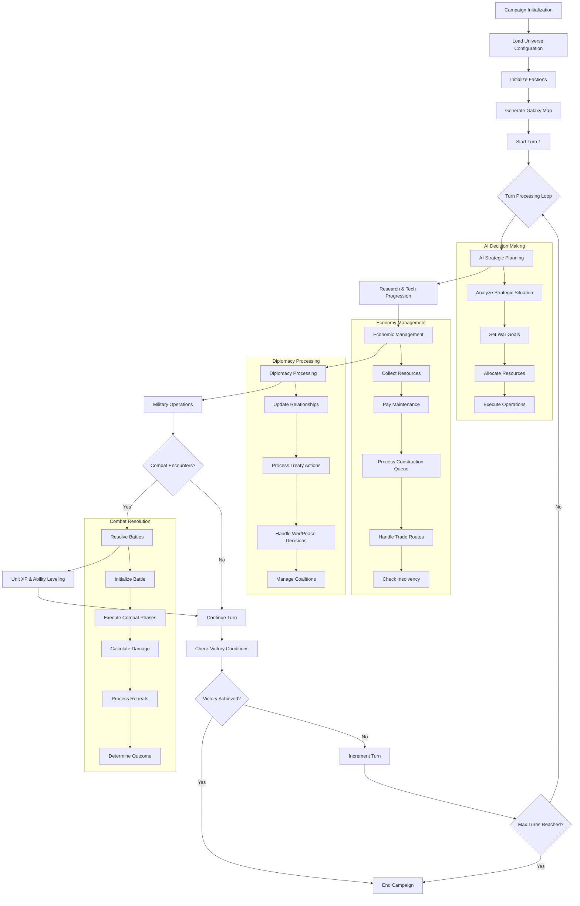
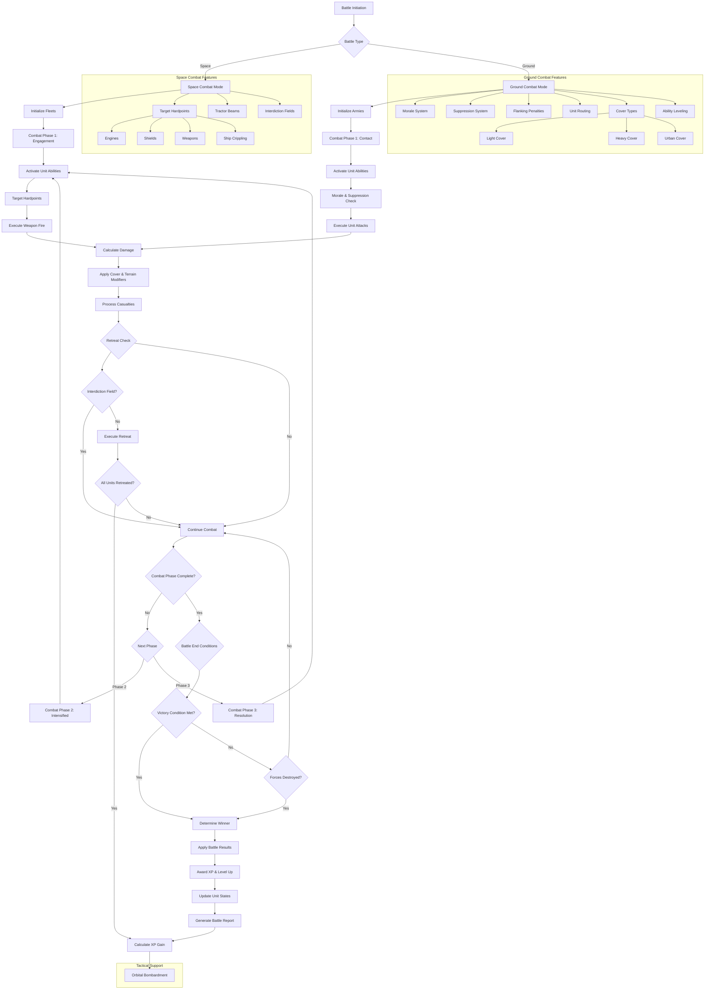
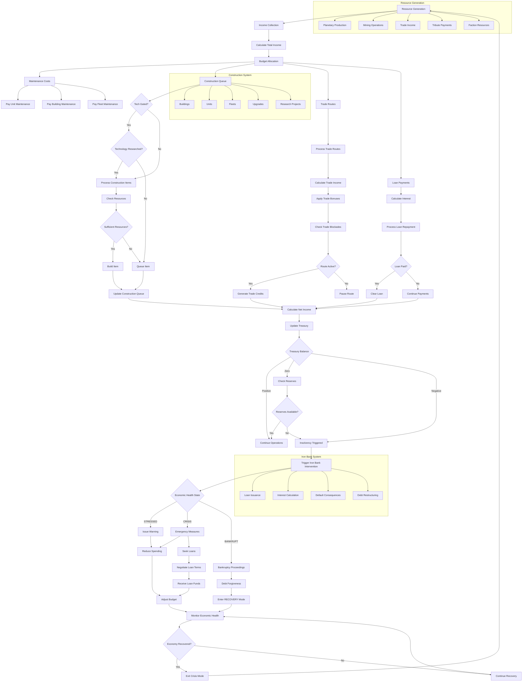
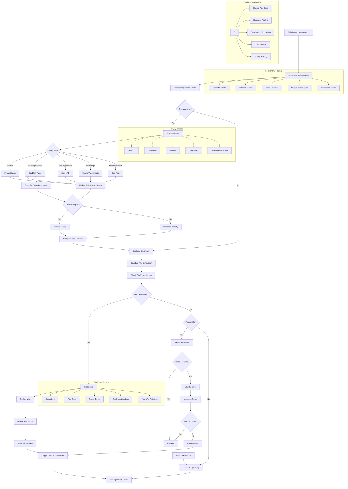

# Multi-Universe Strategy Engine

[](https://www.python.org/)
[](LICENSE)
[](#project-status)
[](#gpu-acceleration)
[](#dashboard)


A complex, text-based 4X strategy engine featuring trait-based faction evolution and professional architectural patterns.

> **The "Gap" in the Python Market**: Unlike simple hobby projects or massive C++ engines, this framework provides a serious, architecturally mature simulation engine in Python, utilizing advanced patterns (Dependency Injection, Managers, Event Bus) for deep economic, diplomatic, and genetic modeling.
>
> **The "Headless" Advantage**: This is not a "game engine" in the graphical sense, but a **Headless 4X Simulation Framework**. It is designed for technical users interested in AI Training (Reinforcement Learning), Data Science (Campaign Analytics), and robust Backend Logic for web-based strategy games.

## Table of Contents

- [Overview](#overview)
- [Quick Reference](#quick-reference)
- [Core Features](#core-features)
- [System Architecture](#system-architecture)
- [Terminal Dashboard](#terminal-dashboard)
- [GPU Acceleration](#gpu-acceleration)
- [Analytics Engine](#analytics-engine)
- [AI System](#ai-system)
- [Project Structure](#project-structure)
- [Testing](#testing)
- [Docker Deployment](#docker-deployment)
- [Contributing](#contributing)
- [Documentation](#documentation)
- [Project Status](#project-status)

## Overview

The **Multi-Universe Strategy Engine** is a sophisticated grand strategy campaign simulator / 4X game engine built around the **Void Reckoning** universe—a science fiction setting featuring ten unique factions engaged in galactic warfare.

### Core Philosophy

The engine follows a **multi-universe architecture** where the core simulation layer remains universe-agnostic, while universe-specific assets, rules, and AI behaviors are loaded dynamically from the `universes/` directory. This enables easy addition of new game universes without modifying the core engine.

### Real-Time Simulation Architecture

The engine uses a high-frequency real-time resolution for battles, allowing for complex interactions between units, environments, and tactical support layers. Combat can be resolved using efficient calculation modes optimized for different simulation scales:

- **Efficient Resolution**: Uses raw health and damage values for massive-scale simulations.
- **Detailed Resolution**: High-fidelity combat with integrated tactical systems for hyper-detailed resolution with GPU acceleration.

## Quick Reference

| Command | Description |
|---------|-------------|
| `python run.py` | Launch interactive menu (11 options) |
| `python run.py campaign --universe void_reckoning` | Run campaign simulation |
| `python run.py dashboard` | Launch Terminal Dashboard (Demo Batch) |
| `python run.py simulate --mode duel` | Run tactical combat |
| `python run.py validate` | Validate configurations |
| `pytest` | Run test suite |
| `docker-compose up -d` | Deploy with Docker |

## Core Features

### Strategic Systems

- ⚔️ **Ten Unique Factions**: Templars of the Flux, Transcendent Order, Steel-Bound Syndicate, Bio-Tide Collective, Algorithmic Hierarchy, Nebula Drifters, Aurelian Hegemony, Void-Spawn Entities, Scrap-Lord Marauders, Primeval Sentinels
- 🧠 **Adaptive AI**: Strategic planner, theater manager (Multi-front coordination), economic engine (RECOVERY mode), intelligence coordinator, personality manager
- 🌀 **Portal System (Experimental)**: Interstellar travel through portal networks and queue-based fleet transfers. Currently in active development across parallel galaxies.
- 🚁 **Task Force Management**: AI fleet coordination with SCOUT, RAID, DEF, ASSAULT types
- 🏆 **Victory Conditions**: Flexible victory states including Conquest, Elimination, and Defender Survival.

### Combat Systems

- 🚀 **Real-Time Battle Simulator**: High-fidelity, physics-based combat resolution with integrated space and ground layers.
- 🌌 **Empire at War Style Space Combat**: Tactical fleet engagements featuring targetable **Hardpoints** (Engines, Shields, Weapons) and ship crippling mechanics.
- 🪖 **Total War Style Ground Combat**: Scale-based planetary warfare with **Morale & Suppression** systems, flanking penalties, and unit routing.
- 🎯 **Tactical Support**: Off-map **Orbital Bombardment** provided by fleets in orbit to ground units.
- 🛡️ **Cover & Terrain**: Dynamic cover system (Light/Heavy) affecting unit survival and mitigating damage.

- 🎲 **Faction Mechanics**: Unique resource systems and 11+ ability types synchronized with real-time state.
- 🏗️ **Modular Ship Design**: **Stellaris/Thrawn's Revenge Style** architecture with Bow/Core/Stern sections and specialized slot types (S/M/L/X/P/G/H).
- 🧬 **Research & Tech Tree**: **Stellaris-Style** card draw system with **Hull & Unit Tech Locks**, ensuring that advanced ship classes and ground units (e.g., Heavy Walkers, Titans) require dedicated research. Features infinite procedural tech scaling and RP-based progression.
- 🧲 **Specialized Utility Modules**: Advanced ship roles including **Tractor Beams** (gravitational slowing) and **Interdiction Fields** (warp-suppression to prevent enemy retreat), supported by dedicated `T` and `I` slot architectures.
- 🌟 **Unit Ability Progression**: Dynamic combat experience system where units gain XP and level up, unlocking or improving faction-specific abilities over time.
- 🔫 **Unified Weapon Database**: Cross-Universe schema integrating Warhammer 40k, Star Wars, and Star Trek weapon archetypes.

### Performance & Analytics

- 🚀 **GPU Acceleration**: Full CuPy support with automatic CUDA detection, multi-GPU support, and device selection strategies
- ⚡ **Parallel Execution**: Simulate multiple campaign scenarios simultaneously on dedicated CPU cores
- 📊 **Analytics Engine**: Economic health analysis, military efficiency tracking, industrial analysis, research analytics with predictive modeling
- 🔔 **Alert System**: Real-time alerts with severity levels (CRITICAL, WARNING, INFO) triggered by anomaly detection
- 📡 **Telemetry System**: Comprehensive event tracking with real-time metrics aggregation

### User Interface

- 🎮 **Terminal Dashboard**: High-performance, low-latency CLI visualization for real-time campaign monitoring and batch results.
- 💻 **15 CLI Commands**: Comprehensive simulation control via command-line interface
- 🖥️ **Interactive Menu**: 11-option menu system for easy access to all features

### Developer Tools

- 🐳 **Docker Support**: Multi-stage Dockerfile for FastAPI backend + React frontend with Docker Compose configuration
- 📂 **70+ Utility Scripts**: Maintenance and analysis tools in `scripts/` and `tools/`
- 🧪 **Comprehensive Testing**: pytest with specific markers for targeted verification
- 📚 **Extensive Documentation**: 30+ markdown files covering all aspects of the engine

## System Architecture

### Software Architecture

The engine has been refactored to use a modular, decoupled architecture:

- **Service Locator**: Centralized dependency injection (`src/core/service_locator.py`).
- **Repository Pattern**: Data access abstraction for Factions, Fleets, Planets, and Units (`src/repositories/`).
- **Command Pattern**: Encapsulated actions with Undo/Redo support (`src/commands/`).
- **Event Bus**: Decoupled event-driven communication (`src/core/event_bus.py`).

### Gameplay Loop Flowchart

The following flowchart illustrates the complete gameplay loop from campaign initialization to victory conditions:



### Combat System Flowchart

The following flowchart illustrates the combat resolution process from battle initiation to victory/defeat outcomes:



### Economy Flowchart

The following flowchart illustrates the economic system from resource generation to insolvency handling:



### Diplomacy Flowchart

The following flowchart illustrates the diplomacy system from relationship management to war/peace decisions:



## Installation

### Prerequisites

- **Python 3.7+** (tested up to 3.11)
- **CUDA Toolkit 11.x, 12.x, or 13.x** (for GPU acceleration)
- **NVIDIA GPU** with Compute Capability 7.0+ (for GPU acceleration)
- **Node.js 18+** (for frontend development)

### Step 1: Install Core Dependencies

```bash
pip install -r requirements.txt
```

### Step 2: Install GPU Dependencies (Optional)

For GPU acceleration, install the appropriate CuPy package for your CUDA version:

```bash
# For CUDA 11.x
pip install cupy-cuda11x

# For CUDA 12.x
pip install cupy-cuda12x
```

If no GPU is available, the engine will automatically fall back to NumPy.

### Step 3: Install Development Dependencies (Optional)

```bash
pip install -r requirements-dev.txt
```

### Step 4: Install Console Alias (Optional)

```bash
pip install -e .
```

This enables the `sim-engine` console command as an alternative to `python run.py`.

### Step 5: Install Frontend Dependencies

```bash
cd frontend
npm install
cd ..
```

## Quickstart

### 1. Launch Interactive Menu

```bash
python run.py
```

The interactive menu provides 11 options:

| Option | Description |
|--------|-------------|
| 0 | Quit |
| 1 | Quick Campaign (30-turn simulation) |
| 2 | Batch Campaign (100-run simulation) |
| 3 | Multi-Universe Parallel Simulation |
| 4 | Tactical Combat (Duel, Royale, Fleet Battles) |
| 5 | Data Validation |
| 6 | Select Active Universe |
| 7 | Cross-Universe Duel (1v1) |
| 8 | Multi-Universe Fleet Battle (Mixed) |
| 9 | Launch Live Dashboard |
| 10 | Custom Report Export |

### 2. Run a Campaign

```bash
# Quick campaign
python run.py campaign --universe void_reckoning --quick

# With GPU acceleration
python run.py campaign --universe void_reckoning --gpu --gpu-strategy auto
```

### 3. Launch Dashboard

```bash
# Terminal 1: Start backend
python run.py dashboard --universe void_reckoning --port 8000

# Terminal 2: Start frontend
cd frontend && npm run dev
```

### 4. Run Tactical Combat

```bash
# 1v1 duel
python run.py simulate --mode duel --units "Templar Initiate" "Bio-Morph Ravager" --universe void_reckoning

# Fleet battle
python run.py simulate --mode fleet --faction1 Templars_of_the_Flux --faction2 BioTide_Collective
```

### 5. Validate Configuration

```bash
python run.py validate --universe void_reckoning
```

## Void Reckoning Factions

The Void Reckoning universe features ten distinct factions, each with unique doctrines, units, and strategic capabilities:

| Faction | Playstyle | Key Strengths |
| :--- | :--- | :--- |
| **Templars of the Flux** | Religious Warriors | Fanatical morale, heavy infantry, orbital bombardment |
| **Transcendent Order** | Psychic Mastery | Telekinetic abilities, mind control, flux manipulation |
| **Steel-Bound Syndicate** | Industrial Might | Heavy armor, mass production, siege warfare |
| **Bio-Tide Collective** | Biological Horde | Rapid reproduction, swarm tactics, biological weapons |
| **Algorithmic Hierarchy** | Technological Supremacy | Advanced robotics, hacking, drone swarms |
| **Nebula Drifters** | Raiders & Pirates | Hit-and-run tactics, stealth, boarding actions |
| **Aurelian Hegemony** | Diplomatic Empire | Trade networks, allied fleets, shield technology |
| **Void-Spawn Entities** | Dimensional Invaders | Teleportation, corruption, dark energy weapons |
| **Scrap-Lord Marauders** | Resource Scavengers | Salvage mechanics, improvised weapons, survival tactics |
| **Primeval Sentinels** | Precursor Civilization | Ancient technology, time manipulation, powerful artifacts |

### Faction-Specific Resources

Each faction has unique resources that drive their mechanics:

- **Conviction** (Templars): Gained through combat, spent on powerful abilities
- **Flux Energy** (Transcendent): Generated by resonators, used for psychic powers
- **Industrial Capacity** (Steel-Bound): Built through factories, used for production
- **Biomass** (Bio-Tide): Gained by consuming enemies, used for reproduction
- **Processing Power** (Algorithmic): Generated by data centers, used for hacking
- **Salvage** (Nebula Drifters): Gained by raiding, used for repairs
- **Trade Credits** (Aurelian Hegemony): Generated by trade, used for alliances
- **Corruption** (Void-Spawn): Spread by entities, used for dark powers
- **Scrap** (Scrap-Lord): Collected from debris, used for improvisation
- **Time Energy** (Primeval Sentinels): Generated by curators, used for temporal abilities

### Available Universes

The engine supports multiple universes:

- **Void Reckoning** - Science fiction setting with ten unique factions
- **Cosmic Ascendancy** - A diverse galaxy containing Federation, Theocratic, and Cybernetic factions
- **Procedural Sandbox** - Procedurally generated universe for testing

## CLI Commands

The engine supports 15 CLI commands for comprehensive simulation control.

### Command List

| Command | Description |
|---------|-------------|
| `CampaignCommand` | Run campaign simulations with various configurations |
| `SimulateCommand` | Execute tactical combat simulations (duels, royales, fleet battles) |
| `ValidateCommand` | Validate configuration files and registries |
| `ConfigCommand` | Manage and view configuration settings |
| `MultiUniverseCommand` | Run parallel multi-universe simulations |
| `DashboardCommand` | Launch Terminal Dashboard Demo (Batch Simulation) |
| `ValidatePortalsCommand` | Validate portal network topology and connectivity |
| `ListPortalsCommand` | List available portals in the active universe |
| `TestPortalCommand` | Test portal traversal between locations |
| `AnalyzeCommand` | Run analysis tools on simulation data |
| `QueryCommand` | Query simulation reports with advanced filtering |
| `CrossUniverseDuelCommand` | Execute 1v1 duels between units from different universes |
| `CrossUniverseBattleCommand` | Execute fleet battles between different universes |
| `GenerateCommand` | Generate registries and configuration files |
| `ExportCommand` | Export simulation data in various formats |
| `HelpCommand` | Display help information for commands |

### Command Examples

```bash
# Run a campaign with specific universe
python run.py campaign --universe void_reckoning --quick

# Run parallel simulation with custom configuration
python run.py multi-universe --config config/unified_simulation_config.json

# Query simulation reports with advanced filtering
python run.py query --faction Templars_of_the_Flux --category combat --search "Orbital Bombardment"

# Validate configuration files
python run.py validate --universe void_reckoning

# Validate portal network
python run.py validate-portals --universe void_reckoning

# List available portals
python run.py list-portals --universe void_reckoning

# Test portal traversal
python run.py test-portal --source "Templars_of_the_Flux" --destination "BioTide_Collective"

# Duel between specific units
python run.py simulate --mode duel --units "Templar Initiate" "Bio-Morph Ravager" --universe void_reckoning

# Generate registries
python run.py generate --universe void_reckoning

# Launch Terminal Dashboard Demo
python run.py dashboard --universe void_reckoning

# Run with GPU acceleration (auto device selection)
python run.py campaign --universe void_reckoning --gpu --gpu-strategy auto

# Run with specific GPU
python run.py campaign --universe void_reckoning --gpu --gpu-device 0

# Run analytics on simulation results
python run.py export analytics --universe void_reckoning --output-dir reports/exports --formats pdf excel

# Cross-universe duel
python run.py cross-universe-duel --unit1 "void_reckoning:Templars_of_the_Flux:Templar Initiate" --unit2 "custom_universe:Custom_Faction:Custom Warrior"

# Cross-universe fleet battle
python run.py cross-universe-battle --universe1 void_reckoning --universe2 custom_universe --faction1 Templars_of_the_Flux --faction2 Custom_Faction

## Terminal Dashboard

The engine includes a high-fidelity **Terminal Dashboard** optimized for performance and reliability. This is the recommended interface for monitoring long-running simulations and batch campaigns.


### Key Features

- 🚀 **Real-Time Monitoring**: Live turn-by-turn updates for active simulation runs.
- 📊 **Detailed Faction Stats**: Real-time tracking of Economic scores, Star Systems (`Sys`), Planets (`P`), Buildings (`B`), Starbases (`SB`), Fleets (`F`), Armies (`A`), Requisition (`Req`), Tech Level, and Win-Loss ratios.
- 🛡️ **Postures & Diplomacy**: Visual indicators for AI strategic postures (CONQUEST, DEFENSE, BALANCED) and active diplomatic blocs.
- 🌌 **Galactic Summary**: Global tracking of Neutral Worlds, Flux Storms, and total Active Battles.
- 📉 **Batch Summaries**: Aggregated win-count summaries for multi-run batch campaigns.
- ⚡ **Low Overhead**: Minimal performance impact, allowing for full CPU/GPU utilization during complex simulations.

### How to use
The terminal dashboard is automatically activated when running campaigns with the `--batch` or `multi-universe` commands.

```bash
# Run a batch campaign with live dashboard
python run.py campaign --universe void_reckoning --batch --turns 100

# Run a dedicated multi-universe simulation
python run.py multi-universe --config config/void_reckoning_config.json

# Launch a quick demo of the dashboard
python run.py dashboard
```

---

| `/api/research` | Research analytics |
| `/api/runs` | Simulation runs |
| `/api/military` | Military metrics |

## GPU Acceleration

The engine features comprehensive GPU acceleration via **CuPy** with automatic CUDA detection and NumPy fallback.

### GPU Support

- **Automatic Detection**: Detects available CUDA devices and falls back to CPU if no GPU is found
- **Multi-GPU Support**: Support for multiple GPUs with intelligent device selection strategies
- **CUDA Versions**: Support for CUDA 11.x, 12.x, and 13.x

### Device Selection Strategies

| Strategy | Description |
|----------|-------------|
| `auto` | Automatically select the best available device |
| `first` | Use the first available GPU |
| `most_vram` | Select GPU with most VRAM |
| `most_cores` | Select GPU with most CUDA cores |
| `specific` | Use a specific GPU by index |

### GPU-Accelerated Components

- **GPUTracker** (`src/combat/tactical/gpu_tracker.py`): O(n²) distance queries for tactical combat
- **BatchShooting** (`src/combat/batch_shooting.py`): Vectorized combat calculations
- **GPU Utils** (`src/core/gpu_utils.py`): GPU management and device selection utilities

### GPU Usage Example

```python
from src.core.gpu_utils import GPUManager

# Initialize GPU manager with auto selection
gpu_manager = GPUManager(strategy='auto')

# Check GPU availability
if gpu_manager.is_available():
    print(f"Using GPU: {gpu_manager.get_device_info()}")
else:
    print("No GPU available, using CPU")

# Use GPU for calculations
result = gpu_manager.compute_on_gpu(data)
```

### Check GPU Availability

```bash
python -c "from src.core.gpu_utils import GPUManager; print(GPUManager().get_device_info())"
```

## Analytics Engine

The comprehensive analytics orchestrator (`src/reporting/analytics_engine.py`) provides deep insights into simulation performance and faction behavior.

### Core Analytics

- **Economic Health Analysis**: Track resource production, consumption, and economic stability
- **Military Efficiency Tracking**: Monitor combat effectiveness, unit performance, and strategic outcomes
- **Industrial Analysis**: Analyze production capacity, infrastructure utilization, and building efficiency
- **Research Analytics**: Track technology progress, research efficiency, and breakthrough patterns
- **Infinite Research**: Procedural generation of post-peak technologies (e.g., Lasers XI, Railguns XIV)

### Predictive Analytics

- **Victory Probability Forecasting**: Machine learning models predict faction victory chances
- **Trend Analysis**: Identify long-term patterns and emerging strategies
- **Performance Projections**: Forecast future resource and military capabilities

### Anomaly Detection

- **Resource Spikes**: Detect unusual resource production or consumption
- **Military Inefficiency**: Identify underperforming units or strategies
- **Idle Infrastructure**: Detect unused or underutilized production capacity
- **Research Stagnation**: Alert when research progress stalls

### Alert Integration

The analytics engine automatically triggers alerts when anomalies are detected, with severity levels (CRITICAL, WARNING, INFO) routed through the alert management system.

## AI System

The AI system has been significantly enhanced with new components for more strategic and adaptive behavior.

### AI Components

- **Strategic Planner** (`src/ai/strategic_planner.py`): High-level strategic decision-making with defined war goals
- **Theater Manager** (`src/ai/theater_manager.py`): Multi-front operations with theater-level strategic planning
- **Economic Engine** (`src/ai/economic_engine.py`): Monitors and manages faction economic health
- **Intelligence Coordinator** (`src/ai/coordinators/intelligence_coordinator.py`): Manages espionage and intelligence operations
- **Personality Manager** (`src/ai/coordinators/personality_manager.py`): Handles dynamic faction personality loading and adaptation

### War Goals

| War Goal | Description |
|----------|-------------|
| `CONQUER_FACTION_X` | Focus on eliminating a specific faction |
| `SECURE_REGION_Y` | Consolidate control over a strategic region |
| `RAID_ECONOMY` | Conduct economic raids to disrupt enemies |
| `CONSOLIDATE_HOLDINGS` | Strengthen existing territory and infrastructure |
| `MULTI_FRONT_COORDINATION` | Coordinate operations across multiple theaters |

### Economic Health States

| Health State | Description |
|--------------|-------------|
| `HEALTHY` | Economy is stable and growing |
| `STRESSED` | Economy is under pressure but manageable |
| `CRISIS` | Economy is in serious trouble |
| `BANKRUPT` | Economy has collapsed (Triggers Iron Bank intervention) |
| `RECOVERY` | Post-bankruptcy stabilization mode with debt forgiveness protocols |

### Theater Doctrines

- **DEFEND**: Defensive posture, focus on holding territory
- **ATTACK**: Aggressive posture, focus on expanding territory
- **EXPAND**: Expansionist posture, focus on colonizing new systems
- **SIEGE**: Siege posture, focus on wearing down enemy defenses
- **BLITZ**: Blitzkrieg posture, focus on rapid, overwhelming attacks

### Personality Adaptation

The AI adapts its behavior based on:

- **Performance Tracking**: Records win/loss ratios, strategy effectiveness
- **Personality Adjustment**: Adjusts aggression, diplomacy, economic focus
- **Learning Rate**: Configurable speed of adaptation

| Parameter | Range | Effect |
|-----------|-------|--------|
| **Aggression** | 0.0 - 1.0 | Higher = more offensive actions |
| **Diplomacy** | 0.0 - 1.0 | Higher = more alliances/trade |
| **Economic Focus** | 0.0 - 1.0 | Higher = more resource investment |
| **Risk Tolerance** | 0.0 - 1.0 | Higher = bolder strategies |

## Project Structure

```
multi-universe-simulator/
├── config/                      # Configuration files
│   ├── active_universe.txt      # Active universe selection
│   ├── alert_rules.yaml         # Alert system rules
│   ├── analytics_config.yaml    # Analytics engine configuration
│   ├── balance_config.json      # Game balance settings
│   ├── dashboard_config.json    # Dashboard configuration
│   ├── void_reckoning_config.json
│   └── portals/                 # Portal network examples
├── data/                        # Static data files
├── docker/                      # Docker configuration
│   ├── Dockerfile.dashboard
│   └── docker-compose.yml
├── docs/                        # Documentation (30+ files)
├── frontend/                    # React + TypeScript frontend
│   ├── package.json
│   ├── vite.config.ts
│   └── src/
├── logs/                        # Log files
├── reports/                     # Simulation reports
├── scripts/                     # Utility scripts
├── src/                         # Source code
│   ├── ai/                      # AI components
│   ├── analysis/                # Analysis tools
│   ├── combat/                  # Combat system
│   ├── core/                    # Core systems
│   ├── managers/                # System managers
│   ├── reporting/               # Reporting and analytics
│   │   └── dashboard_v2/        # Dashboard v2
│   └── ...
├── tests/                       # Test suite
├── tools/                       # Power tools
├── universes/                   # Universe configurations
│   └── void_reckoning/
├── requirements.txt             # Python dependencies
├── requirements-dev.txt         # Development dependencies
├── run.py                       # Main entry point
└── README.md                    # This file
```

## Testing

We use `pytest` with specific markers for targeted verification.

### Run All Tests

```bash
pytest
```

### Run Specific Test Categories

```bash
pytest -m void_reckoning    # Void Reckoning specific tests
pytest -m multi_universe     # Multi-universe tests
pytest -m universe           # General universe tests
pytest -m performance        # Performance regression benchmarks
pytest -m integration        # Full data layer integration tests
pytest -m gpu                # GPU-specific tests
pytest -m analytics          # Analytics engine tests
pytest -m dashboard          # Dashboard tests
```

### Run with Coverage

```bash
pytest --cov=src --cov-report=html
```

### GPU Testing

```bash
# Test GPU availability
python -c "from src.core.gpu_utils import GPUManager; print(GPUManager().is_available())"

# Run GPU combat flow tests
pytest tests/test_gpu_combat_flow.py -v

# Run multi-GPU tests
pytest tests/test_multi_gpu.py -v
```

### Integration Tests

```bash
# Test GPU movement
pytest tests/benchmarks/test_gpu_movement_scaling.py -v

# Test GPU synthesis
pytest tests/test_synthesis_layer.py -v

# Test portal system
pytest tests/test_portal_system.py -v

# Test multi-universe runner
pytest tests/test_multi_universe_runner.py -v
```

## Docker Deployment

The project includes Docker support for easy deployment of the dashboard.

### Build and Start Services

```bash
docker-compose up -d
```

### View Logs

```bash
docker-compose logs -f dashboard
```

### Stop Services

```bash
docker-compose down
```

### Services

| Service | Description | Ports |
|---------|-------------|-------|
| `dashboard` | FastAPI backend with React frontend | 8000 |

### Volumes

The following volumes are mounted for persistence and development:

- `./universes:/app/universes` - Universe configurations
- `./config:/app/config` - Configuration files
- `./reports:/app/reports` - Simulation reports
- `./src:/app/src` - Source code (development)
- `./frontend/dist:/app/frontend/dist` - Built frontend assets

## Contributing

Please see [CONTRIBUTING.md](docs/CONTRIBUTING.md) for guidelines.

### Development Guidelines

- Follow PEP 8 style guidelines
- Write tests for new features
- Update documentation for API changes
- Use type hints where appropriate
- Run tests before submitting pull requests

### Reporting Issues

Please report bugs and feature requests via GitHub Issues with:

- Clear description of the issue
- Steps to reproduce
- Expected vs actual behavior
- Environment details (Python version, OS, etc.)

## Documentation

Comprehensive documentation is available in the [`docs/`](docs/) directory.

### Core Systems

- [Analysis Systems](docs/ANALYSIS_SYSTEMS.md)
- [Data Pipeline](docs/DATA_PIPELINE.md)
- [Project Structure](docs/PROJECT_STRUCTURE.md)
- [Script Status](docs/SCRIPT_STATUS.md)
- [Dashboard Architecture](docs/DASHBOARD_ARCHITECTURE.md)
- [WebSocket API](docs/WEBSOCKET_API.md)
- [GPU Acceleration](docs/GPU_ACCELERATION.md)
- [Analytics Engine](docs/ANALYTICS_ENGINE.md)
- [Game Loop](docs/GAME_LOOP.md)

### Guides & Tutorials

- [Full CLI Guide](docs/CLI_GUIDE.md)
- [Migration Guide](docs/MIGRATION_GUIDE.md)
- [Tools Index](docs/TOOLS_INDEX.md)
- [Game Import Guide](docs/GAME_IMPORT_GUIDE.md)
- [Multi-Universe Guide](docs/MULTI_UNIVERSE_GUIDE.md)
- [Dashboard Guide](docs/dashboard_guide.md)
- [Docker Deployment](docs/Docker_DEPLOYMENT.md)

### Reference

- [Faction Quirks](docs/FACTION_QUIRKS.md)
- [Cross-Universe Combat](docs/CROSS_UNIVERSE_COMBAT.md)
- [Performance](docs/PERFORMANCE.md)
- [Testing](docs/TESTING.md)
- [Gap Analysis](docs/GAP_ANALYSIS_WHITE_PAPER.md)
- [Error Codes](docs/ERROR_CODES.md)
- [Alert System](docs/alert_system.md)

### White Papers

- [Multi-Universe Strategy Engine](docs/MULTI_UNIVERSE_STRATEGY_ENGINE_WHITE_PAPER.md)
- [Mechanical Emulator](docs/MECHANICAL_EMULATOR_WHITE_PAPER.md)
- [Universe Creation Guide](docs/UNIVERSE_CREATION_GUIDE.md)

## Project Status

**Current Version**: `0.1.0` (Alpha)

### Completed Features

- [x] Multi-Core Parallel Simulation Runner
- [x] Ten Void Reckoning Factions Implemented
- [x] Real-Time Dashboard with WebSocket Streaming
- [x] Portal System with Reality Anchors
- [x] Diplomacy System
- [x] Faction Quirks System
- [x] GPU Acceleration with CuPy
- [x] Analytics Engine with Predictive Analytics
- [x] Dashboard v2 (FastAPI + React)
- [x] AI Strategic Planner and Economic Engine
- [x] Cross-Universe Combat System
- [x] Alert and Telemetry Systems
- [x] Docker Support
- [x] Real-Time Battle Engine (EaW/Total War Style)
- [x] Subsystem Hardpoint & Crippling System
- [x] Unit Morale, Suppression, and Routing
- [x] Orbital Bombardment Support Phase
- [x] Dynamic Tactical Grid with Cover Mechanics
- [x] Ability System with 11+ Real-Time Payload Types
- [x] Task Force Management (SCOUT, RAID, DEF, ASSAULT)
- [x] Mission Manager with Victory Conditions
- [x] Physics Calibration System
- [x] Portal Handoff & Reality Anchor System
- [x] Theater Manager for Multi-Front Operations
- [x] AI Strategic Planner & Personality Manager
- [x] CPU Affinity & Parallel Runner Optimization
- [x] **Massive Ship Expansion**: 11+ Hulls (Corvettes to Mobile Fortresses), Modular Sections, and Hardpoints
- [x] **Unified Weapon Database**: Cross-Universe Schema (W40k, Star Wars, Star Trek)
- [x] **Research Overhaul**: Stellaris-Style Tech Card System & Hull Tech Locks
- [x] **Starbase Overhaul**: Higher HP, Critical Defensive Roles, and Faction Logic
- [x] **Faction Tag Consistency**: Unified Naming Standards (TPL, PRM) in Dashboards

### Planned Features

- [ ] Custom Universe Template Generator

- [ ] Save/Load System

- [ ] Additional Universes

## License

This project is licensed under the **MIT License**. See [LICENSE](LICENSE) for details.

---

*Built with Pure Python - The Multi-Universe Strategic Engine.*
