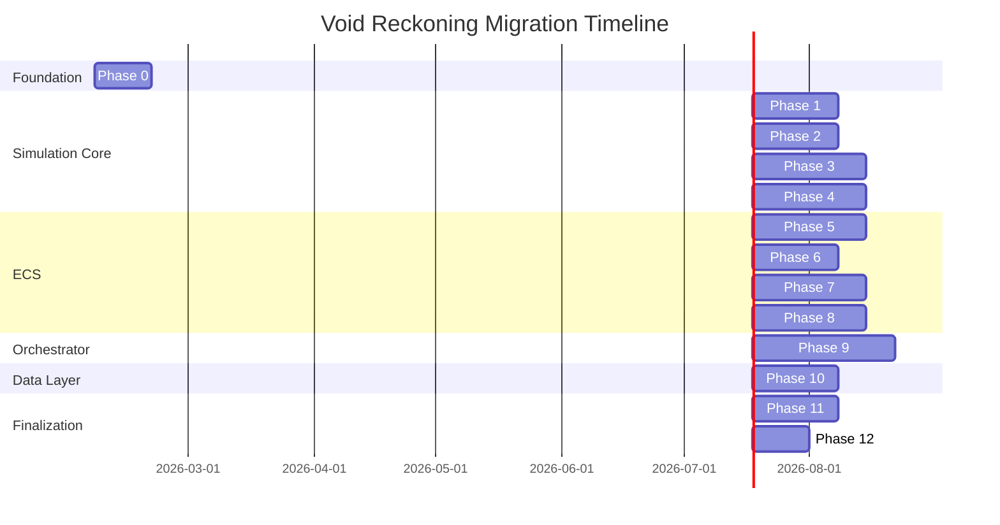
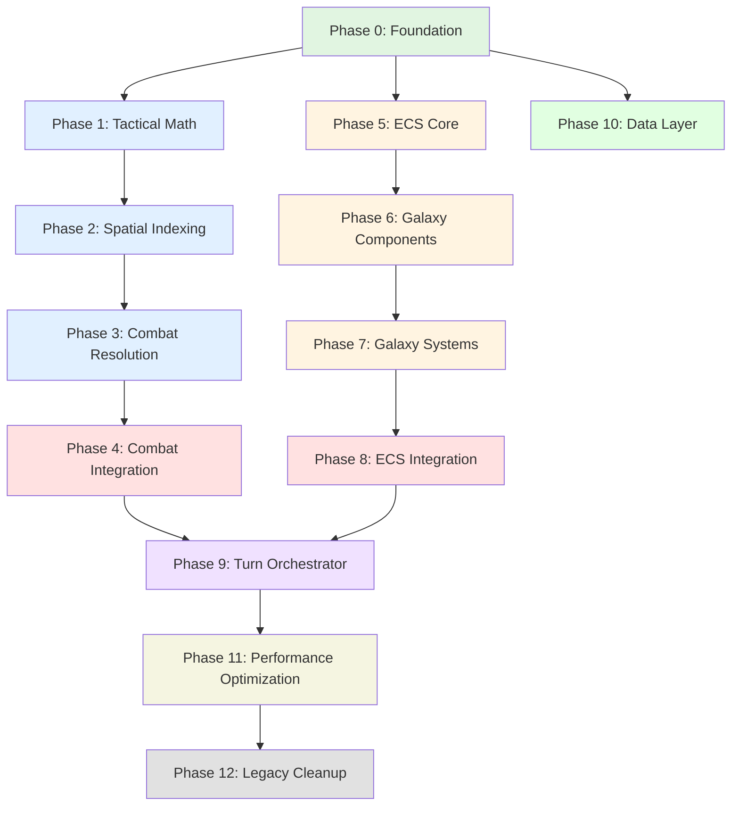
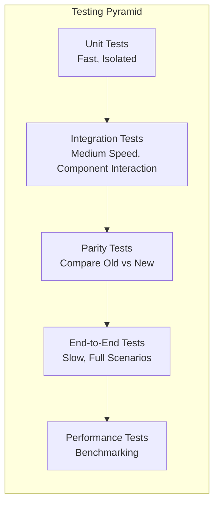

# Void Reckoning: Polyglot Architecture Redesign
## Migration Phases Plan

**Document Version:** 1.0  
**Date:** 2026-02-06  
**Status:** Planning Phase

---

## Table of Contents

1. [Phase Overview](#phase-overview)
2. [Migration Order Rationale](#migration-order-rationale)
3. [Detailed Phase Breakdown](#detailed-phase-breakdown)
4. [Migration Timeline Visualization](#migration-timeline-visualization)
5. [Risk Mitigation](#risk-mitigation)

---

## Phase Overview

This document outlines a phased migration strategy for transitioning Void Reckoning from a pure Python codebase to a polyglot architecture. The migration is designed to be incremental, testable, and minimally disruptive to ongoing development.

### Migration Phases at a Glance

| Phase | Name | Primary Focus | Language | Estimated Complexity |
|-------|------|---------------|----------|---------------------|
| 0 | Foundation & Infrastructure | Build system, schemas, tooling | N/A | Low |
| 1 | Tactical Math Core | Ballistics, damage, hit calculations | Rust | Medium |
| 2 | Spatial Indexing | Grid, quadtree, partitioning | Rust | Medium |
| 3 | Combat Resolution Core | Combat phases, rounds, outcomes | Rust | High |
| 4 | Combat Integration | Python-Rust FFI, feature flags | Rust + Python | High |
| 5 | ECS Core | World, entity, component infrastructure | Rust | High |
| 6 | Galaxy Components | Position, health, faction, combat components | Rust | Medium |
| 7 | Galaxy Systems | Movement, combat, economy systems | Rust | High |
| 8 | ECS Integration | Python-Rust FFI, state sync | Rust + Python | High |
| 9 | Turn Orchestrator | Sequential faction turn processing | Python | High |
| 10 | Data Layer | SQLite persistence, Parquet analytics | SQLite/Parquet | Medium |
| 11 | Performance Optimization | Benchmarking, profiling, optimization | All | Medium |
| 12 | Legacy Cleanup | Remove deprecated code, documentation | N/A | Low |

### Key Migration Milestones

1. **Milestone 1 (End of Phase 3)**: Rust Simulation Core complete and tested
2. **Milestone 2 (End of Phase 4)**: Combat system fully migrated to Rust with Python wrapper
3. **Milestone 3 (End of Phase 7)**: ECS Galaxy State complete and tested
4. **Milestone 4 (End of Phase 9)**: Turn Orchestrator fully functional with polyglot architecture
5. **Milestone 5 (End of Phase 10)**: Data layer migration complete
6. **Milestone 6 (End of Phase 12)**: Full migration complete, legacy code removed

---

## Migration Order Rationale

### Why This Sequence?

The migration order follows these strategic principles:

1. **Bottom-Up Approach**: Start with foundational components (math, spatial) that have no dependencies
2. **Low-Risk First**: Migrate isolated, well-contained modules before complex interconnected systems
3. **Testability Priority**: Each phase produces working, testable code
4. **Parallel Development**: New code exists alongside legacy code during transition
5. **Incremental Value**: Each phase delivers tangible performance or architectural improvements

### Detailed Rationale

#### Phase 0: Foundation First
- **Why**: Establishes the build infrastructure, shared schemas, and tooling needed for all subsequent phases
- **Risk**: Low - no code changes to existing functionality
- **Value**: Enables all future phases to proceed smoothly

#### Phases 1-3: Simulation Core (Rust)
- **Why**: These are the most performance-critical, isolated components
- **Dependencies**: None - pure mathematical calculations
- **Risk**: Medium - new language, but isolated scope
- **Value**: Immediate performance gains for combat calculations

#### Phase 4: Combat Integration
- **Why**: Connects Rust core to Python via FFI
- **Dependencies**: Requires Phases 1-3 to be complete
- **Risk**: High - FFI complexity, potential serialization issues
- **Value**: First major polyglot integration milestone

#### Phases 5-7: ECS Galaxy State (Rust)
- **Why**: ECS provides the entity management foundation for the entire game state
- **Dependencies**: Can proceed in parallel with Phase 4
- **Risk**: High - complex architecture change
- **Value**: Scalable entity management, cache-friendly data layout

#### Phase 8: ECS Integration
- **Why**: Connects ECS to Python orchestrator
- **Dependencies**: Requires Phases 5-7 to be complete
- **Risk**: High - state synchronization complexity
- **Value**: Enables the new entity system to be used from Python

#### Phase 9: Turn Orchestrator (Python)
- **Why**: Python remains the orchestrator language - this phase refactors existing code
- **Dependencies**: Requires Phase 8 (ECS integration) and Phase 4 (combat integration)
- **Risk**: High - core game logic refactoring
- **Value**: Clean separation of concerns, maintains Total War sequential turn style

#### Phase 10: Data Layer
- **Why**: Data persistence can be migrated independently of logic
- **Dependencies**: Minimal - can proceed in parallel with later phases
- **Risk**: Medium - data migration complexity
- **Value**: Improved analytics capabilities, better query performance

#### Phase 11: Performance Optimization
- **Why**: Once all components are migrated, optimize based on real benchmarks
- **Dependencies**: Requires all previous phases
- **Risk**: Low - optimization is additive
- **Value**: Final performance tuning

#### Phase 12: Legacy Cleanup
- **Why**: Remove deprecated code once migration is verified
- **Dependencies**: Requires all previous phases
- **Risk**: Low - cleanup only
- **Value**: Cleaner codebase, reduced maintenance burden

### Maintaining Total War Sequential Turn Style

The Total War style sequential faction turn process is preserved throughout migration:

- **Phase 9 (Turn Orchestrator)** explicitly designs the Python orchestrator to maintain this pattern
- **State synchronization** between Python and ECS ensures turn state is properly managed
- **Feature flags** allow gradual transition from legacy to new implementation
- **Integration tests** verify turn-by-turn parity between old and new systems

---

## Detailed Phase Breakdown

### Phase 0: Foundation & Infrastructure

**Duration**: 1-2 weeks  
**Complexity**: Low  
**Risk**: Low

#### Goals
1. Establish polyglot build system (Cargo, CMake, pyproject.toml)
2. Create shared schema definitions (Protocol Buffers)
3. Set up development tooling and CI/CD pipelines
4. Create project directory structure

#### Components Being Created
- Build configuration files (`Cargo.toml`, `CMakeLists.txt`, `pyproject.toml`)
- Protocol buffer definitions (`schema/protobuf/`)
- JSON schemas (`schema/json_schema/`)
- Build scripts (`scripts/build.sh`, `scripts/build.bat`)
- CI/CD configuration

#### Prerequisites
- None

#### Success Criteria
- [ ] `cargo build --workspace` succeeds
- [ ] `maturin develop --release` succeeds
- [ ] Protocol buffer compilation generates bindings for all languages
- [ ] CI/CD pipeline runs successfully
- [ ] All existing Python tests still pass (no code changes yet)

#### Testing Strategy
- Build system tests
- Schema validation tests
- Cross-language type mapping verification

#### Rollback Strategy
- Delete new build files and schemas
- No code changes to rollback

#### Deliverables
- Working polyglot build system
- Shared schema definitions
- CI/CD pipeline configuration

---

### Phase 1: Tactical Math Core

**Duration**: 2-3 weeks  
**Complexity**: Medium  
**Risk**: Medium

#### Goals
1. Implement tactical mathematical calculations in Rust
2. Create Python bindings via PyO3
3. Establish testing patterns for Rust code
4. Set up benchmarking infrastructure

#### Components Being Migrated
- Ballistics calculations (`src/combat/calculators/combat_calculator.py` → `rust/simulation_core/src/tactical/ballistics.rs`)
- Damage resolution calculations
- Hit chance calculations
- Damage modifiers

#### Prerequisites
- Phase 0 complete

#### Success Criteria
- [ ] All tactical math functions implemented in Rust
- [ ] Python bindings expose all required functions
- [ ] Unit tests pass with >90% coverage
- [ ] Benchmarks show >=2x performance improvement over Python
- [ ] Parity tests confirm identical results to Python implementation

#### Testing Strategy
- Unit tests for each mathematical function
- Parity tests comparing Rust vs Python outputs
- Property-based tests for mathematical correctness
- Performance benchmarks

#### Rollback Strategy
- Feature flag to use Python implementation
- Rust module remains unused if disabled
- No changes to existing Python code

#### Deliverables
- `rust/simulation_core/src/tactical/` module
- Python bindings in `bindings/python/simulation_core/`
- Test suite with parity verification
- Benchmark results

---

### Phase 2: Spatial Indexing

**Duration**: 2-3 weeks  
**Complexity**: Medium  
**Risk**: Medium

#### Goals
1. Implement spatial data structures in Rust
2. Create Python bindings for spatial queries
3. Optimize for large-scale fleet and unit positioning
4. Support both galactic and tactical scales

#### Components Being Migrated
- Spatial grid implementation (`src/combat/spatial_partition.py` → `rust/simulation_core/src/spatial/grid.rs`)
- Quadtree indexing
- Spatial partitioning
- Spatial queries (range, nearest neighbor, collision detection)

#### Prerequisites
- Phase 0 complete
- Phase 1 complete (for vector math utilities)

#### Success Criteria
- [ ] All spatial data structures implemented in Rust
- [ ] Python bindings expose query interfaces
- [ ] Unit tests pass with >90% coverage
- [ ] Benchmarks show >=3x performance improvement
- [ ] Parity tests confirm identical query results
- [ ] Supports both galactic-scale (light-years) and tactical-scale (meters) coordinates

#### Testing Strategy
- Unit tests for each data structure
- Parity tests comparing Rust vs Python query results
- Stress tests with 10,000+ entities
- Performance benchmarks for different query types

#### Rollback Strategy
- Feature flag to use Python implementation
- Rust module remains unused if disabled
- No changes to existing Python code

#### Deliverables
- `rust/simulation_core/src/spatial/` module
- Python bindings for spatial queries
- Test suite with stress testing
- Benchmark results

---

### Phase 3: Combat Resolution Core

**Duration**: 3-4 weeks  
**Complexity**: High  
**Risk**: High

#### Goals
1. Implement combat resolution engine in Rust
2. Support both space and ground combat
3. Integrate tactical math and spatial indexing
4. Maintain all existing combat mechanics

#### Components Being Migrated
- Combat resolution engine (`src/combat/combat_simulator.py` → `rust/simulation_core/src/combat/resolver.rs`)
- Combat phase management (`src/combat/combat_phases.py` → `rust/simulation_core/src/combat/phases.rs`)
- Round-based combat (`src/combat/round_management.py` → `rust/simulation_core/src/combat/rounds.rs`)
- Outcome generation (`src/combat/outcomes.py` → `rust/simulation_core/src/combat/outcomes.rs`)

#### Prerequisites
- Phase 0 complete
- Phase 1 complete (tactical math)
- Phase 2 complete (spatial indexing)

#### Success Criteria
- [ ] Combat resolution engine implemented in Rust
- [ ] All combat phases supported (initiative, fire, movement, resolution)
- [ ] Unit tests pass with >90% coverage
- [ ] Parity tests confirm identical combat outcomes
- [ ] Benchmarks show >=2x performance improvement
- [ ] Supports both space and ground combat mechanics
- [ ] All special abilities and modifiers work correctly

#### Testing Strategy
- Unit tests for each combat phase
- Integration tests for full combat scenarios
- Parity tests comparing Rust vs Python combat results
- Determinism tests (same seed = same outcome)
- Combat replay verification

#### Rollback Strategy
- Feature flag to use Python implementation
- Rust module remains unused if disabled
- No changes to existing Python code

#### Deliverables
- `rust/simulation_core/src/combat/` module
- Complete combat resolution engine
- Test suite with combat scenarios
- Benchmark results

---

### Phase 4: Combat Integration

**Duration**: 3-4 weeks  
**Complexity**: High  
**Risk**: High

#### Goals
1. Create Python wrapper for Rust combat core
2. Implement feature flags for gradual rollout
3. Update combat orchestrator to use Rust core
4. Maintain backward compatibility

#### Components Being Modified
- Python combat wrapper (`src/combat/combat_orchestrator.py` - new file)
- Combat context management (`src/combat/combat_context.py` - updated)
- Feature flag system (`src/core/feature_flags.py` - new file)

#### Prerequisites
- Phase 3 complete (combat resolution core)

#### Success Criteria
- [ ] Python wrapper exposes all combat functionality
- [ ] Feature flag system enables gradual rollout
- [ ] Integration tests pass with both Python and Rust implementations
- [ ] Performance tests show improvement with Rust enabled
- [ ] All existing combat tests pass with feature flags
- [ ] Backward compatibility maintained

#### Testing Strategy
- Integration tests for Python-Rust FFI
- A/B testing between Python and Rust implementations
- Feature flag toggle tests
- End-to-end combat scenario tests
- Memory leak detection

#### Rollback Strategy
- Feature flag to disable Rust implementation
- Python implementation remains as fallback
- No breaking changes to existing API

#### Deliverables
- Python combat wrapper module
- Feature flag system
- Integration test suite
- Performance comparison report

---

### Phase 5: ECS Core

**Duration**: 3-4 weeks  
**Complexity**: High  
**Risk**: High

#### Goals
1. Implement ECS core infrastructure in Rust
2. Define entity, component, and system abstractions
3. Create archetype-based storage for cache efficiency
4. Implement query system for data access

#### Components Being Created
- ECS core (`rust/ecs/src/core/world.rs`, `entity.rs`, `component.rs`, `archetype.rs`, `query.rs`)
- Component trait definitions
- Query system
- World/universe container

#### Prerequisites
- Phase 0 complete

#### Success Criteria
- [ ] ECS core infrastructure implemented
- [ ] Entity creation, deletion, and lifecycle management works
- [ ] Component storage and retrieval works
- [ ] Query system efficiently filters entities
- [ ] Unit tests pass with >90% coverage
- [ ] Benchmarks show efficient memory layout
- [ ] Supports thousands of entities

#### Testing Strategy
- Unit tests for each ECS component
- Stress tests with 10,000+ entities
- Query performance benchmarks
- Memory usage profiling
- Archetype efficiency tests

#### Rollback Strategy
- ECS module exists independently
- No changes to existing Python code
- Can be developed in parallel

#### Deliverables
- `rust/ecs/src/core/` module
- ECS infrastructure
- Test suite
- Benchmark results

---

### Phase 6: Galaxy Components

**Duration**: 2-3 weeks  
**Complexity**: Medium  
**Risk**: Medium

#### Goals
1. Define galaxy-specific components in Rust
2. Create component definitions for all game entities
3. Establish component serialization/deserialization
4. Integrate with ECS core

#### Components Being Created
- Component definitions (`rust/ecs/src/components/`)
- Position component
- Health component
- Faction ownership component
- Combat stats component
- Economy component
- Velocity component (for fleets)

#### Prerequisites
- Phase 5 complete (ECS core)

#### Success Criteria
- [ ] All required components defined
- [ ] Components can be added/removed from entities
- [ ] Serialization/deserialization works
- [ ] Unit tests pass with >90% coverage
- [ ] Memory layout is cache-friendly
- [ ] Components support all required game mechanics

#### Testing Strategy
- Unit tests for each component
- Serialization/deserialization tests
- Component lifecycle tests
- Memory layout verification

#### Rollback Strategy
- Component definitions exist independently
- No changes to existing Python code

#### Deliverables
- `rust/ecs/src/components/` module
- Complete component definitions
- Test suite

---

### Phase 7: Galaxy Systems

**Duration**: 3-4 weeks  
**Complexity**: High  
**Risk**: High

#### Goals
1. Implement ECS systems for game logic
2. Create movement, combat, economy, and diplomacy systems
3. Integrate with Rust simulation core
4. Support system scheduling and execution

#### Components Being Created
- ECS systems (`rust/ecs/src/systems/`)
- Movement system
- Combat system (using Rust simulation core)
- Economy system
- Diplomacy system
- System scheduler

#### Prerequisites
- Phase 5 complete (ECS core)
- Phase 6 complete (Galaxy components)
- Phase 3 complete (Combat resolution core)

#### Success Criteria
- [ ] All required systems implemented
- [ ] Systems can be scheduled and executed
- [ ] Combat system integrates with Rust simulation core
- [ ] Unit tests pass with >90% coverage
- [ ] Integration tests show systems work together
- [ ] Benchmarks show efficient system execution

#### Testing Strategy
- Unit tests for each system
- Integration tests for system interactions
- System scheduling tests
- Performance benchmarks
- Determinism tests

#### Rollback Strategy
- Systems exist independently
- No changes to existing Python code

#### Deliverables
- `rust/ecs/src/systems/` module
- Complete system implementations
- Test suite
- Benchmark results

---

### Phase 8: ECS Integration

**Duration**: 3-4 weeks  
**Complexity**: High  
**Risk**: High

#### Goals
1. Create Python bindings for ECS
2. Implement state synchronization between Python and Rust
3. Update Python code to use ECS for entity management
4. Maintain backward compatibility

#### Components Being Modified
- Python ECS wrapper (`src/core/ecs_wrapper.py` - new file)
- State synchronization (`src/orchestrator/state_sync.py` - new file)
- Entity managers (updated to use ECS)
- Feature flags for gradual rollout

#### Prerequisites
- Phase 7 complete (Galaxy systems)

#### Success Criteria
- [ ] Python bindings expose all ECS functionality
- [ ] State synchronization works bidirectionally
- [ ] Integration tests pass
- [ ] Performance tests show improvement
- [ ] All existing tests pass with feature flags
- [ ] Backward compatibility maintained

#### Testing Strategy
- Integration tests for Python-Rust FFI
- State synchronization tests
- A/B testing between old and new implementations
- Feature flag toggle tests
- End-to-end scenario tests

#### Rollback Strategy
- Feature flag to disable ECS implementation
- Python implementation remains as fallback
- No breaking changes to existing API

#### Deliverables
- Python ECS wrapper module
- State synchronization module
- Integration test suite
- Performance comparison report

---

### Phase 9: Turn Orchestrator

**Duration**: 4-5 weeks  
**Complexity**: High  
**Risk**: High

#### Goals
1. Create new Python turn orchestrator module
2. Implement sequential faction turn processing (Total War style)
3. Integrate with ECS and Rust simulation core
4. Migrate faction AI and game logic

#### Components Being Created
- Turn orchestrator (`src/orchestrator/turn_orchestrator.py`)
- Faction processor (`src/orchestrator/faction_processor.py`)
- Phase manager (`src/orchestrator/phase_manager.py`)
- Action queue (`src/orchestrator/action_queue.py`)
- State synchronization (`src/orchestrator/state_sync.py` - updated)

#### Components Being Migrated
- Simulation runner logic (`src/engine/simulation_runner.py` → orchestrator)
- Faction turn processing
- Turn phase management
- Action execution

#### Prerequisites
- Phase 4 complete (Combat integration)
- Phase 8 complete (ECS integration)

#### Success Criteria
- [ ] Turn orchestrator implements sequential faction turns
- [ ] All turn phases work correctly (begin, action, end)
- [ ] Integration with ECS works
- [ ] Integration with Rust combat works
- [ ] AI decision-making works
- [ ] Unit tests pass with >90% coverage
- [ ] Integration tests pass
- [ ] Parity tests confirm identical turn outcomes

#### Testing Strategy
- Unit tests for orchestrator components
- Integration tests for turn flow
- Parity tests comparing old vs new implementation
- Determinism tests
- AI behavior tests
- End-to-end campaign tests

#### Rollback Strategy
- Feature flag to use old simulation runner
- Old code remains available
- Gradual migration per faction

#### Deliverables
- Complete orchestrator module
- Test suite
- Parity verification
- Performance comparison report

---

### Phase 10: Data Layer

**Duration**: 2-3 weeks  
**Complexity**: Medium  
**Risk**: Medium

#### Goals
1. Implement SQLite persistence for game state
2. Implement Parquet analytics for reporting
3. Create data migration scripts
4. Update repositories to use new data layer

#### Components Being Created
- SQLite schema (`database/sqlite/schema.sql`)
- SQLite repositories (`database/sqlite/repositories.py`)
- Parquet schema (`database/parquet/schema.py`)
- Parquet writers (`database/parquet/writers.py`)
- Data migration scripts (`scripts/migrate_data.py`)

#### Components Being Migrated
- Repository implementations (`src/repositories/` → database layer)
- Analytics engine (`src/reporting/analytics_engine.py` → Parquet)

#### Prerequisites
- Phase 0 complete

#### Success Criteria
- [ ] SQLite schema supports all game state
- [ ] Parquet schema supports all analytics
- [ ] Data migration scripts work correctly
- [ ] Unit tests pass with >90% coverage
- [ ] Performance tests show improvement
- [ ] All existing tests pass

#### Testing Strategy
- Unit tests for repositories
- Integration tests for data persistence
- Migration script tests
- Performance benchmarks
- Data integrity tests

#### Rollback Strategy
- Feature flag to use old data layer
- Old repositories remain available
- Data migration is reversible

#### Deliverables
- Complete data layer implementation
- Migration scripts
- Test suite
- Performance comparison report

---

### Phase 11: Performance Optimization

**Duration**: 2-3 weeks  
**Complexity**: Medium  
**Risk**: Low

#### Goals
1. Profile and identify bottlenecks
2. Optimize hot paths in Rust and Python
3. Optimize FFI boundaries
4. Establish performance regression tests

#### Components Being Optimized
- Rust simulation core (based on profiling)
- ECS systems (based on profiling)
- Python-Rust FFI boundaries
- Data layer queries
- Memory allocation patterns

#### Prerequisites
- All previous phases complete

#### Success Criteria
- [ ] Performance bottlenecks identified and addressed
- [ ] Benchmark suite established
- [ ] Performance regression tests in CI/CD
- [ ] Overall performance improvement >=50% vs baseline
- [ ] Memory usage optimized
- [ ] All tests still pass

#### Testing Strategy
- Profiling and analysis
- Benchmark suite
- Performance regression tests
- Memory profiling
- Load testing

#### Rollback Strategy
- Optimizations are additive
- Can revert individual optimizations
- Performance regression tests catch issues

#### Deliverables
- Performance analysis report
- Optimized code
- Benchmark suite
- Performance regression tests

---

### Phase 12: Legacy Cleanup

**Duration**: 1-2 weeks  
**Complexity**: Low  
**Risk**: Low

#### Goals
1. Remove deprecated Python code
2. Update documentation
3. Clean up feature flags
4. Finalize architecture

#### Components Being Removed
- Legacy Python combat modules (`src/combat/legacy/`)
- Old simulation runner (if replaced)
- Old repositories (if replaced)
- Deprecated feature flags

#### Components Being Updated
- Architecture documentation
- API documentation
- Developer guides
- README

#### Prerequisites
- All previous phases complete
- Full verification of new implementation

#### Success Criteria
- [ ] All deprecated code removed
- [ ] Documentation updated
- [ ] Feature flags removed
- [ ] Codebase is clean and maintainable
- [ ] All tests pass

#### Testing Strategy
- Full test suite
- Documentation verification
- Code review

#### Rollback Strategy
- Git history allows recovery
- No rollback needed after verification

#### Deliverables
- Clean codebase
- Updated documentation
- Final architecture

---

## Migration Timeline Visualization



### Phase Dependencies



---

## Risk Mitigation

### High-Risk Phases

| Phase | Primary Risks | Mitigation Strategies |
|--------|---------------|---------------------|
| **Phase 3: Combat Resolution Core** | Complex logic, many edge cases | Extensive parity testing, feature flags, gradual rollout |
| **Phase 4: Combat Integration** | FFI complexity, serialization issues | Comprehensive integration tests, A/B testing, rollback capability |
| **Phase 7: Galaxy Systems** | Complex interactions, state management | Integration tests, determinism tests, system isolation |
| **Phase 8: ECS Integration** | State synchronization, FFI overhead | Bidirectional sync tests, performance monitoring, feature flags |
| **Phase 9: Turn Orchestrator** | Core game logic refactoring | Parity tests, gradual migration per faction, extensive integration testing |

### Common Risk Mitigation Strategies

1. **Feature Flags**: All major integrations include feature flags to enable/disable new implementations
2. **Parity Testing**: Each migrated component includes tests comparing old vs new outputs
3. **Gradual Rollout**: New implementations can be enabled incrementally (e.g., per faction, per system)
4. **Comprehensive Testing**: Unit, integration, and end-to-end tests for each phase
5. **Performance Monitoring**: Benchmarks and profiling to catch regressions early
6. **Documentation**: Detailed documentation of changes and migration procedures
7. **Code Review**: All changes undergo thorough code review
8. **Rollback Plans**: Each phase has a clear rollback strategy

### Testing Strategy Overview



---

## Appendix: Feature Flag System

### Feature Flag Configuration

Feature flags will be managed via a configuration file:

```json
{
  "features": {
    "use_rust_combat": false,
    "use_rust_tactical_math": false,
    "use_rust_spatial": false,
    "use_ecs": false,
    "use_new_orchestrator": false,
    "use_new_data_layer": false
  },
  "gradual_rollout": {
    "use_rust_combat": {
      "enabled_factions": ["templars_of_flux"],
      "percentage": 10
    }
  }
}
```

### Feature Flag Implementation

```python
# src/core/feature_flags.py
class FeatureFlags:
    def __init__(self, config_path: str = "config/feature_flags.json"):
        self.config = self._load_config(config_path)
    
    def is_enabled(self, feature: str, context: dict = None) -> bool:
        """Check if a feature is enabled for the given context."""
        if not self.config["features"].get(feature, False):
            return False
        
        rollout = self.config["gradual_rollout"].get(feature, {})
        if rollout and context:
            return self._check_rollout(rollout, context)
        
        return True
    
    def _check_rollout(self, rollout: dict, context: dict) -> bool:
        """Check if context is included in gradual rollout."""
        enabled_factions = rollout.get("enabled_factions", [])
        percentage = rollout.get("percentage", 0)
        
        faction = context.get("faction")
        if faction and faction in enabled_factions:
            return True
        
        # Add percentage-based rollout logic here
        return False
```

---

## Appendix: Parity Testing Framework

### Parity Test Example

```python
# tests/integration/test_combat_parity.py
import pytest
from src.combat.legacy.space_combat import SpaceCombat as LegacyCombat
from src.combat.combat_orchestrator import CombatOrchestrator

def test_combat_parity():
    """Test that Rust and Python combat produce identical results."""
    # Setup identical combat scenarios
    scenario = create_test_scenario()
    
    # Run with legacy Python implementation
    legacy_combat = LegacyCombat(scenario)
    legacy_result = legacy_combat.resolve()
    
    # Run with new Rust implementation
    orchestrator = CombatOrchestrator(use_rust=True)
    rust_result = orchestrator.resolve_combat(scenario)
    
    # Compare results
    assert_results_equal(legacy_result, rust_result)
```

---

## Document End

**Next Steps:**

1. Review and approve this migration phases plan
2. Begin Phase 0: Foundation & Infrastructure
3. Set up tracking for phase completion and milestones
4. Establish regular migration progress reviews

---

**Change History:**

| Version | Date | Author | Changes |
|---------|------|--------|---------|
| 1.0 | 2026-02-06 | Architect | Initial version |
