# Void Reckoning: Polyglot Architecture Redesign
## Integration Strategy Plan

**Document Version:** 1.0  
**Date:** 2026-02-06  
**Status:** Planning Phase

---

## Table of Contents

1. [Executive Summary](#executive-summary)
2. [Python-Rust Binding Strategy](#python-rust-binding-strategy)
3. [Data Serialization](#data-serialization)
4. [Shared Memory Design](#shared-memory-design)
5. [ECS Integration](#ecs-integration)
6. [Binary Logging Integration](#binary-logging-integration)
7. [Interface Boundaries](#interface-boundaries)
8. [Data Flow Diagrams](#data-flow-diagrams)
9. [Performance Considerations](#performance-considerations)
10. [Error Handling Strategy](#error-handling-strategy)

---

## Executive Summary

This document defines the integration strategy for the Void Reckoning polyglot architecture, enabling efficient communication between Python (Turn Orchestrator) and Rust (Simulation Core + ECS Galaxy State) while maintaining the Total War style sequential faction turn process.

### Key Technology Choices

| Integration Point | Technology | Rationale |
|-------------------|------------|-----------|
| Python-Rust Bindings | **PyO3** | Type-safe, zero-cost abstractions, excellent Python integration |
| Structured Data | **Protocol Buffers** | Schema evolution, cross-language, efficient serialization |
| Shared Memory | **mmap + Rust shared_memory crate** | Zero-copy telemetry, platform-independent |
| Binary Logging | **FlatBuffers** | Zero-copy access, schema evolution, efficient for logs |
| FFI Error Handling | **PyO3 PyErr + Rust Result<T, E>** | Structured error propagation across boundaries |

---

## Python-Rust Binding Strategy

### Technology Choice: PyO3

**PyO3** is selected as the primary Python-Rust binding technology for the following reasons:

#### Advantages
- **Type Safety**: Compile-time type checking for FFI boundaries
- **Zero-Cost Abstractions**: Minimal overhead compared to ctypes/cffi
- **Native Python Types**: Seamless conversion between Rust and Python types
- **Async Support**: Native async/await bridging for future extensibility
- **Build Integration**: Works with `maturin` and `setuptools-rust`
- **Large Ecosystem**: Well-maintained, extensive documentation

#### Alternative Technologies Considered

| Technology | Pros | Cons | Decision |
|------------|------|------|----------|
| **PyO3** | Type-safe, fast, ergonomic | Requires Rust 2018+ | **SELECTED** |
| ctypes | Pure Python, no Rust deps | Unsafe, verbose, slow | Rejected |
| cffi | Better than ctypes | Still unsafe, manual | Rejected |
| Helix | Simple syntax | Less active, limited | Rejected |

### Architecture Overview

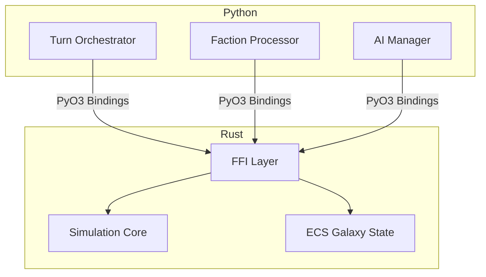

### Binding Layer Design

#### Module Structure

```
rust/simulation_core/src/ffi/
├── mod.rs              # FFI module exports
├── python.rs           # PyO3 bindings
├── combat.rs           # Combat API bindings
├── tactical.rs         # Tactical math bindings
├── spatial.rs          # Spatial indexing bindings
└── types.rs            # Shared FFI types
```

#### PyO3 Binding Pattern

```rust
// rust/simulation_core/src/ffi/python.rs
use pyo3::prelude::*;
use pyo3::types::PyDict;

/// Python module for simulation core
#[pymodule]
fn simulation_core(_py: Python, m: &PyModule) -> PyResult<()> {
    m.add_class::<CombatResolver>()?;
    m.add_class::<BallisticsCalculator>()?;
    m.add_class::<SpatialIndex>()?;
    Ok(())
}

/// Combat resolver exposed to Python
#[pyclass]
pub struct CombatResolver {
    inner: combat::Resolver,
}

#[pymethods]
impl CombatResolver {
    #[new]
    fn new(config: Option<&PyDict>) -> PyResult<Self> {
        let inner = combat::Resolver::new(parse_config(config)?);
        Ok(Self { inner })
    }
    
    fn resolve_combat(&mut self, attacker: &PyDict, defender: &PyDict) 
        -> PyResult<CombatOutcome> {
        self.inner.resolve_combat(
            parse_unit_data(attacker)?,
            parse_unit_data(defender)?
        ).map_err(to_pyerr)
    }
}
```

### Performance Considerations

#### Binding Overhead Mitigation

| Concern | Mitigation Strategy |
|---------|---------------------|
| **Function Call Overhead** | Batch operations where possible (e.g., `resolve_combat_batch`) |
| **Data Copying** | Use `PyReadBuffer`/`PyWriteBuffer` for large arrays |
| **GIL Contention** | Release GIL for long-running Rust operations using `Python::allow_threads` |
| **Type Conversion** | Minimize Python-Rust type conversions at boundaries |

#### Zero-Copy Patterns

```rust
// Zero-copy access to Python buffers
use pyo3::prelude::*;
use numpy::PyReadonlyArray1;

#[pyfunction]
fn calculate_ballistics(
    py: Python,
    velocities: PyReadonlyArray1<f32>,
    angles: PyReadonlyArray1<f32>
) -> PyResult<Vec<f32>> {
    // Direct access to numpy arrays without copying
    let v_slice = velocities.as_slice()?;
    let a_slice = angles.as_slice()?;
    
    // Release GIL for computation
    py.allow_threads(move || {
        Ok(tactical::ballistics::calculate_batch(v_slice, a_slice))
    })
}
```

### Error Handling Across Boundaries

#### Error Propagation Strategy

```rust
// Rust error types
#[derive(Debug, thiserror::Error)]
pub enum SimulationError {
    #[error("Invalid input: {0}")]
    InvalidInput(String),
    
    #[error("Calculation failed: {0}")]
    CalculationError(String),
    
    #[error("State corruption detected")]
    StateCorruption,
}

// Convert to Python exceptions
fn to_pyerr(err: SimulationError) -> PyErr {
    match err {
        SimulationError::InvalidInput(msg) => {
            PyErr::new::<pyo3::exceptions::PyValueError, _>(msg)
        }
        SimulationError::CalculationError(msg) => {
            PyErr::new::<pyo3::exceptions::PyRuntimeError, _>(msg)
        }
        SimulationError::StateCorruption => {
            PyErr::new::<pyo3::exceptions::PySystemError, _>(
                "Simulation state corruption detected"
            )
        }
    }
}
```

#### Python Error Handling

```python
# Python usage with proper error handling
try:
    resolver = CombatResolver(config)
    outcome = resolver.resolve_combat(attacker_data, defender_data)
except ValueError as e:
    logger.error(f"Invalid combat data: {e}")
    raise CombatValidationError(str(e))
except RuntimeError as e:
    logger.error(f"Combat calculation failed: {e}")
    raise CombatCalculationError(str(e))
```

---

## Data Serialization

### Technology Choice: Protocol Buffers

**Protocol Buffers (protobuf)** is selected for structured data serialization between Python and Rust.

#### Advantages
- **Schema Evolution**: Add/remove fields without breaking compatibility
- **Cross-Language**: Native support in both Python and Rust
- **Efficient Binary Format**: Smaller than JSON, faster to parse
- **Code Generation**: Type-safe bindings from `.proto` files
- **Well-Known Types**: Standard types for timestamps, durations, etc.

### Schema Organization

```
schema/protobuf/
├── core/
│   ├── combat.proto          # Combat-related types
│   ├── tactical.proto        # Tactical math types
│   └── spatial.proto         # Spatial indexing types
├── ecs/
│   ├── entities.proto        # Entity and component types
│   ├── queries.proto         # Query request/response types
│   └── events.proto          # ECS event types
├── telemetry/
│   ├── stats.proto           # Telemetry statistics
│   └── metrics.proto         # Performance metrics
└── logging/
    └── events.proto          # Binary logging event types
```

### Example Schema Definitions

#### Combat Types (core/combat.proto)

```protobuf
syntax = "proto3";

package void_reckoning.core.combat;

// Combat outcome from Rust simulation
message CombatOutcome {
    string combat_id = 1;
    uint32 turn_number = 2;
    
    repeated UnitState attackers = 3;
    repeated UnitState defenders = 4;
    
    CombatResult result = 5;
    map<string, float> statistics = 6;
}

message UnitState {
    string unit_id = 1;
    string faction_id = 2;
    
    int32 current_hp = 3;
    int32 max_hp = 4;
    int32 current_morale = 5;
    int32 max_morale = 6;
    
    float fatigue = 7;
    repeated DamageEvent damage_received = 8;
}

message DamageEvent {
    uint32 turn_tick = 1;
    float damage_amount = 2;
    string damage_type = 3;
    string source_unit_id = 4;
}

enum CombatResult {
    UNKNOWN = 0;
    ATTACKER_WIN = 1;
    DEFENDER_WIN = 2;
    DRAW = 3;
    MUTUAL_DESTRUCTION = 4;
}
```

#### ECS Types (ecs/entities.proto)

```protobuf
syntax = "proto3";

package void_reckoning.ecs;

// Entity query request from Python
message EntityQuery {
    repeated ComponentFilter filters = 1;
    QueryLimit limit = 2;
    repeated SortField sort_by = 3;
}

message ComponentFilter {
    string component_type = 1;
    oneof filter {
        ExactMatch exact = 2;
        RangeFilter range = 3;
        InclusionFilter inclusion = 4;
    }
}

message ExactMatch {
    string field_name = 1;
    oneof value {
        string string_value = 2;
        int64 int_value = 3;
        double float_value = 4;
        bool bool_value = 5;
    }
}

message RangeFilter {
    string field_name = 1;
    double min_value = 2;
    double max_value = 3;
}

// Entity query response from Rust
message EntityQueryResponse {
    repeated Entity entities = 1;
    uint32 total_count = 2;
    QueryMetadata metadata = 3;
}

message Entity {
    uint64 entity_id = 1;
    repeated Component components = 2;
    string archetype = 3;
}

message Component {
    string type_name = 1;
    bytes serialized_data = 2;  // Serialized component data
}

message QueryMetadata {
    uint32 query_time_ms = 1;
    uint32 entities_returned = 2;
    bool has_more = 3;
}
```

### Zero-Copy Options

#### For Large Arrays

For large numeric arrays (e.g., position vectors, damage matrices), use **Apache Arrow** format:

```python
# Python side
import pyarrow as pa
import pyarrow.ipc as ipc

# Create Arrow table from simulation data
table = pa.table({
    'entity_ids': entity_ids,
    'positions_x': positions_x,
    'positions_y': positions_y,
})

# Serialize to IPC format
stream = pa.ipc.new_stream(output_file, table.schema)
stream.write_table(table)
```

```rust
// Rust side
use arrow::array::*;
use arrow::record_batch::RecordBatch;

// Read Arrow data without copying
let reader = ipc::reader::FileReader::try_new(file, None)?;
let batch = reader.next()?.unwrap();

// Zero-copy access to arrays
let positions_x = batch
    .column(1)
    .as_any()
    .downcast_ref::<Float32Array>()
    .unwrap();
```

### Memory Management

#### Ownership Patterns

| Pattern | Description | Use Case |
|---------|-------------|----------|
| **Python-Owned** | Python allocates, Rust borrows via PyO3 | Small, short-lived data |
| **Rust-Owned** | Rust allocates, returns to Python | Large, persistent data |
| **Shared Memory** | Both access via mmap | Telemetry, large datasets |
| **Copy-on-Write** | Copy only when modified | Immutable configuration |

#### Lifecycle Management

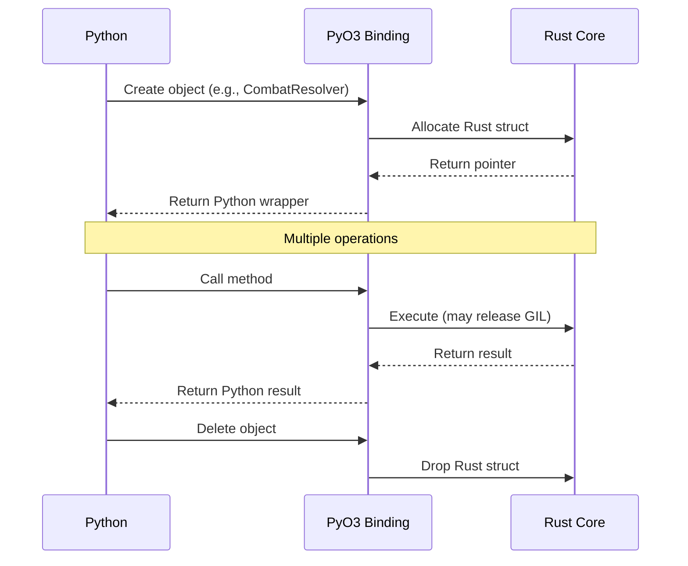

---

## Shared Memory Design

### Purpose

Shared memory enables zero-copy telemetry data transfer from Rust simulation components to the Python dashboard, eliminating serialization overhead for high-frequency updates.

### Technology Stack

| Component | Technology | Rationale |
|-----------|------------|-----------|
| **Shared Memory** | `shared_memory` crate (Rust) + `mmap` (Python) | Cross-platform, type-safe |
| **Synchronization** | Atomic types, futex | Lock-free for reads |
| **Layout** | Structured with versioning | Safe concurrent access |

### Memory Layout

```rust
// rust/simulation_core/src/telemetry/shared_memory.rs
use shared_memory::*;
use std::sync::atomic::{AtomicU64, AtomicU32, Ordering};

#[repr(C)]
pub struct TelemetryHeader {
    /// Magic number for validation
    magic: u64,
    
    /// Layout version for compatibility
    version: u32,
    
    /// Incremented on each update
    sequence: AtomicU64,
    
    /// Size of telemetry data
    data_size: AtomicU32,
    
    /// Flags for data validity
    flags: AtomicU32,
}

#[repr(C)]
pub struct TelemetryData {
    /// Combat statistics
    combat_stats: CombatStats,
    
    /// Performance metrics
    performance: PerformanceMetrics,
    
    /// Entity counts by type
    entity_counts: EntityCounts,
}

#[repr(C)]
pub struct CombatStats {
    total_combats: AtomicU64,
    active_combats: AtomicU32,
    total_damage_dealt: AtomicU64,
    total_damage_received: AtomicU64,
    units_destroyed: AtomicU32,
}

#[repr(C)]
pub struct PerformanceMetrics {
    simulation_fps: AtomicU32,
    average_tick_time_us: AtomicU32,
    peak_tick_time_us: AtomicU32,
    memory_usage_mb: AtomicU32,
}

#[repr(C)]
pub struct EntityCounts {
    total_entities: AtomicU64,
    fleets: AtomicU32,
    planets: AtomicU32,
    units: AtomicU32,
}
```

### Rust Implementation

```rust
// rust/simulation_core/src/telemetry/shared_memory.rs
use shared_memory::*;
use std::sync::atomic::Ordering;

const TELEMETRY_MAGIC: u64 = 0x564F49445245434B; // "VOIDRECK"
const TELEMETRY_VERSION: u32 = 1;

pub struct TelemetryPublisher {
    shmem: Shmem,
    header: *mut TelemetryHeader,
    data: *mut TelemetryData,
}

impl TelemetryPublisher {
    pub fn create(name: &str) -> Result<Self, ShmemError> {
        let size = std::mem::size_of::<TelemetryHeader>() + 
                  std::mem::size_of::<TelemetryData>();
        
        let shmem = ShmemConf::new()
            .size(size)
            .force_create_flink()
            .flink(name)
            .create()?;
        
        let header = shmem.as_ptr() as *mut TelemetryHeader;
        let data = unsafe {
            (shmem.as_ptr() as usize + std::mem::size_of::<TelemetryHeader>()) 
                as *mut TelemetryData
        };
        
        // Initialize header
        unsafe {
            (*header).magic = TELEMETRY_MAGIC;
            (*header).version = TELEMETRY_VERSION;
            (*header).sequence.store(0, Ordering::Release);
            (*header).data_size.store(
                std::mem::size_of::<TelemetryData>() as u32,
                Ordering::Release
            );
            (*header).flags.store(0, Ordering::Release);
        }
        
        Ok(Self { shmem, header, data })
    }
    
    pub fn update_combat_stats(&self, stats: &CombatStatsUpdate) {
        unsafe {
            let combat_stats = &mut (*self.data).combat_stats;
            
            if let Some(total) = stats.total_combats {
                combat_stats.total_combats.fetch_add(total, Ordering::Relaxed);
            }
            if let Some(active) = stats.active_combats {
                combat_stats.active_combats.store(active, Ordering::Relaxed);
            }
            if let Some(damage) = stats.total_damage_dealt {
                combat_stats.total_damage_dealt.fetch_add(damage, Ordering::Relaxed);
            }
        }
        
        // Bump sequence number
        unsafe {
            (*self.header).sequence.fetch_add(1, Ordering::Release);
        }
    }
}
```

### Python Implementation

```python
# src/orchestrator/telemetry_reader.py
import mmap
import struct
from dataclasses import dataclass
from typing import Optional

TELEMETRY_MAGIC = 0x564F49445245434B  # "VOIDRECK"
TELEMETRY_VERSION = 1

@dataclass
class TelemetryHeader:
    magic: int
    version: int
    sequence: int
    data_size: int
    flags: int

@dataclass
class CombatStats:
    total_combats: int
    active_combats: int
    total_damage_dealt: int
    total_damage_received: int
    units_destroyed: int

@dataclass
class TelemetryData:
    combat_stats: CombatStats
    sequence: int

class TelemetryReader:
    def __init__(self, name: str):
        self.name = name
        self.shmem = None
        self.mmap = None
        
    def connect(self) -> bool:
        try:
            # Open shared memory
            self.shmem = open(f'/dev/shm/{name}', 'rb')
            self.mmap = mmap.mmap(
                self.shmem.fileno(),
                0,
                access=mmap.ACCESS_READ
            )
            return True
        except (FileNotFoundError, PermissionError):
            return False
    
    def read_header(self) -> Optional[TelemetryHeader]:
        if self.mmap is None:
            return None
        
        # Read header (40 bytes)
        header_data = self.mmap[:40]
        magic, version, sequence, data_size, flags = struct.unpack(
            '<QIIII', header_data
        )
        
        if magic != TELEMETRY_MAGIC:
            raise ValueError(f"Invalid telemetry magic: {magic}")
        
        if version != TELEMETRY_VERSION:
            raise ValueError(f"Unsupported telemetry version: {version}")
        
        return TelemetryHeader(
            magic=magic,
            version=version,
            sequence=sequence,
            data_size=data_size,
            flags=flags
        )
    
    def read_telemetry(self) -> Optional[TelemetryData]:
        header = self.read_header()
        if header is None:
            return None
        
        # Read combat stats (32 bytes)
        offset = 40  # After header
        combat_data = self.mmap[offset:offset+32]
        (total_combats, active_combats, damage_dealt, 
         damage_received, units_destroyed) = struct.unpack(
            '<QIIII', combat_data
        )
        
        return TelemetryData(
            combat_stats=CombatStats(
                total_combats=total_combats,
                active_combats=active_combats,
                total_damage_dealt=damage_dealt,
                total_damage_received=damage_received,
                units_destroyed=units_destroyed
            ),
            sequence=header.sequence
        )
    
    def wait_for_update(self, last_sequence: int, timeout: float = 1.0) -> bool:
        """Wait for telemetry to update (poll-based)"""
        import time
        start = time.time()
        
        while time.time() - start < timeout:
            header = self.read_header()
            if header and header.sequence > last_sequence:
                return True
            time.sleep(0.001)  # 1ms poll
        
        return False
```

### Synchronization Considerations

#### Lock-Free Reads

- Python only **reads** from shared memory
- Rust **writes** with atomic operations
- Sequence numbers allow detection of updates
- No locks needed for read-heavy telemetry

#### Data Consistency

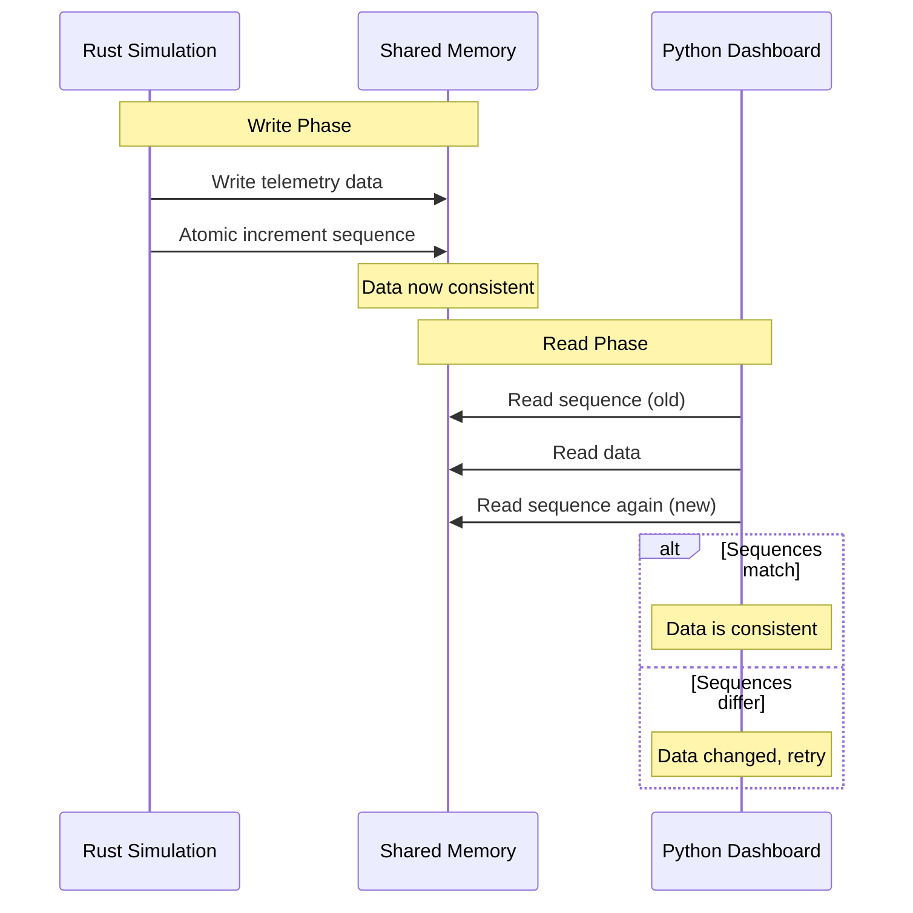

---

## ECS Integration

### Architecture Overview

The Python Turn Orchestrator interacts with the Rust ECS through a query-based API, maintaining the Total War sequential faction turn process while leveraging Rust's performance.

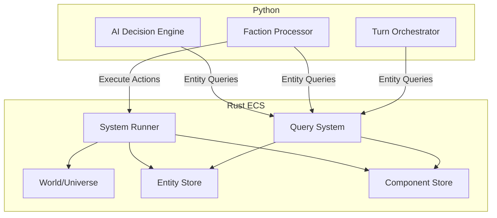

### Entity Query API

#### Python Query Interface

```python
# src/orchestrator/ecs_client.py
from typing import List, Dict, Any, Optional
from dataclasses import dataclass

@dataclass
class EntityQuery:
    """Query specification for ECS"""
    component_types: List[str]
    filters: Dict[str, Any]
    limit: Optional[int] = None
    sort_by: Optional[str] = None

@dataclass
class EntityRef:
    """Reference to an entity in the ECS"""
    entity_id: int
    components: Dict[str, Any]

class ECSClient:
    """Python client for Rust ECS"""
    
    def __init__(self, rust_ecs):
        self._ecs = rust_ecs  # PyO3 wrapper
    
    def query_entities(self, query: EntityQuery) -> List[EntityRef]:
        """Query entities from ECS"""
        return self._ecs.query(
            component_types=query.component_types,
            filters=query.filters,
            limit=query.limit or 0,
            sort_by=query.sort_by or ""
        )
    
    def get_entity(self, entity_id: int) -> Optional[EntityRef]:
        """Get a single entity by ID"""
        return self._ecs.get_entity(entity_id)
    
    def create_entity(self, archetype: str, components: Dict[str, Any]) -> int:
        """Create a new entity"""
        return self._ecs.create_entity(archetype, components)
    
    def update_entity(self, entity_id: int, components: Dict[str, Any]) -> bool:
        """Update entity components"""
        return self._ecs.update_entity(entity_id, components)
    
    def delete_entity(self, entity_id: int) -> bool:
        """Delete an entity"""
        return self._ecs.delete_entity(entity_id)
```

#### Rust Query Implementation

```rust
// rust/ecs/src/ffi/python.rs
use pyo3::prelude::*;
use pyo3::types::PyDict;
use crate::world::World;
use crate::query::{Query, QueryBuilder};

#[pyclass]
pub struct ECSClient {
    world: World,
}

#[pymethods]
impl ECSClient {
    #[new]
    fn new() -> Self {
        Self {
            world: World::new(),
        }
    }
    
    fn query(
        &self,
        component_types: Vec<String>,
        filters: &PyDict,
        limit: usize,
        sort_by: String
    ) -> PyResult<Vec<EntityRef>> {
        let mut builder = QueryBuilder::new();
        
        // Add component type filters
        for comp_type in component_types {
            builder.with_component(&comp_type);
        }
        
        // Add value filters
        for (key, value) in filters.iter() {
            let key_str = key.extract::<String>()?;
            let value_any = parse_filter_value(value)?;
            builder.with_filter(key_str, value_any);
        }
        
        // Execute query
        let query = builder.build();
        let results = self.world.query(&query, limit, &sort_by)?;
        
        // Convert to Python entities
        Ok(results.into_iter().map(|e| EntityRef::from(e)).collect())
    }
    
    fn get_entity(&self, entity_id: u64) -> PyResult<Option<EntityRef>> {
        Ok(self.world.get_entity(entity_id)
            .map(|e| EntityRef::from(e)))
    }
    
    fn create_entity(&mut self, archetype: &str, components: &PyDict) 
        -> PyResult<u64> {
        let parsed_components = parse_components(components)?;
        Ok(self.world.create_entity(archetype, parsed_components))
    }
}
```

### Component Access Patterns

#### Read-Only Access (Query)

```python
# Python: Read entity data for AI decisions
client = ECSClient(rust_ecs)

# Query all fleets belonging to a faction
query = EntityQuery(
    component_types=['Faction', 'Position', 'Fleet'],
    filters={'Faction.faction_id': 'templars'},
    sort_by='Position.x'
)

fleets = client.query_entities(query)

for fleet in fleets:
    position = fleet.components['Position']
    faction = fleet.components['Faction']
    # Use data for AI decision making
```

#### Write Access (Update)

```python
# Python: Update entity state after faction turn
client = ECSClient(rust_ecs)

# Move a fleet
entity_id = 12345
update_data = {
    'Position': {
        'x': 100.0,
        'y': 200.0,
        'z': 0.0
    },
    'Movement': {
        'destination_x': 150.0,
        'destination_y': 250.0,
        'speed': 5.0
    }
}

client.update_entity(entity_id, update_data)
```

### Event Passing Between Layers

#### Event Bus Architecture

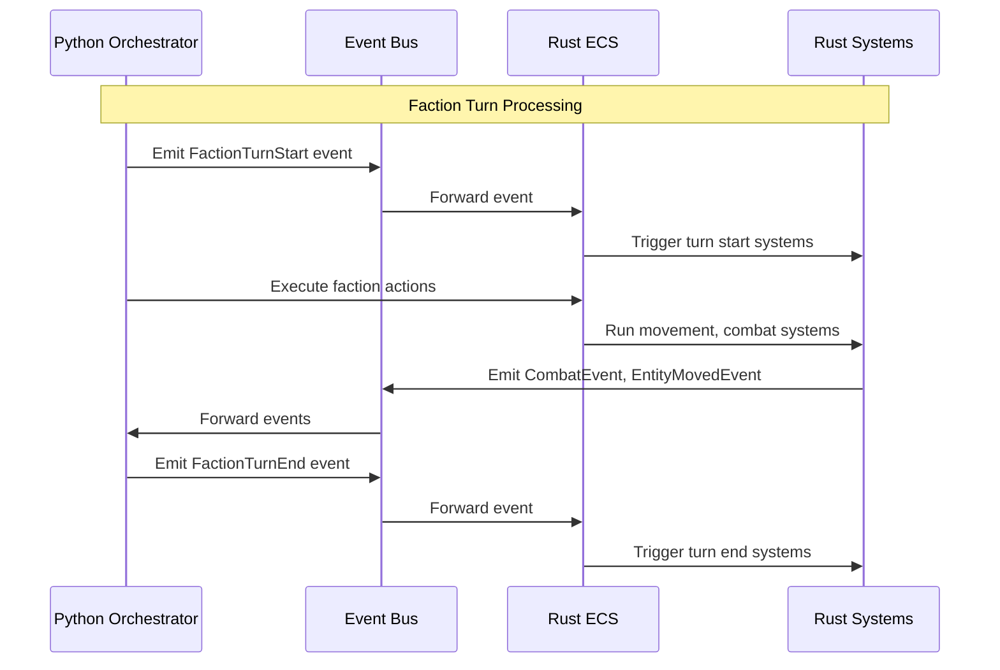

#### Event Types

```protobuf
// ecs/events.proto
syntax = "proto3";

package void_reckoning.ecs.events;

message Event {
    string event_type = 1;
    uint64 timestamp = 2;
    bytes payload = 3;
}

message FactionTurnStart {
    string faction_id = 1;
    uint32 turn_number = 2;
}

message FactionTurnEnd {
    string faction_id = 1;
    uint32 turn_number = 2;
    repeated ActionSummary actions = 3;
}

message CombatEvent {
    string combat_id = 1;
    repeated uint64 attacker_entities = 2;
    repeated uint64 defender_entities = 3;
    CombatResult result = 4;
}

message EntityMoved {
    uint64 entity_id = 1;
    Position from = 2;
    Position to = 3;
}

message Position {
    float x = 1;
    float y = 2;
    float z = 3;
}
```

---

## Binary Logging Integration

### Purpose

The "Black Box" logging system captures all simulation events in a binary format for post-game analysis, replay, and debugging.

### Technology Choice: FlatBuffers

**FlatBuffers** is selected for binary logging due to:

- **Zero-Copy Access**: Read data without parsing/deserialization
- **Schema Evolution**: Add fields without breaking old readers
- **Efficient Storage**: Compact binary format
- **Random Access**: Read any event without parsing entire file
- **Language Support**: Native support in Python and Rust

### Schema Design

#### Event Schema (logging/events.fbs)

```flatbuffers
namespace void_reckoning.logging;

enum EventType : byte {
  CombatStart = 0,
  CombatEnd = 1,
  DamageDealt = 2,
  EntitySpawned = 3,
  EntityDestroyed = 4,
  TurnStart = 5,
  TurnEnd = 6,
  FactionAction = 7,
  SystemError = 8
}

table EventHeader {
  event_type: EventType;
  timestamp: uint64;
  turn_number: uint32;
  faction_id: string;
  sequence: uint64;
}

table CombatStartEvent {
  combat_id: string;
  attacker_faction: string;
  defender_faction: string;
  location: Vec3;
  participants: [uint64];
}

table DamageEvent {
  combat_id: string;
  source_entity: uint64;
  target_entity: uint64;
  damage_amount: float;
  damage_type: string;
  weapon_id: string;
}

table EntityEvent {
  entity_id: uint64;
  entity_type: string;
  faction_id: string;
  position: Vec3;
  metadata: [string];
}

table Vec3 {
  x: float;
  y: float;
  z: float;
}

table LogEntry {
  header: EventHeader;
  // Oneof not directly supported, use separate tables
  combat_start: CombatStartEvent;
  combat_end: CombatEndEvent;
  damage: DamageEvent;
  entity_spawned: EntityEvent;
  entity_destroyed: EntityEvent;
}

root_type LogEntry;
```

### Rust Logging Implementation

```rust
// rust/simulation_core/src/logging/black_box.rs
use flatbuffers::{FlatBufferBuilder, WIPOffset};
use std::fs::File;
use std::io::BufWriter;

pub struct BlackBoxLogger {
    writer: BufWriter<File>,
    builder: FlatBufferBuilder<'static>,
    sequence: u64,
}

impl BlackBoxLogger {
    pub fn new(path: &str) -> std::io::Result<Self> {
        let file = File::create(path)?;
        let writer = BufWriter::new(file);
        
        Ok(Self {
            writer,
            builder: FlatBufferBuilder::new(),
            sequence: 0,
        })
    }
    
    pub fn log_combat_start(
        &mut self,
        combat_id: &str,
        attacker_faction: &str,
        defender_faction: &str,
        participants: &[u64],
    ) -> std::io::Result<()> {
        self.builder.reset();
        
        let combat_id_offset = self.builder.create_string(combat_id);
        let attacker_offset = self.builder.create_string(attacker_faction);
        let defender_offset = self.builder.create_string(defender_faction);
        let participants_offset = self.builder.create_vector(participants);
        
        let event_offset = logging::CombatStartEvent::create(
            &mut self.builder,
            &logging::CombatStartEventArgs {
                combat_id: Some(combat_id_offset),
                attacker_faction: Some(attacker_offset),
                defender_faction: Some(defender_offset),
                participants: Some(participants_offset),
                ..Default::default()
            },
        );
        
        self.write_header(logging::EventType::CombatStart)?;
        self.write_event_body(event_offset);
        self.flush()?;
        
        Ok(())
    }
    
    fn write_header(&mut self, event_type: logging::EventType) 
        -> std::io::Result<()> {
        let header_offset = logging::EventHeader::create(
            &mut self.builder,
            &logging::EventHeaderArgs {
                event_type,
                timestamp: get_timestamp(),
                turn_number: 0,  // From context
                faction_id: None,
                sequence: self.sequence,
            },
        );
        
        // Write to file
        let data = self.builder.finished_data();
        self.writer.write_all(data)?;
        
        self.sequence += 1;
        Ok(())
    }
    
    fn flush(&mut self) -> std::io::Result<()> {
        self.writer.flush()
    }
}
```

### Python Reading Implementation

```python
# src/orchestrator/black_box_reader.py
import flatbuffers
from typing import Iterator, Optional
import struct

class BlackBoxReader:
    """Read binary log files with zero-copy access"""
    
    def __init__(self, path: str):
        self.path = path
        self.file = None
        self.data = None
    
    def open(self) -> bool:
        try:
            self.file = open(self.path, 'rb')
            # Read entire file into memory for zero-copy access
            self.data = self.file.read()
            return True
        except (FileNotFoundError, IOError):
            return False
    
    def iter_events(self) -> Iterator[dict]:
        """Iterate over all events in the log"""
        offset = 0
        
        while offset < len(self.data):
            # Read event header size (4 bytes)
            header_size = struct.unpack_from('<I', self.data, offset)[0]
            offset += 4
            
            # Parse header
            header = logging.EventHeader.GetRootAsEventHeader(
                self.data, offset
            )
            offset += header_size
            
            # Read event body size (4 bytes)
            body_size = struct.unpack_from('<I', self.data, offset)[0]
            offset += 4
            
            # Parse event based on type
            event = self._parse_event(header, offset)
            offset += body_size
            
            yield event
    
    def _parse_event(self, header, offset: int) -> dict:
        """Parse event based on type"""
        event_type = header.EventType()
        
        if event_type == logging.EventType.CombatStart:
            event = logging.CombatStartEvent.GetRootAsCombatStartEvent(
                self.data, offset
            )
            return {
                'type': 'CombatStart',
                'timestamp': header.Timestamp(),
                'combat_id': event.CombatId(),
                'attacker_faction': event.AttackerFaction(),
                'defender_faction': event.DefenderFaction(),
            }
        
        elif event_type == logging.EventType.DamageDealt:
            event = logging.DamageEvent.GetRootAsDamageEvent(
                self.data, offset
            )
            return {
                'type': 'DamageDealt',
                'timestamp': header.Timestamp(),
                'combat_id': event.CombatId(),
                'source_entity': event.SourceEntity(),
                'target_entity': event.TargetEntity(),
                'damage_amount': event.DamageAmount(),
            }
        
        return {'type': 'Unknown'}
    
    def find_events_by_type(self, event_type: str) -> list:
        """Find all events of a specific type"""
        return [e for e in self.iter_events() if e['type'] == event_type]
    
    def find_events_by_turn(self, turn_number: int) -> list:
        """Find all events for a specific turn"""
        return [e for e in self.iter_events() 
                if e.get('turn_number') == turn_number]
    
    def find_events_by_faction(self, faction_id: str) -> list:
        """Find all events for a specific faction"""
        return [e for e in self.iter_events() 
                if e.get('faction_id') == faction_id]
```

### Dashboard Integration

```python
# src/dashboard/black_box_viewer.py
from typing import List, Dict, Any

class BlackBoxViewer:
    """Dashboard component for viewing binary logs"""
    
    def __init__(self, reader: BlackBoxReader):
        self.reader = reader
    
    def get_combat_summary(self, combat_id: str) -> Dict[str, Any]:
        """Get summary of a combat from logs"""
        events = [
            e for e in self.reader.iter_events()
            if e.get('combat_id') == combat_id
        ]
        
        start_events = [e for e in events if e['type'] == 'CombatStart']
        damage_events = [e for e in events if e['type'] == 'DamageDealt']
        
        if not start_events:
            return {}
        
        return {
            'combat_id': combat_id,
            'start_time': start_events[0]['timestamp'],
            'attacker_faction': start_events[0]['attacker_faction'],
            'defender_faction': start_events[0]['defender_faction'],
            'total_damage_events': len(damage_events),
            'total_damage': sum(e['damage_amount'] for e in damage_events),
        }
    
    def get_turn_timeline(self, turn_number: int) -> List[Dict[str, Any]]:
        """Get timeline of events for a turn"""
        return [
            e for e in self.reader.iter_events()
            if e.get('turn_number') == turn_number
        ]
```

---

## Interface Boundaries

### Clear API Boundaries

The polyglot architecture maintains clear boundaries between Python and Rust components:

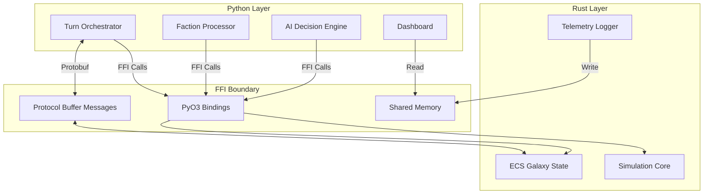

### API Contracts

#### Simulation Core API

```python
# Python interface to Rust Simulation Core
class SimulationCoreAPI:
    """
    Contract for Rust Simulation Core FFI
    
    All methods are synchronous and return Protocol Buffer messages
    """
    
    # Combat Resolution
    def resolve_combat(
        self,
        attackers: List[CombatUnit],
        defenders: List[CombatUnit],
        config: CombatConfig
    ) -> CombatOutcome:
        """Resolve a combat between two forces"""
        pass
    
    def calculate_ballistics(
        self,
        projectile: ProjectileData,
        target: TargetData,
        environment: EnvironmentData
    ) -> BallisticsResult:
        """Calculate projectile trajectory and impact"""
        pass
    
    # Spatial Queries
    def query_nearby_entities(
        self,
        position: Vec3,
        radius: float,
        filters: EntityFilters
    ) -> List[EntityRef]:
        """Find entities within radius"""
        pass
    
    def find_path(
        self,
        start: Vec3,
        end: Vec3,
        constraints: PathConstraints
    ) -> PathResult:
        """Find path between two points"""
        pass
```

#### ECS API

```python
# Python interface to Rust ECS
class ECSAPI:
    """
    Contract for Rust ECS FFI
    
    Query-based API with batch operations
    """
    
    # Entity Queries
    def query_entities(
        self,
        query: EntityQuery
    ) -> EntityQueryResponse:
        """Query entities from ECS"""
        pass
    
    def get_entity(
        self,
        entity_id: int
    ) -> Optional[EntityData]:
        """Get single entity by ID"""
        pass
    
    # Entity Operations
    def create_entity(
        self,
        archetype: str,
        components: Dict[str, Any]
    ) -> int:
        """Create new entity"""
        pass
    
    def update_entity(
        self,
        entity_id: int,
        components: Dict[str, Any]
    ) -> bool:
        """Update entity components"""
        pass
    
    def delete_entity(
        self,
        entity_id: int
    ) -> bool:
        """Delete entity"""
        pass
    
    # System Execution
    def run_system(
        self,
        system_name: str,
        delta_time: float
    ) -> SystemResult:
        """Run a specific ECS system"""
        pass
```

### Versioning Strategy

#### API Versioning

```protobuf
// versioning.proto
syntax = "proto3";

package void_reckoning.versioning;

message APIVersion {
    uint32 major = 1;
    uint32 minor = 2;
    uint32 patch = 3;
}

message APICompatibility {
    APIVersion min_version = 1;
    APIVersion max_version = 2;
    string api_name = 3;
}
```

#### Version Checking

```python
# src/orchestrator/version_check.py
from dataclasses import dataclass

@dataclass
class APIVersion:
    major: int
    minor: int
    patch: int
    
    def __str__(self) -> str:
        return f"{self.major}.{self.minor}.{self.patch}"
    
    def is_compatible_with(self, other: 'APIVersion') -> bool:
        """Check if this version is compatible with another"""
        # Major version must match
        if self.major != other.major:
            return False
        # Minor version can be higher in implementation
        if self.minor < other.minor:
            return False
        return True

class VersionChecker:
    """Check compatibility between Python and Rust APIs"""
    
    PYTHON_API_VERSION = APIVersion(1, 0, 0)
    
    @staticmethod
    def check_rust_compatibility(rust_version: APIVersion) -> bool:
        """Check if Rust version is compatible"""
        return VersionChecker.PYTHON_API_VERSION.is_compatible_with(rust_version)
```

---

## Data Flow Diagrams

### Overall System Data Flow

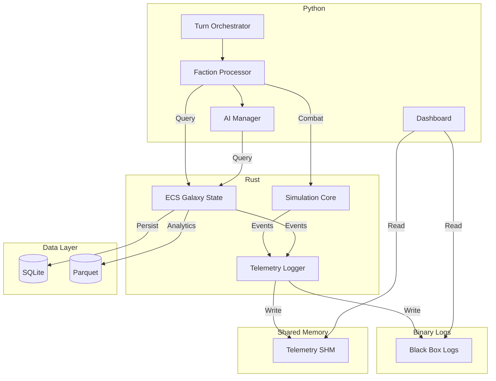

### Turn Processing Flow

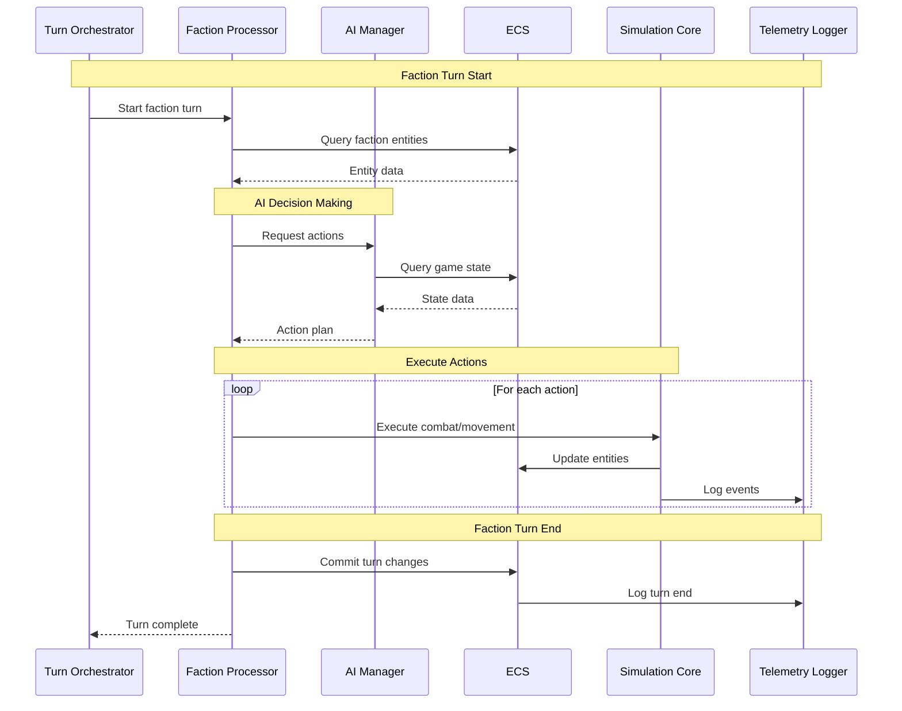

### Combat Resolution Flow

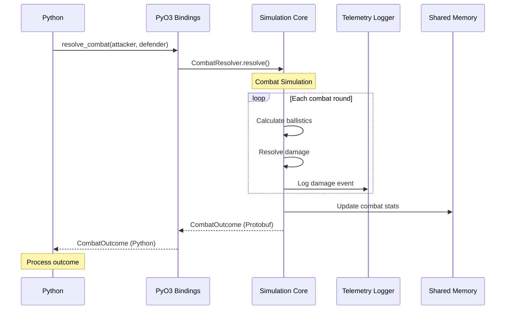

### Telemetry Flow

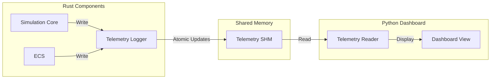

---

## Performance Considerations

### Bottlenecks and Mitigation

| Bottleneck | Impact | Mitigation Strategy |
|------------|--------|---------------------|
| **FFI Call Overhead** | High-frequency calls | Batch operations, reduce call count |
| **Data Serialization** | Large data transfers | Use shared memory, zero-copy |
| **GIL Contention** | Python blocking | Release GIL for Rust operations |
| **Memory Copying** | Large arrays | Use Arrow/NumPy buffers |
| **Query Latency** | Complex ECS queries | Indexing, query caching |

### Optimization Strategies

#### 1. Batch Operations

```python
# Instead of multiple calls
for unit in units:
    outcome = resolve_combat(unit, enemy)

# Use batch operation
outcomes = resolve_combat_batch(units, enemies)
```

#### 2. Query Caching

```rust
// rust/ecs/src/query/cache.rs
use lru::LruCache;
use std::num::NonZeroUsize;

pub struct QueryCache {
    cache: LruCache<QueryKey, QueryResult>,
}

impl QueryCache {
    pub fn new(capacity: usize) -> Self {
        Self {
            cache: LruCache::new(NonZeroUsize::new(capacity).unwrap()),
        }
    }
    
    pub fn get_or_compute<F>(&mut self, key: QueryKey, f: F) -> &QueryResult
    where
        F: FnOnce() -> QueryResult,
    {
        if !self.cache.contains(&key) {
            let result = f();
            self.cache.put(key, result);
        }
        self.cache.get(&key).unwrap()
    }
}
```

#### 3. GIL Release Pattern

```rust
// Release GIL for long-running operations
#[pymethods]
impl SimulationCore {
    fn run_simulation(&self, py: Python, duration: f32) -> PyResult<SimulationResult> {
        // Release GIL
        py.allow_threads(move || {
            // Long-running simulation
            self.inner.run_simulation(duration)
        })
    }
}
```

#### 4. Memory Pooling

```rust
// Reuse allocations across calls
pub struct MemoryPool<T> {
    pool: Vec<Vec<T>>,
    current_size: usize,
}

impl<T: Clone + Default> MemoryPool<T> {
    pub fn acquire(&mut self, size: usize) -> Vec<T> {
        if let Some(mut vec) = self.pool.pop() {
            vec.resize(size, T::default());
            vec
        } else {
            vec![T::default(); size]
        }
    }
    
    pub fn release(&mut self, vec: Vec<T>) {
        self.pool.push(vec);
    }
}
```

### Performance Targets

| Operation | Target Latency | Measurement |
|-----------|----------------|-------------|
| Single FFI Call | < 1ms | Benchmark with pytest-benchmark |
| Combat Resolution | < 10ms | Per 100 units |
| Entity Query | < 5ms | For 1000 entities |
| Telemetry Update | < 100μs | Atomic write to SHM |
| Log Write | < 1ms | Per event |

---

## Error Handling Strategy

### Cross-Language Error Propagation

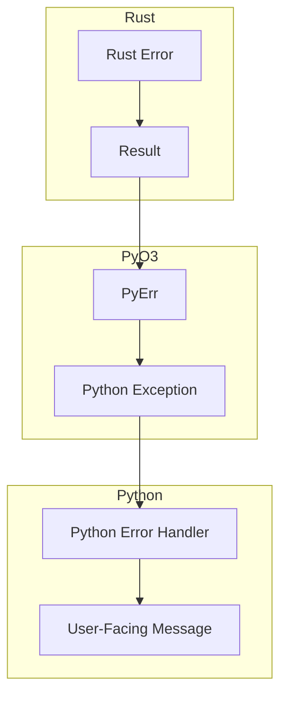

### Error Type Mapping

| Rust Error | Python Exception | Recovery Strategy |
|------------|-------------------|-------------------|
| `SimulationError::InvalidInput` | `ValueError` | Validate input, retry |
| `SimulationError::CalculationError` | `RuntimeError` | Log, skip, continue |
| `SimulationError::StateCorruption` | `SystemError` | Fatal, restart simulation |
| `QueryError::NotFound` | `KeyError` | Handle missing entity |
| `QueryError::InvalidQuery` | `ValueError` | Validate query syntax |

### Structured Error Handling

```python
# src/orchestrator/error_handler.py
from typing import Optional, Callable, TypeVar
import logging

T = TypeVar('T')

class IntegrationError(Exception):
    """Base class for integration errors"""
    def __init__(self, message: str, rust_error: Optional[str] = None):
        self.message = message
        self.rust_error = rust_error
        super().__init__(self.message)

class CombatError(IntegrationError):
    """Combat resolution errors"""
    pass

class QueryError(IntegrationError):
    """ECS query errors"""
    pass

class StateError(IntegrationError):
    """State synchronization errors"""
    pass

def handle_rust_error(
    func: Callable[..., T],
    error_map: dict[type, type[IntegrationError]]
) -> Callable[..., T]:
    """Decorator to handle Rust errors"""
    def wrapper(*args, **kwargs):
        try:
            return func(*args, **kwargs)
        except ValueError as e:
            raise error_map.get(ValueError, IntegrationError)(str(e))
        except RuntimeError as e:
            raise error_map.get(RuntimeError, IntegrationError)(str(e))
        except Exception as e:
            logging.error(f"Unexpected error: {e}")
            raise IntegrationError(f"Unexpected error: {e}")
    return wrapper

@handle_rust_error(
    error_map={
        ValueError: CombatError,
        RuntimeError: CombatError,
    }
)
def resolve_combat_safe(attacker, defender):
    """Safe wrapper for combat resolution"""
    from rust.simulation_core import CombatResolver
    resolver = CombatResolver()
    return resolver.resolve_combat(attacker, defender)
```

### Error Recovery Strategies

| Error Type | Recovery Strategy | Example |
|------------|-------------------|---------|
| **Transient** | Retry with backoff | Network/IO errors |
| **Validation** | Skip entity/action | Invalid input data |
| **State** | Rollback turn | State corruption |
| **Fatal** | Abort, log, restart | Unrecoverable errors |

---

## Appendix

### Technology Stack Summary

| Category | Technology | Version | Purpose |
|----------|------------|---------|---------|
| **Python-Rust FFI** | PyO3 | 0.20+ | Bindings |
| **Build System** | Maturin | 1.0+ | Python-Rust builds |
| **Serialization** | Protocol Buffers | 4.0+ | Structured data |
| **Binary Logging** | FlatBuffers | 23.0+ | Zero-copy logs |
| **Shared Memory** | shared_memory (Rust) | 0.12+ | Telemetry |
| **Array Data** | Apache Arrow | 12.0+ | Zero-copy arrays |
| **Error Handling** | thiserror (Rust) | 1.0+ | Structured errors |

### References

- [PyO3 Documentation](https://pyo3.rs/)
- [Protocol Buffers Guide](https://protobuf.dev/)
- [FlatBuffers Documentation](https://flatbuffers.dev/)
- [Apache Arrow](https://arrow.apache.org/)
- [Rust ECS Patterns](https://github.com/amethyst/specs)

---

**Document End**
