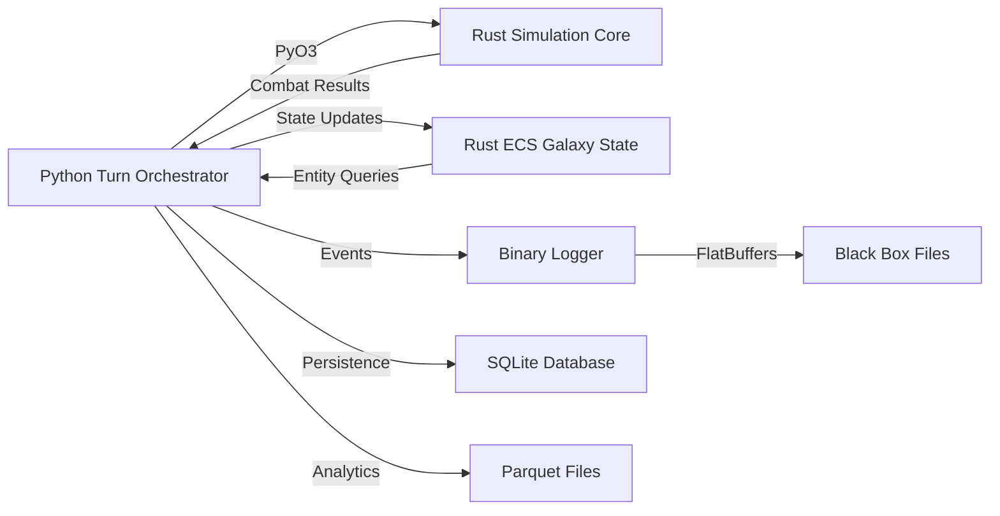

# Void Reckoning: Polyglot Architecture Redesign
## Installation Requirements Document

**Document Version:** 1.0  
**Date:** 2026-02-06  
**Status:** Planning Phase  
**Target OS:** Windows 11

---

## Table of Contents

1. [Quick Start](#quick-start)
2. [Detailed Requirements](#detailed-requirements)
3. [Installation Commands](#installation-commands)
4. [Verification Steps](#verification-steps)
5. [Troubleshooting](#troubleshooting)
6. [Architecture Overview](#architecture-overview)

---

## Quick Start

### Minimal Installation to Get Started

The following is the minimal set of tools required to begin development on the Void Reckoning polyglot architecture:

| Tool | Purpose | Version |
|------|---------|---------|
| Python | Turn Orchestrator | 3.8+ (recommended 3.11) |
| Rust | Simulation Core + ECS | 1.75+ |
| Git | Version Control | 2.40+ |
| VS Code | Recommended IDE | Latest |

### Quick Install Commands (Windows 11)

```powershell
# Install Python (using Windows Store or python.org)
# Install Rust
winget install Rustlang.Rustup

# Install Git (if not already installed)
winget install Git.Git

# Install VS Code (if not already installed)
winget install Microsoft.VisualStudioCode

# Clone the repository
git clone <repository-url>
cd void-reckoning

# Install Python dependencies
pip install -r requirements.txt
pip install -r requirements-dev.txt

# Install Rust Python bindings tools
pip install maturin
```

---

## Detailed Requirements

### 1. Rust Development Environment

#### Core Toolchain

| Component | Version | Purpose |
|-----------|---------|---------|
| **rustup** | 1.26+ | Rust toolchain installer and manager |
| **cargo** | 1.75+ | Rust package manager and build tool |
| **rustc** | 1.75+ | Rust compiler |

#### Required Rust Crates

| Crate | Version | Purpose |
|-------|---------|---------|
| **pyo3** | 0.20+ | Python bindings (FFI layer) |
| **pyo3-build-config** | 0.20+ | Build configuration for PyO3 |
| **maturin** | 1.4+ | Build tool for Python-Rust extensions |
| **prost** | 0.12+ | Protocol Buffers for Rust |
| **prost-build** | 0.12+ | Protocol Buffers code generation |
| **flatbuffers** | 23.5+ | FlatBuffers serialization |
| **bevy_ecs** | 0.13+ | Entity Component System (primary choice) |
| **legion** | 0.4+ | Alternative ECS (if needed) |
| **specs** | 0.20+ | Alternative ECS (if needed) |
| **rusqlite** | 0.30+ | SQLite bindings for Rust |
| **polars** | 0.36+ | Parquet support for Rust |
| **arrow** | 50.0+ | Arrow format for data interchange |
| **serde** | 1.0+ | Serialization framework |
| **serde_json** | 1.0+ | JSON serialization |
| **anyhow** | 1.0+ | Error handling |
| **thiserror** | 1.0+ | Error derive macros |
| **tracing** | 0.1+ | Instrumentation and logging |
| **tracing-subscriber** | 0.3+ | Log subscriber implementation |
| **rayon** | 1.8+ | Data parallelism |
| **ndarray** | 0.15+ | N-dimensional arrays |
| **nalgebra** | 0.32+ | Linear algebra library |
| **glam** | 0.24+ | Vector math library (for spatial) |
| **spatial** | 0.5+ | Spatial indexing structures |

#### Rust-Specific Tools

| Tool | Purpose |
|------|---------|
| **rust-analyzer** | Language server for IDE support |
| **cargo-watch** | Watch for changes and rebuild |
| **cargo-nextest** | Faster test runner |
| **cargo-expand** | Macro expansion debugging |
| **cargo-audit** | Security vulnerability checker |
| **cargo-outdated** | Check for outdated dependencies |

---

### 2. Python Development Environment

#### Core Python

| Component | Version | Purpose |
|-----------|---------|---------|
| **Python** | 3.8+ (recommended 3.11) | Turn Orchestrator language |
| **pip** | 23.0+ | Python package installer |
| **poetry** | 1.7+ (optional) | Modern Python dependency management |
| **venv** | Built-in | Virtual environment management |

#### Python Libraries for Project

| Library | Version | Purpose |
|---------|---------|---------|
| **pyo3** | 0.20+ | Python bindings for Rust |
| **maturin** | 1.4+ | Build tool for Python-Rust extensions |
| **protobuf** | 4.25+ | Protocol Buffers library |
| **flatbuffers** | 23.5+ | FlatBuffers library |

#### Existing Project Dependencies

From `requirements.txt`:

| Library | Version | Purpose |
|---------|---------|---------|
| **numpy** | 1.24.0+ | Numerical computing |
| **pandas** | 2.0.0+ | Data manipulation |
| **scipy** | 1.10.0+ | Scientific computing |
| **matplotlib** | 3.7.0+ | Plotting and visualization |
| **plotly** | 5.14.0+ | Interactive plotting |
| **networkx** | 3.1+ | Graph algorithms |
| **scikit-learn** | 1.3.0+ | Machine learning |
| **PyYAML** | 6.0+ | YAML parsing |
| **requests** | 2.31.0+ | HTTP client |
| **openpyxl** | 3.1.0+ | Excel file handling |
| **reportlab** | 4.0.0+ | PDF generation |
| **redis** | 5.0.0+ | Redis client |
| **psutil** | 5.9.0+ | System utilities |
| **fastapi** | 0.109.0+ | Web framework (Dashboard) |
| **uvicorn** | 0.27.0+ | ASGI server |
| **websockets** | 12.0+ | WebSocket support |
| **pydantic** | 2.5.0+ | Data validation |
| **pydantic-settings** | 2.1.0+ | Settings management |

#### Development Dependencies

From `requirements-dev.txt`:

| Library | Version | Purpose |
|---------|---------|---------|
| **pytest** | 7.0.0+ | Testing framework |
| **pytest-cov** | 3.0.0+ | Coverage reporting |
| **black** | 22.0.0+ | Code formatter |
| **flake8** | 4.0.0+ | Linting |
| **mypy** | 0.950+ | Static type checking |

---

### 3. Protocol Buffers

| Component | Version | Purpose |
|-----------|---------|---------|
| **protoc** | 24.0+ | Protocol Buffers compiler |
| **protobuf** (Python) | 4.25+ | Python runtime library |
| **prost** (Rust) | 0.12+ | Rust library for protobuf |
| **prost-build** (Rust) | 0.12+ | Code generation for Rust |

---

### 4. FlatBuffers

| Component | Version | Purpose |
|-----------|---------|---------|
| **flatc** | 23.5+ | FlatBuffers compiler |
| **flatbuffers** (Python) | 23.5+ | Python runtime library |
| **flatbuffers** (Rust) | 23.5+ | Rust library |

---

### 5. Build Tools

| Tool | Version | Purpose |
|------|---------|---------|
| **cargo** | 1.75+ | Rust build system |
| **pip** | 23.0+ | Python package installer |
| **poetry** | 1.7+ (optional) | Python dependency manager |
| **CMake** | 3.27+ (optional) | C++ build system (if needed) |
| **make** | 4.4+ (via MSYS2) | Build automation (optional) |
| **ninja** | 1.11+ (optional) | Fast build system |

---

### 6. Development Tools

#### IDE/Editor Recommendations

| Tool | Purpose |
|------|---------|
| **Visual Studio Code** | Recommended primary IDE |
| **PyCharm Professional** | Alternative for Python-heavy work |
| **CLion** | Alternative for Rust-heavy work |

#### VS Code Extensions

| Extension | Purpose |
|-----------|---------|
| **rust-analyzer** | Rust language support |
| **Python** | Python language support |
| **Pylance** | Python type checking |
| **Even Better TOML** | TOML file support |
| **Protocol Buffers** | Protocol Buffer syntax |
| **FlatBuffers** | FlatBuffers syntax |
| **GitLens** | Git integration |
| **Test Explorer** | Test runner integration |
| **Error Lens** | Inline error display |
| **CodeLLDB** | Debugging support |

#### Debugging Tools

| Tool | Purpose |
|------|---------|
| **lldb** | Rust/C++ debugger |
| **pdb** | Python debugger |
| **WinDbg** | Windows system debugging (optional) |

#### Profiling Tools

| Tool | Purpose |
|------|---------|
| **perf** | Linux profiler (via WSL) |
| **flamegraph** | Flame graph visualization |
| **py-spy** | Python profiler |
| **cargo-flamegraph** | Rust profiler |
| **heaptrack** | Memory profiling (via WSL) |

#### Version Control

| Tool | Version | Purpose |
|------|---------|---------|
| **Git** | 2.40+ | Version control |
| **GitHub CLI** | 2.40+ (optional) | GitHub command-line interface |

---

### 7. Optional/Advanced Tools

#### GPU Acceleration

| Tool | Version | Purpose |
|------|---------|---------|
| **CUDA Toolkit** | 12.2+ | NVIDIA GPU support |
| **CuPy** | 13.0+ | GPU-accelerated NumPy |
| **PyTorch** | 2.1+ (optional) | Deep learning framework |
| **TensorFlow** | 2.15+ (optional) | Alternative ML framework |

#### Performance Profiling

| Tool | Purpose |
|------|---------|
| **Intel VTune** | Advanced profiling (Intel CPUs) |
| **AMD uProf** | Advanced profiling (AMD CPUs) |
| **Superluminal** | Commercial profiler (optional) |

#### Testing Frameworks

| Tool | Purpose |
|------|---------|
| **criterion** | Rust benchmarking |
| **pytest-benchmark** | Python benchmarking |
| **hypothesis** | Property-based testing (Python) |
| **proptest** | Property-based testing (Rust) |

#### Documentation

| Tool | Purpose |
|------|---------|
| **sphinx** | Python documentation |
| **rustdoc** | Rust documentation (built-in) |
| **mkdocs** | Static site generator |

---

## Installation Commands

### Step-by-Step Installation for Windows 11

#### Step 1: Install Git

```powershell
# Using Windows Package Manager (winget)
winget install Git.Git

# Or download from: https://git-scm.com/download/win
```

#### Step 2: Install Python

```powershell
# Option 1: Using Windows Store (recommended for most users)
# Open Microsoft Store and search for "Python 3.11"

# Option 2: Using winget
winget install Python.Python.3.11

# Option 3: Download from python.org
# https://www.python.org/downloads/windows/

# Verify installation
python --version
pip --version
```

#### Step 3: Install Rust

```powershell
# Using winget
winget install Rustlang.Rustup

# Or download from: https://rustup.rs/
# Download rustup-init.exe and run it

# Verify installation
rustc --version
cargo --version
```

#### Step 4: Install Protocol Buffers Compiler

```powershell
# Using winget
winget install Google.ProtocolBuffers

# Or download from GitHub releases
# https://github.com/protocolbuffers/protobuf/releases

# Add to PATH (if not done automatically)
# Add: C:\Program Files\protobuf\bin to System PATH

# Verify installation
protoc --version
```

#### Step 5: Install FlatBuffers Compiler

```powershell
# Download from GitHub releases
# https://github.com/google/flatbuffers/releases

# Extract flatc.exe to a directory, e.g., C:\flatbuffers
# Add C:\flatbuffers to System PATH

# Verify installation
flatc --version
```

#### Step 6: Install Visual Studio Code (if not already installed)

```powershell
# Using winget
winget install Microsoft.VisualStudioCode

# Or download from: https://code.visualstudio.com/
```

#### Step 7: Install VS Code Extensions

```powershell
# Install essential extensions
code --install-extension matklad.rust-analyzer
code --install-extension ms-python.python
code --install-extension ms-python.pylance
code --install-extension tamasfe.even-better-toml
code --install-extension zxh404.vscode-proto3
code --install-extension ea4f8e0c-9e37-4a3a-9b7a-9c8125c6a0d8.flatbuffers
code --install-extension eamodio.gitlens
code --install-extension littlefoxteam.vscode-python-test-adapter
```

#### Step 8: Clone the Repository

```powershell
# Navigate to desired directory
cd C:\Users\%USERNAME%\source

# Clone the repository
git clone <repository-url>
cd void-reckoning
```

#### Step 9: Install Python Dependencies

```powershell
# Create virtual environment (recommended)
python -m venv venv

# Activate virtual environment
.\venv\Scripts\activate

# Upgrade pip
pip install --upgrade pip

# Install project dependencies
pip install -r requirements.txt
pip install -r requirements-dev.txt

# Install Rust-Python binding tools
pip install maturin
```

#### Step 10: Install C++ Build Tools (Optional)

```powershell
# Install Visual Studio Build Tools
# Download from: https://visualstudio.microsoft.com/downloads/
# Select "Desktop development with C++"

# Or using winget
winget install Microsoft.VisualStudio.2022.BuildTools --override "--wait --passive --add Microsoft.VisualStudio.Workload.VCTools;includeRecommended"
```

#### Step 11: Install Poetry (Optional)

```powershell
# Using pip
pip install poetry

# Or using winget
winget install PythonPoetry.Poetry

# Configure poetry to use the virtual environment in the project
poetry config virtualenvs.in-project true
```

#### Step 12: Verify All Installations

```powershell
# Check Python
python --version
pip --version

# Check Rust
rustc --version
cargo --version

# Check Protocol Buffers
protoc --version

# Check FlatBuffers
flatc --version

# Check Git
git --version
```

---

## Verification Steps

### Rust Verification

```powershell
# Check Rust installation
rustc --version
# Expected: rustc 1.75.0 or higher

cargo --version
# Expected: cargo 1.75.0 or higher

# Check that Rust toolchain components are installed
rustup component list --installed
# Should include: rustc, rust-std, cargo, clippy, rustfmt

# Test Rust compilation
cargo --version
cargo new test_rust
cd test_rust
cargo build
cargo test
cd ..
rmdir /s /q test_rust
```

### Python Verification

```powershell
# Check Python version
python --version
# Expected: Python 3.8.0 or higher (3.11 recommended)

# Check pip
pip --version
# Expected: pip 23.0 or higher

# Test Python imports
python -c "import sys; print(sys.version)"

# Test project dependencies
python -c "import numpy; print('NumPy:', numpy.__version__)"
python -c "import pandas; print('Pandas:', pandas.__version__)"
python -c "import pyo3; print('PyO3 installed')"

# Run pytest
pytest --version
# Expected: pytest 7.0.0 or higher
```

### Protocol Buffers Verification

```powershell
# Check protoc
protoc --version
# Expected: libprotoc 24.0 or higher

# Test Python protobuf
python -c "import google.protobuf; print('Protobuf:', google.protobuf.__version__)"

# Create a test .proto file
echo "syntax = 'proto3'; message Test { string name = 1; }" > test.proto
protoc test.proto --python_out=.
# Should generate test_pb2.py

# Cleanup
del test.proto
del test_pb2.py
```

### FlatBuffers Verification

```powershell
# Check flatc
flatc --version
# Expected: 23.5 or higher

# Test Python flatbuffers
python -c "import flatbuffers; print('FlatBuffers installed')"

# Create a test .fbs file
echo "table Test { name:string; }" > test.fbs
flatc --python test.fbs
# Should generate Test.py

# Cleanup
del test.fbs
del Test.py
```

### PyO3 and Maturin Verification

```powershell
# Check PyO3
python -c "import pyo3; print('PyO3:', pyo3.__version__ if hasattr(pyo3, '__version__') else 'installed')"

# Check maturin
maturin --version
# Expected: maturin 1.4 or higher
```

### Build System Verification

```powershell
# Test cargo build
cargo --version

# Test pip
pip list

# If using poetry
poetry --version
```

### IDE Verification

```powershell
# Check VS Code
code --version
# Should display version information

# Check installed extensions
code --list-extensions
```

---

## Troubleshooting

### Common Issues and Solutions

#### Issue 1: Python not found in PATH

**Symptom:** `python` command not recognized

**Solution:**
1. Open Windows Settings → Apps → Advanced app settings → App execution aliases
2. Ensure "App Installer (python.exe)" is disabled
3. Add Python installation directory to PATH:
   - `C:\Users\<username>\AppData\Local\Programs\Python\Python311`
   - `C:\Users\<username>\AppData\Local\Programs\Python\Python311\Scripts`
4. Restart terminal

#### Issue 2: Rust toolchain not found

**Symptom:** `rustc` or `cargo` command not recognized

**Solution:**
1. Ensure Rust was installed correctly via `rustup-init.exe`
2. Add Rust bin directory to PATH:
   - `%USERPROFILE%\.cargo\bin`
3. Restart terminal
4. Run `rustup update` to ensure latest version

#### Issue 3: protoc not found

**Symptom:** `protoc` command not recognized

**Solution:**
1. Verify Protocol Buffers installation location
2. Add to PATH:
   - `C:\Program Files\protobuf\bin` (default)
3. Restart terminal
4. Run `where protoc` to verify

#### Issue 4: flatc not found

**Symptom:** `flatc` command not recognized

**Solution:**
1. Ensure `flatc.exe` is in a directory on PATH
2. Add installation directory to PATH:
   - `C:\flatbuffers` (or wherever you extracted it)
3. Restart terminal

#### Issue 5: PyO3 import errors

**Symptom:** `ImportError: DLL load failed` or similar

**Solution:**
1. Ensure Rust is installed and in PATH
2. Reinstall PyO3 with build dependencies:
   ```powershell
   pip uninstall pyo3
   pip install pyo3 --no-binary :all:
   ```
3. Ensure Visual Studio Build Tools are installed for C++ compilation

#### Issue 6: Cargo build fails

**Symptom:** `linker.exe not found` or similar

**Solution:**
1. Install Visual Studio Build Tools with C++ workload
2. Set environment variable:
   ```powershell
   set RUSTFLAGS=-C target-feature=+crt-static
   ```
3. Or use MSVC toolchain:
   ```powershell
   rustup default stable-x86_64-pc-windows-msvc
   ```

#### Issue 7: Virtual environment activation fails

**Symptom:** `.\venv\Scripts\activate` not found or fails

**Solution:**
1. Recreate virtual environment:
   ```powershell
   python -m venv venv --clear
   ```
2. Ensure Python is properly installed
3. Run PowerShell as Administrator if permission errors occur

#### Issue 8: pip install fails with SSL errors

**Symptom:** `SSL: CERTIFICATE_VERIFY_FAILED`

**Solution:**
1. Upgrade pip:
   ```powershell
   python -m pip install --upgrade pip
   ```
2. Or use trusted host:
   ```powershell
   pip install --trusted-host pypi.org --trusted-host files.pythonhosted.org <package>
   ```

#### Issue 9: WSL issues (if using Linux tools)

**Symptom:** WSL commands not recognized

**Solution:**
1. Install WSL:
   ```powershell
   wsl --install
   ```
2. Restart computer
3. Install Linux distribution (Ubuntu recommended)

#### Issue 10: VS Code extensions not working

**Symptom:** Extensions show errors or don't activate

**Solution:**
1. Reload VS Code window: `Ctrl+Shift+P` → "Developer: Reload Window"
2. Check for extension updates
3. Disable conflicting extensions
4. Check VS Code output logs for specific errors

---

## Architecture Overview

### Technology Stack Summary

```
┌─────────────────────────────────────────────────────────────────┐
│                    Void Reckoning Architecture                   │
├─────────────────────────────────────────────────────────────────┤
│                                                                  │
│  ┌──────────────────┐         ┌──────────────────┐              │
│  │   Python Layer   │         │    Rust Layer    │              │
│  │                  │         │                  │              │
│  │  Turn            │◄───────►│  Simulation Core │              │
│  │  Orchestrator    │  PyO3   │                  │              │
│  │                  │         │  - Tactical Math │              │
│  │  - Faction Logic │         │  - Combat Res.   │              │
│  │  - AI Manager    │         │  - Spatial Index │              │
│  │  - Event Bus     │         │                  │              │
│  │                  │         │  ECS Galaxy State│              │
│  └──────────────────┘         │                  │              │
│                               │  - World Manager │              │
│  ┌──────────────────┐         │  - Components    │              │
│  │  Data Layer      │◄────────►│  - Systems       │              │
│  │                  │         └──────────────────┘              │
│  │  - SQLite        │                                           │
│  │  - Parquet       │         ┌──────────────────┐              │
│  │                  │         │  Serialization   │              │
│  └──────────────────┘         │                  │              │
│                               │  - Protocol Buffs│              │
│  ┌──────────────────┐         │  - FlatBuffers   │              │
│  │  Binary Logging  │◄────────►│                  │              │
│  │  (Black Box)     │         └──────────────────┘              │
│  └──────────────────┘                                           │
│                                                                  │
└─────────────────────────────────────────────────────────────────┘
```

### Data Flow



---

## Additional Resources

### Documentation Links

- [Rust Book](https://doc.rust-lang.org/book/)
- [PyO3 User Guide](https://pyo3.rs/)
- [Protocol Buffers Guide](https://protobuf.dev/)
- [FlatBuffers Guide](https://flatbuffers.dev/)
- [Python Documentation](https://docs.python.org/3/)

### Community Resources

- [Rust Users Forum](https://users.rust-lang.org/)
- [Python Discord](https://discord.gg/python)
- [Stack Overflow](https://stackoverflow.com/)

---

## Appendix A: Environment Variables

### Recommended Environment Variables

```powershell
# Rust
$env:CARGO_HOME = "$env:USERPROFILE\.cargo"
$env:RUSTUP_HOME = "$env:USERPROFILE\.rustup"

# Python
$env:PYTHONPATH = "C:\path\to\void-reckoning\src"

# Protocol Buffers
$env:PROTOC_PATH = "C:\Program Files\protobuf\bin"

# FlatBuffers
$env:FLATBUFFERS_PATH = "C:\flatbuffers"

# Build tools
$env:CMAKE_PATH = "C:\Program Files\CMake\bin"
```

### Permanent Environment Variables

To set environment variables permanently:

1. Open System Properties → Advanced → Environment Variables
2. Add new variables under User variables
3. Restart terminal

---

## Appendix B: Build Script Template

### Windows Build Script (build.bat)

```batch
@echo off
REM Build script for Void Reckoning on Windows

echo ========================================
echo Void Reckoning Build Script
echo ========================================

REM Check if virtual environment exists
if not exist "venv" (
    echo Creating virtual environment...
    python -m venv venv
)

REM Activate virtual environment
call venv\Scripts\activate.bat

REM Upgrade pip
echo Upgrading pip...
python -m pip install --upgrade pip

REM Install Python dependencies
echo Installing Python dependencies...
pip install -r requirements.txt
pip install -r requirements-dev.txt
pip install maturin

REM Build Rust components
echo Building Rust components...
cd rust
cargo build --release
cd ..

REM Build Python-Rust bindings
echo Building Python-Rust bindings...
maturin develop --release

echo ========================================
echo Build complete!
echo ========================================
```

---

## Appendix C: Quick Reference Card

### Essential Commands

| Task | Command |
|------|---------|
| Activate venv | `.\venv\Scripts\activate` |
| Install Python deps | `pip install -r requirements.txt` |
| Build Rust | `cargo build --release` |
| Build Python bindings | `maturin develop --release` |
| Run tests (Python) | `pytest` |
| Run tests (Rust) | `cargo test` |
| Format Python | `black .` |
| Format Rust | `cargo fmt` |
| Lint Python | `flake8` |
| Lint Rust | `cargo clippy` |
| Generate Protobuf | `protoc --python_out=. *.proto` |
| Generate FlatBuffers | `flatc --python *.fbs` |

---

**Document End**
