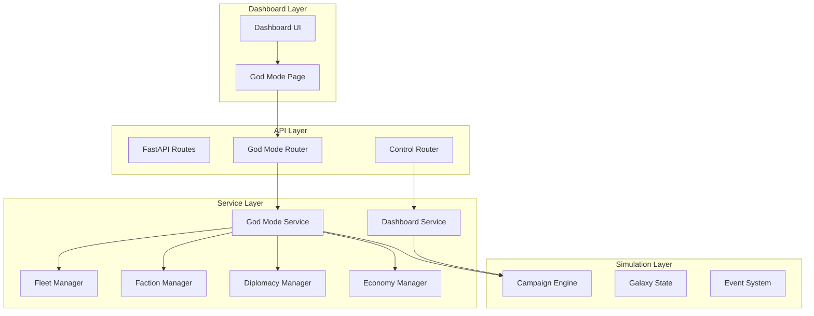

# God Mode Feature - Comprehensive Implementation Plan

## Executive Summary

This document outlines the design and implementation plan for a "God Mode" feature for the Multi-Universe Strategy Engine. God Mode provides administrators and developers with powerful tools to manipulate the simulation state, spawn fleets, control factions, and experiment with scenarios in real-time through the dashboard interface.

**Core Philosophy**: "The universe is your oyster" - provide maximum flexibility for testing, debugging, and creative experimentation while maintaining simulation integrity.

---

## 1. System Architecture Overview

### 1.1 High-Level Architecture



### 1.2 Component Responsibilities

| Component | Responsibilities |
|-----------|-----------------|
| **GodModeUI** | React-based dashboard page with controls for all God Mode features |
| **GodModeRouter** | FastAPI routes for God Mode operations |
| **GodModeService** | Core business logic for God Mode operations |
| **FleetSpawner** | Handles fleet creation with random weapons and configurable parameters |
| **SimulationController** | Manages simulation state overrides (pause, speed, events) |
| **UniverseManipulator** | Handles direct universe state modifications |

---

## 2. Core Requirements Implementation

### 2.1 Separate Dashboard Page for God Mode

#### 2.1.1 Frontend Implementation

**File**: `frontend/src/pages/GodMode.tsx`

**Features**:
- Tabbed interface for different God Mode categories
- Real-time feedback on all operations
- Confirmation dialogs for destructive actions
- Visual indicators for active God Mode effects

**Tab Structure**:
1. **Fleet Control** - Spawn, modify, delete fleets
2. **Faction Control** - Manage factions, relations, resources
3. **Universe Control** - Time, events, universe parameters
4. **System Control** - Modify systems, planets, portals
5. **Scenario Presets** - Quick-load predefined scenarios

#### 2.1.2 Backend API Routes

**File**: `src/reporting/dashboard_v2/api/routes/god_mode.py`

```python
# Core endpoints
GET    /api/god-mode/status              # Get God Mode status and capabilities
POST   /api/god-mode/spawn-fleet       # Spawn a new fleet
POST   /api/god-mode/modify-fleet       # Modify existing fleet
DELETE /api/god-mode/fleet/{fleet_id}  # Delete a fleet
POST   /api/god-mode/set-relation       # Set faction relations
POST   /api/god-mode/set-resources      # Set faction resources
POST   /api/god-mode/trigger-event      # Trigger custom events
POST   /api/god-mode/set-time-speed    # Control simulation speed
POST   /api/god-mode/apply-preset      # Apply scenario preset
```

### 2.2 Fleet Spawning System

#### 2.2.1 Fleet Spawner Service

**File**: `src/managers/god_mode/fleet_spawner.py`

**Class**: `FleetSpawner`

**Responsibilities**:
- Create fleets with configurable ship compositions
- Assign random weapons from appropriate pools
- Set troop strength levels for transport ships
- Validate fleet parameters before spawning

**Key Methods**:

```python
class FleetSpawner:
    def __init__(self, engine: CampaignEngine, weapon_db: Dict):
        self.engine = engine
        self.weapon_db = weapon_db
    
    def spawn_fleet(self, config: FleetSpawnConfig) -> Fleet:
        """
        Spawns a fleet with specified configuration.
        
        Args:
            config: FleetSpawnConfig containing:
                - faction: str
                - location: str (system/planet name)
                - ships: Dict[str, int]  # ship_class -> count
                - troop_strength: int (1-100)
                - random_weapons: bool
                - weapon_tier: str (low/medium/high/all)
        
        Returns:
            Created Fleet object
        """
    
    def _assign_random_weapons(self, unit: Unit, tier: str) -> None:
        """
        Assigns random weapons to a unit based on tier.
        Respects unit's authentic_weapons list and weapon hardpoints.
        """
    
    def _set_troop_strength(self, unit: Unit, strength: int) -> None:
        """
        Sets troop strength for transport-capable ships.
        Strength 1-100 maps to actual troop capacity and quality.
        """
    
    def _validate_config(self, config: FleetSpawnConfig) -> bool:
        """Validates fleet spawn configuration."""
```

**Configuration Model**:

```python
from pydantic import BaseModel
from typing import Dict, Optional

class FleetSpawnConfig(BaseModel):
    faction: str
    location: str  # System name or planet name
    ships: Dict[str, int]  # {"Escort": 5, "Cruiser": 2, "Battleship": 1}
    troop_strength: int = 50  # 1-100
    random_weapons: bool = True
    weapon_tier: str = "medium"  # low, medium, high, all
    fleet_name: Optional[str] = None
    auto_assign: bool = True  # Auto-assign to AI control
```

#### 2.2.2 Ship Class Management

**File**: `src/managers/god_mode/ship_class_manager.py`

**Responsibilities**:
- Define available ship classes for each faction
- Provide weapon pools for each ship class
- Validate ship class availability

**Ship Class Definitions**:

```python
SHIP_CLASSES = {
    "Escort": {
        "base_hp": 100,
        "speed": 8,
        "weapon_slots": 2,
        "transport_capacity": 0,
        "weapon_tiers": {
            "low": ["laser_blaster", "gatling_blaster"],
            "medium": ["plasma_cannon", "missile_launcher"],
            "high": ["volcano_cannon", "plasma_annihilator"]
        }
    },
    "Cruiser": {
        "base_hp": 300,
        "speed": 4,
        "weapon_slots": 4,
        "transport_capacity": 2,
        "weapon_tiers": {
            "low": ["heavy_laser", "missile_battery"],
            "medium": ["plasma_blastgun", "apocalypse_missile"],
            "high": ["volcano_cannon", "lance_array"]
        }
    },
    "Battleship": {
        "base_hp": 600,
        "speed": 2,
        "weapon_slots": 6,
        "transport_capacity": 4,
        "weapon_tiers": {
            "low": ["battleship_cannon"],
            "medium": ["battleship_plasma", "broadside_batteries"],
            "high": ["titan_weapon", "superweapon"]
        }
    }
}
```

### 2.3 Troop Strength System

**File**: `src/managers/god_mode/troop_manager.py`

**Responsibilities**:
- Map strength levels (1-100) to troop quality
- Create army units based on strength level
- Assign troops to transport ships

**Strength Level Mapping**:

| Strength | Quality | Equipment | Morale | Special Abilities |
|----------|----------|------------|----------|------------------|
| 1-20 | Conscript | Basic | 30 | None |
| 21-40 | Regular | Standard | 40 | None |
| 41-60 | Veteran | Upgraded | 50 | +1 to hit |
| 61-80 | Elite | Advanced | 60 | +2 to hit, +1 armor |
| 81-100 | Legendary | Experimental | 70 | +3 to hit, +2 armor, special trait |

### 2.4 Simulation Control Options

**File**: `src/managers/god_mode/simulation_controller.py`

**Class**: `SimulationController`

**Features**:

```python
class SimulationController:
    def __init__(self, engine: CampaignEngine):
        self.engine = engine
        self.overrides = {
            "peace_causes_war": False,
            "war_causes_peace": False,
            "diplomacy_disabled": False,
            "economy_disabled": False,
            "combat_disabled": False,
            "ai_disabled": False
        }
    
    def set_override(self, override_name: str, value: bool) -> None:
        """Set a simulation override."""
        self.overrides[override_name] = value
    
    def trigger_event(self, event_type: str, params: Dict) -> None:
        """Trigger a custom event in the simulation."""
        pass
    
    def set_time_speed(self, speed: float) -> None:
        """Set simulation time multiplier (0.1x to 10x)."""
        pass
    
    def force_turn(self, turn_number: int) -> None:
        """Jump simulation to a specific turn."""
        pass
```

---

## 3. Additional God Mode Features

### 3.1 Universe Manipulation Options

#### 3.1.1 System/Planet Modification

**Endpoints**:
```
POST /api/god-mode/system/{system_name}/modify
POST /api/god-mode/planet/{planet_name}/modify
POST /api/god-mode/create-system
POST /api/god-mode/create-planet
DELETE /api/god-mode/system/{system_name}
```

**Features**:
- Modify system attributes (resources, strategic value)
- Create new star systems with custom parameters
- Create planets with custom attributes
- Delete systems/planets (with confirmation)
- Modify planet ownership instantly
- Set planet development level

**Modification Parameters**:
```python
class SystemModifyConfig(BaseModel):
    name: Optional[str] = None
    strategic_value: Optional[int] = None
    resource_bonus: Optional[float] = None
    portal_enabled: Optional[bool] = None

class PlanetModifyConfig(BaseModel):
    name: Optional[str] = None
    owner: Optional[str] = None
    development: Optional[int] = None  # 1-10
    infrastructure: Optional[Dict[str, int]] = None
    population: Optional[int] = None
```

#### 3.1.2 Portal Network Control

**Features**:
- Enable/disable portals
- Create new portal connections
- Modify portal travel time
- Force portal activation/deactivation

**Endpoints**:
```
POST /api/god-mode/portal/create
POST /api/god-mode/portal/{portal_id}/modify
DELETE /api/god-mode/portal/{portal_id}
```

### 3.2 Faction Control

#### 3.2.1 Faction Management

**Endpoints**:
```
GET    /api/god-mode/factions              # List all factions with details
POST   /api/god-mode/faction/{name}/modify  # Modify faction attributes
POST   /api/god-mode/faction/create         # Create new faction
DELETE /api/god-mode/faction/{name}       # Eliminate faction
POST   /api/god-mode/faction/{name}/ai    # Set AI personality
```

**Features**:
- Modify faction resources (requisition, research, etc.)
- Set faction technology level
- Change faction AI personality
- Enable/disable faction AI
- Create custom factions
- Eliminate factions instantly
- Set faction victory progress

**Faction Modify Config**:
```python
class FactionModifyConfig(BaseModel):
    resources: Optional[Dict[str, int]] = None
    technology_level: Optional[int] = None
    ai_enabled: Optional[bool] = None
    ai_personality: Optional[str] = None
    alive: Optional[bool] = None
    victory_progress: Optional[float] = None
```

#### 3.2.2 Diplomacy Control

**Endpoints**:
```
POST /api/god-mode/diplomacy/set-relation
POST /api/god-mode/diplomacy/set-alliance
POST /api/god-mode/diplomacy/set-war
POST /api/god-mode/diplomacy/set-peace
POST /api/god-mode/diplomacy/force-treaty
```

**Features**:
- Set relations between any two factions (-100 to 100)
- Force alliances between factions
- Force war declarations
- Force peace treaties
- Set treaty duration
- Clear all grudges
- Reset diplomacy to initial state

**Relation Config**:
```python
class RelationConfig(BaseModel):
    faction_a: str
    faction_b: str
    relation: int  # -100 to 100
    treaty: Optional[str] = None  # Peace, War, Alliance, etc.
    duration: Optional[int] = None  # Treaty duration in turns
```

### 3.3 Resource Manipulation

**Endpoints**:
```
POST /api/god-mode/resources/set
POST /api/god-mode/resources/add
POST /api/god-mode/resources/multiply
```

**Features**:
- Set exact resource amounts for factions
- Add resources to factions
- Multiply all resources by a factor
- Set global resource generation rates
- Enable/disable resource consumption

**Resource Config**:
```python
class ResourceConfig(BaseModel):
    faction: str
    resources: Dict[str, int]  # requisition, research, etc.
    operation: str  # set, add, multiply
    multiplier: Optional[float] = None
```

### 3.4 Event Triggering

**Endpoints**:
```
POST /api/god-mode/event/trigger
POST /api/god-mode/event/create-custom
GET  /api/god-mode/events/available
```

**Features**:
- Trigger predefined events (crisis, discovery, etc.)
- Create custom events with parameters
- Schedule events for future turns
- Event categories:
  - **Crisis Events**: Plague, rebellion, invasion
  - **Discovery Events**: New technology, ancient artifact
  - **Diplomatic Events**: Summit, betrayal, proposal
  - **Economic Events**: Boom, depression, trade route
  - **Military Events**: Mutiny, defection, hero appearance

**Event Config**:
```python
class EventConfig(BaseModel):
    event_type: str
    target_faction: Optional[str] = None
    target_system: Optional[str] = None
    parameters: Optional[Dict[str, Any]] = None
    delay_turns: Optional[int] = 0
```

### 3.5 Time Control

**Endpoints**:
```
POST /api/god-mode/time/pause
POST /api/god-mode/time/resume
POST /api/god-mode/time/set-speed
POST /api/god-mode/time/jump-to-turn
POST /api/god-mode/time/set-turn-limit
```

**Features**:
- Pause/resume simulation
- Set simulation speed (0.1x to 10x)
- Jump to specific turn
- Set turn limit
- Enable/disable auto-advance
- Step forward N turns

**Time Config**:
```python
class TimeConfig(BaseModel):
    action: str  # pause, resume, set_speed, jump, set_limit
    speed: Optional[float] = None  # 0.1 to 10.0
    target_turn: Optional[int] = None
    turn_limit: Optional[int] = None
    step_count: Optional[int] = None
```

### 3.6 Creative Features

#### 3.6.1 Hero/Unit Manipulation

**Endpoints**:
```
POST /api/god-mode/hero/create
POST /api/god-mode/hero/{name}/modify
POST /api/god-mode/hero/{name}/teleport
DELETE /api/god-mode/hero/{name}
```

**Features**:
- Create custom heroes with unique abilities
- Modify hero stats and equipment
- Teleport heroes to any location
- Set hero allegiance
- Grant heroes experience/levels

#### 3.6.2 Weather/Environment Control

**Endpoints**:
```
POST /api/god-mode/weather/set
POST /api/god-mode/flux-storm/trigger
POST /api/god-mode/flux-storm/clear
```

**Features**:
- Set weather conditions on planets
- Trigger flux storms in systems
- Clear all environmental effects
- Set global weather patterns

#### 3.6.3 Technology Control

**Endpoints**:
```
POST /api/god-mode/tech/grant
POST /api/god-mode/tech/revoke
POST /api/god-mode/tech/set-progress
GET  /api/god-mode/tech/tree
```

**Features**:
- Grant specific technologies to factions
- Revoke technologies
- Set technology research progress
- Unlock all technologies
- Lock technology trees

#### 3.6.4 Combat Manipulation

**Endpoints**:
```
POST /api/god-mode/combat/force-result
POST /api/god-mode/combat/modify-unit
POST /api/god-mode/combat/destroy-fleet
POST /api/god-mode/combat/destroy-army
```

**Features**:
- Force combat results
- Modify unit stats in combat
- Destroy fleets instantly
- Destroy armies instantly
- Set combat damage multipliers

#### 3.6.5 Scenario Presets

**File**: `src/managers/god_mode/scenarios.py`

**Predefined Scenarios**:

```python
SCENARIOS = {
    "apocalypse": {
        "name": "Apocalypse",
        "description": "All factions at war, maximum fleets",
        "setup": lambda engine: setup_apocalypse(engine)
    },
    "cold_war": {
        "name": "Cold War",
        "description": "High tensions, no active wars",
        "setup": lambda engine: setup_cold_war(engine)
    },
    "economic_boom": {
        "name": "Economic Boom",
        "description": "All factions have massive resources",
        "setup": lambda engine: setup_economic_boom(engine)
    },
    "tech_race": {
        "name": "Technology Race",
        "description": "All factions have advanced tech",
        "setup": lambda engine: setup_tech_race(engine)
    },
    "underdog": {
        "name": "Underdog Victory",
        "description": "One faction vs all others",
        "setup": lambda engine: setup_underdog(engine)
    },
    "chaos_invasion": {
        "name": "Chaos Invasion",
        "description": "Void-Spawn entities everywhere",
        "setup": lambda engine: setup_chaos_invasion(engine)
    }
}
```

**Scenario Management Endpoints**:
```
GET  /api/god-mode/scenarios
POST /api/god-mode/scenario/apply
POST /api/god-mode/scenario/save-custom
```

#### 3.6.6 Debugging Tools

**Endpoints**:
```
POST /api/god-mode/debug/dump-state
POST /api/god-mode/debug/validate
POST /api/god-mode/debug/profile
GET  /api/god-mode/debug/metrics
```

**Features**:
- Dump complete simulation state to JSON
- Validate simulation integrity
- Profile performance
- Get detailed debug metrics
- Enable debug logging for specific systems

---

## 4. God Personality & Alignment System

### 4.1 Overview

The God Personality & Alignment System adds role-playing depth to God Mode by allowing administrators to adopt a divine persona with specific behavioral patterns. The system tracks the god's alignment (Benevolent ↔ Neutral ↔ Malevolent) and applies actions consistent with that alignment.

### 4.2 Alignment System

#### 4.2.1 Alignment Slider

**File**: `src/managers/god_mode/alignment_manager.py`

```python
class GodAlignment(Enum):
    BENEVOLENT = -100  # Pure benevolence
    MOSTLY_BENEVOLENT = -50
    NEUTRAL = 0
    MOSTLY_MALEVOLENT = 50
    MALEVOLENT = 100  # Pure malevolence

class AlignmentManager:
    def __init__(self, engine: CampaignEngine):
        self.engine = engine
        self.current_alignment = GodAlignment.NEUTRAL
        self.alignment_history = []
    
    def set_alignment(self, alignment: GodAlignment) -> None:
        """Set the god's alignment."""
        self.current_alignment = alignment
        self.alignment_history.append({
            "timestamp": time.time(),
            "alignment": alignment,
            "turn": self.engine.turn_number
        })
    
    def get_alignment(self) -> GodAlignment:
        """Get current alignment."""
        return self.current_alignment
    
    def is_benevolent(self) -> bool:
        """Check if current alignment is benevolent."""
        return self.current_alignment.value < 0
    
    def is_malevolent(self) -> bool:
        """Check if current alignment is malevolent."""
        return self.current_alignment.value > 0
```

#### 4.2.2 Alignment Configuration

```python
class AlignmentConfig(BaseModel):
    alignment: str  # "benevolent", "neutral", "malevolent", or numeric -100 to 100
    intensity: int = 50  # 1-100, strength of alignment effects
    target_factions: Optional[List[str]] = None  # None = all factions
```

### 4.3 God Moods

God Moods are predefined behavioral patterns that combine alignment with specific action sets. Each mood determines which actions are available and how frequently they occur.

#### 4.3.1 Mood Definitions

**File**: `src/managers/god_mode/mood_registry.py`

```python
GOD_MOODS = {
    "benevolent_protector": {
        "name": "Benevolent Protector",
        "alignment": "benevolent",
        "description": "Actively protects factions from harm and grants blessings",
        "actions": [
            "bless_resources",
            "bless_military",
            "protect_from_disaster",
            "heal_fleets",
            "grant_hero_abilities",
            "favorable_weather",
            "boost_economy",
            "resolve_conflicts",
            "grant_immunity",
            "spawn_allies"
        ],
        "frequency": "high"
    },
    "benevolent_creator": {
        "name": "Benevolent Creator",
        "alignment": "benevolent",
        "description": "Focuses on prosperity and creation",
        "actions": [
            "bless_resources",
            "bless_tech",
            "boost_economy",
            "favorable_weather",
            "spawn_resources",
            "create_infrastructure",
            "grant_hero_abilities"
        ],
        "frequency": "medium"
    },
    "neutral_observer": {
        "name": "Neutral Observer",
        "alignment": "neutral",
        "description": "Watches without interference",
        "actions": [],
        "frequency": "none"
    },
    "neutral_balancer": {
        "name": "Neutral Balancer",
        "alignment": "neutral",
        "description": "Maintains equilibrium between factions",
        "actions": [
            "balance_resources",
            "balance_military",
            "enforce_peace",
            "moderate_events"
        ],
        "frequency": "low"
    },
    "malevolent_destroyer": {
        "name": "Malevolent Destroyer",
        "alignment": "malevolent",
        "description": "Brings destruction and chaos",
        "actions": [
            "curse_resources",
            "curse_military",
            "trigger_disaster",
            "destroy_fleets",
            "remove_hero_abilities",
            "destructive_weather",
            "sabotage_economy",
            "force_conflicts",
            "spawn_enemies"
        ],
        "frequency": "high"
    },
    "malevolent_tormentor": {
        "name": "Malevolent Tormentor",
        "alignment": "malevolent",
        "description": "Inflicts suffering and hardship",
        "actions": [
            "curse_resources",
            "curse_tech",
            "trigger_plague",
            "sabotage_economy",
            "increase_vulnerability",
            "kill_heroes"
        ],
        "frequency": "medium"
    }
}
```

### 4.4 Faction-Specific Blessings and Curses

Each faction can receive unique blessings or curses based on their relationship with the god.

#### 4.4.1 Faction Favor System

```python
class FactionFavor:
    def __init__(self, faction_name: str):
        self.faction_name = faction_name
        self.favor_score = 0  # -100 to 100
        self.active_blessings = []
        self.active_curses = []
        self.divine_intervention_history = []
    
    def modify_favor(self, amount: int) -> None:
        """Modify faction favor score."""
        self.favor_score = max(-100, min(100, self.favor_score + amount))
    
    def add_blessing(self, blessing: str, duration: int) -> None:
        """Add a blessing to the faction."""
        self.active_blessings.append({
            "type": blessing,
            "duration": duration,
            "start_turn": self.engine.turn_number
        })
    
    def add_curse(self, curse: str, duration: int) -> None:
        """Add a curse to the faction."""
        self.active_curses.append({
            "type": curse,
            "duration": duration,
            "start_turn": self.engine.turn_number
        })
```

### 4.5 Benevolent Actions

**File**: `src/managers/god_mode/benevolent_actions.py`

```python
class BenevolentActions:
    def __init__(self, engine: CampaignEngine):
        self.engine = engine
    
    def bless_resources(self, faction: str, amount: int) -> Dict:
        """Grant resources to a faction."""
        faction_obj = self.engine.get_faction(faction)
        for resource in ["requisition", "research", "influence"]:
            faction_obj.resources[resource] += amount
        return {"action": "bless_resources", "faction": faction, "amount": amount}
    
    def bless_military(self, faction: str, multiplier: float) -> Dict:
        """Boost military strength of a faction."""
        faction_obj = self.engine.get_faction(faction)
        for fleet in faction_obj.fleets:
            for unit in fleet.units:
                unit.combat_strength *= multiplier
        return {"action": "bless_military", "faction": faction, "multiplier": multiplier}
    
    def bless_tech(self, faction: str, tech_levels: int) -> Dict:
        """Grant technology levels to a faction."""
        faction_obj = self.engine.get_faction(faction)
        faction_obj.tech_level += tech_levels
        return {"action": "bless_tech", "faction": faction, "levels": tech_levels}
    
    def protect_from_disaster(self, faction: str, duration: int) -> Dict:
        """Grant immunity from disasters for a duration."""
        faction_obj = self.engine.get_faction(faction)
        faction_obj.divine_protection = duration
        return {"action": "protect_from_disaster", "faction": faction, "duration": duration}
    
    def heal_fleets(self, faction: str, heal_percent: int) -> Dict:
        """Restore health to all fleets of a faction."""
        faction_obj = self.engine.get_faction(faction)
        for fleet in faction_obj.fleets:
            for unit in fleet.units:
                unit.hp = int(unit.max_hp * (heal_percent / 100))
        return {"action": "heal_fleets", "faction": faction, "percent": heal_percent}
    
    def grant_hero_abilities(self, faction: str, hero: str, abilities: List[str]) -> Dict:
        """Grant divine abilities to a hero."""
        faction_obj = self.engine.get_faction(faction)
        hero_obj = faction_obj.get_hero(hero)
        for ability in abilities:
            hero_obj.abilities.append(ability)
        return {"action": "grant_hero_abilities", "faction": faction, "hero": hero, "abilities": abilities}
    
    def favorable_weather(self, system: str, duration: int) -> Dict:
        """Set favorable weather conditions in a system."""
        system_obj = self.engine.get_system(system)
        system_obj.weather = "favorable"
        system_obj.weather_duration = duration
        return {"action": "favorable_weather", "system": system, "duration": duration}
    
    def boost_economy(self, faction: str, multiplier: float, duration: int) -> Dict:
        """Boost economic production for a faction."""
        faction_obj = self.engine.get_faction(faction)
        faction_obj.economy_multiplier = multiplier
        faction_obj.economy_boost_duration = duration
        return {"action": "boost_economy", "faction": faction, "multiplier": multiplier, "duration": duration}
    
    def resolve_conflicts(self, faction_a: str, faction_b: str) -> Dict:
        """Force peace between two factions."""
        self.engine.set_relation(faction_a, faction_b, 50, "Peace")
        return {"action": "resolve_conflicts", "faction_a": faction_a, "faction_b": faction_b}
    
    def grant_immunity(self, faction: str, event_type: str, duration: int) -> Dict:
        """Grant immunity from a specific event type."""
        faction_obj = self.engine.get_faction(faction)
        faction_obj.immunities.append({"type": event_type, "duration": duration})
        return {"action": "grant_immunity", "faction": faction, "event_type": event_type, "duration": duration}
    
    def spawn_allies(self, faction: str, location: str, strength: int) -> Dict:
        """Spawn allied units to help a faction."""
        spawner = FleetSpawner(self.engine)
        config = FleetSpawnConfig(
            faction=faction,
            location=location,
            ships={"Escort": 3, "Cruiser": 2},
            troop_strength=strength
        )
        fleet = spawner.spawn_fleet(config)
        return {"action": "spawn_allies", "faction": faction, "location": location, "fleet_id": fleet.id}
    
    def revive_faction(self, faction: str, location: str) -> Dict:
        """Revive a destroyed faction."""
        faction_obj = self.engine.get_faction(faction)
        faction_obj.alive = True
        faction_obj.capital = location
        # Spawn starting fleet
        spawner = FleetSpawner(self.engine)
        config = FleetSpawnConfig(
            faction=faction,
            location=location,
            ships={"Cruiser": 2, "Battleship": 1},
            troop_strength=50
        )
        spawner.spawn_fleet(config)
        return {"action": "revive_faction", "faction": faction, "location": location}
```

### 4.6 Malevolent Actions

**File**: `src/managers/god_mode/malevolent_actions.py`

```python
class MalevolentActions:
    def __init__(self, engine: CampaignEngine):
        self.engine = engine
    
    def curse_resources(self, faction: str, drain_percent: int) -> Dict:
        """Drain resources from a faction."""
        faction_obj = self.engine.get_faction(faction)
        for resource in ["requisition", "research", "influence"]:
            faction_obj.resources[resource] = int(faction_obj.resources[resource] * (1 - drain_percent / 100))
        return {"action": "curse_resources", "faction": faction, "percent": drain_percent}
    
    def curse_military(self, faction: str, multiplier: float) -> Dict:
        """Weaken military strength of a faction."""
        faction_obj = self.engine.get_faction(faction)
        for fleet in faction_obj.fleets:
            for unit in fleet.units:
                unit.combat_strength *= multiplier
        return {"action": "curse_military", "faction": faction, "multiplier": multiplier}
    
    def curse_tech(self, faction: str, tech_loss: int) -> Dict:
        """Remove technology levels from a faction."""
        faction_obj = self.engine.get_faction(faction)
        faction_obj.tech_level = max(0, faction_obj.tech_level - tech_loss)
        return {"action": "curse_tech", "faction": faction, "levels_lost": tech_loss}
    
    def trigger_disaster(self, faction: str, system: str, disaster_type: str, severity: str) -> Dict:
        """Trigger a disaster in a system."""
        disaster_effects = {
            "plague": {"population_loss": 50, "economy_penalty": 30},
            "rebellion": {"loyalty_loss": 40, "military_penalty": 25},
            "economic_collapse": {"resource_loss": 70, "production_penalty": 50},
            "meteor_strike": {"infrastructure_loss": 60, "population_loss": 30}
        }
        effects = disaster_effects.get(disaster_type, {})
        return {"action": "trigger_disaster", "faction": faction, "system": system, "type": disaster_type, "severity": severity, "effects": effects}
    
    def destroy_fleets(self, faction: str, fleet_ids: List[str]) -> Dict:
        """Destroy specific fleets of a faction."""
        faction_obj = self.engine.get_faction(faction)
        destroyed = []
        for fleet_id in fleet_ids:
            fleet = faction_obj.get_fleet(fleet_id)
            if fleet:
                faction_obj.fleets.remove(fleet)
                destroyed.append(fleet_id)
        return {"action": "destroy_fleets", "faction": faction, "destroyed": destroyed}
    
    def remove_hero_abilities(self, faction: str, hero: str, abilities: List[str]) -> Dict:
        """Remove abilities from a hero."""
        faction_obj = self.engine.get_faction(faction)
        hero_obj = faction_obj.get_hero(hero)
        removed = []
        for ability in abilities:
            if ability in hero_obj.abilities:
                hero_obj.abilities.remove(ability)
                removed.append(ability)
        return {"action": "remove_hero_abilities", "faction": faction, "hero": hero, "removed": removed}
    
    def kill_hero(self, faction: str, hero: str) -> Dict:
        """Kill a hero."""
        faction_obj = self.engine.get_faction(faction)
        hero_obj = faction_obj.get_hero(hero)
        faction_obj.heroes.remove(hero_obj)
        return {"action": "kill_hero", "faction": faction, "hero": hero}
    
    def destructive_weather(self, system: str, weather_type: str, duration: int) -> Dict:
        """Set destructive weather in a system."""
        system_obj = self.engine.get_system(system)
        system_obj.weather = weather_type
        system_obj.weather_duration = duration
        return {"action": "destructive_weather", "system": system, "type": weather_type, "duration": duration}
    
    def sabotage_economy(self, faction: str, penalty: float, duration: int) -> Dict:
        """Sabotage economic production for a faction."""
        faction_obj = self.engine.get_faction(faction)
        faction_obj.economy_multiplier = penalty
        faction_obj.economy_penalty_duration = duration
        return {"action": "sabotage_economy", "faction": faction, "penalty": penalty, "duration": duration}
    
    def force_conflicts(self, faction_a: str, faction_b: str) -> Dict:
        """Force war between two factions."""
        self.engine.set_relation(faction_a, faction_b, -100, "War")
        return {"action": "force_conflicts", "faction_a": faction_a, "faction_b": faction_b}
    
    def increase_vulnerability(self, faction: str, event_type: str, multiplier: float) -> Dict:
        """Increase vulnerability to specific events."""
        faction_obj = self.engine.get_faction(faction)
        faction_obj.vulnerabilities.append({"type": event_type, "multiplier": multiplier})
        return {"action": "increase_vulnerability", "faction": faction, "event_type": event_type, "multiplier": multiplier}
    
    def spawn_enemies(self, faction: str, location: str, enemy_faction: str, strength: int) -> Dict:
        """Spawn enemy units to attack a faction."""
        spawner = FleetSpawner(self.engine)
        config = FleetSpawnConfig(
            faction=enemy_faction,
            location=location,
            ships={"Escort": 4, "Cruiser": 2, "Battleship": 1},
            troop_strength=strength
        )
        fleet = spawner.spawn_fleet(config)
        return {"action": "spawn_enemies", "target": faction, "location": location, "enemy_faction": enemy_faction, "fleet_id": fleet.id}
    
    def eliminate_faction(self, faction: str) -> Dict:
        """Eliminate a faction entirely."""
        faction_obj = self.engine.get_faction(faction)
        faction_obj.alive = False
        # Remove all fleets
        faction_obj.fleets.clear()
        # Remove all heroes
        faction_obj.heroes.clear()
        # Set all systems to unowned or transfer to allies
        for system in faction_obj.owned_systems:
            system.owner = None
        return {"action": "eliminate_faction", "faction": faction}
```

### 4.7 Divine Intervention Events

Divine interventions are rare, powerful events that occur automatically based on alignment and mood.

#### 4.7.1 Intervention Types

```python
DIVINE_INTERVENTIONS = {
    # Benevolent Interventions
    "miracle_healing": {
        "type": "miracle",
        "alignment": "benevolent",
        "rarity": "rare",
        "description": "All fleets of a faction are fully healed",
        "effect": "heal_all_fleets"
    },
    "miracle_prosperity": {
        "type": "miracle",
        "alignment": "benevolent",
        "rarity": "rare",
        "description": "Massive resource boost to a faction",
        "effect": "massive_resource_boost"
    },
    "divine_shield": {
        "type": "miracle",
        "alignment": "benevolent",
        "rarity": "rare",
        "description": "Temporary immunity from all attacks",
        "effect": "grant_total_immunity"
    },
    "hero_ascension": {
        "type": "miracle",
        "alignment": "benevolent",
        "rarity": "rare",
        "description": "A hero gains divine powers",
        "effect": "grant_divine_abilities"
    },
    
    # Malevolent Interventions
    "divine_punishment": {
        "type": "punishment",
        "alignment": "malevolent",
        "rarity": "rare",
        "description": "Catastrophic event strikes a faction",
        "effect": "trigger_catastrophe"
    },
    "curse_of_weakness": {
        "type": "punishment",
        "alignment": "malevolent",
        "rarity": "rare",
        "description": "All units of a faction are severely weakened",
        "effect": "weaken_all_units"
    },
    "divine_abandonment": {
        "type": "punishment",
        "alignment": "malevolent",
        "rarity": "rare",
        "description": "All heroes lose their abilities",
        "effect": "strip_all_abilities"
    },
    "plague_of_locusts": {
        "type": "punishment",
        "alignment": "malevolent",
        "rarity": "rare",
        "description": "Massive resource drain from a faction",
        "effect": "drain_all_resources"
    },
    
    # Neutral Interventions
    "prophecy_warning": {
        "type": "prophecy",
        "alignment": "neutral",
        "rarity": "uncommon",
        "description": "Forewarning of a future event",
        "effect": "reveal_future_event"
    },
    "balance_shift": {
        "type": "prophecy",
        "alignment": "neutral",
        "rarity": "uncommon",
        "description": "Power shifts between factions",
        "effect": "redistribute_power"
    },
    "divine_messenger": {
        "type": "prophecy",
        "alignment": "neutral",
        "rarity": "uncommon",
        "description": "A messenger arrives with information",
        "effect": "reveal_hidden_info"
    }
}
```

#### 4.7.2 Intervention Manager

**File**: `src/managers/god_mode/intervention_manager.py`

```python
class DivineInterventionManager:
    def __init__(self, engine: CampaignEngine, alignment_manager: AlignmentManager):
        self.engine = engine
        self.alignment_manager = alignment_manager
        self.benevolent_actions = BenevolentActions(engine)
        self.malevolent_actions = MalevolentActions(engine)
        self.intervention_history = []
        self.prophecy_queue = []
    
    def trigger_intervention(self, intervention_type: str, target_faction: Optional[str] = None) -> Dict:
        """Manually trigger a divine intervention."""
        intervention = DIVINE_INTERVENTIONS.get(intervention_type)
        if not intervention:
            return {"error": "Unknown intervention type"}
        
        result = self._execute_intervention(intervention, target_faction)
        self.intervention_history.append({
            "timestamp": time.time(),
            "intervention": intervention_type,
            "target": target_faction,
            "result": result,
            "turn": self.engine.turn_number
        })
        return result
    
    def _execute_intervention(self, intervention: Dict, target_faction: Optional[str]) -> Dict:
        """Execute a divine intervention."""
        effect = intervention["effect"]
        alignment = intervention["alignment"]
        
        if not target_faction:
            factions = self.engine.get_all_factions()
            target_faction = random.choice(factions)
        
        if alignment == "benevolent":
            return self._execute_benevolent_intervention(effect, target_faction)
        elif alignment == "malevolent":
            return self._execute_malevolent_intervention(effect, target_faction)
        else:
            return self._execute_neutral_intervention(effect, target_faction)
    
    def _execute_benevolent_intervention(self, effect: str, faction: str) -> Dict:
        """Execute a benevolent intervention."""
        if effect == "heal_all_fleets":
            return self.benevolent_actions.heal_fleets(faction, 100)
        elif effect == "massive_resource_boost":
            return self.benevolent_actions.bless_resources(faction, 10000)
        elif effect == "grant_total_immunity":
            return self.benevolent_actions.grant_immunity(faction, "all", 10)
        elif effect == "grant_divine_abilities":
            hero = random.choice(self.engine.get_faction(faction).heroes)
            return self.benevolent_actions.grant_hero_abilities(faction, hero.name, ["divine_power", "immortality"])
    
    def _execute_malevolent_intervention(self, effect: str, faction: str) -> Dict:
        """Execute a malevolent intervention."""
        if effect == "trigger_catastrophe":
            return self.malevolent_actions.trigger_disaster(faction, faction.capital, "plague", "extreme")
        elif effect == "weaken_all_units":
            return self.malevolent_actions.curse_military(faction, 0.5)
        elif effect == "strip_all_abilities":
            for hero in self.engine.get_faction(faction).heroes:
                abilities = [a for a in hero.abilities]
                self.malevolent_actions.remove_hero_abilities(faction, hero.name, abilities)
            return {"action": "strip_all_abilities", "faction": faction}
        elif effect == "drain_all_resources":
            return self.malevolent_actions.curse_resources(faction, 90)
    
    def _execute_neutral_intervention(self, effect: str, faction: str) -> Dict:
        """Execute a neutral intervention."""
        if effect == "reveal_future_event":
            event = self._generate_prophecy()
            self.prophecy_queue.append(event)
            return {"action": "prophecy_warning", "faction": faction, "prophecy": event}
        elif effect == "redistribute_power":
            return {"action": "balance_shift", "faction": faction, "effect": "power_redistributed"}
        elif effect == "reveal_hidden_info":
            return {"action": "divine_messenger", "faction": faction, "info": "hidden_revelation"}
    
    def _generate_prophecy(self) -> Dict:
        """Generate a prophecy about a future event."""
        events = ["disaster", "discovery", "war", "alliance", "economic_change"]
        return {
            "type": random.choice(events),
            "turn": self.engine.turn_number + random.randint(5, 20),
            "faction": random.choice(self.engine.get_all_factions()),
            "certainty": random.randint(50, 100)
        }
    
    def get_prophecies(self) -> List[Dict]:
        """Get all active prophecies."""
        return self.prophecy_queue
    
    def check_random_intervention(self) -> Optional[Dict]:
        """Check if a random divine intervention should occur."""
        alignment = self.alignment_manager.get_alignment()
        
        # Chance of intervention increases with alignment extremity
        intensity = abs(alignment.value) / 100
        chance = 0.01 * intensity  # Base 1% chance per turn at max alignment
        
        if random.random() < chance:
            interventions = [i for i in DIVINE_INTERVENTIONS.values()
                           if i["alignment"] == ("benevolent" if alignment.value < 0 else "malevolent")]
            intervention = random.choice(interventions)
            return self.trigger_intervention(intervention["type"])
        
        return None
```

### 4.8 Alignment & Mood UI

#### 4.8.1 Frontend Components

**File**: `frontend/src/components/GodMode/AlignmentControl.tsx`

```typescript
interface AlignmentControlProps {
    alignment: number;  // -100 to 100
    mood: string;
    onAlignmentChange: (value: number) => void;
    onMoodChange: (mood: string) => void;
}

const AlignmentControl: React.FC<AlignmentControlProps> = ({
    alignment,
    mood,
    onAlignmentChange,
    onMoodChange
}) => {
    return (
        <div className="alignment-control">
            <h3>God Personality & Alignment</h3>
            
            {/* Alignment Slider */}
            <div className="alignment-slider">
                <label>Alignment</label>
                <input
                    type="range"
                    min="-100"
                    max="100"
                    value={alignment}
                    onChange={(e) => onAlignmentChange(parseInt(e.target.value))}
                />
                <div className="alignment-labels">
                    <span className="benevolent">Benevolent</span>
                    <span className="neutral">Neutral</span>
                    <span className="malevolent">Malevolent</span>
                </div>
            </div>
            
            {/* Mood Selector */}
            <div className="mood-selector">
                <label>God Mood</label>
                <select value={mood} onChange={(e) => onMoodChange(e.target.value)}>
                    <option value="benevolent_protector">Benevolent Protector</option>
                    <option value="benevolent_creator">Benevolent Creator</option>
                    <option value="neutral_observer">Neutral Observer</option>
                    <option value="neutral_balancer">Neutral Balancer</option>
                    <option value="malevolent_destroyer">Malevolent Destroyer</option>
                    <option value="malevolent_tormentor">Malevolent Tormentor</option>
                </select>
            </div>
            
            {/* Available Actions Preview */}
            <div className="available-actions">
                <h4>Available Divine Actions</h4>
                <ActionList alignment={alignment} mood={mood} />
            </div>
        </div>
    );
};
```

---

## 6. Implementation Plan

### Phase 1: Foundation (Core Infrastructure)

**Files to Create**:
- `src/managers/god_mode/__init__.py`
- `src/managers/god_mode/fleet_spawner.py`
- `src/managers/god_mode/simulation_controller.py`
- `src/managers/god_mode/troop_manager.py`
- `src/managers/god_mode/ship_class_manager.py`
- `src/reporting/dashboard_v2/api/routes/god_mode.py`
- `src/reporting/dashboard_v2/api/models/god_mode.py`

**Files to Modify**:
- `src/reporting/dashboard_v2/api/main.py` - Add god_mode router
- `src/managers/campaign_manager.py` - Add God Mode hooks
- `src/managers/fleet_manager.py` - Add God Mode methods

**Tasks**:
1. Create God Mode service architecture
2. Implement FleetSpawner with random weapon assignment
3. Implement TroopManager with strength levels
4. Create API models for God Mode operations
5. Add God Mode router to FastAPI app
6. Implement basic fleet spawn endpoint
7. Add God Mode hooks to CampaignEngine

### Phase 2: Fleet Control UI

**Files to Create**:
- `frontend/src/pages/GodMode.tsx`
- `frontend/src/components/GodMode/FleetControl.tsx`
- `frontend/src/components/GodMode/ShipConfig.tsx`
- `frontend/src/components/GodMode/WeaponSelector.tsx`

**Tasks**:
1. Create God Mode page with tabbed interface
2. Implement Fleet Control tab
3. Create ship class configuration UI
4. Implement weapon tier selector
5. Add troop strength slider
6. Create fleet spawn form
7. Add real-time fleet list display

### Phase 3: Faction & Diplomacy Control

**Files to Create**:
- `frontend/src/components/GodMode/FactionControl.tsx`
- `frontend/src/components/GodMode/DiplomacyControl.tsx`
- `src/managers/god_mode/faction_controller.py`
- `src/managers/god_mode/diplomacy_controller.py`

**Tasks**:
1. Implement Faction Control tab
2. Create faction resource editor
3. Implement diplomacy matrix editor
4. Add relation controls
5. Create alliance/war/peace shortcuts
6. Implement faction AI toggle

### Phase 4: God Personality & Alignment System

**Files to Create**:
- `src/managers/god_mode/alignment_manager.py`
- `src/managers/god_mode/mood_registry.py`
- `src/managers/god_mode/benevolent_actions.py`
- `src/managers/god_mode/malevolent_actions.py`
- `src/managers/god_mode/intervention_manager.py`
- `frontend/src/components/GodMode/AlignmentControl.tsx`

**Files to Modify**:
- `src/managers/campaign_manager.py` - Add alignment tracking
- `src/reporting/dashboard_v2/api/routes/god_mode.py` - Add alignment/mood endpoints
- `frontend/src/pages/GodMode.tsx` - Add alignment tab

**Tasks**:
1. Implement AlignmentManager with slider support
2. Create GOD_MOODS registry with predefined moods
3. Implement BenevolentActions class with 10 blessing types
4. Implement MalevolentActions class with 11 curse types
5. Implement DivineInterventionManager with prophecy system
6. Create alignment slider UI component
7. Implement mood selector with action preview
8. Add blessing/curse application UI
9. Implement divine intervention trigger UI
10. Add prophecy display panel
11. Create faction favor tracking system
12. Implement automatic intervention checks

### Phase 5: Universe & System Control

**Files to Create**:
- `frontend/src/components/GodMode/UniverseControl.tsx`
- `frontend/src/components/GodMode/SystemControl.tsx`
- `frontend/src/components/GodMode/PlanetControl.tsx`
- `src/managers/god_mode/universe_manipulator.py`

**Tasks**:
1. Implement Universe Control tab
2. Create system/planet browser
3. Implement system modification UI
4. Add planet ownership controls
5. Implement portal network editor
6. Create new system/planet wizards

### Phase 6: Time & Event Control

**Files to Create**:
- `frontend/src/components/GodMode/TimeControl.tsx`
- `frontend/src/components/GodMode/EventTrigger.tsx`
- `src/managers/god_mode/event_manager.py`

**Tasks**:
1. Implement Time Control tab
2. Create speed controls
3. Add turn jump functionality
4. Implement event trigger UI
5. Create custom event builder
6. Add event scheduling

### Phase 7: Advanced Features

**Files to Create**:
- `frontend/src/components/GodMode/HeroControl.tsx`
- `frontend/src/components/GodMode/TechControl.tsx`
- `frontend/src/components/GodMode/ScenarioPresets.tsx`
- `frontend/src/components/GodMode/DebugTools.tsx`
- `src/managers/god_mode/scenarios.py`

**Tasks**:
1. Implement hero manipulation UI
2. Create technology control interface
3. Build scenario preset system
4. Implement scenario save/load
5. Add debugging tools
6. Create state dump/restore

### Phase 8: Polish & Integration

**Tasks**:
1. Add comprehensive error handling
2. Implement operation logging
3. Add undo/redo for critical operations
4. Create permission system (optional)
5. Add keyboard shortcuts
6. Implement real-time updates via WebSocket
7. Performance optimization
8. Documentation and user guide

---

## 5. API Specification

### 5.1 Alignment & Mood API

```python
# Get current god alignment and mood
GET /api/god-mode/alignment
Response:
{
    "alignment": "benevolent",
    "alignment_value": -50,
    "mood": "benevolent_protector",
    "intensity": 75,
    "target_factions": ["Templars_of_the_Flux", "Aurelian_Hegemony"]
}

# Set god alignment
POST /api/god-mode/alignment
Request:
{
    "alignment": "benevolent",  # or numeric -100 to 100
    "intensity": 75,
    "target_factions": null  # null = all factions
}
Response:
{
    "status": "success",
    "alignment": "benevolent",
    "alignment_value": -50,
    "previous_alignment": "neutral"
}

# Get current god mood
GET /api/god-mode/mood
Response:
{
    "mood": "benevolent_protector",
    "alignment": "benevolent",
    "available_actions": [
        "bless_resources",
        "bless_military",
        "protect_from_disaster",
        "heal_fleets",
        "grant_hero_abilities",
        "favorable_weather",
        "boost_economy",
        "resolve_conflicts",
        "grant_immunity",
        "spawn_allies"
    ]
}

# Set god mood
POST /api/god-mode/mood
Request:
{
    "mood": "malevolent_destroyer"
}
Response:
{
    "status": "success",
    "mood": "malevolent_destroyer",
    "previous_mood": "benevolent_protector"
}
```

### 5.2 Blessing API

```python
# Apply a blessing to a faction
POST /api/god-mode/bless
Request:
{
    "faction": "Templars_of_the_Flux",
    "blessing_type": "bless_resources",
    "parameters": {
        "amount": 5000
    }
}
Response:
{
    "status": "success",
    "action": "bless_resources",
    "faction": "Templars_of_the_Flux",
    "amount": 5000,
    "message": "Blessing applied: 5000 resources granted"
}

# Apply multiple blessings at once
POST /api/god-mode/bless/batch
Request:
{
    "faction": "Templars_of_the_Flux",
    "blessings": [
        {"type": "bless_resources", "params": {"amount": 5000}},
        {"type": "bless_military", "params": {"multiplier": 1.5}},
        {"type": "protect_from_disaster", "params": {"duration": 10}}
    ]
}
Response:
{
    "status": "success",
    "faction": "Templars_of_the_Flux",
    "blessings_applied": 3,
    "results": [...]
}

# Get active blessings for a faction
GET /api/god-mode/bless/{faction_name}
Response:
{
    "faction": "Templars_of_the_Flux",
    "active_blessings": [
        {
            "type": "bless_resources",
            "duration": 5,
            "start_turn": 42,
            "parameters": {"multiplier": 1.5}
        },
        {
            "type": "protect_from_disaster",
            "duration": 10,
            "start_turn": 42,
            "parameters": {}
        }
    ]
}
```

### 5.3 Curse API

```python
# Apply a curse to a faction
POST /api/god-mode/curse
Request:
{
    "faction": "Void_Spawn_Entities",
    "curse_type": "curse_resources",
    "parameters": {
        "drain_percent": 50
    }
}
Response:
{
    "status": "success",
    "action": "curse_resources",
    "faction": "Void_Spawn_Entities",
    "percent": 50,
    "message": "Curse applied: 50% resources drained"
}

# Apply multiple curses at once
POST /api/god-mode/curse/batch
Request:
{
    "faction": "Void_Spawn_Entities",
    "curses": [
        {"type": "curse_resources", "params": {"drain_percent": 50}},
        {"type": "curse_military", "params": {"multiplier": 0.5}},
        {"type": "trigger_disaster", "params": {"system": "Hive_World", "type": "plague", "severity": "high"}}
    ]
}
Response:
{
    "status": "success",
    "faction": "Void_Spawn_Entities",
    "curses_applied": 3,
    "results": [...]
}

# Get active curses for a faction
GET /api/god-mode/curse/{faction_name}
Response:
{
    "faction": "Void_Spawn_Entities",
    "active_curses": [
        {
            "type": "curse_resources",
            "duration": 10,
            "start_turn": 42,
            "parameters": {"drain_percent": 30}
        },
        {
            "type": "curse_military",
            "duration": 5,
            "start_turn": 42,
            "parameters": {"multiplier": 0.7}
        }
    ]
}
```

### 5.4 Divine Intervention API

```python
# Trigger a divine intervention
POST /api/god-mode/intervention
Request:
{
    "intervention_type": "miracle_healing",
    "target_faction": "Templars_of_the_Flux"
}
Response:
{
    "status": "success",
    "intervention": "miracle_healing",
    "target": "Templars_of_the_Flux",
    "result": {
        "action": "heal_fleets",
        "faction": "Templars_of_the_Flux",
        "percent": 100
    },
    "message": "Divine intervention: All fleets fully healed"
}

# Trigger random intervention based on alignment
POST /api/god-mode/intervention/random
Request:
{
    "target_faction": "Templars_of_the_Flux"  # Optional
}
Response:
{
    "status": "success",
    "intervention": "miracle_prosperity",
    "target": "Templars_of_the_Flux",
    "alignment": "benevolent",
    "result": {...}
}

# Get intervention history
GET /api/god-mode/intervention/history
Response:
{
    "history": [
        {
            "timestamp": "2026-02-06T12:00:00Z",
            "intervention": "miracle_healing",
            "target": "Templars_of_the_Flux",
            "turn": 42
        },
        {
            "timestamp": "2026-02-06T11:30:00Z",
            "intervention": "divine_punishment",
            "target": "Void_Spawn_Entities",
            "turn": 40
        }
    ]
}

# Get active prophecies
GET /api/god-mode/intervention/prophecies
Response:
{
    "prophecies": [
        {
            "type": "disaster",
            "turn": 52,
            "faction": "Bio_Tide_Collective",
            "certainty": 80
        },
        {
            "type": "discovery",
            "turn": 58,
            "faction": "Aurelian_Hegemony",
            "certainty": 65
        }
    ]
}
```

### 5.6 Fleet Spawning API

```python
# Spawn a new fleet
POST /api/god-mode/spawn-fleet
Request:
{
    "faction": "Templars_of_the_Flux",
    "location": "Alpha Centauri",
    "ships": {
        "Escort": 5,
        "Cruiser": 2,
        "Battleship": 1
    },
    "troop_strength": 75,
    "random_weapons": true,
    "weapon_tier": "high",
    "fleet_name": "Divine Intervention",
    "auto_assign": true
}
Response:
{
    "status": "success",
    "fleet_id": "fleet_12345",
    "units_created": 8,
    "message": "Fleet 'Divine Intervention' spawned at Alpha Centauri"
}
```

### 5.7 Faction Control API

```python
# Modify faction resources
POST /api/god-mode/faction/{name}/modify
Request:
{
    "resources": {
        "requisition": 10000,
        "research": 5000
    },
    "technology_level": 10,
    "ai_enabled": true
}
Response:
{
    "status": "success",
    "faction": "Templars_of_the_Flux",
    "changes": ["resources", "technology_level", "ai_enabled"]
}
```

### 5.8 Diplomacy Control API

```python
# Set relations between factions
POST /api/god-mode/diplomacy/set-relation
Request:
{
    "faction_a": "Templars_of_the_Flux",
    "faction_b": "Void_Spawn_Entities",
    "relation": -100,
    "treaty": "War",
    "duration": null
}
Response:
{
    "status": "success",
    "message": "War declared between Templars_of_the_Flux and Void_Spawn_Entities"
}
```

### 5.9 Time Control API

```python
# Control simulation time
POST /api/god-mode/time/set-speed
Request:
{
    "action": "set_speed",
    "speed": 2.5
}
Response:
{
    "status": "success",
    "current_speed": 2.5,
    "previous_speed": 1.0
}
```

### 5.10 Event Trigger API

```python
# Trigger an event
POST /api/god-mode/event/trigger
Request:
{
    "event_type": "crisis_plague",
    "target_faction": "Bio_Tide_Collective",
    "target_system": "Hive_World",
    "parameters": {
        "severity": "high",
        "duration": 5
    },
    "delay_turns": 0
}
Response:
{
    "status": "success",
    "event_id": "event_67890",
    "scheduled_for": "immediate"
}
```

---

## 7. Database Schema Changes

No database schema changes are required for God Mode functionality. All God Mode operations manipulate in-memory simulation state directly. However, God Mode actions should be logged for audit purposes.

### 7.1 God Mode Audit Log (Optional)

If audit logging is desired, add this table:

```sql
CREATE TABLE god_mode_actions (
    id INTEGER PRIMARY KEY AUTOINCREMENT,
    timestamp DATETIME DEFAULT CURRENT_TIMESTAMP,
    action_type TEXT NOT NULL,
    parameters TEXT,  -- JSON string
    user TEXT,  -- Optional user identification
    result TEXT,
    turn_number INTEGER
);
```

---

## 8. Integration Points

### 8.1 CampaignEngine Integration

Add God Mode manager reference to CampaignEngine:

```python
# In CampaignEngine.__init__
from src.managers.god_mode.god_mode_manager import GodModeManager
from src.managers.god_mode.alignment_manager import AlignmentManager
from src.managers.god_mode.intervention_manager import DivineInterventionManager

self.god_mode_manager = GodModeManager(self)
self.alignment_manager = AlignmentManager(self)
self.intervention_manager = DivineInterventionManager(self, self.alignment_manager)
```

### 8.2 Dashboard Service Integration

Add God Mode methods to DashboardService:

```python
# In DashboardService
def spawn_god_mode_fleet(self, config: FleetSpawnConfig):
    """Spawn a fleet via God Mode."""
    return self.engine.god_mode_manager.spawn_fleet(config)

def set_god_mode_override(self, override: str, value: bool):
    """Set a God Mode override."""
    return self.engine.god_mode_manager.set_override(override, value)

def set_god_alignment(self, alignment: str, intensity: int, target_factions: Optional[List[str]]):
    """Set god alignment."""
    return self.engine.alignment_manager.set_alignment(GodAlignment[alignment])

def apply_blessing(self, faction: str, blessing_type: str, parameters: Dict):
    """Apply a blessing to a faction."""
    return self.engine.alignment_manager.benevolent_actions.apply_blessing(faction, blessing_type, parameters)

def apply_curse(self, faction: str, curse_type: str, parameters: Dict):
    """Apply a curse to a faction."""
    return self.engine.alignment_manager.malevolent_actions.apply_curse(faction, curse_type, parameters)

def trigger_intervention(self, intervention_type: str, target_faction: Optional[str]):
    """Trigger a divine intervention."""
    return self.engine.intervention_manager.trigger_intervention(intervention_type, target_faction)
```

### 8.3 WebSocket Integration

Add God Mode events to WebSocket broadcast:

```python
# In websocket.py
async def broadcast_god_mode_event(event_type: str, data: Dict):
    """Broadcast God Mode events to connected clients."""
    message = {
        "type": "god_mode",
        "event": event_type,
        "data": data,
        "timestamp": time.time()
    }
    await manager.broadcast(json.dumps(message))

async def broadcast_alignment_change(alignment: str, mood: str):
    """Broadcast alignment changes."""
    message = {
        "type": "god_mode",
        "event": "alignment_changed",
        "data": {"alignment": alignment, "mood": mood},
        "timestamp": time.time()
    }
    await manager.broadcast(json.dumps(message))

async def broadcast_intervention(intervention_type: str, result: Dict):
    """Broadcast divine intervention events."""
    message = {
        "type": "god_mode",
        "event": "divine_intervention",
        "data": {"intervention": intervention_type, "result": result},
        "timestamp": time.time()
    }
    await manager.broadcast(json.dumps(message))
```

---

## 9. Security Considerations

### 9.1 Access Control

God Mode should be protected by:
1. Authentication (if running in multi-user environment)
2. Optional permission system with roles:
   - **Observer**: Read-only access to God Mode UI
   - **Operator**: Can spawn fleets, modify resources
   - **Administrator**: Full access including destructive operations

### 9.2 Audit Logging

Log all God Mode actions for:
- Debugging purposes
- Understanding simulation deviations
- Reproducing interesting scenarios

### 9.3 Confirmation Dialogs

Require confirmation for:
- Deleting fleets/systems/planets
- Eliminating factions
- Triggering destructive events
- Applying major scenario presets

---

## 10. Testing Strategy

### 10.1 Unit Tests

**Files**: `tests/test_god_mode/`

Test coverage for:
- FleetSpawner with various configurations
- TroopManager strength mappings
- SimulationController overrides
- AlignmentManager alignment transitions
- BenevolentActions blessing types
- MalevolentActions curse types
- DivineInterventionManager intervention system
- GOD_MOODS registry
- FactionFavor tracking
- Prophecy generation
- API endpoints (including alignment, blessing, cursing, intervention)
- Service integration

### 10.2 Integration Tests

Test scenarios:
- Spawn fleet and verify it appears in simulation
- Modify faction resources and verify economy updates
- Set relations and verify diplomacy changes
- Trigger events and verify effects
- Apply scenario presets and verify state
- Set alignment and verify mood changes
- Apply blessing and verify positive effects
- Apply curse and verify negative effects
- Trigger divine intervention and verify rare events
- Check prophecy generation and accuracy
- Verify automatic intervention triggers based on alignment

### 10.3 Manual Testing

Test workflows:
1. Spawn a balanced fleet for each faction
2. Create a custom scenario from scratch
3. Manipulate an ongoing simulation
4. Debug a simulation issue using God Mode tools
5. Test all UI controls and confirmations
6. Test alignment slider and mood selector
7. Apply all blessing types to different factions
8. Apply all curse types to different factions
9. Trigger each divine intervention type
10. Monitor prophecy predictions and verify accuracy
11. Test automatic intervention frequency at different alignment levels
12. Verify faction favor tracking and history

---

## 11. Performance Considerations

### 11.1 Optimization Strategies

1. **Caching**: Cache ship class definitions and weapon pools
2. **Batch Operations**: Support batch fleet spawning
3. **Lazy Loading**: Load God Mode UI components on demand
4. **Debouncing**: Debounce rapid API calls from UI
5. **WebSocket Throttling**: Limit God Mode event broadcast frequency

### 11.2 Resource Management

1. **Object Pooling**: Reuse unit objects when possible
2. **Memory Limits**: Set limits on God Mode-created objects
3. **Cleanup**: Provide cleanup function for God Mode objects

---

## 12. User Experience Design

### 12.1 UI Principles

1. **Immediate Feedback**: Show results of God Mode actions instantly
2. **Clear Indicators**: Visually indicate God Mode is active
3. **Undo Capability**: Allow undoing recent God Mode actions
4. **Presets**: Save and load common configurations
5. **Tooltips**: Explain each God Mode control

### 12.2 Keyboard Shortcuts

| Shortcut | Action |
|-----------|---------|
| `G` | Toggle God Mode panel |
| `F` | Focus fleet spawn form |
| `T` | Focus time controls |
| `E` | Focus event trigger |
| `Ctrl+Z` | Undo last action |
| `Esc` | Cancel current operation |

---

## 13. Future Enhancements

### 12.1 Potential Additions

1. **Scenario Editor**: Visual editor for creating custom scenarios
2. **Replay System**: Record and replay simulation sessions
3. **AI Training Mode**: Special mode for training AI agents
4. **Multiplayer God Mode**: Allow multiple users to collaborate
5. **Scripting Engine**: Allow custom scripts for complex scenarios
6. **Visualization Enhancements**: 3D galaxy view with God Mode overlays

### 12.2 Integration Opportunities

1. **Machine Learning**: Use God Mode for RL environment setup
2. **Analytics**: Track God Mode usage patterns
3. **Balancing**: Use God Mode to test balance changes
4. **Content Generation**: Procedurally generate scenarios

---

## 14. Summary

This plan provides a comprehensive framework for implementing God Mode functionality in the Multi-Universe Strategy Engine. The implementation is divided into 7 phases, each building on the previous one, allowing for incremental development and testing.

**Key Deliverables**:
- Complete God Mode service architecture
- Fleet spawning with configurable parameters
- Faction, diplomacy, and universe manipulation
- Time and event control
- Scenario preset system
- Full dashboard UI integration
- Comprehensive API documentation
- Testing and validation

**Estimated Complexity**: Medium-High (involves multiple systems integration)

**Risk Factors**:
- Simulation state corruption from improper God Mode operations
- Performance impact from frequent state modifications
- UI complexity from many control options

**Mitigation Strategies**:
- Comprehensive validation of all God Mode operations
- Audit logging for debugging
- Confirmation dialogs for destructive actions
- Extensive testing before release

---

## Appendix A: File Structure

```
src/
├── managers/
│   └── god_mode/
│       ├── __init__.py
│       ├── fleet_spawner.py
│       ├── simulation_controller.py
│       ├── troop_manager.py
│       ├── ship_class_manager.py
│       ├── alignment_manager.py
│       ├── mood_registry.py
│       ├── benevolent_actions.py
│       ├── malevolent_actions.py
│       ├── intervention_manager.py
│       ├── faction_controller.py
│       ├── diplomacy_controller.py
│       ├── universe_manipulator.py
│       ├── event_manager.py
│       └── scenarios.py
├── reporting/
│   └── dashboard_v2/
│       ├── api/
│       │   ├── routes/
│       │   │   └── god_mode.py
│       │   └── models/
│       │       └── god_mode.py
│       └── services/
│           └── god_mode_service.py

frontend/
└── src/
    ├── pages/
    │   └── GodMode.tsx
    └── components/
        └── GodMode/
            ├── FleetControl.tsx
            ├── ShipConfig.tsx
            ├── WeaponSelector.tsx
            ├── AlignmentControl.tsx
            ├── FactionControl.tsx
            ├── DiplomacyControl.tsx
            ├── UniverseControl.tsx
            ├── SystemControl.tsx
            ├── TimeControl.tsx
            ├── EventTrigger.tsx
            ├── HeroControl.tsx
            ├── TechControl.tsx
            ├── ScenarioPresets.tsx
            └── DebugTools.tsx

tests/
└── test_god_mode/
    ├── test_fleet_spawner.py
    ├── test_simulation_controller.py
    ├── test_troop_manager.py
    ├── test_alignment_manager.py
    ├── test_benevolent_actions.py
    ├── test_malevolent_actions.py
    ├── test_intervention_manager.py
    ├── test_api_routes.py
    └── test_scenarios.py
```

---

## Appendix B: Example Workflows

### Workflow 1: Spawn a Custom Fleet

1. Navigate to God Mode → Fleet Control tab
2. Select faction from dropdown
3. Select location (system/planet) from map or dropdown
4. Configure ship composition:
   - Escort: 5
   - Cruiser: 2
   - Battleship: 1
5. Set troop strength to 75 (Elite)
6. Enable random weapons, select "high" tier
7. Enter fleet name: "Task Force Omega"
8. Click "Spawn Fleet"
9. Confirm operation
10. Fleet appears in location with specified configuration

### Workflow 2: Create a Custom Scenario

1. Navigate to God Mode → Scenario Presets tab
2. Click "Create New Scenario"
3. Configure scenario:
   - Name: "Three Way War"
   - Description: "Three factions, all at war"
4. Set initial state:
   - Factions: A, B, C
   - Relations: All at war
   - Resources: Standard
5. Save scenario
6. Click "Apply Scenario"
7. Simulation resets with new configuration

### Workflow 3: Debug a Simulation Issue

1. Pause simulation (Space key or Time Control)
2. Navigate to God Mode → Debug Tools tab
3. Click "Dump State"
4. Review state JSON for anomalies
5. Navigate to relevant control tab
6. Apply fix (e.g., modify faction resources)
7. Click "Validate State"
8. Resume simulation
9. Monitor for resolution

### Workflow 4: Act as a Benevolent God

1. Navigate to God Mode → Alignment Control tab
2. Set alignment slider to Benevolent (-50 to -100)
3. Select "Benevolent Protector" mood
4. Set intensity to 75
5. Click "Apply Alignment"
6. Navigate to Blessing tab
7. Select target faction from dropdown
8. Choose blessing type (e.g., "Bless Resources")
9. Set blessing parameters (e.g., amount: 5000)
10. Click "Apply Blessing"
11. Confirm operation
12. Faction receives blessing immediately
13. Repeat for other factions as desired
14. Monitor effects in real-time

### Workflow 5: Act as a Malevolent God

1. Navigate to God Mode → Alignment Control tab
2. Set alignment slider to Malevolent (50 to 100)
3. Select "Malevolent Destroyer" mood
4. Set intensity to 80
5. Click "Apply Alignment"
6. Navigate to Curse tab
7. Select target faction from dropdown
8. Choose curse type (e.g., "Curse Resources")
9. Set curse parameters (e.g., drain_percent: 50)
10. Click "Apply Curse"
11. Confirm operation
12. Faction receives curse immediately
13. Repeat for other factions as desired
14. Monitor effects in real-time

### Workflow 6: Trigger Divine Intervention

1. Navigate to God Mode → Divine Intervention tab
2. Review available intervention types based on current alignment
3. Select intervention type (e.g., "Miracle Healing" for benevolent)
4. Select target faction (optional)
5. Click "Trigger Intervention"
6. Confirm operation
7. Divine intervention occurs immediately
8. Review intervention history for details
9. Check prophecy panel for future events
8. Resume simulation
9. Monitor for resolution

---

**Document Version**: 1.0  
**Last Updated**: 2026-02-06  
**Author**: Architect Mode Analysis
