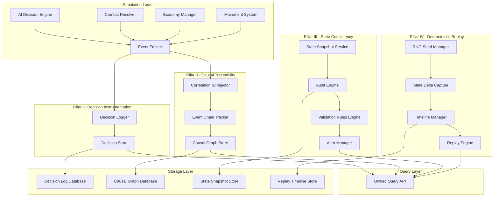
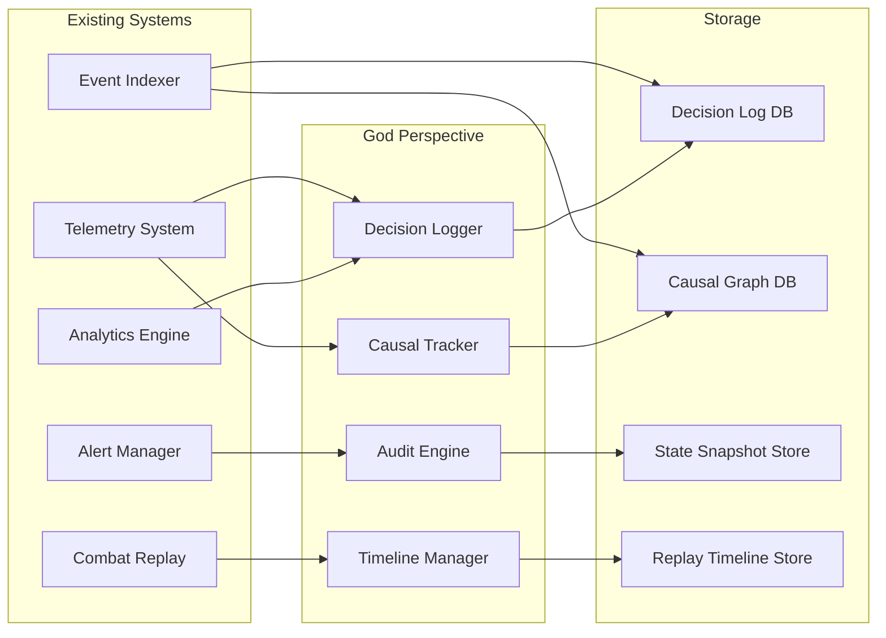
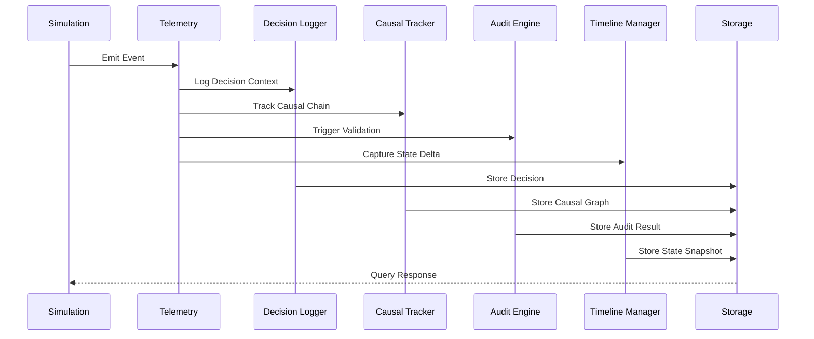

# God-Perspective Observability System Design
## Void Reckoning Engine - Trillion-Scale Simulation

**Document Version:** 1.0
**Date:** 2026-02-06
**Status:** Architectural Design Phase
**Author:** Architect Mode

---

## Executive Summary

The God-Perspective Observability System provides complete transparency into the Void Reckoning Engine's trillion-soul simulation state and decision-making processes. This design defines four architectural pillars that together enable:

1. **Decision Instrumentation** - Capturing the "inner monologue" of AI decision-making
2. **Causal Traceability** - Following event chains from cause to effect across simulation time
3. **State Consistency Auditing** - Continuous validation of simulation integrity
4. **Deterministic Replay** - The ability to rewind, branch, and compare simulation timelines

These systems scale to support 1M+ active units across multiple universes with cross-universe portal scenarios. The design is language-agnostic, focusing on architectural patterns rather than implementation specifics.

---

## Table of Contents

1. [System Overview](#system-overview)
2. [Pillar I: Decision Instrumentation](#pillar-i-decision-instrumentation)
3. [Pillar II: Causal Traceability](#pillar-ii-causal-traceability)
4. [Pillar III: State Consistency Auditing](#pillar-iii-state-consistency-auditing)
5. [Pillar IV: Deterministic Replay](#pillar-iv-deterministic-replay)
6. [Data Models and Schemas](#data-models-and-schemas)
7. [API and Interface Specifications](#api-and-interface-specifications)
8. [Performance Considerations](#performance-considerations)
9. [Integration Points](#integration-points)
10. [Trade-offs and Decisions](#trade-offs-and-decisions)

---

## System Overview

### Design Principles

| Principle | Description |
|-----------|-------------|
| **Observability First** | All systems designed with observability as a primary concern |
| **Minimal Intrusion** | Observability should not significantly impact simulation performance |
| **Deterministic** | All observability data must be reproducible given the same inputs |
| **Queryable** | Data structures optimized for efficient querying and analysis |
| **Scalable** | Architecture supports trillion-scale simulation state |

### System Architecture Diagram



---

## Pillar I: Decision Instrumentation

### Overview

Decision Instrumentation captures the "inner monologue" of AI decision-making, providing visibility into why specific choices were made. This includes input weights, scoring matrices, personality bias factors, and the reasoning chain leading to each decision.

### Core Components

#### 1.1 Decision Context Structure

The decision context captures all inputs available to the decision engine at the moment of choice.

```typescript
interface DecisionContext {
    // Identification
    decision_id: string;              // UUID v4
    correlation_id: string;           // Links to causal chain
    timestamp: DateTime;              // Decision time
    turn: number;                     // Simulation turn
    universe_id: string;              // Universe identifier
    faction_id: string;               // Making the decision

    // Decision Type
    decision_type: DecisionType;     // Category of decision
    decision_category: string;       // Specific category (e.g., "expansion_target")

    // Actor Information
    actor: {
        entity_id: string;            // Entity making decision
        entity_type: EntityType;      // Faction, Hero, System, etc.
        personality_traits: string[];  // Active personality traits
        current_state: {
            resources: ResourceState;
            military_power: number;
            threat_level: number;
            opportunity_score: number;
        };
    };

    // Available Options
    options: DecisionOption[];
}

interface DecisionOption {
    option_id: string;
    option_type: string;
    description: string;
    feasibility: number;              // 0.0 to 1.0
    estimated_cost: ResourceCost;
    estimated_time: number;           // Turns to complete
}

enum DecisionType {
    EXPANSION = "expansion",
    PRODUCTION = "production",
    COMBAT = "combat",
    DIPLOMACY = "diplomacy",
    MOVEMENT = "movement",
    RESEARCH = "research",
    PORTAL_TRAVERSAL = "portal_traversal",
    SPECIAL_ABILITY = "special_ability"
}
```

#### 1.2 Scoring Matrix Structure

The scoring matrix captures how each option was evaluated.

```typescript
interface ScoringMatrix {
    decision_id: string;
    option_scores: OptionScore[];
    scoring_weights: ScoringWeights;
    final_ranking: RankedOption[];
}

interface OptionScore {
    option_id: string;
    criteria_scores: CriteriaScore[];
    raw_score: number;
    normalized_score: number;
    weighted_score: number;
}

interface CriteriaScore {
    criterion_name: string;
    criterion_value: number;
    criterion_weight: number;
    contribution: number;            // weighted_score = criterion_value * criterion_weight
}

interface ScoringWeights {
    // Economic factors
    resource_efficiency: number;
    time_to_completion: number;
    return_on_investment: number;

    // Military factors
    strategic_value: number;
    tactical_advantage: number;
    risk_assessment: number;

    // Personality bias modifiers
    aggression_bias: number;
    caution_bias: number;
    expansion_bias: number;
    research_bias: number;

    // Contextual modifiers
    threat_response_modifier: number;
    opportunity_modifier: number;
    desperation_modifier: number;
}

interface RankedOption {
    option_id: string;
    rank: number;
    score: number;
    confidence: number;              // 0.0 to 1.0
}
```

#### 1.3 Decision Outcome Structure

The outcome captures what actually happened after the decision was made.

```typescript
interface DecisionOutcome {
    decision_id: string;
    chosen_option_id: string;
    execution_status: ExecutionStatus;
    actual_cost: ResourceCost;
    actual_duration: number;         // Turns
    result_events: string[];         // Correlation IDs of resulting events

    // Post-decision analysis
    success_metrics: {
        objective_met: boolean;
        actual_vs_expected: number;   // Percentage difference
        side_effects: string[];      // Unintended consequences
    };
}

enum ExecutionStatus {
    SUCCESS = "success",
    PARTIAL_SUCCESS = "partial_success",
    FAILED = "failed",
    CANCELLED = "cancelled",
    INTERRUPTED = "interrupted"
}
```

### Logging Schema

#### Decision Event Schema

```json
{
  "event_type": "decision_made",
  "event_id": "evt_abc123",
  "correlation_id": "corr_xyz789",
  "timestamp": "2026-02-06T22:45:31.866Z",
  "turn": 42,
  "universe_id": "void_reckoning",
  "faction_id": "transcendent_order",

  "decision": {
    "decision_id": "dec_def456",
    "decision_type": "expansion",
    "decision_category": "colonize_planet",

    "actor": {
      "entity_id": "faction_to",
      "entity_type": "faction",
      "personality_traits": ["expansionist", "cautious"],
      "current_state": {
        "resources": {
          "requisition": 50000000,
          "promerium": 1500
        },
        "military_power": 75000,
        "threat_level": 0.3,
        "opportunity_score": 0.8
      }
    },

    "options": [
      {
        "option_id": "opt_001",
        "option_type": "colonize",
        "description": "Colonize system Alpha-7",
        "feasibility": 0.9,
        "estimated_cost": {
          "requisition": 10000000,
          "promerium": 500
        },
        "estimated_time": 5
      }
    ],

    "scoring": {
      "option_scores": [
        {
          "option_id": "opt_001",
          "criteria_scores": [
            {
              "criterion_name": "resource_efficiency",
              "criterion_value": 0.85,
              "criterion_weight": 0.25,
              "contribution": 0.2125
            },
            {
              "criterion_name": "strategic_value",
              "criterion_value": 0.7,
              "criterion_weight": 0.3,
              "contribution": 0.21
            }
          ],
          "raw_score": 0.78,
          "normalized_score": 0.85,
          "weighted_score": 0.82
        }
      ],
      "scoring_weights": {
        "resource_efficiency": 0.25,
        "strategic_value": 0.3,
        "aggression_bias": 0.15,
        "caution_bias": 0.1,
        "expansion_bias": 0.2
      },
      "final_ranking": [
        {
          "option_id": "opt_001",
          "rank": 1,
          "score": 0.82,
          "confidence": 0.75
        }
      ]
    },

    "outcome": {
      "chosen_option_id": "opt_001",
      "execution_status": "success",
      "actual_cost": {
        "requisition": 10500000,
        "promerium": 520
      },
      "actual_duration": 6,
      "result_events": ["evt_colonization_001"]
    }
  }
}
```

### Query Interface Design

#### "Why" Query API

The query interface enables asking natural language questions about decision reasoning.

```typescript
interface DecisionQuery {
    // Query filters
    filters: {
        decision_type?: DecisionType[];
        faction_id?: string[];
        turn_range?: { min: number; max: number };
        time_range?: { start: DateTime; end: DateTime };
        outcome_status?: ExecutionStatus[];
    };

    // Query type
    query_type: "why" | "how" | "what_if" | "pattern";

    // Query parameters
    parameters: {
        target_decision_id?: string;      // For specific decision queries
        target_event_id?: string;         // For event-backtrace queries
        similarity_threshold?: number;    // For pattern matching
        max_results?: number;
    };

    // Output format
    output_format: "summary" | "detailed" | "trace";
}

interface DecisionQueryResult {
    query_id: string;
    query: DecisionQuery;
    results: DecisionExplanation[];
    metadata: {
        total_matches: number;
        execution_time_ms: number;
        confidence: number;
    };
}

interface DecisionExplanation {
    decision_id: string;
    explanation_type: "direct" | "causal" | "comparative";

    // Direct explanation
    direct_explanation?: {
        decision_type: string;
        chosen_option: string;
        primary_factors: Factor[];
        reasoning_chain: ReasoningStep[];
    };

    // Causal explanation
    causal_explanation?: {
        root_cause_events: string[];
        contributing_decisions: string[];
        outcome_chain: CausalLink[];
    };

    // Comparative explanation
    comparative_explanation?: {
        chosen_vs_alternatives: Comparison[];
        key_differences: string[];
        what_if_scenarios: WhatIfResult[];
    };
}

interface Factor {
    name: string;
    value: number;
    weight: number;
    contribution: number;
    description: string;
}

interface ReasoningStep {
    step_number: number;
    description: string;
    inputs: string[];
    logic: string;
    output: string;
}

interface CausalLink {
    source_event_id: string;
    target_event_id: string;
    relationship_type: "direct" | "indirect" | "contributing";
    strength: number;
}
```

### Storage Strategy

#### Decision History Storage

Decision history is stored in a hybrid approach optimized for both write performance and query efficiency.

| Storage Tier | Purpose | Retention | Technology |
|--------------|---------|-----------|------------|
| **Hot Tier** | Recent decisions (last 100 turns) | 100 turns | In-memory + append-only log |
| **Warm Tier** | Campaign history | Full campaign | Time-series database |
| **Cold Tier** | Historical runs | Permanent | Parquet files |

#### Indexing Strategy

```typescript
interface DecisionIndex {
    // Primary index
    primary: {
        by_decision_id: BTreeIndex;
        by_correlation_id: BTreeIndex;
    };

    // Secondary indexes
    secondary: {
        by_faction_and_turn: CompositeIndex;
        by_decision_type_and_time: CompositeIndex;
        by_outcome_status: BitmapIndex;
    };

    // Analytical indexes
    analytical: {
        by_scoring_pattern: InvertedIndex;
        by_similarity: VectorIndex;      // For embedding-based similarity search
        by_causal_chain: GraphIndex;     // For causal graph traversal
    };
}
```

---

## Pillar II: Causal Traceability

### Overview

Causal Traceability enables following event chains from cause to effect across simulation time. This allows queries like "Why did faction X lose at turn 100?" which can trace back to economic decisions at turn 50.

### Core Components

#### 2.1 Correlation ID System

The correlation ID system provides unique identifiers that link related events across the simulation.

```typescript
interface CorrelationID {
    // The correlation ID itself
    id: string;                         // Format: corr_<timestamp>_<random>

    // Metadata
    created_at: DateTime;
    created_by: {
        entity_id: string;
        entity_type: EntityType;
        decision_id?: string;           // If created by a decision
    };

    // Lifecycle
    lifecycle: {
        status: CorrelationStatus;
        first_event_id: string;
        last_event_id?: string;
        event_count: number;
        duration_ms?: number;
    };

    // Classification
    classification: {
        primary_type: CausalType;
        secondary_types: string[];
        scope: CausalScope;
    };
}

enum CorrelationStatus {
    ACTIVE = "active",
    COMPLETED = "completed",
    ABANDONED = "abandoned",
    MERGED = "merged"
}

enum CausalType {
    DECISION_CHAIN = "decision_chain",
    PRODUCTION_CHAIN = "production_chain",
    COMBAT_CHAIN = "combat_chain",
    MOVEMENT_CHAIN = "movement_chain",
    ECONOMIC_CHAIN = "economic_chain",
    DIPLOMATIC_CHAIN = "diplomatic_chain",
    PORTAL_CHAIN = "portal_chain"
}

enum CausalScope {
    SINGLE_ENTITY = "single_entity",
    SINGLE_FACTION = "single_faction",
    MULTI_FACTION = "multi_faction",
    UNIVERSE_WIDE = "universe_wide",
    CROSS_UNIVERSE = "cross_universe"
}
```

#### 2.2 Correlation ID Generation and Propagation

```typescript
interface CorrelationIDGenerator {
    // Generate a new correlation ID
    generate(options: CorrelationOptions): CorrelationID;

    // Create child correlation ID
    spawnChild(parent: CorrelationID, options: CorrelationOptions): CorrelationID;

    // Merge correlation IDs
    merge(ids: CorrelationID[]): CorrelationID;
}

interface CorrelationOptions {
    type: CausalType;
    scope: CausalScope;
    creator: EntityReference;
    metadata?: Record<string, any>;
}

interface CorrelationPropagator {
    // Inject correlation ID into event
    inject(event: Event, correlation_id: string): Event;

    // Extract correlation IDs from event
    extract(event: Event): string[];

    // Propagate through system boundaries
    propagate(correlation_id: string, boundary: SystemBoundary): void;
}

interface SystemBoundary {
    boundary_type: "process" | "thread" | "universe" | "service";
    source: string;
    destination: string;
    propagation_method: "async" | "sync" | "batch";
}
```

#### 2.3 Event Chain Tracking

```typescript
interface EventChain {
    chain_id: string;                  // Primary correlation ID
    correlation_ids: string[];         // All related correlation IDs

    // Chain structure
    structure: {
        root_event: EventNode;
        events: Map<string, EventNode>;
        relationships: CausalRelationship[];
    };

    // Chain metadata
    metadata: {
        created_at: DateTime;
        completed_at?: DateTime;
        duration_ms?: number;
        total_events: number;
        involved_entities: EntityReference[];
        involved_factions: string[];
        universes: string[];
    };

    // Chain classification
    classification: {
        primary_type: CausalType;
        outcome: ChainOutcome;
        complexity: ChainComplexity;
    };
}

interface EventNode {
    event_id: string;
    event_type: string;
    timestamp: DateTime;
    turn: number;
    universe_id: string;

    // Event data
    data: Record<string, any>;

    // Causal links
    causes: CausalLink[];              // Events that caused this event
    effects: CausalLink[];             // Events caused by this event

    // Decision context
    decision_id?: string;              // If this event resulted from a decision
}

interface CausalRelationship {
    source_event_id: string;
    target_event_id: string;
    relationship_type: CausalRelationshipType;
    strength: number;                  // 0.0 to 1.0
    confidence: number;                // 0.0 to 1.0
    metadata?: Record<string, any>;
}

enum CausalRelationshipType {
    DIRECT = "direct",                 // Immediate cause
    INDIRECT = "indirect",             // Contributing factor
    TRIGGER = "trigger",               // Triggered the event
    ENABLED = "enabled",               // Made the event possible
    PREVENTED = "prevented",           // Blocked the event
    MODIFIED = "modified"              // Changed the event's outcome
}

enum ChainOutcome {
    SUCCESS = "success",
    FAILURE = "failure",
    PARTIAL = "partial",
    UNKNOWN = "unknown"
}

enum ChainComplexity {
    LINEAR = "linear",                 // Simple chain
    BRANCHING = "branching",           // Multiple outcomes
    CONVERGING = "converging",         // Multiple causes
    NETWORK = "network"                // Complex web
}
```

### Traceback Query Mechanism

#### Event Chain Traversal

```typescript
interface TracebackQuery {
    // Query target
    target: {
        event_id?: string;
        decision_id?: string;
        state_snapshot?: {
            turn: number;
            entity_id: string;
        };
    };

    // Traversal parameters
    traversal: {
        direction: "backward" | "forward" | "bidirectional";
        max_depth: number;             // Maximum hops to traverse
        min_strength: number;         // Minimum causal strength to follow
        include_indirect: boolean;     // Include indirect relationships
    };

    // Filters
    filters: {
        event_types?: string[];
        entity_types?: EntityType[];
        faction_ids?: string[];
        turn_range?: { min: number; max: number };
        causal_types?: CausalType[];
    };

    // Output options
    output: {
        format: "tree" | "graph" | "timeline" | "summary";
        include_events: boolean;
        include_decisions: boolean;
        include_state_changes: boolean;
    };
}

interface TracebackResult {
    query_id: string;
    query: TracebackQuery;

    // Results
    chain: EventChain;
    critical_path: EventNode[];       // Most important causal path

    // Analysis
    analysis: {
        root_causes: EventNode[];
        key_decisions: DecisionNode[];
        turning_points: TurningPoint[];
        missed_opportunities: EventNode[];
    };

    // Metrics
    metrics: {
        total_events: number;
        chain_depth: number;
        chain_width: number;
        time_span_ms: number;
        confidence: number;
    };
}

interface DecisionNode {
    decision_id: string;
    event_node: EventNode;
    decision_data: DecisionContext;
    impact_analysis: {
        affected_events: EventNode[];
        impact_score: number;
    };
}

interface TurningPoint {
    event_id: string;
    event_node: EventNode;
    significance: number;             // 0.0 to 1.0
    description: string;
    alternative_outcomes: WhatIfScenario[];
}

interface WhatIfScenario {
    description: string;
    probability: number;
    estimated_outcome: ChainOutcome;
    key_differences: string[];
}
```

### Performance Considerations

#### Scalability for Trillion-Soul Scale

| Challenge | Solution |
|-----------|----------|
| **Event Volume** | Event batching, time-based partitioning, hot/warm/cold storage tiers |
| **Causal Graph Size** | Graph pruning, importance scoring, lazy loading of relationships |
| **Query Latency** | Materialized views for common queries, cached critical paths |
| **Cross-Portal Tracing** | Universe-aware correlation IDs, distributed graph storage |

#### Event Chain Optimization

```typescript
interface EventChainOptimizer {
    // Prune low-importance events
    prune(chain: EventChain, options: PruningOptions): EventChain;

    // Identify critical path
    findCriticalPath(chain: EventChain): EventNode[];

    // Summarize chain
    summarize(chain: EventChain, detail_level: DetailLevel): ChainSummary;

    // Merge related chains
    merge(chains: EventChain[]): EventChain;
}

interface PruningOptions {
    min_importance: number;
    max_events: number;
    preserve_decisions: boolean;
    preserve_turning_points: boolean;
}

enum DetailLevel {
    MINIMAL = "minimal",               // Only critical path
    SUMMARY = "summary",               // Key events and decisions
    DETAILED = "detailed",             // All events with summaries
    FULL = "full"                      // Complete event data
}

interface ChainSummary {
    chain_id: string;
    summary_type: DetailLevel;
    narrative: string;                 // Human-readable summary
    key_events: EventSummary[];
    key_decisions: DecisionSummary[];
    timeline: TimelineEvent[];
}
```

---

## Pillar III: State Consistency Auditing

### Overview

State Consistency Auditing provides continuous validation of simulation integrity, detecting "silent rot" and inconsistencies that could corrupt the simulation state. This includes cross-reference validation between related systems (e.g., fleet movement vs. node connectivity).

### Core Components

#### 3.1 Background Audit Layer

```typescript
interface AuditEngine {
    // Audit configuration
    config: AuditConfig;

    // Audit execution
    executeAudit(audit_type: AuditType, scope: AuditScope): AuditResult;
    executeScheduledAudits(): AuditBatchResult;

    // Continuous monitoring
    startContinuousMonitoring(): void;
    stopContinuousMonitoring(): void;

    // Alert management
    registerAlertHandler(handler: AlertHandler): void;
}

interface AuditConfig {
    // Scheduling
    schedule: {
        continuous: boolean;
        interval_ms: number;
        turn_based: boolean;
        audit_interval_turns: number;
    };

    // Scope
    scope: {
        universes: string[];
        factions: string[];
        entity_types: EntityType[];
    };

    // Rules
    rules: AuditRule[];
    rule_sets: AuditRuleSet[];

    // Thresholds
    thresholds: {
        severity_thresholds: SeverityThresholds;
        performance_thresholds: PerformanceThresholds;
    };
}

interface AuditRule {
    rule_id: string;
    rule_name: string;
    rule_type: AuditRuleType;
    category: AuditCategory;
    severity: AlertSeverity;

    // Rule definition
    definition: {
        validator: string;             // Validator function name
        parameters: Record<string, any>;
        scope: AuditScope;
    };

    // Execution
    execution: {
        enabled: boolean;
        frequency: AuditFrequency;
        priority: AuditPriority;
    };
}

enum AuditRuleType {
    CONSISTENCY = "consistency",       // State consistency checks
    INTEGRITY = "integrity",           // Data integrity checks
    REFERENCE = "reference",           // Cross-reference validation
    CONSTRAINT = "constraint",         // Business rule validation
    INTEGRITY = "integrity"            // Data integrity checks
}

enum AuditCategory {
    ECONOMIC = "economic",
    MILITARY = "military",
    MOVEMENT = "movement",
    COMBAT = "combat",
    DIPLOMACY = "diplomacy",
    PORTAL = "portal",
    STATE = "state"
}

enum AuditFrequency {
    CONTINUOUS = "continuous",
    PER_TURN = "per_turn",
    PER_N_TURNS = "per_n_turns",
    ON_EVENT = "on_event",
    MANUAL = "manual"
}

enum AuditPriority {
    CRITICAL = "critical",
    HIGH = "high",
    MEDIUM = "medium",
    LOW = "low"
}
```

#### 3.2 Cross-Reference Validation Rules

```typescript
interface ReferenceValidator {
    // Validate cross-references between entities
    validateReferences(scope: AuditScope): ReferenceValidationResult;

    // Specific validators
    validateFleetMovement(scope: AuditScope): ValidationResult;
    validateProductionQueue(scope: AuditScope): ValidationResult;
    validateCombatParticipants(scope: AuditScope): ValidationResult;
    validatePortalTransfers(scope: AuditScope): ValidationResult;
}

interface ReferenceValidationResult {
    validation_id: string;
    timestamp: DateTime;
    scope: AuditScope;

    // Results
    results: ValidationResult[];
    summary: ValidationSummary;

    // Issues
    issues: ValidationIssue[];
    critical_issues: ValidationIssue[];
}

interface ValidationResult {
    validator_name: string;
    validator_type: string;
    status: ValidationStatus;
    scope: AuditScope;

    // Metrics
    metrics: {
        entities_checked: number;
        references_validated: number;
        issues_found: number;
        execution_time_ms: number;
    };

    // Details
    details: {
        valid_entities: string[];
        invalid_entities: string[];
        missing_references: MissingReference[];
        orphaned_references: OrphanedReference[];
    };
}

interface MissingReference {
    entity_id: string;
    entity_type: EntityType;
    reference_type: string;
    expected_reference: string;
    actual_reference: string | null;
    severity: AlertSeverity;
}

interface OrphanedReference {
    reference_id: string;
    reference_type: string;
    referenced_by: string[];
    expected_entity_type: EntityType;
    actual_entity: string | null;
    severity: AlertSeverity;
}

enum ValidationStatus {
    PASSED = "passed",
    FAILED = "failed",
    WARNING = "warning",
    ERROR = "error",
    SKIPPED = "skipped"
}
```

#### 3.3 Silent Rot Detection

```typescript
interface SilentRotDetector {
    // Detect gradual degradation of state
    detectSilentRot(scope: AuditScope): SilentRotReport;

    // Specific detection methods
    detectResourceDrift(scope: AuditScope): DriftReport;
    detectStateDivergence(scope: AuditScope): DivergenceReport;
    detectAccumulatedErrors(scope: AuditScope): AccumulationReport;
}

interface SilentRotReport {
    report_id: string;
    timestamp: DateTime;
    scope: AuditScope;

    // Overall health
    overall_health: HealthScore;
    rot_detected: boolean;

    // Specific issues
    issues: RotIssue[];
    severity: AlertSeverity;

    // Recommendations
    recommendations: Recommendation[];
}

interface HealthScore {
    overall: number;                  // 0.0 to 1.0
    components: {
        state_integrity: number;
        reference_validity: number;
        constraint_satisfaction: number;
        data_consistency: number;
    };
    trend: "improving" | "stable" | "degrading";
    trend_rate: number;               // Change per turn
}

interface RotIssue {
    issue_id: string;
    issue_type: RotIssueType;
    severity: AlertSeverity;
    description: string;

    // Detection
    detection: {
        first_detected: DateTime;
        detection_method: string;
        confidence: number;
    };

    // Impact
    impact: {
        affected_entities: string[];
        affected_systems: string[];
        estimated_corruption: number;
    };

    // Progression
    progression: {
        current_state: string;
        progression_rate: number;
        projected_failure?: DateTime;
    };
}

enum RotIssueType {
    RESOURCE_DRIFT = "resource_drift",
    STATE_DIVERGENCE = "state_divergence",
    ACCUMULATED_ERROR = "accumulated_error",
    REFERENCE_DECAY = "reference_decay",
    CONSTRAINT_VIOLATION = "constraint_violation",
    SYNCHRONIZATION_LOSS = "synchronization_loss"
}

interface DriftReport {
    resource_type: string;
    expected_value: number;
    actual_value: number;
    drift_amount: number;
    drift_rate: number;               // Per turn
    drift_sources: DriftSource[];
}

interface DivergenceReport {
    entity_id: string;
    entity_type: EntityType;
    expected_state: Record<string, any>;
    actual_state: Record<string, any>;
    divergence_score: number;
    divergence_fields: string[];
}
```

#### 3.4 Alert and Reporting System

```typescript
interface AuditAlertManager {
    // Issue alerts
    issueAlert(issue: ValidationIssue): void;
    issueRotAlert(rot: RotIssue): void;

    // Alert management
    acknowledgeAlert(alert_id: string): void;
    resolveAlert(alert_id: string): void;
    escalateAlert(alert_id: string): void;

    // Reporting
    generateReport(scope: AuditScope, period: TimePeriod): AuditReport;
    generateTrendReport(scope: AuditScope, period: TimePeriod): TrendReport;
}

interface AuditReport {
    report_id: string;
    generated_at: DateTime;
    period: TimePeriod;
    scope: AuditScope;

    // Executive summary
    executive_summary: {
        overall_health: HealthScore;
        total_issues: number;
        critical_issues: number;
        resolved_issues: number;
        trend: string;
    };

    // Detailed sections
    sections: {
        consistency: ConsistencySection;
        integrity: IntegritySection;
        references: ReferencesSection;
        rot_detection: RotDetectionSection;
    };

    // Recommendations
    recommendations: Recommendation[];
}

interface Recommendation {
    recommendation_id: string;
    priority: AlertSeverity;
    category: string;
    description: string;
    action_items: ActionItem[];
    estimated_effort: string;
    expected_impact: string;
}

interface ActionItem {
    action_id: string;
    description: string;
    target_entity?: string;
    target_system?: string;
    automated: boolean;
    implementation: {
        steps: string[];
        dependencies: string[];
        rollback_plan?: string;
    };
}
```

---

## Pillar IV: Deterministic Replay

### Overview

Deterministic Replay enables the simulation to be rewound, branched, and compared across different timelines. This is critical for debugging, analysis, and exploring "what-if" scenarios.

### Core Components

#### 4.1 Random Seed Snapshotting

```typescript
interface RNGSeedManager {
    // Seed management
    captureSeed(context: SeedContext): SeedSnapshot;
    restoreSeed(snapshot: SeedSnapshot): void;

    // Seed lifecycle
    getSeedHistory(entity_id: string): SeedSnapshot[];
    validateDeterminism(snapshot1: SeedSnapshot, snapshot2: SeedSnapshot): DeterminismValidation;

    // Multi-universe support
    syncSeedsAcrossUniverses(universes: string[]): SyncResult;
}

interface SeedContext {
    universe_id: string;
    turn: number;
    entity_id?: string;
    operation_type: string;
    operation_id: string;
}

interface SeedSnapshot {
    snapshot_id: string;
    context: SeedContext;
    timestamp: DateTime;

    // Seed data
    seed_data: {
        primary_seed: number;
        secondary_seed: number;
        entropy_pool: number[];
        state_hash: string;
    };

    // Operation context
    operation: {
        operation_type: string;
        operation_id: string;
        input_hash: string;
        output_hash: string;
    };

    // Validation
    validation: {
        checksum: string;
        signature: string;
    };
}

interface DeterminismValidation {
    is_deterministic: boolean;
    seed_match: boolean;
    state_match: boolean;
    divergence_point?: DivergencePoint;
    confidence: number;
}

interface DivergencePoint {
    turn: number;
    operation_id: string;
    expected_seed: number;
    actual_seed: number;
    cause: string;
}
```

#### 4.2 State Delta Capture

```typescript
interface StateDeltaCapture {
    // Capture state changes
    captureDelta(turn: number, universe_id: string): StateDelta;

    // Delta management
    getDelta(turn: number, universe_id: string): StateDelta;
    getDeltaRange(start_turn: number, end_turn: number, universe_id: string): StateDelta[];

    // State reconstruction
    reconstructState(target_turn: number, universe_id: string): SimulationState;
    reconstructStateFromDelta(base_state: SimulationState, deltas: StateDelta[]): SimulationState;
}

interface StateDelta {
    delta_id: string;
    turn: number;
    universe_id: string;
    timestamp: DateTime;

    // Delta metadata
    metadata: {
        previous_turn: number;
        next_turn?: number;
        delta_size_bytes: number;
        compression_ratio: number;
    };

    // Delta content
    content: {
        entity_changes: EntityChange[];
        system_changes: SystemChange[];
        global_changes: GlobalChange[];
    };

    // Validation
    validation: {
        checksum: string;
        previous_checksum: string;
        integrity_verified: boolean;
    };
}

interface EntityChange {
    change_id: string;
    entity_id: string;
    entity_type: EntityType;
    change_type: ChangeType;

    // Change data
    before: Record<string, any> | null;
    after: Record<string, any> | null;
    diff: FieldDiff[];

    // Change metadata
    metadata: {
        operation: string;
        operation_id: string;
        correlation_id?: string;
        decision_id?: string;
    };
}

interface FieldDiff {
    field_name: string;
    field_type: string;
    before: any;
    after: any;
    change_type: "added" | "removed" | "modified";
}

interface SystemChange {
    system_id: string;
    change_type: ChangeType;
    before: Record<string, any> | null;
    after: Record<string, any> | null;
    diff: FieldDiff[];
}

interface GlobalChange {
    change_type: string;
    parameters: Record<string, any>;
}

enum ChangeType {
    CREATED = "created",
    MODIFIED = "modified",
    DELETED = "deleted",
    MOVED = "moved",
    STATE_CHANGE = "state_change"
}
```

#### 4.3 Timeline Control Interface

```typescript
interface TimelineManager {
    // Timeline navigation
    goToTurn(turn: number, universe_id: string): NavigationResult;
    rewind(turns: number, universe_id: string): NavigationResult;
    fastForward(turns: number, universe_id: string): NavigationResult;

    // Timeline branching
    createBranch(branch_point: BranchPoint): Branch;
    switchBranch(branch_id: string): void;
    mergeBranches(source_branch: string, target_branch: string): MergeResult;

    // Timeline comparison
    compareTimelines(timeline1: TimelineReference, timeline2: TimelineReference): ComparisonResult;

    // Timeline management
    listBranches(universe_id: string): Branch[];
    deleteBranch(branch_id: string): void;
    exportTimeline(timeline_id: string): TimelineExport;
    importTimeline(data: TimelineExport): void;
}

interface TimelineReference {
    universe_id: string;
    branch_id: string;
    turn: number;
}

interface NavigationResult {
    success: boolean;
    current_state: SimulationState;
    metadata: {
        turn: number;
        universe_id: string;
        branch_id: string;
        time_to_load_ms: number;
    };
}

interface BranchPoint {
    universe_id: string;
    turn: number;
    branch_name: string;
    branch_description?: string;
}

interface Branch {
    branch_id: string;
    branch_name: string;
    branch_description?: string;
    parent_branch_id: string | null;
    created_at: DateTime;
    created_at_turn: number;
    universe_id: string;
    current_turn: number;
    metadata: {
        total_turns: number;
        divergences: DivergencePoint[];
        size_bytes: number;
    };
}

interface ComparisonResult {
    comparison_id: string;
    timeline1: TimelineReference;
    timeline2: TimelineReference;

    // Comparison summary
    summary: {
        similarity_score: number;
        total_differences: number;
        critical_differences: number;
        divergence_turn: number;
    };

    // Detailed differences
    differences: TimelineDifference[];

    // Entity comparison
    entity_comparison: EntityComparison;
}

interface TimelineDifference {
    difference_id: string;
    turn: number;
    difference_type: DifferenceType;
    entity_id?: string;
    description: string;

    // Details
    details: {
        timeline1_value: any;
        timeline2_value: any;
        impact: ImpactLevel;
    };
}

enum DifferenceType {
    ENTITY_CREATED = "entity_created",
    ENTITY_DELETED = "entity_deleted",
    ENTITY_MODIFIED = "entity_modified",
    STATE_DIVERGED = "state_diverged",
    EVENT_MISSED = "event_missed",
    EVENT_ADDED = "event_added"
}

enum ImpactLevel {
    CRITICAL = "critical",
    HIGH = "high",
    MEDIUM = "medium",
    LOW = "low",
    NEGLIGIBLE = "negligible"
}
```

#### 4.4 Multiverse Branching

```typescript
interface MultiverseManager {
    // Cross-universe operations
    createMultiverseBranch(source_universe: string, target_universe: string, branch_point: BranchPoint): MultiverseBranch;
    syncUniverses(source_universe: string, target_universe: string, sync_options: SyncOptions): SyncResult;
    compareUniverses(universe1: string, universe2: string): UniverseComparison;

    // Portal-aware branching
    createPortalBranch(portal_id: string, branch_options: PortalBranchOptions): PortalBranch;

    // Multiverse queries
    queryAcrossUniverses(query: MultiverseQuery): MultiverseQueryResult;
}

interface MultiverseBranch {
    branch_id: string;
    source_universe: string;
    target_universe: string;
    created_at: DateTime;
    created_at_turn: number;

    // Branch metadata
    metadata: {
        branch_type: MultiverseBranchType;
        sync_mode: SyncMode;
        portal_connections: PortalConnection[];
    };

    // Divergence tracking
    divergence: {
        initial_divergence_turn: number;
        current_divergence_score: number;
        divergence_timeline: DivergenceEvent[];
    };
}

enum MultiverseBranchType {
    FULL_COPY = "full_copy",
    SELECTIVE_COPY = "selective_copy",
    PORTAL_LINKED = "portal_linked",
    STATE_SYNC = "state_sync"
}

enum SyncMode {
    ONE_WAY = "one_way",
    TWO_WAY = "two_way",
    EVENT_BASED = "event_based",
    MANUAL = "manual"
}

interface PortalBranch {
    branch_id: string;
    portal_id: string;
    source_universe: string;
    target_universe: string;

    // Portal-specific metadata
    portal_metadata: {
        portal_state: string;
        transfer_queue: TransferItem[];
        reality_anchor: RealityAnchor;
    };

    // Branch configuration
    branch_options: PortalBranchOptions;
}

interface PortalBranchOptions {
    include_factions: string[];
    include_entities: string[];
    include_state: string[];
    sync_interval_turns: number;
    auto_sync: boolean;
}

interface RealityAnchor {
    anchor_id: string;
    anchor_type: string;
    stability: number;
    last_sync: DateTime;
}
```

---

## Data Models and Schemas

### Unified Event Schema

All observability events share a common base schema:

```typescript
interface BaseEvent {
    // Identification
    event_id: string;
    event_type: string;
    correlation_id: string;

    // Timing
    timestamp: DateTime;
    turn: number;
    universe_id: string;

    // Actor
    actor: {
        entity_id: string;
        entity_type: EntityType;
        faction_id?: string;
    };

    // Event data
    data: Record<string, any>;

    // Metadata
    metadata: {
        source: string;
        version: string;
        tags: string[];
    };
}
```

### Database Schema

#### Decision Log Table

```sql
CREATE TABLE decision_log (
    decision_id TEXT PRIMARY KEY,
    correlation_id TEXT NOT NULL,
    timestamp DATETIME NOT NULL,
    turn INTEGER NOT NULL,
    universe_id TEXT NOT NULL,
    faction_id TEXT NOT NULL,

    decision_type TEXT NOT NULL,
    decision_category TEXT NOT NULL,

    actor_entity_id TEXT NOT NULL,
    actor_entity_type TEXT NOT NULL,
    personality_traits TEXT, -- JSON array

    options TEXT, -- JSON array
    scoring_matrix TEXT, -- JSON object
    chosen_option_id TEXT,
    execution_status TEXT NOT NULL,

    actual_cost TEXT, -- JSON object
    actual_duration INTEGER,
    result_events TEXT, -- JSON array

    INDEX idx_correlation (correlation_id),
    INDEX idx_faction_turn (faction_id, turn),
    INDEX idx_type_time (decision_type, timestamp),
    INDEX idx_outcome (execution_status)
);
```

#### Causal Graph Table

```sql
CREATE TABLE causal_events (
    event_id TEXT PRIMARY KEY,
    correlation_id TEXT NOT NULL,
    chain_id TEXT NOT NULL,

    event_type TEXT NOT NULL,
    timestamp DATETIME NOT NULL,
    turn INTEGER NOT NULL,
    universe_id TEXT NOT NULL,

    actor_entity_id TEXT,
    actor_entity_type TEXT,
    faction_id TEXT,

    event_data TEXT, -- JSON object
    decision_id TEXT,

    INDEX idx_correlation (correlation_id),
    INDEX idx_chain (chain_id),
    INDEX idx_turn (turn),
    INDEX idx_universe (universe_id)
);

CREATE TABLE causal_relationships (
    relationship_id TEXT PRIMARY KEY,
    source_event_id TEXT NOT NULL,
    target_event_id TEXT NOT NULL,
    relationship_type TEXT NOT NULL,
    strength REAL NOT NULL,
    confidence REAL NOT NULL,

    INDEX idx_source (source_event_id),
    INDEX idx_target (target_event_id),
    INDEX idx_strength (strength)
);
```

#### State Snapshots Table

```sql
CREATE TABLE state_snapshots (
    snapshot_id TEXT PRIMARY KEY,
    turn INTEGER NOT NULL,
    universe_id TEXT NOT NULL,
    branch_id TEXT NOT NULL,

    timestamp DATETIME NOT NULL,
    snapshot_size_bytes INTEGER,
    compression_ratio REAL,

    seed_data TEXT, -- JSON object
    checksum TEXT NOT NULL,

    INDEX idx_turn_universe (turn, universe_id),
    INDEX idx_branch (branch_id),
    INDEX idx_timestamp (timestamp)
);

CREATE TABLE state_deltas (
    delta_id TEXT PRIMARY KEY,
    turn INTEGER NOT NULL,
    universe_id TEXT NOT NULL,
    branch_id TEXT NOT NULL,

    previous_turn INTEGER NOT NULL,
    next_turn INTEGER,

    entity_changes TEXT, -- JSON array
    system_changes TEXT, -- JSON array
    global_changes TEXT, -- JSON array

    checksum TEXT NOT NULL,
    previous_checksum TEXT NOT NULL,

    INDEX idx_turn (turn),
    INDEX idx_universe (universe_id),
    INDEX idx_branch (branch_id)
);
```

#### Audit Results Table

```sql
CREATE TABLE audit_results (
    audit_id TEXT PRIMARY KEY,
    audit_type TEXT NOT NULL,
    timestamp DATETIME NOT NULL,

    universe_id TEXT,
    faction_id TEXT,
    entity_types TEXT, -- JSON array

    status TEXT NOT NULL,
    severity TEXT NOT NULL,

    total_entities_checked INTEGER,
    issues_found INTEGER,
    execution_time_ms INTEGER,

    issues TEXT, -- JSON array
    recommendations TEXT, -- JSON array

    INDEX idx_type_time (audit_type, timestamp),
    INDEX idx_severity (severity),
    INDEX idx_universe (universe_id)
);
```

---

## API and Interface Specifications

### Unified Query API

```typescript
interface GodPerspectiveAPI {
    // Pillar I: Decision Instrumentation
    decisions: DecisionAPI;

    // Pillar II: Causal Traceability
    causality: CausalityAPI;

    // Pillar III: State Consistency
    auditing: AuditingAPI;

    // Pillar IV: Deterministic Replay
    replay: ReplayAPI;
}

interface DecisionAPI {
    // Query decisions
    queryDecisions(query: DecisionQuery): Promise<DecisionQueryResult>;

    // Get specific decision
    getDecision(decision_id: string): Promise<DecisionContext>;

    // Analyze decision patterns
    analyzePatterns(options: PatternAnalysisOptions): Promise<PatternAnalysisResult>;

    // "Why" queries
    whyDecision(decision_id: string): Promise<DecisionExplanation>;
    whyEvent(event_id: string): Promise<DecisionExplanation>;
}

interface CausalityAPI {
    // Trace event chains
    traceEventChain(query: TracebackQuery): Promise<TracebackResult>;

    // Get correlation chain
    getCorrelationChain(correlation_id: string): Promise<EventChain>;

    // Find root causes
    findRootCauses(event_id: string): Promise<EventNode[]>;

    // Analyze causal patterns
    analyzeCausalPatterns(options: CausalPatternOptions): Promise<CausalPatternResult>;
}

interface AuditingAPI {
    // Execute audit
    executeAudit(audit_type: AuditType, scope: AuditScope): Promise<AuditResult>;

    // Get audit results
    getAuditResult(audit_id: string): Promise<AuditResult>;

    // Get silent rot report
    getSilentRotReport(scope: AuditScope): Promise<SilentRotReport>;

    // Generate audit report
    generateReport(scope: AuditScope, period: TimePeriod): Promise<AuditReport>;
}

interface ReplayAPI {
    // Timeline navigation
    goToTurn(turn: number, universe_id: string): Promise<NavigationResult>;
    rewind(turns: number, universe_id: string): Promise<NavigationResult>;

    // Branching
    createBranch(branch_point: BranchPoint): Promise<Branch>;
    switchBranch(branch_id: string): Promise<void>;

    // Comparison
    compareTimelines(timeline1: TimelineReference, timeline2: TimelineReference): Promise<ComparisonResult>;

    // State reconstruction
    reconstructState(target_turn: number, universe_id: string): Promise<SimulationState>;
}
```

### WebSocket API

Real-time updates for dashboard and monitoring:

```typescript
interface GodPerspectiveWebSocket {
    // Subscribe to events
    subscribe(event_type: string, filters: EventFilters): void;
    unsubscribe(subscription_id: string): void;

    // Decision updates
    subscribeToDecisions(faction_id: string): void;
    subscribeToDecision(decision_id: string): void;

    // Causal updates
    subscribeToCorrelation(correlation_id: string): void;

    // Audit alerts
    subscribeToAlerts(severity: AlertSeverity): void;

    // Replay updates
    subscribeToTimeline(universe_id: string, branch_id: string): void;
}
```

---

## Performance Considerations

### Scalability Strategies

| Pillar | Challenge | Solution |
|--------|-----------|----------|
| **Decision Instrumentation** | High decision volume | Decision batching, sampling for low-priority decisions |
| **Causal Traceability** | Large causal graphs | Graph pruning, importance scoring, lazy loading |
| **State Consistency** | Continuous audit overhead | Sampling-based audits, incremental validation |
| **Deterministic Replay** | State snapshot size | Delta compression, tiered storage |

### Storage Optimization

```typescript
interface StorageOptimization {
    // Compression
    compression: {
        algorithm: "zstd" | "lz4" | "gzip";
        level: number;
        target_ratio: number;
    };

    // Partitioning
    partitioning: {
        strategy: "time" | "universe" | "faction" | "hash";
        partitions: number;
        partition_key: string;
    };

    // Tiered storage
    tiers: {
        hot: {
            storage: "memory";
            retention_turns: 100;
            compression: false;
        };
        warm: {
            storage: "ssd";
            retention_turns: 1000;
            compression: true;
        };
        cold: {
            storage: "s3";
            retention: "permanent";
            compression: true;
        };
    };
}
```

### Query Optimization

```typescript
interface QueryOptimization {
    // Caching
    caching: {
        enabled: boolean;
        ttl_ms: number;
        max_size: number;
        eviction_policy: "lru" | "lfu" | "fifo";
    };

    // Materialized views
    materialized_views: {
        common_queries: string[];
        refresh_interval_ms: number;
    };

    // Index hints
    index_hints: {
        query_patterns: Map<string, string[]>;
    };

    // Query batching
    batching: {
        enabled: boolean;
        batch_size: number;
        max_wait_ms: number;
    };
}
```

---

## Integration Points

### Integration with Existing Systems

| Existing System | Integration Point | Purpose |
|-----------------|-------------------|---------|
| **Telemetry System** | Event Emitter | Capture all simulation events |
| **Event Indexer** | Database Layer | Store observability data |
| **Analytics Engine** | Query Layer | Provide analytical insights |
| **Alert Manager** | Alert System | Notify on audit failures |
| **Combat Replay** | Replay System | Integrate with deterministic replay |

### Integration Architecture



### Data Flow



---

## Trade-offs and Decisions

### Key Architectural Decisions

| Decision | Rationale | Trade-off |
|----------|-----------|-----------|
| **Hybrid Storage (Hot/Warm/Cold)** | Balances performance with cost | Increased complexity in data retrieval |
| **Graph-based Causal Tracking** | Enables complex causal queries | Higher storage overhead |
| **Delta-based Replay** | Reduces storage requirements | Slower state reconstruction |
| **Sampling for Low-Priority Decisions** | Reduces volume | May miss important patterns |
| **Lazy Loading of Event Chains** | Improves query performance | May miss indirect relationships |

### Performance vs. Completeness Trade-offs

| Scenario | Performance-Optimized | Completeness-Optimized |
|----------|----------------------|------------------------|
| **Decision Logging** | Sample low-priority decisions | Log all decisions |
| **Causal Tracking** | Prune low-importance events | Track all relationships |
| **State Auditing** | Sample-based validation | Full validation |
| **Replay Storage** | Delta compression only | Full snapshots + deltas |

### Scalability Considerations

| Scale | Challenges | Mitigations |
|-------|------------|-------------|
| **1K Units** | Minimal overhead | Standard implementation |
| **10K Units** | Increased event volume | Event batching |
| **100K Units** | Large causal graphs | Graph pruning, importance scoring |
| **1M+ Units** | Massive state size | Tiered storage, compression, sampling |

---

## Appendix

### Glossary

| Term | Definition |
|------|-----------|
| **Correlation ID** | Unique identifier linking related events across the simulation |
| **Causal Chain** | Sequence of events where each event causes or influences the next |
| **Silent Rot** | Gradual degradation of simulation state that goes undetected |
| **Deterministic Replay** | Ability to exactly reproduce simulation state from stored data |
| **Multiverse Branching** | Creating alternate timelines from a common starting point |
| **State Delta** | Difference between two consecutive simulation states |
| **Critical Path** | Most important sequence of events in a causal chain |

### References

- Existing telemetry system: [`src/reporting/telemetry.py`](src/reporting/telemetry.py)
- Event indexer: [`src/reporting/indexing/event_indexer.py`](src/reporting/indexing/event_indexer.py)
- Analytics engine: [`src/reporting/analytics_engine.py`](src/reporting/analytics_engine.py)
- Alert manager: [`src/reporting/alert_manager.py`](src/reporting/alert_manager.py)
- Combat replay: [`src/reporting/combat_replay.py`](src/reporting/combat_replay.py)

---

**Document End**
