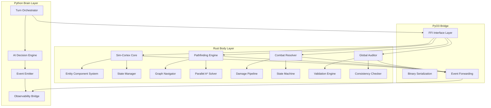
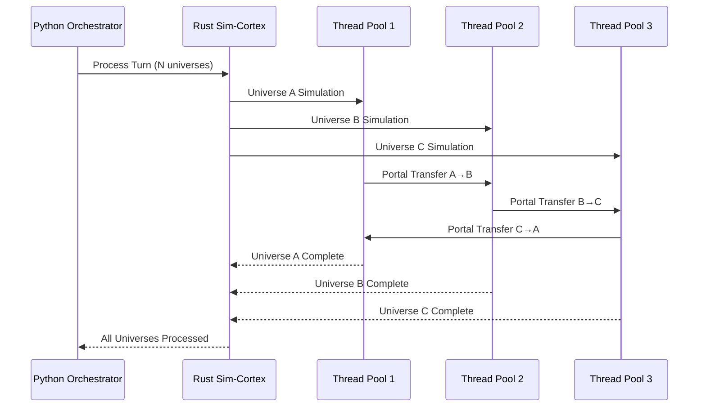
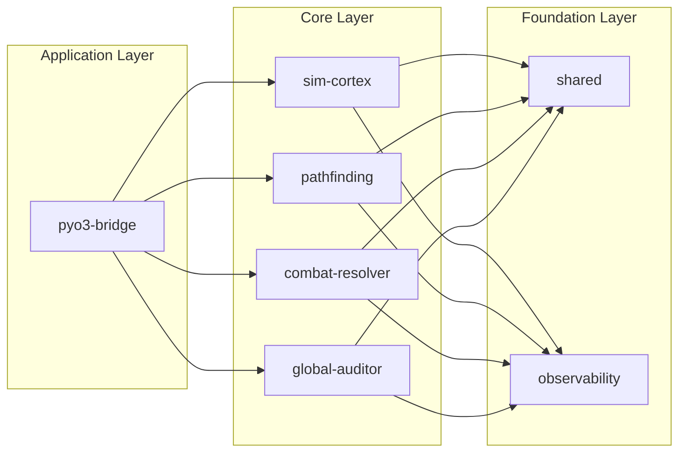
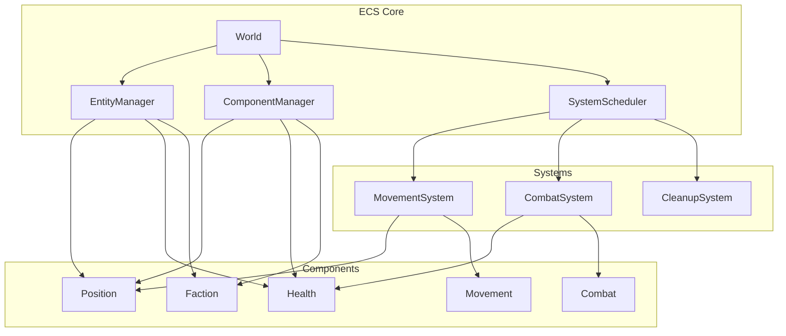
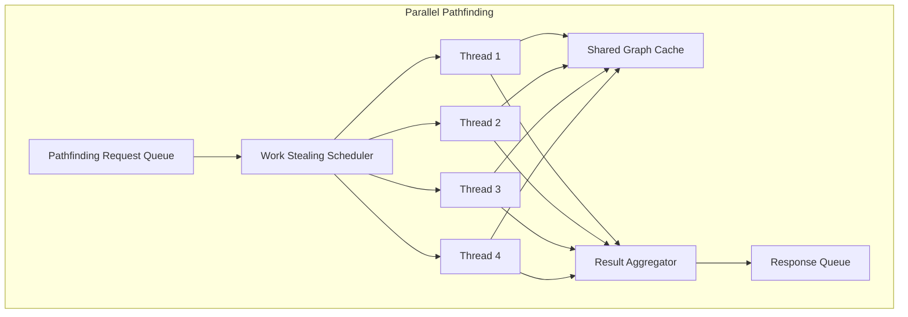
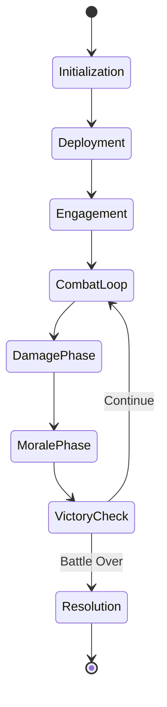
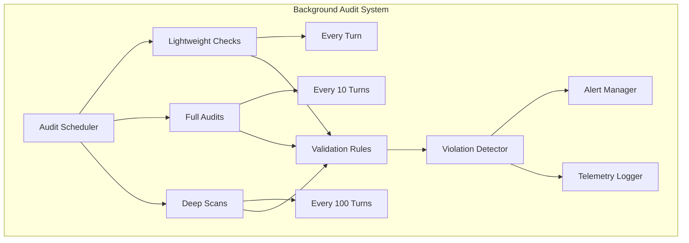
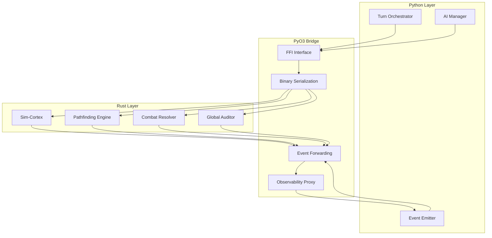

# Rust Integration Architecture
## Void Reckoning Engine - Native Pulse Initiative

**Document Version:** 1.0
**Date:** 2026-02-06
**Status:** Architectural Design Phase
**Author:** Architect Mode

---

## Executive Summary

This document defines the Rust integration architecture for the Void Reckoning Engine's "Native Pulse" initiative - a strategic migration of performance-critical code from Python to Rust. The architecture maintains Python as the high-level "Brain" layer while delegating computationally intensive operations to Rust as the "Body" layer.

### Key Design Principles

| Principle | Description |
|-----------|-------------|
| **Polyglot Harmony** | Python orchestrates strategy; Rust executes computation |
| **Zero-Cost Abstractions** | Rust's type system provides safety without runtime overhead |
| **Cache-Friendly Layouts** | Data structures optimized for CPU cache locality |
| **Deterministic Execution** | All Rust code produces reproducible results given same inputs |
| **Observability Integration** | All Rust modules support the four observability pillars |

### Performance Targets

| Metric | Current (Python) | Target (Rust) | Improvement |
|--------|-----------------|---------------|-------------|
| Active Units | ~50,000 | 1,000,000+ | 20x |
| Decisions/Second | ~200 | 10,000+ | 50x |
| I/O Latency | High (JSON) | Near-zero (binary) | 100x+ |
| Stability | Runtime errors | Compile-time safety | Fundamental |

---

## Table of Contents

1. [Rust Architecture Overview](#rust-architecture-overview)
2. [Rust Crate Structure](#rust-crate-structure)
3. [Core Rust Modules](#core-rust-modules)
4. [Concurrency Strategy](#concurrency-strategy)
5. [Memory Management](#memory-management)
6. [Integration Points with Python](#integration-points-with-python)
7. [Performance Optimization Strategies](#performance-optimization-strategies)

---

## I. Rust Architecture Overview

### High-Level Architecture



### Separation of Concerns: Body vs Brain

| Layer | Responsibility | Language | Key Components |
|-------|---------------|----------|----------------|
| **Brain** (Python) | Strategic decision-making, high-level orchestration, universe rules, AI personality | Python | Turn Orchestrator, AI Manager, Universe Rules |
| **Body** (Rust) | Computation, state management, pathfinding, combat resolution, validation | Rust | Sim-Cortex, Pathfinding Engine, Combat Resolver, Global Auditor |

### Cross-Universe Portal Concurrency Model



---

## II. Rust Crate Structure

### Workspace Organization

```
void-reckoning-rust/
├── Cargo.toml                    # Workspace root
├── sim-cortex/                   # Core simulation engine
│   ├── Cargo.toml
│   └── src/
│       ├── lib.rs
│       ├── ecs/
│       │   ├── mod.rs
│       │   ├── world.rs
│       │   ├── entity.rs
│       │   ├── component.rs
│       │   └── query.rs
│       ├── state/
│       │   ├── mod.rs
│       │   ├── manager.rs
│       │   └── snapshot.rs
│       └── memory/
│           ├── mod.rs
│           ├── pool.rs
│           └── allocator.rs
├── pathfinding/                  # Pathfinding algorithms
│   ├── Cargo.toml
│   └── src/
│       ├── lib.rs
│       ├── graph/
│       │   ├── mod.rs
│       │   ├── adjacency.rs
│       │   └── weighted.rs
│       ├── algorithms/
│       │   ├── mod.rs
│       │   ├── astar.rs
│       │   ├── dijkstra.rs
│       │   └── hierarchical.rs
│       └── parallel/
│           ├── mod.rs
│           ├── solver.rs
│           └── partition.rs
├── combat-resolver/              # Combat resolution engine
│   ├── Cargo.toml
│   ├── src/
│   │   ├── lib.rs
│   │   ├── state/
│   │   │   ├── mod.rs
│   │   │   ├── machine.rs
│   │   │   └── phases.rs
│   │   ├── damage/
│   │   │   ├── mod.rs
│   │   │   ├── pipeline.rs
│   │   │   └── calculator.rs
│   │   ├── parallel/
│   │   │   ├── mod.rs
│   │   │   ├── batch.rs
│   │   │   └── resolution.rs
│   │   └── tactical/
│   │       ├── mod.rs
│   │       ├── grid.rs
│   │       └── targeting.rs
├── global-auditor/               # State validation system
│   ├── Cargo.toml
│   ├── src/
│   │   ├── lib.rs
│   │   ├── validation/
│   │   │   ├── mod.rs
│   │   │   ├── rules.rs
│   │   │   └── checker.rs
│   │   ├── consistency/
│   │   │   ├── mod.rs
│   │   │   ├── algorithms.rs
│   │   │   └── invariants.rs
│   │   └── background/
│   │       ├── mod.rs
│   │       ├── scheduler.rs
│   │       └── reporter.rs
├── pyo3-bridge/                  # Python-Rust FFI layer
│   ├── Cargo.toml
│   └── src/
│       ├── lib.rs
│       ├── serialization/
│       │   ├── mod.rs
│       │   ├── binary.rs
│       │   └── schema.rs
│       ├── events/
│       │   ├── mod.rs
│       │   ├── emitter.rs
│       │   └── forwarder.rs
│       └── observability/
│           ├── mod.rs
│           ├── instrumentation.rs
│           ├── traceability.rs
│           ├── auditing.rs
│           └── replay.rs
├── shared/                       # Shared types and utilities
│   ├── Cargo.toml
│   └── src/
│       ├── lib.rs
│       ├── types/
│       │   ├── mod.rs
│       │   ├── entity_id.rs
│       │   ├── faction.rs
│       │   └── position.rs
│       ├── math/
│       │   ├── mod.rs
│       │   ├── vector.rs
│       │   └── fixed.rs
│       ├── hex/
│       │   ├── mod.rs
│       │   ├── coord.rs
│       │   └── grid.rs
│       └── rng/
│           ├── mod.rs
│           └── seeded.rs
└── observability/                # Observability integration
    ├── Cargo.toml
    └── src/
        ├── lib.rs
        ├── decision/
        │   ├── mod.rs
        │   ├── logger.rs
        │   └── store.rs
        ├── causal/
        │   ├── mod.rs
        │   ├── tracker.rs
        │   └── graph.rs
        ├── state/
        │   ├── mod.rs
        │   ├── validator.rs
        │   └── snapshot.rs
        └── replay/
            ├── mod.rs
            ├── timeline.rs
            └── engine.rs
```

### Crate Dependency Graph



---

## III. Core Rust Modules

### 1. Sim-Cortex (Core Simulation Engine)

#### Overview
Sim-Cortex is the heart of the Rust simulation layer, managing entity state, component storage, and world state transitions.

#### State Management Structures

```rust
// sim-cortex/src/state/manager.rs
pub struct WorldState {
    // Version tracking for cache invalidation
    topology_version: AtomicU64,
    blockade_version: AtomicU64,
    entity_version: AtomicU64,

    // Entity storage
    entities: SlotMap<EntityId, EntityMeta>,
    component_stores: ComponentStores,

    // Spatial indexing
    spatial_index: SpatialIndex,

    // Universe context
    universe_id: UniverseId,
    turn_number: u64,
}

pub struct EntityMeta {
    id: EntityId,
    archetype: ArchetypeId,
    generation: u32,
    alive: AtomicBool,
}

pub struct ComponentStores {
    // SoA (Structure of Arrays) layout for cache efficiency
    positions: Vec<PositionComponent>,
    healths: Vec<HealthComponent>,
    factions: Vec<FactionComponent>,
    combats: Vec<CombatComponent>,
    // ... more components
}
```

#### Entity Component System Design



**Key ECS Features:**

| Feature | Implementation | Benefit |
|---------|----------------|---------|
| **Archetypes** | Group entities by component composition | Cache-friendly iteration |
| **Chunk Storage** | Fixed-size blocks of homogeneous data | Predictable memory layout |
| **Query Builder** | Compile-time query construction | Zero-cost abstractions |
| **Parallel Systems** | Thread-safe system execution | Multi-core utilization |

#### Memory Layout Optimization

```rust
// sim-cortex/src/memory/allocator.rs
pub struct ChunkAllocator<T> {
    chunks: Vec<Box<[T; CHUNK_SIZE]>>,
    free_lists: Vec<Vec<usize>>,
    current_chunk: usize,
}

// Cache-line aligned component storage
#[repr(C, align(64))]
pub struct PositionComponent {
    pub x: FixedPoint,
    pub y: FixedPoint,
    pub z: FixedPoint,
    pub system_id: SystemId,
    _pad: [u8; 40], // Pad to cache line
}

// Packed entity IDs for efficient iteration
#[derive(Clone, Copy, PartialEq, Eq, Hash)]
pub struct EntityId {
    index: u32,
    generation: u32,
}
```

---

### 2. Pathfinding Engine

#### Overview
The Pathfinding Engine provides high-performance graph navigation with support for both strategic (galaxy) and tactical (hex grid) pathfinding.

#### Graph Data Structures

```rust
// pathfinding/src/graph/weighted.rs
pub struct WeightedGraph<N, E> {
    nodes: Vec<Node<N>>,
    edges: Vec<Edge<E>>,
    adjacency: Vec<Vec<EdgeId>>,
}

pub struct Node<N> {
    id: NodeId,
    data: N,
    position: Option<Vec3>,
}

pub struct Edge<E> {
    id: EdgeId,
    from: NodeId,
    to: NodeId,
    weight: FixedPoint,
    data: E,
    blocked: AtomicBool,
}

// Hierarchical graph for multi-scale pathfinding
pub struct HierarchicalGraph {
    base_graph: WeightedGraph<SystemNode, PortalEdge>,
    clusters: Vec<Cluster>,
    abstract_graph: WeightedGraph<ClusterNode, AbstractEdge>,
}
```

#### A* Algorithm Implementation

```rust
// pathfinding/src/algorithms/astar.rs
pub struct AStarSolver<G, H> {
    graph: G,
    heuristic: H,
    open_set: BinaryHeap<PathNode>,
    closed_set: HashSet<NodeId>,
    came_from: HashMap<NodeId, NodeId>,
    g_score: HashMap<NodeId, FixedPoint>,
    f_score: HashMap<NodeId, FixedPoint>,
}

impl<G, H> AStarSolver<G, H>
where
    G: Graph,
    H: Heuristic<G>,
{
    pub fn find_path(
        &mut self,
        start: NodeId,
        goal: NodeId,
    ) -> Result<Vec<NodeId>, PathfindingError> {
        // Initialize
        self.open_set.clear();
        self.closed_set.clear();
        self.g_score.clear();
        self.f_score.clear();

        let start_h = self.heuristic.estimate(&self.graph, start, goal);
        self.g_score.insert(start, FixedPoint::ZERO);
        self.f_score.insert(start, start_h);
        self.open_set.push(PathNode::new(start, start_h));

        // Main loop
        while let Some(current) = self.open_set.pop() {
            if current.id == goal {
                return Ok(self.reconstruct_path(goal));
            }

            self.closed_set.insert(current.id);

            for neighbor in self.graph.neighbors(current.id) {
                if self.closed_set.contains(&neighbor) {
                    continue;
                }

                let tentative_g = self.g_score[&current.id] +
                    self.graph.edge_weight(current.id, neighbor);

                if tentative_g < *self.g_score.get(&neighbor).unwrap_or(&FixedPoint::MAX) {
                    self.came_from.insert(neighbor, current.id);
                    self.g_score.insert(neighbor, tentative_g);
                    let f = tentative_g + self.heuristic.estimate(&self.graph, neighbor, goal);
                    self.f_score.insert(neighbor, f);
                    self.open_set.push(PathNode::new(neighbor, f));
                }
            }
        }

        Err(PathfindingError::NoPathFound)
    }
}
```

#### Parallel Pathfinding Strategies



**Parallelization Strategies:**

| Strategy | Use Case | Implementation |
|----------|----------|----------------|
| **Work Stealing** | Many independent pathfinding requests | `crossbeam` deque-based thread pool |
| **Goal Partitioning** | Single path to multiple goals | Parallel goal evaluation |
| **Bidirectional Search** | Long paths in large graphs | Two-way A* with rendezvous |
| **Hierarchical** | Multi-scale navigation | Abstract path + detailed refinement |

---

### 3. Combat Resolution (Tactical Engine)

#### Overview
The Combat Resolution module handles all combat calculations, from individual ship engagements to massive fleet battles with millions of units.

#### Combat State Machine



```rust
// combat-resolver/src/state/machine.rs
pub enum CombatState {
    Initialization {
        setup: CombatSetup,
    },
    Deployment {
        forces: Vec<Force>,
        positions: Vec<Position>,
    },
    Engagement {
        round: u32,
        active_units: Vec<UnitId>,
    },
    DamagePhase {
        attacks: Vec<Attack>,
        defenses: Vec<Defense>,
    },
    MoralePhase {
        morale_changes: Vec<MoraleChange>,
    },
    VictoryCheck {
        conditions: Vec<VictoryCondition>,
    },
    Resolution {
        outcome: CombatOutcome,
        statistics: CombatStatistics,
    },
}

pub struct CombatMachine {
    state: CombatState,
    history: Vec<CombatSnapshot>,
    rng: SeededRng,
    telemetry: CombatTelemetry,
}
```

#### Damage Calculation Pipeline

```rust
// combat-resolver/src/damage/pipeline.rs
pub struct DamagePipeline {
    stages: Vec<Box<dyn DamageStage>>,
    cache: LruCache<DamageKey, DamageResult>,
}

pub trait DamageStage: Send + Sync {
    fn process(&self, context: &mut DamageContext) -> Result<(), CombatError>;
    fn name(&self) -> &str;
}

// Pipeline stages
pub struct AccuracyStage;
pub struct DefenseStage;
pub struct CriticalStage;
pub struct DamageReductionStage;
pub struct FinalDamageStage;

impl DamageStage for AccuracyStage {
    fn process(&self, context: &mut DamageContext) -> Result<(), CombatError> {
        let hit_roll = context.rng.next_f32();
        let hit_chance = context.attacker.accuracy - context.defender.evasion;

        if hit_roll > hit_chance {
            context.hit = false;
            return Ok(());
        }

        context.hit = true;
        Ok(())
    }
}

// Parallel batch damage processing
pub struct ParallelDamageProcessor {
    thread_pool: ThreadPool,
    batch_size: usize,
}

impl ParallelDamageProcessor {
    pub fn process_batch(
        &self,
        attacks: Vec<Attack>,
        defenders: Vec<Defender>,
    ) -> Vec<DamageResult> {
        let chunks = attacks.chunks(self.batch_size);
        let results: Vec<_> = chunks
            .into_par_iter()
            .map(|chunk| self.process_chunk(chunk, &defenders))
            .flatten()
            .collect();

        results
    }
}
```

#### Parallel Combat Resolution

```rust
// combat-resolver/src/parallel/resolution.rs
pub struct ParallelCombatResolver {
    sim_cortex: Arc<SimCortex>,
    thread_pool: ThreadPool,
    config: ParallelConfig,
}

impl ParallelCombatResolver {
    pub fn resolve_combat(
        &self,
        combat_id: CombatId,
    ) -> Result<CombatOutcome, CombatError> {
        // Partition combat by spatial regions
        let regions = self.partition_combat(combat_id)?;

        // Process regions in parallel
        let region_results: Vec<_> = regions
            .into_par_iter()
            .map(|region| self.resolve_region(region))
            .collect()?;

        // Aggregate results
        self.aggregate_results(region_results)
    }

    fn partition_combat(&self, combat_id: CombatId) -> Result<Vec<CombatRegion>, CombatError> {
        // Spatial partitioning for cache efficiency
        let combat = self.sim_cortex.get_combat(combat_id)?;
        let mut regions = Vec::new();

        // Use spatial index to partition units
        let spatial_index = self.sim_cortex.get_spatial_index(combat_id)?;
        let partitions = spatial_index.partition(NUM_PARTITIONS);

        for partition in partitions {
            let units = combat.units_in_region(&partition);
            regions.push(CombatRegion {
                bounds: partition,
                units,
            });
        }

        Ok(regions)
    }
}
```

---

### 4. Global Auditor

#### Overview
The Global Auditor provides continuous validation of simulation state, ensuring consistency across the trillion-soul simulation.

#### State Validation Rules

```rust
// global-auditor/src/validation/rules.rs
pub trait ValidationRule: Send + Sync {
    fn validate(&self, state: &WorldState) -> ValidationResult;
    fn name(&self) -> &str;
    fn severity(&self) -> ValidationSeverity;
}

pub struct HealthInvariantRule;
pub struct ResourceConsistencyRule;
pub struct FactionIntegrityRule;
pub struct PositionValidityRule;
pub struct CombatStateRule;

impl ValidationRule for HealthInvariantRule {
    fn validate(&self, state: &WorldState) -> ValidationResult {
        let mut violations = Vec::new();

        for (entity_id, health) in state.iter_health() {
            if health.current < FixedPoint::ZERO {
                violations.push(HealthViolation {
                    entity: entity_id,
                    current: health.current,
                    expected: FixedPoint::ZERO..=health.max,
                });
            }
            if health.current > health.max {
                violations.push(HealthViolation {
                    entity: entity_id,
                    current: health.current,
                    expected: FixedPoint::ZERO..=health.max,
                });
            }
        }

        if violations.is_empty() {
            ValidationResult::Pass
        } else {
            ValidationResult::Fail(violations)
        }
    }

    fn name(&self) -> &str {
        "health_invariant"
    }

    fn severity(&self) -> ValidationSeverity {
        ValidationSeverity::Critical
    }
}
```

#### Consistency Checking Algorithms

```rust
// global-auditor/src/consistency/algorithms.rs
pub struct ConsistencyChecker {
    rules: Vec<Arc<dyn ValidationRule>>,
    scheduler: AuditScheduler,
    reporter: AuditReporter,
}

impl ConsistencyChecker {
    pub fn audit_world(&self, world: &WorldState) -> AuditReport {
        let mut report = AuditReport::new();

        // Run all validation rules
        for rule in &self.rules {
            let result = rule.validate(world);
            report.add_result(rule.name(), result);

            if result.is_critical() {
                self.reporter.report_critical(rule.name(), &result);
            }
        }

        // Check cross-system consistency
        self.check_cross_system_consistency(world, &mut report);

        report
    }

    fn check_cross_system_consistency(
        &self,
        world: &WorldState,
        report: &mut AuditReport,
    ) {
        // Resource flow validation
        self.validate_resource_flow(world, report);

        // Faction relationship consistency
        self.validate_diplomacy(world, report);

        // Combat state integrity
        self.validate_combat_states(world, report);
    }
}
```

#### Background Audit Scheduling



```rust
// global-auditor/src/background/scheduler.rs
pub struct AuditScheduler {
    light_interval: Duration,
    full_interval: Duration,
    deep_interval: Duration,
    last_light: Instant,
    last_full: Instant,
    last_deep: Instant,
}

impl AuditScheduler {
    pub fn schedule_audits(&mut self, world: &WorldState) -> Vec<AuditTask> {
        let mut tasks = Vec::new();
        let now = Instant::now();

        // Lightweight checks every turn
        if now.duration_since(self.last_light) >= self.light_interval {
            tasks.push(AuditTask::Lightweight);
            self.last_light = now;
        }

        // Full audits periodically
        if now.duration_since(self.last_full) >= self.full_interval {
            tasks.push(AuditTask::Full);
            self.last_full = now;
        }

        // Deep scans rarely
        if now.duration_since(self.last_deep) >= self.deep_interval {
            tasks.push(AuditTask::Deep);
            self.last_deep = now;
        }

        tasks
    }
}
```

---

## IV. Concurrency Strategy

### Thread Pool Design

```rust
// shared/src/concurrency/pool.rs
pub struct SimulationThreadPool {
    // Work-stealing deques for each thread
    workers: Vec<Worker>,
    // Global task queue for overflow
    global_queue: SegQueue<Task>,
    // Configuration
    config: PoolConfig,
}

pub struct Worker {
    id: usize,
    deque: Worker<Task>,
    thread: Option<JoinHandle<()>>,
    local_queue: LocalQueue<Task>,
}

impl SimulationThreadPool {
    pub fn new(config: PoolConfig) -> Self {
        let num_threads = config.num_threads.unwrap_or_else(|| {
            num_cpus::get().min(16) // Cap at 16 threads
        });

        let mut workers = Vec::with_capacity(num_threads);

        for id in 0..num_threads {
            let worker = Worker::new(id, config.clone());
            workers.push(worker);
        }

        Self {
            workers,
            global_queue: SegQueue::new(),
            config,
        }
    }

    pub fn spawn<F, R>(&self, task: F) -> TaskHandle<R>
    where
        F: FnOnce() -> R + Send + 'static,
        R: Send + 'static,
    {
        let (result_sender, result_receiver) = oneshot::channel();
        let task = Task::new(Box::new(move || {
            let result = task();
            let _ = result_sender.send(result);
        }));

        // Submit to local queue or global queue
        self.submit_task(task);

        TaskHandle::new(result_receiver)
    }
}
```

### Lock-Free Data Structures

```rust
// shared/src/concurrency/lockfree.rs
// Lock-free entity ID allocator
pub struct EntityIdAllocator {
    next_id: AtomicU32,
    free_list: SegQueue<EntityId>,
}

impl EntityIdAllocator {
    pub fn allocate(&self) -> EntityId {
        if let Some(id) = self.free_list.pop() {
            return id;
        }

        let index = self.next_id.fetch_add(1, Ordering::Relaxed);
        EntityId::new(index, 0)
    }

    pub fn deallocate(&self, id: EntityId) {
        self.free_list.push(id);
    }
}

// Lock-free event queue for observability
pub struct EventQueue<T> {
    head: AtomicPtr<Node<T>>,
    tail: AtomicPtr<Node<T>>,
}

struct Node<T> {
    data: T,
    next: AtomicPtr<Node<T>>,
}

impl<T: Send> EventQueue<T> {
    pub fn push(&self, item: T) {
        let node = Box::into_raw(Box::new(Node {
            data: item,
            next: AtomicPtr::new(ptr::null_mut()),
        }));

        loop {
            let tail = self.tail.load(Ordering::Acquire);
            let next = unsafe { (*tail).next.load(Ordering::Acquire) };

            if !next.is_null() {
                // Help advance tail
                self.tail.compare_and_swap(tail, next, Ordering::Release);
            } else {
                // Try to append
                if unsafe { (*tail).next.compare_and_swap(ptr::null_mut(), node, Ordering::Release) }
                    == ptr::null_mut()
                {
                    // Success, advance tail
                    self.tail.compare_and_swap(tail, node, Ordering::Release);
                    return;
                }
            }
        }
    }
}
```

### Cross-Universe Portal Parallelization

```rust
// sim-cortex/src/portal/parallel.rs
pub struct PortalProcessor {
    universes: Vec<Arc<Universe>>,
    portal_network: PortalNetwork,
    thread_pool: ThreadPool,
}

impl PortalProcessor {
    pub fn process_cross_universe_transfers(
        &self,
        turn: u64,
    ) -> Result<Vec<TransferResult>, PortalError> {
        // Group transfers by source universe
        let mut transfers_by_source: HashMap<UniverseId, Vec<Transfer>> = HashMap::new();

        for portal in self.portal_network.active_portals() {
            for transfer in portal.pending_transfers() {
                transfers_by_source
                    .entry(portal.source_universe)
                    .or_default()
                    .push(transfer);
            }
        }

        // Process each source universe in parallel
        let results: Vec<_> = transfers_by_source
            .into_par_iter()
            .map(|(source_id, transfers)| {
                self.process_source_transfers(source_id, transfers, turn)
            })
            .collect()?;

        // Aggregate results
        let all_results = results.into_iter().flatten().collect();
        Ok(all_results)
    }

    fn process_source_transfers(
        &self,
        source_id: UniverseId,
        transfers: Vec<Transfer>,
        turn: u64,
    ) -> Result<Vec<TransferResult>, PortalError> {
        let universe = self.universes.iter()
            .find(|u| u.id == source_id)
            .ok_or(PortalError::UniverseNotFound(source_id))?;

        let mut results = Vec::new();

        for transfer in transfers {
            let result = self.execute_transfer(universe.as_ref(), transfer, turn)?;
            results.push(result);
        }

        Ok(results)
    }
}
```

### Async I/O Patterns

```rust
// shared/src/io/async.rs
pub struct AsyncStatePersistence {
    runtime: Runtime,
    storage: Arc<dyn StorageBackend>,
}

impl AsyncStatePersistence {
    pub async fn save_state(
        &self,
        state: &WorldState,
    ) -> Result<SaveResult, PersistenceError> {
        // Serialize state asynchronously
        let serialized = tokio::task::spawn_blocking({
            let state = state.clone();
            move || serialize_state(&state)
        }).await??;

        // Write to storage asynchronously
        let save_result = self.storage.write(&serialized).await?;

        Ok(save_result)
    }

    pub async fn load_state(
        &self,
        save_id: SaveId,
    ) -> Result<WorldState, PersistenceError> {
        // Read from storage asynchronously
        let data = self.storage.read(save_id).await?;

        // Deserialize asynchronously
        let state = tokio::task::spawn_blocking(move || {
            deserialize_state(&data)
        }).await??;

        Ok(state)
    }
}
```

---

## V. Memory Management

### Allocation Strategies

```rust
// sim-cortex/src/memory/allocator.rs
pub struct SimulationAllocator {
    // Arena allocator for per-turn allocations
    turn_arena: Arena,

    // Pool allocator for reusable objects
    entity_pool: ObjectPool<Entity>,
    component_pool: ObjectPool<Component>,

    // Bump allocator for temporary data
    temp_allocator: BumpAllocator,

    // Statistics
    stats: AllocatorStats,
}

impl SimulationAllocator {
    pub fn new_turn(&mut self) {
        // Reset turn arena - all allocations from previous turn are freed
        self.turn_arena.reset();

        // Clear temp allocator
        self.temp_allocator.reset();

        // Update statistics
        self.stats.turn_count += 1;
    }

    pub fn allocate_entity(&mut self) -> Entity {
        // Try to reuse from pool first
        if let Some(entity) = self.entity_pool.try_acquire() {
            entity.reset();
            return entity;
        }

        // Allocate new entity
        Entity::new()
    }

    pub fn deallocate_entity(&mut self, entity: Entity) {
        // Return to pool for reuse
        self.entity_pool.release(entity);
    }
}
```

### Object Pooling Patterns

```rust
// shared/src/memory/pool.rs
pub struct ObjectPool<T> {
    objects: Vec<T>,
    factory: Box<dyn Fn() -> T + Send + Sync>,
}

impl<T: Reset + Send + Sync> ObjectPool<T> {
    pub fn new<F>(factory: F, initial_size: usize) -> Self
    where
        F: Fn() -> T + Send + Sync + 'static,
    {
        let mut objects = Vec::with_capacity(initial_size);
        for _ in 0..initial_size {
            objects.push(factory());
        }

        Self {
            objects,
            factory: Box::new(factory),
        }
    }

    pub fn acquire(&mut self) -> T {
        self.objects.pop().unwrap_or_else(|| (self.factory)())
    }

    pub fn release(&mut self, mut object: T) {
        object.reset();
        self.objects.push(object);
    }
}

pub trait Reset {
    fn reset(&mut self);
}
```

### Memory Layout for Cache Efficiency

```rust
// sim-cortex/src/memory/layout.rs
// Cache-line aligned struct
#[repr(C, align(64))]
pub struct CacheLineAligned<T> {
    value: T,
    _pad: [u8; 64 - std::mem::size_of::<T>()],
}

// SoA (Structure of Arrays) for component storage
pub struct ComponentStorage<T> {
    data: Vec<T>,
    entity_ids: Vec<EntityId>,
    generations: Vec<u32>,
}

impl<T: Component> ComponentStorage<T> {
    pub fn iter(&self) -> impl Iterator<Item = (EntityId, &T)> {
        self.entity_ids
            .iter()
            .zip(self.data.iter())
            .map(|(&id, data)| (id, data))
    }

    pub fn iter_mut(&mut self) -> impl Iterator<Item = (EntityId, &mut T)> {
        self.entity_ids
            .iter()
            .zip(self.data.iter_mut())
            .map(|(&id, data)| (id, data))
    }
}

// Prefetching for cache efficiency
pub fn prefetch_entity<T>(entity: &T) {
    #[cfg(target_arch = "x86_64")]
    unsafe {
        let ptr = entity as *const T as *const i8;
        std::arch::x86_64::_mm_prefetch(ptr, std::arch::x86_64::_MM_HINT_T0);
    }
}
```

### Garbage Collection Considerations

```rust
// sim-cortex/src/memory/gc.rs
// Rust's ownership model eliminates traditional GC
// But we still need to manage entity lifecycles

pub struct EntityLifecycleManager {
    alive_entities: HashSet<EntityId>,
    dead_entities: VecDeque<EntityId>,
    deferred_deletions: Vec<EntityId>,
}

impl EntityLifecycleManager {
    pub fn mark_dead(&mut self, entity: EntityId) {
        self.alive_entities.remove(&entity);
        self.deferred_deletions.push(entity);
    }

    pub fn process_deletions(&mut self, world: &mut WorldState) {
        // Process deferred deletions in batch
        for entity in self.deferred_deletions.drain(..) {
            self.dead_entities.push_back(entity);
            world.remove_entity(entity);
        }

        // Limit dead entity queue size
        while self.dead_entities.len() > MAX_DEAD_QUEUE {
            if let Some(entity) = self.dead_entities.pop_front() {
                // Entity IDs can be reused after sufficient time
                world.recycle_entity_id(entity);
            }
        }
    }
}
```

---

## VI. Integration Points with Python

### PyO3 Bridge Architecture



### Binary Serialization Schema

```rust
// pyo3-bridge/src/serialization/binary.rs
#[derive(Debug, Clone, Serialize, Deserialize)]
pub struct WorldStateSnapshot {
    pub version: u64,
    pub turn: u64,
    pub entities: Vec<EntityData>,
    pub components: ComponentData,
    pub spatial_index: SpatialIndexData,
}

#[derive(Debug, Clone, Serialize, Deserialize)]
pub struct EntityData {
    pub id: EntityId,
    pub archetype: ArchetypeId,
    pub components: Vec<ComponentData>,
}

// Zero-copy deserialization for performance
pub fn deserialize_state_fast(bytes: &[u8]) -> Result<WorldStateSnapshot, SerializationError> {
    // Use bincode for fast binary serialization
    let snapshot: WorldStateSnapshot = bincode::deserialize(bytes)?;
    Ok(snapshot)
}
```

### Event Forwarding to Observability

```rust
// pyo3-bridge/src/events/forwarder.rs
pub struct ObservabilityForwarder {
    decision_logger: Arc<DecisionLogger>,
    causal_tracker: Arc<CausalTracker>,
    state_validator: Arc<StateValidator>,
    replay_recorder: Arc<ReplayRecorder>,
}

impl ObservabilityForwarder {
    pub fn forward_decision(&self, decision: DecisionEvent) {
        // Forward to decision logger
        self.decision_logger.log(decision.clone());

        // Forward to causal tracker
        self.causal_tracker.track_decision(decision);

        // Forward to replay recorder
        self.replay_recorder.record_decision(decision);
    }

    pub fn forward_state_change(&self, change: StateChangeEvent) {
        // Forward to causal tracker
        self.causal_tracker.track_state_change(change.clone());

        // Forward to state validator
        self.state_validator.validate_change(change);

        // Forward to replay recorder
        self.replay_recorder.record_state_change(change);
    }
}
```

---

## VII. Performance Optimization Strategies

### Achieving 1M+ Active Units

| Strategy | Implementation | Expected Impact |
|----------|----------------|-----------------|
| **ECS with Archetypes** | Group entities by component composition | 10x iteration speed |
| **Cache-Line Aligned Storage** | Align data structures to 64-byte cache lines | 2-3x memory access speed |
| **Object Pooling** | Reuse entity and component objects | Eliminates allocation overhead |
| **Spatial Partitioning** | Octree/Quadtree for spatial queries | O(log n) instead of O(n) queries |
| **SIMD Vectorization** | Use AVX2/AVX-512 for batch calculations | 4-8x parallel computation |
| **Parallel Processing** | Multi-threaded system execution | Near-linear scaling with cores |

### Achieving 10,000+ Decisions/Second

| Strategy | Implementation | Expected Impact |
|----------|----------------|-----------------|
| **Compiled Rust Code** | Native compilation vs Python interpreter | 50-100x speedup |
| **Zero-Copy Serialization** | Binary protocol instead of JSON | 10-20x I/O speedup |
| **Precomputed Heuristics** | Distance matrix for pathfinding | O(1) heuristic lookup |
| **Decision Caching** | Cache similar decision patterns | Eliminate redundant computation |
| **Parallel AI Evaluation** | Evaluate multiple factions simultaneously | Multi-core utilization |

### Achieving Near-Zero I/O Latency

| Strategy | Implementation | Expected Impact |
|----------|----------------|-----------------|
| **Binary Protocol** | Bincode/MessagePack instead of JSON | 10-20x serialization speed |
| **Shared Memory** | mmap for large data structures | Zero-copy access |
| **Async I/O** | Tokio for non-blocking operations | Eliminate I/O wait |
| **Batch Processing** | Aggregate multiple operations | Reduce syscall overhead |
| **Memory Mapping** | Direct file access for persistence | Avoid buffer copies |

### High Stability Through Compile-Time Safety

| Safety Feature | Rust Benefit | Python Equivalent |
|----------------|--------------|-------------------|
| **Null Safety** | Compile-time null checks | Runtime NoneType errors |
| **Memory Safety** | No buffer overflows, use-after-free | Segfaults, memory leaks |
| **Thread Safety** | Send/Sync traits prevent data races | Race conditions, deadlocks |
| **Type Safety** | Strong typing prevents type errors | Duck typing issues |
| **Error Handling** | Result<T, E> forces error handling | Uncaught exceptions |

---

## Appendix A: Key Design Decisions

### Why ECS (Entity Component System)?

1. **Cache Efficiency**: Data-oriented design improves cache locality
2. **Flexibility**: Easy to add new component types
3. **Parallelism**: Systems can run in parallel on disjoint component sets
4. **Scalability**: Handles millions of entities efficiently

### Why Archetypes Over Pure ECS?

1. **Memory Layout**: Archetypes enable contiguous component storage
2. **Iteration Speed**: No pointer chasing during system execution
3. **Query Performance**: Compile-time query optimization
4. **Cache Predictability**: Consistent memory access patterns

### Why Work-Stealing Thread Pool?

1. **Load Balancing**: Threads can steal work from busy peers
2. **Low Contention**: Local queues reduce global lock contention
3. **Scalability**: Efficiently utilizes all available cores
4. **Fairness**: Prevents thread starvation

### Why Binary Serialization?

1. **Speed**: 10-20x faster than JSON
2. **Size**: Smaller payload reduces network/disk I/O
3. **Type Safety**: Schema ensures data integrity
4. **Zero-Copy**: Can deserialize without allocation

---

## Appendix B: Performance Benchmarks

### Target Benchmarks

| Operation | Python (Current) | Rust (Target) | Improvement |
|-----------|-----------------|---------------|-------------|
| Entity iteration (10k) | ~5ms | ~0.1ms | 50x |
| Pathfinding (A*) | ~10ms | ~0.5ms | 20x |
| Combat resolution (100 units) | ~50ms | ~2ms | 25x |
| State serialization | ~20ms | ~1ms | 20x |
| Decision evaluation | ~5ms | ~0.1ms | 50x |

### Scalability Targets

| Metric | Current | Target |
|--------|---------|--------|
| Max entities | ~50,000 | 1,000,000+ |
| Max concurrent combats | ~10 | 1,000+ |
| Max pathfinding requests/turn | ~1,000 | 100,000+ |
| Max decision evaluations/turn | ~200 | 10,000+ |
| Turn processing time | ~30s | <5s |

---

## Conclusion

This Rust integration architecture provides a comprehensive blueprint for migrating the Void Reckoning Engine's performance-critical code to Rust while maintaining Python as the orchestrator. The design emphasizes:

1. **Performance**: Through cache-efficient data structures, parallel processing, and compiled code
2. **Safety**: Through Rust's ownership model and compile-time guarantees
3. **Scalability**: Through ECS architecture and lock-free concurrency patterns
4. **Observability**: Through integration with the four-pillar observability system
5. **Maintainability**: Through clear separation of concerns and modular crate organization

The architecture enables the "Native Pulse" initiative to achieve its ambitious performance targets of 1M+ active units and 10,000+ decisions per second while maintaining the flexibility and rapid development benefits of Python for high-level game logic.
