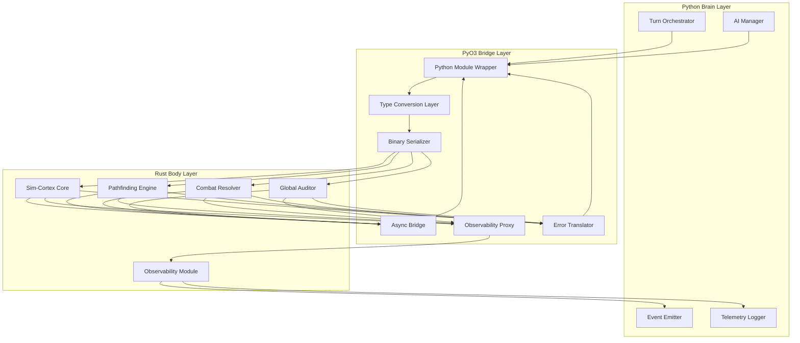
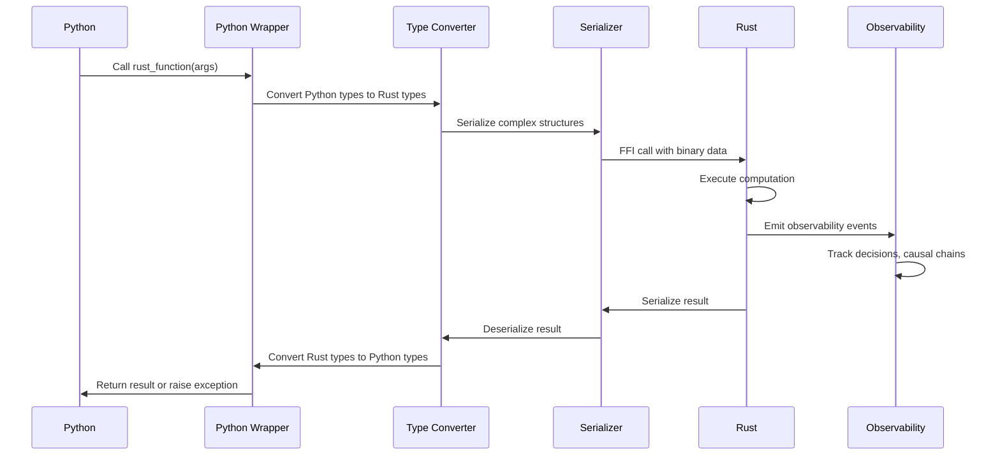

# PyO3 Bridge Layer Specification
## Void Reckoning Engine - Native Pulse Initiative

**Document Version:** 1.0
**Date:** 2026-02-06
**Status:** Architectural Design Phase
**Author:** Architect Mode

---

## Executive Summary

The PyO3 Bridge Layer is the critical boundary between Python (the "Brain") and Rust (the "Body") in the Void Reckoning Engine. This specification defines the architecture, APIs, data serialization strategies, and performance optimization patterns that enable efficient communication between Python and Rust while supporting the four observability pillars: Decision Instrumentation, Causal Traceability, State Auditing, and Deterministic Replay.

### Key Design Goals

| Goal | Description |
|------|-------------|
| **Transparent Integration** | Python code calls Rust functions as if they were native Python functions |
| **Zero-Copy Where Possible** | Minimize data copying across the FFI boundary |
| **Observability Native** | All bridge operations support the four observability pillars |
| **Type Safety** | Strong typing across the boundary with automatic conversions |
| **Error Propagation** | Seamless error translation between Python exceptions and Rust Results |
| **Performance Target** | FFI overhead < 1% of total computation time |

### Performance Targets

| Metric | Target | Rationale |
|--------|--------|-----------|
| FFI Call Overhead | < 100ns | Negligible compared to Rust computation |
| Serialization Latency | < 1ms for 10KB payload | Binary serialization efficiency |
| Batch Operation Throughput | > 100K ops/sec | Support 10K+ decisions/second |
| Memory Copy Reduction | > 90% zero-copy | Minimize cross-boundary copies |

---

## Table of Contents

1. [Bridge Layer Architecture](#i-bridge-layer-architecture)
2. [Python-to-Rust Interface](#ii-python-to-rust-interface)
3. [Rust-to-Python Interface](#iii-rust-to-python-interface)
4. [Data Serialization Strategy](#iv-data-serialization-strategy)
5. [Performance Considerations](#v-performance-considerations)
6. [Error Handling](#vi-error-handling)
7. [Testing Strategy](#vii-testing-strategy)

---

## I. Bridge Layer Architecture

### High-Level Architecture



### Data Flow Patterns



### Memory Sharing Strategies

| Strategy | Use Case | Implementation |
|----------|----------|----------------|
| **FFI Pass-by-Value** | Small primitives (int, float, bool) | Direct PyO3 conversion |
| **Zero-Copy Borrowing** | Large read-only data (graphs, spatial indices) | `PyReadonlyArray` / `PyReadonlyBuffer` |
| **Owned Transfer** | Mutable data transferred to Rust | `PyByteArray` / `PyBytes` ownership transfer |
| **Shared Memory (mmap)** | Very large datasets (entity state snapshots) | Memory-mapped files with shared ownership |
| **Arena Allocation** | Per-turn temporary allocations | Rust arena with Python handle |

### Bridge Layer Module Structure

```
pyo3-bridge/
├── Cargo.toml
├── src/
│   ├── lib.rs                    # Main PyO3 module entry point
│   ├── python/
│   │   ├── mod.rs                # Python-facing module exports
│   │   ├── pathfinding.rs        # Pathfinding Python API
│   │   ├── combat.rs             # Combat resolution Python API
│   │   ├── simulation.rs         # Simulation state Python API
│   │   └── observability.rs      # Observability bridge Python API
│   ├── rust/
│   │   ├── mod.rs                # Rust-facing exports
│   │   ├── callbacks.rs          # Python callback mechanisms
│   │   └── object_factory.rs     # Python object creation from Rust
│   ├── types/
│   │   ├── mod.rs                # Type conversion utilities
│   │   ├── python_to_rust.rs     # Python → Rust conversions
│   │   ├── rust_to_python.rs     # Rust → Python conversions
│   │   └── common.rs             # Shared type definitions
│   ├── serialization/
│   │   ├── mod.rs                # Serialization module
│   │   ├── binary.rs             # Binary serialization (bincode)
│   │   ├── schema.rs             # Schema definitions
│   │   └── zero_copy.rs          # Zero-copy utilities
│   ├── async/
│   │   ├── mod.rs                # Async bridge utilities
│   │   ├── executor.rs           # Async executor integration
│   │   └── future.rs             # Future ↔ Python coroutine conversion
│   ├── observability/
│   │   ├── mod.rs                # Observability bridge
│   │   ├── decision_bridge.rs    # Decision instrumentation bridge
│   │   ├── causal_bridge.rs      # Causal traceability bridge
│   │   ├── audit_bridge.rs       # State auditing bridge
│   │   └── replay_bridge.rs      # Deterministic replay bridge
│   └── error/
│       ├── mod.rs                # Error handling module
│       ├── conversion.rs         # Type conversion errors
│       ├── rust_to_python.rs     # Rust Result → Python exception
│       └── python_to_rust.rs     # Python exception → Rust Result
```

---

## II. Python-to-Rust Interface

### Module Structure and Import Patterns

```python
# Python import pattern
import void_reckoning_rust as vrr

# Or explicit module imports
from void_reckoning_rust import (
    PathfindingEngine,
    CombatResolver,
    SimulationState,
    GlobalAuditor,
    ObservabilityBridge
)
```

### Pathfinding API

```python
class PathfindingEngine:
    """
    Rust-backed pathfinding engine with A* and hierarchical pathfinding.
    Replaces src.services.pathfinding_service.PathfindingService for performance-critical operations.
    """

    def find_path(
        self,
        start_node: GraphNode,
        end_node: GraphNode,
        context: PathfindingContext,
        options: PathfindingOptions = None
    ) -> PathfindingResult:
        """
        Find path between two nodes using A* algorithm.

        Args:
            start_node: Starting graph node
            end_node: Target graph node
            context: Pathfinding context (universe, terrain modifiers, etc.)
            options: Optional pathfinding options (max_cost, heuristic_type, etc.)

        Returns:
            PathfindingResult containing path, cost, and metadata

        Raises:
            PathfindingError: If no path exists or pathfinding fails
        """
        pass

    def find_paths_batch(
        self,
        requests: List[PathfindingRequest]
    ) -> List[PathfindingResult]:
        """
        Find multiple paths in parallel for batch processing.

        Args:
            requests: List of pathfinding requests

        Returns:
            List of PathfindingResults in same order as requests
        """
        pass

    def invalidate_cache(
        self,
        scope: CacheInvalidationScope = CacheInvalidationScope.ALL
    ) -> None:
        """
        Invalidate pathfinding cache based on scope.

        Args:
            scope: What to invalidate (ALL, TOPOLOGY, BLOCKADES, PORTALS)
        """
        pass

    def get_cache_stats(self) -> CacheStatistics:
        """
        Get pathfinding cache statistics.

        Returns:
            CacheStatistics with hits, misses, size, etc.
        """
        pass
```

### Combat Resolution API

```python
class CombatResolver:
    """
    Rust-backed combat resolution engine.
    Replaces Python combat calculations for performance.
    """

    def resolve_combat(
        self,
        combat_id: str,
        attackers: List[CombatUnit],
        defenders: List[CombatUnit],
        context: CombatContext
    ) -> CombatOutcome:
        """
        Resolve a combat engagement between attackers and defenders.

        Args:
            combat_id: Unique identifier for this combat
            attackers: List of attacking units
            defenders: List of defending units
            context: Combat context (terrain, weather, etc.)

        Returns:
            CombatOutcome with results, casualties, and statistics

        Raises:
            CombatError: If combat resolution fails
        """
        pass

    def resolve_combat_batch(
        self,
        combats: List[CombatRequest]
    ) -> List[CombatOutcome]:
        """
        Resolve multiple combats in parallel.

        Args:
            combats: List of combat requests

        Returns:
            List of CombatOutcomes in same order as requests
        """
        pass

    def simulate_combat_round(
        self,
        combat_id: str,
        round_number: int
    ) -> CombatRoundResult:
        """
        Simulate a single combat round for incremental resolution.

        Args:
            combat_id: Combat identifier
            round_number: Round number to simulate

        Returns:
            CombatRoundResult with round-specific outcomes
        """
        pass
```

### Simulation State API

```python
class SimulationState:
    """
    Rust-backed simulation state management with ECS.
    Provides efficient entity iteration and component access.
    """

    def create_entity(
        self,
        archetype: ArchetypeId,
        components: Dict[ComponentType, Any]
    ) -> EntityId:
        """
        Create a new entity with specified components.

        Args:
            archetype: Entity archetype identifier
            components: Dictionary of component type to component data

        Returns:
            EntityId of the created entity
        """
        pass

    def get_entity_components(
        self,
        entity_id: EntityId,
        component_types: List[ComponentType]
    ) -> Dict[ComponentType, Any]:
        """
        Get components for an entity.

        Args:
            entity_id: Entity identifier
            component_types: List of component types to retrieve

        Returns:
            Dictionary of component type to component data

        Raises:
            EntityNotFoundError: If entity does not exist
        """
        pass

    def query_entities(
        self,
        query: EntityQuery
    ) -> List[EntityId]:
        """
        Query entities matching specified criteria.

        Args:
            query: Entity query specification

        Returns:
            List of matching entity IDs
        """
        pass

    def get_component_slice(
        self,
        component_type: ComponentType,
        entity_ids: List[EntityId]
    ) -> ComponentSlice:
        """
        Get a zero-copy slice of component data for multiple entities.

        Args:
            component_type: Type of component to retrieve
            entity_ids: List of entity IDs

        Returns:
            ComponentSlice with efficient access to component data
        """
        pass

    def create_snapshot(self) -> StateSnapshot:
        """
        Create a snapshot of the current simulation state.

        Returns:
            StateSnapshot containing current state
        """
        pass

    def restore_snapshot(self, snapshot: StateSnapshot) -> None:
        """
        Restore simulation state from a snapshot.

        Args:
            snapshot: StateSnapshot to restore from
        """
        pass
```

### Global Auditor API

```python
class GlobalAuditor:
    """
    Rust-backed state validation and auditing system.
    """

    def validate_state(
        self,
        rules: List[ValidationRule] = None
    ) -> AuditReport:
        """
        Validate current simulation state against specified rules.

        Args:
            rules: List of validation rules (None = all rules)

        Returns:
            AuditReport with validation results
        """
        pass

    def validate_invariants(self) -> InvalidationReport:
        """
        Validate simulation invariants (health, resources, etc.).

        Returns:
            InvalidationReport with invariant violations
        """
        pass

    def check_consistency(self) -> ConsistencyReport:
        """
        Check cross-system consistency (diplomacy, combat, economy).

        Returns:
            ConsistencyReport with consistency issues
        """
        pass

    def schedule_audit(
        self,
        audit_type: AuditType,
        interval: int
    ) -> None:
        """
        Schedule periodic audits.

        Args:
            audit_type: Type of audit (LIGHTWEIGHT, FULL, DEEP)
            interval: Interval in turns
        """
        pass
```

### Observability Bridge API

```python
class ObservabilityBridge:
    """
    Bridge for observability integration between Python and Rust.
    """

    def log_decision(
        self,
        decision: DecisionContext,
        scoring: ScoringMatrix,
        outcome: DecisionOutcome
    ) -> None:
        """
        Log a decision for Decision Instrumentation pillar.

        Args:
            decision: Decision context
            scoring: Scoring matrix
            outcome: Decision outcome
        """
        pass

    def track_causal_chain(
        self,
        correlation_id: str,
        event: CausalEvent
    ) -> None:
        """
        Track an event in the causal chain for Causal Traceability pillar.

        Args:
            correlation_id: Correlation ID for the chain
            event: Causal event to track
        """
        pass

    def record_state_change(
        self,
        change: StateChangeEvent
    ) -> None:
        """
        Record a state change for State Auditing pillar.

        Args:
            change: State change event
        """
        pass

    def capture_replay_state(
        self,
        turn: int
    ) -> ReplaySnapshot:
        """
        Capture state for Deterministic Replay pillar.

        Args:
            turn: Current turn number

        Returns:
            ReplaySnapshot for replay
        """
        pass

    def get_correlation_id(self) -> str:
        """
        Generate a new correlation ID for causal tracking.

        Returns:
            New correlation ID
        """
        pass
```

### Type Conversions (Python ↔ Rust)

| Python Type | Rust Type | Conversion Method |
|-------------|-----------|-------------------|
| `int` | `i32`, `i64`, `u32`, `u64` | Direct PyO3 conversion |
| `float` | `f32`, `f64` | Direct PyO3 conversion |
| `bool` | `bool` | Direct PyO3 conversion |
| `str` | `String`, `&str` | `PyString` with UTF-8 validation |
| `List[T]` | `Vec<T>` | `PyList` iteration |
| `Dict[K, V]` | `HashMap<K, V>` | `PyDict` iteration |
| `Tuple[T, ...]` | `(T, ...)` | `PyTuple` unpacking |
| `bytes` | `Vec<u8>`, `&[u8]` | `PyBytes` zero-copy |
| `dataclass` | Struct | Field-by-field conversion |
| `enum` | Rust enum | String/integer mapping |

### Complex Data Structure Handling

#### Lists and Iterables

```python
# Zero-copy for large read-only lists
def process_large_dataset(
    self,
    data: ReadOnlyArray[float]  # Zero-copy from Python
) -> ProcessedResult:
    pass

# Batch processing with list of requests
def process_batch(
    self,
    requests: List[Request]
) -> List[Response]:
    pass
```

#### Dictionaries and Maps

```python
# Configuration dictionaries
def configure_engine(
    self,
    config: Dict[str, Any]
) -> None:
    pass

# Entity component maps
def update_entity(
    self,
    entity_id: EntityId,
    components: Dict[ComponentType, Any]
) -> None:
    pass
```

#### Objects and Dataclasses

```python
@dataclass
class PathfindingRequest:
    start_node: GraphNode
    end_node: GraphNode
    context: PathfindingContext
    options: PathfindingOptions = None

# Automatic conversion from Python dataclass to Rust struct
def find_path(self, request: PathfindingRequest) -> PathfindingResult:
    pass
```

---

## III. Rust-to-Python Interface

### PyO3 Module Structure

```rust
// pyo3-bridge/src/lib.rs
use pyo3::prelude::*;

mod python;
mod rust;
mod types;
mod serialization;
mod async;
mod observability;
mod error;

/// The main PyO3 module for Void Reckoning Rust integration
#[pymodule]
fn void_reckoning_rust(_py: Python, m: &PyModule) -> PyResult<()> {
    // Python-facing modules
    m.add_class::<python::pathfinding::PyPathfindingEngine>()?;
    m.add_class::<python::combat::PyCombatResolver>()?;
    m.add_class::<python::simulation::PySimulationState>()?;
    m.add_class::<python::auditor::PyGlobalAuditor>()?;
    m.add_class::<python::observability::PyObservabilityBridge>()?;

    // Type exports
    m.add_class::<types::common::PyEntityId>()?;
    m.add_class::<types::common::PyGraphNode>()?;
    m.add_class::<types::common::PyPathfindingResult>()?;

    // Error types
    m.add("PathfindingError", _py.get_type::<error::PathfindingError>())?;
    m.add("CombatError", _py.get_type::<error::CombatError>())?;
    m.add("SimulationError", _py.get_type::<error::SimulationError>())?;

    Ok(())
}
```

### Exposing Rust Functions to Python

```rust
// pyo3-bridge/src/python/pathfinding.rs
use pyo3::prelude::*;
use crate::types::python_to_rust::*;
use crate::types::rust_to_python::*;
use pathfinding::engine::PathfindingEngine as RustPathfindingEngine;

/// Python wrapper for Rust PathfindingEngine
#[pyclass]
pub struct PyPathfindingEngine {
    inner: RustPathfindingEngine,
}

#[pymethods]
impl PyPathfindingEngine {
    #[new]
    fn new() -> PyResult<Self> {
        Ok(Self {
            inner: RustPathfindingEngine::new(),
        })
    }

    fn find_path(
        &self,
        py: Python,
        start_node: &PyAny,
        end_node: &PyAny,
        context: &PyAny,
        options: Option<&PyAny>,
    ) -> PyResult<PyObject> {
        // Convert Python types to Rust types
        let rust_start = convert_graph_node(py, start_node)?;
        let rust_end = convert_graph_node(py, end_node)?;
        let rust_context = convert_pathfinding_context(py, context)?;
        let rust_options = options.map(|o| convert_pathfinding_options(py, o)).transpose()?;

        // Call Rust function
        let rust_result = self.inner.find_path(
            rust_start,
            rust_end,
            rust_context,
            rust_options,
        ).map_err(|e| error::PathfindingError::from_rust(e))?;

        // Convert Rust result to Python
        let py_result = convert_pathfinding_result(py, rust_result)?;
        Ok(py_result)
    }

    fn find_paths_batch(
        &self,
        py: Python,
        requests: Vec<&PyAny>,
    ) -> PyResult<Vec<PyObject>> {
        // Convert all requests
        let rust_requests: Result<Vec<_>, _> = requests
            .iter()
            .map(|r| convert_pathfinding_request(py, r))
            .collect();
        let rust_requests = rust_requests?;

        // Call Rust batch function
        let rust_results = self.inner.find_paths_batch(rust_requests)
            .map_err(|e| error::PathfindingError::from_rust(e))?;

        // Convert results to Python
        let py_results: Result<Vec<_>, _> = rust_results
            .into_iter()
            .map(|r| convert_pathfinding_result(py, r))
            .collect();
        py_results
    }

    fn invalidate_cache(
        &self,
        scope: &str,
    ) -> PyResult<()> {
        let rust_scope = match scope {
            "ALL" => CacheInvalidationScope::All,
            "TOPOLOGY" => CacheInvalidationScope::Topology,
            "BLOCKADES" => CacheInvalidationScope::Blockades,
            "PORTALS" => CacheInvalidationScope::Portals,
            _ => return Err(PyErr::new::<pyo3::exceptions::PyValueError, _>(
                format!("Invalid cache scope: {}", scope)
            )),
        };

        self.inner.invalidate_cache(rust_scope);
        Ok(())
    }

    fn get_cache_stats(&self, py: Python) -> PyResult<PyObject> {
        let rust_stats = self.inner.get_cache_stats();
        convert_cache_statistics(py, rust_stats)
    }
}
```

### Python Object Creation from Rust

```rust
// pyo3-bridge/src/rust/object_factory.rs
use pyo3::prelude::*;
use pyo3::types::PyDict;
use pyo3::types::PyList;

pub struct PythonObjectFactory;

impl PythonObjectFactory {
    /// Create a Python dict from Rust struct
    pub fn dict_from_struct<T>(py: Python, value: &T) -> PyResult<&PyDict>
    where
        T: StructToDict,
    {
        value.to_dict(py)
    }

    /// Create a Python list from Rust Vec
    pub fn list_from_vec<T>(py: Python, vec: Vec<T>) -> PyResult<&PyList>
    where
        T: IntoPy<PyObject>,
    {
        let py_list = PyList::empty(py);
        for item in vec {
            py_list.append(item.into_py(py))?;
        }
        Ok(py_list)
    }

    /// Create a Python dataclass instance
    pub fn dataclass_from_struct<T>(
        py: Python,
        class_name: &str,
        value: &T,
    ) -> PyResult<PyObject>
    where
        T: StructToDict,
    {
        let module = py.import("dataclasses")?;
        let make_dataclass = module.getattr("make_dataclass")?;

        let fields = value.field_names();
        let py_fields = PythonObjectFactory::list_from_vec(
            py,
            fields.into_iter().map(|(name, type_str)| {
                (name, type_str, py.None())
            }).collect::<Vec<_>>()
        )?;

        let cls = make_dataclass.call1((class_name, py_fields))?;
        let dict = value.to_dict(py)?;
        cls.call1((dict,))
    }
}

pub trait StructToDict {
    fn to_dict(&self, py: Python) -> PyResult<&PyDict>;
    fn field_names(&self) -> Vec<(String, String)>;
}
```

### Callback Mechanisms for Rust to Call Python

```rust
// pyo3-bridge/src/rust/callbacks.rs
use pyo3::prelude::*;
use pyo3::types::PyFunction;
use std::sync::Arc;

/// Python callback wrapper
pub struct PythonCallback {
    py_function: PyObject,
}

impl PythonCallback {
    pub fn new(py_function: PyObject) -> Self {
        Self { py_function }
    }

    pub fn call(&self, py: Python, args: Vec<PyObject>) -> PyResult<PyObject> {
        self.py_function.call(py, args, None)
    }
}

/// Callback registry for Rust to call Python
pub struct CallbackRegistry {
    callbacks: Arc<parking_lot::RwLock<HashMap<String, PythonCallback>>>,
}

impl CallbackRegistry {
    pub fn new() -> Self {
        Self {
            callbacks: Arc::new(parking_lot::RwLock::new(HashMap::new())),
        }
    }

    pub fn register(&self, name: String, callback: PythonCallback) {
        self.callbacks.write().insert(name, callback);
    }

    pub fn call(&self, name: &str, py: Python, args: Vec<PyObject>) -> PyResult<PyObject> {
        let callbacks = self.callbacks.read();
        let callback = callbacks.get(name)
            .ok_or_else(|| PyErr::new::<pyo3::exceptions::PyKeyError, _>(
                format!("Callback not found: {}", name)
            ))?;
        callback.call(py, args)
    }
}

// Usage in Rust code
impl RustPathfindingEngine {
    pub fn with_progress_callback(
        &mut self,
        callback: PythonCallback,
    ) {
        self.progress_callback = Some(callback);
    }

    fn report_progress(&self, progress: f32) {
        if let Some(ref callback) = self.progress_callback {
            Python::with_gil(|py| {
                let _ = callback.call(py, vec![progress.into_py(py)]);
            });
        }
    }
}
```

### Async Integration

```rust
// pyo3-bridge/src/async/future.rs
use pyo3::prelude::*;
use pyo3_asyncio::tokio::future_into_py;

/// Convert Rust Future to Python coroutine
pub fn future_to_py<F, T>(
    py: Python,
    future: F,
) -> PyResult<PyObject>
where
    F: std::future::Future<Output = PyResult<T>> + Send + 'static,
    T: IntoPy<PyObject> + Send,
{
    future_into_py(py, async move {
        let result = future.await?;
        Ok(result.into_py(py))
    })
}

// Usage in Python wrapper
#[pymethods]
impl PyPathfindingEngine {
    fn find_path_async(
        &self,
        py: Python,
        start_node: &PyAny,
        end_node: &PyAny,
        context: &PyAny,
    ) -> PyResult<PyObject> {
        let rust_start = convert_graph_node(py, start_node)?;
        let rust_end = convert_graph_node(py, end_node)?;
        let rust_context = convert_pathfinding_context(py, context)?;

        let inner = self.inner.clone();
        future_to_py(py, async move {
            let rust_result = inner.find_path_async(rust_start, rust_end, rust_context).await
                .map_err(|e| error::PathfindingError::from_rust(e))?;

            Python::with_gil(|py| {
                convert_pathfinding_result(py, rust_result)
            })
        })
    }
}
```

---

## IV. Data Serialization Strategy

### Binary Serialization Format

| Format | Use Case | Rationale |
|--------|----------|-----------|
| **bincode** | Primary serialization | Fast, compact, Rust-native |
| **msgpack** | Cross-language compatibility | Human-readable, widely supported |
| **FlatBuffers** | Zero-copy deserialization | For very large datasets |
| **rkyv** | Zero-copy archive | For in-memory snapshots |

### Primary Schema (bincode)

```rust
// pyo3-bridge/src/serialization/schema.rs
use serde::{Serialize, Deserialize};

/// Binary serialization schema for bridge communication
#[derive(Debug, Clone, Serialize, Deserialize)]
pub struct BridgeMessage {
    pub version: u32,
    pub message_type: MessageType,
    pub correlation_id: Option<String>,
    pub payload: BridgePayload,
    pub metadata: MessageMetadata,
}

#[derive(Debug, Clone, Serialize, Deserialize)]
pub enum MessageType {
    PathfindingRequest,
    PathfindingResponse,
    CombatRequest,
    CombatResponse,
    StateQuery,
    StateResponse,
    ObservabilityEvent,
    Error,
}

#[derive(Debug, Clone, Serialize, Deserialize)]
pub enum BridgePayload {
    Pathfinding(PathfindingPayload),
    Combat(CombatPayload),
    State(StatePayload),
    Observability(ObservabilityPayload),
    Error(ErrorPayload),
}

#[derive(Debug, Clone, Serialize, Deserialize)]
pub struct MessageMetadata {
    pub timestamp: u64,
    pub turn: Option<u64>,
    pub universe_id: Option<String>,
    pub observability: ObservabilityMetadata,
}

#[derive(Debug, Clone, Serialize, Deserialize)]
pub struct ObservabilityMetadata {
    pub correlation_id: Option<String>,
    pub decision_id: Option<String>,
    pub causal_chain: Vec<String>,
}
```

### Zero-Copy Techniques

#### Memory-Mapped Buffers

```rust
// pyo3-bridge/src/serialization/zero_copy.rs
use pyo3::prelude::*;
use memmap2::Mmap;

/// Zero-copy memory-mapped buffer for large datasets
pub struct ZeroCopyBuffer {
    mmap: Mmap,
}

impl ZeroCopyBuffer {
    /// Create from file path
    pub fn from_file(path: &str) -> PyResult<Self> {
        let file = std::fs::File::open(path)
            .map_err(|e| PyErr::new::<pyo3::exceptions::PyIOError, _>(e.to_string()))?;
        let mmap = unsafe { Mmap::map(&file) }
            .map_err(|e| PyErr::new::<pyo3::exceptions::PyIOError, _>(e.to_string()))?;
        Ok(Self { mmap })
    }

    /// Get as bytes (zero-copy view)
    pub fn as_bytes(&self) -> &[u8] {
        &self.mmap
    }

    /// Create Python memoryview from buffer
    pub fn to_memoryview(&self, py: Python) -> PyResult<PyObject> {
        let bytes = self.as_bytes();
        let py_bytes = PyBytes::new(py, bytes);
        py_bytes.call_method0(py, "memoryview")
    }
}

/// Zero-copy array wrapper
#[pyclass]
pub struct PyZeroCopyArray {
    data: *const f32,
    len: usize,
}

#[pymethods]
impl PyZeroCopyArray {
    #[new]
    unsafe fn new(data: *const f32, len: usize) -> Self {
        Self { data, len }
    }

    fn __len__(&self) -> usize {
        self.len
    }

    fn __getitem__(&self, index: usize) -> PyResult<f32> {
        if index >= self.len {
            return Err(PyErr::new::<pyo3::exceptions::PyIndexError, _>(
                "Index out of bounds"
            ));
        }
        unsafe { Ok(*self.data.add(index)) }
    }
}
```

#### Shared Arena Allocator

```rust
// pyo3-bridge/src/serialization/arena.rs
use bumpalo::Bump;

/// Shared arena for per-turn allocations
pub struct SharedArena {
    arena: Bump,
    turn: u64,
}

impl SharedArena {
    pub fn new() -> Self {
        Self {
            arena: Bump::new(),
            turn: 0,
        }
    }

    pub fn new_turn(&mut self, turn: u64) {
        self.arena.reset();
        self.turn = turn;
    }

    pub fn allocate<T>(&self, value: T) -> &'static mut T {
        self.arena.alloc(value)
    }

    pub fn allocate_slice<T: Copy>(&self, values: &[T]) -> &'static mut [T] {
        self.arena.alloc_slice_clone(values)
    }
}

/// Python handle to shared arena
#[pyclass]
pub struct PyArenaHandle {
    arena: *const SharedArena,
}

#[pymethods]
impl PyArenaHandle {
    fn allocate_float_array(
        &self,
        py: Python,
        values: Vec<f32>,
    ) -> PyResult<PyObject> {
        let arena = unsafe { &*self.arena };
        let slice = arena.allocate_slice(&values);
        let py_array = PyZeroCopyArray::new(slice.as_ptr(), slice.len());
        Ok(py_array.into_py(py))
    }
}
```

### Large Data Transfer Optimization

```rust
// pyo3-bridge/src/serialization/large_data.rs
use pyo3::prelude::*;

/// Chunked transfer for large datasets
pub struct ChunkedTransfer<T> {
    chunks: Vec<Vec<T>>,
    chunk_size: usize,
}

impl<T: Clone> ChunkedTransfer<T> {
    pub fn new(data: Vec<T>, chunk_size: usize) -> Self {
        let chunks = data.chunks(chunk_size)
            .map(|c| c.to_vec())
            .collect();
        Self { chunks, chunk_size }
    }

    pub fn num_chunks(&self) -> usize {
        self.chunks.len()
    }

    pub fn get_chunk(&self, index: usize) -> Option<&[T]> {
        self.chunks.get(index).map(|c| c.as_slice())
    }
}

/// Python wrapper for chunked transfer
#[pyclass]
pub struct PyChunkedTransfer {
    inner: ChunkedTransfer<PyObject>,
}

#[pymethods]
impl PyChunkedTransfer {
    #[new]
    fn new(data: Vec<PyObject>, chunk_size: usize) -> Self {
        Self {
            inner: ChunkedTransfer::new(data, chunk_size),
        }
    }

    fn __len__(&self) -> usize {
        self.inner.num_chunks()
    }

    fn get_chunk(&self, py: Python, index: usize) -> PyResult<PyObject> {
        self.inner.get_chunk(index)
            .map(|chunk| {
                let py_list = PyList::empty(py);
                for item in chunk {
                    py_list.append(item.clone_ref(py))?;
                }
                py_list.into_py(py)
            })
            .ok_or_else(|| PyErr::new::<pyo3::exceptions::PyIndexError, _>(
                "Chunk index out of bounds"
            ))
    }
}
```

### Lazy Loading Patterns

```rust
// pyo3-bridge/src/serialization/lazy.rs
use pyo3::prelude::*;

/// Lazy-loaded data wrapper
pub struct LazyData<T> {
    loader: Box<dyn Fn() -> PyResult<T> + Send>,
    loaded: Option<T>,
}

impl<T> LazyData<T> {
    pub fn new<F>(loader: F) -> Self
    where
        F: Fn() -> PyResult<T> + Send + 'static,
    {
        Self {
            loader: Box::new(loader),
            loaded: None,
        }
    }

    pub fn get(&mut self) -> PyResult<&T> {
        if self.loaded.is_none() {
            self.loaded = Some((self.loader)()?);
        }
        Ok(self.loaded.as_ref().unwrap())
    }
}

/// Python wrapper for lazy-loaded data
#[pyclass]
pub struct PyLazyData {
    inner: LazyData<PyObject>,
}

#[pymethods]
impl PyLazyData {
    #[new]
    fn new(py: Python, loader: PyObject) -> PyResult<Self> {
        Ok(Self {
            inner: LazyData::new(move || {
                loader.call0(py)
            }),
        })
    }

    fn get(&mut self, py: Python) -> PyResult<PyObject> {
        self.inner.get()?.clone_ref(py)
    }
}
```

---

## V. Performance Considerations

### Minimizing FFI Overhead

| Technique | Implementation | Overhead Reduction |
|-----------|----------------|-------------------|
| **Batch Operations** | Aggregate multiple operations into single FFI call | 10-100x for many small calls |
| **Zero-Copy Borrowing** | Use `PyReadonlyArray` for read-only data | Eliminates copy overhead |
| **Owned Transfer** | Transfer ownership instead of copying | Single copy instead of two |
| **Caching** | Cache frequently accessed data on Rust side | Eliminates repeated FFI calls |
| **Async Batching** | Batch async operations together | Reduces context switches |

### Batch Operation Patterns

```rust
// pyo3-bridge/src/python/batch.rs
use pyo3::prelude::*;

/// Batch request processor
pub struct BatchProcessor<T, R> {
    batch_size: usize,
    processor: fn(Vec<T>) -> PyResult<Vec<R>>,
}

impl<T, R> BatchProcessor<T, R> {
    pub fn new(batch_size: usize, processor: fn(Vec<T>) -> PyResult<Vec<R>>) -> Self {
        Self { batch_size, processor }
    }

    pub fn process(&self, py: Python, requests: Vec<T>) -> PyResult<Vec<R>> {
        let mut results = Vec::with_capacity(requests.len());

        for chunk in requests.chunks(self.batch_size) {
            let chunk_results = (self.processor)(chunk.to_vec())?;
            results.extend(chunk_results);
        }

        Ok(results)
    }
}

/// Python wrapper for batch processing
#[pyclass]
pub struct PyBatchProcessor {
    inner: BatchProcessor<PyObject, PyObject>,
}

#[pymethods]
impl PyBatchProcessor {
    #[new]
    fn new(batch_size: usize, processor: PyObject) -> PyResult<Self> {
        Ok(Self {
            inner: BatchProcessor::new(batch_size, |requests| {
                Python::with_gil(|py| {
                    let py_requests = PyList::new(py, requests.iter())?;
                    let py_results = processor.call1(py, (py_requests,))?;
                    Ok(py_results.extract(py)?)
                })
            }),
        })
    }

    fn process(&self, py: Python, requests: Vec<PyObject>) -> PyResult<Vec<PyObject>> {
        self.inner.process(py, requests)
    }
}
```

### Async/Await Integration

```rust
// pyo3-bridge/src/async/executor.rs
use pyo3::prelude::*;
use pyo3_asyncio::tokio::run as run_async;
use tokio::runtime::Runtime;

/// Async executor for Rust async operations
pub struct AsyncExecutor {
    runtime: Runtime,
}

impl AsyncExecutor {
    pub fn new() -> PyResult<Self> {
        let runtime = Runtime::new()
            .map_err(|e| PyErr::new::<pyo3::exceptions::PyRuntimeError, _>(e.to_string()))?;
        Ok(Self { runtime })
    }

    pub fn run<F, T>(&self, future: F) -> PyResult<T>
    where
        F: std::future::Future<Output = PyResult<T>> + Send,
        T: Send,
    {
        self.runtime.block_on(future)
    }
}

/// Python wrapper for async executor
#[pyclass]
pub struct PyAsyncExecutor {
    inner: AsyncExecutor,
}

#[pymethods]
impl PyAsyncExecutor {
    #[new]
    fn new() -> PyResult<Self> {
        Ok(Self {
            inner: AsyncExecutor::new()?,
        })
    }

    fn run(&self, py: Python, coro: PyObject) -> PyResult<PyObject> {
        run_async(py, async move {
            Python::with_gil(|py| {
                coro.call_method0(py, "__await__")
            })?
        })
    }
}
```

### Thread Safety Considerations

```rust
// pyo3-bridge/src/concurrency/safety.rs
use pyo3::prelude::*;
use std::sync::{Arc, Mutex, RwLock};
use parking_lot::RwLock as ParkingRwLock;

/// Thread-safe wrapper for Rust state
pub struct ThreadSafeState<T> {
    inner: Arc<ParkingRwLock<T>>,
}

impl<T> ThreadSafeState<T> {
    pub fn new(value: T) -> Self {
        Self {
            inner: Arc::new(ParkingRwLock::new(value)),
        }
    }

    pub fn read<F, R>(&self, f: F) -> R
    where
        F: FnOnce(&T) -> R,
    {
        let guard = self.inner.read();
        f(&guard)
    }

    pub fn write<F, R>(&self, f: F) -> R
    where
        F: FnOnce(&mut T) -> R,
    {
        let mut guard = self.inner.write();
        f(&mut guard)
    }
}

/// Python wrapper for thread-safe state
#[pyclass]
pub struct PyThreadSafeState {
    inner: ThreadSafeState<PyObject>,
}

#[pymethods]
impl PyThreadSafeState {
    #[new]
    fn new(value: PyObject) -> Self {
        Self {
            inner: ThreadSafeState::new(value),
        }
    }

    fn read(&self, py: Python, func: PyObject) -> PyResult<PyObject> {
        self.inner.read(|value| {
            func.call1(py, (value.clone_ref(py),))
        })
    }

    fn write(&self, py: Python, func: PyObject) -> PyResult<PyObject> {
        self.inner.write(|value| {
            func.call1(py, (value.clone_ref(py),))
        })
    }
}
```

### Performance Monitoring

```rust
// pyo3-bridge/src/performance/monitor.rs
use pyo3::prelude::*;
use std::time::Instant;

/// Performance metrics collector
pub struct PerformanceMonitor {
    ffi_call_times: Vec<Duration>,
    serialization_times: Vec<Duration>,
    computation_times: Vec<Duration>,
}

impl PerformanceMonitor {
    pub fn new() -> Self {
        Self {
            ffi_call_times: Vec::new(),
            serialization_times: Vec::new(),
            computation_times: Vec::new(),
        }
    }

    pub fn record_ffi_call(&mut self, duration: Duration) {
        self.ffi_call_times.push(duration);
    }

    pub fn record_serialization(&mut self, duration: Duration) {
        self.serialization_times.push(duration);
    }

    pub fn record_computation(&mut self, duration: Duration) {
        self.computation_times.push(duration);
    }

    pub fn get_stats(&self) -> PerformanceStats {
        let avg_ffi = average(&self.ffi_call_times);
        let avg_serialization = average(&self.serialization_times);
        let avg_computation = average(&self.computation_times);

        PerformanceStats {
            avg_ffi_call_ns: avg_ffi.as_nanos() as u64,
            avg_serialization_ns: avg_serialization.as_nanos() as u64,
            avg_computation_ns: avg_computation.as_nanos() as u64,
            total_calls: self.ffi_call_times.len(),
        }
    }
}

fn average(durations: &[Duration]) -> Duration {
    if durations.is_empty() {
        return Duration::ZERO;
    }
    let total: Duration = durations.iter().sum();
    total / durations.len() as u32
}

#[derive(Debug, Clone)]
pub struct PerformanceStats {
    pub avg_ffi_call_ns: u64,
    pub avg_serialization_ns: u64,
    pub avg_computation_ns: u64,
    pub total_calls: usize,
}

/// Python wrapper for performance monitor
#[pyclass]
pub struct PyPerformanceMonitor {
    inner: PerformanceMonitor,
}

#[pymethods]
impl PyPerformanceMonitor {
    #[new]
    fn new() -> Self {
        Self {
            inner: PerformanceMonitor::new(),
        }
    }

    fn get_stats(&self, py: Python) -> PyResult<PyObject> {
        let stats = self.inner.get_stats();
        let dict = pyo3::types::PyDict::new(py);
        dict.set_item("avg_ffi_call_ns", stats.avg_ffi_call_ns)?;
        dict.set_item("avg_serialization_ns", stats.avg_serialization_ns)?;
        dict.set_item("avg_computation_ns", stats.avg_computation_ns)?;
        dict.set_item("total_calls", stats.total_calls)?;
        Ok(dict.into_py(py))
    }
}
```

---

## VI. Error Handling

### Python Exception ↔ Rust Error Mapping

```rust
// pyo3-bridge/src/error/mod.rs
use pyo3::prelude::*;

/// Bridge-specific error types
#[derive(Debug, thiserror::Error)]
pub enum BridgeError {
    #[error("Type conversion failed: {0}")]
    TypeConversion(String),

    #[error("Serialization error: {0}")]
    Serialization(String),

    #[error("Deserialization error: {0}")]
    Deserialization(String),

    #[error("FFI call failed: {0}")]
    FfiCall(String),

    #[error("Rust error: {0}")]
    RustError(String),
}

impl From<BridgeError> for PyErr {
    fn from(error: BridgeError) -> PyErr {
        match error {
            BridgeError::TypeConversion(msg) => {
                PyErr::new::<pyo3::exceptions::PyTypeError, _>(msg)
            }
            BridgeError::Serialization(msg) => {
                PyErr::new::<pyo3::exceptions::PyValueError, _>(msg)
            }
            BridgeError::Deserialization(msg) => {
                PyErr::new::<pyo3::exceptions::PyValueError, _>(msg)
            }
            BridgeError::FfiCall(msg) => {
                PyErr::new::<pyo3::exceptions::PyRuntimeError, _>(msg)
            }
            BridgeError::RustError(msg) => {
                PyErr::new::<pyo3::exceptions::PyRuntimeError, _>(msg)
            }
        }
    }
}

/// Pathfinding-specific error
#[derive(Debug, thiserror::Error)]
pub enum PathfindingError {
    #[error("No path found")]
    NoPathFound,

    #[error("Invalid node: {0}")]
    InvalidNode(String),

    #[error("Graph error: {0}")]
    GraphError(String),
}

impl From<PathfindingError> for PyErr {
    fn from(error: PathfindingError) -> PyErr {
        PyErr::new::<pyo3::exceptions::PyValueError, _>(error.to_string())
    }
}

/// Combat-specific error
#[derive(Debug, thiserror::Error)]
pub enum CombatError {
    #[error("Invalid combat configuration: {0}")]
    InvalidConfiguration(String),

    #[error("Combat resolution failed: {0}")]
    ResolutionFailed(String),
}

impl From<CombatError> for PyErr {
    fn from(error: CombatError) -> PyErr {
        PyErr::new::<pyo3::exceptions::PyValueError, _>(error.to_string())
    }
}
```

### Panic Handling from Rust

```rust
// pyo3-bridge/src/error/panic.rs
use pyo3::prelude::*;
use std::panic::{catch_unwind, AssertUnwindSafe};

/// Panic-safe wrapper for Rust functions
pub fn panic_safe<F, R>(py: Python, f: F) -> PyResult<R>
where
    F: FnOnce() -> PyResult<R> + UnwindSafe,
{
    match catch_unwind(AssertUnwindSafe(f)) {
        Ok(result) => result,
        Err(panic_info) => {
            // Convert panic to Python exception
            let error_msg = if let Some(msg) = panic_info.downcast_ref::<String>() {
                msg.clone()
            } else if let Some(msg) = panic_info.downcast_ref::<&str>() {
                msg.to_string()
            } else {
                "Unknown panic in Rust code".to_string()
            };

            Err(PyErr::new::<pyo3::exceptions::PanicException, _>(error_msg))
        }
    }
}

/// Usage in Python wrapper
#[pymethods]
impl PyPathfindingEngine {
    fn find_path_safe(
        &self,
        py: Python,
        start_node: &PyAny,
        end_node: &PyAny,
    ) -> PyResult<PyObject> {
        panic_safe(py, || {
            self.find_path(py, start_node, end_node, &py.None(), None)
        })
    }
}
```

### Graceful Degradation Strategies

```rust
// pyo3-bridge/src/error/degradation.rs
use pyo3::prelude::*;

/// Fallback strategy configuration
#[derive(Debug, Clone)]
pub enum FallbackStrategy {
    /// Return cached result if available
    UseCache,

    /// Return default value
    ReturnDefault,

    /// Retry with simplified parameters
    RetrySimplified,

    /// Fall back to Python implementation
    UsePythonFallback,
}

/// Degradation handler
pub struct DegradationHandler {
    strategy: FallbackStrategy,
    python_fallback: Option<PyObject>,
}

impl DegradationHandler {
    pub fn new(strategy: FallbackStrategy) -> Self {
        Self {
            strategy,
            python_fallback: None,
        }
    }

    pub fn with_python_fallback(mut self, fallback: PyObject) -> Self {
        self.python_fallback = Some(fallback);
        self
    }

    pub fn handle_error<T>(
        &self,
        py: Python,
        error: PyErr,
        default: Option<T>,
    ) -> PyResult<T>
    where
        T: FromPyObject<'py>,
    {
        match self.strategy {
            FallbackStrategy::ReturnDefault => {
                if let Some(default) = default {
                    Ok(default)
                } else {
                    Err(error)
                }
            }
            FallbackStrategy::UsePythonFallback => {
                if let Some(ref fallback) = self.python_fallback {
                    // Call Python fallback
                    fallback.call0(py)?.extract(py)
                } else {
                    Err(error)
                }
            }
            _ => Err(error),
        }
    }
}
```

### Debugging and Logging Across the Boundary

```rust
// pyo3-bridge/src/observability/logging.rs
use pyo3::prelude::*;
use std::sync::Arc;

/// Bridge logger for cross-boundary logging
pub struct BridgeLogger {
    python_logger: Option<PyObject>,
    log_level: LogLevel,
}

#[derive(Debug, Clone, Copy, PartialEq, Eq)]
pub enum LogLevel {
    Debug,
    Info,
    Warning,
    Error,
}

impl BridgeLogger {
    pub fn new() -> Self {
        Self {
            python_logger: None,
            log_level: LogLevel::Info,
        }
    }

    pub fn with_python_logger(mut self, logger: PyObject) -> Self {
        self.python_logger = Some(logger);
        self
    }

    pub fn with_log_level(mut self, level: LogLevel) -> Self {
        self.log_level = level;
        self
    }

    pub fn log(&self, py: Python, level: LogLevel, message: &str) {
        if level < self.log_level {
            return;
        }

        if let Some(ref logger) = self.python_logger {
            let level_str = match level {
                LogLevel::Debug => "debug",
                LogLevel::Info => "info",
                LogLevel::Warning => "warning",
                LogLevel::Error => "error",
            };

            let _ = logger.call1(py, (level_str, message));
        }
    }

    pub fn debug(&self, py: Python, message: &str) {
        self.log(py, LogLevel::Debug, message);
    }

    pub fn info(&self, py: Python, message: &str) {
        self.log(py, LogLevel::Info, message);
    }

    pub fn warning(&self, py: Python, message: &str) {
        self.log(py, LogLevel::Warning, message);
    }

    pub fn error(&self, py: Python, message: &str) {
        self.log(py, LogLevel::Error, message);
    }
}

/// Global bridge logger instance
static GLOBAL_LOGGER: parking_lot::Mutex<Option<Arc<BridgeLogger>>> =
    parking_lot::Mutex::new(None);

pub fn set_global_logger(logger: Arc<BridgeLogger>) {
    *GLOBAL_LOGGER.lock() = Some(logger);
}

pub fn get_global_logger() -> Option<Arc<BridgeLogger>> {
    GLOBAL_LOGGER.lock().clone()
}

/// Convenience macro for logging
macro_rules! log_bridge {
    ($level:ident, $msg:expr) => {
        if let Some(logger) = crate::observability::logging::get_global_logger() {
            Python::with_gil(|py| {
                logger.$level(py, $msg);
            });
        }
    };
}
```

---

## VII. Testing Strategy

### Unit Testing Approach for Bridge Layer

```rust
// tests/unit/type_conversion.rs
use pyo3::prelude::*;
use void_reckoning_rust::types::python_to_rust::*;
use void_reckoning_rust::types::rust_to_python::*;

#[test]
fn test_convert_int_to_rust() {
    Python::with_gil(|py| {
        let py_int = 42i32.into_py(py);
        let rust_int: i32 = py_int.extract(py).unwrap();
        assert_eq!(rust_int, 42);
    });
}

#[test]
fn test_convert_list_to_vec() {
    Python::with_gil(|py| {
        let py_list = vec![1, 2, 3, 4, 5].into_py(py);
        let rust_vec: Vec<i32> = py_list.extract(py).unwrap();
        assert_eq!(rust_vec, vec![1, 2, 3, 4, 5]);
    });
}

#[test]
fn test_convert_dict_to_hashmap() {
    Python::with_gil(|py| {
        let py_dict = pyo3::types::PyDict::new(py);
        py_dict.set_item("key1", "value1").unwrap();
        py_dict.set_item("key2", "value2").unwrap();

        let rust_map: HashMap<String, String> = py_dict.extract(py).unwrap();
        assert_eq!(rust_map.get("key1"), Some(&"value1".to_string()));
        assert_eq!(rust_map.get("key2"), Some(&"value2".to_string()));
    });
}

#[test]
fn test_zero_copy_array() {
    Python::with_gil(|py| {
        let data = vec![1.0f32, 2.0, 3.0, 4.0, 5.0];
        let py_array = PyArray::from_vec(py, data.clone());

        // Verify zero-copy access
        let slice = py_array.as_slice();
        assert_eq!(slice, &data[..]);
    });
}
```

### Integration Testing Patterns

```python
# tests/integration/test_pathfinding_bridge.py
import pytest
import void_reckoning_rust as vrr

def test_pathfinding_basic():
    """Test basic pathfinding through the bridge."""
    engine = vrr.PathfindingEngine()

    # Create test nodes
    start = create_test_node(0, 0)
    end = create_test_node(10, 10)

    # Find path
    result = engine.find_path(start, end, create_test_context())

    # Verify result
    assert result is not None
    assert len(result.path) > 0
    assert result.cost > 0

def test_pathfinding_batch():
    """Test batch pathfinding."""
    engine = vrr.PathfindingEngine()

    requests = [
        create_pathfinding_request(i, 0, i+10, 10)
        for i in range(5)
    ]

    results = engine.find_paths_batch(requests)

    assert len(results) == 5
    for result in results:
        assert result is not None

def test_pathfinding_error_handling():
    """Test error handling for invalid pathfinding."""
    engine = vrr.PathfindingEngine()

    # Invalid node
    start = None
    end = create_test_node(10, 10)

    with pytest.raises(vrr.PathfindingError):
        engine.find_path(start, end, create_test_context())

def test_cache_invalidation():
    """Test cache invalidation."""
    engine = vrr.PathfindingEngine()

    # Find path (should cache)
    start = create_test_node(0, 0)
    end = create_test_node(10, 10)
    result1 = engine.find_path(start, end, create_test_context())

    # Invalidate cache
    engine.invalidate_cache(vrr.CacheInvalidationScope.ALL)

    # Find path again (should recompute)
    result2 = engine.find_path(start, end, create_test_context())

    assert result1.path == result2.path
```

### Performance Benchmarking Methodology

```python
# tests/benchmark/bridge_benchmarks.py
import pytest
import time
import void_reckoning_rust as vrr

@pytest.mark.benchmark
def test_pathfinding_single_call():
    """Benchmark single pathfinding call."""
    engine = vrr.PathfindingEngine()
    start = create_test_node(0, 0)
    end = create_test_node(100, 100)
    context = create_test_context()

    start_time = time.perf_counter()
    result = engine.find_path(start, end, context)
    elapsed = time.perf_counter() - start_time

    print(f"Single pathfinding call: {elapsed * 1000:.3f}ms")
    assert result is not None

@pytest.mark.benchmark
def test_pathfinding_batch():
    """Benchmark batch pathfinding."""
    engine = vrr.PathfindingEngine()
    requests = [
        create_pathfinding_request(i, 0, i+10, 10)
        for i in range(1000)
    ]

    start_time = time.perf_counter()
    results = engine.find_paths_batch(requests)
    elapsed = time.perf_counter() - start_time

    throughput = len(requests) / elapsed
    print(f"Batch pathfinding: {throughput:.0f} ops/sec")
    assert len(results) == 1000

@pytest.mark.benchmark
def test_serialization_overhead():
    """Measure serialization overhead."""
    large_data = create_large_dataset(10000)

    start_time = time.perf_counter()
    serialized = vrr.serialize_data(large_data)
    serialize_time = time.perf_counter() - start_time

    start_time = time.perf_counter()
    deserialized = vrr.deserialize_data(serialized)
    deserialize_time = time.perf_counter() - start_time

    total_time = serialize_time + deserialize_time
    print(f"Serialization: {serialize_time * 1000:.3f}ms")
    print(f"Deserialization: {deserialize_time * 1000:.3f}ms")
    print(f"Total: {total_time * 1000:.3f}ms")

@pytest.mark.benchmark
def test_ffi_overhead():
    """Measure FFI call overhead."""
    engine = vrr.PathfindingEngine()

    # Minimal operation
    start_time = time.perf_counter()
    for _ in range(10000):
        engine.get_cache_stats()
    elapsed = time.perf_counter() - start_time

    avg_overhead = elapsed / 10000
    print(f"FFI call overhead: {avg_overhead * 1_000_000:.0f}ns")
    assert avg_overhead < 0.0001  # < 100 microseconds
```

### Observability Testing

```python
# tests/integration/test_observability_bridge.py
import pytest
import void_reckoning_rust as vrr

def test_decision_logging():
    """Test decision logging through the bridge."""
    bridge = vrr.ObservabilityBridge()

    decision = create_test_decision()
    scoring = create_test_scoring()
    outcome = create_test_outcome()

    # Log decision
    bridge.log_decision(decision, scoring, outcome)

    # Verify decision was logged (would need to check observability storage)
    assert True  # Placeholder for actual verification

def test_causal_chain_tracking():
    """Test causal chain tracking."""
    bridge = vrr.ObservabilityBridge()

    correlation_id = bridge.get_correlation_id()

    # Track events in chain
    event1 = create_causal_event("event1")
    event2 = create_causal_event("event2")
    event3 = create_causal_event("event3")

    bridge.track_causal_chain(correlation_id, event1)
    bridge.track_causal_chain(correlation_id, event2)
    bridge.track_causal_chain(correlation_id, event3)

    # Verify chain was tracked
    assert True  # Placeholder for actual verification

def test_state_change_recording():
    """Test state change recording."""
    bridge = vrr.ObservabilityBridge()

    change = create_state_change()
    bridge.record_state_change(change)

    # Verify change was recorded
    assert True  # Placeholder for actual verification

def test_replay_snapshot():
    """Test replay snapshot capture."""
    bridge = vrr.ObservabilityBridge()

    snapshot = bridge.capture_replay_state(42)

    assert snapshot is not None
    assert snapshot.turn == 42
```

### Cross-Language Property Testing

```python
# tests/property/test_bridge_properties.py
import pytest
from hypothesis import given, strategies as st
import void_reckoning_rust as vrr

@given(st.integers(min_value=0, max_value=1000),
       st.integers(min_value=0, max_value=1000))
def test_pathfinding_roundtrip(x1, y1):
    """Property test: pathfinding is deterministic."""
    engine = vrr.PathfindingEngine()

    start = create_test_node(x1, y1)
    end = create_test_node(x1 + 10, y1 + 10)
    context = create_test_context()

    result1 = engine.find_path(start, end, context)
    result2 = engine.find_path(start, end, context)

    assert result1.path == result2.path
    assert result1.cost == result2.cost

@given(st.lists(st.integers(min_value=0, max_value=100), min_size=10, max_size=100))
def test_batch_processing_order_preserved(data):
    """Property test: batch processing preserves order."""
    engine = vrr.PathfindingEngine()

    requests = [
        create_pathfinding_request(d[i], d[i+1], d[i+2], d[i+3])
        for i in range(0, len(data) - 3, 4)
    ]

    results = engine.find_paths_batch(requests)

    assert len(results) == len(requests)
    assert all(r is not None for r in results)
```

---

## Conclusion

This PyO3 Bridge Layer specification provides a comprehensive blueprint for implementing efficient Python-Rust integration in the Void Reckoning Engine. The design emphasizes:

1. **Transparent Integration**: Python code calls Rust functions as if they were native
2. **Zero-Copy Where Possible**: Minimizing data copying across the FFI boundary
3. **Observability Native**: Full support for the four observability pillars
4. **Type Safety**: Strong typing with automatic conversions
5. **Error Propagation**: Seamless error translation between languages
6. **Performance Target**: FFI overhead < 1% of total computation time

The bridge layer enables the "Native Pulse" initiative to achieve its performance targets while maintaining the flexibility and rapid development benefits of Python for high-level game logic.
