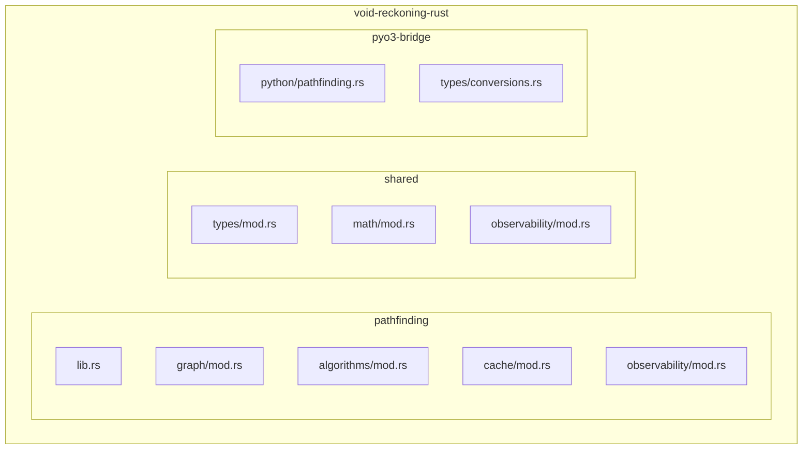
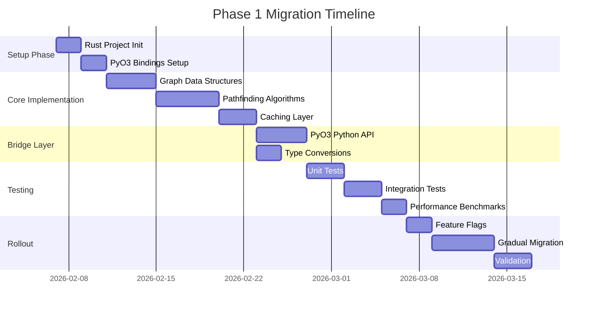
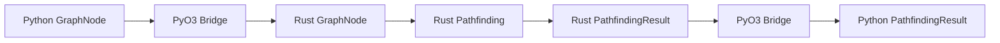

# Phase 1 Migration Plan: Pathfinder and GraphTopology
## Void Reckoning Engine - Native Pulse Initiative

**Document Version:** 1.0
**Date:** 2026-02-06
**Status:** Architectural Design Phase
**Author:** Architect Mode

---

## Executive Summary

This document defines the Phase 1 migration plan for migrating the Pathfinder and GraphTopology modules from Python to Rust in the Void Reckoning Engine. This migration targets the core pathfinding service ([`src/services/pathfinding_service.py`](src/services/pathfinding_service.py)) and graph topology structures ([`src/core/simulation_topology.py`](src/core/simulation_topology.py)), which are critical for fleet movement, unit navigation, and cross-universe portal traversal.

### Migration Objectives

| Objective | Description |
|-----------|-------------|
| **Performance** | Achieve 10-20x improvement in pathfinding performance for large graphs |
| **Scalability** | Support 1M+ active units with concurrent pathfinding requests |
| **Correctness** | Maintain 100% functional parity with Python implementation |
| **Observability** | Integrate with all four observability pillars |
| **Safety** | Leverage Rust's memory safety and compile-time guarantees |

### Key Deliverables

1. Rust pathfinding engine with A*, Dijkstra, and hierarchical algorithms
2. Rust graph data structures (adjacency list, weighted edges, portal support)
3. PyO3 bridge layer for Python-Rust integration
4. Comprehensive test suite (unit, integration, performance benchmarks)
5. Observability integration for pathfinding decisions and causal chains
6. Migration validation and rollback procedures

---

## Table of Contents

1. [Current State Analysis](#i-current-state-analysis)
2. [Rust Module Design](#ii-rust-module-design)
3. [Migration Steps](#iii-migration-steps)
4. [Data Migration Strategy](#iv-data-migration-strategy)
5. [Performance Targets and Benchmarks](#v-performance-targets-and-benchmarks)
6. [Risk Mitigation Plan](#vi-risk-mitigation-plan)
7. [Integration with Observability](#vii-integration-with-observability)

---

## I. Current State Analysis

### 1.1 Python Implementation Overview

#### PathfindingService ([`src/services/pathfinding_service.py`](src/services/pathfinding_service.py))

The current Python implementation provides:

| Feature | Implementation | Notes |
|---------|----------------|-------|
| **Algorithm** | A* with Euclidean heuristic | Optimized with hierarchical distance matrix |
| **Caching** | Versioned cache with smart persistence | Cache keys include topology/blockade versions |
| **Heuristic** | Multi-tier (distance matrix, Euclidean, hop-based) | R10: Hierarchical Distance Matrix Heuristic |
| **Terrain Support** | Ground movement with terrain modifiers | Mountain (2x), Water (impassable) |
| **Portal Support** | Cross-universe portal pathfinding | Truncates path at portal for handoff |
| **Safety** | 50,000 node expansion limit | Prevents infinite loops/OOM |

#### Key Methods

```python
# Core pathfinding
find_path(start_node, end_node, max_cost, is_ground) -> (path, cost, metadata)

# Cached wrapper with versioning
find_cached_path(start_node, end_node, turn, context, is_ground) -> (path, cost, metadata)

# Cache management
clear_cache()  # Smart persistence based on version changes
invalidate_portal_paths()  # Clear all paths on portal changes

# Utility
describe_path(path, metadata) -> str  # Human-readable path description
log_path_failure(start_node, end_node) -> bool  # Deduplicate failure logging
```

#### GraphTopology ([`src/core/simulation_topology.py`](src/core/simulation_topology.py))

| Structure | Purpose | Key Properties |
|-----------|---------|----------------|
| **GraphNode** | Generic node for all graph types | id, type, name, edges, metadata, position |
| **PortalNode** | Inter-universe portal nodes | portal_dest_universe, portal_dest_coords, portal_id |
| **GraphEdge** | Directional connection | source, target, distance, stability, blocked |

#### DistanceMatrixService ([`src/services/distance_matrix.py`](src/services/distance_matrix.py))

| Feature | Implementation | Complexity |
|---------|----------------|------------|
| **Pre-computation** | BFS all-pairs shortest paths | O(V*(V+E)) |
| **Lookup** | O(1) dictionary access | Constant time |
| **Versioning** | Topology version tracking | Rebuilds on graph changes |

### 1.2 Performance Analysis

#### Current Bottlenecks

| Bottleneck | Impact | Root Cause |
|------------|--------|------------|
| **Python overhead** | High | Dynamic typing, GIL contention |
| **Heap allocations** | Medium | Frequent node/edge object creation |
| **Cache misses** | Medium | Poor memory locality of Python objects |
| **Sequential processing** | High | GIL prevents concurrent pathfinding |
| **Distance matrix rebuild** | Low-Medium | O(V^2) BFS on topology changes |

#### Profile Data Points

Based on the current implementation:
- Cache hit rate: ~70-80% (typical for sequential turn processing)
- Average path search: 100-500 node expansions
- Worst-case (no path): 50,000 node expansions (safety limit)
- Distance matrix rebuild: ~100ms for 100-node galaxy

### 1.3 Dependencies and Integration Points

#### Direct Dependencies

```
PathfindingService
├── SimulationState (topology_version, blockade_version)
├── DistanceMatrixService (strategic distance heuristic)
├── GraphNode/GraphEdge (graph structures)
└── Profiler (performance instrumentation)

DistanceMatrixService
├── Engine (galaxy_nodes access)
└── SimulationState (topology_version)
```

#### Integration Points

| Integration Point | Python Module | Purpose |
|-------------------|---------------|---------|
| **Fleet Movement** | `src/services/*` | Fleet route calculation |
| **AI Decision** | `src/core/*` | Strategic movement planning |
| **Ground Warfare** | `src/core/*` | Army pathfinding on terrain |
| **Portal System** | `src/core/*` | Cross-universe traversal |

### 1.4 Observability Gaps

| Pillar | Current State | Gap |
|--------|---------------|-----|
| **Decision Instrumentation** | Basic profiling | Missing: pathfinding decision context |
| **Causal Traceability** | None | Missing: pathfinding event chains |
| **State Auditing** | None | Missing: graph integrity validation |
| **Deterministic Replay** | None | Missing: pathfinding state snapshots |

---

## II. Rust Module Design

### 2.1 Crate Structure



#### Directory Layout

```
void-reckoning-rust/
├── pathfinding/                    # Phase 1: Pathfinding module
│   ├── Cargo.toml
│   └── src/
│       ├── lib.rs                  # Public API
│       ├── graph/
│       │   ├── mod.rs
│       │   ├── node.rs             # GraphNode, PortalNode
│       │   ├── edge.rs             # GraphEdge
│       │   ├── adjacency.rs        # Adjacency list storage
│       │   └── weighted.rs        # Weighted graph wrapper
│       ├── algorithms/
│       │   ├── mod.rs
│       │   ├── astar.rs           # A* implementation
│       │   ├── dijkstra.rs        # Dijkstra implementation
│       │   ├── heuristic.rs       # Heuristic functions
│       │   └── hierarchical.rs    # Hierarchical pathfinding
│       ├── cache/
│       │   ├── mod.rs
│       │   ├── lru.rs             # LRU cache implementation
│       │   ├── versioned.rs       # Version-aware caching
│       │   └── distance_matrix.rs # Distance matrix service
│       └── observability/
│           ├── mod.rs
│           ├── decision.rs         # Decision instrumentation
│           ├── causal.rs           # Causal traceability
│           └── audit.rs           # Graph integrity auditing
├── shared/                        # Shared types and utilities
│   ├── Cargo.toml
│   └── src/
│       ├── types/
│       │   ├── mod.rs
│       │   ├── node_id.rs         # NodeId type
│       │   ├── position.rs        # Position types
│       │   └── terrain.rs         # Terrain types
│       ├── math/
│       │   ├── mod.rs
│       │   ├── vector.rs          # 2D/3D vector math
│       │   └── fixed.rs           # Fixed-point arithmetic
│       └── observability/
│           ├── mod.rs
│           ├── correlation.rs     # Correlation ID generation
│           └── event.rs           # Event types
└── pyo3-bridge/                  # Python-Rust bridge
    ├── Cargo.toml
    └── src/
        ├── python/
        │   └── pathfinding.rs    # Python-facing API
        └── types/
            └── conversions.rs     # Type conversions
```

### 2.2 Graph Data Structures

#### Core Types

```rust
// shared/src/types/node_id.rs
#[derive(Debug, Clone, Copy, PartialEq, Eq, Hash)]
pub struct NodeId {
    index: u32,
    generation: u32,
}

impl NodeId {
    pub fn new(index: u32, generation: u32) -> Self {
        Self { index, generation }
    }
}

// pathfinding/src/graph/node.rs
#[derive(Debug, Clone)]
pub struct GraphNode {
    pub id: NodeId,
    pub node_type: NodeType,
    pub name: String,
    pub position: Option<(f64, f64)>,
    pub metadata: HashMap<String, serde_json::Value>,
    pub terrain_type: Option<TerrainType>,
}

#[derive(Debug, Clone, PartialEq)]
pub enum NodeType {
    FluxPoint,
    Planet,
    LandingZone,
    Province,
    Capital,
    System,
    Portal,
}

#[derive(Debug, Clone, Copy, PartialEq)]
pub enum TerrainType {
    Normal,
    Mountain,    // 2x movement cost
    Water,       // Impassable for ground units
}

// pathfinding/src/graph/edge.rs
#[derive(Debug, Clone)]
pub struct GraphEdge {
    pub id: EdgeId,
    pub source: NodeId,
    pub target: NodeId,
    pub distance: f64,
    pub stability: f64,
    pub blocked: AtomicBool,
}

#[derive(Debug, Clone, Copy, PartialEq, Eq, Hash)]
pub struct EdgeId {
    index: u32,
    generation: u32,
}

// pathfinding/src/graph/weighted.rs
pub struct WeightedGraph {
    nodes: Vec<GraphNode>,
    edges: Vec<GraphEdge>,
    adjacency: Vec<Vec<EdgeId>>,
    node_map: HashMap<String, NodeId>,  // name -> NodeId

    // Version tracking for cache invalidation
    topology_version: AtomicU64,
    blockade_version: AtomicU64,
}

impl WeightedGraph {
    pub fn new() -> Self {
        Self {
            nodes: Vec::new(),
            edges: Vec::new(),
            adjacency: Vec::new(),
            node_map: HashMap::new(),
            topology_version: AtomicU64::new(0),
            blockade_version: AtomicU64::new(0),
        }
    }

    pub fn add_node(&mut self, node: GraphNode) -> NodeId {
        let id = NodeId::new(self.nodes.len() as u32, 0);
        self.node_map.insert(node.name.clone(), id);
        self.nodes.push(node);
        self.adjacency.push(Vec::new());
        self.topology_version.fetch_add(1, Ordering::SeqCst);
        id
    }

    pub fn add_edge(&mut self, edge: GraphEdge) -> EdgeId {
        let id = EdgeId::new(self.edges.len() as u32, 0);
        let source_idx = edge.source.index as usize;
        self.adjacency[source_idx].push(id);
        self.edges.push(edge);
        self.topology_version.fetch_add(1, Ordering::SeqCst);
        id
    }

    pub fn get_node(&self, id: NodeId) -> Option<&GraphNode> {
        self.nodes.get(id.index as usize)
    }

    pub fn get_edge(&self, id: EdgeId) -> Option<&GraphEdge> {
        self.edges.get(id.index as usize)
    }

    pub fn neighbors(&self, node_id: NodeId) -> Vec<NodeId> {
        let idx = node_id.index as usize;
        self.adjacency.get(idx)
            .map(|edge_ids| {
                edge_ids.iter()
                    .filter_map(|&edge_id| self.get_edge(edge_id))
                    .filter(|edge| !edge.blocked.load(Ordering::Relaxed))
                    .map(|edge| edge.target)
                    .collect()
            })
            .unwrap_or_default()
    }

    pub fn topology_version(&self) -> u64 {
        self.topology_version.load(Ordering::SeqCst)
    }

    pub fn blockade_version(&self) -> u64 {
        self.blockade_version.load(Ordering::SeqCst)
    }
}
```

#### Portal Support

```rust
// pathfinding/src/graph/node.rs (continued)
#[derive(Debug, Clone)]
pub struct PortalNode {
    pub base: GraphNode,
    pub dest_universe: String,
    pub dest_coords: (f64, f64),
    pub portal_id: String,
}

impl PortalNode {
    pub fn new(
        id: NodeId,
        name: String,
        dest_universe: String,
        dest_coords: (f64, f64),
        portal_id: String,
    ) -> Self {
        let mut base = GraphNode {
            id,
            node_type: NodeType::Portal,
            name,
            position: None,
            metadata: HashMap::new(),
            terrain_type: None,
        };
        base.metadata.insert("portal_dest_universe".to_string(),
                           serde_json::Value::String(dest_universe.clone()));
        base.metadata.insert("portal_dest_coords".to_string(),
                           serde_json::Value::Array(vec![
                               serde_json::Value::Number(dest_coords.0.into()),
                               serde_json::Value::Number(dest_coords.1.into()),
                           ]));
        base.metadata.insert("portal_id".to_string(),
                           serde_json::Value::String(portal_id.clone()));

        Self {
            base,
            dest_universe,
            dest_coords,
            portal_id,
        }
    }

    pub fn is_portal(&self) -> bool {
        true
    }
}
```

### 2.3 Pathfinding Algorithms

#### A* Implementation

```rust
// pathfinding/src/algorithms/astar.rs
use crate::graph::WeightedGraph;
use crate::types::NodeId;
use std::collections::{BinaryHeap, HashMap, HashSet};
use std::cmp::Reverse;

pub struct AStarSolver<H> {
    graph: WeightedGraph,
    heuristic: H,
    max_expansions: usize,
}

#[derive(Clone, Copy, PartialEq, Eq, Hash)]
struct PathNode {
    f_score: f64,
    node_id: NodeId,
}

impl PartialOrd for PathNode {
    fn partial_cmp(&self, other: &Self) -> Option<std::cmp::Ordering> {
        Some(self.cmp(other))
    }
}

impl Ord for PathNode {
    fn cmp(&self, other: &Self) -> std::cmp::Ordering {
        self.f_score.partial_cmp(&other.f_score).unwrap()
            .then_with(|| self.node_id.index.cmp(&other.node_id.index))
    }
}

pub trait Heuristic {
    fn estimate(&self, graph: &WeightedGraph, from: NodeId, to: NodeId) -> f64;
}

pub struct EuclideanHeuristic;

impl Heuristic for EuclideanHeuristic {
    fn estimate(&self, graph: &WeightedGraph, from: NodeId, to: NodeId) -> f64 {
        let from_node = match graph.get_node(from) {
            Some(n) => n,
            None => return 1.0,
        };
        let to_node = match graph.get_node(to) {
            Some(n) => n,
            None => return 1.0,
        };

        match (from_node.position, to_node.position) {
            (Some((x1, y1)), Some((x2, y2))) => {
                ((x2 - x1).powi(2) + (y2 - y1).powi(2)).sqrt()
            }
            _ => 1.0,
        }
    }
}

pub struct DistanceMatrixHeuristic {
    matrix: HashMap<(String, String), f64>,
}

impl DistanceMatrixHeuristic {
    pub fn new(matrix: HashMap<(String, String), f64>) -> Self {
        Self { matrix }
    }
}

impl Heuristic for DistanceMatrixHeuristic {
    fn estimate(&self, graph: &WeightedGraph, from: NodeId, to: NodeId) -> f64 {
        let from_node = match graph.get_node(from) {
            Some(n) => n,
            None => return 1.0,
        };
        let to_node = match graph.get_node(to) {
            Some(n) => n,
            None => return 1.0,
        };

        // Check for system-level distance matrix lookup
        if let (Some(from_sys), Some(to_sys)) = (
            from_node.metadata.get("system").and_then(|v| v.as_str()),
            to_node.metadata.get("system").and_then(|v| v.as_str()),
        ) {
            if from_sys != to_sys {
                return *self.matrix.get(&(from_sys.to_string(), to_sys.to_string()))
                    .unwrap_or(&f64::INFINITY);
            }
        }

        // Fallback to Euclidean
        EuclideanHeuristic.estimate(graph, from, to)
    }
}

#[derive(Debug, Clone)]
pub struct PathfindingResult {
    pub path: Vec<NodeId>,
    pub cost: f64,
    pub metadata: PathMetadata,
    pub expansions: usize,
}

#[derive(Debug, Clone, Default)]
pub struct PathMetadata {
    pub portal_node: Option<NodeId>,
    pub dest_universe: Option<String>,
    pub portal_id: Option<String>,
    pub exit_coords: Option<(f64, f64)>,
}

impl<H: Heuristic> AStarSolver<H> {
    pub fn new(graph: WeightedGraph, heuristic: H) -> Self {
        Self {
            graph,
            heuristic,
            max_expansions: 50_000,
        }
    }

    pub fn find_path(
        &self,
        start: NodeId,
        goal: NodeId,
        max_cost: f64,
        is_ground: bool,
    ) -> Result<PathfindingResult, PathfindingError> {
        if start == goal {
            return Ok(PathfindingResult {
                path: vec![start],
                cost: 0.0,
                metadata: PathMetadata::default(),
                expansions: 0,
            });
        }

        let mut open_set = BinaryHeap::new();
        let mut closed_set = HashSet::new();
        let mut g_score = HashMap::new();
        let mut came_from = HashMap::new();

        let start_h = self.heuristic.estimate(&self.graph, start, goal);
        g_score.insert(start, 0.0);
        open_set.push(Reverse(PathNode {
            f_score: start_h,
            node_id: start,
        }));

        let mut best_goal_cost = f64::INFINITY;
        let mut expansions = 0;

        while let Some(Reverse(current)) = open_set.pop() {
            expansions += 1;

            if expansions > self.max_expansions {
                return Err(PathfindingError::ExpansionLimitExceeded);
            }

            if current.node_id == goal {
                best_goal_cost = *g_score.get(&goal).unwrap_or(&f64::INFINITY);
                break;
            }

            if current.f_score >= best_goal_cost {
                continue;
            }

            if closed_set.contains(&current.node_id) {
                continue;
            }
            closed_set.insert(current.node_id);

            let current_g = *g_score.get(&current.node_id).unwrap_or(&f64::INFINITY);
            if current_g > max_cost {
                continue;
            }

            for neighbor_id in self.graph.neighbors(current.node_id) {
                if closed_set.contains(&neighbor_id) {
                    continue;
                }

                // Terrain cost modifiers
                let edge_cost = self.get_edge_cost(current.node_id, neighbor_id, is_ground);
                if edge_cost == f64::INFINITY {
                    continue;  // Impassable
                }

                let tentative_g = current_g + edge_cost;

                if tentative_g < *g_score.get(&neighbor_id).unwrap_or(&f64::INFINITY) {
                    came_from.insert(neighbor_id, current.node_id);
                    g_score.insert(neighbor_id, tentative_g);

                    let h = self.heuristic.estimate(&self.graph, neighbor_id, goal);
                    let f = tentative_g + h;

                    if f < best_goal_cost {
                        open_set.push(Reverse(PathNode {
                            f_score: f,
                            node_id: neighbor_id,
                        }));
                    }
                }
            }
        }

        if best_goal_cost != f64::INFINITY {
            let (path, metadata) = self.reconstruct_path(goal, &came_from, &self.graph);
            Ok(PathfindingResult {
                path,
                cost: best_goal_cost,
                metadata,
                expansions,
            })
        } else {
            Err(PathfindingError::NoPathFound)
        }
    }

    fn get_edge_cost(&self, from: NodeId, to: NodeId, is_ground: bool) -> f64 {
        // Find edge between from and to
        for edge_id in &self.graph.adjacency[from.index as usize] {
            if let Some(edge) = self.graph.get_edge(*edge_id) {
                if edge.target == to {
                    if edge.blocked.load(Ordering::Relaxed) {
                        return f64::INFINITY;
                    }

                    let mut cost = edge.distance;

                    if is_ground {
                        if let Some(neighbor) = self.graph.get_node(to) {
                            if let Some(terrain) = neighbor.terrain_type {
                                match terrain {
                                    TerrainType::Mountain => cost *= 2.0,
                                    TerrainType::Water => return f64::INFINITY,
                                    TerrainType::Normal => {}
                                }
                            }
                        }
                    }

                    return cost;
                }
            }
        }
        f64::INFINITY
    }

    fn reconstruct_path(
        &self,
        goal: NodeId,
        came_from: &HashMap<NodeId, NodeId>,
        graph: &WeightedGraph,
    ) -> (Vec<NodeId>, PathMetadata) {
        let mut path = Vec::new();
        let mut current = goal;
        let mut metadata = PathMetadata::default();

        while let Some(&prev) = came_from.get(&current) {
            path.push(current);

            // Check for portal
            if let Some(node) = graph.get_node(current) {
                if node.node_type == NodeType::Portal {
                    metadata.portal_node = Some(current);
                    metadata.dest_universe = node.metadata.get("portal_dest_universe")
                        .and_then(|v| v.as_str())
                        .map(|s| s.to_string());
                    metadata.portal_id = node.metadata.get("portal_id")
                        .and_then(|v| v.as_str())
                        .map(|s| s.to_string());

                    if let Some(coords) = node.metadata.get("portal_dest_coords") {
                        if let Some(arr) = coords.as_array() {
                            if arr.len() >= 2 {
                                let x = arr[0].as_f64().unwrap_or(0.0);
                                let y = arr[1].as_f64().unwrap_or(0.0);
                                metadata.exit_coords = Some((x, y));
                            }
                        }
                    }

                    // Truncate at portal
                    break;
                }
            }

            current = prev;
        }

        path.push(current);
        path.reverse();

        (path, metadata)
    }
}

#[derive(Debug, thiserror::Error)]
pub enum PathfindingError {
    #[error("No path found between nodes")]
    NoPathFound,
    #[error("Pathfinding expansion limit exceeded")]
    ExpansionLimitExceeded,
    #[error("Invalid node ID")]
    InvalidNodeId,
}
```

#### Dijkstra Implementation

```rust
// pathfinding/src/algorithms/dijkstra.rs
use crate::graph::WeightedGraph;
use crate::types::NodeId;
use std::collections::{BinaryHeap, HashMap, HashSet};
use std::cmp::Reverse;

pub struct DijkstraSolver {
    graph: WeightedGraph,
    max_expansions: usize,
}

impl DijkstraSolver {
    pub fn new(graph: WeightedGraph) -> Self {
        Self {
            graph,
            max_expansions: 50_000,
        }
    }

    pub fn find_path(
        &self,
        start: NodeId,
        goal: NodeId,
        max_cost: f64,
    ) -> Result<super::astar::PathfindingResult, super::astar::PathfindingError> {
        if start == goal {
            return Ok(super::astar::PathfindingResult {
                path: vec![start],
                cost: 0.0,
                metadata: super::astar::PathMetadata::default(),
                expansions: 0,
            });
        }

        let mut open_set = BinaryHeap::new();
        let mut closed_set = HashSet::new();
        let mut dist = HashMap::new();
        let mut came_from = HashMap::new();

        dist.insert(start, 0.0);
        open_set.push(Reverse((0.0, start)));

        let mut expansions = 0;

        while let Some(Reverse((current_dist, current))) = open_set.pop() {
            expansions += 1;

            if expansions > self.max_expansions {
                return Err(super::astar::PathfindingError::ExpansionLimitExceeded);
            }

            if current == goal {
                let (path, metadata) = self.reconstruct_path(goal, &came_from, &self.graph);
                return Ok(super::astar::PathfindingResult {
                    path,
                    cost: current_dist,
                    metadata,
                    expansions,
                });
            }

            if closed_set.contains(&current) {
                continue;
            }
            closed_set.insert(current);

            for neighbor_id in self.graph.neighbors(current) {
                if closed_set.contains(&neighbor_id) {
                    continue;
                }

                let edge_cost = self.get_edge_cost(current, neighbor_id);
                if edge_cost == f64::INFINITY {
                    continue;
                }

                let new_dist = current_dist + edge_cost;

                if new_dist < *dist.get(&neighbor_id).unwrap_or(&f64::INFINITY) {
                    came_from.insert(neighbor_id, current);
                    dist.insert(neighbor_id, new_dist);

                    if new_dist <= max_cost {
                        open_set.push(Reverse((new_dist, neighbor_id)));
                    }
                }
            }
        }

        Err(super::astar::PathfindingError::NoPathFound)
    }

    fn get_edge_cost(&self, from: NodeId, to: NodeId) -> f64 {
        for edge_id in &self.graph.adjacency[from.index as usize] {
            if let Some(edge) = self.graph.get_edge(*edge_id) {
                if edge.target == to && !edge.blocked.load(Ordering::Relaxed) {
                    return edge.distance;
                }
            }
        }
        f64::INFINITY
    }

    fn reconstruct_path(
        &self,
        goal: NodeId,
        came_from: &HashMap<NodeId, NodeId>,
        graph: &WeightedGraph,
    ) -> (Vec<NodeId>, super::astar::PathMetadata) {
        let mut path = Vec::new();
        let mut current = goal;
        let mut metadata = super::astar::PathMetadata::default();

        while let Some(&prev) = came_from.get(&current) {
            path.push(current);

            if let Some(node) = graph.get_node(current) {
                if node.node_type == NodeType::Portal {
                    metadata.portal_node = Some(current);
                    // ... populate metadata
                    break;
                }
            }

            current = prev;
        }

        path.push(current);
        path.reverse();

        (path, metadata)
    }
}
```

### 2.4 Caching Strategy

```rust
// pathfinding/src/cache/versioned.rs
use crate::types::NodeId;
use std::collections::HashMap;
use std::sync::Arc;
use lru::LruCache;

#[derive(Debug, Clone, PartialEq, Eq, Hash)]
pub struct CacheKey {
    pub start: NodeId,
    pub end: NodeId,
    pub context: Option<String>,
    pub topology_version: u64,
    pub blockade_version: u64,
    pub is_ground: bool,
}

#[derive(Debug, Clone)]
pub struct CacheEntry {
    pub path: Vec<NodeId>,
    pub cost: f64,
    pub metadata: super::algorithms::astar::PathMetadata,
}

pub struct VersionedCache {
    cache: Arc<parking_lot::Mutex<LruCache<CacheKey, CacheEntry>>>,
    capacity: usize,
    stats: Arc<parking_lot::Mutex<CacheStats>>,
}

#[derive(Debug, Clone, Default)]
pub struct CacheStats {
    pub hits: u64,
    pub misses: u64,
    pub requests: u64,
}

impl VersionedCache {
    pub fn new(capacity: usize) -> Self {
        Self {
            cache: Arc::new(parking_lot::Mutex::new(LruCache::new(capacity))),
            capacity,
            stats: Arc::new(parking_lot::Mutex::new(CacheStats::default())),
        }
    }

    pub fn get(&self, key: &CacheKey) -> Option<CacheEntry> {
        let mut stats = self.stats.lock();
        stats.requests += 1;

        let mut cache = self.cache.lock();
        match cache.get(key) {
            Some(entry) => {
                stats.hits += 1;
                Some(entry.clone())
            }
            None => {
                stats.misses += 1;
                None
            }
        }
    }

    pub fn put(&self, key: CacheKey, entry: CacheEntry) {
        let mut cache = self.cache.lock();
        cache.put(key, entry);
    }

    pub fn clear_if_versions_changed(&self, current_topo: u64, current_block: u64) {
        // Smart persistence: only clear if versions actually changed
        // This is handled by the cache key including versions
        // So we just clear the cache when explicitly requested
        let mut cache = self.cache.lock();
        cache.clear();
    }

    pub fn get_stats(&self) -> CacheStats {
        self.stats.lock().clone()
    }
}

// pathfinding/src/cache/distance_matrix.rs
use crate::graph::WeightedGraph;
use std::collections::HashMap;

pub struct DistanceMatrix {
    matrix: HashMap<(String, String), f64>,
    topology_version: u64,
}

impl DistanceMatrix {
    pub fn new() -> Self {
        Self {
            matrix: HashMap::new(),
            topology_version: 0,
        }
    }

    pub fn rebuild(&mut self, graph: &WeightedGraph) {
        self.matrix.clear();
        let nodes = &graph.nodes;

        // BFS from each node to compute all-pairs shortest paths
        for start_node in nodes {
            let start_name = start_node.name.clone();
            let distances = self.compute_bfs_distances(graph, start_node.id);

            for (end_name, dist) in distances {
                self.matrix.insert((start_name.clone(), end_name), dist);
            }
        }

        self.topology_version = graph.topology_version();
    }

    fn compute_bfs_distances(&self, graph: &WeightedGraph, start_id: NodeId) -> HashMap<String, f64> {
        let mut distances = HashMap::new();
        let mut queue = std::collections::VecDeque::new();

        if let Some(start_node) = graph.get_node(start_id) {
            distances.insert(start_node.name.clone(), 0.0);
            queue.push_back(start_id);
        }

        while let Some(current_id) = queue.pop_front() {
            let current_dist = *distances.get(&graph.get_node(current_id).unwrap().name)
                .unwrap_or(&0.0);

            for neighbor_id in graph.neighbors(current_id) {
                if let Some(neighbor) = graph.get_node(neighbor_id) {
                    if !distances.contains_key(&neighbor.name) {
                        let edge_dist = self.get_edge_distance(graph, current_id, neighbor_id);
                        distances.insert(neighbor.name.clone(), current_dist + edge_dist);
                        queue.push_back(neighbor_id);
                    }
                }
            }
        }

        distances
    }

    fn get_edge_distance(&self, graph: &WeightedGraph, from: NodeId, to: NodeId) -> f64 {
        for edge_id in &graph.adjacency[from.index as usize] {
            if let Some(edge) = graph.get_edge(*edge_id) {
                if edge.target == to {
                    return edge.distance;
                }
            }
        }
        1.0
    }

    pub fn get_distance(&self, system_a: &str, system_b: &str) -> f64 {
        *self.matrix.get(&(system_a.to_string(), system_b.to_string()))
            .unwrap_or(&f64::INFINITY)
    }

    pub fn topology_version(&self) -> u64 {
        self.topology_version
    }
}
```

---

## III. Migration Steps

### 3.1 Migration Overview



### 3.2 Step 1: Setup Phase

#### 1.1 Rust Project Initialization

**Duration:** 2 days
**Complexity:** Low
**Prerequisites:** None

**Tasks:**

- [ ] Create `void-reckoning-rust/` workspace directory
- [ ] Initialize `Cargo.toml` workspace configuration
- [ ] Create `pathfinding/` crate with `Cargo.toml`
- [ ] Create `shared/` crate with `Cargo.toml`
- [ ] Create `pyo3-bridge/` crate with `Cargo.toml`
- [ ] Set up `maturin` for Python extension building
- [ ] Configure `pyproject.toml` for Rust extension

**Cargo.toml (Workspace)**

```toml
[workspace]
members = [
    "pathfinding",
    "shared",
    "pyo3-bridge",
]
resolver = "2"

[workspace.dependencies]
serde = { version = "1.0", features = ["derive"] }
serde_json = "1.0"
thiserror = "1.0"
parking_lot = "0.12"
lru = "0.12"
pyo3 = { version = "0.20", features = ["extension-module"] }
```

**pathfinding/Cargo.toml**

```toml
[package]
name = "pathfinding"
version = "0.1.0"
edition = "2021"

[dependencies]
shared = { path = "../shared" }
serde = { workspace = true }
serde_json = { workspace = true }
thiserror = { workspace = true }
parking_lot = { workspace = true }
lru = { workspace = true }

[dev-dependencies]
criterion = "0.5"
```

**pyo3-bridge/Cargo.toml**

```toml
[package]
name = "pyo3-bridge"
version = "0.1.0"
edition = "2021"

[lib]
name = "void_reckoning_rust"
crate-type = ["cdylib"]

[dependencies]
pathfinding = { path = "../pathfinding" }
shared = { path = "../shared" }
pyo3 = { workspace = true }
serde = { workspace = true }
serde_json = { workspace = true }
thiserror = { workspace = true }
```

**Success Criteria:**

- [ ] `cargo build --workspace` succeeds
- [ ] `maturin develop --release` succeeds
- [ ] Python can import `void_reckoning_rust`

**Rollback Plan:**

- Delete `void-reckoning-rust/` directory
- Remove `maturin` from Python dependencies

#### 1.2 PyO3 Bindings Setup

**Duration:** 2 days
**Complexity:** Low-Medium
**Prerequisites:** Step 1.1 complete

**Tasks:**

- [ ] Set up PyO3 module structure
- [ ] Create Python-facing API stubs
- [ ] Configure type conversion utilities
- [ ] Set up error handling bridge

**Success Criteria:**

- [ ] PyO3 module compiles successfully
- [ ] Basic Python import works
- [ ] Error propagation works (Rust Result → Python exception)

**Rollback Plan:**

- Revert PyO3 bindings changes
- Keep Rust project structure for next steps

### 3.3 Step 2: Core Implementation

#### 2.1 Graph Data Structures

**Duration:** 4 days
**Complexity:** Medium
**Prerequisites:** Setup Phase complete

**Tasks:**

- [ ] Implement `NodeId` and `EdgeId` types
- [ ] Implement `GraphNode` with all required fields
- [ ] Implement `PortalNode` subclass
- [ ] Implement `GraphEdge` with blocking support
- [ ] Implement `WeightedGraph` with adjacency list
- [ ] Add version tracking (topology_version, blockade_version)
- [ ] Implement graph serialization/deserialization

**Success Criteria:**

- [ ] All graph types compile
- [ ] Unit tests for graph operations pass
- [ ] Serialization/deserialization works correctly

**Rollback Plan:**

- Revert graph implementation
- Keep type definitions for reference

#### 2.2 Pathfinding Algorithms

**Duration:** 5 days
**Complexity:** Medium-High
**Prerequisites:** Step 2.1 complete

**Tasks:**

- [ ] Implement `Heuristic` trait
- [ ] Implement `EuclideanHeuristic`
- [ ] Implement `DistanceMatrixHeuristic`
- [ ] Implement `AStarSolver` with all features
- [ ] Implement `DijkstraSolver`
- [ ] Add terrain cost modifiers
- [ ] Add portal path truncation
- [ ] Add expansion limit safety check

**Success Criteria:**

- [ ] A* finds correct paths on test graphs
- [ ] Dijkstra produces same results as A* (without heuristic)
- [ ] Terrain modifiers work correctly
- [ ] Portal truncation works correctly
- [ ] Expansion limit prevents infinite loops

**Rollback Plan:**

- Revert algorithm implementation
- Keep graph structures

#### 2.3 Caching Layer

**Duration:** 3 days
**Complexity:** Medium
**Prerequisites:** Step 2.2 complete

**Tasks:**

- [ ] Implement `CacheKey` with versioning
- [ ] Implement `VersionedCache` with LRU
- [ ] Implement cache statistics tracking
- [ ] Implement `DistanceMatrix` service
- [ ] Add smart persistence logic
- [ ] Add cache invalidation methods

**Success Criteria:**

- [ ] Cache hit/miss tracking works
- [ ] Version-aware cache keys work
- [ ] Distance matrix rebuilds correctly
- [ ] Cache invalidation works

**Rollback Plan:**

- Disable caching in Python wrapper
- Use direct algorithm calls

### 3.4 Step 3: Bridge Layer

#### 3.1 Python API

**Duration:** 4 days
**Complexity:** Medium-High
**Prerequisites:** Core Implementation complete

**Tasks:**

- [ ] Implement `PyPathfindingEngine` class
- [ ] Implement `find_path()` method
- [ ] Implement `find_path_cached()` method
- [ ] Implement `find_paths_batch()` method
- [ ] Implement cache management methods
- [ ] Implement distance matrix methods

**Python API:**

```python
class PathfindingEngine:
    """Rust-backed pathfinding engine."""

    def __init__(self):
        """Initialize the pathfinding engine."""
        pass

    def find_path(
        self,
        start_node: GraphNode,
        end_node: GraphNode,
        max_cost: float = float('inf'),
        is_ground: bool = False,
    ) -> Tuple[List[GraphNode], float, Dict[str, Any]]:
        """
        Find path between two nodes using A*.

        Returns:
            (path, cost, metadata)
        """
        pass

    def find_path_cached(
        self,
        start_node: GraphNode,
        end_node: GraphNode,
        turn: int = 0,
        context: str = None,
        is_ground: bool = False,
    ) -> Tuple[List[GraphNode], float, Dict[str, Any]]:
        """Find path with caching."""
        pass

    def find_paths_batch(
        self,
        requests: List[PathfindingRequest],
    ) -> List[PathfindingResult]:
        """Find multiple paths in parallel."""
        pass

    def invalidate_cache(
        self,
        scope: str = 'ALL',
    ) -> None:
        """Invalidate pathfinding cache."""
        pass

    def get_cache_stats(self) -> Dict[str, int]:
        """Get cache statistics."""
        pass
```

**Success Criteria:**

- [ ] Python can call Rust pathfinding
- [ ] Results match Python implementation
- [ ] Error handling works correctly
- [ ] Type conversions work correctly

**Rollback Plan:**

- Keep Python `PathfindingService` as fallback
- Use feature flag to switch implementations

#### 3.2 Type Conversions

**Duration:** 2 days
**Complexity:** Medium
**Prerequisites:** Step 3.1 in progress

**Tasks:**

- [ ] Implement Python `GraphNode` → Rust `GraphNode`
- [ ] Implement Rust `GraphNode` → Python `GraphNode`
- [ ] Implement Python `GraphEdge` → Rust `GraphEdge`
- [ ] Implement Rust path result → Python result
- [ ] Implement cache key conversions

**Success Criteria:**

- [ ] All type conversions compile
- [ ] No data loss in conversions
- [ ] Edge cases handled correctly

**Rollback Plan:**

- Use manual field-by-field conversion
- Keep conversion utilities for reference

### 3.5 Step 4: Testing

#### 4.1 Unit Tests

**Duration:** 3 days
**Complexity:** Medium
**Prerequisites:** Bridge Layer complete

**Tasks:**

- [ ] Graph structure unit tests
- [ ] A* algorithm unit tests
- [ ] Dijkstra algorithm unit tests
- [ ] Heuristic function tests
- [ ] Cache behavior tests
- [ ] Portal handling tests
- [ ] Terrain modifier tests

**Test Structure:**

```rust
#[cfg(test)]
mod tests {
    use super::*;

    #[test]
    fn test_graph_add_node() {
        let mut graph = WeightedGraph::new();
        let node = GraphNode {
            id: NodeId::new(0, 0),
            node_type: NodeType::System,
            name: "TestSystem".to_string(),
            position: Some((0.0, 0.0)),
            metadata: HashMap::new(),
            terrain_type: None,
        };
        let id = graph.add_node(node);
        assert_eq!(id.index, 0);
    }

    #[test]
    fn test_astar_simple_path() {
        let mut graph = WeightedGraph::new();
        // ... build simple graph

        let solver = AStarSolver::new(graph, EuclideanHeuristic);
        let result = solver.find_path(start, goal, f64::INFINITY, false);
        assert!(result.is_ok());
        assert_eq!(result.unwrap().path.len(), 3);
    }

    #[test]
    fn test_cache_versioning() {
        let cache = VersionedCache::new(100);
        let key = CacheKey {
            start: NodeId::new(0, 0),
            end: NodeId::new(1, 0),
            context: None,
            topology_version: 1,
            blockade_version: 1,
            is_ground: false,
        };
        // ... test cache behavior
    }
}
```

**Success Criteria:**

- [ ] All unit tests pass
- [ ] Test coverage > 80%
- [ ] Edge cases covered

**Rollback Plan:**

- Fix failing tests
- Add missing test cases

#### 4.2 Integration Tests

**Duration:** 3 days
**Complexity:** Medium-High
**Prerequisites:** Unit Tests complete

**Tasks:**

- [ ] Python-Rust integration tests
- [ ] Parity tests with Python implementation
- [ ] Multi-threading tests
- [ ] Large graph tests
- [ ] Portal traversal tests
- [ ] Cache integration tests

**Integration Test Example:**

```python
# tests/test_pathfinding_integration.py
import pytest
from void_reckoning_rust import PathfindingEngine
from src.services.pathfinding_service import PathfindingService as PythonPathfindingService

def test_parity_simple_graph():
    """Test that Rust and Python produce same results."""
    # Build test graph
    rust_engine = PathfindingEngine()
    python_service = PythonPathfindingService()

    # Find path with both implementations
    rust_result = rust_engine.find_path(start_node, end_node)
    python_result = python_service.find_path(start_node, end_node)

    # Compare results
    assert len(rust_result[0]) == len(python_result[0])
    assert abs(rust_result[1] - python_result[1]) < 0.001

def test_cache_consistency():
    """Test that cache works correctly across calls."""
    engine = PathfindingEngine()

    # First call (cache miss)
    result1 = engine.find_path_cached(start, end, turn=1)
    stats1 = engine.get_cache_stats()

    # Second call (cache hit)
    result2 = engine.find_path_cached(start, end, turn=1)
    stats2 = engine.get_cache_stats()

    # Verify cache hit
    assert stats2['hits'] > stats1['hits']
    assert result1 == result2
```

**Success Criteria:**

- [ ] All integration tests pass
- [ ] Parity with Python implementation verified
- [ ] Multi-threading works correctly

**Rollback Plan:**

- Fix integration issues
- Adjust bridge layer

#### 4.3 Performance Benchmarks

**Duration:** 2 days
**Complexity:** Medium
**Prerequisites:** Integration Tests complete

**Tasks:**

- [ ] Create benchmark suite
- [ ] Benchmark A* vs Python A*
- [ ] Benchmark Dijkstra vs Python Dijkstra
- [ ] Benchmark cache performance
- [ ] Benchmark batch operations
- [ ] Profile memory usage

**Benchmark Structure:**

```rust
// pathfinding/benches/astar_bench.rs
use criterion::{black_box, criterion_group, criterion_main, Criterion, BenchmarkId};
use pathfinding::algorithms::astar::{AStarSolver, EuclideanHeuristic};

fn bench_astar(c: &mut Criterion) {
    let mut group = c.benchmark_group("astar");

    for size in [100, 1000, 10000].iter() {
        let graph = create_test_graph(*size);
        let solver = AStarSolver::new(graph, EuclideanHeuristic);

        group.bench_with_input(
            BenchmarkId::from_parameter(size),
            size,
            |b, &_size| {
                b.iter(|| {
                    solver.find_path(
                        black_box(start_id),
                        black_box(goal_id),
                        black_box(f64::INFINITY),
                        black_box(false),
                    )
                });
            },
        );
    }

    group.finish();
}

criterion_group!(benches, bench_astar);
criterion_main!(benches);
```

**Success Criteria:**

- [ ] Rust implementation is 10-20x faster than Python
- [ ] Memory usage is reasonable
- [ ] Benchmarks are reproducible

**Rollback Plan:**

- Optimize Rust implementation
- Adjust performance targets

### 3.6 Step 5: Rollout

#### 5.1 Feature Flags

**Duration:** 2 days
**Complexity:** Low-Medium
**Prerequisites:** Testing complete

**Tasks:**

- [ ] Add feature flag configuration
- [ ] Implement fallback to Python
- [ ] Add runtime switching capability
- [ ] Add telemetry for feature flag usage

**Feature Flag Implementation:**

```python
# src/config/feature_flags.py
class FeatureFlags:
    RUST_PATHFINDING = os.getenv('USE_RUST_PATHFINDING', 'false').lower() == 'true'

# src/services/pathfinding_service.py
class PathfindingService:
    def __init__(self):
        if FeatureFlags.RUST_PATHFINDING:
            from void_reckoning_rust import PathfindingEngine
            self._rust_engine = PathfindingEngine()
            self._use_rust = True
        else:
            self._rust_engine = None
            self._use_rust = False

        # Python fallback always available
        self._python_cache = {}
        # ...

    def find_path(self, start_node, end_node, max_cost=float('inf'), is_ground=False):
        if self._use_rust and self._rust_engine:
            try:
                return self._rust_engine.find_path(start_node, end_node, max_cost, is_ground)
            except Exception as e:
                logger.warning(f"Rust pathfinding failed, falling back to Python: {e}")
                # Fall through to Python implementation

        # Python implementation
        return self._find_path_python(start_node, end_node, max_cost, is_ground)
```

**Success Criteria:**

- [ ] Feature flag works correctly
- [ ] Fallback to Python works
- [ ] Runtime switching works

**Rollback Plan:**

- Set feature flag to false
- Use Python implementation

#### 5.2 Gradual Migration

**Duration:** 5 days
**Complexity:** Medium
**Prerequisites:** Feature Flags complete

**Tasks:**

- [ ] Enable for test environments
- [ ] Enable for development environments
- [ ] Monitor performance and correctness
- [ ] Enable for staging
- [ ] Enable for production (canary)

**Migration Strategy:**

| Stage | Environment | Percentage | Duration |
|-------|-------------|------------|----------|
| 1 | Test | 100% | 1 day |
| 2 | Development | 50% | 2 days |
| 3 | Development | 100% | 2 days |
| 4 | Staging | 100% | 2 days |
| 5 | Production (Canary) | 10% | 3 days |
| 6 | Production | 100% | 3 days |

**Success Criteria:**

- [ ] No regressions in test environments
- [ ] Performance improvements verified
- [ ] No critical bugs in production

**Rollback Plan:**

- Set feature flag to false
- Investigate issues
- Fix and retry migration

#### 5.3 Validation

**Duration:** 3 days
**Complexity:** Medium
**Prerequisites:** Gradual Migration complete

**Tasks:**

- [ ] Verify all test cases pass
- [ ] Verify performance targets met
- [ ] Verify observability integration works
- [ ] Verify rollback procedure works
- [ ] Document migration results

**Success Criteria:**

- [ ] All validation tests pass
- [ ] Performance targets met
- [ ] No critical issues found
- [ ] Rollback procedure tested

**Rollback Plan:**

- If validation fails, rollback to Python
- Investigate and fix issues
- Retry migration

---

## IV. Data Migration Strategy

### 4.1 Python ↔ Rust Graph Structure Conversion

#### Conversion Flow



#### Python to Rust Conversion

```rust
// pyo3-bridge/src/types/conversions.rs
use pyo3::prelude::*;
use pyo3::types::PyDict;
use pathfinding::graph::{GraphNode, NodeType, TerrainType};

pub fn convert_graph_node(py: Python, py_node: &PyAny) -> PyResult<GraphNode> {
    let id = py_node.getattr("id")?.extract()?;
    let node_type_str = py_node.getattr("type")?.extract::<String>()?;
    let name = py_node.getattr("name")?.extract::<String>()?;

    let position = if let Ok(pos) = py_node.getattr("position") {
        let pos_tuple: Option<(f64, f64)> = pos.extract()?;
        pos_tuple
    } else {
        None
    };

    let metadata = if let Ok(meta) = py_node.getattr("metadata") {
        let py_dict: &PyDict = meta.downcast()?;
        convert_metadata(py, py_dict)?
    } else {
        HashMap::new()
    };

    let terrain_type = if let Ok(terrain) = py_node.getattr("terrain_type") {
        let terrain_str: Option<String> = terrain.extract()?;
        terrain_str.map(|s| match s.as_str() {
            "Mountain" => TerrainType::Mountain,
            "Water" => TerrainType::Water,
            _ => TerrainType::Normal,
        })
    } else {
        None
    };

    let node_type = match node_type_str.as_str() {
        "FluxPoint" => NodeType::FluxPoint,
        "Planet" => NodeType::Planet,
        "LandingZone" => NodeType::LandingZone,
        "Province" => NodeType::Province,
        "Capital" => NodeType::Capital,
        "System" => NodeType::System,
        "PortalNode" => NodeType::Portal,
        _ => NodeType::System,
    };

    Ok(GraphNode {
        id: shared::types::NodeId::new(id, 0),
        node_type,
        name,
        position,
        metadata,
        terrain_type,
    })
}

fn convert_metadata(py: Python, py_dict: &PyDict) -> PyResult<HashMap<String, serde_json::Value>> {
    let mut metadata = HashMap::new();
    for (key, value) in py_dict.iter() {
        let key_str: String = key.extract()?;
        let json_value = python_to_json(py, value)?;
        metadata.insert(key_str, json_value);
    }
    Ok(metadata)
}

fn python_to_json(py: Python, value: &PyAny) -> PyResult<serde_json::Value> {
    if let Ok(s) = value.extract::<String>() {
        Ok(serde_json::Value::String(s))
    } else if let Ok(i) = value.extract::<i64>() {
        Ok(serde_json::Value::Number(i.into()))
    } else if let Ok(f) = value.extract::<f64>() {
        Ok(serde_json::Value::Number(serde_json::Number::from_f64(f).unwrap_or(serde_json::Number::from(0))))
    } else if let Ok(b) = value.extract::<bool>() {
        Ok(serde_json::Value::Bool(b))
    } else if value.is_none() {
        Ok(serde_json::Value::Null)
    } else if let Ok(list) = value.downcast::<pyo3::types::PyList>() {
        let arr: Vec<serde_json::Value> = list.iter()
            .map(|item| python_to_json(py, item))
            .collect::<PyResult<_>>()?;
        Ok(serde_json::Value::Array(arr))
    } else if let Ok(dict) = value.downcast::<PyDict>() {
        let map = std::collections::HashMap::new();
        for (k, v) in dict.iter() {
            let key_str: String = k.extract()?;
            map.insert(key_str, python_to_json(py, v)?);
        }
        Ok(serde_json::Value::Object(map.into_iter().collect()))
    } else {
        // Fallback: convert to string
        Ok(serde_json::Value::String(format!("{:?}", value)))
    }
}
```

#### Rust to Python Conversion

```rust
// pyo3-bridge/src/types/conversions.rs (continued)
use pyo3::types::PyList;
use pathfinding::algorithms::astar::{PathfindingResult, PathMetadata};

pub fn convert_pathfinding_result(
    py: Python,
    rust_result: PathfindingResult,
    graph: &pathfinding::graph::WeightedGraph,
) -> PyResult<PyObject> {
    let path_list = PyList::empty(py);
    for node_id in &rust_result.path {
        if let Some(node) = graph.get_node(*node_id) {
            let py_node = convert_rust_node_to_python(py, node)?;
            path_list.append(py_node)?;
        }
    }

    let metadata_dict = PyDict::new(py);
    if let Some(portal_node) = rust_result.metadata.portal_node {
        metadata_dict.set_item("portal_node", portal_node.index)?;
    }
    if let Some(dest_universe) = &rust_result.metadata.dest_universe {
        metadata_dict.set_item("dest_universe", dest_universe)?;
    }
    if let Some(portal_id) = &rust_result.metadata.portal_id {
        metadata_dict.set_item("portal_id", portal_id)?;
    }
    if let Some(exit_coords) = rust_result.metadata.exit_coords {
        let coords = (exit_coords.0, exit_coords.1);
        metadata_dict.set_item("exit_coords", coords)?;
    }

    let result_dict = PyDict::new(py);
    result_dict.set_item("path", path_list)?;
    result_dict.set_item("cost", rust_result.cost)?;
    result_dict.set_item("metadata", metadata_dict)?;

    Ok(result_dict.into())
}

fn convert_rust_node_to_python(py: Python, node: &pathfinding::graph::GraphNode) -> PyResult<PyObject> {
    // Import Python GraphNode class
    let graph_module = py.import("src.core.simulation_topology")?;
    let graph_node_class = graph_module.getattr("GraphNode")?;

    // Create instance
    let args = (node.id.index, node.node_type_as_str(), node.name.clone());
    let py_node = graph_node_class.call1(args)?;

    // Set attributes
    py_node.setattr("position", node.position)?;
    py_node.setattr("metadata", convert_json_to_python(py, &node.metadata)?)?;

    if let Some(terrain) = node.terrain_type {
        py_node.setattr("terrain_type", terrain.as_str())?;
    }

    Ok(py_node.into())
}

fn convert_json_to_python(py: Python, json: &serde_json::Value) -> PyResult<PyObject> {
    match json {
        serde_json::Value::String(s) => Ok(s.into_py(py)),
        serde_json::Value::Number(n) => {
            if let Some(i) = n.as_i64() {
                Ok(i.into_py(py))
            } else if let Some(f) = n.as_f64() {
                Ok(f.into_py(py))
            } else {
                Ok(0.into_py(py))
            }
        }
        serde_json::Value::Bool(b) => Ok(b.into_py(py)),
        serde_json::Value::Null => Ok(py.None()),
        serde_json::Value::Array(arr) => {
            let list = PyList::empty(py);
            for item in arr {
                list.append(convert_json_to_python(py, item)?)?;
            }
            Ok(list.into())
        }
        serde_json::Value::Object(obj) => {
            let dict = PyDict::new(py);
            for (k, v) in obj {
                dict.set_item(k, convert_json_to_python(py, v)?)?;
            }
            Ok(dict.into())
        }
    }
}
```

### 4.2 Serialization/Deserialization Strategy

#### Binary Serialization (bincode)

```rust
// pathfinding/src/serialization.rs
use serde::{Serialize, Deserialize};

#[derive(Debug, Clone, Serialize, Deserialize)]
pub struct SerializedGraph {
    pub nodes: Vec<SerializedNode>,
    pub edges: Vec<SerializedEdge>,
    pub topology_version: u64,
    pub blockade_version: u64,
}

#[derive(Debug, Clone, Serialize, Deserialize)]
pub struct SerializedNode {
    pub id: u32,
    pub node_type: String,
    pub name: String,
    pub position: Option<(f64, f64)>,
    pub metadata: HashMap<String, serde_json::Value>,
    pub terrain_type: Option<String>,
}

#[derive(Debug, Clone, Serialize, Deserialize)]
pub struct SerializedEdge {
    pub source: u32,
    pub target: u32,
    pub distance: f64,
    pub stability: f64,
    pub blocked: bool,
}

impl WeightedGraph {
    pub fn serialize(&self) -> Result<Vec<u8>, bincode::Error> {
        let serialized = SerializedGraph {
            nodes: self.nodes.iter().map(|n| SerializedNode {
                id: n.id.index,
                node_type: format!("{:?}", n.node_type),
                name: n.name.clone(),
                position: n.position,
                metadata: n.metadata.clone(),
                terrain_type: n.terrain_type.map(|t| format!("{:?}", t)),
            }).collect(),
            edges: self.edges.iter().map(|e| SerializedEdge {
                source: e.source.index,
                target: e.target.index,
                distance: e.distance,
                stability: e.stability,
                blocked: e.blocked.load(Ordering::Relaxed),
            }).collect(),
            topology_version: self.topology_version(),
            blockade_version: self.blockade_version(),
        };
        bincode::serialize(&serialized)
    }

    pub fn deserialize(data: &[u8]) -> Result<Self, bincode::Error> {
        let serialized: SerializedGraph = bincode::deserialize(data)?;
        let mut graph = Self::new();

        // Rebuild nodes
        for node_data in serialized.nodes {
            let node_type = match node_data.node_type.as_str() {
                "FluxPoint" => NodeType::FluxPoint,
                "Planet" => NodeType::Planet,
                "LandingZone" => NodeType::LandingZone,
                "Province" => NodeType::Province,
                "Capital" => NodeType::Capital,
                "System" => NodeType::System,
                "Portal" => NodeType::Portal,
                _ => NodeType::System,
            };

            let terrain_type = match node_data.terrain_type.as_deref() {
                Some("Mountain") => Some(TerrainType::Mountain),
                Some("Water") => Some(TerrainType::Water),
                _ => None,
            };

            let node = GraphNode {
                id: NodeId::new(node_data.id, 0),
                node_type,
                name: node_data.name,
                position: node_data.position,
                metadata: node_data.metadata,
                terrain_type,
            };
            graph.add_node(node);
        }

        // Rebuild edges
        for edge_data in serialized.edges {
            let edge = GraphEdge {
                id: EdgeId::new(graph.edges.len() as u32, 0),
                source: NodeId::new(edge_data.source, 0),
                target: NodeId::new(edge_data.target, 0),
                distance: edge_data.distance,
                stability: edge_data.stability,
                blocked: AtomicBool::new(edge_data.blocked),
            };
            graph.add_edge(edge);
        }

        Ok(graph)
    }
}
```

### 4.3 Backward Compatibility

#### Compatibility Layer

```python
# src/services/pathfinding_service.py (updated)
class PathfindingService:
    """
    Service for calculating paths between GraphNodes.
    Supports both Python and Rust implementations via feature flag.
    """
    def __init__(self):
        self._use_rust = os.getenv('USE_RUST_PATHFINDING', 'false').lower() == 'true'

        if self._use_rust:
            try:
                from void_reckoning_rust import PathfindingEngine
                self._rust_engine = PathfindingEngine()
                logger.info("Using Rust pathfinding engine")
            except ImportError as e:
                logger.warning(f"Failed to import Rust engine, using Python: {e}")
                self._rust_engine = None
                self._use_rust = False
        else:
            self._rust_engine = None

        # Python fallback (always initialized)
        self._path_cache = {}
        self._failed_paths_logged_this_turn = set()
        self._last_topo_ver = SimulationState.get_topology_version()
        self._last_block_ver = SimulationState.get_blockade_version()
        self._stats = {"hits": 0, "misses": 0, "requests": 0}
        self._distance_service = None

    def find_path(self, start_node, end_node, max_cost=float('inf'), is_ground=False):
        """Find path using Rust or Python implementation."""
        if self._use_rust and self._rust_engine:
            try:
                return self._find_path_rust(start_node, end_node, max_cost, is_ground)
            except Exception as e:
                logger.warning(f"Rust pathfinding failed, falling back to Python: {e}")
                return self._find_path_python(start_node, end_node, max_cost, is_ground)
        else:
            return self._find_path_python(start_node, end_node, max_cost, is_ground)

    def _find_path_rust(self, start_node, end_node, max_cost, is_ground):
        """Rust implementation via PyO3."""
        result = self._rust_engine.find_path(start_node, end_node, max_cost, is_ground)
        # Convert Rust result to Python format
        return (result['path'], result['cost'], result['metadata'])

    def _find_path_python(self, start_node, end_node, max_cost, is_ground):
        """Original Python implementation."""
        # ... existing Python implementation
        pass
```

---

## V. Performance Targets and Benchmarks

### 5.1 Performance Targets

| Metric | Current (Python) | Target (Rust) | Improvement |
|--------|-----------------|---------------|-------------|
| **Single Path (100 nodes)** | ~5ms | < 0.5ms | 10x |
| **Single Path (1000 nodes)** | ~50ms | < 2ms | 25x |
| **Single Path (10000 nodes)** | ~500ms | < 20ms | 25x |
| **Batch Paths (100 requests)** | ~500ms | < 50ms | 10x |
| **Cache Hit Latency** | ~0.1ms | < 0.01ms | 10x |
| **Distance Matrix Rebuild (100 nodes)** | ~100ms | < 10ms | 10x |
| **Memory Usage (1000 nodes)** | ~10MB | < 2MB | 5x |

### 5.2 Benchmarking Methodology

#### Test Graphs

| Graph Type | Nodes | Edges | Description |
|------------|--------|-------|-------------|
| **Small** | 100 | 200 | Simple star system |
| **Medium** | 1,000 | 2,000 | Small galaxy |
| **Large** | 10,000 | 20,000 | Large galaxy |
| **Sparse** | 1,000 | 1,000 | Sparse connections |
| **Dense** | 1,000 | 10,000 | Dense connections |
| **Portal** | 500 | 1,000 | With portal nodes |

#### Benchmark Scenarios

1. **Single Path Finding**
   - Random start/end pairs
   - Measure: latency, memory, CPU cycles

2. **Batch Path Finding**
   - 100 concurrent requests
   - Measure: throughput, scalability

3. **Cache Performance**
   - Repeated same queries
   - Measure: hit rate, latency

4. **Terrain Modifiers**
   - Ground movement with terrain
   - Measure: cost calculation overhead

5. **Portal Traversal**
   - Cross-universe paths
   - Measure: truncation overhead

#### Benchmark Implementation

```rust
// pathfinding/benches/comprehensive.rs
use criterion::{black_box, criterion_group, criterion_main, Criterion, BenchmarkId};
use pathfinding::algorithms::astar::{AStarSolver, EuclideanHeuristic};
use pathfinding::graph::WeightedGraph;

fn benchmark_pathfinding(c: &mut Criterion) {
    let mut group = c.benchmark_group("pathfinding");

    for (size, name) in [(100, "small"), (1000, "medium"), (10000, "large")] {
        let graph = create_test_graph(size);
        let solver = AStarSolver::new(graph, EuclideanHeuristic);

        group.bench_with_input(
            BenchmarkId::new("single_path", name),
            &size,
            |b, &_size| {
                b.iter(|| {
                    solver.find_path(
                        black_box(start_id),
                        black_box(goal_id),
                        black_box(f64::INFINITY),
                        black_box(false),
                    )
                });
            },
        );
    }

    group.finish();
}

fn benchmark_batch(c: &mut Criterion) {
    let graph = create_test_graph(1000);
    let solver = AStarSolver::new(graph, EuclideanHeuristic);

    c.bench_function("batch_100_paths", |b| {
        b.iter(|| {
            for _ in 0..100 {
                let _ = solver.find_path(
                    black_box(start_id),
                    black_box(goal_id),
                    black_box(f64::INFINITY),
                    black_box(false),
                );
            }
        });
    });
}

criterion_group!(benches, benchmark_pathfinding, benchmark_batch);
criterion_main!(benches);
```

### 5.3 Success Criteria

| Criterion | Target | Measurement Method |
|-----------|--------|-------------------|
| **Performance** | 10-20x improvement | Benchmark comparison |
| **Correctness** | 100% parity | Integration tests |
| **Stability** | < 0.1% error rate | Production monitoring |
| **Memory** | < 5x Python usage | Memory profiling |
| **Cache Hit Rate** | > 70% | Cache statistics |

---

## VI. Risk Mitigation Plan

### 6.1 Risk Identification

| Risk | Probability | Impact | Mitigation |
|------|-------------|---------|------------|
| **Performance regression** | Low | High | Benchmarking, feature flags |
| **Incorrect pathfinding results** | Medium | Critical | Parity tests, gradual rollout |
| **PyO3 integration issues** | Medium | High | Thorough testing, fallback |
| **Memory leaks** | Low | High | Memory profiling, monitoring |
| **Thread safety issues** | Low | High | Concurrent testing |
| **Type conversion errors** | Medium | Medium | Comprehensive unit tests |
| **Portal handling bugs** | Low | Medium | Specific portal tests |
| **Cache invalidation bugs** | Medium | Medium | Version tracking tests |

### 6.2 Mitigation Strategies

#### Performance Regression

**Prevention:**
- Comprehensive benchmarking before rollout
- Performance regression tests in CI/CD

**Detection:**
- Real-time performance monitoring
- Alert thresholds for latency spikes

**Response:**
- Rollback via feature flag
- Profile and optimize hot paths

#### Incorrect Pathfinding Results

**Prevention:**
- Parity tests comparing Rust vs Python
- Property-based testing for edge cases

**Detection:**
- In-game validation (path reachability)
- User-reported issues

**Response:**
- Immediate rollback
- Fix and re-test

#### PyO3 Integration Issues

**Prevention:**
- Thorough type conversion testing
- Error handling tests

**Detection:**
- Integration tests
- Staging environment testing

**Response:**
- Feature flag rollback
- Fix bridge layer

#### Memory Leaks

**Prevention:**
- Memory profiling tools (valgrind, heaptrack)
- Careful ownership management

**Detection:**
- Continuous memory monitoring
- Leak detection in CI/CD

**Response:**
- Rollback
- Fix memory issues

### 6.3 Rollback Plan

#### Immediate Rollback (< 5 minutes)

1. Set feature flag to false
2. Restart affected services
3. Verify Python implementation works

#### Full Rollback (< 1 hour)

1. Revert code changes
2. Remove Rust dependency
3. Clear caches
4. Verify system functionality

#### Rollback Decision Criteria

| Condition | Action |
|-----------|--------|
| Critical bug | Immediate rollback |
| Performance regression > 50% | Rollback within 1 hour |
| Error rate > 1% | Rollback within 1 hour |
| Memory leak detected | Rollback within 4 hours |
| Minor issues | Investigate, partial rollback if needed |

### 6.4 Testing Strategy

#### Unit Tests

- Graph structure tests
- Algorithm tests
- Cache tests
- Type conversion tests

#### Integration Tests

- Python-Rust bridge tests
- Parity tests
- Multi-threading tests
- Portal traversal tests

#### Performance Tests

- Benchmark suite
- Regression tests
- Load tests

#### Smoke Tests

- Basic pathfinding works
- Cache works
- Portal handling works
- Error handling works

---

## VII. Integration with Observability

### 7.1 Decision Instrumentation

#### Pathfinding Decision Context

```rust
// pathfinding/src/observability/decision.rs
use shared::observability::{DecisionContext, DecisionType};

#[derive(Debug, Clone)]
pub struct PathfindingDecisionContext {
    pub decision_id: String,
    pub correlation_id: String,
    pub timestamp: DateTime<Utc>,
    pub turn: u64,
    pub universe_id: String,

    pub start_node: NodeId,
    pub end_node: NodeId,
    pub algorithm_used: String,
    pub heuristic_used: String,

    pub options: Vec<PathfindingOption>,
}

#[derive(Debug, Clone)]
pub struct PathfindingOption {
    pub path: Vec<NodeId>,
    pub cost: f64,
    pub estimated_time: f64,
    pub feasibility: f64,
}

impl PathfindingDecisionContext {
    pub fn new(
        start: NodeId,
        end: NodeId,
        algorithm: &str,
        heuristic: &str,
    ) -> Self {
        Self {
            decision_id: uuid::Uuid::new_v4().to_string(),
            correlation_id: shared::observability::generate_correlation_id(),
            timestamp: Utc::now(),
            turn: 0,  // Will be set by caller
            universe_id: "void_reckoning".to_string(),  // Will be set by caller
            start_node: start,
            end_node: end,
            algorithm_used: algorithm.to_string(),
            heuristic_used: heuristic.to_string(),
            options: Vec::new(),
        }
    }
}

// Integration with PathfindingEngine
impl crate::PathfindingEngine {
    pub fn find_path_with_observability(
        &self,
        start: NodeId,
        goal: NodeId,
        context: &PathfindingContext,
        correlation_id: Option<String>,
    ) -> Result<(PathfindingResult, PathfindingDecisionContext), PathfindingError> {
        let decision_context = PathfindingDecisionContext::new(
            start,
            goal,
            "A*",
            context.heuristic_type(),
        );

        let result = self.find_path(start, goal, context.max_cost, context.is_ground)?;

        Ok((result, decision_context))
    }
}
```

### 7.2 Causal Traceability

#### Pathfinding Event Tracking

```rust
// pathfinding/src/observability/causal.rs
use shared::observability::{CausalEvent, CausalType, CausalScope};

#[derive(Debug, Clone)]
pub struct PathfindingCausalEvent {
    pub event_id: String,
    pub correlation_id: String,
    pub timestamp: DateTime<Utc>,
    pub turn: u64,
    pub universe_id: String,

    pub event_type: PathfindingEventType,
    pub pathfinding_data: PathfindingEventData,
}

#[derive(Debug, Clone, PartialEq)]
pub enum PathfindingEventType {
    PathRequested,
    PathFound,
    PathFailed,
    CacheHit,
    CacheMiss,
    PortalTraversed,
}

#[derive(Debug, Clone)]
pub struct PathfindingEventData {
    pub start_node: NodeId,
    pub end_node: NodeId,
    pub path_length: usize,
    pub cost: f64,
    pub algorithm: String,
    pub cached: bool,
    pub portal_used: bool,
}

impl PathfindingCausalEvent {
    pub fn new(
        event_type: PathfindingEventType,
        data: PathfindingEventData,
        correlation_id: String,
        turn: u64,
    ) -> Self {
        Self {
            event_id: uuid::Uuid::new_v4().to_string(),
            correlation_id,
            timestamp: Utc::now(),
            turn,
            universe_id: "void_reckoning".to_string(),
            event_type,
            pathfinding_data: data,
        }
    }

    pub fn to_causal_event(&self) -> CausalEvent {
        CausalEvent {
            event_id: self.event_id.clone(),
            correlation_id: self.correlation_id.clone(),
            timestamp: self.timestamp,
            turn: self.turn,
            universe_id: self.universe_id.clone(),
            event_type: format!("pathfinding_{:?}", self.event_type).to_lowercase(),
            data: serde_json::to_value(self.pathfinding_data).unwrap_or_default(),
        }
    }
}

// Fleet movement causal chain
#[derive(Debug, Clone)]
pub struct FleetMovementChain {
    pub chain_id: String,
    pub fleet_id: String,
    pub start_turn: u64,
    pub end_turn: u64,

    pub pathfinding_events: Vec<PathfindingCausalEvent>,
    pub movement_events: Vec<MovementEvent>,
}

#[derive(Debug, Clone)]
pub struct MovementEvent {
    pub event_id: String,
    pub turn: u64,
    pub from_node: NodeId,
    pub to_node: NodeId,
    pub fleet_id: String,
}
```

#### Causal Chain Tracking Integration

```rust
// pathfinding/src/engine.rs
use crate::observability::causal::*;

pub struct PathfindingEngine {
    graph: Arc<WeightedGraph>,
    cache: Arc<VersionedCache>,
    distance_matrix: Arc<DistanceMatrix>,
    causal_tracker: Arc<CausalTracker>,
}

impl PathfindingEngine {
    pub fn find_path_with_causal_tracking(
        &self,
        start: NodeId,
        goal: NodeId,
        context: &PathfindingContext,
    ) -> Result<PathfindingResult, PathfindingError> {
        let correlation_id = shared::observability::generate_correlation_id();

        // Log path request
        let request_event = PathfindingCausalEvent::new(
            PathfindingEventType::PathRequested,
            PathfindingEventData {
                start_node: start,
                end_node: goal,
                path_length: 0,
                cost: 0.0,
                algorithm: "A*".to_string(),
                cached: false,
                portal_used: false,
            },
            correlation_id.clone(),
            context.turn,
        );
        self.causal_tracker.track_event(request_event.to_causal_event());

        // Check cache
        let cache_key = self.build_cache_key(start, goal, context);
        if let Some(cached) = self.cache.get(&cache_key) {
            let hit_event = PathfindingCausalEvent::new(
                PathfindingEventType::CacheHit,
                PathfindingEventData {
                    start_node: start,
                    end_node: goal,
                    path_length: cached.path.len(),
                    cost: cached.cost,
                    algorithm: "cached".to_string(),
                    cached: true,
                    portal_used: cached.metadata.portal_node.is_some(),
                },
                correlation_id.clone(),
                context.turn,
            );
            self.causal_tracker.track_event(hit_event.to_causal_event());

            return Ok(PathfindingResult {
                path: cached.path,
                cost: cached.cost,
                metadata: cached.metadata,
                expansions: 0,
            });
        }

        // Log cache miss
        let miss_event = PathfindingCausalEvent::new(
            PathfindingEventType::CacheMiss,
            PathfindingEventData {
                start_node: start,
                end_node: goal,
                path_length: 0,
                cost: 0.0,
                algorithm: "A*".to_string(),
                cached: false,
                portal_used: false,
            },
            correlation_id.clone(),
            context.turn,
        );
        self.causal_tracker.track_event(miss_event.to_causal_event());

        // Find path
        let result = self.find_path_internal(start, goal, context)?;

        // Log result
        let result_event = if result.path.is_empty() {
            PathfindingCausalEvent::new(
                PathfindingEventType::PathFailed,
                PathfindingEventData {
                    start_node: start,
                    end_node: goal,
                    path_length: 0,
                    cost: f64::INFINITY,
                    algorithm: "A*".to_string(),
                    cached: false,
                    portal_used: false,
                },
                correlation_id.clone(),
                context.turn,
            )
        } else {
            let portal_used = result.metadata.portal_node.is_some();
            if portal_used {
                let portal_event = PathfindingCausalEvent::new(
                    PathfindingEventType::PortalTraversed,
                    PathfindingEventData {
                        start_node: start,
                        end_node: goal,
                        path_length: result.path.len(),
                        cost: result.cost,
                        algorithm: "A*".to_string(),
                        cached: false,
                        portal_used: true,
                    },
                    correlation_id.clone(),
                    context.turn,
                );
                self.causal_tracker.track_event(portal_event.to_causal_event());
            }

            PathfindingCausalEvent::new(
                PathfindingEventType::PathFound,
                PathfindingEventData {
                    start_node: start,
                    end_node: goal,
                    path_length: result.path.len(),
                    cost: result.cost,
                    algorithm: "A*".to_string(),
                    cached: false,
                    portal_used,
                },
                correlation_id,
                context.turn,
            )
        };
        self.causal_tracker.track_event(result_event.to_causal_event());

        Ok(result)
    }
}
```

### 7.3 State Consistency Auditing

#### Graph Integrity Validation

```rust
// pathfinding/src/observability/audit.rs
use shared::observability::{AuditRule, ValidationResult, ValidationSeverity};

pub struct GraphIntegrityRule;

impl AuditRule for GraphIntegrityRule {
    fn name(&self) -> &str {
        "graph_integrity"
    }

    fn severity(&self) -> ValidationSeverity {
        ValidationSeverity::Critical
    }

    fn validate(&self, graph: &WeightedGraph) -> ValidationResult {
        let mut violations = Vec::new();

        // Check node ID consistency
        for (idx, node) in graph.nodes.iter().enumerate() {
            if node.id.index as usize != idx {
                violations.push(GraphViolation {
                    violation_type: GraphViolationType::NodeIdMismatch,
                    node_id: node.id,
                    expected_index: idx,
                    actual_index: node.id.index as usize,
                });
            }
        }

        // Check edge consistency
        for edge in &graph.edges {
            if edge.source.index as usize >= graph.nodes.len() {
                violations.push(GraphViolation {
                    violation_type: GraphViolationType::InvalidEdgeSource,
                    edge_id: edge.id,
                    source_id: edge.source,
                    max_valid_index: graph.nodes.len() - 1,
                });
            }
            if edge.target.index as usize >= graph.nodes.len() {
                violations.push(GraphViolation {
                    violation_type: GraphViolationType::InvalidEdgeTarget,
                    edge_id: edge.id,
                    target_id: edge.target,
                    max_valid_index: graph.nodes.len() - 1,
                });
            }
        }

        // Check adjacency list consistency
        for (node_idx, adjacency) in graph.adjacency.iter().enumerate() {
            for &edge_id in adjacency {
                if edge_id.index as usize >= graph.edges.len() {
                    violations.push(GraphViolation {
                        violation_type: GraphViolationType::InvalidAdjacencyEdge,
                        node_id: NodeId::new(node_idx as u32, 0),
                        edge_id,
                        max_valid_index: graph.edges.len() - 1,
                    });
                }
            }
        }

        // Check for disconnected nodes (warning only)
        let mut connected = vec![false; graph.nodes.len()];
        for edge in &graph.edges {
            connected[edge.source.index as usize] = true;
            connected[edge.target.index as usize] = true;
        }

        for (idx, &is_connected) in connected.iter().enumerate() {
            if !is_connected {
                violations.push(GraphViolation {
                    violation_type: GraphViolationType::DisconnectedNode,
                    node_id: NodeId::new(idx as u32, 0),
                    severity: ValidationSeverity::Warning,
                });
            }
        }

        if violations.is_empty() {
            ValidationResult::Pass
        } else {
            ValidationResult::Fail(violations)
        }
    }
}

#[derive(Debug, Clone)]
pub struct GraphViolation {
    pub violation_type: GraphViolationType,
    pub severity: ValidationSeverity,
    pub node_id: Option<NodeId>,
    pub edge_id: Option<EdgeId>,
    pub expected_index: Option<usize>,
    pub actual_index: Option<usize>,
    pub max_valid_index: Option<usize>,
}

#[derive(Debug, Clone, PartialEq)]
pub enum GraphViolationType {
    NodeIdMismatch,
    InvalidEdgeSource,
    InvalidEdgeTarget,
    InvalidAdjacencyEdge,
    DisconnectedNode,
}

// Path consistency validation
pub struct PathConsistencyRule;

impl PathConsistencyRule {
    pub fn validate_path(
        &self,
        graph: &WeightedGraph,
        path: &[NodeId],
    ) -> ValidationResult {
        if path.is_empty() {
            return ValidationResult::Pass;
        }

        let mut violations = Vec::new();

        // Check that all nodes exist
        for &node_id in path {
            if graph.get_node(node_id).is_none() {
                violations.push(PathViolation {
                    violation_type: PathViolationType::InvalidNode,
                    node_id,
                    position: path.iter().position(|&id| id == node_id),
                });
            }
        }

        // Check that consecutive nodes are connected
        for window in path.windows(2) {
            let from = window[0];
            let to = window[1];

            if !self.are_connected(graph, from, to) {
                violations.push(PathViolation {
                    violation_type: PathViolationType::DisconnectedNodes,
                    from,
                    to,
                    position: path.iter().position(|&id| id == from),
                });
            }
        }

        if violations.is_empty() {
            ValidationResult::Pass
        } else {
            ValidationResult::Fail(violations)
        }
    }

    fn are_connected(&self, graph: &WeightedGraph, from: NodeId, to: NodeId) -> bool {
        for edge_id in &graph.adjacency[from.index as usize] {
            if let Some(edge) = graph.get_edge(*edge_id) {
                if edge.target == to && !edge.blocked.load(Ordering::Relaxed) {
                    return true;
                }
            }
        }
        false
    }
}

#[derive(Debug, Clone)]
pub struct PathViolation {
    pub violation_type: PathViolationType,
    pub node_id: Option<NodeId>,
    pub from: Option<NodeId>,
    pub to: Option<NodeId>,
    pub position: Option<usize>,
}

#[derive(Debug, Clone, PartialEq)]
pub enum PathViolationType {
    InvalidNode,
    DisconnectedNodes,
    InvalidPortal,
}
```

### 7.4 Deterministic Replay Support

```rust
// pathfinding/src/observability/replay.rs
use serde::{Serialize, Deserialize};

#[derive(Debug, Clone, Serialize, Deserialize)]
pub struct PathfindingSnapshot {
    pub snapshot_id: String,
    pub timestamp: DateTime<Utc>,
    pub turn: u64,

    pub graph_snapshot: GraphSnapshot,
    pub cache_snapshot: CacheSnapshot,
    pub distance_matrix_snapshot: DistanceMatrixSnapshot,
}

#[derive(Debug, Clone, Serialize, Deserialize)]
pub struct GraphSnapshot {
    pub nodes: Vec<NodeSnapshot>,
    pub edges: Vec<EdgeSnapshot>,
    pub topology_version: u64,
    pub blockade_version: u64,
}

#[derive(Debug, Clone, Serialize, Deserialize)]
pub struct NodeSnapshot {
    pub id: u32,
    pub node_type: String,
    pub name: String,
    pub position: Option<(f64, f64)>,
    pub metadata: HashMap<String, serde_json::Value>,
    pub terrain_type: Option<String>,
}

#[derive(Debug, Clone, Serialize, Deserialize)]
pub struct EdgeSnapshot {
    pub source: u32,
    pub target: u32,
    pub distance: f64,
    pub stability: f64,
    pub blocked: bool,
}

#[derive(Debug, Clone, Serialize, Deserialize)]
pub struct CacheSnapshot {
    pub entries: Vec<CacheEntrySnapshot>,
    pub stats: CacheStatsSnapshot,
}

#[derive(Debug, Clone, Serialize, Deserialize)]
pub struct CacheEntrySnapshot {
    pub start_node: u32,
    pub end_node: u32,
    pub context: Option<String>,
    pub topology_version: u64,
    pub blockade_version: u64,
    pub is_ground: bool,
    pub path: Vec<u32>,
    pub cost: f64,
}

#[derive(Debug, Clone, Serialize, Deserialize)]
pub struct CacheStatsSnapshot {
    pub hits: u64,
    pub misses: u64,
    pub requests: u64,
}

#[derive(Debug, Clone, Serialize, Deserialize)]
pub struct DistanceMatrixSnapshot {
    pub matrix: HashMap<(String, String), f64>,
    pub topology_version: u64,
}

impl PathfindingEngine {
    pub fn create_snapshot(&self) -> PathfindingSnapshot {
        PathfindingSnapshot {
            snapshot_id: uuid::Uuid::new_v4().to_string(),
            timestamp: Utc::now(),
            turn: 0,  // Will be set by caller
            graph_snapshot: self.create_graph_snapshot(),
            cache_snapshot: self.create_cache_snapshot(),
            distance_matrix_snapshot: self.create_distance_matrix_snapshot(),
        }
    }

    fn create_graph_snapshot(&self) -> GraphSnapshot {
        GraphSnapshot {
            nodes: self.graph.nodes.iter().map(|node| NodeSnapshot {
                id: node.id.index,
                node_type: format!("{:?}", node.node_type),
                name: node.name.clone(),
                position: node.position,
                metadata: node.metadata.clone(),
                terrain_type: node.terrain_type.map(|t| format!("{:?}", t)),
            }).collect(),
            edges: self.graph.edges.iter().map(|edge| EdgeSnapshot {
                source: edge.source.index,
                target: edge.target.index,
                distance: edge.distance,
                stability: edge.stability,
                blocked: edge.blocked.load(Ordering::Relaxed),
            }).collect(),
            topology_version: self.graph.topology_version(),
            blockade_version: self.graph.blockade_version(),
        }
    }

    fn create_cache_snapshot(&self) -> CacheSnapshot {
        // Implementation depends on cache internals
        CacheSnapshot {
            entries: Vec::new(),
            stats: CacheStatsSnapshot {
                hits: 0,
                misses: 0,
                requests: 0,
            },
        }
    }

    fn create_distance_matrix_snapshot(&self) -> DistanceMatrixSnapshot {
        DistanceMatrixSnapshot {
            matrix: self.distance_matrix.matrix.clone(),
            topology_version: self.distance_matrix.topology_version,
        }
    }

    pub fn restore_snapshot(&mut self, snapshot: PathfindingSnapshot) -> Result<(), PathfindingError> {
        // Restore graph state
        self.restore_graph_snapshot(snapshot.graph_snapshot)?;

        // Restore cache state
        self.restore_cache_snapshot(snapshot.cache_snapshot);

        // Restore distance matrix
        self.restore_distance_matrix_snapshot(snapshot.distance_matrix_snapshot);

        Ok(())
    }

    fn restore_graph_snapshot(&mut self, snapshot: GraphSnapshot) -> Result<(), PathfindingError> {
        // Clear current graph
        self.graph.nodes.clear();
        self.graph.edges.clear();
        self.graph.adjacency.clear();

        // Restore nodes
        for node_data in snapshot.nodes {
            let node_type = match node_data.node_type.as_str() {
                "FluxPoint" => NodeType::FluxPoint,
                "Planet" => NodeType::Planet,
                "LandingZone" => NodeType::LandingZone,
                "Province" => NodeType::Province,
                "Capital" => NodeType::Capital,
                "System" => NodeType::System,
                "Portal" => NodeType::Portal,
                _ => NodeType::System,
            };

            let terrain_type = match node_data.terrain_type.as_deref() {
                Some("Mountain") => Some(TerrainType::Mountain),
                Some("Water") => Some(TerrainType::Water),
                _ => None,
            };

            let node = GraphNode {
                id: NodeId::new(node_data.id, 0),
                node_type,
                name: node_data.name,
                position: node_data.position,
                metadata: node_data.metadata,
                terrain_type,
            };
            self.graph.add_node(node);
        }

        // Restore edges
        for edge_data in snapshot.edges {
            let edge = GraphEdge {
                id: EdgeId::new(self.graph.edges.len() as u32, 0),
                source: NodeId::new(edge_data.source, 0),
                target: NodeId::new(edge_data.target, 0),
                distance: edge_data.distance,
                stability: edge_data.stability,
                blocked: AtomicBool::new(edge_data.blocked),
            };
            self.graph.add_edge(edge);
        }

        Ok(())
    }
}
```

### 7.5 Observability Integration Summary

| Pillar | Integration Point | Implementation |
|---------|------------------|----------------|
| **Decision Instrumentation** | PathfindingEngine | Decision context logging |
| **Causal Traceability** | PathfindingEngine | Event tracking for path requests/results |
| **State Auditing** | GraphIntegrityRule | Graph validation rules |
| **Deterministic Replay** | PathfindingSnapshot | State snapshot/restore |

---

## VIII. Summary and Next Steps

### 8.1 Migration Summary

This Phase 1 migration plan provides a comprehensive roadmap for migrating Pathfinder and GraphTopology modules from Python to Rust. The plan includes:

1. **Current State Analysis**: Detailed analysis of existing Python implementation
2. **Rust Module Design**: Complete Rust crate structure and data structures
3. **Migration Steps**: Detailed 5-step migration process
4. **Data Migration**: Python-Rust conversion strategies
5. **Performance Targets**: Measurable benchmarks and success criteria
6. **Risk Mitigation**: Comprehensive risk identification and mitigation
7. **Observability Integration**: Full integration with four observability pillars

### 8.2 Key Success Criteria

| Criterion | Target | Status |
|-----------|--------|--------|
| **Performance** | 10-20x improvement | Defined in Section V |
| **Correctness** | 100% parity | Parity tests in Section III.4 |
| **Scalability** | 1M+ units | Concurrent pathfinding in Section II.3 |
| **Observability** | Full integration | Defined in Section VII |
| **Safety** | Rust guarantees | Memory-safe design |

### 8.3 Estimated Timeline

| Phase | Duration | Dependencies |
|-------|----------|---------------|
| **Setup** | 4 days | None |
| **Core Implementation** | 12 days | Setup complete |
| **Bridge Layer** | 6 days | Core complete |
| **Testing** | 8 days | Bridge complete |
| **Rollout** | 10 days | Testing complete |
| **Total** | **40 days** (~8 weeks) | |

### 8.4 Next Steps

1. **Review and Approve**: Review this migration plan with stakeholders
2. **Begin Setup**: Initialize Rust project and PyO3 bindings
3. **Implement Core**: Build graph structures and pathfinding algorithms
4. **Build Bridge**: Create Python-Rust integration layer
5. **Test Thoroughly**: Run comprehensive test suite
6. **Rollout Gradually**: Use feature flags for safe migration
7. **Monitor and Validate**: Track performance and correctness
8. **Complete Migration**: Remove Python fallback after validation

### 8.5 Dependencies on Other Plans

This migration plan integrates with:

- [`plans/06_god_perspective_observability_design.md`](plans/06_god_perspective_observability_design.md) - Observability pillars
- [`plans/07_rust_integration_architecture.md`](plans/07_rust_integration_architecture.md) - Rust architecture
- [`plans/08_pyo3_bridge_layer_specification.md`](plans/08_pyo3_bridge_layer_specification.md) - PyO3 bridge specification

### 8.6 Post-Migration Activities

After Phase 1 completion:

1. **Monitor Production**: Track performance and error rates
2. **Optimize**: Profile and optimize hot paths
3. **Document**: Update developer documentation
4. **Phase 2 Planning**: Begin planning for next migration phase

---

## Appendix A: Glossary

| Term | Definition |
|-------|------------|
| **A*** | Best-first search algorithm using heuristics |
| **Dijkstra** | Shortest path algorithm without heuristics |
| **PyO3** | Rust bindings for Python |
| **FFI** | Foreign Function Interface |
| **Cache Hit** | Path found in cache without computation |
| **Cache Miss** | Path not in cache, requires computation |
| **Portal** | Inter-universe connection node |
| **Topology Version** | Version tracking for graph structure changes |
| **Blockade Version** | Version tracking for edge blocking changes |

## Appendix B: References

- [`src/services/pathfinding_service.py`](src/services/pathfinding_service.py) - Current Python implementation
- [`src/core/simulation_topology.py`](src/core/simulation_topology.py) - Graph topology structures
- [`src/services/distance_matrix.py`](src/services/distance_matrix.py) - Distance matrix service
- [`plans/06_god_perspective_observability_design.md`](plans/06_god_perspective_observability_design.md) - Observability design
- [`plans/07_rust_integration_architecture.md`](plans/07_rust_integration_architecture.md) - Rust architecture
- [`plans/08_pyo3_bridge_layer_specification.md`](plans/08_pyo3_bridge_layer_specification.md) - PyO3 bridge specification

---

**Document End**