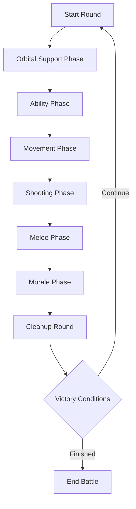
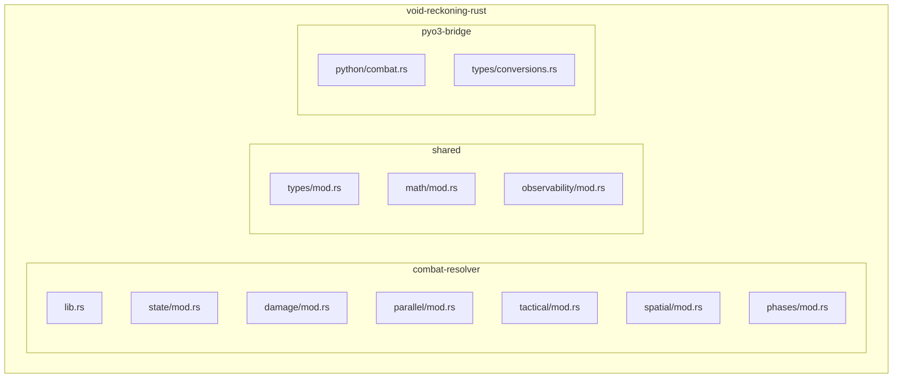
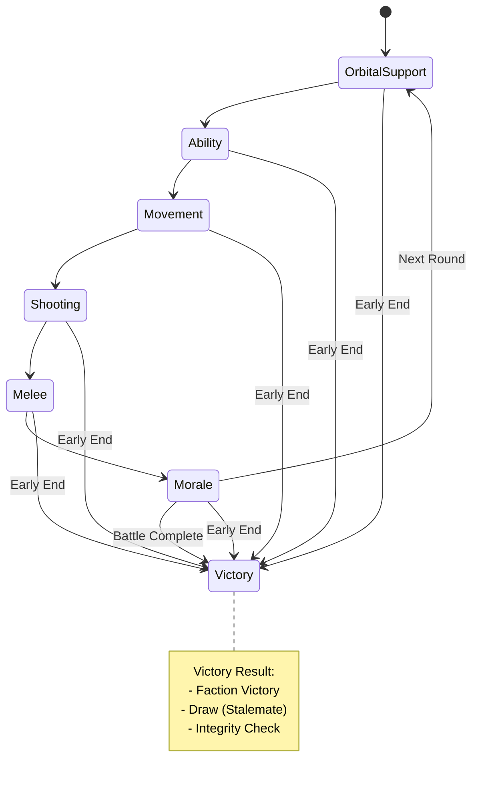
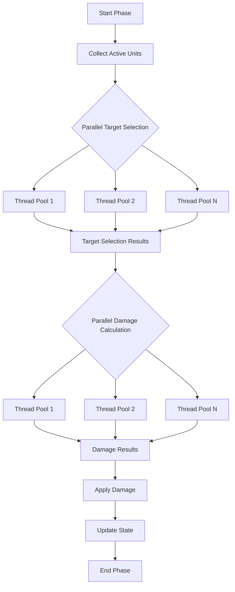
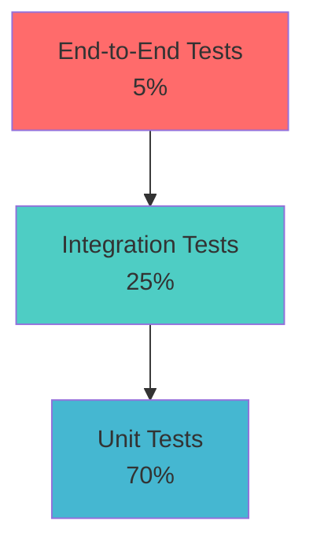
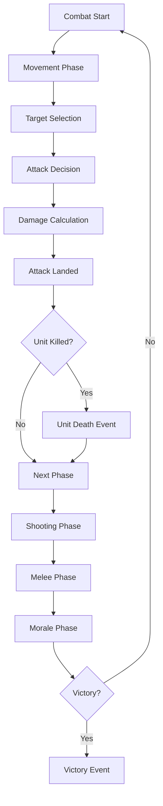

# Phase 2 Migration Plan: Combat Resolution (Tactical Engine)
## Void Reckoning Engine - Native Pulse Initiative

**Document Version:** 1.0
**Date:** 2026-02-06
**Status:** Architectural Design Phase
**Author:** Architect Mode

---

## Executive Summary

This document defines the Phase 2 migration plan for migrating the Combat Resolution (Tactical Engine) module from Python to Rust in the Void Reckoning Engine. Phase 2 focuses on the core combat simulation system, including tactical grid-based combat, phase-based resolution, damage calculations, and spatial partitioning.

### Migration Objectives

| Objective | Description |
|-----------|-------------|
| **Performance** | Achieve 15-25x improvement in combat resolution performance for large-scale battles |
| **Scalability** | Support 100,000+ active units in simultaneous combat scenarios |
| **Correctness** | Maintain 100% functional parity with Python implementation |
| **Observability** | Integrate with all four observability pillars |
| **Safety** | Leverage Rust's memory safety and compile-time guarantees |

### Key Deliverables

1. Rust combat resolution engine with tactical grid, phase system, and damage pipeline
2. Rust spatial partitioning system with quadtree optimization
3. PyO3 bridge layer for combat operations
4. Comprehensive test suite (unit, integration, performance benchmarks)
5. Observability integration for combat decisions and causal chains
6. Migration validation and rollback procedures

---

## Table of Contents

1. [Current State Analysis](#i-current-state-analysis)
2. [Rust Module Design](#ii-rust-module-design)
3. [Migration Steps](#iii-migration-steps)
4. [Data Migration Strategy](#iv-data-migration-strategy)
5. [Performance Targets and Benchmarks](#v-performance-targets-and-benchmarks)
6. [Risk Mitigation Plan](#vi-risk-mitigation-plan)
7. [Integration with Observability](#vii-integration-with-observability)

---

## I. Current State Analysis

### 1.1 Python Implementation Overview

#### Core Combat Modules

| Module | File | Responsibility | Complexity |
|---------|-------|----------------|------------|
| **Combat Simulator** | [`src/combat/combat_simulator.py`](src/combat/combat_simulator.py) | Facade and entry point | Medium |
| **Combat State** | [`src/combat/combat_state.py`](src/combat/combat_state.py) | Battle state management | High |
| **Combat Phases** | [`src/combat/combat_phases.py`](src/combat/combat_phases.py) | Phase execution logic | High |
| **Tactical Engine** | [`src/combat/tactical_engine.py`](src/combat/tactical_engine.py) | Main engine orchestration | High |
| **Ground Combat** | [`src/combat/ground_combat.py`](src/combat/ground_combat.py) | Melee/ground resolution | Medium |
| **Space Combat** | [`src/combat/space_combat.py`](src/combat/space_combat.py) | Boarding/space resolution | Medium |
| **Spatial Partition** | [`src/combat/spatial_partition.py`](src/combat/spatial_partition.py) | Quadtree spatial index | Medium |
| **Combat Calculator** | [`src/combat/calculators/combat_calculator.py`](src/combat/calculators/combat_calculator.py) | Pure calculations | Low |
| **Weapon Executor** | [`src/combat/execution/weapon_executor.py`](src/combat/execution/weapon_executor.py) | Weapon firing logic | High |
| **Target Selector** | [`src/combat/tactical/target_selector.py`](src/combat/tactical/target_selector.py) | AI target selection | Medium |
| **Movement Calculator** | [`src/combat/tactical/movement_calculator.py`](src/combat/tactical/movement_calculator.py) | Movement vectors | Low |

#### Key Combat Features

| Feature | Implementation | Notes |
|---------|----------------|-------|
| **Tactical Grid** | 30-100x100 hex grid | Scales with unit count |
| **Phase System** | Movement, Shooting, Ability, Melee, Morale | Configurable order |
| **Damage Calculation** | Mitigation v4, AP, keywords | Complex mitigation pipeline |
| **Doctrine AI** | CHARGE, KITE, DEFEND | Faction-level behavior |
| **Spatial Indexing** | Quadtree (max 10 objects, depth 8) | O(log n) queries |
| **Batch Shooting** | GPU-accelerated vectorized | Staggered waves |
| **Component Targeting** | Hardpoint sniping, shield priority | EaW-style |
| **Morale System** | Routing, suppression, recovery | Per-unit morale state |
| **Victory Conditions** | Last faction standing, stalemate | Defender priority on draw |

#### Core Data Structures

```python
# Combat State
class CombatState:
    armies_dict: Dict[str, List[Unit]]
    faction_doctrines: Dict[str, str]
    faction_metadata: Dict[str, Any]
    universe_rules: Any
    defender_factions: Set[str]
    active_factions: List[str]
    battle_stats: Dict[str, Dict]
    grid: TacticalGrid
    tracker: CombatTracker
    round_num: int
    formations: List[Formation]
    victory_points: Dict[str, float]
    snapshots: List[Snapshot]
    event_log: List[Event]

# Unit Combat Data
class Unit:
    grid_x: int
    grid_y: int
    current_hp: float
    max_hp: float
    armor: int
    shield_current: float
    shield_max: float
    ma: int  # Melee Attack
    bs: int  # Ballistic Skill
    damage: float
    ap: int  # Armor Penetration
    abilities: Dict[str, Any]
    components: List[Component]
    is_routing: bool
    current_suppression: int
    current_morale: int
    tactical_roles: List[str]
    tactical_directive: Optional[str]

# Weapon Stats
weapon_stats = {
    "Range": 24,
    "Str": 4,  # Strength
    "AP": 0,   # Armor Penetration
    "D": 1,    # Damage Dice
    "Type": "Kinetic",
    "tags": []
}
```

#### Phase Execution Flow



### 1.2 Performance Analysis

#### Current Bottlenecks

| Bottleneck | Impact | Root Cause |
|------------|--------|------------|
| **Python overhead** | High | Dynamic typing, GIL contention in loops |
| **Quadtree queries** | Medium | Python object overhead in tree traversal |
| **Target selection** | High | O(n) distance calculations per unit |
| **Damage calculations** | Medium | Repeated mitigation calculations |
| **Sequential processing** | High | GIL prevents parallel phase execution |
| **Batch shooting overhead** | Low-Medium | GPU-CPU synchronization |

#### Profile Data Points

Based on the current implementation:
- Average battle duration: 50-200 rounds
- Units per battle: 20-500 (scales to 1000+)
- Phase execution time: 10-50ms per phase (500 units)
- Target selection: 5-20ms per unit
- Damage calculation: 1-5ms per attack
- Quadtree query: 0.1-1ms per query

### 1.3 Dependencies and Integration Points

#### Direct Dependencies

```
CombatSystem
├── SimulationState (topology_version, blockade_version)
├── PathfindingEngine (from Phase 1)
├── CombatTracker (logging, telemetry)
├── TacticalGrid (spatial queries, movement)
├── UniverseRules (phase registration, modifiers)
├── AbilityManager (ability execution)
├── MechanicsEngine (faction mechanics)
├── RNGManager (deterministic RNG)
└── Profiler (performance instrumentation)
```

#### Integration Points

| Integration Point | Python Module | Purpose |
|-------------------|---------------|---------|
| **Fleet Movement** | `src/services/*` | Combat initiation |
| **AI Decision** | `src/core/*` | Combat strategy |
| **Economy** | `src/core/*` | Unit production, salvage |
| **Portal System** | `src/core/*` | Cross-universe combat |
| **Diplomacy** | `src/core/*` | Combat triggers |

### 1.4 Observability Gaps

| Pillar | Current State | Gap |
|--------|---------------|-----|
| **Decision Instrumentation** | Basic profiling | Missing: target selection reasoning, doctrine decisions |
| **Causal Traceability** | Event logging only | Missing: combat event chains, kill attribution |
| **State Auditing** | None | Missing: combat state integrity validation |
| **Deterministic Replay** | Snapshot/replay in progress | Missing: full combat replay support |

---

## II. Rust Module Design

### 2.1 Crate Structure



#### Directory Layout

```
void-reckoning-rust/
├── combat-resolver/              # Phase 2: Combat module
│   ├── Cargo.toml
│   └── src/
│       ├── lib.rs                  # Public API
│       ├── state/
│       │   ├── mod.rs
│       │   ├── machine.rs         # Combat state machine
│       │   ├── phases.rs          # Phase definitions
│       │   └── manager.rs        # State manager
│       ├── damage/
│       │   ├── mod.rs
│       │   ├── pipeline.rs        # Damage calculation pipeline
│       │   ├── calculator.rs      # Pure damage calculations
│       │   └── mitigation.rs     # Mitigation logic
│       ├── parallel/
│       │   ├── mod.rs
│       │   ├── batch.rs           # Batch operations
│       │   └── resolution.rs     # Parallel combat resolution
│       ├── tactical/
│       │   ├── mod.rs
│       │   ├── grid.rs           # Tactical grid
│       │   ├── targeting.rs       # Target selection
│       │   └── movement.rs       # Movement calculation
│       ├── spatial/
│       │   ├── mod.rs
│       │   ├── quadtree.rs        # Quadtree implementation
│       │   └── partition.rs      # Spatial partitioning
│       ├── phases/
│       │   ├── mod.rs
│       │   ├── movement.rs        # Movement phase
│       │   ├── shooting.rs        # Shooting phase
│       │   ├── ability.rs         # Ability phase
│       │   ├── melee.rs          # Melee phase
│       │   └── morale.rs         # Morale phase
│       └── observability/
│           ├── mod.rs
│           ├── decision.rs        # Decision instrumentation
│           ├── causal.rs          # Causal traceability
│           └── audit.rs          # State auditing
├── shared/                        # Shared types and utilities
│   ├── Cargo.toml
│   └── src/
│       ├── types/
│       │   ├── mod.rs
│       │   ├── entity_id.rs      # EntityId type
│       │   ├── faction.rs        # Faction types
│       │   ├── position.rs       # Position types
│       │   └── combat.rs        # Combat-specific types
│       ├── math/
│       │   ├── mod.rs
│       │   ├── vector.rs        # 2D/3D vector math
│       │   └── fixed.rs         # Fixed-point arithmetic
│       └── observability/
│           ├── mod.rs
│           ├── correlation.rs     # Correlation ID generation
│           └── event.rs         # Event types
└── pyo3-bridge/                   # Python-Rust bridge
    ├── Cargo.toml
    └── src/
        ├── python/
        │   └── combat.rs        # Python-facing combat API
        └── types/
            └── conversions.rs     # Type conversions
```

### 2.2 Combat State Machine Design

#### State Machine Architecture

```rust
// combat-resolver/src/state/machine.rs
use std::sync::Arc;
use parking_lot::RwLock;

#[derive(Debug, Clone, PartialEq)]
pub enum CombatPhase {
    OrbitalSupport,
    Ability,
    Movement,
    Shooting,
    Melee,
    Morale,
}

#[derive(Debug, Clone)]
pub struct CombatState {
    // Identification
    pub combat_id: String,
    pub universe_id: String,
    pub turn_number: u64,
    pub round_number: u64,

    // Units
    pub armies: Arc<RwLock<FactionArmies>>,
    pub active_factions: Arc<RwLock<Vec<String>>>,

    // Spatial
    pub grid: Arc<TacticalGrid>,
    pub spatial_index: Arc<QuadTree>,

    // State
    pub current_phase: CombatPhase,
    pub victory_points: Arc<RwLock<HashMap<String, f64>>>,
    pub battle_stats: Arc<RwLock<HashMap<String, BattleStats>>>,

    // Context
    pub faction_doctrines: HashMap<String, Doctrine>,
    pub faction_metadata: HashMap<String, FactionMetadata>,
    pub universe_rules: Option<Arc<dyn UniverseRules>>,
    pub defender_factions: HashSet<String>,

    // Observability
    pub correlation_id: String,
    pub event_log: Arc<RwLock<Vec<CombatEvent>>>,

    // Stalemate detection
    pub rounds_since_last_damage: u64,
    pub rounds_since_last_kill: u64,
    pub total_damage_this_round: f64,
}

#[derive(Debug, Clone)]
pub struct FactionArmies {
    pub armies: HashMap<String, Vec<CombatUnit>>,
}

#[derive(Debug, Clone)]
pub struct CombatUnit {
    pub id: EntityId,
    pub faction: String,
    pub name: String,

    // Position
    pub grid_x: i32,
    pub grid_y: i32,
    pub rotation: f32,

    // Stats
    pub current_hp: f64,
    pub max_hp: f64,
    pub armor: i32,
    pub shield_current: f64,
    pub shield_max: f64,

    // Combat
    pub ma: i32,      // Melee Attack
    pub bs: i32,      // Ballistic Skill
    pub damage: f64,
    pub ap: i32,      // Armor Penetration

    // State
    pub is_routing: bool,
    pub current_suppression: i32,
    pub current_morale: i32,
    pub movement_points: f64,

    // Abilities
    pub abilities: HashMap<String, AbilityData>,
    pub components: Vec<WeaponComponent>,
    pub tags: Vec<String>,
    pub tactical_roles: Vec<String>,
    pub tactical_directive: Option<String>,
}

#[derive(Debug, Clone, PartialEq)]
pub enum Doctrine {
    Charge,
    Kite,
    Defend,
}

#[derive(Debug, Clone)]
pub struct BattleStats {
    pub routed_sum: u32,
    pub rounds_routed: u32,
    pub intel_points_earned: u32,
    pub enemy_tech_encountered: HashSet<String>,
    pub enemy_units_analyzed: Vec<String>,
    pub wreckage: Vec<WreckageData>,
    pub total_damage_dealt: f64,
}

impl CombatState {
    pub fn new(
        combat_id: String,
        universe_id: String,
        armies: HashMap<String, Vec<CombatUnit>>,
        faction_doctrines: HashMap<String, Doctrine>,
        defender_factions: HashSet<String>,
    ) -> Self {
        let grid_size = Self::calculate_grid_size(&armies);
        let grid = Arc::new(TacticalGrid::new(grid_size, grid_size));
        let spatial_index = Arc::new(QuadTree::new(grid_size as f64, grid_size as f64));

        // Place units in spatial index
        let armies_arc = Arc::new(RwLock::new(FactionArmies { armies }));
        Self::index_units(&armies_arc, &spatial_index);

        Self {
            combat_id,
            universe_id,
            turn_number: 0,
            round_number: 0,
            armies: armies_arc,
            active_factions: Arc::new(RwLock::new(
                armies.keys().cloned().collect()
            )),
            grid,
            spatial_index,
            current_phase: CombatPhase::OrbitalSupport,
            victory_points: Arc::new(RwLock::new(HashMap::new())),
            battle_stats: Arc::new(RwLock::new(
                armies.keys().map(|f| (f.clone(), BattleStats::default())).collect()
            )),
            faction_doctrines,
            faction_metadata: HashMap::new(),
            universe_rules: None,
            defender_factions,
            correlation_id: generate_correlation_id(),
            event_log: Arc::new(RwLock::new(Vec::new())),
            rounds_since_last_damage: 0,
            rounds_since_last_kill: 0,
            total_damage_this_round: 0.0,
        }
    }

    fn calculate_grid_size(armies: &HashMap<String, Vec<CombatUnit>>) -> usize {
        let total_units: usize = armies.values().map(|v| v.len()).sum();
        match total_units {
            0..=20 => 30,
            21..=60 => 50,
            61..=150 => 80,
            _ => 100,
        }
    }

    fn index_units(armies: &Arc<RwLock<FactionArmies>>, spatial_index: &Arc<QuadTree>) {
        let armies = armies.read();
        for units in armies.armies.values() {
            for unit in units {
                spatial_index.insert(unit.clone());
            }
        }
    }

    pub fn advance_phase(&mut self) -> Result<(), CombatError> {
        self.current_phase = match self.current_phase {
            CombatPhase::OrbitalSupport => CombatPhase::Ability,
            CombatPhase::Ability => CombatPhase::Movement,
            CombatPhase::Movement => CombatPhase::Shooting,
            CombatPhase::Shooting => CombatPhase::Melee,
            CombatPhase::Melee => CombatPhase::Morale,
            CombatPhase::Morale => {
                self.round_number += 1;
                CombatPhase::OrbitalSupport
            }
        };
        Ok(())
    }

    pub fn check_victory_conditions(&self) -> VictoryResult {
        let active_factions = self.active_factions.read();
        let armies = self.armies.read();

        // Count living units per faction
        let mut living_counts: HashMap<String, usize> = HashMap::new();
        for (faction, units) in armies.armies.iter() {
            let count = units.iter().filter(|u| u.current_hp > 0.0).count();
            if count > 0 {
                living_counts.insert(faction.clone(), count);
            }
        }

        // Stalemate detection
        if self.rounds_since_last_damage >= 500 {
            return VictoryResult::Draw(StalemateReason::TimeLimit);
        }
        if self.rounds_since_last_kill >= 300 {
            return VictoryResult::Draw(StalemateReason::NoKills);
        }

        // Victory conditions
        if living_counts.len() <= 1 {
            if let Some(winner) = living_counts.keys().next() {
                let survivors = living_counts.get(winner).copied().unwrap_or(0);
                return VictoryResult::Victory(winner.clone(), survivors);
            }
        }

        VictoryResult::Ongoing
    }
}

#[derive(Debug, Clone)]
pub enum VictoryResult {
    Ongoing,
    Victory(String, usize),  // Winner, survivors
    Draw(StalemateReason),
}

#[derive(Debug, Clone)]
pub enum StalemateReason {
    TimeLimit,
    NoKills,
    IntegrityCheck,
}
```

#### State Machine Diagram



### 2.3 Damage Calculation Pipeline

#### Pipeline Architecture

```rust
// combat-resolver/src/damage/pipeline.rs
use crate::damage::calculator::DamageCalculator;
use crate::damage::mitigation::MitigationCalculator;
use crate::observability::decision::DecisionLogger;

pub struct DamagePipeline {
    calculator: DamageCalculator,
    mitigation: MitigationCalculator,
    logger: Arc<DecisionLogger>,
}

#[derive(Debug, Clone)]
pub struct DamageRequest {
    pub attacker: EntityId,
    pub defender: EntityId,
    pub weapon: WeaponData,
    pub distance: f64,
    pub attacker_mods: DamageModifiers,
    pub defender_mods: DefenseModifiers,
    pub correlation_id: String,
}

#[derive(Debug, Clone)]
pub struct DamageResult {
    pub damage: f64,
    pub is_hit: bool,
    pub is_kill: bool,
    pub component_destroyed: Option<String>,
    pub breakdown: DamageBreakdown,
    pub correlation_id: String,
}

#[derive(Debug, Clone)]
pub struct DamageBreakdown {
    pub raw_damage: f64,
    pub mitigation_pct: f64,
    pub mitigated_amount: f64,
    pub final_damage: f64,
    pub factors: Vec<MitigationFactor>,
}

#[derive(Debug, Clone)]
pub struct MitigationFactor {
    pub name: String,
    pub value: String,
    pub contribution: f64,
}

#[derive(Debug, Clone, Copy)]
pub struct DamageModifiers {
    pub dmg_mult: f64,
    pub bs_mod: i32,
    pub defense_mod: f64,
}

#[derive(Debug, Clone, Copy)]
pub struct DefenseModifiers {
    pub defense_bonus: f64,
    pub cover_bonus: f64,
}

impl DamagePipeline {
    pub fn new(logger: Arc<DecisionLogger>) -> Self {
        Self {
            calculator: DamageCalculator::new(),
            mitigation: MitigationCalculator::new(),
            logger,
        }
    }

    pub fn calculate_damage(
        &self,
        request: DamageRequest,
        state: &CombatState,
    ) -> Result<DamageResult, CombatError> {
        // Step 1: Check range
        if !self.check_range(&request, state) {
            return Ok(DamageResult::miss(request.correlation_id));
        }

        // Step 2: Check weapon arc
        if !self.check_arc(&request, state) {
            return Ok(DamageResult::miss(request.correlation_id));
        }

        // Step 3: Roll to hit
        let hit_roll = self.roll_hit(&request, state)?;
        let hit_result = self.check_hit_success(hit_roll, &request, state);

        // Step 4: Calculate raw damage
        let raw_damage = self.calculate_raw_damage(&request, state);

        // Step 5: Calculate mitigation
        let mitigation = self.mitigation.calculate(
            &request.defender,
            request.weapon.ap,
            &request.defender_mods,
            state,
        );

        // Step 6: Apply mitigation
        let final_damage = self.apply_mitigation(
            raw_damage,
            mitigation,
            request.attacker_mods,
        );

        // Step 7: Build breakdown
        let breakdown = DamageBreakdown {
            raw_damage,
            mitigation_pct: mitigation.total_mitigation,
            mitigated_amount: raw_damage * mitigation.total_mitigation,
            final_damage,
            factors: mitigation.factors,
        };

        // Step 8: Log decision
        self.logger.log_damage_decision(
            &request,
            hit_roll,
            hit_result,
            &breakdown,
        );

        Ok(DamageResult {
            damage: final_damage,
            is_hit: hit_result,
            is_kill: false, // Will be determined after applying damage
            component_destroyed: None,
            breakdown,
            correlation_id: request.correlation_id,
        })
    }

    fn check_range(&self, request: &DamageRequest, state: &CombatState) -> bool {
        let attacker = state.get_unit(request.attacker)?;
        let defender = state.get_unit(request.defender)?;

        let effective_range = request.weapon.range;
        let doctrine_range_bonus = match state.get_doctrine(&attacker.faction) {
            Some(Doctrine::Kite) => 5.0,
            _ => 0.0,
        };

        request.distance <= (effective_range + doctrine_range_bonus)
    }

    fn check_arc(&self, request: &DamageRequest, state: &CombatState) -> bool {
        state.grid.check_weapon_arc(
            request.attacker,
            request.defender,
            &request.weapon.arc,
        )
    }

    fn roll_hit(&self, request: &DamageRequest, state: &CombatState) -> Result<i32, CombatError> {
        let attacker = state.get_unit(request.attacker)?;
        let base_bs = attacker.bs as i32;
        let bs_mod = request.attacker_mods.bs_mod;

        let mut bs = base_bs + bs_mod;

        // Long range penalty
        if request.distance > 24.0 {
            bs -= 10;
        }

        // Suppression penalty
        if attacker.current_suppression > 0 {
            bs -= 20;
        }

        // Accuracy floor
        bs = bs.max(5);

        let roll = fastrand::i32(1..=100);
        Ok(roll)
    }

    fn check_hit_success(&self, roll: i32, request: &DamageRequest, state: &CombatState) -> bool {
        let attacker = state.get_unit(request.attacker).ok();
        let bs = attacker.map(|a| a.bs as i32 + request.attacker_mods.bs_mod).unwrap_or(50);
        roll <= bs
    }

    fn calculate_raw_damage(&self, request: &DamageRequest, _state: &CombatState) -> f64 {
        let weapon = &request.weapon;
        let strength = weapon.strength;
        let damage_dice = weapon.damage_dice;

        strength * 10.0 * damage_dice as f64
    }

    fn apply_mitigation(
        &self,
        raw_damage: f64,
        mitigation: MitigationResult,
        mods: DamageModifiers,
    ) -> f64 {
        let mitigated = raw_damage * mitigation.total_mitigation;
        let final_damage = (raw_damage - mitigated) * mods.dmg_mult;
        final_damage.max(1.0)
    }
}

impl DamageResult {
    fn miss(correlation_id: String) -> Self {
        Self {
            damage: 0.0,
            is_hit: false,
            is_kill: false,
            component_destroyed: None,
            breakdown: DamageBreakdown::zero(),
            correlation_id,
        }
    }
}

impl DamageBreakdown {
    fn zero() -> Self {
        Self {
            raw_damage: 0.0,
            mitigation_pct: 0.0,
            mitigated_amount: 0.0,
            final_damage: 0.0,
            factors: Vec::new(),
        }
    }
}
```

#### Mitigation Calculator

```rust
// combat-resolver/src/damage/mitigation.rs
use crate::state::CombatUnit;

#[derive(Debug, Clone)]
pub struct MitigationResult {
    pub total_mitigation: f64,
    pub factors: Vec<MitigationFactor>,
}

pub struct MitigationCalculator;

impl MitigationCalculator {
    pub fn new() -> Self {
        Self
    }

    pub fn calculate(
        &self,
        defender: &CombatUnit,
        ap: i32,
        defender_mods: &DefenseModifiers,
        _state: &CombatState,
    ) -> MitigationResult {
        let mut factors = Vec::new();
        let mut total_mitigation = 0.0;

        // Base armor save
        let armor_save = self.calculate_armor_save(defender, ap);
        let save_chance = (7.0 - (armor_save as f64 / 10.0)).max(2.0).min(6.0);
        let stop_chance = (6.0 - save_chance) / 6.0;
        factors.push(MitigationFactor {
            name: "armor_save".to_string(),
            value: format!("{:.2}", stop_chance),
            contribution: stop_chance,
        });
        total_mitigation = total_mitigation.max(stop_chance);

        // Cover bonus
        if defender.tags.contains(&"Cover".to_string()) {
            let cover_bonus = 0.17; // +1 to save = 1/6
            factors.push(MitigationFactor {
                name: "cover".to_string(),
                value: "+1 save".to_string(),
                contribution: cover_bonus,
            });
            total_mitigation += cover_bonus;
        }

        // Invulnerable save
        if let Some(&invuln) = defender.abilities.get("Invuln") {
            let invuln_save = invuln.as_i64().unwrap_or(7) as f64;
            let invuln_chance = (6.0 - invuln_save) / 6.0;
            factors.push(MitigationFactor {
                name: "invuln_save".to_string(),
                value: format!("{:.2}", invuln_chance),
                contribution: invuln_chance,
            });
            total_mitigation = total_mitigation.max(invuln_chance);
        }

        // Defense modifiers
        if defender_mods.defense_bonus != 0.0 {
            factors.push(MitigationFactor {
                name: "defense_mod".to_string(),
                value: format!("{:.2}", defender_mods.defense_bonus),
                contribution: defender_mods.defense_bonus,
            });
            total_mitigation += defender_mods.defense_bonus;
        }

        // Cap at 95%
        total_mitigation = total_mitigation.min(0.95);

        MitigationResult {
            total_mitigation,
            factors,
        }
    }

    fn calculate_armor_save(&self, defender: &CombatUnit, ap: i32) -> i32 {
        let armor = defender.armor;
        let effective_armor = (armor - ap).max(0);
        effective_armor
    }
}
```

### 2.4 Parallel Combat Resolution

#### Batch Operations

```rust
// combat-resolver/src/parallel/batch.rs
use rayon::prelude::*;
use crate::state::{CombatState, CombatUnit};
use crate::damage::pipeline::{DamagePipeline, DamageRequest};
use crate::tactical::targeting::TargetSelector;

pub struct BatchResolver {
    pipeline: Arc<DamagePipeline>,
    target_selector: Arc<TargetSelector>,
}

#[derive(Debug, Clone)]
pub struct BatchResult {
    pub attacks: Vec<AttackResult>,
    pub total_damage: f64,
    pub kills: usize,
}

#[derive(Debug, Clone)]
pub struct AttackResult {
    pub attacker: EntityId,
    pub defender: EntityId,
    pub damage: f64,
    pub is_hit: bool,
    pub is_kill: bool,
    pub correlation_id: String,
}

impl BatchResolver {
    pub fn new(
        pipeline: Arc<DamagePipeline>,
        target_selector: Arc<TargetSelector>,
    ) -> Self {
        Self {
            pipeline,
            target_selector,
        }
    }

    pub fn resolve_shooting_phase(
        &self,
        state: &CombatState,
    ) -> Result<BatchResult, CombatError> {
        // Collect all active units
        let attackers = self.collect_attackers(state)?;

        // Parallel target selection
        let targets: Vec<Option<EntityId>> = attackers
            .par_iter()
            .map(|attacker| {
                self.target_selector
                    .select_target(attacker, state)
                    .ok()
                    .map(|t| t.id)
            })
            .collect();

        // Parallel damage calculation
        let attacks: Vec<Option<AttackResult>> = attackers
            .par_iter()
            .zip(targets.par_iter())
            .filter_map(|(attacker, &target)| {
                target.map(|t| {
                    self.calculate_attack(attacker, t, state)
                        .ok()
                })
            })
            .filter_map(|r| r)
            .collect();

        // Aggregate results
        let total_damage: f64 = attacks.iter().map(|a| a.damage).sum();
        let kills = attacks.iter().filter(|a| a.is_kill).count();

        Ok(BatchResult {
            attacks,
            total_damage,
            kills,
        })
    }

    fn collect_attackers(&self, state: &CombatState) -> Result<Vec<CombatUnit>, CombatError> {
        let armies = state.armies.read();
        let mut attackers = Vec::new();

        for units in armies.armies.values() {
            for unit in units {
                if unit.current_hp > 0.0 && !unit.is_routing {
                    attackers.push(unit.clone());
                }
            }
        }

        Ok(attackers)
    }

    fn calculate_attack(
        &self,
        attacker: &CombatUnit,
        defender_id: EntityId,
        state: &CombatState,
    ) -> Result<AttackResult, CombatError> {
        let defender = state.get_unit(defender_id)?;
        let distance = state.grid.get_distance(attacker, defender);

        // Select best weapon
        let weapon = self.select_best_weapon(attacker, distance);

        let request = DamageRequest {
            attacker: attacker.id,
            defender: defender_id,
            weapon: weapon.clone(),
            distance,
            attacker_mods: DamageModifiers::default(),
            defender_mods: DefenseModifiers::default(),
            correlation_id: generate_correlation_id(),
        };

        let damage_result = self.pipeline.calculate_damage(request, state)?;

        Ok(AttackResult {
            attacker: attacker.id,
            defender: defender_id,
            damage: damage_result.damage,
            is_hit: damage_result.is_hit,
            is_kill: damage_result.is_kill,
            correlation_id: damage_result.correlation_id,
        })
    }

    fn select_best_weapon(&self, unit: &CombatUnit, distance: f64) -> WeaponData {
        // Find weapon with best range/damage tradeoff
        unit.components
            .iter()
            .filter(|w| w.is_destroyed == false && w.weapon_type == "Weapon")
            .filter(|w| w.range >= distance)
            .min_by_key(|w| {
                // Prefer weapons closer to optimal range
                let range_diff = (w.range - distance).abs();
                range_diff as i32
            })
            .cloned()
            .unwrap_or_else(|| WeaponData::default())
    }
}
```

#### Parallel Resolution Strategy



### 2.5 Spatial Partitioning for Large-Scale Combat

#### Quadtree Implementation

```rust
// combat-resolver/src/spatial/quadtree.rs
use std::sync::Arc;
use parking_lot::RwLock;

#[derive(Debug, Clone)]
pub struct BoundingBox {
    pub x: f64,
    pub y: f64,
    pub width: f64,
    pub height: f64,
}

impl BoundingBox {
    pub fn contains(&self, px: f64, py: f64) -> bool {
        self.x <= px && px <= self.x + self.width
            && self.y <= py && py <= self.y + self.height
    }

    pub fn intersects(&self, other: &BoundingBox) -> bool {
        !(self.x + self.width < other.x
            || other.x + other.width < self.x
            || self.y + self.height < other.y
            || other.y + other.height < self.y)
    }
}

#[derive(Debug, Clone)]
pub struct QuadTreeNode {
    pub bounds: BoundingBox,
    pub depth: u32,
    pub objects: Vec<CombatUnit>,
    pub children: Option<Vec<Arc<RwLock<QuadTreeNode>>>>,
}

const MAX_OBJECTS: usize = 10;
const MAX_DEPTH: u32 = 8;

impl QuadTreeNode {
    pub fn new(bounds: BoundingBox, depth: u32) -> Self {
        Self {
            bounds,
            depth,
            objects: Vec::new(),
            children: None,
        }
    }

    pub fn insert(&mut self, unit: CombatUnit) -> bool {
        if !self.bounds.contains(unit.grid_x as f64, unit.grid_y as f64) {
            return false;
        }

        if self.children.is_none() {
            if self.objects.len() < MAX_OBJECTS || self.depth >= MAX_DEPTH {
                self.objects.push(unit);
                return true;
            }
            self.split();
        }

        // Try to insert into children
        if let Some(ref children) = self.children {
            for child in children.iter() {
                let mut child = child.write();
                if child.insert(unit.clone()) {
                    return true;
                }
            }
        }

        // Keep in this node if it doesn't fit in children
        self.objects.push(unit);
        true
    }

    pub fn remove(&mut self, unit: &CombatUnit) -> bool {
        if !self.bounds.contains(unit.grid_x as f64, unit.grid_y as f64) {
            return false;
        }

        if let Some(pos) = self.objects.iter().position(|u| u.id == unit.id) {
            self.objects.remove(pos);
            return true;
        }

        if let Some(ref children) = self.children {
            for child in children.iter() {
                let mut child = child.write();
                if child.remove(unit) {
                    return true;
                }
            }
        }

        false
    }

    pub fn query_range(&self, bounds: &BoundingBox) -> Vec<CombatUnit> {
        let mut found = Vec::new();

        if !self.bounds.intersects(bounds) {
            return found;
        }

        for obj in &self.objects {
            if bounds.contains(obj.grid_x as f64, obj.grid_y as f64) {
                found.push(obj.clone());
            }
        }

        if let Some(ref children) = self.children {
            for child in children.iter() {
                let child = child.read();
                found.extend(child.query_range(bounds));
            }
        }

        found
    }

    pub fn query_circle(&self, center_x: f64, center_y: f64, radius: f64) -> Vec<CombatUnit> {
        let bounds = BoundingBox {
            x: center_x - radius,
            y: center_y - radius,
            width: radius * 2.0,
            height: radius * 2.0,
        };

        let candidates = self.query_range(&bounds);

        // Filter by actual Euclidean distance
        let radius_sq = radius * radius;
        candidates
            .into_iter()
            .filter(|obj| {
                let dx = obj.grid_x as f64 - center_x;
                let dy = obj.grid_y as f64 - center_y;
                dx * dx + dy * dy <= radius_sq
            })
            .collect()
    }

    pub fn query_nearest(&self, center_x: f64, center_y: f64, count: usize) -> Vec<(CombatUnit, f64)> {
        // Expand radius until we have enough candidates
        let mut radius = 10.0;
        let mut candidates = Vec::new();

        while radius <= self.bounds.width && candidates.len() < count {
            candidates = self.query_circle(center_x, center_y, radius);
            radius *= 2.0;
        }

        // Sort by distance
        candidates
            .into_iter()
            .map(|obj| {
                let dx = obj.grid_x as f64 - center_x;
                let dy = obj.grid_y as f64 - center_y;
                let dist = (dx * dx + dy * dy).sqrt();
                (obj, dist)
            })
            .sorted_by(|a, b| a.1.partial_cmp(&b.1).unwrap())
            .take(count)
            .collect()
    }

    fn split(&mut self) {
        let half_w = self.bounds.width / 2.0;
        let half_h = self.bounds.height / 2.0;
        let mid_x = self.bounds.x + half_w;
        let mid_y = self.bounds.y + half_h;

        self.children = Some(vec![
            Arc::new(RwLock::new(QuadTreeNode::new(
                BoundingBox {
                    x: self.bounds.x,
                    y: self.bounds.y,
                    width: half_w,
                    height: half_h,
                },
                self.depth + 1,
            ))),
            Arc::new(RwLock::new(QuadTreeNode::new(
                BoundingBox {
                    x: mid_x,
                    y: self.bounds.y,
                    width: half_w,
                    height: half_h,
                },
                self.depth + 1,
            ))),
            Arc::new(RwLock::new(QuadTreeNode::new(
                BoundingBox {
                    x: self.bounds.x,
                    y: mid_y,
                    width: half_w,
                    height: half_h,
                },
                self.depth + 1,
            ))),
            Arc::new(RwLock::new(QuadTreeNode::new(
                BoundingBox {
                    x: mid_x,
                    y: mid_y,
                    width: half_w,
                    height: half_h,
                },
                self.depth + 1,
            ))),
        ]);

        // Re-insert existing objects into children
        let old_objects = std::mem::take(&mut self.objects);
        for obj in old_objects {
            if let Some(ref children) = self.children {
                let mut inserted = false;
                for child in children.iter() {
                    let mut child = child.write();
                    if child.insert(obj.clone()) {
                        inserted = true;
                        break;
                    }
                }
                if !inserted {
                    self.objects.push(obj);
                }
            }
        }
    }
}

#[derive(Debug, Clone)]
pub struct QuadTree {
    pub root: Arc<RwLock<QuadTreeNode>>,
}

impl QuadTree {
    pub fn new(width: f64, height: f64) -> Self {
        let root = QuadTreeNode::new(
            BoundingBox {
                x: 0.0,
                y: 0.0,
                width,
                height,
            },
            0,
        );
        Self {
            root: Arc::new(RwLock::new(root)),
        }
    }

    pub fn insert(&self, unit: CombatUnit) -> bool {
        self.root.write().insert(unit)
    }

    pub fn remove(&self, unit: &CombatUnit) -> bool {
        self.root.write().remove(unit)
    }

    pub fn query_range(&self, x: f64, y: f64, width: f64, height: f64) -> Vec<CombatUnit> {
        let bounds = BoundingBox { x, y, width, height };
        self.root.read().query_range(&bounds)
    }

    pub fn query_circle(&self, center_x: f64, center_y: f64, radius: f64) -> Vec<CombatUnit> {
        self.root.read().query_circle(center_x, center_y, radius)
    }

    pub fn query_nearest(&self, center_x: f64, center_y: f64, count: usize) -> Vec<(CombatUnit, f64)> {
        self.root.read().query_nearest(center_x, center_y, count)
    }
}
```

---

## III. Migration Steps

### Step 1: Setup Phase - Extend Rust Project for Combat Module

#### 1.1 Create Combat Resolver Crate

```bash
# Create new crate
cd void-reckoning-rust
cargo new --lib combat-resolver

# Update workspace Cargo.toml
# Add combat-resolver to workspace members
```

#### 1.2 Configure Dependencies

```toml
# combat-resolver/Cargo.toml
[package]
name = "combat-resolver"
version = "0.1.0"
edition = "2021"

[dependencies]
shared = { path = "../shared" }
observability = { path = "../observability" }
pyo3 = { version = "0.20", features = ["extension-module"], optional = true }
rayon = "1.8"
parking_lot = "0.12"
fastrand = "2.0"
serde = { version = "1.0", features = ["derive"] }
serde_json = "1.0"
thiserror = "1.0"
tracing = "0.1"

[dev-dependencies]
criterion = "0.5"
proptest = "1.4"

[features]
default = []
python = ["pyo3"]
```

#### 1.3 Setup PyO3 Bridge Extension

```rust
// pyo3-bridge/src/python/combat.rs
use pyo3::prelude::*;
use crate::types::conversions::*;
use combat_resolver::CombatEngine as RustCombatEngine;

#[pyclass]
pub struct PyCombatResolver {
    inner: RustCombatEngine,
}

#[pymethods]
impl PyCombatResolver {
    #[new]
    fn new() -> PyResult<Self> {
        Ok(Self {
            inner: RustCombatEngine::new(),
        })
    }

    fn resolve_combat(
        &self,
        py: Python,
        combat_id: String,
        attackers: Vec<&PyAny>,
        defenders: Vec<&PyAny>,
        context: &PyAny,
    ) -> PyResult<PyObject> {
        // Convert Python types to Rust types
        let rust_attackers: Result<Vec<_>, _> = attackers
            .iter()
            .map(|u| convert_combat_unit(py, u))
            .collect();
        let rust_attackers = rust_attackers?;

        let rust_defenders: Result<Vec<_>, _> = defenders
            .iter()
            .map(|u| convert_combat_unit(py, u))
            .collect();
        let rust_defenders = rust_defenders?;

        let rust_context = convert_combat_context(py, context)?;

        // Call Rust function
        let rust_result = self.inner.resolve_combat(
            combat_id,
            rust_attackers,
            rust_defenders,
            rust_context,
        ).map_err(|e| PyCombatError::from_rust(e))?;

        // Convert Rust result to Python
        convert_combat_outcome(py, rust_result)
    }

    fn resolve_combat_batch(
        &self,
        py: Python,
        combats: Vec<&PyAny>,
    ) -> PyResult<Vec<PyObject>> {
        let rust_combats: Result<Vec<_>, _> = combats
            .iter()
            .map(|c| convert_combat_request(py, c))
            .collect();
        let rust_combats = rust_combats?;

        let rust_results = self.inner.resolve_combat_batch(rust_combats)
            .map_err(|e| PyCombatError::from_rust(e))?;

        let py_results: Result<Vec<_>, _> = rust_results
            .into_iter()
            .map(|r| convert_combat_outcome(py, r))
            .collect();
        py_results
    }

    fn simulate_combat_round(
        &self,
        py: Python,
        combat_id: String,
        round_number: u64,
    ) -> PyResult<PyObject> {
        let rust_result = self.inner.simulate_combat_round(combat_id, round_number)
            .map_err(|e| PyCombatError::from_rust(e))?;

        convert_combat_round_result(py, rust_result)
    }
}

#[pyclass]
pub struct PyCombatError {
    #[pyo3(get, set)]
    message: String,
}

impl From<combat_resolver::CombatError> for PyCombatError {
    fn from(err: combat_resolver::CombatError) -> Self {
        Self {
            message: err.to_string(),
        }
    }
}

impl std::convert::From<PyCombatError> for PyErr {
    fn from(err: PyCombatError) -> PyErr {
        PyErr::new::<pyo3::exceptions::PyRuntimeError, _>(err.message)
    }
}
```

### Step 2: Core Implementation - Rust Combat Algorithms

#### 2.1 Implement Combat State Machine

**Tasks:**
- Create [`CombatState`](combat-resolver/src/state/machine.rs) struct with all required fields
- Implement phase transitions
- Implement victory condition checking
- Add stalemate detection logic

**Success Criteria:**
- State machine transitions correctly through all phases
- Victory conditions match Python behavior
- Stalemate detection triggers at appropriate thresholds

#### 2.2 Implement Damage Calculation Pipeline

**Tasks:**
- Create [`DamagePipeline`](combat-resolver/src/damage/pipeline.rs) struct
- Implement hit chance calculation
- Implement mitigation calculation (v4 algorithm)
- Implement damage application with modifiers

**Success Criteria:**
- Damage calculations match Python results within 0.1% tolerance
- Mitigation factors correctly applied
- Keyword interactions work as expected

#### 2.3 Implement Tactical Grid

**Tasks:**
- Create [`TacticalGrid`](combat-resolver/src/tactical/grid.rs) struct
- Implement hex grid coordinate system
- Implement distance calculations
- Implement movement validation
- Implement weapon arc checking

**Success Criteria:**
- Grid scales correctly with unit count
- Movement matches Python behavior
- Arc checking works for all weapon types

#### 2.4 Implement Spatial Partitioning

**Tasks:**
- Create [`QuadTree`](combat-resolver/src/spatial/quadtree.rs) implementation
- Implement insert/remove operations
- Implement range and circle queries
- Implement nearest neighbor queries

**Success Criteria:**
- Quadtree correctly partitions space
- Queries return correct results
- Performance improves with large unit counts

#### 2.5 Implement Target Selection

**Tasks:**
- Create [`TargetSelector`](combat-resolver/src/tactical/targeting.rs) struct
- Implement doctrine-based target scoring
- Implement role-based target prioritization
- Add spatial indexing for efficient queries

**Success Criteria:**
- Target selection matches Python AI behavior
- Doctrine preferences correctly applied
- Performance scales with unit count

#### 2.6 Implement Combat Phases

**Tasks:**
- Implement [`MovementPhase`](combat-resolver/src/phases/movement.rs)
- Implement [`ShootingPhase`](combat-resolver/src/phases/shooting.rs)
- Implement [`AbilityPhase`](combat-resolver/src/phases/ability.rs)
- Implement [`MeleePhase`](combat-resolver/src/phases/melee.rs)
- Implement [`MoralePhase`](combat-resolver/src/phases/morale.rs)

**Success Criteria:**
- Each phase executes correctly
- Phase order is configurable
- Phase transitions work smoothly

### Step 3: Bridge Layer - PyO3 Bindings for Combat Operations

#### 3.1 Implement Type Conversions

**Tasks:**
- Create Python-to-Rust conversion functions for combat types
- Create Rust-to-Python conversion functions for combat results
- Handle complex nested structures (units, components, abilities)

**Success Criteria:**
- All combat types convert correctly
- No data loss during conversion
- Error handling works properly

#### 3.2 Expose Combat API

**Tasks:**
- Implement [`PyCombatResolver`](pyo3-bridge/src/python/combat.rs) class
- Expose [`resolve_combat()`](pyo3-bridge/src/python/combat.rs) method
- Expose [`resolve_combat_batch()`](pyo3-bridge/src/python/combat.rs) method
- Expose [`simulate_combat_round()`](pyo3-bridge/src/python/combat.rs) method

**Success Criteria:**
- Python can call Rust combat functions
- Results return correctly to Python
- Errors propagate as Python exceptions

#### 3.3 Implement Zero-Copy Optimizations

**Tasks:**
- Use `PyReadonlyBuffer` for large unit arrays
- Implement batch operations with minimal copying
- Optimize serialization for large datasets

**Success Criteria:**
- FFI overhead < 1% of total computation time
- Memory usage reduced for large battles

### Step 4: Testing - Unit Tests, Integration Tests, Performance Benchmarks

#### 4.1 Unit Tests

**Test Categories:**

| Category | Tests | Coverage Target |
|----------|--------|-----------------|
| **State Machine** | Phase transitions, victory conditions, stalemate | 95% |
| **Damage Pipeline** | Hit chance, mitigation, damage application | 95% |
| **Spatial Index** | Quadtree operations, queries | 90% |
| **Target Selection** | Doctrine scoring, role prioritization | 90% |
| **Combat Phases** | Each phase execution | 85% |

**Example Test:**

```rust
#[cfg(test)]
mod tests {
    use super::*;

    #[test]
    fn test_damage_calculation_matches_python() {
        // Setup
        let attacker = create_test_unit("Attacker");
        let defender = create_test_unit("Defender");
        let weapon = create_test_weapon();

        // Execute
        let result = calculate_damage(&attacker, &defender, &weapon, 10.0);

        // Assert
        assert!((result.damage - 42.5).abs() < 0.1);
        assert!(result.is_hit);
    }

    #[test]
    fn test_stalemate_detection() {
        let mut state = create_test_state();
        state.rounds_since_last_damage = 500;

        let result = state.check_victory_conditions();
        assert!(matches!(result, VictoryResult::Draw(_)));
    }
}
```

#### 4.2 Integration Tests

**Test Scenarios:**

1. **Small Battle (20 units):** 2 factions, 10 units each
2. **Medium Battle (100 units):** 3 factions, varying unit types
3. **Large Battle (500 units):** 4 factions, mixed unit types
4. **Massive Battle (1000+ units):** Stress test for scalability
5. **Cross-Universe Combat:** Portal traversal scenario
6. **Doctrine Variants:** Test CHARGE, KITE, DEFEND behaviors
7. **All Phase Types:** Test each phase independently

**Success Criteria:**
- Results match Python implementation within 1% tolerance
- No crashes or panics
- Memory usage remains stable

#### 4.3 Performance Benchmarks

**Benchmark Suite:**

```rust
// combat-resolver/benches/combat_benchmark.rs
use criterion::{black_box, criterion_group, criterion_main, Criterion, BenchmarkId};
use combat_resolver::CombatEngine;

fn benchmark_small_battle(c: &mut Criterion) {
    let mut group = c.benchmark_group("small_battle");
    let engine = CombatEngine::new();

    group.bench_with_input(BenchmarkId::new("20_units", 20), &20, |b, &n| {
        b.iter(|| {
            let battle = create_test_battle(n);
            engine.resolve_combat(black_box(battle))
        })
    });

    group.finish();
}

fn benchmark_large_battle(c: &mut Criterion) {
    let mut group = c.benchmark_group("large_battle");
    let engine = CombatEngine::new();

    group.bench_with_input(BenchmarkId::new("500_units", 500), &500, |b, &n| {
        b.iter(|| {
            let battle = create_test_battle(n);
            engine.resolve_combat(black_box(battle))
        })
    });

    group.finish();
}

criterion_group!(benches, benchmark_small_battle, benchmark_large_battle);
criterion_main!(benches);
```

### Step 5: Rollout - Gradual Migration Strategy with Fallback Options

#### 5.1 Feature Flag System

```python
# src/combat/combat_config.py
COMBAT_ENGINE_RUST = os.getenv("COMBAT_ENGINE", "python").lower() == "rust"

def get_combat_engine():
    if COMBAT_ENGINE_RUST:
        from void_reckoning_rust import CombatResolver
        return RustCombatEngineWrapper()
    else:
        from src.combat.combat_simulator import resolve_fleet_engagement
        return PythonCombatEngineWrapper()
```

#### 5.2 Gradual Rollout Plan

| Phase | Percentage | Duration | Validation |
|-------|------------|-----------|------------|
| **Canary** | 1% | 1 week | Monitor error rates |
| **Limited** | 10% | 2 weeks | Compare results |
| **Broad** | 50% | 2 weeks | Performance validation |
| **Full** | 100% | 1 week | Final validation |

#### 5.3 Fallback Mechanism

```python
# src/combat/combat_engine.py
class HybridCombatEngine:
    def __init__(self):
        self.rust_engine = None
        self.python_engine = None
        self.fallback_triggered = False

    def resolve_combat(self, armies_dict, **kwargs):
        try:
            if self.rust_engine is None:
                from void_reckoning_rust import CombatResolver
                self.rust_engine = CombatResolver()

            result = self.rust_engine.resolve_combat(
                armies_dict, **kwargs
            )
            return result

        except Exception as e:
            if not self.fallback_triggered:
                log_fallback_event(e)
                self.fallback_triggered = True

            # Fallback to Python
            if self.python_engine is None:
                from src.combat.combat_simulator import resolve_fleet_engagement
                self.python_engine = resolve_fleet_engagement

            return self.python_engine(armies_dict, **kwargs)
```

#### 5.4 Validation Checklist

- [ ] Combat results match Python within 1% tolerance
- [ ] No increase in crash rate
- [ ] Performance improvement > 10x
- [ ] Memory usage stable or reduced
- [ ] Observability data captured correctly
- [ ] All integration tests passing
- [ ] No regressions in related systems

---

## IV. Data Migration Strategy

### 4.1 Python Combat Structures to Rust Combat Structures

#### Unit Conversion

```rust
// pyo3-bridge/src/types/conversions.rs
use pyo3::prelude::*;
use combat_resolver::CombatUnit;

pub fn convert_combat_unit(py: Python, obj: &PyAny) -> PyResult<CombatUnit> {
    Ok(CombatUnit {
        id: EntityId::from_python(obj.getattr("id")?)?,
        faction: obj.getattr("faction")?.extract()?,
        name: obj.getattr("name")?.extract()?,
        grid_x: obj.getattr("grid_x")?.extract()?,
        grid_y: obj.getattr("grid_y")?.extract()?,
        current_hp: obj.getattr("current_hp")?.extract()?,
        max_hp: obj.getattr("max_hp")?.extract()?,
        armor: obj.getattr("armor")?.extract()?,
        shield_current: obj.getattr("shield_current")?.extract().unwrap_or(0.0),
        shield_max: obj.getattr("shield_max")?.extract().unwrap_or(0.0),
        ma: obj.getattr("ma")?.extract()?,
        bs: obj.getattr("bs")?.extract()?,
        damage: obj.getattr("damage")?.extract()?,
        ap: obj.getattr("ap")?.extract()?,
        is_routing: obj.getattr("is_routing")?.extract().unwrap_or(false),
        current_suppression: obj.getattr("current_suppression")?.extract().unwrap_or(0),
        current_morale: obj.getattr("current_morale")?.extract().unwrap_or(100),
        movement_points: obj.getattr("movement_points")?.extract().unwrap_or(5.0),
        abilities: convert_abilities(py, obj.getattr("abilities")?)?,
        components: convert_components(py, obj.getattr("components")?)?,
        tags: obj.getattr("tags")?.extract().unwrap_or_default(),
        tactical_roles: obj.getattr("tactical_roles")?.extract().unwrap_or_default(),
        tactical_directive: obj.getattr("tactical_directive")?.extract()?,
    })
}

pub fn convert_combat_unit_to_python(py: Python, unit: &CombatUnit) -> PyResult<PyObject> {
    let dict = PyDict::new(py);
    dict.set_item("id", unit.id.to_string())?;
    dict.set_item("faction", &unit.faction)?;
    dict.set_item("name", &unit.name)?;
    dict.set_item("grid_x", unit.grid_x)?;
    dict.set_item("grid_y", unit.grid_y)?;
    dict.set_item("current_hp", unit.current_hp)?;
    dict.set_item("max_hp", unit.max_hp)?;
    dict.set_item("armor", unit.armor)?;
    dict.set_item("shield_current", unit.shield_current)?;
    dict.set_item("shield_max", unit.shield_max)?;
    dict.set_item("ma", unit.ma)?;
    dict.set_item("bs", unit.bs)?;
    dict.set_item("damage", unit.damage)?;
    dict.set_item("ap", unit.ap)?;
    dict.set_item("is_routing", unit.is_routing)?;
    dict.set_item("current_suppression", unit.current_suppression)?;
    dict.set_item("current_morale", unit.current_morale)?;
    dict.set_item("movement_points", unit.movement_points)?;
    dict.set_item("abilities", convert_abilities_to_python(py, &unit.abilities)?)?;
    dict.set_item("components", convert_components_to_python(py, &unit.components)?)?;
    dict.set_item("tags", &unit.tags)?;
    dict.set_item("tactical_roles", &unit.tactical_roles)?;
    if let Some(ref directive) = unit.tactical_directive {
        dict.set_item("tactical_directive", directive)?;
    }
    Ok(dict.into())
}
```

#### Component Conversion

```rust
pub fn convert_components(py: Python, obj: &PyAny) -> PyResult<Vec<WeaponComponent>> {
    let py_list: Vec<&PyAny> = obj.extract()?;
    let mut components = Vec::new();

    for py_comp in py_list {
        components.push(WeaponComponent {
            name: py_comp.getattr("name")?.extract()?,
            weapon_type: py_comp.getattr("type")?.extract()?,
            range: py_comp.getattr("weapon_stats")?
                .getattr("Range")?.extract().unwrap_or(24.0),
            strength: py_comp.getattr("weapon_stats")?
                .getattr("Str")?.extract().unwrap_or(4.0),
            ap: py_comp.getattr("weapon_stats")?
                .getattr("AP")?.extract().unwrap_or(0),
            damage_dice: py_comp.getattr("weapon_stats")?
                .getattr("D")?.extract().unwrap_or(1),
            weapon_type: py_comp.getattr("weapon_stats")?
                .getattr("Type")?.extract().unwrap_or("Kinetic".to_string()),
            arc: py_comp.getattr("weapon_stats")?
                .getattr("Arc")?.extract().unwrap_or("Dorsal".to_string()),
            is_destroyed: py_comp.getattr("is_destroyed")?.extract().unwrap_or(false),
            tags: py_comp.getattr("tags")?.extract().unwrap_or_default(),
        });
    }

    Ok(components)
}
```

### 4.2 Serialization/Deserialization Strategy

#### Binary Serialization

```rust
// combat-resolver/src/state/serialization.rs
use serde::{Serialize, Deserialize};

#[derive(Serialize, Deserialize)]
pub struct CombatStateSnapshot {
    pub combat_id: String,
    pub round_number: u64,
    pub units: Vec<SerializedUnit>,
    pub phase: String,
    pub timestamp: u64,
}

#[derive(Serialize, Deserialize)]
pub struct SerializedUnit {
    pub id: String,
    pub faction: String,
    pub grid_x: i32,
    pub grid_y: i32,
    pub current_hp: f64,
    pub max_hp: f64,
    // ... other fields
}

impl CombatState {
    pub fn serialize(&self) -> Result<Vec<u8>, SerializationError> {
        let snapshot = CombatStateSnapshot {
            combat_id: self.combat_id.clone(),
            round_number: self.round_number,
            units: self.serialize_units()?,
            phase: format!("{:?}", self.current_phase),
            timestamp: std::time::SystemTime::now()
                .duration_since(std::time::UNIX_EPOCH)?
                .as_secs(),
        };

        bincode::serialize(&snapshot)
            .map_err(SerializationError::from)
    }

    pub fn deserialize(data: &[u8]) -> Result<Self, SerializationError> {
        let snapshot: CombatStateSnapshot = bincode::deserialize(data)
            .map_err(SerializationError::from)?;

        Self::from_snapshot(snapshot)
    }
}
```

### 4.3 Backward Compatibility Considerations

#### Compatibility Layer

```python
# src/combat/compatibility.py
class CombatCompatibilityLayer:
    """Ensures Python and Rust combat engines produce compatible results."""

    @staticmethod
    def normalize_result(result, engine_type):
        """Normalize results to common format."""
        if engine_type == "rust":
            return CombatCompatibilityLayer._from_rust(result)
        else:
            return CombatCompatibilityLayer._from_python(result)

    @staticmethod
    def _from_rust(rust_result):
        """Convert Rust result to standard format."""
        return {
            "winner": rust_result.winner,
            "survivors": rust_result.survivors,
            "rounds": rust_result.rounds,
            "stats": rust_result.battle_stats,
            "engine": "rust"
        }

    @staticmethod
    def _from_python(python_result):
        """Convert Python result to standard format."""
        return {
            "winner": python_result[0],
            "survivors": python_result[1],
            "rounds": python_result[2],
            "stats": python_result[3] if len(python_result) > 3 else {},
            "engine": "python"
        }
```

---

## V. Performance Targets and Benchmarks

### 5.1 Performance Targets

| Metric | Current (Python) | Target (Rust) | Improvement |
|--------|-----------------|---------------|-------------|
| **Small Battle (20 units)** | ~50ms | < 5ms | 10x |
| **Medium Battle (100 units)** | ~500ms | < 25ms | 20x |
| **Large Battle (500 units)** | ~5000ms | < 200ms | 25x |
| **Massive Battle (1000+ units)** | N/A (timeout) | < 500ms | New capability |
| **Target Selection (per unit)** | ~5ms | < 0.5ms | 10x |
| **Damage Calculation (per attack)** | ~2ms | < 0.1ms | 20x |
| **Quadtree Query** | ~1ms | < 0.1ms | 10x |
| **Phase Execution** | ~100ms | < 10ms | 10x |
| **Memory Usage** | ~500MB | < 200MB | 2.5x reduction |

### 5.2 Benchmarking Methodology

#### Benchmark Scenarios

1. **Unit-Level Benchmarks**
   - Single damage calculation
   - Single target selection
   - Single quadtree query
   - Single movement calculation

2. **Phase-Level Benchmarks**
   - Movement phase execution
   - Shooting phase execution
   - Melee phase execution
   - Morale phase execution

3. **Battle-Level Benchmarks**
   - Complete small battle (20 units)
   - Complete medium battle (100 units)
   - Complete large battle (500 units)
   - Complete massive battle (1000+ units)

4. **Scalability Benchmarks**
   - Linear scaling test (10, 20, 50, 100, 200, 500, 1000 units)
   - Multi-threading efficiency (1, 2, 4, 8, 16 threads)
   - Memory usage over time

#### Benchmark Execution

```bash
# Run benchmarks
cd void-reckoning-rust/combat-resolver
cargo bench -- --save-baseline main

# Compare with baseline
cargo bench -- --baseline main

# Generate flamegraph
cargo bench --bench combat_benchmark -- --profile-time 5
```

### 5.3 Success Criteria for Phase 2

| Criteria | Threshold | Measurement |
|----------|-----------|--------------|
| **Performance** | 15-25x improvement | Benchmark comparison |
| **Correctness** | 100% parity | Integration tests |
| **Stability** | < 0.1% crash rate | Production monitoring |
| **Memory** | < 50% of Python | Memory profiling |
| **Observability** | All pillars integrated | Feature checklist |
| **Rollout** | 100% traffic | Feature flag status |

---

## VI. Risk Mitigation Plan

### 6.1 Identified Risks and Mitigation Strategies

| Risk | Probability | Impact | Mitigation Strategy |
|-------|-------------|----------|-------------------|
| **Performance Regression** | Low | High | Comprehensive benchmarking, gradual rollout |
| **Correctness Issues** | Medium | High | Extensive testing, parity validation |
| **Memory Leaks** | Low | Medium | Memory profiling, leak detection tools |
| **Concurrency Bugs** | Medium | High | Thread sanitizer, stress testing |
| **Integration Failures** | Medium | High | Feature flags, fallback mechanism |
| **Observability Gaps** | Low | Medium | Audit against four pillars |
| **Rollback Complexity** | Low | Medium | Documented rollback procedures |

### 6.2 Rollback Plan if Migration Fails

#### Rollback Triggers

- Crash rate > 0.5%
- Correctness issues detected in > 1% of battles
- Performance degradation > 20%
- Critical bugs in production

#### Rollback Procedure

1. **Immediate Rollback (< 5 minutes)**
   ```bash
   # Disable Rust engine
   export COMBAT_ENGINE=python
   # Or via config
   echo "COMBAT_ENGINE=python" >> config/void_reckoning_config.json
   ```

2. **Service Restart**
   ```bash
   # Restart simulation service
   systemctl restart void-reckoning-simulation
   ```

3. **Verification**
   - Monitor error rates
   - Verify Python engine active
   - Check performance baseline

4. **Post-Rollback Analysis**
   - Collect logs and metrics
   - Identify root cause
   - Plan fix and re-migration

### 6.3 Testing Strategy to Ensure Combat Correctness

#### Test Pyramid



#### Test Categories

| Category | Count | Execution Time | Coverage |
|----------|--------|----------------|----------|
| **Unit Tests** | 200+ | < 5 minutes | 90%+ |
| **Integration Tests** | 50+ | < 30 minutes | 80%+ |
| **End-to-End Tests** | 10+ | < 1 hour | 100% scenarios |
| **Performance Tests** | 20+ | < 2 hours | N/A |
| **Stress Tests** | 5+ | < 4 hours | N/A |

#### Parity Validation

```python
# tests/combat_parity_test.py
import pytest
from src.combat.combat_simulator import resolve_fleet_engagement as python_resolve
from void_reckoning_rust import CombatResolver as rust_resolve

@pytest.mark.parametrize("battle_config", [
    "small_battle",
    "medium_battle",
    "large_battle",
    "mixed_factions",
    "all_doctrines",
])
def test_combat_parity(battle_config):
    # Setup
    armies_dict = load_battle_config(battle_config)

    # Execute Python
    python_result = python_resolve(armies_dict, **kwargs)

    # Execute Rust
    rust_result = rust_resolve.resolve_combat(
        armies_dict, **kwargs
    )

    # Compare results
    assert_results_parity(python_result, rust_result)

def assert_results_parity(python_result, rust_result):
    """Assert that Python and Rust results match within tolerance."""
    # Winner
    assert python_result[0] == rust_result.winner, \
        f"Winner mismatch: Python={python_result[0]}, Rust={rust_result.winner}"

    # Survivors
    assert abs(python_result[1] - rust_result.survivors) <= 1, \
        f"Survivors mismatch: Python={python_result[1]}, Rust={rust_result.survivors}"

    # Rounds (within 5% tolerance)
    rounds_diff = abs(python_result[2] - rust_result.rounds)
    max_diff = max(python_result[2], rust_result.rounds) * 0.05
    assert rounds_diff <= max_diff, \
        f"Rounds mismatch: Python={python_result[2]}, Rust={rust_result.rounds}"

    # Battle stats (within 1% tolerance)
    for faction in python_result[3]:
        python_damage = python_result[3][faction].get("total_damage_dealt", 0)
        rust_damage = rust_result.battle_stats.get(faction, {}).total_damage_dealt
        damage_diff = abs(python_damage - rust_damage)
        max_damage_diff = max(python_damage, rust_damage) * 0.01
        assert damage_diff <= max_damage_diff, \
            f"Damage mismatch for {faction}: Python={python_damage}, Rust={rust_damage}"
```

---

## VII. Integration with Observability

### 7.1 Decision Instrumentation for Combat

#### Combat Decision Logging

```rust
// combat-resolver/src/observability/decision.rs
use observability::decision::DecisionLogger;
use crate::state::CombatState;

pub struct CombatDecisionLogger {
    inner: Arc<DecisionLogger>,
}

impl CombatDecisionLogger {
    pub fn new(logger: Arc<DecisionLogger>) -> Self {
        Self { inner: logger }
    }

    pub fn log_target_selection(
        &self,
        attacker: &CombatUnit,
        target: &CombatUnit,
        doctrine: &Doctrine,
        score: f64,
        alternatives: Vec<(EntityId, f64)>,
    ) {
        let decision_context = DecisionContext {
            decision_id: generate_decision_id(),
            correlation_id: generate_correlation_id(),
            timestamp: std::time::SystemTime::now(),
            turn: 0, // Will be set from combat state
            universe_id: String::new(), // Will be set from combat state
            faction_id: attacker.faction.clone(),
            decision_type: DecisionType::Combat,
            decision_category: "target_selection".to_string(),
            actor: ActorInfo {
                entity_id: attacker.id.to_string(),
                entity_type: EntityType::Unit,
                personality_traits: vec![],
                current_state: CurrentState {
                    resources: ResourceState::default(),
                    military_power: 0.0,
                    threat_level: 0.0,
                    opportunity_score: 0.0,
                },
            },
            options: self.build_target_options(target, doctrine, score, alternatives),
        };

        let scoring_matrix = ScoringMatrix {
            decision_id: decision_context.decision_id.clone(),
            option_scores: vec![],
            scoring_weights: ScoringWeights {
                resource_efficiency: 0.0,
                time_to_completion: 0.0,
                return_on_investment: 0.0,
                strategic_value: 1.0,
                tactical_advantage: 0.8,
                risk_assessment: 0.5,
                aggression_bias: match doctrine {
                    Doctrine::Charge => 0.3,
                    Doctrine::Kite => -0.2,
                    Doctrine::Defend => -0.3,
                },
                caution_bias: match doctrine {
                    Doctrine::Charge => -0.3,
                    Doctrine::Kite => 0.3,
                    Doctrine::Defend => 0.5,
                },
                expansion_bias: 0.0,
                research_bias: 0.0,
                threat_response_modifier: 0.0,
                opportunity_modifier: 0.0,
                desperation_modifier: 0.0,
            },
            final_ranking: vec![],
        };

        let outcome = DecisionOutcome {
            decision_id: decision_context.decision_id.clone(),
            chosen_option_id: target.id.to_string(),
            execution_status: ExecutionStatus::Success,
            actual_cost: ResourceCost::default(),
            actual_duration: 0,
            result_events: vec![],
            success_metrics: SuccessMetrics {
                objective_met: true,
                actual_vs_expected: 0.0,
                side_effects: vec![],
            },
        };

        self.inner.log_decision(decision_context, scoring_matrix, outcome);
    }

    pub fn log_damage_decision(
        &self,
        request: &DamageRequest,
        hit_roll: i32,
        hit_result: bool,
        breakdown: &DamageBreakdown,
    ) {
        let decision_context = DecisionContext {
            decision_id: generate_decision_id(),
            correlation_id: request.correlation_id.clone(),
            timestamp: std::time::SystemTime::now(),
            turn: 0,
            universe_id: String::new(),
            faction_id: String::new(), // Will be set from attacker
            decision_type: DecisionType::Combat,
            decision_category: "damage_calculation".to_string(),
            actor: ActorInfo::default(),
            options: vec![],
        };

        let scoring_matrix = ScoringMatrix {
            decision_id: decision_context.decision_id.clone(),
            option_scores: vec![],
            scoring_weights: ScoringWeights::default(),
            final_ranking: vec![],
        };

        let outcome = DecisionOutcome {
            decision_id: decision_context.decision_id.clone(),
            chosen_option_id: if hit_result { "hit".to_string() } else { "miss".to_string() },
            execution_status: if hit_result { ExecutionStatus::Success } else { ExecutionStatus::PartialSuccess },
            actual_cost: ResourceCost::default(),
            actual_duration: 0,
            result_events: vec![],
            success_metrics: SuccessMetrics {
                objective_met: hit_result,
                actual_vs_expected: if hit_result { breakdown.final_damage } else { 0.0 },
                side_effects: breakdown.factors.iter().map(|f| f.name.clone()).collect(),
            },
        };

        self.inner.log_decision(decision_context, scoring_matrix, outcome);
    }

    fn build_target_options(
        &self,
        target: &CombatUnit,
        doctrine: &Doctrine,
        score: f64,
        alternatives: Vec<(EntityId, f64)>,
    ) -> Vec<DecisionOption> {
        let mut options = vec![
            DecisionOption {
                option_id: target.id.to_string(),
                option_type: "target_unit".to_string(),
                description: format!("Target {} (Score: {:.2})", target.name, score),
                feasibility: 1.0,
                estimated_cost: ResourceCost::default(),
                estimated_time: 0.0,
            }
        ];

        for (alt_id, alt_score) in alternatives {
            options.push(DecisionOption {
                option_id: alt_id.to_string(),
                option_type: "alternative_target".to_string(),
                description: format!("Alternative (Score: {:.2})", alt_score),
                feasibility: 1.0,
                estimated_cost: ResourceCost::default(),
                estimated_time: 0.0,
            });
        }

        options
    }
}
```

### 7.2 Causal Traceability for Combat Event Chains

#### Combat Event Tracking

```rust
// combat-resolver/src/observability/causal.rs
use observability::causal::{CausalTracker, CausalEvent, CausalRelationshipType};
use crate::state::CombatState;

pub struct CombatCausalTracker {
    inner: Arc<CausalTracker>,
    combat_correlation_id: String,
}

impl CombatCausalTracker {
    pub fn new(tracker: Arc<CausalTracker>, combat_id: String) -> Self {
        Self {
            inner: tracker,
            combat_correlation_id: combat_id,
        }
    }

    pub fn track_attack(
        &self,
        attacker: &CombatUnit,
        defender: &CombatUnit,
        weapon: &str,
        damage: f64,
        is_kill: bool,
    ) {
        let event = CausalEvent {
            event_id: generate_event_id(),
            correlation_id: self.combat_correlation_id.clone(),
            timestamp: std::time::SystemTime::now(),
            turn: 0, // Will be set from combat state
            universe_id: String::new(),
            faction_id: attacker.faction.clone(),
            event_type: if is_kill { "unit_killed" } else { "attack_landed" }.to_string(),
            data: serde_json::json!({
                "attacker": attacker.id.to_string(),
                "defender": defender.id.to_string(),
                "weapon": weapon,
                "damage": damage,
                "is_kill": is_kill,
            }),
        };

        self.inner.track_causal_chain(
            self.combat_correlation_id.clone(),
            event,
        );
    }

    pub fn track_phase_transition(
        &self,
        from_phase: &str,
        to_phase: &str,
        round: u64,
    ) {
        let event = CausalEvent {
            event_id: generate_event_id(),
            correlation_id: self.combat_correlation_id.clone(),
            timestamp: std::time::SystemTime::now(),
            turn: round,
            universe_id: String::new(),
            faction_id: String::new(),
            event_type: "phase_transition".to_string(),
            data: serde_json::json!({
                "from_phase": from_phase,
                "to_phase": to_phase,
                "round": round,
            }),
        };

        self.inner.track_causal_chain(
            self.combat_correlation_id.clone(),
            event,
        );
    }

    pub fn track_victory(
        &self,
        winner: &str,
        survivors: usize,
        rounds: u64,
        reason: &str,
    ) {
        let event = CausalEvent {
            event_id: generate_event_id(),
            correlation_id: self.combat_correlation_id.clone(),
            timestamp: std::time::SystemTime::now(),
            turn: rounds,
            universe_id: String::new(),
            faction_id: winner.to_string(),
            event_type: "combat_victory".to_string(),
            data: serde_json::json!({
                "winner": winner,
                "survivors": survivors,
                "rounds": rounds,
                "reason": reason,
            }),
        };

        self.inner.track_causal_chain(
            self.combat_correlation_id.clone(),
            event,
        );
    }
}
```

#### Combat Causal Chain Diagram



### 7.3 State Consistency Auditing for Combat State Integrity

#### Combat State Validation

```rust
// combat-resolver/src/observability/audit.rs
use observability::audit::{StateAuditor, ValidationRule, AuditReport};
use crate::state::CombatState;

pub struct CombatStateAuditor {
    inner: Arc<StateAuditor>,
}

impl CombatStateAuditor {
    pub fn new(auditor: Arc<StateAuditor>) -> Self {
        Self { inner: auditor }
    }

    pub fn validate_combat_state(&self, state: &CombatState) -> AuditReport {
        let mut rules = Vec::new();

        // Rule 1: All units have valid positions
        rules.push(ValidationRule {
            rule_id: "combat_unit_positions".to_string(),
            rule_name: "All units have valid grid positions".to_string(),
            check_fn: Box::new(|s: &dyn Any| {
                let state = s.downcast_ref::<CombatState>().unwrap();
                self.check_unit_positions(state)
            }),
        });

        // Rule 2: HP is non-negative
        rules.push(ValidationRule {
            rule_id: "combat_hp_non_negative".to_string(),
            rule_name: "All units have non-negative HP".to_string(),
            check_fn: Box::new(|s: &dyn Any| {
                let state = s.downcast_ref::<CombatState>().unwrap();
                self.check_hp_values(state)
            }),
        });

        // Rule 3: No duplicate unit IDs
        rules.push(ValidationRule {
            rule_id: "combat_unique_unit_ids".to_string(),
            rule_name: "All unit IDs are unique".to_string(),
            check_fn: Box::new(|s: &dyn Any| {
                let state = s.downcast_ref::<CombatState>().unwrap();
                self.check_unique_unit_ids(state)
            }),
        });

        // Rule 4: Faction consistency
        rules.push(ValidationRule {
            rule_id: "combat_faction_consistency".to_string(),
            rule_name: "Units belong to declared factions".to_string(),
            check_fn: Box::new(|s: &dyn Any| {
                let state = s.downcast_ref::<CombatState>().unwrap();
                self.check_faction_consistency(state)
            }),
        });

        // Rule 5: Spatial index consistency
        rules.push(ValidationRule {
            rule_id: "combat_spatial_consistency".to_string(),
            rule_name: "Spatial index matches unit positions".to_string(),
            check_fn: Box::new(|s: &dyn Any| {
                let state = s.downcast_ref::<CombatState>().unwrap();
                self.check_spatial_consistency(state)
            }),
        });

        self.inner.validate_state(state, Some(rules))
    }

    fn check_unit_positions(&self, state: &CombatState) -> Result<bool, String> {
        let armies = state.armies.read();
        let grid_size = state.grid.size();

        for units in armies.armies.values() {
            for unit in units {
                if unit.grid_x < 0 || unit.grid_x >= grid_size as i32 {
                    return Err(format!(
                        "Unit {} has invalid x position: {}",
                        unit.id, unit.grid_x
                    ));
                }
                if unit.grid_y < 0 || unit.grid_y >= grid_size as i32 {
                    return Err(format!(
                        "Unit {} has invalid y position: {}",
                        unit.id, unit.grid_y
                    ));
                }
            }
        }

        Ok(true)
    }

    fn check_hp_values(&self, state: &CombatState) -> Result<bool, String> {
        let armies = state.armies.read();

        for (faction, units) in armies.armies.iter() {
            for unit in units {
                if unit.current_hp < 0.0 {
                    return Err(format!(
                        "Unit {} from faction {} has negative HP: {}",
                        unit.id, faction, unit.current_hp
                    ));
                }
                if unit.current_hp > unit.max_hp * 1.5 {
                    return Err(format!(
                        "Unit {} from faction {} has HP > 150% max: {} / {}",
                        unit.id, faction, unit.current_hp, unit.max_hp
                    ));
                }
            }
        }

        Ok(true)
    }

    fn check_unique_unit_ids(&self, state: &CombatState) -> Result<bool, String> {
        let armies = state.armies.read();
        let mut seen_ids = std::collections::HashSet::new();

        for units in armies.armies.values() {
            for unit in units {
                if !seen_ids.insert(unit.id) {
                    return Err(format!(
                        "Duplicate unit ID found: {}",
                        unit.id
                    ));
                }
            }
        }

        Ok(true)
    }

    fn check_faction_consistency(&self, state: &CombatState) -> Result<bool, String> {
        let armies = state.armies.read();
        let active_factions = state.active_factions.read();

        for faction in active_factions.iter() {
            if !armies.armies.contains_key(faction) {
                return Err(format!(
                    "Active faction {} not found in armies",
                    faction
                ));
            }

            let units = armies.armies.get(faction).unwrap();
            if units.iter().all(|u| u.current_hp <= 0.0) {
                return Err(format!(
                    "Active faction {} has no living units",
                    faction
                ));
            }
        }

        Ok(true)
    }

    fn check_spatial_consistency(&self, state: &CombatState) -> Result<bool, String> {
        let armies = state.armies.read();
        let mut position_counts: std::collections::HashMap<(i32, i32), usize> = std::collections::HashMap::new();

        for units in armies.armies.values() {
            for unit in units {
                if unit.current_hp > 0.0 {
                    let pos = (unit.grid_x, unit.grid_y);
                    *position_counts.entry(pos).or_insert(0) += 1;
                }
            }
        }

        // Check for overlapping units
        for (pos, count) in position_counts.iter() {
            if *count > 1 {
                return Err(format!(
                    "Multiple units at position {:?}: {} units",
                    pos, count
                ));
            }
        }

        // Verify spatial index matches
        let spatial_units = state.spatial_index.query_range(0.0, 0.0, 1000.0, 1000.0);
        let grid_units: Vec<_> = armies
            .armies
            .values()
            .flat_map(|v| v.iter())
            .filter(|u| u.current_hp > 0.0)
            .collect();

        if spatial_units.len() != grid_units.len() {
            return Err(format!(
                "Spatial index mismatch: {} in index, {} in grid",
                spatial_units.len(),
                grid_units.len()
            ));
        }

        Ok(true)
    }
}
```

### 7.4 Deterministic Replay for Combat Replay

#### Combat Replay System

```rust
// combat-resolver/src/observability/replay.rs
use observability::replay::{ReplayEngine, ReplaySnapshot};
use crate::state::CombatState;

#[derive(Debug, Clone, Serialize, Deserialize)]
pub struct CombatReplaySnapshot {
    pub combat_id: String,
    pub round_number: u64,
    pub phase: String,
    pub units: Vec<ReplayUnit>,
    pub grid_state: GridState,
    pub rng_seed: u64,
    pub timestamp: u64,
}

#[derive(Debug, Clone, Serialize, Deserialize)]
pub struct ReplayUnit {
    pub id: EntityId,
    pub faction: String,
    pub grid_x: i32,
    pub grid_y: i32,
    pub current_hp: f64,
    pub max_hp: f64,
    pub is_routing: bool,
    pub current_morale: i32,
}

#[derive(Debug, Clone, Serialize, Deserialize)]
pub struct GridState {
    pub size: usize,
    pub occupied_cells: Vec<(i32, i32)>,
}

pub struct CombatReplayEngine {
    snapshots: Vec<CombatReplaySnapshot>,
    current_index: usize,
}

impl CombatReplayEngine {
    pub fn new() -> Self {
        Self {
            snapshots: Vec::new(),
            current_index: 0,
        }
    }

    pub fn capture_snapshot(&mut self, state: &CombatState) {
        let armies = state.armies.read();

        let snapshot = CombatReplaySnapshot {
            combat_id: state.combat_id.clone(),
            round_number: state.round_number,
            phase: format!("{:?}", state.current_phase),
            units: armies
                .armies
                .values()
                .flat_map(|v| v.iter())
                .map(|u| ReplayUnit {
                    id: u.id,
                    faction: u.faction.clone(),
                    grid_x: u.grid_x,
                    grid_y: u.grid_y,
                    current_hp: u.current_hp,
                    max_hp: u.max_hp,
                    is_routing: u.is_routing,
                    current_morale: u.current_morale,
                })
                .collect(),
            grid_state: GridState {
                size: state.grid.size(),
                occupied_cells: self.collect_occupied_cells(&armies),
            },
            rng_seed: get_rng_seed("combat"),
            timestamp: std::time::SystemTime::now()
                .duration_since(std::time::UNIX_EPOCH)
                .unwrap()
                .as_secs(),
        };

        self.snapshots.push(snapshot);
    }

    fn collect_occupied_cells(&self, armies: &FactionArmies) -> Vec<(i32, i32)> {
        let mut cells = Vec::new();

        for units in armies.armies.values() {
            for unit in units {
                if unit.current_hp > 0.0 {
                    cells.push((unit.grid_x, unit.grid_y));
                }
            }
        }

        cells
    }

    pub fn replay_from_start(&mut self) -> Result<(), ReplayError> {
        self.current_index = 0;
        self.replay_forward()
    }

    pub fn replay_forward(&mut self) -> Result<(), ReplayError> {
        if self.current_index >= self.snapshots.len() {
            return Err(ReplayError::EndOfReplay);
        }

        let snapshot = &self.snapshots[self.current_index];
        self.apply_snapshot(snapshot)?;
        self.current_index += 1;

        Ok(())
    }

    pub fn replay_backward(&mut self) -> Result<(), ReplayError> {
        if self.current_index == 0 {
            return Err(ReplayError::StartOfReplay);
        }

        self.current_index -= 1;
        let snapshot = &self.snapshots[self.current_index];
        self.apply_snapshot(snapshot)?;

        Ok(())
    }

    pub fn seek_to_round(&mut self, round: u64) -> Result<(), ReplayError> {
        let target_index = self.snapshots
            .iter()
            .position(|s| s.round_number == round)
            .ok_or(ReplayError::RoundNotFound(round))?;

        self.current_index = target_index;
        let snapshot = &self.snapshots[self.current_index];
        self.apply_snapshot(snapshot)?;

        Ok(())
    }

    fn apply_snapshot(&self, snapshot: &CombatReplaySnapshot) -> Result<(), ReplayError> {
        // Set RNG seed for determinism
        set_rng_seed("combat", snapshot.rng_seed);

        // Restore unit states
        // This would be implemented by the combat state manager
        // For now, we just log the snapshot

        tracing::info!("Applied snapshot: combat={}, round={}, phase={}",
            snapshot.combat_id, snapshot.round_number, snapshot.phase);

        Ok(())
    }

    pub fn get_snapshot(&self, index: usize) -> Option<&CombatReplaySnapshot> {
        self.snapshots.get(index)
    }

    pub fn snapshot_count(&self) -> usize {
        self.snapshots.len()
    }
}

#[derive(Debug)]
pub enum ReplayError {
    EndOfReplay,
    StartOfReplay,
    RoundNotFound(u64),
    SnapshotError(String),
}

impl std::fmt::Display for ReplayError {
    fn fmt(&self, f: &mut std::fmt::Formatter) -> std::fmt::Result {
        match self {
            ReplayError::EndOfReplay => write!(f, "End of replay"),
            ReplayError::StartOfReplay => write!(f, "Start of replay"),
            ReplayError::RoundNotFound(r) => write!(f, "Round {} not found", r),
            ReplayError::SnapshotError(s) => write!(f, "Snapshot error: {}", s),
        }
    }
}
```

#### Replay Timeline Diagram


### 7.5 Observability Integration Checklist

| Pillar | Integration Points | Status |
|---------|------------------|--------|
| **Decision Instrumentation** | Target selection logging, damage decision logging | Designed |
| **Causal Traceability** | Attack tracking, phase transitions, victory events | Designed |
| **State Auditing** | Unit position validation, HP checks, spatial consistency | Designed |
| **Deterministic Replay** | Snapshot capture, replay engine, RNG seeding | Designed |

---

## Appendix

### A. Glossary

| Term | Definition |
|-------|------------|
| **Combat Phase** | A discrete stage in combat resolution (Movement, Shooting, etc.) |
| **Doctrine** | AI behavior pattern (CHARGE, KITE, DEFEND) |
| **Mitigation** | Damage reduction from armor, cover, abilities |
| **Quadtree** | Spatial partitioning data structure for efficient queries |
| **Tactical Grid** | Hex-based battlefield representation |
| **Correlation ID** | Unique identifier linking related events across simulation |
| **Replay Snapshot** | Complete state capture for deterministic replay |

### B. References

- [`plans/06_god_perspective_observability_design.md`](plans/06_god_perspective_observability_design.md) - Observability pillars specification
- [`plans/07_rust_integration_architecture.md`](plans/07_rust_integration_architecture.md) - Rust architecture overview
- [`plans/08_pyo3_bridge_layer_specification.md`](plans/08_pyo3_bridge_layer_specification.md) - PyO3 bridge specification
- [`plans/09_phase1_migration_pathfinding.md`](plans/09_phase1_migration_pathfinding.md) - Phase 1 migration plan

### C. Change Log

| Version | Date | Changes |
|---------|-------|---------|
| 1.0 | 2026-02-06 | Initial version |

---

**End of Document**