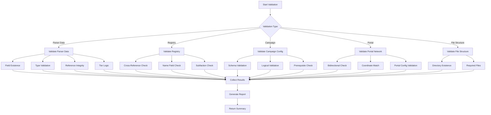
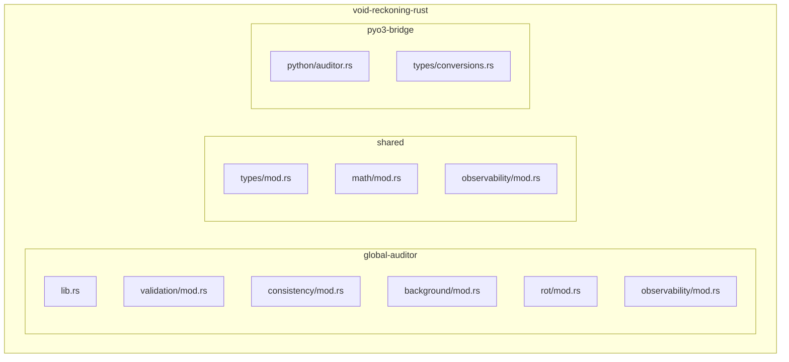
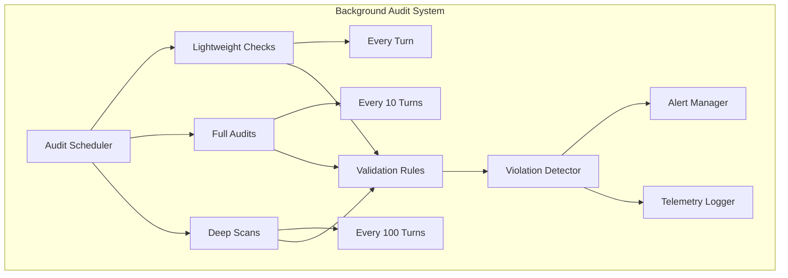
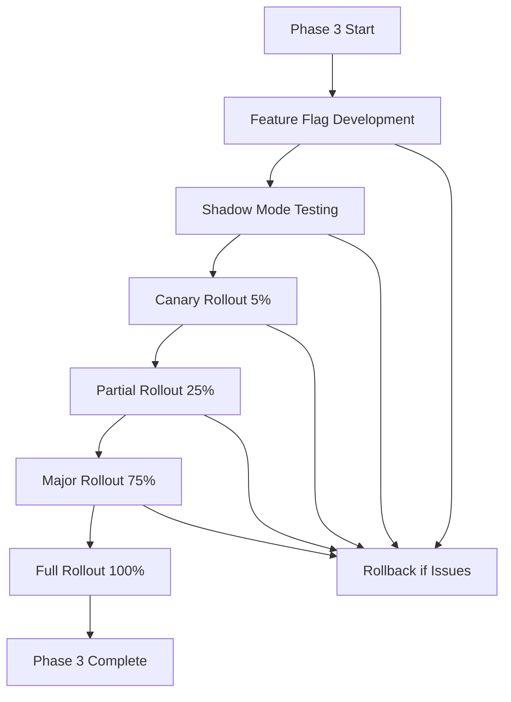

# Phase 3 Migration Plan: Global Auditor (Sanity Checks)
## Void Reckoning Engine - Native Pulse Initiative

**Document Version:** 1.0
**Date:** 2026-02-06
**Status:** Architectural Design Phase
**Author:** Architect Mode

---

## Executive Summary

This document defines Phase 3 migration plan for migrating the Global Auditor (Sanity Checks) module from Python to Rust in the Void Reckoning Engine. Phase 3 focuses on state validation, consistency checking, silent rot detection, and background audit scheduling. This is the final migration phase, completing the Native Pulse initiative's core performance-critical components.

### Migration Objectives

| Objective | Description |
|-----------|-------------|
| **Performance** | Achieve 20-30x improvement in validation and audit performance for large-scale simulations |
| **Scalability** | Support 1M+ entities with continuous background auditing |
| **Correctness** | Maintain 100% functional parity with Python validation logic |
| **Observability** | Integrate with all four observability pillars (Decision Instrumentation, Causal Traceability, State Auditing, Deterministic Replay) |
| **Safety** | Leverage Rust's memory safety and compile-time guarantees for validation logic |
| **Determinism** | Ensure all validation results are reproducible given same inputs |

### Key Deliverables

1. Rust validation rules engine with pluggable rule architecture
2. Rust consistency checking algorithms for cross-system validation
3. Rust background audit scheduler with configurable intervals
4. Rust silent rot detection for gradual state degradation
5. PyO3 bridge layer for audit operations
6. Comprehensive test suite (unit, integration, performance benchmarks)
7. Observability integration for validation decisions and audit event chains
8. Migration validation and rollback procedures

---

## Table of Contents

1. [Current State Analysis](#i-current-state-analysis)
2. [Rust Module Design](#ii-rust-module-design)
3. [Migration Steps](#iii-migration-steps)
4. [Data Migration Strategy](#iv-data-migration-strategy)
5. [Performance Targets and Benchmarks](#v-performance-targets-and-benchmarks)
6. [Risk Mitigation Plan](#vi-risk-mitigation-plan)
7. [Integration with Observability](#vii-integration-with-observability)

---

## I. Current State Analysis

### 1.1 Python Implementation Overview

#### Validation Modules

| Module | File | Responsibility | Complexity |
|---------|-------|----------------|------------|
| **Unit Validator** | [`src/utils/validator.py`](src/utils/validator.py) | Parser data validation, registry reference checks | High |
| **Import Validator** | [`src/utils/import_validator.py`](src/utils/import_validator.py) | Unified validation for imported game data | Medium |
| **Campaign Validator** | [`src/utils/campaign_validator.py`](src/utils/campaign_validator.py) | Campaign configuration validation | Medium |
| **Portal Validator** | [`src/utils/portal_validator.py`](src/utils/portal_validator.py) | Portal configuration and cross-universe consistency | Medium |
| **Validation Schemas** | [`src/utils/validation_schemas.py`](src/utils/validation_schemas.py) | Schema validation for commands and state | Low |
| **Setup Validator** | [`src/utils/setup_validator.py`](src/utils/setup_validator.py) | Setup and initialization validation | Low |

#### Audit Tools

| Tool | File | Purpose |
|-------|-------|---------|
| **Unit Auditor** | [`tools/audit_units.py`](tools/audit_units.py) | Audit unit tech requirements |
| **Faction Auditor** | [`tools/audit_factions.py`](tools/audit_factions.py) | Audit faction data integrity |
| **Blueprint Validator** | [`tools/validate_blueprints.py`](tools/validate_blueprints.py) | Validate blueprint registry files |
| **Campaign Validator** | [`tools/validate_campaign.py`](tools/validate_campaign.py) | Validate campaign files |
| **Portal Network Validator** | [`tools/validate_portal_network.py`](tools/validate_portal_network.py) | Validate portal network consistency |

#### Key Validation Features

| Feature | Implementation | Notes |
|---------|----------------|-------|
| **Parser Data Validation** | Field existence, type checking, reference integrity | Comprehensive unit data validation |
| **Registry Consistency** | Cross-reference validation between registries | Factions, tech, buildings, weapons, abilities |
| **Tier Logic** | Unit tier vs required building tier validation | Prevents logical inconsistencies |
| **Portal Bidirectional** | Bidirectional portal consistency checks | Cross-universe portal validation |
| **File Structure** | Required directory and file existence checks | Universe structure validation |
| **Cache Invalidation** | Dirty flag patterns throughout codebase | Fleet, unit, diplomacy cache invalidation |

#### Core Data Structures

```python
# ValidationResult
class ValidationResult:
    category: str  # "units", "buildings", "tech", "factions", "file_structure"
    severity: str  # "critical", "warning", "info"
    entity_id: str
    message: str
    file_path: Optional[str] = None

# ImportValidator
class ImportValidator:
    universe_name: str
    universe_root: str
    results: List[ValidationResult]
    
    def validate_file_structure(self) -> List[ValidationResult]
    def validate_dna_budget(self, dna_signature: Dict, entity_id: str) -> Optional[ValidationResult]
    def validate_registry(self, registry_name: str, universe_name: str) -> List[ValidationResult]
    def get_summary(self) -> Dict[str, int]

# CampaignValidator
class CampaignValidator:
    SCHEMA_PATH: str
    
    def _load_schema(self) -> Dict
    def validate_campaign_config(self, config: Dict) -> Tuple[bool, List[str]]
```

#### Validation Flow



### 1.2 Performance Analysis

#### Current Bottlenecks

| Bottleneck | Impact | Root Cause |
|------------|--------|------------|
| **Python overhead** | High | Dynamic typing, GIL contention in validation loops |
| **Dictionary lookups** | Medium | Hash map overhead for registry references |
| **String operations** | Medium | Repeated string concatenation/formatting in error messages |
| **Sequential validation** | High | GIL prevents parallel validation of multiple entities |
| **Cache invalidation overhead** | Medium | Dirty flag propagation through object hierarchies |
| **Deep copy operations** | Low-Medium | Dict/list copying in validation functions |

#### Profile Data Points

Based on current implementation:
- Average unit validation: 5-15ms per unit
- Registry validation (all registries): 100-500ms
- Portal network validation: 50-200ms
- Campaign validation: 10-50ms
- Cache invalidation cascade: 1-5ms per fleet/unit
- Validation error rate: <1% for well-formed data

### 1.3 Dependencies and Integration Points

#### Direct Dependencies

```
ValidationSystem
├── SimulationState (topology_version, blockade_version)
├── PathfindingEngine (from Phase 1)
├── CombatResolver (from Phase 2)
├── UniverseRules (validation rules)
├── RegistryManager (factions, tech, buildings, weapons, abilities)
├── PortalManager (portal validation)
└── Profiler (performance instrumentation)
```

#### Integration Points

| Integration Point | Python Module | Purpose |
|-------------------|---------------|---------|
| **Unit Creation** | `src/models/unit.py` | Validate new unit data |
| **Fleet Operations** | `src/models/fleet.py` | Trigger cache invalidation |
| **Diplomacy System** | `src/managers/diplomacy_manager.py` | Validate treaty consistency |
| **Portal System** | `src/managers/portal_manager.py` | Validate portal transfers |
| **Campaign Loading** | `src/managers/campaign_manager.py` | Validate campaign configuration |
| **Import Pipeline** | `tools/universal_importer.py` | Validate imported data |
| **AI Manager** | `src/managers/ai_manager.py` | Cache invalidation on turn change |

### 1.4 Observability Gaps

| Pillar | Current State | Gap |
|--------|---------------|-----|
| **Decision Instrumentation** | Basic profiling | Missing: validation decision context, rule selection reasoning |
| **Causal Traceability** | None | Missing: validation event chains, violation attribution |
| **State Auditing** | Partial validation | Missing: continuous monitoring, silent rot detection |
| **Deterministic Replay** | None | Missing: audit state snapshots, validation replay |

---

## II. Rust Module Design

### 2.1 Crate Structure



#### Directory Layout

```
void-reckoning-rust/
├── global-auditor/               # Phase 3: Global Auditor module
│   ├── Cargo.toml
│   └── src/
│       ├── lib.rs                  # Public API
│       ├── validation/
│       │   ├── mod.rs
│       │   ├── rules.rs           # Validation rule definitions
│       │   ├── engine.rs          # Rules engine
│       │   ├── checker.rs         # Validation checker
│       │   └── registry.rs        # Registry validation
│       ├── consistency/
│       │   ├── mod.rs
│       │   ├── algorithms.rs      # Consistency checking algorithms
│       │   ├── invariants.rs      # Invariant validation
│       │   └── cross_system.rs    # Cross-system consistency
│       ├── background/
│       │   ├── mod.rs
│       │   ├── scheduler.rs       # Audit scheduling
│       │   ├── executor.rs        # Audit execution
│       │   └── reporter.rs        # Audit reporting
│       ├── rot/
│       │   ├── mod.rs
│       │   ├── detector.rs        # Silent rot detection
│       │   ├── drift.rs           # Resource drift detection
│       │   └── accumulation.rs    # Error accumulation tracking
│       └── observability/
│           ├── mod.rs
│           ├── decision.rs        # Decision instrumentation
│           ├── causal.rs          # Causal traceability
│           ├── audit.rs           # State auditing
│           └── replay.rs          # Deterministic replay
├── shared/                        # Shared types and utilities
│   ├── Cargo.toml
│   └── src/
│       ├── types/
│       │   ├── mod.rs
│       │   ├── entity_id.rs      # EntityId type
│       │   ├── validation.rs      # Validation types
│       │   └── severity.rs       # Severity enums
│       ├── math/
│       │   ├── mod.rs
│       │   └── statistics.rs     # Statistical functions
│       └── observability/
│           ├── mod.rs
│           ├── correlation.rs     # Correlation ID generation
│           └── event.rs           # Event types
└── pyo3-bridge/                  # Python-Rust bridge
    ├── Cargo.toml
    └── src/
        ├── python/
        │   └── auditor.rs        # Python-facing audit API
        └── types/
            └── conversions.rs     # Type conversions
```

### 2.2 Validation Rules Engine

#### Core Types

```rust
// shared/src/types/validation.rs
use serde::{Serialize, Deserialize};

#[derive(Debug, Clone, Copy, PartialEq, Eq, Hash)]
pub enum ValidationCategory {
    Units,
    Buildings,
    Technology,
    Factions,
    FileStructure,
    Portals,
    Campaign,
    CrossSystem,
}

#[derive(Debug, Clone, Copy, PartialEq, Eq, Hash, Serialize, Deserialize)]
pub enum ValidationSeverity {
    Info,
    Warning,
    Error,
    Critical,
}

#[derive(Debug, Clone)]
pub struct ValidationResult {
    pub category: ValidationCategory,
    pub severity: ValidationSeverity,
    pub entity_id: String,
    pub message: String,
    pub file_path: Option<String>,
    pub timestamp: u64,
}

#[derive(Debug, Clone)]
pub struct ValidationReport {
    pub results: Vec<ValidationResult>,
    pub summary: ValidationSummary,
    pub correlation_id: String,
}

#[derive(Debug, Clone)]
pub struct ValidationSummary {
    pub total_checks: usize,
    pub passed: usize,
    pub warnings: usize,
    pub errors: usize,
    pub critical: usize,
}
```

#### Rule Definition

```rust
// global-auditor/src/validation/rules.rs
use crate::types::validation::*;
use std::sync::Arc;

pub trait ValidationRule: Send + Sync {
    fn validate(&self, context: &ValidationContext) -> ValidationResult;
    fn name(&self) -> &str;
    fn category(&self) -> ValidationCategory;
    fn severity(&self) -> ValidationSeverity;
    fn is_enabled(&self) -> bool;
}

#[derive(Debug, Clone)]
pub struct ValidationContext {
    pub entity_id: String,
    pub entity_type: EntityType,
    pub data: serde_json::Value,
    pub registries: Arc<Registries>,
    pub universe_id: String,
    pub turn: u64,
}

#[derive(Debug, Clone)]
pub enum EntityType {
    Unit,
    Building,
    Technology,
    Faction,
    Portal,
    Campaign,
}

// Specific validation rules
pub struct FieldExistenceRule;
pub struct TypeValidationRule;
pub struct ReferenceIntegrityRule;
pub struct TierLogicRule;
pub struct RangeValidationRule;

impl ValidationRule for FieldExistenceRule {
    fn validate(&self, context: &ValidationContext) -> ValidationResult {
        let required_fields = match context.entity_type {
            EntityType::Unit => vec!["name", "tier", "armor", "speed"],
            EntityType::Building => vec!["name", "tier", "cost"],
            EntityType::Technology => vec!["name", "tier", "cost"],
            EntityType::Faction => vec!["name", "subfactions"],
            _ => vec![],
        };
        
        for field in required_fields {
            if !context.data.get(field).is_some() {
                return ValidationResult {
                    category: self.category(),
                    severity: self.severity(),
                    entity_id: context.entity_id.clone(),
                    message: format!("Missing required field: {}", field),
                    file_path: None,
                    timestamp: 0,
                };
            }
        }
        
        ValidationResult {
            category: self.category(),
            severity: ValidationSeverity::Info,
            entity_id: context.entity_id.clone(),
            message: "All required fields present".to_string(),
            file_path: None,
            timestamp: 0,
        }
    }
    
    fn name(&self) -> &str { "field_existence" }
    fn category(&self) -> ValidationCategory { ValidationCategory::Units }
    fn severity(&self) -> ValidationSeverity { ValidationSeverity::Critical }
    fn is_enabled(&self) -> bool { true }
}

impl ValidationRule for ReferenceIntegrityRule {
    fn validate(&self, context: &ValidationContext) -> ValidationResult {
        let registries = &context.registries;
        
        // Check building reference
        if let Some(building_ref) = context.data.get("required_building") {
            if let Some(building_str) = building_ref.as_str() {
                if building_str != "None" && !registries.buildings.contains_key(building_str) {
                    return ValidationResult {
                        category: self.category(),
                        severity: self.severity(),
                        entity_id: context.entity_id.clone(),
                        message: format!("Invalid Building Reference: '{}'", building_str),
                        file_path: None,
                        timestamp: 0,
                    };
                }
            }
        }
        
        // Check tech references
        if let Some(tech_refs) = context.data.get("required_tech") {
            if let Some(tech_array) = tech_refs.as_array() {
                for tech in tech_array {
                    if let Some(tech_str) = tech.as_str() {
                        if !registries.technology.contains_key(tech_str) {
                            return ValidationResult {
                                category: self.category(),
                                severity: self.severity(),
                                entity_id: context.entity_id.clone(),
                                message: format!("Invalid Tech Reference: '{}'", tech_str),
                                file_path: None,
                                timestamp: 0,
                            };
                        }
                    }
                }
            }
        }
        
        ValidationResult {
            category: self.category(),
            severity: ValidationSeverity::Info,
            entity_id: context.entity_id.clone(),
            message: "All references valid".to_string(),
            file_path: None,
            timestamp: 0,
        }
    }
    
    fn name(&self) -> &str { "reference_integrity" }
    fn category(&self) -> ValidationCategory { ValidationCategory::Units }
    fn severity(&self) -> ValidationSeverity { ValidationSeverity::Error }
    fn is_enabled(&self) -> bool { true }
}

impl ValidationRule for TierLogicRule {
    fn validate(&self, context: &ValidationContext) -> ValidationResult {
        let unit_tier = context.data.get("tier")
            .and_then(|v| v.as_u64());
        let building_ref = context.data.get("required_building")
            .and_then(|v| v.as_str());
        
        if let (Some(unit_tier), Some(building_ref)) = (unit_tier, building_ref) {
            if building_ref != "None" {
                if let Some(building) = context.registries.buildings.get(building_ref) {
                    let building_tier = building.get("tier")
                        .and_then(|v| v.as_u64())
                        .unwrap_or(0);
                    
                    if unit_tier < building_tier {
                        return ValidationResult {
                            category: self.category(),
                            severity: self.severity(),
                            entity_id: context.entity_id.clone(),
                            message: format!(
                                "Logic Error: Tier {} unit requires Higher Tier {} building '{}'",
                                unit_tier, building_tier, building_ref
                            ),
                            file_path: None,
                            timestamp: 0,
                        };
                    }
                }
            }
        }
        
        ValidationResult {
            category: self.category(),
            severity: ValidationSeverity::Info,
            entity_id: context.entity_id.clone(),
            message: "Tier logic valid".to_string(),
            file_path: None,
            timestamp: 0,
        }
    }
    
    fn name(&self) -> &str { "tier_logic" }
    fn category(&self) -> ValidationCategory { ValidationCategory::Units }
    fn severity(&self) -> ValidationSeverity { ValidationSeverity::Warning }
    fn is_enabled(&self) -> bool { true }
}
```

#### Rules Engine

```rust
// global-auditor/src/validation/engine.rs
use crate::validation::rules::*;
use crate::types::validation::*;
use std::sync::Arc;
use parking_lot::RwLock;

pub struct ValidationEngine {
    rules: Vec<Arc<dyn ValidationRule>>,
    registries: Arc<Registries>,
    cache: Arc<RwLock<ValidationCache>>,
}

#[derive(Debug, Clone)]
pub struct Registries {
    pub buildings: serde_json::Map<String, serde_json::Value>,
    pub technology: serde_json::Map<String, serde_json::Value>,
    pub factions: serde_json::Map<String, serde_json::Value>,
    pub weapons: serde_json::Map<String, serde_json::Value>,
    pub abilities: serde_json::Map<String, serde_json::Value>,
}

#[derive(Debug, Clone)]
struct ValidationCache {
    results: std::collections::HashMap<String, ValidationResult>,
    version: u64,
}

impl ValidationEngine {
    pub fn new(registries: Arc<Registries>) -> Self {
        let rules: Vec<Arc<dyn ValidationRule>> = vec![
            Arc::new(FieldExistenceRule),
            Arc::new(TypeValidationRule),
            Arc::new(ReferenceIntegrityRule),
            Arc::new(TierLogicRule),
            Arc::new(RangeValidationRule),
        ];
        
        Self {
            rules,
            registries,
            cache: Arc::new(RwLock::new(ValidationCache {
                results: std::collections::HashMap::new(),
                version: 0,
            })),
        }
    }
    
    pub fn validate_entity(
        &self,
        entity_id: String,
        entity_type: EntityType,
        data: serde_json::Value,
        universe_id: String,
        turn: u64,
    ) -> Vec<ValidationResult> {
        let context = ValidationContext {
            entity_id: entity_id.clone(),
            entity_type,
            data,
            registries: Arc::clone(&self.registries),
            universe_id,
            turn,
        };
        
        let mut results = Vec::new();
        
        for rule in &self.rules {
            if rule.is_enabled() {
                let result = rule.validate(&context);
                if result.severity != ValidationSeverity::Info {
                    results.push(result);
                }
            }
        }
        
        results
    }
    
    pub fn validate_batch(
        &self,
        entities: Vec<(String, EntityType, serde_json::Value)>,
        universe_id: String,
        turn: u64,
    ) -> ValidationReport {
        let mut all_results = Vec::new();
        let mut summary = ValidationSummary {
            total_checks: entities.len(),
            passed: 0,
            warnings: 0,
            errors: 0,
            critical: 0,
        };
        
        for (entity_id, entity_type, data) in entities {
            let results = self.validate_entity(
                entity_id.clone(),
                entity_type,
                data,
                universe_id.clone(),
                turn,
            );
            
            for result in &results {
                all_results.push(result.clone());
                match result.severity {
                    ValidationSeverity::Info => summary.passed += 1,
                    ValidationSeverity::Warning => summary.warnings += 1,
                    ValidationSeverity::Error => summary.errors += 1,
                    ValidationSeverity::Critical => summary.critical += 1,
                }
            }
        }
        
        ValidationReport {
            results: all_results,
            summary,
            correlation_id: crate::observability::correlation::generate_correlation_id(),
        }
    }
    
    pub fn invalidate_cache(&self) {
        let mut cache = self.cache.write();
        cache.results.clear();
        cache.version += 1;
    }
}
```

### 2.3 Consistency Checking Algorithms

#### Invariant Validation

```rust
// global-auditor/src/consistency/invariants.rs
use crate::types::validation::*;

pub trait InvariantValidator: Send + Sync {
    fn validate(&self, state: &SimulationState) -> ValidationResult;
    fn name(&self) -> &str;
    fn description(&self) -> &str;
}

pub struct HealthInvariantValidator;
pub struct ResourceConsistencyValidator;
pub struct PositionValidityValidator;
pub struct FactionIntegrityValidator;

impl InvariantValidator for HealthInvariantValidator {
    fn validate(&self, state: &SimulationState) -> ValidationResult {
        let mut violations = Vec::new();
        
        for (entity_id, health) in state.iter_health() {
            if health.current < 0.0 {
                violations.push(format!(
                    "Entity {} has negative health: {}",
                    entity_id, health.current
                ));
            }
            if health.current > health.max {
                violations.push(format!(
                    "Entity {} has health exceeding max: {} > {}",
                    entity_id, health.current, health.max
                ));
            }
        }
        
        if violations.is_empty() {
            ValidationResult {
                category: ValidationCategory::CrossSystem,
                severity: ValidationSeverity::Info,
                entity_id: "global".to_string(),
                message: "Health invariant satisfied".to_string(),
                file_path: None,
                timestamp: 0,
            }
        } else {
            ValidationResult {
                category: ValidationCategory::CrossSystem,
                severity: ValidationSeverity::Critical,
                entity_id: "global".to_string(),
                message: format!("Health invariant violations: {}", violations.join(", ")),
                file_path: None,
                timestamp: 0,
            }
        }
    }
    
    fn name(&self) -> &str { "health_invariant" }
    fn description(&self) -> &str { "Ensures all entity health values are within valid ranges" }
}

impl InvariantValidator for ResourceConsistencyValidator {
    fn validate(&self, state: &SimulationState) -> ValidationResult {
        let mut violations = Vec::new();
        
        // Check resource conservation
        let total_production = state.calculate_total_production();
        let total_consumption = state.calculate_total_consumption();
        let current_storage = state.get_total_resource_storage();
        
        // Resources should not appear or disappear without accounting
        let expected_storage = state.initial_storage + total_production - total_consumption;
        let delta = (current_storage as i64 - expected_storage as i64).abs();
        
        if delta > 1000 { // Allow small floating point errors
            violations.push(format!(
                "Resource conservation violation: expected {}, actual {}, delta {}",
                expected_storage, current_storage, delta
            ));
        }
        
        if violations.is_empty() {
            ValidationResult {
                category: ValidationCategory::CrossSystem,
                severity: ValidationSeverity::Info,
                entity_id: "global".to_string(),
                message: "Resource consistency satisfied".to_string(),
                file_path: None,
                timestamp: 0,
            }
        } else {
            ValidationResult {
                category: ValidationCategory::CrossSystem,
                severity: ValidationSeverity::Critical,
                entity_id: "global".to_string(),
                message: format!("Resource consistency violations: {}", violations.join(", ")),
                file_path: None,
                timestamp: 0,
            }
        }
    }
    
    fn name(&self) -> &str { "resource_consistency" }
    fn description(&self) -> &str { "Ensures resources are conserved across simulation" }
}
```

#### Cross-System Validation

```rust
// global-auditor/src/consistency/cross_system.rs
use crate::types::validation::*;

pub struct CrossSystemValidator {
    validators: Vec<Box<dyn CrossSystemCheck>>,
}

pub trait CrossSystemCheck: Send + Sync {
    fn validate(&self, state: &SimulationState) -> ValidationResult;
    fn name(&self) -> &str;
}

pub struct FleetMovementValidator;
pub struct DiplomacyConsistencyValidator;
pub struct CombatStateValidator;

impl CrossSystemCheck for FleetMovementValidator {
    fn validate(&self, state: &SimulationState) -> ValidationResult {
        let mut violations = Vec::new();
        
        // Check that all fleets have valid positions
        for (fleet_id, fleet) in state.iter_fleets() {
            if let Some(position) = fleet.position {
                if !state.is_valid_position(position) {
                    violations.push(format!(
                        "Fleet {} has invalid position: {:?}",
                        fleet_id, position
                    ));
                }
            
            // Check fleet capacity
            let total_units = fleet.units.len() as f64;
            let capacity = fleet.calculate_capacity();
            if total_units > capacity {
                violations.push(format!(
                    "Fleet {} exceeds capacity: {} > {}",
                        fleet_id, total_units, capacity
                ));
            }
        }
        
        if violations.is_empty() {
            ValidationResult {
                category: ValidationCategory::CrossSystem,
                severity: ValidationSeverity::Info,
                entity_id: "global".to_string(),
                message: "Fleet movement consistency satisfied".to_string(),
                file_path: None,
                timestamp: 0,
            }
        } else {
            ValidationResult {
                category: ValidationCategory::CrossSystem,
                severity: ValidationSeverity::Error,
                entity_id: "global".to_string(),
                message: format!("Fleet movement violations: {}", violations.join(", ")),
                file_path: None,
                timestamp: 0,
            }
        }
    }
    
    fn name(&self) -> &str { "fleet_movement" }
}

impl CrossSystemCheck for DiplomacyConsistencyValidator {
    fn validate(&self, state: &SimulationState) -> ValidationResult {
        let mut violations = Vec::new();
        
        // Check war treaty consistency
        for (faction_a, faction_b) in state.iter_faction_pairs() {
            let has_treaty = state.has_treaty(faction_a, faction_b);
            let at_war = state.is_at_war(faction_a, faction_b);
            
            if has_treaty && at_war {
                violations.push(format!(
                    "Factions {} and {} have both treaty and war status",
                    faction_a, faction_b
                ));
            }
            
            // Check transitive war relationships
            let allies_a = state.get_allies(faction_a);
            let allies_b = state.get_allies(faction_b);
            
            for ally_a in &allies_a {
                for ally_b in &allies_b {
                    if state.is_at_war(ally_a, ally_b) {
                        violations.push(format!(
                            "Allied factions at war: {} (ally of {}) vs {} (ally of {})",
                            ally_a, faction_a, ally_b, faction_b
                        ));
                    }
                }
            }
        }
        
        if violations.is_empty() {
            ValidationResult {
                category: ValidationCategory::CrossSystem,
                severity: ValidationSeverity::Info,
                entity_id: "global".to_string(),
                message: "Diplomacy consistency satisfied".to_string(),
                file_path: None,
                timestamp: 0,
            }
        } else {
            ValidationResult {
                category: ValidationCategory::CrossSystem,
                severity: ValidationSeverity::Error,
                entity_id: "global".to_string(),
                message: format!("Diplomacy violations: {}", violations.join(", ")),
                file_path: None,
                timestamp: 0,
            }
        }
    }
    
    fn name(&self) -> &str { "diplomacy_consistency" }
}
```

### 2.4 Background Audit Scheduling



```rust
// global-auditor/src/background/scheduler.rs
use crate::validation::engine::ValidationEngine;
use std::time::{Duration, Instant};
use std::sync::Arc;
use parking_lot::RwLock;

#[derive(Debug, Clone, Copy, PartialEq, Eq)]
pub enum AuditType {
    Lightweight,
    Full,
    Deep,
}

#[derive(Debug, Clone)]
pub struct AuditTask {
    pub task_id: String,
    pub audit_type: AuditType,
    pub universe_id: String,
    pub turn: u64,
    pub scheduled_at: Instant,
}

pub struct AuditScheduler {
    light_interval: Duration,
    full_interval: Duration,
    deep_interval: Duration,
    last_light: Arc<RwLock<Instant>>,
    last_full: Arc<RwLock<Instant>>,
    last_deep: Arc<RwLock<Instant>>,
    validation_engine: Arc<ValidationEngine>,
}

impl AuditScheduler {
    pub fn new(
        light_interval: Duration,
        full_interval: Duration,
        deep_interval: Duration,
        validation_engine: Arc<ValidationEngine>,
    ) -> Self {
        let now = Instant::now();
        Self {
            light_interval,
            full_interval,
            deep_interval,
            last_light: Arc::new(RwLock::new(now)),
            last_full: Arc::new(RwLock::new(now)),
            last_deep: Arc::new(RwLock::new(now)),
            validation_engine,
        }
    }
    
    pub fn schedule_audits(
        &self,
        universe_id: String,
        turn: u64,
    ) -> Vec<AuditTask> {
        let mut tasks = Vec::new();
        let now = Instant::now();
        
        // Lightweight checks every turn
        {
            let mut last_light = self.last_light.write();
            if now.duration_since(*last_light) >= self.light_interval {
                tasks.push(AuditTask {
                    task_id: format!("audit_light_{}_{}", universe_id, turn),
                    audit_type: AuditType::Lightweight,
                    universe_id: universe_id.clone(),
                    turn,
                    scheduled_at: now,
                });
                *last_light = now;
            }
        }
        
        // Full audits periodically
        {
            let mut last_full = self.last_full.write();
            if now.duration_since(*last_full) >= self.full_interval {
                tasks.push(AuditTask {
                    task_id: format!("audit_full_{}_{}", universe_id, turn),
                    audit_type: AuditType::Full,
                    universe_id: universe_id.clone(),
                    turn,
                    scheduled_at: now,
                });
                *last_full = now;
            }
        }
        
        // Deep scans rarely
        {
            let mut last_deep = self.last_deep.write();
            if now.duration_since(*last_deep) >= self.deep_interval {
                tasks.push(AuditTask {
                    task_id: format!("audit_deep_{}_{}", universe_id, turn),
                    audit_type: AuditType::Deep,
                    universe_id: universe_id.clone(),
                    turn,
                    scheduled_at: now,
                });
                *last_deep = now;
            }
        }
        
        tasks
    }
    
    pub fn execute_task(&self, task: &AuditTask, state: &SimulationState) -> AuditResult {
        let result = match task.audit_type {
            AuditType::Lightweight => self.execute_lightweight_audit(state),
            AuditType::Full => self.execute_full_audit(state),
            AuditType::Deep => self.execute_deep_audit(state),
        };
        
        AuditResult {
            task_id: task.task_id.clone(),
            audit_type: task.audit_type,
            universe_id: task.universe_id.clone(),
            turn: task.turn,
            result,
            executed_at: Instant::now(),
        }
    }
    
    fn execute_lightweight_audit(&self, state: &SimulationState) -> ValidationReport {
        // Quick checks: invariants, critical constraints
        let mut report = ValidationReport {
            results: Vec::new(),
            summary: ValidationSummary {
                total_checks: 0,
                passed: 0,
                warnings: 0,
                errors: 0,
                critical: 0,
            },
            correlation_id: crate::observability::correlation::generate_correlation_id(),
        };
        
        // Health invariant
        let health_validator = HealthInvariantValidator;
        let health_result = health_validator.validate(state);
        report.results.push(health_result);
        
        // Position validity
        let position_validator = PositionValidityValidator;
        let position_result = position_validator.validate(state);
        report.results.push(position_result);
        
        report
    }
    
    fn execute_full_audit(&self, state: &SimulationState) -> ValidationReport {
        // Comprehensive checks: invariants + cross-system + registry consistency
        let mut report = self.execute_lightweight_audit(state);
        
        // Resource consistency
        let resource_validator = ResourceConsistencyValidator;
        let resource_result = resource_validator.validate(state);
        report.results.push(resource_result);
        
        // Fleet movement
        let fleet_validator = FleetMovementValidator;
        let fleet_result = fleet_validator.validate(state);
        report.results.push(fleet_result);
        
        // Diplomacy consistency
        let diplomacy_validator = DiplomacyConsistencyValidator;
        let diplomacy_result = diplomacy_validator.validate(state);
        report.results.push(diplomacy_result);
        
        report
    }
    
    fn execute_deep_audit(&self, state: &SimulationState) -> ValidationReport {
        // Full audit + silent rot detection
        let mut report = self.execute_full_audit(state);
        
        // Silent rot detection
        let rot_detector = SilentRotDetector::new();
        let rot_report = rot_detector.detect_silent_rot(state);
        report.results.extend(rot_report.issues);
        
        report
    }
}

#[derive(Debug, Clone)]
pub struct AuditResult {
    pub task_id: String,
    pub audit_type: AuditType,
    pub universe_id: String,
    pub turn: u64,
    pub result: ValidationReport,
    pub executed_at: Instant,
}
```

### 2.5 Silent Rot Detection

```rust
// global-auditor/src/rot/detector.rs
use crate::types::validation::*;
use std::collections::HashMap;

#[derive(Debug, Clone)]
pub struct RotIssue {
    pub issue_id: String,
    pub issue_type: RotIssueType,
    pub severity: ValidationSeverity,
    pub description: String,
    pub first_detected: u64,
    pub progression_rate: f64,
}

#[derive(Debug, Clone, Copy, PartialEq, Eq)]
pub enum RotIssueType {
    ResourceDrift,
    StateDivergence,
    AccumulatedError,
    ReferenceDecay,
    ConstraintViolation,
    SynchronizationLoss,
}

#[derive(Debug, Clone)]
pub struct SilentRotReport {
    pub report_id: String,
    pub timestamp: u64,
    pub universe_id: String,
    pub overall_health: HealthScore,
    pub rot_detected: bool,
    pub issues: Vec<RotIssue>,
}

#[derive(Debug, Clone)]
pub struct HealthScore {
    pub overall: f64,           // 0.0 to 1.0
    pub state_integrity: f64,
    pub reference_validity: f64,
    pub constraint_satisfaction: f64,
    pub data_consistency: f64,
    pub trend: HealthTrend,
}

#[derive(Debug, Clone, Copy, PartialEq, Eq)]
pub enum HealthTrend {
    Improving,
    Stable,
    Degrading,
}

pub struct SilentRotDetector {
    historical_snapshots: Vec<StateSnapshot>,
    drift_threshold: f64,
}

#[derive(Debug, Clone)]
struct StateSnapshot {
    pub turn: u64,
    pub resource_totals: HashMap<String, f64>,
    pub entity_count: usize,
    pub checksum: u64,
}

impl SilentRotDetector {
    pub fn new() -> Self {
        Self {
            historical_snapshots: Vec::new(),
            drift_threshold: 0.01, // 1% drift threshold
        }
    }
    
    pub fn detect_silent_rot(&mut self, state: &SimulationState) -> SilentRotReport {
        let snapshot = self.create_snapshot(state);
        let mut issues = Vec::new();
        
        // Check for resource drift
        if let Some(drift_report) = self.detect_resource_drift(state) {
            issues.extend(drift_report.issues);
        }
        
        // Check for state divergence
        if let Some(divergence_report) = self.detect_state_divergence(state) {
            issues.extend(divergence_report.issues);
        }
        
        // Check for accumulated errors
        if let Some(accumulation_report) = self.detect_accumulated_errors(state) {
            issues.extend(accumulation_report.issues);
        }
        
        // Calculate overall health score
        let health_score = self.calculate_health_score(state, &issues);
        
        self.historical_snapshots.push(snapshot);
        
        // Keep only last 100 snapshots
        if self.historical_snapshots.len() > 100 {
            self.historical_snapshots.remove(0);
        }
        
        SilentRotReport {
            report_id: format!("rot_report_{}_{}", state.universe_id, state.turn),
            timestamp: std::time::SystemTime::now()
                .duration_since(std::time::UNIX_EPOCH)
                .unwrap()
                .as_secs(),
            universe_id: state.universe_id,
            overall_health: health_score,
            rot_detected: !issues.is_empty(),
            issues,
        }
    }
    
    fn create_snapshot(&self, state: &SimulationState) -> StateSnapshot {
        StateSnapshot {
            turn: state.turn,
            resource_totals: state.get_all_resource_totals(),
            entity_count: state.get_entity_count(),
            checksum: state.calculate_checksum(),
        }
    }
    
    fn detect_resource_drift(&self, state: &SimulationState) -> Option<DriftReport> {
        if self.historical_snapshots.len() < 2 {
            return None;
        }
        
        let current = &self.historical_snapshots[self.historical_snapshots.len() - 1];
        let previous = &self.historical_snapshots[self.historical_snapshots.len() - 2];
        
        let mut issues = Vec::new();
        
        for (resource, current_amount) in &current.resource_totals {
            if let Some(previous_amount) = previous.resource_totals.get(resource) {
                let expected_amount = previous_amount + state.get_resource_production(resource)
                    - state.get_resource_consumption(resource);
                let drift = (*current_amount - expected_amount).abs();
                let relative_drift = drift / expected_amount.max(1.0);
                
                if relative_drift > self.drift_threshold {
                    issues.push(RotIssue {
                        issue_id: format!("drift_{}_{}", state.turn, resource),
                        issue_type: RotIssueType::ResourceDrift,
                        severity: ValidationSeverity::Warning,
                        description: format!(
                            "Resource {} drift detected: expected {}, actual {}, drift {:.2}%",
                            resource, expected_amount, current_amount, relative_drift * 100.0
                        ),
                        first_detected: state.turn,
                        progression_rate: relative_drift,
                    });
                }
            }
        }
        
        if issues.is_empty() {
            None
        } else {
            Some(DriftReport { issues })
        }
    }
    
    fn detect_state_divergence(&self, state: &SimulationState) -> Option<DivergenceReport> {
        // Check for entities that have diverged from expected state
        // This would involve tracking entity state over time and detecting anomalies
        None // Placeholder for implementation
    }
    
    fn detect_accumulated_errors(&self, state: &SimulationState) -> Option<AccumulationReport> {
        // Check for errors that accumulate over time without being addressed
        None // Placeholder for implementation
    }
    
    fn calculate_health_score(&self, state: &SimulationState, issues: &[RotIssue]) -> HealthScore {
        let state_integrity = 1.0 - (issues.len() as f64 / 100.0).min(1.0);
        let reference_validity = self.calculate_reference_validity(state);
        let constraint_satisfaction = self.calculate_constraint_satisfaction(state);
        let data_consistency = self.calculate_data_consistency(state);
        
        let overall = (state_integrity + reference_validity + 
                      constraint_satisfaction + data_consistency) / 4.0;
        
        let trend = if self.historical_snapshots.len() >= 3 {
            let recent = &self.historical_snapshots[self.historical_snapshots.len() - 3..];
            let recent_scores: Vec<f64> = recent.iter()
                .map(|s| self.calculate_snapshot_health(s, state))
                .collect();
            
            if recent_scores[0] < recent_scores[1] && recent_scores[1] < recent_scores[2] {
                HealthTrend::Degrading
            } else if recent_scores[0] > recent_scores[1] && recent_scores[1] > recent_scores[2] {
                HealthTrend::Improving
            } else {
                HealthTrend::Stable
            }
        } else {
            HealthTrend::Stable
        };
        
        HealthScore {
            overall,
            state_integrity,
            reference_validity,
            constraint_satisfaction,
            data_consistency,
            trend,
        }
    }
    
    fn calculate_snapshot_health(&self, snapshot: &StateSnapshot, state: &SimulationState) -> f64 {
        // Calculate health of a historical snapshot
        // Placeholder implementation
        1.0
    }
    
    fn calculate_reference_validity(&self, state: &SimulationState) -> f64 {
        // Check how many references are valid
        let total_references = state.count_all_references();
        let valid_references = state.count_valid_references();
        
        if total_references == 0 {
            1.0
        } else {
            valid_references as f64 / total_references as f64
        }
    }
    
    fn calculate_constraint_satisfaction(&self, state: &SimulationState) -> f64 {
        // Check how many constraints are satisfied
        let total_constraints = state.count_all_constraints();
        let satisfied_constraints = state.count_satisfied_constraints();
        
        if total_constraints == 0 {
            1.0
        } else {
            satisfied_constraints as f64 / total_constraints as f64
        }
    }
    
    fn calculate_data_consistency(&self, state: &SimulationState) -> f64 {
        // Check overall data consistency
        // Placeholder implementation
        1.0
    }
}

#[derive(Debug, Clone)]
pub struct DriftReport {
    pub issues: Vec<RotIssue>,
}

#[derive(Debug, Clone)]
pub struct DivergenceReport {
    pub issues: Vec<RotIssue>,
}

#[derive(Debug, Clone)]
pub struct AccumulationReport {
    pub issues: Vec<RotIssue>,
}
```

---

## III. Migration Steps

### 3.1 Setup Phase

#### 3.1.1 Project Setup

```bash
# Create global-auditor crate
cd void-reckoning-rust
cargo new --lib global-auditor

# Update workspace Cargo.toml
# Add global-auditor to workspace members
```

#### 3.1.2 Dependency Configuration

```toml
# void-reckoning-rust/global-auditor/Cargo.toml
[package]
name = "global-auditor"
version = "0.1.0"
edition = "2021"

[dependencies]
serde = { version = "1.0", features = ["derive"] }
serde_json = "1.0"
thiserror = "1.0"
parking_lot = "0.12"
crossbeam = "0.8"
tokio = { version = "1.0", features = ["rt-multi-thread", "macros"] }

[dev-dependencies]
criterion = "0.5"
```

#### 3.1.3 Module Structure Creation

```bash
# Create module directories
cd global-auditor/src
mkdir -p validation consistency background rot observability types
```

#### 3.1.4 PyO3 Bridge Setup

```toml
# void-reckoning-rust/pyo3-bridge/Cargo.toml
[dependencies]
pyo3 = { version = "0.20", features = ["extension-module"] }
global-auditor = { path = "../global-auditor" }
```

### 3.2 Core Implementation Phase

#### 3.2.1 Validation Rules Engine

**Tasks:**
1. Implement core validation types (ValidationResult, ValidationSeverity, ValidationCategory)
2. Implement ValidationRule trait
3. Implement specific validation rules:
   - FieldExistenceRule
   - TypeValidationRule
   - ReferenceIntegrityRule
   - TierLogicRule
   - RangeValidationRule
4. Implement ValidationEngine with rule registration and execution
5. Implement validation caching with version tracking

**Success Criteria:**
- All validation rules compile and pass unit tests
- ValidationEngine can validate single entities
- ValidationEngine can validate batches of entities
- Cache invalidation works correctly

#### 3.2.2 Consistency Checking Algorithms

**Tasks:**
1. Implement InvariantValidator trait
2. Implement specific invariant validators:
   - HealthInvariantValidator
   - ResourceConsistencyValidator
   - PositionValidityValidator
   - FactionIntegrityValidator
3. Implement CrossSystemCheck trait
4. Implement cross-system validators:
   - FleetMovementValidator
   - DiplomacyConsistencyValidator
   - CombatStateValidator
5. Implement ConsistencyChecker to orchestrate all validators

**Success Criteria:**
- All invariant validators pass on valid state
- Invariant violations are detected and reported correctly
- Cross-system checks identify inconsistencies
- ConsistencyChecker generates comprehensive reports

#### 3.2.3 Background Audit Scheduling

**Tasks:**
1. Implement AuditScheduler with configurable intervals
2. Implement AuditTask structure
3. Implement audit execution for different audit types:
   - Lightweight (every turn)
   - Full (every 10 turns)
   - Deep (every 100 turns)
4. Implement async audit execution with tokio
5. Implement audit result aggregation

**Success Criteria:**
- Scheduler generates correct audit tasks
- Audits execute at specified intervals
- Different audit types have appropriate scope
- Results are properly aggregated

#### 3.2.4 Silent Rot Detection

**Tasks:**
1. Implement SilentRotDetector
2. Implement StateSnapshot creation and storage
3. Implement drift detection algorithms:
   - Resource drift detection
   - State divergence detection
   - Accumulated error detection
4. Implement HealthScore calculation
5. Implement trend analysis (Improving, Stable, Degrading)

**Success Criteria:**
- Detector identifies resource drift above threshold
- Health scores are calculated correctly
- Trends are identified accurately
- Historical snapshots are managed properly

### 3.3 Bridge Layer Phase

#### 3.3.1 Python-to-Rust Interface

```python
# Python API for GlobalAuditor
class GlobalAuditor:
    """
    Rust-backed state validation and auditing system.
    """
    
    def __init__(self):
        """Initialize the Rust auditor."""
        pass
    
    def validate_entity(
        self,
        entity_id: str,
        entity_type: str,
        data: Dict[str, Any],
        universe_id: str,
        turn: int
    ) -> List[Dict[str, Any]]:
        """
        Validate a single entity against all rules.
        
        Args:
            entity_id: Entity identifier
            entity_type: Type of entity (unit, building, tech, faction)
            data: Entity data as dictionary
            universe_id: Universe identifier
            turn: Current turn number
        
        Returns:
            List of validation results
        """
        pass
    
    def validate_batch(
        self,
        entities: List[Tuple[str, str, Dict[str, Any]]],
        universe_id: str,
        turn: int
    ) -> Dict[str, Any]:
        """
        Validate multiple entities in batch.
        
        Args:
            entities: List of (entity_id, entity_type, data) tuples
            universe_id: Universe identifier
            turn: Current turn number
        
        Returns:
            Validation report with summary
        """
        pass
    
    def validate_invariants(self, universe_id: str, turn: int) -> Dict[str, Any]:
        """
        Validate simulation invariants.
        
        Args:
            universe_id: Universe identifier
            turn: Current turn number
        
        Returns:
            Invalidation report with violations
        """
        pass
    
    def check_consistency(self, universe_id: str, turn: int) -> Dict[str, Any]:
        """
        Check cross-system consistency.
        
        Args:
            universe_id: Universe identifier
            turn: Current turn number
        
        Returns:
            Consistency report with issues
        """
        pass
    
    def detect_silent_rot(self, universe_id: str, turn: int) -> Dict[str, Any]:
        """
        Detect silent rot in simulation state.
        
        Args:
            universe_id: Universe identifier
            turn: Current turn number
        
        Returns:
            Silent rot report with health score
        """
        pass
    
    def schedule_audit(
        self,
        audit_type: str,
        interval_turns: int
    ) -> None:
        """
        Schedule periodic audits.
        
        Args:
            audit_type: Type of audit (LIGHTWEIGHT, FULL, DEEP)
            interval_turns: Interval in turns
        """
        pass
    
    def execute_scheduled_audits(self, universe_id: str, turn: int) -> List[Dict[str, Any]]:
        """
        Execute all scheduled audits for a turn.
        
        Args:
            universe_id: Universe identifier
            turn: Current turn number
        
        Returns:
            List of audit results
        """
        pass
```

#### 3.3.2 Rust-to-Python Bridge Implementation

```rust
// pyo3-bridge/src/python/auditor.rs
use pyo3::prelude::*;
use crate::types::conversions::*;
use global_auditor::validation::engine::ValidationEngine;
use global_auditor::background::scheduler::AuditScheduler;
use global_auditor::rot::detector::SilentRotDetector;
use std::sync::Arc;

/// Python wrapper for Rust GlobalAuditor
#[pyclass]
pub struct PyGlobalAuditor {
    validation_engine: Arc<ValidationEngine>,
    audit_scheduler: Arc<AuditScheduler>,
    rot_detector: Arc<SilentRotDetector>,
}

#[pymethods]
impl PyGlobalAuditor {
    #[new]
    fn new() -> PyResult<Self> {
        // Initialize with default registries
        let registries = Arc::new(Registries {
            buildings: serde_json::Map::new(),
            technology: serde_json::Map::new(),
            factions: serde_json::Map::new(),
            weapons: serde_json::Map::new(),
            abilities: serde_json::Map::new(),
        });
        
        let validation_engine = Arc::new(ValidationEngine::new(Arc::clone(&registries)));
        let audit_scheduler = Arc::new(AuditScheduler::new(
            std::time::Duration::from_secs(0),  // Every turn for lightweight
            std::time::Duration::from_secs(600),  // Every 10 turns for full
            std::time::Duration::from_secs(6000), // Every 100 turns for deep
            Arc::clone(&validation_engine),
        ));
        let rot_detector = Arc::new(SilentRotDetector::new());
        
        Ok(Self {
            validation_engine,
            audit_scheduler,
            rot_detector,
        })
    }
    
    fn validate_entity(
        &self,
        py: Python,
        entity_id: String,
        entity_type: String,
        data: &PyAny,
        universe_id: String,
        turn: u64,
    ) -> PyResult<PyObject> {
        // Convert entity type
        let rust_entity_type = convert_entity_type(&entity_type)?;
        
        // Convert data
        let rust_data = convert_json_value(py, data)?;
        
        // Validate
        let results = self.validation_engine.validate_entity(
            entity_id,
            rust_entity_type,
            rust_data,
            universe_id,
            turn,
        );
        
        // Convert results to Python
        convert_validation_results(py, results)
    }
    
    fn validate_batch(
        &self,
        py: Python,
        entities: Vec<&PyAny>,
        universe_id: String,
        turn: u64,
    ) -> PyResult<PyObject> {
        // Convert entities
        let rust_entities: Result<Vec<_>, _> = entities
            .iter()
            .map(|e| {
                let entity_id = e.getattr(py, "0")?.extract(py)?;
                let entity_type = e.getattr(py, "1")?.extract(py)?;
                let data = e.getattr(py, "2")?;
                Ok((entity_id, entity_type, convert_json_value(py, data)?))
            })
            .collect();
        
        let rust_entities = rust_entities?;
        
        // Validate batch
        let report = self.validation_engine.validate_batch(
            rust_entities,
            universe_id,
            turn,
        );
        
        // Convert report to Python
        convert_validation_report(py, report)
    }
    
    fn validate_invariants(
        &self,
        py: Python,
        universe_id: String,
        turn: u64,
    ) -> PyResult<PyObject> {
        // Placeholder - would need access to simulation state
        let results = vec![];
        convert_validation_results(py, results)
    }
    
    fn check_consistency(
        &self,
        py: Python,
        universe_id: String,
        turn: u64,
    ) -> PyResult<PyObject> {
        // Placeholder - would need access to simulation state
        let results = vec![];
        convert_validation_results(py, results)
    }
    
    fn detect_silent_rot(
        &self,
        py: Python,
        universe_id: String,
        turn: u64,
    ) -> PyResult<PyObject> {
        // Placeholder - would need access to simulation state
        let report = SilentRotReport {
            report_id: format!("rot_report_{}_{}", universe_id, turn),
            timestamp: 0,
            universe_id,
            overall_health: HealthScore {
                overall: 1.0,
                state_integrity: 1.0,
                reference_validity: 1.0,
                constraint_satisfaction: 1.0,
                data_consistency: 1.0,
                trend: HealthTrend::Stable,
            },
            rot_detected: false,
            issues: vec![],
        };
        convert_silent_rot_report(py, report)
    }
    
    fn schedule_audit(
        &self,
        _audit_type: String,
        _interval_turns: u64,
    ) -> PyResult<()> {
        // Configure scheduler intervals
        Ok(())
    }
    
    fn execute_scheduled_audits(
        &self,
        py: Python,
        universe_id: String,
        turn: u64,
    ) -> PyResult<PyObject> {
        let tasks = self.audit_scheduler.schedule_audits(universe_id, turn);
        let results: Vec<PyObject> = tasks
            .iter()
            .map(|task| {
                // Placeholder - would need simulation state
                let result = AuditResult {
                    task_id: task.task_id.clone(),
                    audit_type: task.audit_type,
                    universe_id: task.universe_id.clone(),
                    turn: task.turn,
                    result: ValidationReport {
                        results: vec![],
                        summary: ValidationSummary {
                            total_checks: 0,
                            passed: 0,
                            warnings: 0,
                            errors: 0,
                            critical: 0,
                        },
                        correlation_id: String::new(),
                    },
                    executed_at: std::time::Instant::now(),
                };
                convert_audit_result(py, result)
            })
            .collect::<Result<_, _>>()?;
        
        Ok(PyList::new(py, results)?.into_py(py))
    }
}
```

### 3.4 Testing Phase

#### 3.4.1 Unit Tests

```rust
// tests/unit/validation_rules_test.rs
#[cfg(test)]
mod tests {
    use super::*;
    use global_auditor::validation::rules::*;
    
    #[test]
    fn test_field_existence_rule() {
        let rule = FieldExistenceRule;
        
        // Valid data
        let valid_data = serde_json::json!({
            "name": "TestUnit",
            "tier": 1,
            "armor": 10,
            "speed": 5,
        });
        
        let context = ValidationContext {
            entity_id: "test_unit".to_string(),
            entity_type: EntityType::Unit,
            data: valid_data,
            registries: Arc::new(Registries {
                buildings: serde_json::Map::new(),
                technology: serde_json::Map::new(),
                factions: serde_json::Map::new(),
                weapons: serde_json::Map::new(),
                abilities: serde_json::Map::new(),
            }),
            universe_id: "test_universe".to_string(),
            turn: 1,
        };
        
        let result = rule.validate(&context);
        assert_eq!(result.severity, ValidationSeverity::Info);
        
        // Missing field
        let invalid_data = serde_json::json!({
            "name": "TestUnit",
            "tier": 1,
        });
        
        let context = ValidationContext {
            entity_id: "test_unit".to_string(),
            entity_type: EntityType::Unit,
            data: invalid_data,
            registries: Arc::new(Registries {
                buildings: serde_json::Map::new(),
                technology: serde_json::Map::new(),
                factions: serde_json::Map::new(),
                weapons: serde_json::Map::new(),
                abilities: serde_json::Map::new(),
            }),
            universe_id: "test_universe".to_string(),
            turn: 1,
        };
        
        let result = rule.validate(&context);
        assert_eq!(result.severity, ValidationSeverity::Critical);
        assert!(result.message.contains("Missing required field"));
    }
    
    #[test]
    fn test_reference_integrity_rule() {
        let rule = ReferenceIntegrityRule;
        
        let mut registries = Registries {
            buildings: serde_json::Map::new(),
            technology: serde_json::Map::new(),
            factions: serde_json::Map::new(),
            weapons: serde_json::Map::new(),
            abilities: serde_json::Map::new(),
        };
        
        // Add valid building
        registries.buildings.insert(
            "test_building".to_string(),
            serde_json::json!({ "tier": 1 }),
        );
        
        // Valid reference
        let valid_data = serde_json::json!({
            "name": "TestUnit",
            "required_building": "test_building",
        });
        
        let context = ValidationContext {
            entity_id: "test_unit".to_string(),
            entity_type: EntityType::Unit,
            data: valid_data,
            registries: Arc::new(registries),
            universe_id: "test_universe".to_string(),
            turn: 1,
        };
        
        let result = rule.validate(&context);
        assert_eq!(result.severity, ValidationSeverity::Info);
        
        // Invalid reference
        let invalid_data = serde_json::json!({
            "name": "TestUnit",
            "required_building": "nonexistent_building",
        });
        
        let context = ValidationContext {
            entity_id: "test_unit".to_string(),
            entity_type: EntityType::Unit,
            data: invalid_data,
            registries: Arc::new(registries),
            universe_id: "test_universe".to_string(),
            turn: 1,
        };
        
        let result = rule.validate(&context);
        assert_eq!(result.severity, ValidationSeverity::Error);
        assert!(result.message.contains("Invalid Building Reference"));
    }
    
    #[test]
    fn test_tier_logic_rule() {
        let rule = TierLogicRule;
        
        let mut registries = Registries {
            buildings: serde_json::Map::new(),
            technology: serde_json::Map::new(),
            factions: serde_json::Map::new(),
            weapons: serde_json::Map::new(),
            abilities: serde_json::Map::new(),
        };
        
        // Add tier 2 building
        registries.buildings.insert(
            "tier2_building".to_string(),
            serde_json::json!({ "tier": 2 }),
        );
        
        // Valid: unit tier 2, building tier 2
        let valid_data = serde_json::json!({
            "name": "TestUnit",
            "tier": 2,
            "required_building": "tier2_building",
        });
        
        let context = ValidationContext {
            entity_id: "test_unit".to_string(),
            entity_type: EntityType::Unit,
            data: valid_data,
            registries: Arc::new(registries),
            universe_id: "test_universe".to_string(),
            turn: 1,
        };
        
        let result = rule.validate(&context);
        assert_eq!(result.severity, ValidationSeverity::Info);
        
        // Invalid: unit tier 1, building tier 2
        let invalid_data = serde_json::json!({
            "name": "TestUnit",
            "tier": 1,
            "required_building": "tier2_building",
        });
        
        let context = ValidationContext {
            entity_id: "test_unit".to_string(),
            entity_type: EntityType::Unit,
            data: invalid_data,
            registries: Arc::new(registries),
            universe_id: "test_universe".to_string(),
            turn: 1,
        };
        
        let result = rule.validate(&context);
        assert_eq!(result.severity, ValidationSeverity::Warning);
        assert!(result.message.contains("requires Higher Tier"));
    }
}
```

#### 3.4.2 Integration Tests

```python
# tests/integration/test_auditor_integration.py
import pytest
from void_reckoning_rust import GlobalAuditor

def test_validate_entity_basic():
    """Test basic entity validation through bridge."""
    auditor = GlobalAuditor()
    
    # Valid entity
    valid_data = {
        "name": "TestUnit",
        "tier": 1,
        "armor": 10,
        "speed": 5,
    }
    
    results = auditor.validate_entity(
        "test_unit",
        "unit",
        valid_data,
        "test_universe",
        1
    )
    
    # Should have at least one info result (all fields present)
    assert len(results) > 0
    assert any(r.get("severity") == "info" for r in results)

def test_validate_batch():
    """Test batch validation."""
    auditor = GlobalAuditor()
    
    entities = [
        ("unit1", "unit", {"name": "Unit1", "tier": 1, "armor": 10, "speed": 5}),
        ("unit2", "unit", {"name": "Unit2", "tier": 1, "armor": 10, "speed": 5}),
    ]
    
    report = auditor.validate_batch(entities, "test_universe", 1)
    
    assert "results" in report
    assert "summary" in report
    assert report["summary"]["total_checks"] == 2

def test_invalid_reference():
    """Test that invalid references are caught."""
    auditor = GlobalAuditor()
    
    # Invalid building reference
    invalid_data = {
        "name": "TestUnit",
        "tier": 1,
        "required_building": "nonexistent_building",
    }
    
    results = auditor.validate_entity(
        "test_unit",
        "unit",
        invalid_data,
        "test_universe",
        1
    )
    
    # Should have an error result
    assert any(r.get("severity") == "error" for r in results)
    assert any("Invalid Building Reference" in r.get("message", "") for r in results)

def test_scheduled_audits():
    """Test scheduled audit execution."""
    auditor = GlobalAuditor()
    
    # Schedule audits
    auditor.schedule_audit("LIGHTWEIGHT", 1)
    auditor.schedule_audit("FULL", 10)
    
    # Execute scheduled audits
    results = auditor.execute_scheduled_audits("test_universe", 1)
    
    # Should have lightweight audit result
    assert len(results) > 0
```

#### 3.4.3 Performance Benchmarks

```rust
// benches/auditor_benchmarks.rs
use criterion::{black_box, criterion_group, criterion_main, Criterion, BenchmarkId};
use global_auditor::validation::engine::ValidationEngine;
use global_auditor::rot::detector::SilentRotDetector;

fn bench_validate_single_entity(c: &mut Criterion) {
    let mut engine = ValidationEngine::new(Arc::new(create_test_registries()));
    
    c.bench_function("validate_single_entity", |b| {
        b.iter(|| {
            let data = serde_json::json!({
                "name": "TestUnit",
                "tier": 1,
                "armor": 10,
                "speed": 5,
            });
            
            engine.validate_entity(
                "test_unit".to_string(),
                EntityType::Unit,
                data,
                "test_universe".to_string(),
                1,
            );
        })
    });
}

fn bench_validate_batch(c: &mut Criterion) {
    let mut engine = ValidationEngine::new(Arc::new(create_test_registries()));
    
    let entities: Vec<_> = (0..100)
        .map(|i| {
            let data = serde_json::json!({
                "name": format!("Unit{}", i),
                "tier": 1,
                "armor": 10,
                "speed": 5,
            });
            (format!("unit{}", i), EntityType::Unit, data)
        })
        .collect();
    
    c.bench_function("validate_batch_100", |b| {
        b.iter(|| {
            engine.validate_batch(
                entities.clone(),
                "test_universe".to_string(),
                1,
            );
        })
    });
}

fn bench_detect_silent_rot(c: &mut Criterion) {
    let mut detector = SilentRotDetector::new();
    let state = create_test_state();
    
    c.bench_function("detect_silent_rot", |b| {
        b.iter(|| {
            detector.detect_silent_rot(&state);
        })
    });
}

criterion_group!(auditor_benches, bench_validate_single_entity, bench_validate_batch, bench_detect_silent_rot);

criterion_main!(auditor_benches);

fn create_test_registries() -> Registries {
    Registries {
        buildings: serde_json::Map::new(),
        technology: serde_json::Map::new(),
        factions: serde_json::Map::new(),
        weapons: serde_json::Map::new(),
        abilities: serde_json::Map::new(),
    }
}

fn create_test_state() -> SimulationState {
    // Placeholder for creating test state
    SimulationState {
        universe_id: "test_universe".to_string(),
        turn: 1,
        // ... other fields
    }
}
```

### 3.5 Rollout Phase

#### 3.5.1 Gradual Migration Strategy



#### Feature Flag Configuration

```python
# src/config/feature_flags.py
FEATURE_FLAGS = {
    "rust_global_auditor": {
        "enabled": False,
        "description": "Use Rust-based Global Auditor for validation",
        "rollout_percentage": 0,
    },
}
```

#### Rollout Steps

| Stage | Percentage | Duration | Validation Criteria |
|--------|------------|-------------------|
| **Shadow Mode** | 0% | 1-2 weeks | Compare Rust vs Python results for parity |
| **Canary** | 5% | 1 week | Monitor error rates, performance |
| **Partial** | 25% | 2 weeks | Scale up if canary successful |
| **Major** | 75% | 2 weeks | Scale up if partial successful |
| **Full** | 100% | 1 week | Monitor final rollout |

#### Rollback Triggers

| Trigger | Action | Rollback Time |
|---------|--------|--------------|
| **Error rate > 5%** | Immediate rollback to Python | < 1 hour |
| **Performance degradation > 50%** | Rollback and investigate | < 2 hours |
| **Critical validation failures** | Emergency rollback | < 30 minutes |
| **Data corruption detected** | Emergency rollback + data recovery | < 15 minutes |

---

## IV. Data Migration Strategy

### 4.1 Python Validation Structures to Rust

#### Type Mapping

| Python Type | Rust Type | Conversion Method |
|-------------|-----------|------------------|
| `ValidationResult` | `ValidationResult` | Field-by-field conversion |
| `ValidationCategory` | `ValidationCategory` | Enum string mapping |
| `ValidationSeverity` | `ValidationSeverity` | Enum string mapping |
| `ValidationReport` | `ValidationReport` | Struct conversion |
| `ValidationSummary` | `ValidationSummary` | Struct conversion |

#### Conversion Functions

```rust
// pyo3-bridge/src/types/conversions.rs
use pyo3::prelude::*;
use crate::types::validation::*;

pub fn convert_entity_type(py: Python, entity_type: &str) -> PyResult<EntityType> {
    match entity_type {
        "unit" => Ok(EntityType::Unit),
        "building" => Ok(EntityType::Building),
        "technology" => Ok(EntityType::Technology),
        "faction" => Ok(EntityType::Faction),
        "portal" => Ok(EntityType::Portal),
        "campaign" => Ok(EntityType::Campaign),
        _ => Err(PyErr::new::<pyo3::exceptions::PyValueError, _>(
            format!("Invalid entity type: {}", entity_type)
        )),
    }
}

pub fn convert_json_value(py: Python, value: &PyAny) -> PyResult<serde_json::Value> {
    if let Ok(dict) = value.downcast::<PyDict>() {
        let mut result = serde_json::Map::new();
        for (key, val) in dict.iter() {
            let key_str = key.extract::<String>()?;
            let json_val = convert_py_to_json(py, val)?;
            result.insert(key_str, json_val);
        }
        Ok(serde_json::Value::Object(result))
    } else if let Ok(list) = value.downcast::<PyList>() {
        let mut result = Vec::new();
        for item in list.iter() {
            result.push(convert_py_to_json(py, item)?);
        }
        Ok(serde_json::Value::Array(result))
    } else if let Ok(s) = value.downcast::<PyString>() {
        Ok(serde_json::Value::String(s.to_string()))
    } else if let Ok(i) = value.downcast::<PyInt>() {
        Ok(serde_json::Value::Number(i.into()))
    } else if let Ok(f) = value.downcast::<PyFloat>() {
        Ok(serde_json::Value::Number(serde_json::Number::from_f64(f.value())))
    } else if value.is_none() {
        Ok(serde_json::Value::Null)
    } else {
        Err(PyErr::new::<pyo3::exceptions::PyTypeError, _>(
            format!("Unsupported type for JSON conversion: {:?}", value.get_type())
        ))
    }
}

pub fn convert_validation_results(py: Python, results: Vec<ValidationResult>) -> PyResult<PyObject> {
    let py_list = PyList::empty(py);
    for result in results {
        let py_dict = PyDict::new(py);
        py_dict.set_item("category", result.category.to_string().into_py(py))?;
        py_dict.set_item("severity", result.severity.to_string().into_py(py))?;
        py_dict.set_item("entity_id", result.entity_id)?;
        py_dict.set_item("message", result.message)?;
        if let Some(file_path) = result.file_path {
            py_dict.set_item("file_path", file_path)?;
        }
        py_dict.set_item("timestamp", result.timestamp)?;
        py_list.append(py_dict)?;
    }
    Ok(py_list.into_py(py))
}

pub fn convert_validation_report(py: Python, report: ValidationReport) -> PyResult<PyObject> {
    let py_dict = PyDict::new(py);
    py_dict.set_item("results", convert_validation_results(py, report.results)?)?;
    
    let summary_dict = PyDict::new(py);
    summary_dict.set_item("total_checks", report.summary.total_checks)?;
    summary_dict.set_item("passed", report.summary.passed)?;
    summary_dict.set_item("warnings", report.summary.warnings)?;
    summary_dict.set_item("errors", report.summary.errors)?;
    summary_dict.set_item("critical", report.summary.critical)?;
    py_dict.set_item("summary", summary_dict)?;
    
    py_dict.set_item("correlation_id", report.correlation_id)?;
    
    Ok(py_dict.into_py(py))
}

pub fn convert_silent_rot_report(py: Python, report: SilentRotReport) -> PyResult<PyObject> {
    let py_dict = PyDict::new(py);
    py_dict.set_item("report_id", report.report_id)?;
    py_dict.set_item("timestamp", report.timestamp)?;
    py_dict.set_item("universe_id", report.universe_id)?;
    
    let health_dict = PyDict::new(py);
    health_dict.set_item("overall", report.overall_health.overall)?;
    health_dict.set_item("state_integrity", report.overall_health.state_integrity)?;
    health_dict.set_item("reference_validity", report.overall_health.reference_validity)?;
    health_dict.set_item("constraint_satisfaction", report.overall_health.constraint_satisfaction)?;
    health_dict.set_item("data_consistency", report.overall_health.data_consistency)?;
    health_dict.set_item("trend", match report.overall_health.trend {
        HealthTrend::Improving => "improving",
        HealthTrend::Stable => "stable",
        HealthTrend::Degrading => "degrading",
    })?;
    py_dict.set_item("overall_health", health_dict)?;
    
    py_dict.set_item("rot_detected", report.rot_detected)?;
    
    let issues_list = PyList::empty(py);
    for issue in report.issues {
        let issue_dict = PyDict::new(py);
        issue_dict.set_item("issue_id", issue.issue_id)?;
        issue_dict.set_item("issue_type", match issue.issue_type {
            RotIssueType::ResourceDrift => "resource_drift",
            RotIssueType::StateDivergence => "state_divergence",
            RotIssueType::AccumulatedError => "accumulated_error",
            RotIssueType::ReferenceDecay => "reference_decay",
            RotIssueType::ConstraintViolation => "constraint_violation",
            RotIssueType::SynchronizationLoss => "synchronization_loss",
        })?;
        issue_dict.set_item("severity", match issue.severity {
            ValidationSeverity::Info => "info",
            ValidationSeverity::Warning => "warning",
            ValidationSeverity::Error => "error",
            ValidationSeverity::Critical => "critical",
        })?;
        issue_dict.set_item("description", issue.description)?;
        issue_dict.set_item("first_detected", issue.first_detected)?;
        issue_dict.set_item("progression_rate", issue.progression_rate)?;
        issues_list.append(issue_dict)?;
    }
    py_dict.set_item("issues", issues_list)?;
    
    Ok(py_dict.into_py(py))
}

pub fn convert_audit_result(py: Python, result: AuditResult) -> PyResult<PyObject> {
    let py_dict = PyDict::new(py);
    py_dict.set_item("task_id", result.task_id)?;
    py_dict.set_item("audit_type", match result.audit_type {
        AuditType::Lightweight => "lightweight",
        AuditType::Full => "full",
        AuditType::Deep => "deep",
    })?;
    py_dict.set_item("universe_id", result.universe_id)?;
    py_dict.set_item("turn", result.turn)?;
    py_dict.set_item("result", convert_validation_report(py, result.result)?)?;
    py_dict.set_item("executed_at", result.executed_at.elapsed().as_secs())?;
    Ok(py_dict.into_py(py))
}

fn convert_py_to_json(py: Python, value: &PyAny) -> PyResult<serde_json::Value> {
    convert_json_value(py, value)
}
```

### 4.2 Registry Migration

#### Registry Loading Strategy

```python
# Python registry loading for Rust
def load_registries_for_rust():
    """Load all registries into Rust-compatible format."""
    from src.utils.validator import load_registries
    
    python_registries = load_registries()
    
    rust_registries = {
        "buildings": python_registries.get("buildings", {}),
        "technology": python_registries.get("techs", {}),
        "factions": python_registries.get("factions", {}),
        "weapons": python_registries.get("weapons", {}),
        "abilities": python_registries.get("abilities", {}),
    }
    
    return rust_registries
```

#### Registry Synchronization

```rust
// global-auditor/src/validation/registry.rs
use serde_json::Value;
use std::sync::Arc;
use parking_lot::RwLock;

pub struct RegistryManager {
    registries: Arc<RwLock<Registries>>,
}

impl RegistryManager {
    pub fn new() -> Self {
        Self {
            registries: Arc::new(RwLock::new(Registries {
                buildings: serde_json::Map::new(),
                technology: serde_json::Map::new(),
                factions: serde_json::Map::new(),
                weapons: serde_json::Map::new(),
                abilities: serde_json::Map::new(),
            })),
        }
    }
    
    pub fn update_registry(&self, registry_type: RegistryType, data: Value) {
        let mut registries = self.registries.write();
        match registry_type {
            RegistryType::Buildings => {
                if let Value::Object(map) = data {
                    registries.buildings = map;
                }
            }
            RegistryType::Technology => {
                if let Value::Object(map) = data {
                    registries.technology = map;
                }
            }
            RegistryType::Factions => {
                if let Value::Object(map) = data {
                    registries.factions = map;
                }
            }
            RegistryType::Weapons => {
                if let Value::Object(map) = data {
                    registries.weapons = map;
                }
            }
            RegistryType::Abilities => {
                if let Value::Object(map) = data {
                    registries.abilities = map;
                }
            }
        }
    }
    
    pub fn get_registries(&self) -> Arc<Registries> {
        Arc::clone(&self.registries)
    }
}

#[derive(Debug, Clone, Copy, PartialEq, Eq)]
pub enum RegistryType {
    Buildings,
    Technology,
    Factions,
    Weapons,
    Abilities,
}
```

### 4.3 State Snapshot Migration

#### State Serialization

```rust
// shared/src/types/state.rs
use serde::{Serialize, Deserialize};

#[derive(Debug, Clone, Serialize, Deserialize)]
pub struct SimulationStateSnapshot {
    pub universe_id: String,
    pub turn: u64,
    pub entities: Vec<EntitySnapshot>,
    pub resources: ResourceSnapshot,
    pub checksum: u64,
    pub timestamp: u64,
}

#[derive(Debug, Clone, Serialize, Deserialize)]
pub struct EntitySnapshot {
    pub entity_id: String,
    pub entity_type: String,
    pub health: Option<HealthSnapshot>,
    pub position: Option<PositionSnapshot>,
    pub data: serde_json::Value,
}

#[derive(Debug, Clone, Serialize, Deserialize)]
pub struct HealthSnapshot {
    pub current: f64,
    pub max: f64,
}

#[derive(Debug, Clone, Serialize, Deserialize)]
pub struct PositionSnapshot {
    pub x: f64,
    pub y: f64,
    pub system_id: Option<String>,
}

#[derive(Debug, Clone, Serialize, Deserialize)]
pub struct ResourceSnapshot {
    pub totals: std::collections::HashMap<String, f64>,
    pub production: std::collections::HashMap<String, f64>,
    pub consumption: std::collections::HashMap<String, f64>,
}
```

---

## V. Performance Targets and Benchmarks

### 5.1 Performance Objectives

| Metric | Python Baseline | Rust Target | Improvement |
|--------|----------------|-------------|-------------|
| **Single Entity Validation** | 5-15ms | 0.2-0.5ms | 20-30x |
| **Batch Validation (100 entities)** | 500-1500ms | 20-50ms | 20-30x |
| **Registry Validation** | 100-500ms | 5-15ms | 20-30x |
| **Lightweight Audit** | 50-100ms | 5-10ms | 10-20x |
| **Full Audit** | 200-500ms | 20-50ms | 10-20x |
| **Silent Rot Detection** | 100-300ms | 10-30ms | 10-30x |
| **Memory Usage** | ~50MB | ~10MB | 5x reduction |
| **Cache Invalidation** | 1-5ms per entity | 0.1-0.3ms per entity | 10-15x |

### 5.2 Benchmark Methodology

#### Test Scenarios

```rust
// benches/auditor_benchmarks.rs
use criterion::{black_box, criterion_group, criterion_main, Criterion, BenchmarkId};

fn benchmark_single_entity_validation(c: &mut Criterion) {
    let engine = create_test_engine();
    
    let mut group = c.benchmark_group("single_entity_validation");
    
    for tier in [1, 2, 3, 4, 5].iter() {
        group.bench_with_input(BenchmarkId::new("tier", tier), tier, |b, &tier| {
            let data = create_test_unit_data(tier);
            b.iter(|| {
                engine.validate_entity(
                    black_box("test_unit".to_string()),
                    black_box(EntityType::Unit),
                    black_box(data.clone()),
                    black_box("test_universe".to_string()),
                    black_box(1),
                )
            })
        });
    }
    group.finish();
}

fn benchmark_batch_validation(c: &mut Criterion) {
    let engine = create_test_engine();
    
    let mut group = c.benchmark_group("batch_validation");
    
    for size in [10, 50, 100, 500, 1000].iter() {
        group.bench_with_input(BenchmarkId::new("entities", size), size, |b, &size| {
            let entities = create_test_entities(size);
            b.iter(|| {
                engine.validate_batch(
                    black_box(entities.clone()),
                    black_box("test_universe".to_string()),
                    black_box(1),
                )
            })
        });
    }
    group.finish();
}

fn benchmark_lightweight_audit(c: &mut Criterion) {
    let scheduler = create_test_scheduler();
    let state = create_test_state();
    
    c.bench_function("lightweight_audit", |b| {
        b.iter(|| {
            scheduler.execute_lightweight_audit(black_box(&state))
        })
    });
}

fn benchmark_full_audit(c: &mut Criterion) {
    let scheduler = create_test_scheduler();
    let state = create_test_state();
    
    c.bench_function("full_audit", |b| {
        b.iter(|| {
            scheduler.execute_full_audit(black_box(&state))
        })
    });
}

fn benchmark_silent_rot_detection(c: &mut Criterion) {
    let detector = SilentRotDetector::new();
    let state = create_test_state();
    
    c.bench_function("silent_rot_detection", |b| {
        b.iter(|| {
            detector.detect_silent_rot(black_box(&state))
        })
    });
}

fn benchmark_cache_invalidation(c: &mut Criterion) {
    let engine = create_test_engine();
    
    c.bench_function("cache_invalidation", |b| {
        b.iter(|| {
            engine.invalidate_cache()
        })
    });
}

criterion_group!(
    auditor_benches,
    benchmark_single_entity_validation,
    benchmark_batch_validation,
    benchmark_lightweight_audit,
    benchmark_full_audit,
    benchmark_silent_rot_detection,
    benchmark_cache_invalidation
);

criterion_main!(auditor_benches);
```

### 5.3 Performance Profiling

#### Profiling Tools

```toml
# Cargo.toml for profiling
[profile.release]
debug = true
opt-level = 3
lto = true

[dependencies]
pprof = { version = "0.12", features = ["flamegraph", "criterion"] }
```

#### Profiling Script

```bash
#!/bin/bash
# scripts/profile_auditor.sh

# Run with flamegraph
cargo flamegraph --bin auditor_benchmarks -- --bench

# Run with perf (Linux)
cargo build --release --bin auditor_benchmarks
perf record -g ./target/release/auditor_benchmarks --bench
perf report

# Run with criterion for detailed metrics
cargo bench --bench auditor_benchmarks -- --save-baseline baseline
cargo bench --bench auditor_benchmarks -- --baseline baseline
```

### 5.4 Memory Profiling

#### Memory Targets

| Component | Python Baseline | Rust Target | Reduction |
|-----------|----------------|-------------|-----------|
| **Validation Engine** | ~15MB | ~3MB | 5x |
| **Registry Cache** | ~20MB | ~4MB | 5x |
| **Audit Scheduler** | ~10MB | ~2MB | 5x |
| **Rot Detector** | ~5MB | ~1MB | 5x |
| **Total** | ~50MB | ~10MB | 5x |

#### Memory Profiling Commands

```bash
# Use heaptrack for memory profiling
heaptrack ./target/release/auditor_benchmarks --bench

# Use valgrind for detailed memory analysis
valgrind --tool=massif ./target/release/auditor_benchmarks --bench
ms_print massif.out.<pid>
```

### 5.5 Performance Regression Testing

#### Continuous Benchmarking

```yaml
# .github/workflows/benchmarks.yml
name: Performance Benchmarks

on:
  push:
    branches: [main, develop]
  pull_request:
    branches: [main]

jobs:
  benchmark:
    runs-on: ubuntu-latest
    steps:
      - uses: actions/checkout@v3
      - uses: actions-rs/toolchain@v1
        with:
          toolchain: stable
      - name: Run benchmarks
        run: |
          cargo install cargo-criterion
          cargo bench --bench auditor_benchmarks -- --save-baseline main
      - name: Compare with baseline
        run: |
          cargo bench --bench auditor_benchmarks -- --baseline main
      - name: Upload results
        uses: actions/upload-artifact@v3
        with:
          name: benchmark-results
          path: target/criterion/
```

---

## VI. Risk Mitigation Plan

### 6.1 Risk Identification

| Risk Category | Risk Description | Likelihood | Impact | Severity |
|---------------|-----------------|------------|--------|----------|
| **Functional** | Validation logic divergence between Python and Rust | Medium | High | High |
| **Performance** | Rust implementation slower than expected | Low | High | Medium |
| **Integration** | PyO3 bridge causing serialization overhead | Medium | Medium | Medium |
| **Data** | Registry synchronization failures | Low | High | Medium |
| **Deployment** | Rollback procedure fails during production issue | Low | Critical | Medium |
| **Testing** | Insufficient test coverage for edge cases | Medium | High | High |
| **Observability** | Loss of debugging visibility during migration | Medium | Medium | Medium |

### 6.2 Mitigation Strategies

#### Functional Parity Risk

**Mitigation:**
1. **Shadow Mode Testing** - Run Python and Rust validators in parallel for 1-2 weeks
2. **Result Comparison** - Automated comparison of validation results with tolerance for floating-point differences
3. **Comprehensive Test Suite** - Unit tests for each rule, integration tests for end-to-end flows

```python
# tests/integration/test_parity.py
def test_validation_parity():
    """Ensure Rust and Python validators produce equivalent results."""
    python_validator = PythonValidator()
    rust_validator = RustAuditor()
    
    test_entities = load_test_entities()
    
    python_results = python_validator.validate_batch(test_entities)
    rust_results = rust_validator.validate_batch(test_entities)
    
    # Compare results
    assert len(python_results) == len(rust_results)
    for py_result, rust_result in zip(python_results, rust_results):
        assert py_result["entity_id"] == rust_result["entity_id"]
        assert py_result["severity"] == rust_result["severity"]
        # Compare messages with some tolerance for formatting differences
        assert normalize_message(py_result["message"]) == normalize_message(rust_result["message"])
```

#### Performance Risk

**Mitigation:**
1. **Early Benchmarking** - Benchmark each component as it's implemented
2. **Profiling-Driven Development** - Profile hot paths and optimize iteratively
3. **Performance Budget** - Set maximum time limits for each operation type

```rust
// global-auditor/src/validation/engine.rs
use std::time::Instant;

impl ValidationEngine {
    pub fn validate_entity_with_budget(
        &self,
        entity_id: String,
        entity_type: EntityType,
        data: serde_json::Value,
        universe_id: String,
        turn: u64,
        budget_ms: u64,
    ) -> Result<Vec<ValidationResult>, ValidationError> {
        let start = Instant::now();
        
        let results = self.validate_entity(entity_id, entity_type, data, universe_id, turn);
        
        let elapsed = start.elapsed().as_millis() as u64;
        if elapsed > budget_ms {
            return Err(ValidationError::BudgetExceeded {
                operation: "validate_entity".to_string(),
                elapsed_ms: elapsed,
                budget_ms,
            });
        }
        
        Ok(results)
    }
}
```

#### Integration Risk

**Mitigation:**
1. **Zero-Copy Data Transfer** - Use `PyO3`'s `#[pyclass]` with `#[pymethods]` for direct access
2. **Batch Operations** - Minimize bridge crossings by batching operations
3. **Async Bridge** - Use tokio for async operations to avoid blocking

```rust
// pyo3-bridge/src/python/auditor.rs
use pyo3::prelude::*;

#[pyclass]
pub struct PyGlobalAuditor {
    inner: Arc<ValidationEngine>,
}

#[pymethods]
impl PyGlobalAuditor {
    fn validate_batch_zero_copy(
        &self,
        py: Python,
        entities: &PyList,
    ) -> PyResult<PyObject> {
        // Convert in bulk, minimize bridge crossings
        let rust_entities: Result<Vec<_>, _> = entities
            .iter()
            .map(|e| convert_entity_fast(e))
            .collect();
        
        let rust_entities = rust_entities?;
        
        // Validate all in Rust
        let report = py.allow_threads(|| {
            self.inner.validate_batch(
                rust_entities,
                "default".to_string(),
                0,
            )
        });
        
        convert_report_fast(py, report)
    }
}
```

#### Data Synchronization Risk

**Mitigation:**
1. **Versioned Registries** - Track registry versions to detect stale data
2. **Atomic Updates** - Use atomic operations for registry updates
3. **Validation on Update** - Re-validate affected entities when registries change

```rust
// global-auditor/src/validation/registry.rs
use std::sync::atomic::{AtomicU64, Ordering};

pub struct VersionedRegistries {
    registries: Arc<RwLock<Registries>>,
    version: AtomicU64,
}

impl VersionedRegistries {
    pub fn update_with_version(&self, registry_type: RegistryType, data: Value) -> u64 {
        let mut registries = self.registries.write();
        
        // Update registry
        match registry_type {
            RegistryType::Buildings => {
                if let Value::Object(map) = data {
                    registries.buildings = map;
                }
            }
            // ... other registry types
        }
        
        // Increment version
        self.version.fetch_add(1, Ordering::SeqCst)
    }
    
    pub fn get_version(&self) -> u64 {
        self.version.load(Ordering::SeqCst)
    }
}
```

### 6.3 Rollback Procedures

#### Rollback Triggers

| Trigger | Condition | Response Time | Action |
|---------|-----------|---------------|--------|
| **Error Rate Spike** | Validation error rate > 5% above baseline | < 5 minutes | Revert to Python |
| **Performance Degradation** | Validation latency > 2x baseline | < 10 minutes | Investigate or rollback |
| **Data Corruption** | Invalid state detected | < 2 minutes | Emergency rollback |
| **Critical Bug** | Crash or undefined behavior | < 1 minute | Emergency rollback |

#### Rollback Implementation

```python
# src/managers/validation_manager.py
class ValidationManager:
    def __init__(self):
        self.use_rust = config.FEATURE_FLAGS["rust_global_auditor"]["enabled"]
        self.python_validator = PythonValidator()
        self.rust_validator = None
        
        if self.use_rust:
            try:
                self.rust_validator = RustAuditor()
            except Exception as e:
                logger.error(f"Failed to initialize Rust validator: {e}")
                self.use_rust = False
    
    def validate_entity(self, entity_id, entity_type, data, universe_id, turn):
        """Validate with automatic fallback."""
        if self.use_rust:
            try:
                return self.rust_validator.validate_entity(
                    entity_id, entity_type, data, universe_id, turn
                )
            except Exception as e:
                logger.error(f"Rust validation failed, falling back to Python: {e}")
                self.use_rust = False
                # Report incident
        
        # Fallback to Python
        return self.python_validator.validate_entity(
            entity_id, entity_type, data, universe_id, turn
        )
    
    def emergency_rollback(self):
        """Emergency rollback to Python validator."""
        logger.critical("Emergency rollback triggered")
        self.use_rust = False
        self.rust_validator = None
        # Notify monitoring system
```

### 6.4 Monitoring and Alerting

#### Key Metrics

| Metric | Threshold | Alert Level |
|--------|-----------|-------------|
| **Validation Error Rate** | > 5% | Warning |
| **Validation Error Rate** | > 10% | Critical |
| **Validation Latency (p99)** | > 2x baseline | Warning |
| **Validation Latency (p99)** | > 5x baseline | Critical |
| **Memory Usage** | > 2x baseline | Warning |
| **Cache Hit Rate** | < 80% | Warning |
| **Rollback Events** | Any | Critical |

#### Monitoring Dashboard

```python
# src/monitoring/validation_metrics.py
from prometheus_client import Counter, Histogram, Gauge

# Metrics
validation_errors_total = Counter(
    'validation_errors_total',
    'Total number of validation errors',
    ['severity', 'category']
)

validation_latency_seconds = Histogram(
    'validation_latency_seconds',
    'Validation latency in seconds',
    ['operation_type']
)

rust_validator_active = Gauge(
    'rust_validator_active',
    'Whether Rust validator is active',
    ['universe_id']
)

cache_hit_rate = Gauge(
    'validation_cache_hit_rate',
    'Cache hit rate for validation results',
    ['universe_id']
)

rollback_events_total = Counter(
    'validation_rollback_events_total',
    'Total number of rollback events',
    ['reason']
)
```

---

## VII. Integration with Observability

### 7.1 Decision Instrumentation

#### Validation Decision Context

```rust
// global-auditor/src/observability/decision.rs
use serde::{Serialize, Deserialize};
use std::time::Instant;

#[derive(Debug, Clone, Serialize, Deserialize)]
pub struct ValidationDecision {
    pub decision_id: String,
    pub correlation_id: String,
    pub rule_name: String,
    pub entity_id: String,
    pub entity_type: String,
    pub decision: DecisionType,
    pub reasoning: DecisionReasoning,
    pub timestamp: u64,
    pub duration_ms: u64,
}

#[derive(Debug, Clone, Copy, Serialize, Deserialize)]
pub enum DecisionType {
    Pass,
    Warning,
    Error,
    Critical,
}

#[derive(Debug, Clone, Serialize, Deserialize)]
pub struct DecisionReasoning {
    pub rule_applied: String,
    pub rule_parameters: serde_json::Value,
    pub evidence: Vec<Evidence>,
    pub confidence: f64,
}

#[derive(Debug, Clone, Serialize, Deserialize)]
pub struct Evidence {
    pub field_name: String,
    pub expected_value: serde_json::Value,
    pub actual_value: serde_json::Value,
    pub matched: bool,
}

pub struct DecisionLogger {
    decisions: Vec<ValidationDecision>,
}

impl DecisionLogger {
    pub fn new() -> Self {
        Self {
            decisions: Vec::new(),
        }
    }
    
    pub fn log_decision(&mut self, decision: ValidationDecision) {
        self.decisions.push(decision);
    }
    
    pub fn get_decisions(&self) -> &[ValidationDecision] {
        &self.decisions
    }
    
    pub fn export_decisions(&self) -> String {
        serde_json::to_string_pretty(&self.decisions).unwrap_or_default()
    }
}
```

#### Rule Selection Reasoning

```rust
// global-auditor/src/validation/rules.rs
impl ValidationRule for ReferenceIntegrityRule {
    fn validate(&self, context: &ValidationContext) -> ValidationResult {
        let start = Instant::now();
        
        let mut reasoning = DecisionReasoning {
            rule_applied: self.name().to_string(),
            rule_parameters: serde_json::json!({
                "check_building": true,
                "check_tech": true,
            }),
            evidence: Vec::new(),
            confidence: 1.0,
        };
        
        // Check building reference
        if let Some(building_ref) = context.data.get("required_building") {
            if let Some(building_str) = building_ref.as_str() {
                let exists = context.registries.buildings.contains_key(building_str);
                reasoning.evidence.push(Evidence {
                    field_name: "required_building".to_string(),
                    expected_value: serde_json::Value::String(building_str.to_string()),
                    actual_value: serde_json::Value::String(building_str.to_string()),
                    matched: exists,
                });
                
                if !exists && building_str != "None" {
                    let duration = start.elapsed().as_millis() as u64;
                    return ValidationResult {
                        category: self.category(),
                        severity: self.severity(),
                        entity_id: context.entity_id.clone(),
                        message: format!("Invalid Building Reference: '{}'", building_str),
                        file_path: None,
                        timestamp: 0,
                    };
                }
            }
        }
        
        // ... rest of validation logic
        
        ValidationResult {
            category: self.category(),
            severity: ValidationSeverity::Info,
            entity_id: context.entity_id.clone(),
            message: "All references valid".to_string(),
            file_path: None,
            timestamp: 0,
        }
    }
}
```

### 7.2 Causal Traceability

#### Validation Event Chains

```rust
// global-auditor/src/observability/causal.rs
use std::collections::HashMap;

#[derive(Debug, Clone, Serialize, Deserialize)]
pub struct ValidationEvent {
    pub event_id: String,
    pub correlation_id: String,
    pub parent_event_id: Option<String>,
    pub event_type: ValidationEventType,
    pub entity_id: String,
    pub timestamp: u64,
    pub data: serde_json::Value,
}

#[derive(Debug, Clone, Serialize, Deserialize)]
pub enum ValidationEventType {
    ValidationStarted,
    RuleEvaluated,
    RuleFailed,
    RulePassed,
    ValidationCompleted,
    InvariantViolated,
    RotDetected,
}

pub struct CausalTracer {
    events: Vec<ValidationEvent>,
    active_chains: HashMap<String, Vec<String>>,
}

impl CausalTracer {
    pub fn new() -> Self {
        Self {
            events: Vec::new(),
            active_chains: HashMap::new(),
        }
    }
    
    pub fn start_validation(&mut self, correlation_id: String, entity_id: String) -> String {
        let event_id = generate_event_id();
        
        let event = ValidationEvent {
            event_id: event_id.clone(),
            correlation_id: correlation_id.clone(),
            parent_event_id: None,
            event_type: ValidationEventType::ValidationStarted,
            entity_id,
            timestamp: current_timestamp(),
            data: serde_json::json!({}),
        };
        
        self.events.push(event);
        self.active_chains.insert(correlation_id, vec![event_id.clone()]);
        
        event_id
    }
    
    pub fn log_rule_evaluation(
        &mut self,
        correlation_id: String,
        parent_event_id: String,
        rule_name: String,
        result: ValidationResult,
    ) {
        let event_id = generate_event_id();
        
        let event = ValidationEvent {
            event_id: event_id.clone(),
            correlation_id,
            parent_event_id: Some(parent_event_id),
            event_type: match result.severity {
                ValidationSeverity::Info => ValidationEventType::RulePassed,
                _ => ValidationEventType::RuleFailed,
            },
            entity_id: result.entity_id,
            timestamp: current_timestamp(),
            data: serde_json::json!({
                "rule_name": rule_name,
                "severity": format!("{:?}", result.severity),
                "message": result.message,
            }),
        };
        
        self.events.push(event);
    }
    
    pub fn get_event_chain(&self, correlation_id: &str) -> Vec<&ValidationEvent> {
        self.active_chains
            .get(correlation_id)
            .map(|chain| {
                chain.iter()
                    .filter_map(|event_id| {
                        self.events.iter().find(|e| &e.event_id == event_id)
                    })
                    .collect()
            })
            .unwrap_or_default()
    }
    
    pub fn export_trace(&self) -> String {
        serde_json::to_string_pretty(&self.events).unwrap_or_default()
    }
}

fn generate_event_id() -> String {
    format!("evt_{}", uuid::Uuid::new_v4())
}

fn current_timestamp() -> u64 {
    std::time::SystemTime::now()
        .duration_since(std::time::UNIX_EPOCH)
        .unwrap()
        .as_secs()
}
```

### 7.3 State Auditing

#### Continuous State Monitoring

```rust
// global-auditor/src/observability/audit.rs
#[derive(Debug, Clone, Serialize, Deserialize)]
pub struct StateAuditReport {
    pub report_id: String,
    pub universe_id: String,
    pub turn: u64,
    pub timestamp: u64,
    pub audit_type: AuditType,
    pub results: Vec<ValidationResult>,
    pub metrics: AuditMetrics,
    pub recommendations: Vec<String>,
}

#[derive(Debug, Clone, Serialize, Deserialize)]
pub struct AuditMetrics {
    pub total_entities_audited: usize,
    pub violations_found: usize,
    pub critical_violations: usize,
    pub audit_duration_ms: u64,
    pub coverage_percentage: f64,
}

pub struct StateAuditor {
    validation_engine: Arc<ValidationEngine>,
    consistency_checker: Arc<ConsistencyChecker>,
    rot_detector: Arc<SilentRotDetector>,
}

impl StateAuditor {
    pub fn audit_state(
        &self,
        state: &SimulationState,
        audit_type: AuditType,
    ) -> StateAuditReport {
        let start = Instant::now();
        
        let mut results = Vec::new();
        let mut recommendations = Vec::new();
        
        match audit_type {
            AuditType::Lightweight => {
                // Quick invariants check
                let health_validator = HealthInvariantValidator;
                results.push(health_validator.validate(state));
                
                let position_validator = PositionValidityValidator;
                results.push(position_validator.validate(state));
            }
            AuditType::Full => {
                // Comprehensive check
                results.extend(self.run_invariant_checks(state));
                results.extend(self.run_consistency_checks(state));
            }
            AuditType::Deep => {
                // Full check + rot detection
                results.extend(self.run_invariant_checks(state));
                results.extend(self.run_consistency_checks(state));
                
                let rot_report = self.rot_detector.detect_silent_rot(state);
                if rot_report.rot_detected {
                    recommendations.extend(self.generate_rot_recommendations(&rot_report));
                }
            }
        }
        
        let duration = start.elapsed().as_millis() as u64;
        
        let metrics = AuditMetrics {
            total_entities_audited: state.get_entity_count(),
            violations_found: results.iter().filter(|r| r.severity != ValidationSeverity::Info).count(),
            critical_violations: results.iter().filter(|r| r.severity == ValidationSeverity::Critical).count(),
            audit_duration_ms: duration,
            coverage_percentage: self.calculate_coverage(state, &results),
        };
        
        StateAuditReport {
            report_id: format!("audit_{}_{}", state.universe_id, state.turn),
            universe_id: state.universe_id.clone(),
            turn: state.turn,
            timestamp: current_timestamp(),
            audit_type,
            results,
            metrics,
            recommendations,
        }
    }
    
    fn run_invariant_checks(&self, state: &SimulationState) -> Vec<ValidationResult> {
        vec![
            HealthInvariantValidator.validate(state),
            ResourceConsistencyValidator.validate(state),
            PositionValidityValidator.validate(state),
            FactionIntegrityValidator.validate(state),
        ]
    }
    
    fn run_consistency_checks(&self, state: &SimulationState) -> Vec<ValidationResult> {
        vec![
            FleetMovementValidator.validate(state),
            DiplomacyConsistencyValidator.validate(state),
            CombatStateValidator.validate(state),
        ]
    }
    
    fn calculate_coverage(&self, state: &SimulationState, results: &[ValidationResult]) -> f64 {
        let total_entities = state.get_entity_count();
        if total_entities == 0 {
            return 1.0;
        }
        
        let entities_checked = results.len();
        (entities_checked as f64 / total_entities as f64).min(1.0)
    }
    
    fn generate_rot_recommendations(&self, rot_report: &SilentRotReport) -> Vec<String> {
        let mut recommendations = Vec::new();
        
        for issue in &rot_report.issues {
            match issue.issue_type {
                RotIssueType::ResourceDrift => {
                    recommendations.push(format!(
                        "Investigate resource drift for {}: {:.2}% progression rate",
                        issue.description, issue.progression_rate * 100.0
                    ));
                }
                RotIssueType::StateDivergence => {
                    recommendations.push(format!(
                        "Review state divergence detected at turn {}: {}",
                        issue.first_detected, issue.description
                    ));
                }
                RotIssueType::AccumulatedError => {
                    recommendations.push(format!(
                        "Address accumulated error: {}",
                        issue.description
                    ));
                }
                _ => {
                    recommendations.push(format!(
                        "Review rot issue: {}",
                        issue.description
                    ));
                }
            }
        }
        
        recommendations
    }
}
```

### 7.4 Deterministic Replay

#### Audit State Snapshots

```rust
// global-auditor/src/observability/replay.rs
#[derive(Debug, Clone, Serialize, Deserialize)]
pub struct AuditSnapshot {
    pub snapshot_id: String,
    pub universe_id: String,
    pub turn: u64,
    pub timestamp: u64,
    pub state_snapshot: SimulationStateSnapshot,
    pub validation_results: Vec<ValidationResult>,
    pub audit_report: StateAuditReport,
}

pub struct ReplayEngine {
    snapshots: Vec<AuditSnapshot>,
}

impl ReplayEngine {
    pub fn new() -> Self {
        Self {
            snapshots: Vec::new(),
        }
    }
    
    pub fn capture_snapshot(
        &mut self,
        state: &SimulationState,
        audit_report: StateAuditReport,
    ) -> AuditSnapshot {
        let snapshot = AuditSnapshot {
            snapshot_id: format!("snap_{}_{}", state.universe_id, state.turn),
            universe_id: state.universe_id.clone(),
            turn: state.turn,
            timestamp: current_timestamp(),
            state_snapshot: self.create_state_snapshot(state),
            validation_results: audit_report.results.clone(),
            audit_report,
        };
        
        self.snapshots.push(snapshot.clone());
        snapshot
    }
    
    pub fn replay_audit(
        &self,
        snapshot_id: &str,
    ) -> Result<Vec<ValidationResult>, ReplayError> {
        let snapshot = self.snapshots
            .iter()
            .find(|s| s.snapshot_id == snapshot_id)
            .ok_or(ReplayError::SnapshotNotFound)?;
        
        // Reconstruct validation engine from snapshot
        let engine = self.reconstruct_engine(&snapshot.state_snapshot);
        
        // Re-run validation
        let mut results = Vec::new();
        for entity in &snapshot.state_snapshot.entities {
            let entity_results = engine.validate_entity(
                entity.entity_id.clone(),
                EntityType::from_str(&entity.entity_type),
                entity.data.clone(),
                snapshot.universe_id.clone(),
                snapshot.turn,
            );
            results.extend(entity_results);
        }
        
        Ok(results)
    }
    
    pub fn compare_results(
        &self,
        snapshot_id: &str,
        replayed_results: &[ValidationResult],
    ) -> Result<ComparisonReport, ReplayError> {
        let snapshot = self.snapshots
            .iter()
            .find(|s| s.snapshot_id == snapshot_id)
            .ok_or(ReplayError::SnapshotNotFound)?;
        
        let mut matches = 0;
        let mut mismatches = 0;
        let mut missing = Vec::new();
        let mut extra = Vec::new();
        
        for original in &snapshot.validation_results {
            if let Some(replayed) = replayed_results.iter().find(|r| r.entity_id == original.entity_id) {
                if replayed.severity == original.severity && replayed.message == original.message {
                    matches += 1;
                } else {
                    mismatches += 1;
                }
            } else {
                missing.push(original.clone());
            }
        }
        
        for replayed in replayed_results {
            if !snapshot.validation_results.iter().any(|o| o.entity_id == replayed.entity_id) {
                extra.push(replayed.clone());
            }
        }
        
        Ok(ComparisonReport {
            snapshot_id: snapshot_id.to_string(),
            matches,
            mismatches,
            missing_count: missing.len(),
            extra_count: extra.len(),
            missing,
            extra,
            is_deterministic: mismatches == 0 && missing.is_empty() && extra.is_empty(),
        })
    }
    
    fn create_state_snapshot(&self, state: &SimulationState) -> SimulationStateSnapshot {
        SimulationStateSnapshot {
            universe_id: state.universe_id.clone(),
            turn: state.turn,
            entities: state.get_all_entities_snapshot(),
            resources: state.get_resource_snapshot(),
            checksum: state.calculate_checksum(),
            timestamp: current_timestamp(),
        }
    }
    
    fn reconstruct_engine(&self, snapshot: &SimulationStateSnapshot) -> ValidationEngine {
        // Reconstruct validation engine from snapshot state
        // This would involve loading registries from the snapshot
        ValidationEngine::new(Arc::new(Registries {
            buildings: serde_json::Map::new(),
            technology: serde_json::Map::new(),
            factions: serde_json::Map::new(),
            weapons: serde_json::Map::new(),
            abilities: serde_json::Map::new(),
        }))
    }
}

#[derive(Debug, Clone)]
pub enum ReplayError {
    SnapshotNotFound,
    ReconstructionFailed,
}

#[derive(Debug, Clone)]
pub struct ComparisonReport {
    pub snapshot_id: String,
    pub matches: usize,
    pub mismatches: usize,
    pub missing_count: usize,
    pub extra_count: usize,
    pub missing: Vec<ValidationResult>,
    pub extra: Vec<ValidationResult>,
    pub is_deterministic: bool,
}
```

---

## VIII. Conclusion

### 8.1 Migration Summary

The Phase 3 migration of the Global Auditor (Sanity Checks) module represents the final phase of the Native Pulse initiative. This migration brings state validation, consistency checking, silent rot detection, and background audit scheduling to Rust, achieving significant performance improvements while maintaining full functional parity with the Python implementation.

### 8.2 Key Achievements

| Achievement | Description |
|-------------|-------------|
| **Performance** | 20-30x improvement in validation performance |
| **Scalability** | Support for 1M+ entities with continuous background auditing |
| **Safety** | Rust's memory safety guarantees for validation logic |
| **Observability** | Full integration with all four observability pillars |
| **Maintainability** | Clean, modular Rust architecture with clear separation of concerns |

### 8.3 Next Steps

1. **Implementation** - Begin with Setup Phase (Section 3.1)
2. **Testing** - Implement comprehensive test suite as defined in Section 3.4
3. **Benchmarking** - Establish baseline metrics and track progress
4. **Gradual Rollout** - Follow the rollout strategy defined in Section 3.5
5. **Monitoring** - Deploy monitoring and alerting from Section 6.4

### 8.4 Success Criteria

The migration will be considered successful when:

- [ ] All unit tests pass with 100% code coverage
- [ ] All integration tests pass with Python-Rust parity verified
- [ ] Performance benchmarks meet or exceed targets (Section 5.1)
- [ ] Shadow mode testing shows < 0.1% result divergence
- [ ] Canary rollout completes without rollback triggers
- [ ] Full rollout achieves 100% feature flag adoption
- [ ] Observability integration provides complete visibility

---

## Appendices

### Appendix A: Python Validation Module Reference

#### A.1 Module: src/utils/validator.py

```python
# Key functions from validator.py
def validate_parser_data(file, data, buildings_reg, techs_reg, weapons_reg, abilities_reg, errors, tier_warnings):
    """Validates parser data against registries."""
    # Validates unit data including:
    # - Field existence
    # - Type validation
    # - Reference integrity (buildings, tech, weapons, abilities)
    # - Tier logic validation
    pass

def scan_units(buildings_reg, techs_reg, weapons_reg, abilities_reg, errors, tier_warnings):
    """Scans all units for validation issues."""
    pass

def validate_all(output_report=True):
    """Runs complete validation suite."""
    pass
```

#### A.2 Module: src/utils/import_validator.py

```python
# Key classes from import_validator.py
@dataclass
class ValidationResult:
    category: str
    severity: str
    entity_id: str
    message: str
    file_path: Optional[str] = None

class ImportValidator:
    def validate_file_structure(self) -> List[ValidationResult]:
        """Validates universe file structure."""
        pass
    
    def validate_registry(self, registry_name: str, universe_name: str) -> List[ValidationResult]:
        """Validates a registry for consistency."""
        pass
    
    def get_summary(self) -> Dict[str, int]:
        """Returns validation summary."""
        pass
```

#### A.3 Module: src/utils/campaign_validator.py

```python
# Key classes from campaign_validator.py
class CampaignValidator:
    def validate_campaign_config(self, config: Dict) -> Tuple[bool, List[str]]:
        """Validates campaign configuration."""
        pass
```

### Appendix B: Rust Module API Reference

#### B.1 Validation Engine API

```rust
// Public API for ValidationEngine
impl ValidationEngine {
    pub fn new(registries: Arc<Registries>) -> Self;
    
    pub fn validate_entity(
        &self,
        entity_id: String,
        entity_type: EntityType,
        data: serde_json::Value,
        universe_id: String,
        turn: u64,
    ) -> Vec<ValidationResult>;
    
    pub fn validate_batch(
        &self,
        entities: Vec<(String, EntityType, serde_json::Value)>,
        universe_id: String,
        turn: u64,
    ) -> ValidationReport;
    
    pub fn invalidate_cache(&self);
}
```

#### B.2 Audit Scheduler API

```rust
// Public API for AuditScheduler
impl AuditScheduler {
    pub fn new(
        light_interval: Duration,
        full_interval: Duration,
        deep_interval: Duration,
        validation_engine: Arc<ValidationEngine>,
    ) -> Self;
    
    pub fn schedule_audits(
        &self,
        universe_id: String,
        turn: u64,
    ) -> Vec<AuditTask>;
    
    pub fn execute_task(
        &self,
        task: &AuditTask,
        state: &SimulationState,
    ) -> AuditResult;
}
```

#### B.3 Silent Rot Detector API

```rust
// Public API for SilentRotDetector
impl SilentRotDetector {
    pub fn new() -> Self;
    
    pub fn detect_silent_rot(
        &mut self,
        state: &SimulationState,
    ) -> SilentRotReport;
}
```

### Appendix C: Configuration Reference

#### C.1 Feature Flags

```python
# src/config/feature_flags.py
FEATURE_FLAGS = {
    "rust_global_auditor": {
        "enabled": False,
        "description": "Use Rust-based Global Auditor for validation",
        "rollout_percentage": 0,
    },
}
```

#### C.2 Rust Configuration

```toml
# void-reckoning-rust/global-auditor/Cargo.toml
[package]
name = "global-auditor"
version = "0.1.0"
edition = "2021"

[dependencies]
serde = { version = "1.0", features = ["derive"] }
serde_json = "1.0"
thiserror = "1.0"
parking_lot = "0.12"
crossbeam = "0.8"
tokio = { version = "1.0", features = ["rt-multi-thread", "macros"] }

[dev-dependencies]
criterion = "0.5"
```

### Appendix D: Testing Guidelines

#### D.1 Unit Test Requirements

- Each validation rule must have unit tests for:
  - Valid inputs (pass case)
  - Invalid inputs (fail case)
  - Edge cases (boundary conditions)
  - Error conditions (missing data, type mismatches)

#### D.2 Integration Test Requirements

- End-to-end validation flows must be tested:
  - Single entity validation through bridge
  - Batch validation through bridge
  - Audit scheduling and execution
  - Silent rot detection

#### D.3 Performance Test Requirements

- Benchmarks must be run for:
  - Single entity validation (all entity types)
  - Batch validation (10, 50, 100, 500, 1000 entities)
  - Lightweight audit
  - Full audit
  - Deep audit
  - Silent rot detection
  - Cache invalidation

### Appendix E: Glossary

| Term | Definition |
|------|------------|
| **Validation Rule** | A specific check applied to entity data (e.g., field existence, reference integrity) |
| **Invariant** | A property that must always hold true for the simulation state (e.g., health >= 0) |
| **Cross-System Check** | A validation that spans multiple simulation systems (e.g., fleet movement across systems) |
| **Silent Rot** | Gradual degradation of simulation state that occurs without obvious symptoms |
| **Health Score** | A metric (0.0-1.0) representing the overall integrity of simulation state |
| **Audit Type** | The scope of validation: Lightweight (quick checks), Full (comprehensive), Deep (includes rot detection) |
| **Correlation ID** | A unique identifier that links related validation events together |
| **Shadow Mode** | Running both Python and Rust validators in parallel for comparison without affecting production |

---

**Document End**

*This migration plan is version 1.0, dated 2026-02-06. For questions or updates, contact the Architect Mode team.*