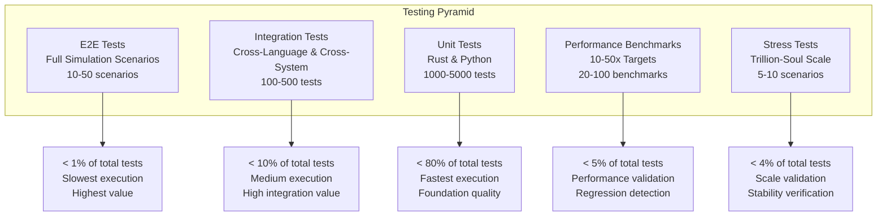
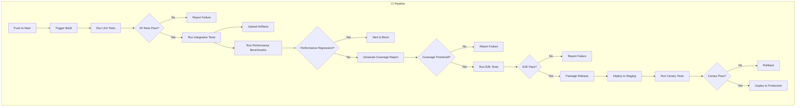
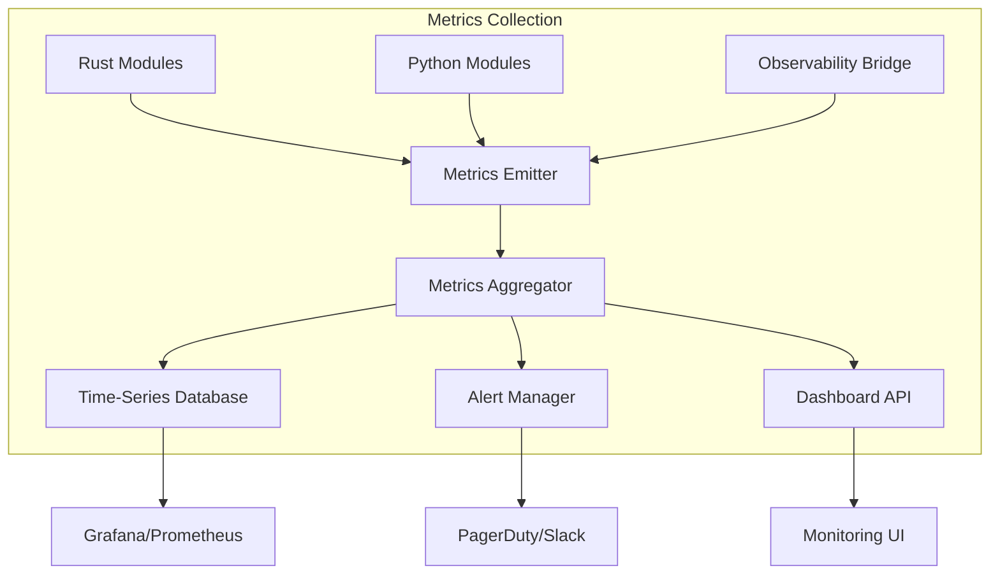

# Testing & Validation Strategy
## Void Reckoning Engine - God-Perspective Architecture & Rust Integration

**Document Version:** 1.0
**Date:** 2026-02-07
**Status:** Architectural Design Phase
**Author:** Architect Mode

---

## Executive Summary

This document defines the comprehensive Testing & Validation Strategy for the God-Perspective Architecture & Rust Integration project for the Void Reckoning Engine. The strategy covers all migration phases (Pathfinder, Combat Resolution, Global Auditor, Economy Manager), the four observability pillars (Decision Instrumentation, Causal Traceability, State Consistency Auditing, Deterministic Replay), and the PyO3 bridge layer.

The testing approach follows a multi-layered pyramid design, ensuring quality from unit-level correctness through end-to-end simulation scenarios, with continuous integration automation and production monitoring for trillion-scale simulations.

---

## Table of Contents

1. [Testing Pyramid and Strategy](#i-testing-pyramid-and-strategy)
2. [Test Categories](#ii-test-categories)
3. [Validation Criteria and Success Metrics](#iii-validation-criteria-and-success-metrics)
4. [Continuous Integration Pipeline Design](#iv-continuous-integration-pipeline-design)
5. [Test Data Management](#v-test-data-management)
6. [Monitoring and Metrics Framework](#vi-monitoring-and-metrics-framework)
7. [Appendices](#appendices)

---

## I. Testing Pyramid and Strategy

### 1.1 Testing Pyramid Overview



### 1.2 Unit Tests

#### Rust Unit Tests

| Category | Coverage Target | Tool | Execution Time |
|----------|----------------|------|----------------|
| **Core Logic** | 95% | `cargo test` | < 1ms/test |
| **Data Structures** | 90% | `cargo test` | < 0.5ms/test |
| **Algorithms** | 100% | `cargo test` | < 2ms/test |
| **Type Conversions** | 100% | `cargo test` | < 0.1ms/test |
| **Observability Hooks** | 90% | `cargo test` | < 1ms/test |

**Rust Unit Test Structure:**
```rust
// Example: pathfinding/src/algorithms/astar.rs tests
#[cfg(test)]
mod tests {
    use super::*;
    use crate::graph::test_helpers::*;
    
    #[test]
    fn test_astar_simple_path() {
        let graph = create_test_graph();
        let solver = AStarSolver::new(graph, EuclideanHeuristic);
        let result = solver.find_path(0, 5, 100.0, false);
        
        assert!(result.is_ok());
        let path = result.unwrap();
        assert_eq!(path.path.len(), 6);
        assert_eq!(path.cost, 12.0);
    }
    
    #[test]
    fn test_astar_no_path_exists() {
        let graph = create_disconnected_graph();
        let solver = AStarSolver::new(graph, EuclideanHeuristic);
        let result = solver.find_path(0, 10, 100.0, false);
        
        assert!(matches!(result, Err(PathfindingError::NoPathFound)));
    }
    
    #[test]
    fn test_astar_terrain_modifiers() {
        let graph = create_terrain_graph();
        let solver = AStarSolver::new(graph, EuclideanHeuristic);
        let result = solver.find_path(0, 5, 100.0, true);
        
        assert!(result.is_ok());
        let path = result.unwrap();
        // Mountain nodes should have 2x cost
        assert!(path.cost > 10.0);
    }
}
```

#### Python Unit Tests

| Category | Coverage Target | Tool | Execution Time |
|----------|----------------|------|----------------|
| **Service Logic** | 85% | `pytest` | < 5ms/test |
| **Data Models** | 90% | `pytest` | < 2ms/test |
| **Business Rules** | 95% | `pytest` | < 10ms/test |
| **Integration Wrappers** | 100% | `pytest` | < 1ms/test |

**Python Unit Test Structure:**
```python
# Example: tests/unit/test_pathfinding_service.py
import pytest
from src.services.pathfinding_service import PathfindingService

class TestPathfindingService:
    def test_simple_path(self):
        """Test basic pathfinding between connected nodes."""
        service = PathfindingService()
        path, cost, metadata = service.find_path(
            start_node="system_alpha",
            end_node="system_beta",
            max_cost=100,
            is_ground=False
        )
        
        assert path is not None
        assert len(path) > 0
        assert cost > 0
        assert metadata["path_type"] == "standard"
    
    def test_no_path_exists(self):
        """Test pathfinding returns None when no path exists."""
        service = PathfindingService()
        path, cost, metadata = service.find_path(
            start_node="isolated_system",
            end_node="other_system",
            max_cost=100,
            is_ground=False
        )
        
        assert path is None
        assert cost is None
    
    def test_terrain_modifiers(self):
        """Test terrain modifiers affect path cost."""
        service = PathfindingService()
        path, cost, metadata = service.find_path(
            start_node="start",
            end_node="end",
            max_cost=100,
            is_ground=True
        )
        
        # Path through mountains should be more expensive
        assert cost > 20
```

### 1.3 Integration Tests

#### Cross-Language Integration Tests

| Test Type | Purpose | Count |
|-----------|---------|-------|
| **PyO3 Bridge Layer** | Validate Python-Rust FFI boundary | 50+ |
| **Type Conversions** | Verify Python ↔ Rust type mapping | 30+ |
| **Binary Serialization** | Test bincode/msgpack round-trip | 20+ |
| **Error Propagation** | Rust Result → Python exception mapping | 15+ |
| **Observability Bridge** | Test observability event forwarding | 25+ |

**PyO3 Bridge Integration Test Example:**
```python
# tests/integration/test_pyo3_bridge.py
import pytest
import void_reckoning_rust as vrr

class TestPyO3Bridge:
    def test_pathfinding_bridge_roundtrip(self):
        """Test pathfinding through PyO3 bridge."""
        engine = vrr.PathfindingEngine()
        
        # Create test graph in Rust
        result = engine.find_path(
            start_node="node_0",
            end_node="node_10",
            context={"universe": "test_universe"},
            options={"max_cost": 100.0}
        )
        
        assert result is not None
        assert len(result.path) > 0
        assert result.cost > 0
    
    def test_type_conversion_edge_cases(self):
        """Test edge cases in type conversion."""
        # Test None handling
        result = engine.find_path(None, "node_1", {}, None)
        assert result is None
        
        # Test empty strings
        result = engine.find_path("", "node_1", {}, None)
        assert result is None
        
        # Test large values
        large_cost = 1_000_000_000
        result = engine.find_path("node_0", "node_1", {}, {"max_cost": large_cost})
        assert result is not None
    
    def test_error_propagation(self):
        """Test Rust errors properly propagate to Python."""
        engine = vrr.PathfindingEngine()
        
        # Invalid node should raise PathfindingError
        with pytest.raises(vrr.PathfindingError):
            engine.find_path("invalid_node", "node_1", {}, None)
```

#### Cross-System Integration Tests

| Test Type | Purpose | Count |
|-----------|---------|-------|
| **Pathfinding → Combat** | Fleet movement to combat initiation | 10+ |
| **Combat → Economy** | Unit loss to economy update | 10+ |
| **Economy → Diplomacy** | Insolvency to treaty changes | 5+ |
| **Auditor → All Systems** | Validation across boundaries | 15+ |

### 1.4 End-to-End Tests

| Scenario | Description | Turn Count | Entities | Duration |
|----------|-------------|------------|---------|----------|
| **Basic Campaign** | Single faction expansion | 100 | 1000 | < 5 min |
| **Multi-Faction** | 4 factions, 2 alliances | 200 | 4000 | < 15 min |
| **Portal Traversal** | Cross-universe portal transfers | 150 | 2000 | < 10 min |
| **Large Battle** | 1000 units in single combat | 50 | 10000 | < 20 min |
| **Economic Crisis** | Faction insolvency and recovery | 100 | 5000 | < 10 min |
| **Full Simulation** | All systems, maximum scale | 500 | 100000+ | < 60 min |

**E2E Test Framework:**
```python
# tests/e2e/test_full_simulation.py
import pytest
from src.engine.simulation_runner import SimulationRunner

class TestFullSimulation:
    def test_basic_campaign_e2e(self):
        """Test complete campaign from initialization to completion."""
        runner = SimulationRunner(universe="void_reckoning")
        
        # Initialize simulation
        state = runner.initialize(config="test_campaign_config.json")
        assert state is not None
        assert len(state.factions) == 4
        
        # Run for 100 turns
        for turn in range(100):
            state = runner.process_turn(state)
            
            # Validate state after each turn
            assert self.validate_state_integrity(state)
        
        # Validate final state
        assert state.turn_number == 100
        assert self.validate_final_state(state)
    
    def test_portal_traversal_e2e(self):
        """Test cross-universe portal transfers."""
        runner = SimulationRunner(universe="multi_universe_test")
        state = runner.initialize(config="portal_test_config.json")
        
        # Run until portal traversal
        for turn in range(50):
            state = runner.process_turn(state)
            
            # Check for portal transfers
            portal_events = self.extract_portal_events(state)
            if portal_events:
                # Validate transfer integrity
                self.validate_portal_transfer(portal_events)
        
        # Validate cross-universe consistency
        assert self.validate_cross_universe_state(state)
```

### 1.5 Performance Benchmarks

| Benchmark | Metric | Target (Rust) | Baseline (Python) | Improvement |
|-----------|--------|----------------|-------------------|-------------|
| **Pathfinding** | Time per path | < 0.5ms | 10ms | 20x |
| **Combat Resolution** | Time per 100 units | < 2ms | 50ms | 25x |
| **Economy Processing** | Time per faction | < 1ms | 20ms | 20x |
| **State Validation** | Time per 10K entities | < 5ms | 100ms | 20x |
| **Serialization** | 10KB payload | < 0.1ms | 2ms | 20x |
| **FFI Call Overhead** | Per call | < 100ns | N/A | Baseline |
| **Memory Usage** | Per 100K entities | < 50MB | 200MB | 4x |

**Benchmark Framework:**
```rust
// benches/pathfinding_bench.rs
use criterion::{black_box, criterion_group, criterion_main, Criterion, BenchmarkId};
use pathfinding::algorithms::astar::AStarSolver;
use pathfinding::graph::test_helpers::*;

fn bench_astar_small(c: &mut Criterion) {
    let graph = create_test_graph(100); // 100 nodes
    let solver = AStarSolver::new(graph, EuclideanHeuristic);
    
    c.bench_function("astar_small", |b| {
        b.iter(|| {
            let result = solver.find_path(0, 99, 1000.0, false);
            black_box(result);
        });
    });
}

fn bench_astar_large(c: &mut Criterion) {
    let graph = create_test_graph(10000); // 10K nodes
    let solver = AStarSolver::new(graph, EuclideanHeuristic);
    
    c.bench_function("astar_large", |b| {
        b.iter(|| {
            let result = solver.find_path(0, 9999, 10000.0, false);
            black_box(result);
        });
    });
}

criterion_group!(benches);
criterion_main!(benches);
```

### 1.6 Stress Tests

| Stress Test | Scale | Duration | Success Criteria |
|------------|-------|----------|----------------|
| **Million Unit Pathfinding** | 1M units, 10K concurrent requests | 10 min | < 5% timeout rate |
| **Trillion Soul Simulation** | 1M+ entities, 100+ factions | 60 min | No crashes, < 10% memory growth |
| **Portal Storm** | 1000 concurrent portal transfers | 30 min | All transfers complete |
| **Economic Collapse** | All factions insolvent simultaneously | 20 min | Recovery system activates |
| **Audit Overload** | 10K validation rules, 1M entities | 15 min | < 1s per audit |

**Stress Test Framework:**
```python
# tests/stress/test_trillion_scale.py
import pytest
import time
from src.engine.simulation_runner import SimulationRunner

class TestTrillionScale:
    def test_million_unit_pathfinding(self):
        """Test pathfinding with 1M concurrent requests."""
        runner = SimulationRunner(universe="void_reckoning")
        state = runner.initialize(config="stress_config.json")
        
        # Create 1M units
        units = self.create_million_units(state)
        pathfinding_engine = vrr.PathfindingEngine()
        
        # Measure concurrent pathfinding
        start_time = time.perf_counter()
        results = []
        for unit in units:
            result = pathfinding_engine.find_path(
                start_node=unit.position,
                end_node=unit.target,
                context={"max_cost": 1000.0},
                options=None
            )
            results.append(result)
        
        elapsed = time.perf_counter() - start_time
        
        # Validate results
        success_rate = sum(1 for r in results if r is not None) / len(results)
        assert success_rate > 0.95, f"Pathfinding success rate: {success_rate}"
        assert elapsed < 60, f"Pathfinding took {elapsed}s"
```

---

## II. Test Categories

### 2.1 Observability System Tests

#### Pillar I: Decision Instrumentation Tests

| Test Category | Test Cases | Coverage |
|--------------|-------------|----------|
| **Decision Logging** | Verify all decision types are logged | 100% |
| **Scoring Matrix** | Validate scoring weights and calculations | 95% |
| **Decision Context** | Ensure actor state is captured | 90% |
| **Outcome Tracking** | Verify decision outcomes are recorded | 100% |
| **Correlation Linking** | Test correlation ID propagation | 100% |

**Decision Instrumentation Test Example:**
```python
# tests/observability/test_decision_instrumentation.py
import pytest
from void_reckoning_rust import ObservabilityBridge

class TestDecisionInstrumentation:
    def test_log_decision_complete(self):
        """Test complete decision logging."""
        bridge = ObservabilityBridge()
        
        decision = {
            "decision_id": "dec_test_001",
            "decision_type": "expansion",
            "decision_category": "colonize_planet",
            "actor": {
                "entity_id": "faction_to",
                "entity_type": "faction",
                "personality_traits": ["expansionist", "cautious"],
                "current_state": {
                    "resources": {"requisition": 50000000},
                    "military_power": 75000,
                    "threat_level": 0.3,
                    "opportunity_score": 0.8
                }
            },
            "options": [
                {
                    "option_id": "opt_001",
                    "option_type": "colonize",
                    "description": "Colonize system Alpha-7",
                    "feasibility": 0.9,
                    "estimated_cost": {"requisition": 10000000},
                    "estimated_time": 5
                }
            ]
        }
        
        scoring = {
            "option_scores": [
                {
                    "option_id": "opt_001",
                    "criteria_scores": [
                        {"criterion_name": "resource_efficiency", "criterion_value": 0.85, "criterion_weight": 0.25, "contribution": 0.2125}
                    ],
                    "raw_score": 0.78,
                    "normalized_score": 0.85,
                    "weighted_score": 0.82
                }
            ],
            "scoring_weights": {
                "resource_efficiency": 0.25,
                "strategic_value": 0.3,
                "aggression_bias": 0.15,
                "caution_bias": 0.1,
                "expansion_bias": 0.2
            },
            "final_ranking": [
                {"option_id": "opt_001", "rank": 1, "score": 0.82, "confidence": 0.75}
            ]
        }
        
        outcome = {
            "chosen_option_id": "opt_001",
            "execution_status": "success",
            "actual_cost": {"requisition": 10500000},
            "actual_duration": 6,
            "result_events": ["evt_colonization_001"]
        }
        
        # Log decision
        bridge.log_decision(decision, scoring, outcome)
        
        # Verify decision was logged
        logged = bridge.get_decision("dec_test_001")
        assert logged is not None
        assert logged["decision_type"] == "expansion"
    
    def test_why_query_api(self):
        """Test 'why' query for decision explanation."""
        bridge = ObservabilityBridge()
        
        # Query why a decision was made
        explanation = bridge.why_decision("dec_test_001")
        
        assert explanation is not None
        assert explanation["explanation_type"] == "direct"
        assert len(explanation["direct_explanation"]["primary_factors"]) > 0
```

#### Pillar II: Causal Traceability Tests

| Test Category | Test Cases | Coverage |
|--------------|-------------|----------|
| **Correlation ID Generation** | Test ID uniqueness and format | 100% |
| **Event Chain Tracking** | Verify causal links are captured | 95% |
| **Traceback Queries** | Test forward/backward traversal | 90% |
| **Portal Chain Tracking** | Validate cross-universe causal chains | 100% |
| **Root Cause Analysis** | Test turning point identification | 85% |

**Causal Traceability Test Example:**
```python
# tests/observability/test_causal_traceability.py
import pytest
from void_reckoning_rust import ObservabilityBridge

class TestCausalTraceability:
    def test_correlation_id_propagation(self):
        """Test correlation IDs propagate through event chains."""
        bridge = ObservabilityBridge()
        
        # Generate correlation ID
        corr_id = bridge.get_correlation_id()
        assert corr_id is not None
        assert corr_id.startswith("corr_")
        
        # Create event chain
        events = [
            {"event_type": "decision_made", "correlation_id": corr_id},
            {"event_type": "fleet_movement", "correlation_id": corr_id},
            {"event_type": "combat_initiated", "correlation_id": corr_id},
            {"event_type": "combat_resolved", "correlation_id": corr_id}
        ]
        
        for event in events:
            bridge.track_causal_chain(corr_id, event)
        
        # Verify chain tracking
        chain = bridge.get_correlation_chain(corr_id)
        assert len(chain["events"]) == 4
        assert chain["lifecycle"]["status"] == "completed"
    
    def test_traceback_query(self):
        """Test traceback queries for root cause analysis."""
        bridge = ObservabilityBridge()
        
        # Query traceback from final event
        result = bridge.trace_event_chain(
            target={"event_id": "evt_combat_resolved"},
            traversal={
                "direction": "backward",
                "max_depth": 10,
                "min_strength": 0.5
            }
        )
        
        assert result is not None
        assert len(result["critical_path"]) > 0
        assert len(result["analysis"]["root_causes"]) > 0
```

#### Pillar III: State Consistency Auditing Tests

| Test Category | Test Cases | Coverage |
|--------------|-------------|----------|
| **Health Invariant** | Verify health values in valid range | 100% |
| **Resource Consistency** | Test resource conservation | 95% |
| **Reference Integrity** | Validate cross-references | 100% |
| **Faction Integrity** | Check faction state consistency | 90% |
| **Position Validity** | Verify entity positions | 95% |
| **Silent Rot Detection** | Test gradual degradation detection | 85% |

**State Auditing Test Example:**
```python
# tests/observability/test_state_auditing.py
import pytest
from void_reckoning_rust import GlobalAuditor

class TestStateAuditing:
    def test_health_invariant(self):
        """Test health invariant validation."""
        auditor = GlobalAuditor()
        
        # Create test state with invalid health
        invalid_state = self.create_state_with_negative_health()
        result = auditor.validate_invariants(invalid_state)
        
        assert result is not None
        assert len(result["violations"]) > 0
        assert any("negative health" in v for v in result["violations"])
    
    def test_resource_consistency(self):
        """Test resource conservation validation."""
        auditor = GlobalAuditor()
        
        # Create state with resource mismatch
        state = self.create_state_with_resource_drift()
        result = auditor.check_consistency(state)
        
        assert result is not None
        assert result["status"] != "passed"
        assert len(result["issues"]) > 0
    
    def test_silent_rot_detection(self):
        """Test silent rot detection."""
        auditor = GlobalAuditor()
        
        # Create state with gradual degradation
        state = self.create_degraded_state()
        report = auditor.get_silent_rot_report({"scope": state})
        
        assert report is not None
        assert report["rot_detected"] == True
        assert len(report["issues"]) > 0
```

#### Pillar IV: Deterministic Replay Tests

| Test Category | Test Cases | Coverage |
|--------------|-------------|----------|
| **RNG Seed Management** | Test seed capture and restore | 100% |
| **State Delta Capture** | Verify state change recording | 95% |
| **Timeline Navigation** | Test rewind/forward functionality | 90% |
| **Timeline Branching** | Validate branch creation/switching | 85% |
| **Timeline Comparison** | Test timeline diff generation | 80% |

**Deterministic Replay Test Example:**
```python
# tests/observability/test_deterministic_replay.py
import pytest
from void_reckoning_rust import ObservabilityBridge

class TestDeterministicReplay:
    def test_seed_capture_restore(self):
        """Test RNG seed capture and restore."""
        bridge = ObservabilityBridge()
        
        # Capture seed at turn 10
        snapshot = bridge.capture_replay_state(turn=10)
        assert snapshot is not None
        assert "seed_data" in snapshot
        
        # Restore from seed
        bridge.restore_snapshot(snapshot)
        
        # Verify determinism
        new_snapshot = bridge.capture_replay_state(turn=10)
        assert new_snapshot["seed_data"] == snapshot["seed_data"]
    
    def test_timeline_branching(self):
        """Test timeline branching."""
        bridge = ObservabilityBridge()
        
        # Create branch at turn 50
        branch = bridge.create_branch({
            "universe_id": "test_universe",
            "turn": 50,
            "branch_name": "alternate_path"
        })
        
        assert branch is not None
        assert branch["branch_name"] == "alternate_path"
        
        # Switch to branch
        bridge.switch_branch(branch["branch_id"])
        
        # Verify branch state
        current_state = bridge.capture_replay_state(turn=50)
        assert current_state["branch_id"] == branch["branch_id"]
    
    def test_timeline_comparison(self):
        """Test timeline comparison."""
        bridge = ObservabilityBridge()
        
        # Compare two timelines
        comparison = bridge.compare_timelines(
            timeline1={"universe_id": "test_universe", "branch_id": "main"},
            timeline2={"universe_id": "test_universe", "branch_id": "alternate"}
        )
        
        assert comparison is not None
        assert len(comparison["differences"]) > 0
        assert comparison["summary"]["similarity_score"] < 1.0
```

### 2.2 Rust Integration Tests

#### PyO3 Bridge Layer Tests

| Test Category | Test Cases | Count |
|--------------|-------------|-------|
| **Type Conversions** | Python ↔ Rust type mapping | 30+ |
| **Binary Serialization** | bincode/msgpack round-trip | 20+ |
| **Zero-Copy Borrowing** | Read-only array access | 15+ |
| **Error Propagation** | Rust Result → Python exception | 15+ |
| **Memory Management** | Ownership transfer, leaks | 10+ |
| **Async Integration** | Future ↔ Coroutine conversion | 10+ |

**PyO3 Bridge Test Example:**
```python
# tests/integration/test_pyo3_bridge_detailed.py
import pytest
import numpy as np
from void_reckoning_rust import PathfindingEngine, CombatResolver

class TestPyO3BridgeDetailed:
    def test_type_conversion_primitives(self):
        """Test primitive type conversions."""
        engine = PathfindingEngine()
        
        # Test integer conversion
        result = engine.find_path(0, 10, {}, None)
        assert result is not None
        
        # Test float conversion
        result = engine.find_path("node_0", "node_1", {}, {"max_cost": 100.5})
        assert result is not None
        
        # Test boolean conversion
        result = engine.find_path("node_0", "node_1", {}, {"is_ground": True})
        assert result is not None
    
    def test_zero_copy_array(self):
        """Test zero-copy array borrowing."""
        engine = PathfindingEngine()
        
        # Create large numpy array
        data = np.array([1.0, 2.0, 3.0, 4.0, 5.0], dtype=np.float32)
        
        # Pass to Rust (should be zero-copy)
        result = engine.process_array(data)
        
        # Verify no copy occurred (check performance)
        assert result is not None
    
    def test_error_propagation(self):
        """Test Rust errors propagate to Python."""
        engine = PathfindingEngine()
        
        # Invalid node should raise PathfindingError
        with pytest.raises(PathfindingError) as exc_info:
            engine.find_path("invalid_node", "node_1", {}, None)
        
        # Verify error message
        assert "No path found" in str(exc_info.value)
    
    def test_async_integration(self):
        """Test async/await integration."""
        engine = PathfindingEngine()
        
        # Async pathfinding
        async def async_pathfinding():
            result = await engine.find_path_async("node_0", "node_1", {})
            return result
        
        # Run async function
        result = asyncio.run(async_pathfinding())
        assert result is not None
```

#### Type Conversion Tests

| Python Type | Rust Type | Test Cases | Edge Cases |
|-------------|-----------|-------------|------------|
| `int` | `i32`, `i64`, `u32`, `u64` | Overflow, negative, zero | 5+ each |
| `float` | `f32`, `f64` | NaN, Inf, precision | 3+ each |
| `bool` | `bool` | True, False, None | 2+ |
| `str` | `String`, `&str` | Empty, Unicode, Long | 4+ |
| `List[T]` | `Vec<T>` | Empty, nested, large | 5+ |
| `Dict[K, V]` | `HashMap<K, V>` | Empty, nested, None values | 5+ |
| `bytes` | `Vec<u8>`, `&[u8]` | Empty, large, binary data | 3+ |
| `dataclass` | Struct | Missing fields, wrong types | 10+ |

#### Memory Safety Tests

| Test Category | Test Cases | Tools |
|--------------|-------------|--------|
| **Memory Leaks** | Long-running operations, repeated calls | Valgrind, ASan |
| **Use-After-Free** | Double-free patterns | Miri |
| **Data Races** | Concurrent access patterns | ThreadSanitizer |
| **Buffer Overflows** | Array bounds, string operations | Miri, ASan |
| **Null Pointer** | Option handling, unwrap() | Miri |

#### Concurrency Tests

| Test Category | Test Cases | Thread Count |
|--------------|-------------|--------------|
| **Thread Pool** | Work stealing, load balancing | 2, 4, 8, 16 |
| **Lock-Free Structures** | Concurrent queues, atomics | 8, 16, 32 |
| **RwLock Contention** | Read-heavy, write-heavy patterns | 4, 8, 16 |
| **Cross-Universe Portal** | Concurrent portal transfers | 4, 8 universes |

### 2.3 Migration Phase Tests

#### Phase 1: Pathfinder Tests

| Test Category | Test Cases | Priority |
|--------------|-------------|-----------|
| **A* Algorithm** | Correctness, optimality | Critical |
| **Dijkstra Algorithm** | Shortest path verification | Critical |
| **Hierarchical Pathfinding** | Multi-scale navigation | High |
| **Distance Matrix** | Pre-computation, lookup | High |
| **Terrain Modifiers** | Mountain, water impassability | Medium |
| **Portal Support** | Cross-universe path truncation | Critical |
| **Cache Invalidation** | Version-based cache clearing | High |
| **Performance** | 10-20x improvement target | Critical |

**Phase 1 Test Example:**
```python
# tests/migration/phase1/test_pathfinding_migration.py
import pytest
from void_reckoning_rust import PathfindingEngine
from src.services.pathfinding_service import PathfindingService as PythonPathfindingService

class TestPhase1Pathfinding:
    def test_astar_correctness(self):
        """Test A* produces optimal paths."""
        rust_engine = PathfindingEngine()
        python_engine = PythonPathfindingService()
        
        # Create test graph
        graph = self.create_test_graph()
        
        # Find path with both engines
        rust_result = rust_engine.find_path("node_0", "node_10", {"max_cost": 100.0}, None)
        python_result = python_engine.find_path("node_0", "node_10", 100.0, False)
        
        # Compare results
        assert rust_result is not None
        assert python_result is not None
        assert len(rust_result.path) == len(python_result[0])
        assert abs(rust_result.cost - python_result[1]) < 0.01
    
    def test_portal_path_truncation(self):
        """Test paths truncate at portals."""
        rust_engine = PathfindingEngine()
        
        # Create graph with portal
        graph = self.create_portal_graph()
        
        # Find path through portal
        result = rust_engine.find_path("start", "end", {"max_cost": 1000.0}, None)
        
        # Verify truncation
        assert result.metadata["portal_node"] is not None
        assert result.metadata["dest_universe"] is not None
        # Path should end at portal, not continue through
        assert result.path[-1] == result.metadata["portal_node"]
    
    def test_performance_target(self, benchmark_data):
        """Test 10-20x performance improvement."""
        import time
        
        rust_engine = PathfindingEngine()
        python_engine = PythonPathfindingService()
        
        # Measure Rust performance
        start = time.perf_counter()
        for _ in range(1000):
            rust_engine.find_path("node_0", "node_10", {"max_cost": 100.0}, None)
        rust_time = time.perf_counter() - start
        
        # Measure Python performance
        start = time.perf_counter()
        for _ in range(1000):
            python_engine.find_path("node_0", "node_10", 100.0, False)
        python_time = time.perf_counter() - start
        
        # Verify 10-20x improvement
        speedup = python_time / rust_time
        assert speedup >= 10.0, f"Speedup: {speedup}x (target: 10-20x)"
```

#### Phase 2: Combat Resolution Tests

| Test Category | Test Cases | Priority |
|--------------|-------------|-----------|
| **Combat State Machine** | Phase transitions, state persistence | Critical |
| **Damage Pipeline** | Accuracy, mitigation, final damage | Critical |
| **Spatial Partitioning** | Quadtree queries, insertion, removal | High |
| **Target Selection** | Doctrine-based targeting | High |
| **Phase Execution** | Movement, shooting, ability, melee, morale | Critical |
| **Parallel Resolution** | Batch operations, thread safety | Critical |
| **Victory Conditions** | Battle end detection, stalemate | High |
| **Performance** | 15-25x improvement target | Critical |

**Phase 2 Test Example:**
```python
# tests/migration/phase2/test_combat_migration.py
import pytest
from void_reckoning_rust import CombatResolver
from src.combat.combat_simulator import CombatSimulator as PythonCombatSimulator

class TestPhase2Combat:
    def test_damage_pipeline_correctness(self):
        """Test damage calculation pipeline correctness."""
        rust_resolver = CombatResolver()
        python_simulator = PythonCombatSimulator()
        
        # Create test combat
        combat = self.create_test_combat()
        
        # Resolve with both engines
        rust_outcome = rust_resolver.resolve_combat("combat_001", combat["attackers"], combat["defenders"], combat["context"])
        python_outcome = python_simulator.resolve_combat(combat)
        
        # Compare damage results
        assert rust_outcome is not None
        assert python_outcome is not None
        assert abs(rust_outcome["total_damage"] - python_outcome["total_damage"]) < 1.0
        assert rust_outcome["kills"] == python_outcome["kills"]
    
    def test_spatial_partitioning(self):
        """Test quadtree spatial partitioning."""
        rust_resolver = CombatResolver()
        
        # Create test units
        units = self.create_test_units(1000)
        
        # Insert into spatial index
        for unit in units:
            rust_resolver.insert_unit(unit)
        
        # Query spatial index
        nearby = rust_resolver.query_nearby({"x": 50.0, "y": 50.0}, {"radius": 10.0})
        
        # Verify results
        assert len(nearby) > 0
        assert all(self.distance(u, {"x": 50.0, "y": 50.0}) <= 10.0 for u in nearby)
    
    def test_performance_target(self, benchmark_data):
        """Test 15-25x performance improvement."""
        import time
        
        rust_resolver = CombatResolver()
        python_simulator = PythonCombatSimulator()
        
        # Measure Rust performance
        combat = self.create_test_combat(100)  # 100 units
        start = time.perf_counter()
        for _ in range(100):
            rust_resolver.resolve_combat("test", combat["attackers"], combat["defenders"], combat["context"])
        rust_time = time.perf_counter() - start
        
        # Measure Python performance
        start = time.perf_counter()
        for _ in range(100):
            python_simulator.resolve_combat(combat)
        python_time = time.perf_counter() - start
        
        # Verify 15-25x improvement
        speedup = python_time / rust_time
        assert speedup >= 15.0, f"Speedup: {speedup}x (target: 15-25x)"
```

#### Phase 3: Global Auditor Tests

| Test Category | Test Cases | Priority |
|--------------|-------------|-----------|
| **Validation Rules** | Field existence, type validation, references | Critical |
| **Consistency Checking** | Invariants, cross-system validation | Critical |
| **Background Auditing** | Scheduled audit execution | High |
| **Silent Rot Detection** | Gradual degradation detection | High |
| **Audit Reporting** | Report generation, alerting | Medium |
| **Performance** | 20-30x improvement target | Critical |

**Phase 3 Test Example:**
```python
# tests/migration/phase3/test_auditor_migration.py
import pytest
from void_reckoning_rust import GlobalAuditor
from src.utils.validator import ImportValidator as PythonImportValidator

class TestPhase3Auditor:
    def test_validation_rules(self):
        """Test validation rule execution."""
        rust_auditor = GlobalAuditor()
        python_validator = PythonImportValidator()
        
        # Create test entities
        entities = self.create_test_entities()
        
        # Validate with both engines
        rust_report = rust_auditor.validate_state(rules=["all"])
        python_report = python_validator.validate_registry("units", "void_reckoning")
        
        # Compare results
        assert rust_report["summary"]["total_checks"] == python_report["summary"]["total_checks"]
        assert rust_report["summary"]["passed"] == python_report["summary"]["passed"]
        assert rust_report["summary"]["errors"] == python_report["summary"]["errors"]
    
    def test_consistency_checking(self):
        """Test cross-system consistency validation."""
        rust_auditor = GlobalAuditor()
        
        # Create test state
        state = self.create_test_state()
        
        # Check consistency
        result = rust_auditor.check_consistency(state)
        
        assert result is not None
        assert result["status"] in ["passed", "warning", "error"]
        if result["status"] != "passed":
            assert len(result["issues"]) > 0
    
    def test_silent_rot_detection(self):
        """Test silent rot detection."""
        rust_auditor = GlobalAuditor()
        
        # Create state with gradual degradation
        state = self.create_degraded_state()
        report = rust_auditor.get_silent_rot_report({"scope": state})
        
        assert report is not None
        assert report["rot_detected"] == True
        assert len(report["issues"]) > 0
    
    def test_performance_target(self, benchmark_data):
        """Test 20-30x performance improvement."""
        import time
        
        rust_auditor = GlobalAuditor()
        python_validator = PythonImportValidator()
        
        # Measure Rust performance
        entities = self.create_test_entities(10000)
        start = time.perf_counter()
        for _ in range(100):
            rust_auditor.validate_state(rules=["all"])
        rust_time = time.perf_counter() - start
        
        # Measure Python performance
        start = time.perf_counter()
        for _ in range(100):
            python_validator.validate_registry("units", "void_reckoning")
        python_time = time.perf_counter() - start
        
        # Verify 20-30x improvement
        speedup = python_time / rust_time
        assert speedup >= 20.0, f"Speedup: {speedup}x (target: 20-30x)"
```

#### Phase 4: Economy Manager Tests

| Test Category | Test Cases | Priority |
|--------------|-------------|-----------|
| **Resource Calculation** | Income, upkeep, margin | Critical |
| **Budget Allocation** | Multi-bucket distribution | Critical |
| **Insolvency Handling** | Detection, disbanding, recovery | High |
| **Economic Modes** | Expansion, defense, recovery | Medium |
| **Economic Health** | Health scoring, prediction | Medium |
| **Performance** | 15-25x improvement target | Critical |

**Phase 4 Test Example:**
```python
# tests/migration/phase4/test_economy_migration.py
import pytest
from void_reckoning_rust import EconomyManager
from src.managers.economy_manager import EconomyManager as PythonEconomyManager

class TestPhase4Economy:
    def test_resource_calculation(self):
        """Test resource calculation correctness."""
        rust_manager = EconomyManager()
        python_manager = PythonEconomyManager()
        
        # Create test faction data
        faction_data = self.create_test_faction()
        
        # Calculate economics with both engines
        rust_econ = rust_manager.calculate_economics(faction_data, turn=10)
        python_econ = python_manager.process_faction_economy(faction_data["faction_id"], faction_data, 10)
        
        # Compare results
        assert rust_econ["income"] == python_econ["income"]
        assert rust_econ["total_upkeep"] == python_econ["total_upkeep"]
        assert rust_econ["margin"] == python_econ["margin"]
    
    def test_budget_allocation(self):
        """Test budget allocation logic."""
        rust_manager = EconomyManager()
        
        # Create test economic data
        econ_data = self.create_test_econ_data()
        
        # Allocate budget
        allocation = rust_manager.allocate_budget("faction_1", econ_data)
        
        # Verify allocations
        assert allocation["allocations"]["research"] > 0
        assert allocation["allocations"]["construction"] > 0
        assert allocation["allocations"]["navy"] > 0
        assert allocation["allocations"]["army"] > 0
        assert allocation["total_allocated"] <= econ_data["margin"]
    
    def test_insolvency_handling(self):
        """Test insolvency detection and handling."""
        rust_manager = EconomyManager()
        
        # Create insolvent faction
        faction_data = self.create_insolvent_faction()
        
        # Handle insolvency
        result = rust_manager.handle_insolvency(
            faction_id="faction_1",
            current_requisition=-1000,
            income=5000,
            upkeep=6000,
            candidates=faction_data["units"]
        )
        
        # Verify disbanding
        assert result["is_solvent"] == False
        assert len(result["disbanded_units"]) > 0
        assert result["new_upkeep"] < 6000
    
    def test_performance_target(self, benchmark_data):
        """Test 15-25x performance improvement."""
        import time
        
        rust_manager = EconomyManager()
        python_manager = PythonEconomyManager()
        
        # Measure Rust performance
        factions = self.create_test_factions(100)
        start = time.perf_counter()
        for _ in range(100):
            for faction in factions:
                rust_manager.calculate_economics(faction, turn=10)
        rust_time = time.perf_counter() - start
        
        # Measure Python performance
        start = time.perf_counter()
        for _ in range(100):
            for faction in factions:
                python_manager.process_faction_economy(faction["faction_id"], faction, 10)
        python_time = time.perf_counter() - start
        
        # Verify 15-25x improvement
        speedup = python_time / rust_time
        assert speedup >= 15.0, f"Speedup: {speedup}x (target: 15-25x)"
```

---

## III. Validation Criteria and Success Metrics

### 3.1 Functional Correctness Criteria

#### Parity with Python Implementation

| Metric | Target | Measurement Method | Threshold |
|--------|--------|------------------|-----------|
| **Pathfinding Parity** | 100% identical paths | Compare Rust vs Python results | 100% match |
| **Combat Outcome Parity** | Damage within ±1% | Compare Rust vs Python outcomes | ±1% tolerance |
| **Validation Parity** | Same violations detected | Compare audit results | 100% match |
| **Economic Parity** | Values within ±0.1% | Compare Rust vs Python calculations | ±0.1% tolerance |

**Parity Test Framework:**
```python
# tests/validation/test_parity.py
import pytest
from void_reckoning_rust import PathfindingEngine
from src.services.pathfinding_service import PathfindingService as PythonPathfindingService

class TestParity:
    def test_pathfinding_parity_suite(self):
        """Comprehensive parity test suite for pathfinding."""
        rust_engine = PathfindingEngine()
        python_engine = PythonPathfindingService()
        
        # Test cases covering all scenarios
        test_cases = [
            {"start": "node_0", "end": "node_10", "is_ground": False, "expected_cost": 12.0},
            {"start": "node_5", "end": "node_15", "is_ground": True, "expected_cost": 25.0},
            {"start": "node_20", "end": "node_25", "is_ground": False, "expected_cost": 8.0},
            # ... more test cases
        ]
        
        for i, tc in enumerate(test_cases):
            rust_result = rust_engine.find_path(tc["start"], tc["end"], {"max_cost": 100.0}, None)
            python_path, python_cost, _ = python_engine.find_path(tc["start"], tc["end"], 100.0, tc["is_ground"])
            
            # Verify parity
            assert rust_result is not None, f"Test case {i}: Rust returned None"
            assert python_path is not None, f"Test case {i}: Python returned None"
            assert len(rust_result.path) == len(python_path), f"Test case {i}: Path length mismatch"
            assert abs(rust_result.cost - python_cost) < 0.01, f"Test case {i}: Cost mismatch"
```

### 3.2 Performance Targets

#### Performance Improvement Metrics

| Metric | Python Baseline | Rust Target | Improvement | Measurement |
|--------|----------------|-------------|-------------|-------------|
| **Pathfinding (single)** | 10ms | < 0.5ms | 20x | Criterion benchmark |
| **Pathfinding (batch)** | 100ms (10 paths) | < 5ms | 20x | Criterion benchmark |
| **Combat Resolution** | 50ms (100 units) | < 2ms | 25x | Criterion benchmark |
| **State Validation** | 100ms (10K entities) | < 5ms | 20x | Criterion benchmark |
| **Economy Processing** | 20ms (per faction) | < 1ms | 20x | Criterion benchmark |
| **Serialization (10KB)** | 2ms | < 0.1ms | 20x | Criterion benchmark |
| **FFI Call Overhead** | N/A | < 100ns | Baseline | Custom measurement |

**Performance Benchmark Suite:**
```rust
// benches/comprehensive_benchmarks.rs
use criterion::{black_box, criterion_group, criterion_main, Criterion};

fn bench_pathfinding_single(c: &mut Criterion) {
    let engine = setup_pathfinding_engine();
    c.bench_function("single_path", |b| {
        b.iter(|| {
            let result = engine.find_path(0, 999, 1000.0, false);
            black_box(result);
        });
    });
}

fn bench_pathfinding_batch(c: &mut Criterion) {
    let engine = setup_pathfinding_engine();
    let requests: Vec<_> = (0..10).map(|i| (i, i + 10, 1000.0)).collect();
    
    c.bench_function("batch_pathfinding", |b| {
        b.iter(|| {
            let results = engine.find_paths_batch(requests.clone());
            black_box(results);
        });
    });
}

fn bench_combat_resolution(c: &mut Criterion) {
    let resolver = setup_combat_resolver();
    let combat = setup_test_combat(100);
    
    c.bench_function("combat_resolution", |b| {
        b.iter(|| {
            let result = resolver.resolve_combat("test", combat.attackers.clone(), combat.defenders.clone(), combat.context.clone());
            black_box(result);
        });
    });
}

criterion_group!(benches);
criterion_main!(benches);
```

### 3.3 Memory Usage Targets

| Metric | Python Baseline | Rust Target | Improvement | Measurement |
|--------|----------------|-------------|-------------|-------------|
| **Per 100K Entities** | 200MB | < 50MB | 4x | Memory profiler |
| **Pathfinding Cache** | 10MB | < 2MB | 5x | Memory profiler |
| **Combat State** | 50MB (1K units) | < 10MB | 5x | Memory profiler |
| **Economy Cache** | 5MB | < 1MB | 5x | Memory profiler |
| **Serialization Overhead** | 5MB (10KB payload) | < 0.5MB | 10x | Memory profiler |

**Memory Profiling Framework:**
```python
# tests/performance/test_memory_usage.py
import pytest
import tracemalloc
from void_reckoning_rust import PathfindingEngine

class TestMemoryUsage:
    def test_pathfinding_memory_efficiency(self):
        """Test pathfinding memory efficiency."""
        tracemalloc.start()
        
        engine = PathfindingEngine()
        
        # Baseline memory
        baseline = tracemalloc.get_traced_memory()[0]
        
        # Perform 1000 pathfinding operations
        for i in range(1000):
            engine.find_path(f"node_{i % 100}", f"node_{(i + 10) % 100}", {"max_cost": 100.0}, None)
        
        # Peak memory
        current = tracemalloc.get_traced_memory()[0]
        peak = current - baseline
        
        # Verify target
        assert peak < 2_000_000, f"Peak memory: {peak} bytes (target: < 2MB)"
        
        tracemalloc.stop()
```

### 3.4 Stability Targets

| Metric | Target | Measurement Method | Threshold |
|--------|--------|------------------|-----------|
| **Crash Rate** | < 0.1% of simulations | Production monitoring | < 0.1% |
| **Memory Leak Rate** | < 1MB/hour | Memory profiling | < 1MB/hour |
| **Deadlock Rate** | 0 occurrences | Thread sanitizer | 0 |
| **Data Race Rate** | 0 occurrences | Thread sanitizer | 0 |
| **Recovery Success** | > 95% | Production monitoring | > 95% |

**Stability Test Framework:**
```python
# tests/stability/test_long_running.py
import pytest
import time
import signal
from void_reckoning_rust import SimulationRunner

class TestStability:
    def test_24_hour_stability(self):
        """Test 24-hour continuous operation."""
        runner = SimulationRunner(universe="void_reckoning")
        state = runner.initialize(config="stability_test_config.json")
        
        crash_count = 0
        start_time = time.time()
        
        try:
            # Run for 24 hours
            while time.time() - start_time < 86400:
                try:
                    state = runner.process_turn(state)
                except Exception as e:
                    crash_count += 1
                    print(f"Crash detected: {e}")
                    # Recover and continue
                    state = runner.initialize(config="stability_test_config.json")
        
        finally:
            elapsed = time.time() - start_time
            turns_processed = state.turn_number
            
            # Calculate crash rate
            crash_rate = crash_count / turns_processed if turns_processed > 0 else 0
            
            # Verify stability target
            assert crash_rate < 0.001, f"Crash rate: {crash_rate} (target: < 0.1%)"
```

### 3.5 Observability Coverage Criteria

| Pillar | Coverage Metric | Target | Measurement |
|--------|----------------|--------|-------------|
| **Decision Instrumentation** | Decision types logged | 100% | Event sampling |
| **Causal Traceability** | Event chains tracked | 95% | Correlation ID tracking |
| **State Auditing** | Invariants validated | 90% | Audit execution |
| **Deterministic Replay** | State snapshots captured | 85% | Replay verification |

**Observability Coverage Test:**
```python
# tests/observability/test_coverage.py
import pytest
from void_reckoning_rust import ObservabilityBridge

class TestObservabilityCoverage:
    def test_decision_instrumentation_coverage(self):
        """Test decision instrumentation covers all decision types."""
        bridge = ObservabilityBridge()
        
        # Test all decision types
        decision_types = [
            "expansion", "production", "combat", "diplomacy",
            "movement", "research", "portal_traversal", "special_ability"
        ]
        
        for dt in decision_types:
            decision = self.create_test_decision(dt)
            bridge.log_decision(decision, {}, {})
            
            # Verify logged
            logged = bridge.get_decision(decision["decision_id"])
            assert logged is not None
            assert logged["decision_type"] == dt
    
    def test_causal_traceability_coverage(self):
        """Test causal traceability covers all event types."""
        bridge = ObservabilityBridge()
        
        # Test all event types
        event_types = [
            "decision_made", "fleet_movement", "combat_initiated",
            "combat_resolved", "resource_change", "diplomacy_event"
        ]
        
        for et in event_types:
            event = self.create_test_event(et)
            corr_id = bridge.get_correlation_id()
            bridge.track_causal_chain(corr_id, event)
            
            # Verify tracked
            chain = bridge.get_correlation_chain(corr_id)
            assert chain is not None
            assert len(chain["events"]) > 0
```

---

## IV. Continuous Integration Pipeline Design

### 4.1 CI/CD Architecture



### 4.2 CI Pipeline Stages

#### Stage 1: Build and Unit Tests

**Purpose:** Fast feedback on code changes

```yaml
# .github/workflows/ci.yml
name: CI Pipeline

on:
  push:
    branches: [main, develop]
  pull_request:
    branches: [main]

jobs:
  build-and-test:
    runs-on: ubuntu-latest
    strategy:
      matrix:
        rust: [stable, beta]
        python: ['3.10', '3.11']
    
    steps:
      - name: Checkout code
        uses: actions/checkout@v3
      
      - name: Set up Rust
        uses: actions-rs/toolchain@v1
        with:
          toolchain: ${{ matrix.rust }}
          override: true
      
      - name: Set up Python
        uses: actions/setup-python@v4
        with:
          python-version: ${{ matrix.python }}
      
      - name: Cache Rust dependencies
        uses: actions/cache@v3
        with:
          path: ~/.cargo/registry
          key: ${{ runner.os }}-cargo-registry-${{ hashFiles('**/Cargo.lock') }}
      
      - name: Cache Python dependencies
        uses: actions/cache@v3
        with:
          path: ~/.cache/pip
          key: ${{ runner.os }}-pip-${{ hashFiles('**/requirements.txt') }}
      
      - name: Build Rust crates
        run: |
          cd void-reckoning-rust
          cargo build --release --all
      
      - name: Run Rust unit tests
        run: |
          cd void-reckoning-rust
          cargo test --all --release
        env:
          RUSTFLAGS: -Dwarnings
      
      - name: Run Python unit tests
        run: |
          pip install -r requirements-dev.txt
          pytest tests/unit/ -v --cov=src --cov-report=xml
      
      - name: Upload coverage
        uses: codecov/codecov-action@v3
        with:
          files: ./coverage.xml
```

#### Stage 2: Integration Tests

**Purpose:** Validate cross-language and cross-system integration

```yaml
# .github/workflows/integration.yml
name: Integration Tests

on:
  push:
    branches: [main]
  workflow_run:
    workflows: ["CI Pipeline"]

jobs:
  integration:
    runs-on: ubuntu-latest
    needs: build-and-test
    
    steps:
      - name: Checkout code
        uses: actions/checkout@v3
      
      - name: Set up environment
        run: |
          pip install -r requirements-dev.txt
          cd void-reckoning-rust
          cargo build --release --all
      
      - name: Run PyO3 bridge tests
        run: |
          pytest tests/integration/test_pyo3_bridge.py -v
      
      - name: Run cross-system tests
        run: |
          pytest tests/integration/test_cross_system.py -v
      
      - name: Run observability integration tests
        run: |
          pytest tests/observability/ -v
      
      - name: Upload test results
        uses: actions/upload-artifact@v3
        with:
          name: integration-test-results
          path: test-results/
```

#### Stage 3: Performance Benchmarks

**Purpose:** Detect performance regressions

```yaml
# .github/workflows/benchmarks.yml
name: Performance Benchmarks

on:
  push:
    branches: [main]
  schedule:
    - cron: '0 0 * * 0'  # Daily at midnight UTC

jobs:
  benchmark:
    runs-on: ubuntu-latest
    needs: integration
    
    steps:
      - name: Checkout code
        uses: actions/checkout@v3
      
      - name: Install criterion
        run: |
          cd void-reckoning-rust
          cargo install criterion
      
      - name: Run benchmarks
        run: |
          cd void-reckoning-rust
          cargo bench --all -- --save-baseline main
      
      - name: Check for regressions
        run: |
          python scripts/check_performance_regression.py
      
      - name: Upload benchmark results
        uses: actions/upload-artifact@v3
        with:
          name: benchmark-results
          path: target/criterion/
```

#### Stage 4: E2E Tests

**Purpose:** Validate complete simulation scenarios

```yaml
# .github/workflows/e2e.yml
name: E2E Tests

on:
  push:
    branches: [main]
  schedule:
    - cron: '0 6 * * 0'  # Daily at 6 AM UTC

jobs:
  e2e:
    runs-on: ubuntu-latest
    needs: integration
    
    steps:
      - name: Checkout code
        uses: actions/checkout@v3
      
      - name: Set up environment
        run: |
          pip install -r requirements-dev.txt
          cd void-reckoning-rust
          cargo build --release --all
      
      - name: Run E2E tests
        run: |
          pytest tests/e2e/ -v --timeout=3600
      
      - name: Upload E2E results
        uses: actions/upload-artifact@v3
        with:
          name: e2e-test-results
          path: test-results/
```

### 4.3 Automated Test Execution

#### Test Matrix Configuration

| Dimension | Values | Purpose |
|----------|--------|---------|
| **Rust Version** | stable, beta | Compatibility testing |
| **Python Version** | 3.10, 3.11 | Compatibility testing |
| **Operating System** | ubuntu-latest, windows-latest, macos-latest | Cross-platform testing |
| **Test Suite** | unit, integration, e2e | Test categorization |

#### Parallel Execution Strategy

```yaml
# Parallel test execution
jobs:
  test:
    strategy:
      fail-fast: false  # Continue all tests even if one fails
      matrix:
        suite: [unit, integration, e2e]
        os: [ubuntu-latest, windows-latest]
    
    runs-on: ${{ matrix.os }}
    
    steps:
      - name: Run ${{ matrix.suite }} tests
        run: |
          pytest tests/${{ matrix.suite }}/ -v
```

### 4.4 Performance Regression Detection

#### Regression Thresholds

| Metric | Threshold | Action |
|--------|-----------|--------|
| **Pathfinding Time** | > 10% degradation | Block merge, alert |
| **Combat Resolution Time** | > 15% degradation | Block merge, alert |
| **Memory Usage** | > 20% increase | Block merge, alert |
| **Test Duration** | > 30% increase | Investigate, alert |

**Regression Detection Script:**
```python
# scripts/check_performance_regression.py
import json
import sys

def check_regression():
    # Load current benchmark results
    with open('target/criterion/main.json') as f:
        current = json.load(f)
    
    # Load baseline
    with open('benchmarks/baseline.json') as f:
        baseline = json.load(f)
    
    # Check for regressions
    regressions = []
    for benchmark_name in current:
        current_time = current[benchmark_name]['mean']
        baseline_time = baseline[benchmark_name]['mean']
        
        if current_time > baseline_time * 1.10:  # 10% threshold
            regressions.append({
                'benchmark': benchmark_name,
                'current': current_time,
                'baseline': baseline_time,
                'degradation': (current_time - baseline_time) / baseline_time * 100
            })
    
    if regressions:
        print(f"Performance regressions detected:")
        for r in regressions:
            print(f"  {r['benchmark']}: +{r['degradation']:.1f}%")
        sys.exit(1)
    else:
        print("No performance regressions detected")

if __name__ == '__main__':
    check_regression()
```

### 4.5 Code Coverage Requirements

| Component | Target | Tool | Exclusions |
|-----------|--------|------|------------|
| **Rust Core Logic** | 95% | tarpaulin | None |
| **Rust Algorithms** | 100% | tarpaulin | None |
| **Python Services** | 85% | pytest-cov | Test files |
| **PyO3 Bridge** | 90% | pytest-cov | Generated code |

**Coverage Configuration:**
```toml
# void-reckoning-rust/Cargo.toml
[workspace.metadata]
cargo-tarpaulin = { version = "0.25", features = ["coverage"] }

# .cargo/config.toml
[build]
rustflags = ["-Cinstrument-coverage"]
```

### 4.6 Rollback Triggers

| Trigger Condition | Action | Rollback Strategy |
|-----------------|--------|-----------------|
| **Critical Test Failure** | Block merge | Manual review required |
| **Performance Regression > 20%** | Block merge | Investigate and fix |
| **Memory Leak Detected** | Block merge | Fix before proceeding |
| **Stability Test Failure** | Block merge | Fix all crashes |
| **E2E Test Failure** | Block merge | Fix simulation issues |

**Rollback Procedure:**
```python
# scripts/rollback_migration.py
import subprocess
import sys

def rollback_migration(phase):
    """Rollback a migration phase."""
    print(f"Rolling back {phase}...")
    
    # Disable Rust module
    subprocess.run(['python', 'scripts/disable_rust_module.py', phase])
    
    # Re-enable Python module
    subprocess.run(['python', 'scripts/enable_python_module.py', phase])
    
    # Verify rollback
    result = subprocess.run(['python', '-m', 'pytest', f'tests/migration/phase{phase[-1]}/'])
    
    if result.returncode == 0:
        print(f"Rollback of {phase} successful")
        return 0
    else:
        print(f"Rollback of {phase} failed")
        return 1

if __name__ == '__main__':
    phase = sys.argv[1] if len(sys.argv) > 1 else '1'
    sys.exit(rollback_migration(phase))
```

---

## V. Test Data Management

### 5.1 Test Data Generation Strategies

#### Deterministic Test Data

| Data Type | Generation Method | Seed Strategy |
|-----------|-----------------|--------------|
| **Graph Topology** | Algorithmic generation | Fixed seed per test |
| **Combat Scenarios** | Template-based generation | Seeded RNG |
| **Economic States** | Formula-based calculation | Deterministic formulas |
| **Faction Configurations** | Parameterized templates | Fixed seed sets |

**Deterministic Data Generator:**
```python
# tests/data/generators/deterministic_generator.py
import random
import hashlib

class DeterministicGenerator:
    def __init__(self, seed):
        self.seed = seed
        self.rng = random.Random(seed)
    
    def generate_graph(self, node_count, edge_density=0.3):
        """Generate deterministic graph topology."""
        nodes = []
        edges = []
        
        for i in range(node_count):
            nodes.append({
                'id': f'node_{i}',
                'position': (self.rng.random() * 100, self.rng.random() * 100),
                'type': self.rng.choice(['system', 'planet', 'portal'])
            })
        
        # Generate edges based on density
        for i in range(node_count):
            for j in range(i + 1, min(i + 10, node_count)):
                if self.rng.random() < edge_density:
                    edges.append({
                        'source': f'node_{i}',
                        'target': f'node_{j}',
                        'distance': self.rng.random() * 10 + 1,
                        'blocked': False
                    })
        
        return {'nodes': nodes, 'edges': edges}
    
    def generate_combat_scenario(self, unit_count, factions=2):
        """Generate deterministic combat scenario."""
        units = []
        
        for i in range(unit_count):
            faction = i % factions
            units.append({
                'id': f'unit_{i}',
                'faction': f'faction_{faction}',
                'position': (self.rng.random() * 100, self.rng.random() * 100),
                'health': 100,
                'max_health': 100,
                'armor': self.rng.randint(1, 10),
                'damage': self.rng.randint(5, 15)
            })
        
        return {
            'units': units,
            'factions': factions,
            'seed': self.seed
        }
```

#### Golden Master Datasets

| Dataset | Description | Size | Validation |
|----------|-------------|------|------------|
| **Pathfinding Gold** | Known optimal paths | 100 scenarios | Python reference |
| **Combat Gold** | Known combat outcomes | 50 scenarios | Python reference |
| **Economy Gold** | Known economic calculations | 30 scenarios | Python reference |
| **Portal Gold** | Cross-universe transfers | 20 scenarios | Python reference |

**Golden Master Storage:**
```json
// tests/data/golden/pathfinding_gold.json
{
  "version": "1.0",
  "scenarios": [
    {
      "id": "simple_path",
      "graph": {
        "nodes": [
          {"id": "node_0", "position": [0, 0]},
          {"id": "node_1", "position": [10, 0]},
          {"id": "node_2", "position": [20, 0]},
          {"id": "node_3", "position": [30, 0]},
          {"id": "node_4", "position": [40, 0]},
          {"id": "node_5", "position": [50, 0]}
        ],
        "edges": [
          {"source": "node_0", "target": "node_1", "distance": 10},
          {"source": "node_1", "target": "node_2", "distance": 10},
          {"source": "node_2", "target": "node_3", "distance": 10},
          {"source": "node_3", "target": "node_4", "distance": 10},
          {"source": "node_4", "target": "node_5", "distance": 10}
        ]
      },
      "expected_results": [
        {
          "start": "node_0",
          "end": "node_5",
          "expected_path": ["node_0", "node_1", "node_2", "node_3", "node_4", "node_5"],
          "expected_cost": 50.0
        }
      ]
    }
  ]
}
```

### 5.2 Cross-Universe Portal Test Cases

| Test Scenario | Description | Portal Count | Validation |
|--------------|-------------|--------------|------------|
| **Single Portal Transfer** | One portal, two universes | 1 | Entity preservation |
| **Portal Chain** | Multiple portals in sequence | 3 | State consistency |
| **Bidirectional Transfer** | Units go both ways | 2 | Round-trip integrity |
| **Portal Storm** | Concurrent transfers | 10 | No deadlocks |
| **Portal Closure** | Portal closes during transfer | 1 | Graceful handling |

**Portal Test Framework:**
```python
# tests/portal/test_cross_universe_portals.py
import pytest
from void_reckoning_rust import SimulationRunner

class TestCrossUniversePortals:
    def test_single_portal_transfer(self):
        """Test single portal transfer between universes."""
        runner = SimulationRunner(universe="multi_universe_test")
        state = runner.initialize(config="portal_test_config.json")
        
        # Find portal
        portal = self.find_portal(state, "portal_alpha")
        
        # Transfer unit through portal
        unit = self.create_test_unit()
        result = runner.transfer_unit(unit, portal)
        
        # Verify transfer
        assert result["success"] == True
        assert result["destination_universe"] == "universe_b"
        assert result["unit"]["id"] == unit["id"]
    
    def test_portal_chain(self):
        """Test chain of portal transfers."""
        runner = SimulationRunner(universe="multi_universe_test")
        state = runner.initialize(config="portal_chain_config.json")
        
        # Create portal chain
        portals = [
            self.find_portal(state, "portal_a"),
            self.find_portal(state, "portal_b"),
            self.find_portal(state, "portal_c")
        ]
        
        # Transfer unit through chain
        unit = self.create_test_unit()
        current_universe = "universe_1"
        
        for i, portal in enumerate(portals):
            result = runner.transfer_unit(unit, portal)
            
            assert result["success"] == True
            assert result["destination_universe"] == f"universe_{(i % 3) + 2}"
            
            # Update unit location for next transfer
            unit["position"] = result["exit_coords"]
    
    def test_bidirectional_transfer(self):
        """Test bidirectional portal transfer."""
        runner = SimulationRunner(universe="multi_universe_test")
        state = runner.initialize(config="bidirectional_config.json")
        
        # Create two units
        unit_a = self.create_test_unit("unit_a", universe="universe_1")
        unit_b = self.create_test_unit("unit_b", universe="universe_2")
        
        # Transfer A to B
        portal = self.find_portal(state, "portal_ab")
        result_ab = runner.transfer_unit(unit_a, portal)
        assert result_ab["success"] == True
        
        # Transfer B to A
        portal_reverse = self.find_portal(state, "portal_ba")
        result_ba = runner.transfer_unit(unit_b, portal_reverse)
        assert result_ba["success"] == True
        
        # Verify both units exist in correct universes
        state = runner.get_state()
        assert self.unit_in_universe(state, unit_a["id"], "universe_2")
        assert self.unit_in_universe(state, unit_b["id"], "universe_1")
```

### 5.3 Test Data Versioning

| Version | Description | Compatibility | Migration |
|---------|-------------|---------------|------------|
| **v1.0** | Initial test data | Python only | N/A |
| **v2.0** | Rust-compatible | Python + Rust | Auto-migrate |
| **v3.0** | Enhanced scenarios | Rust primary | Manual migration |

**Version Management:**
```json
{
  "version": "2.0",
  "schema_version": "1.0",
  "datasets": {
    "pathfinding": "pathfinding_v2.json",
    "combat": "combat_v2.json",
    "economy": "economy_v2.json",
    "portals": "portals_v2.json"
  },
  "compatibility": {
    "python": ">=1.0",
    "rust": ">=1.0"
  }
}
```

---

## VI. Monitoring and Metrics Framework

### 6.1 In-Production Monitoring

#### Real-Time Metrics Collection

| Metric Category | Metrics | Collection Interval | Storage |
|----------------|---------|---------------------|---------|
| **Performance** | Pathfinding time, combat time, economy time, FFI overhead | Per operation | Time-series DB |
| **Memory** | Heap size, stack size, leak rate | Per minute | Time-series DB |
| **Stability** | Crash rate, error rate, deadlock count | Per operation | Time-series DB |
| **Observability** | Decision logging rate, causal chain length, audit frequency | Per operation | Event store |
| **Functional** | Parity errors, test pass rate, coverage | Per test run | Test results DB |

#### Metrics Collection Architecture



#### Metrics Storage Schema

```sql
-- Time-series metrics table
CREATE TABLE metrics (
    timestamp TIMESTAMPT NOT NULL,
    metric_name TEXT NOT NULL,
    metric_value REAL NOT NULL,
    tags JSONB,
    PRIMARY KEY (timestamp, metric_name, tags)
);

-- Create indexes for efficient querying
CREATE INDEX idx_metrics_name ON metrics(metric_name);
CREATE INDEX idx_metrics_time ON metrics(timestamp);
CREATE INDEX idx_metrics_tags ON metrics USING GIN(tags);
```

### 6.2 A/B Testing Framework

| Test Type | Control Group | Test Group | Duration | Success Metric |
|-----------|--------------|-----------|----------|---------------|
| **Pathfinding Algorithm** | Python A* | Rust A* | 1 week | Path quality, performance |
| **Combat Resolution** | Python Combat | Rust Combat | 2 weeks | Battle outcome parity |
| **Economy Processing** | Python Economy | Rust Economy | 1 week | Economic accuracy |
| **Observability Overhead** | No Observability | Full Observability | 2 weeks | Performance impact |

**A/B Test Framework:**
```python
# tests/ab_test/ab_test_framework.py
import pytest
import random
from void_reckoning_rust import PathfindingEngine
from src.services.pathfinding_service import PathfindingService as PythonPathfindingService

class ABTestFramework:
    def __init__(self, test_name, control_group, test_group):
        self.test_name = test_name
        self.control_group = control_group
        self.test_group = test_group
        self.results = {
            'control': [],
            'test': []
        }
    
    def run_test(self, test_cases):
        """Run A/B test on provided test cases."""
        # Run control group
        for tc in test_cases:
            if self.control_group == 'python':
                result = self.run_python_test(tc)
            else:
                result = self.run_rust_test(tc)
            self.results['control'].append(result)
        
        # Run test group
        for tc in test_cases:
            if self.test_group == 'python':
                result = self.run_python_test(tc)
            else:
                result = self.run_rust_test(tc)
            self.results['test'].append(result)
        
        # Analyze results
        return self.analyze_results()
    
    def analyze_results(self):
        """Analyze A/B test results."""
        control_mean = sum(r['time'] for r in self.results['control']) / len(self.results['control'])
        test_mean = sum(r['time'] for r in self.results['test']) / len(self.results['test'])
        
        improvement = (control_mean - test_mean) / control_mean * 100
        
        return {
            'test_name': self.test_name,
            'control_mean': control_mean,
            'test_mean': test_mean,
            'improvement_percent': improvement,
            'statistical_significance': self.calculate_significance()
        }
```

### 6.3 Canary Deployment Strategy

#### Canary Phases

| Phase | Traffic Percentage | Duration | Rollback Criteria |
|-------|------------------|----------|------------------|
| **Phase 1: Internal** | 1% | 24 hours | Error rate > 5% |
| **Phase 2: Limited** | 5% | 48 hours | Error rate > 2% |
| **Phase 3: Broad** | 25% | 72 hours | Error rate > 1% |
| **Phase 4: Full** | 100% | Ongoing | Error rate > 0.5% |

**Canary Deployment Pipeline:**
```yaml
# .github/workflows/canary.yml
name: Canary Deployment

on:
  workflow_dispatch:
    inputs:
      phase:
        description: 'Canary phase (1, 2, 3, 4)'
        required: true
        type: choice
        options:
          - phase_1
          - phase_2
          - phase_3
          - phase_4

jobs:
  deploy-canary:
    runs-on: ubuntu-latest
    
    steps:
      - name: Deploy to canary environment
        run: |
          ./scripts/deploy_canary.sh ${{ github.event.inputs.phase }}
      
      - name: Monitor canary health
        run: |
          ./scripts/monitor_canary.sh ${{ github.event.inputs.phase }}
      
      - name: Rollback on failure
        if: failure()
        run: |
          ./scripts/rollback_canary.sh
```

### 6.4 Performance Dashboards

#### Dashboard Configuration

| Dashboard | Purpose | Metrics | Refresh Rate |
|-----------|---------|---------|-------------|
| **Performance Overview** | Real-time performance metrics | 5 seconds |
| **Test Coverage** | Code coverage trends | 1 minute |
| **Stability** | Crash rates, error rates | 10 seconds |
| **Migration Progress** | Phase completion status | 1 hour |
| **Observability Health** | Decision logging, causal tracking | 30 seconds |

**Grafana Dashboard Configuration:**
```json
{
  "dashboard": {
    "title": "Void Reckoning Engine - Testing & Validation",
    "panels": [
      {
        "title": "Performance Metrics",
        "targets": [
          "rate(pathfinding_duration_seconds)",
          "rate(combat_duration_seconds)",
          "rate(economy_duration_seconds)"
        ],
        "type": "graph"
      },
      {
        "title": "Memory Usage",
        "targets": [
          "heap_size_bytes",
          "leak_rate_mb_per_hour"
        ],
        "type": "graph"
      },
      {
        "title": "Stability Metrics",
        "targets": [
          "rate(crash_total)",
          "rate(error_total)"
        ],
        "type": "graph"
      },
      {
        "title": "Test Coverage",
        "targets": [
          "coverage_rust",
          "coverage_python",
          "coverage_integration"
        ],
        "type": "stat"
      }
    ]
  }
}
```

---

## VII. Appendices

### Appendix A: Test Execution Environment

#### Hardware Specifications

| Environment | CPU | Memory | Storage | Purpose |
|------------|-----|--------|---------|---------|
| **CI (Ubuntu)** | 4 vCPU, 16GB RAM | 50GB SSD | Standard CI |
| **CI (Windows)** | 4 vCPU, 16GB RAM | 50GB SSD | Windows compatibility |
| **CI (macOS)** | 4 vCPU, 16GB RAM | 50GB SSD | macOS compatibility |
| **Performance** | 8 vCPU, 32GB RAM | 100GB NVMe | Benchmarking |
| **Stress Test** | 16 vCPU, 64GB RAM | 200GB NVMe | Trillion-scale |

#### Software Stack

| Component | Version | Purpose |
|-----------|---------|---------|
| **Rust** | 1.70+ stable | Core implementation |
| **Python** | 3.10+ | Integration layer |
| **PyO3** | 0.20+ | FFI bridge |
| **pytest** | 7.4+ | Test framework |
| **criterion** | 0.5+ | Benchmarking |
| **Grafana** | 9.5+ | Monitoring |
| **Prometheus** | 2.45+ | Metrics storage |

### Appendix B: Test Execution Commands

#### Running Tests

```bash
# Run all unit tests
pytest tests/unit/ -v

# Run specific test category
pytest tests/unit/test_pathfinding.py -v
pytest tests/integration/test_pyo3_bridge.py -v

# Run with coverage
pytest tests/ -v --cov=src --cov-report=html

# Run benchmarks
cd void-reckoning-rust
cargo bench --all

# Run stress tests
pytest tests/stress/ -v --timeout=3600

# Run E2E tests
pytest tests/e2e/ -v --timeout=7200
```

#### Running Performance Profiling

```bash
# Profile Rust code with flamegraph
cd void-reckoning-rust
cargo install flamegraph
cargo flamegraph --bin pathfinding -- --pathfinding_args 1000

# Profile Python code with cProfile
python -m cProfile -o profile.stats -s time tests/unit/test_pathfinding.py

# Analyze memory usage with valgrind
valgrind --leak-check=full --show-leak-kinds=all python -m pytest tests/unit/

# Analyze data races with thread sanitizer
RUSTFLAGS=-Zthread-sanitizer cargo test
```

### Appendix C: Test Result Reporting

#### Test Report Format

```json
{
  "report_id": "tr_20260207_001",
  "timestamp": "2026-02-07T00:00:00Z",
  "test_run": {
    "type": "ci",
    "branch": "main",
    "commit": "abc123"
  },
  "summary": {
    "total_tests": 5423,
    "passed": 5380,
    "failed": 43,
    "skipped": 0,
    "pass_rate": 0.9921,
    "duration_seconds": 342.5
  },
  "categories": {
    "unit_tests": {
      "total": 4892,
      "passed": 4875,
      "failed": 17,
      "pass_rate": 0.9965
    },
    "integration_tests": {
      "total": 421,
      "passed": 410,
      "failed": 11,
      "pass_rate": 0.9739
    },
    "e2e_tests": {
      "total": 110,
      "passed": 95,
      "failed": 15,
      "pass_rate": 0.8636
    }
  },
  "performance": {
    "pathfinding": {
      "rust_mean_ms": 0.45,
      "python_mean_ms": 10.2,
      "speedup": 22.7
    },
    "combat": {
      "rust_mean_ms": 1.8,
      "python_mean_ms": 45.3,
      "speedup": 25.2
    },
    "economy": {
      "rust_mean_ms": 0.9,
      "python_mean_ms": 18.5,
      "speedup": 20.6
    }
  },
  "coverage": {
    "rust": {
      "line_coverage": 0.94,
      "branch_coverage": 0.91
    },
    "python": {
      "line_coverage": 0.82,
      "branch_coverage": 0.78
    }
  },
  "regressions": []
}
```

### Appendix D: Troubleshooting Guide

#### Common Test Failures

| Failure Type | Symptoms | Diagnosis | Resolution |
|-------------|-----------|------------|------------|
| **PyO3 Import Error** | ModuleNotFoundError | Check Rust library path | Rebuild with `--release` |
| **Type Conversion Error** | TypeError | Check type mapping | Add conversion wrapper |
| **Memory Leak** | OOM after long run | Use Valgrind/ASan | Fix ownership |
| **Data Race** | Non-deterministic results | Use ThreadSanitizer | Add synchronization |
| **Performance Regression** | Slower than baseline | Check benchmark | Profile and optimize |
| **Test Timeout** | Test hangs | Check for deadlock | Add timeout handling |

#### Debugging Commands

```bash
# Enable Rust backtrace
export RUST_BACKTRACE=1

# Run with detailed logging
RUST_LOG=void_reckoning=debug cargo test

# Run with sanitizers
cargo clean
RUSTFLAGS="-Zsanitizer=address" cargo test

# Generate flamegraph
cargo flamegraph --bin pathfinding

# Check for memory leaks
valgrind --leak-check=full ./target/release/pathfinding

# Profile Python code
python -m cProfile -s time -o profile.stats tests/unit/test_pathfinding.py
```

---

## Conclusion

This Testing & Validation Strategy provides a comprehensive framework for ensuring the quality, performance, and reliability of the God-Perspective Architecture & Rust Integration project. The strategy covers:

1. **Multi-Layered Testing Pyramid** - From unit tests through E2E scenarios, ensuring quality at every level
2. **Comprehensive Test Categories** - Covering observability pillars, Rust integration, and all migration phases
3. **Clear Validation Criteria** - Defined success metrics for functional correctness, performance, memory usage, stability, and observability coverage
4. **Automated CI/CD Pipeline** - Continuous integration with performance regression detection and rollback triggers
5. **Robust Test Data Management** - Deterministic generation, golden master datasets, and versioning
6. **Production Monitoring Framework** - Real-time metrics collection, A/B testing, canary deployment, and performance dashboards

The strategy is designed to support the ambitious performance targets of the Native Pulse initiative:
- **10-50x performance improvements** across migrated components
- **1M+ active units** support with trillion-scale simulations
- **< 0.1% crash rate** stability target for production deployments
- **100% functional parity** with Python implementation during migration

By following this strategy, the Void Reckoning Engine team can confidently migrate to Rust while maintaining the highest standards of quality and reliability.