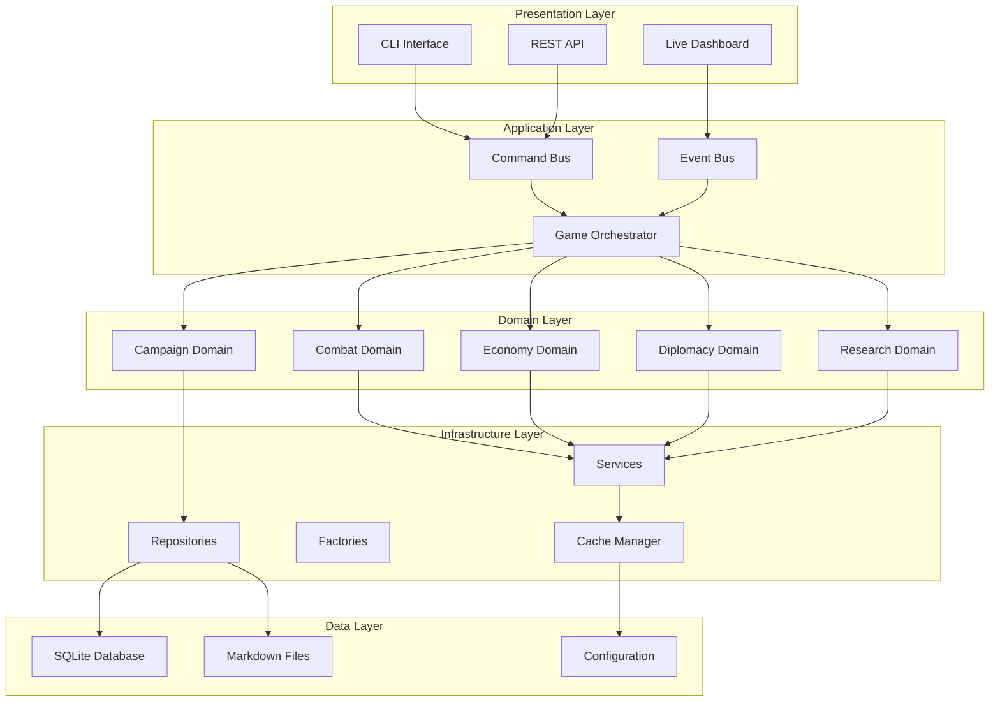
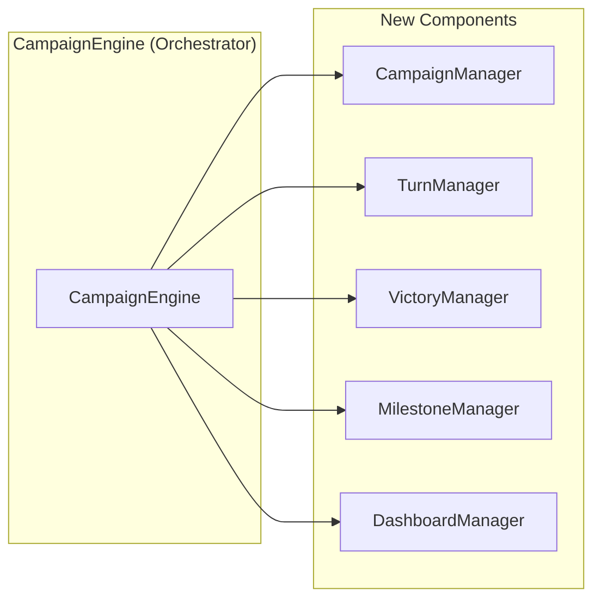
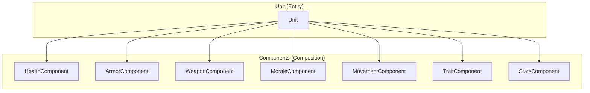
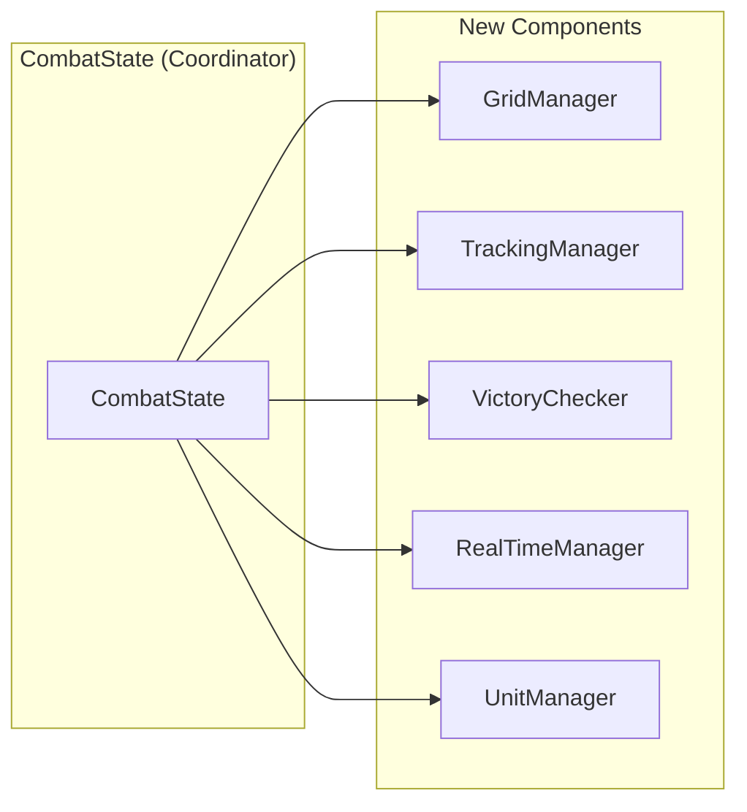
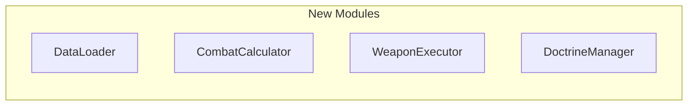
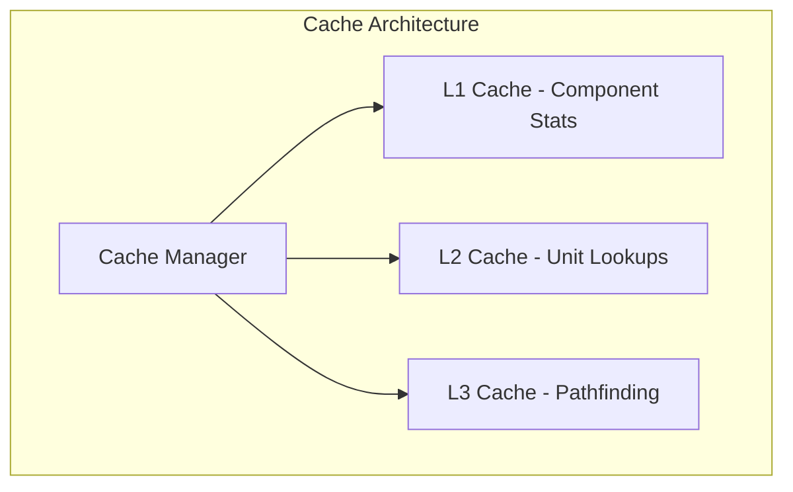

# Multi-Universe Strategy Engine - Architectural Refactoring Plan

**Version:** 1.0  
**Date:** 2026-01-31  
**Author:** Architect Mode Analysis

---

## Executive Summary

This document outlines a comprehensive architectural refactoring plan for Multi-Universe Strategy Engine. The current codebase suffers from several critical issues:

1. **God Classes** - CampaignEngine (1199 lines), Unit (739 lines), CombatState (673 lines)
2. **Code Duplication** - Damage calculations, database loading, stat recalculation
3. **Tight Coupling** - Circular dependencies between modules
4. **Missing Abstractions** - Lack of Command, Observer, Factory, Strategy, Repository patterns
5. **Anti-patterns** - Shotgun Surgery, Feature Envy, Long Parameter Lists, Data Clumps

The refactoring aims to create a clean, maintainable, and extensible architecture while preserving existing functionality.

---

## 1. Proposed New Architecture

### 1.1 High-Level Architecture Overview



### 1.2 Core Architectural Principles

1. **Separation of Concerns** - Each module has a single, well-defined responsibility
2. **Dependency Inversion** - Depend on abstractions, not concrete implementations
3. **Open/Closed Principle** - Open for extension, closed for modification
4. **Interface Segregation** - Small, focused interfaces
5. **Dependency Injection** - All dependencies injected via constructor or container
6. **Event-Driven** - Loose coupling through event bus pattern
7. **Service Locator** - Centralized access to manager services

### 1.3 Key Design Patterns to Implement

| Pattern | Purpose | Location |
|---------|---------|----------|
| Command | Encapsulate actions with undo/redo | `src/commands/` |
| Observer | Decouple dashboard from engine | `src/events/` |
| Factory | Object creation abstraction | `src/factories/` |
| Strategy | Pluggable algorithms | `src/strategies/` |
| Repository | Data access abstraction | `src/repositories/` |
| Builder | Complex object construction | `src/builders/` |
| Service Locator | Manager access | `src/core/service_locator.py` |
| Dependency Injection | Loose coupling | `src/core/di_container.py` |

---

## 2. Detailed Refactoring Strategies

### 2.1 CampaignEngine Refactoring

**Current Issues:**
- 1199 lines with multiple responsibilities
- Direct instantiation of managers
- Tight coupling to all subsystems
- Mixed concerns (state, accessors, logging, telemetry)

**Proposed Split:**



**New Classes:**

1. **`CampaignManager`** (`src/managers/campaign/campaign_manager.py`)
   - Manages campaign lifecycle
   - Handles campaign state persistence
   - Coordinates turn transitions

2. **`TurnManager`** (`src/managers/campaign/turn_manager.py`)
   - Extracted from `TurnProcessor`
   - Manages turn sequence
   - Coordinates phase execution

3. **`VictoryManager`** (`src/managers/campaign/victory_manager.py`)
   - Handles victory condition checking
   - Tracks faction progress
   - Manages end-game scenarios

4. **`MilestoneManager`** (`src/managers/campaign/milestone_manager.py`)
   - Tracks campaign milestones
   - Logs milestone events
   - Manages achievement-like tracking

5. **`DashboardManager`** (`src/managers/campaign/dashboard_manager.py`)
   - Handles dashboard attachment
   - Manages telemetry streaming
   - Abstracts dashboard communication

**Refactored CampaignEngine (Orchestrator):**

```python
# src/managers/campaign/orchestrator.py
from typing import Optional, Dict, Any
from src.core.interfaces import IEngine
from src.core.service_locator import ServiceLocator
from src.core.di_container import DIContainer

class CampaignOrchestrator(IEngine):
    """
    Lightweight orchestrator that coordinates domain managers.
    Delegates all domain logic to specialized managers.
    """
    
    def __init__(self, config: Dict[str, Any], di_container: DIContainer):
        self._di = di_container
        self._config = config
        
        # Core properties
        self.turn_counter: int = 0
        self.campaign_id: str = self._generate_campaign_id()
        
        # Managers are injected, not instantiated
        self.campaign_manager: 'CampaignManager' = self._di.get('CampaignManager')
        self.turn_manager: 'TurnManager' = self._di.get('TurnManager')
        self.victory_manager: 'VictoryManager' = self._di.get('VictoryManager')
        self.milestone_manager: 'MilestoneManager' = self._di.get('MilestoneManager')
        self.dashboard_manager: 'DashboardManager' = self._di.get('DashboardManager')
        
        # Service locator for backward compatibility
        ServiceLocator.initialize(self._di)
        
    def process_turn(self, fast_resolve: bool = False) -> None:
        """Delegates to TurnManager"""
        return self.turn_manager.process_turn(fast_resolve)
    
    def check_victory(self) -> Optional[str]:
        """Delegates to VictoryManager"""
        return self.victory_manager.check_victory()
    
    def attach_dashboard(self) -> bool:
        """Delegates to DashboardManager"""
        return self.dashboard_manager.attach()
    
    # Proxy methods for backward compatibility
    @property
    def factions(self):
        return self.campaign_manager.factions
    
    @property
    def systems(self):
        return self.campaign_manager.systems
    
    def get_faction(self, faction_name: str):
        return self.campaign_manager.get_faction(faction_name)
```

### 2.2 Unit Class Refactoring

**Current Issues:**
- 739 lines with multiple responsibilities
- Massive `__init__` with 20+ parameters
- Mixed concerns: damage, components, morale, traits
- Hardcoded trait application logic
- Complex `take_damage` method

**Proposed Split Using Composition:**



**New Component Classes:**

1. **`HealthComponent`** (`src/combat/components/health_component.py`)
   ```python
   class HealthComponent:
       def __init__(self, max_hp: int, regen_rate: float = 0):
           self.max_hp = max_hp
           self.current_hp = max_hp
           self.regen_rate = regen_rate
           self.hp_start_of_round = max_hp
           
       def take_damage(self, amount: int) -> int:
           """Returns actual damage taken (after mitigation)"""
           old_hp = self.current_hp
           self.current_hp = max(0, self.current_hp - amount)
           return old_hp - self.current_hp
           
       def heal(self, amount: int) -> int:
           """Returns actual healing applied"""
           old_hp = self.current_hp
           self.current_hp = min(self.max_hp, self.current_hp + amount)
           return self.current_hp - old_hp
           
       def is_alive(self) -> bool:
           return self.current_hp > 0
           
       def reset(self):
           self.current_hp = self.max_hp
           self.hp_start_of_round = self.max_hp
   ```

2. **`ArmorComponent`** (`src/combat/components/armor_component.py`)
   ```python
   class ArmorComponent:
       def __init__(self, base_armor: int):
           self.base_armor = base_armor
           self.armor_front = base_armor
           self.armor_side = int(base_armor * 0.8)
           self.armor_rear = int(base_armor * 0.6)
           
       def get_armor_for_facing(self, facing_angle: float) -> int:
           if 135 <= facing_angle <= 225:  # Rear
               return self.armor_rear
           elif (45 <= facing_angle <= 135) or (225 <= facing_angle <= 315):  # Side
               return self.armor_side
           return self.armor_front  # Front
   ```

3. **`WeaponComponent`** (`src/combat/components/weapon_component.py`)
   ```python
   class WeaponComponent:
       def __init__(self, weapon_data: Dict[str, Any]):
           self.name = weapon_data.get('name', 'Unknown')
           self.range = weapon_data.get('Range', 24)
           self.strength = weapon_data.get('S', weapon_data.get('Str', 4))
           self.ap = weapon_data.get('AP', 0)
           self.damage = weapon_data.get('D', 1)
           self.type = weapon_data.get('Type', 'Kinetic')
           self.tags = weapon_data.get('tags', [])
           self.arc = weapon_data.get('Arc', 'Dorsal')
           
       def calculate_damage(self, target_armor: int, distance: float) -> float:
           """Calculates damage against a target"""
           # Apply melta bonus at half range
           if 'melta' in self.tags and distance <= (self.range / 2):
               return self.strength * 10 * self.damage * 1.5
           return self.strength * 10 * self.damage
   ```

4. **`MoraleComponent`** (`src/combat/components/morale_component.py`)
   ```python
   class MoraleComponent:
       def __init__(self, base_morale: int = 100):
           self.max_morale = base_morale
           self.current_morale = base_morale
           self.state = "Steady"
           self.recent_damage_taken = 0.0
           self.time_since_last_damage = 0.0
           
       def take_damage(self, amount: float):
           self.recent_damage_taken += amount
           self.time_since_last_damage = 0.0
           self.current_morale = max(0, self.current_morale - (amount / 10))
           self._update_state()
           
       def update(self, dt: float):
           self.time_since_last_damage += dt
           if self.time_since_last_damage > 5.0:  # 5 seconds
               self.recent_damage_taken *= 0.9  # Decay
               self._update_state()
               
       def _update_state(self):
           if self.current_morale <= 10:
               self.state = "Broken"
           elif self.current_morale <= 25:
               self.state = "Routing"
           elif self.current_morale <= 50:
               self.state = "Shaken"
           else:
               self.state = "Steady"
   ```

5. **`TraitComponent`** (`src/combat/components/trait_component.py`)
   ```python
   class TraitComponent:
       def __init__(self, traits: List[str]):
           self.traits = traits
           
       def has_trait(self, trait_name: str) -> bool:
           return trait_name in self.traits
           
       def apply_modifiers(self, stats: Dict[str, Any], trait_registry: Dict[str, Dict]):
           """Applies trait modifiers to stats"""
           for trait in self.traits:
               if trait in trait_registry:
                   modifiers = trait_registry[trait].get('modifiers', {})
                   for stat, value in modifiers.items():
                       if stat in stats:
                           stats[stat] = self._apply_modifier(stats[stat], value)
           return stats
           
       def _apply_modifier(self, current: Any, modifier: Any) -> Any:
           if isinstance(modifier, (int, float)):
               if abs(modifier) < 2.0:  # Multiplier
                   return current * (1.0 + modifier)
               else:  # Additive
                   return current + modifier
           return current
   ```

**Refactored Unit Class:**

```python
# src/models/unit.py
from typing import Optional, List, Dict, Any
from src.combat.components import (
    HealthComponent, ArmorComponent, WeaponComponent,
    MoraleComponent, TraitComponent, MovementComponent, StatsComponent
)

class Unit:
    """
    Lightweight unit entity using composition.
    The Unit class is now a coordinator for its components.
    """
    
    def __init__(
        self,
        name: str,
        faction: str,
        unit_class: Optional[str] = None,
        domain: Optional[str] = None,
        components: Optional[List[Any]] = None
    ):
        self.name = name
        self.faction = faction
        self.unit_class = unit_class
        self.domain = domain
        self.blueprint_id = f"blueprint_{name.lower().replace(' ', '_')}"
        
        # Composition: Components are injected
        self.health: Optional[HealthComponent] = None
        self.armor: Optional[ArmorComponent] = None
        self.weapons: List[WeaponComponent] = []
        self.morale: Optional[MoraleComponent] = None
        self.traits: Optional[TraitComponent] = None
        self.movement: Optional[MovementComponent] = None
        self.stats: Optional[StatsComponent] = None
        
        # Register components
        if components:
            for comp in components:
                self.add_component(comp)
    
    def add_component(self, component: Any) -> None:
        """Adds a component to unit"""
        component_type = type(component).__name__
        if component_type == 'HealthComponent':
            self.health = component
        elif component_type == 'ArmorComponent':
            self.armor = component
        elif component_type == 'WeaponComponent':
            self.weapons.append(component)
        elif component_type == 'MoraleComponent':
            self.morale = component
        elif component_type == 'TraitComponent':
            self.traits = component
        elif component_type == 'MovementComponent':
            self.movement = component
        elif component_type == 'StatsComponent':
            self.stats = component
    
    def take_damage(self, amount: int, impact_angle: float = 0) -> Dict[str, Any]:
        """
        Delegates damage handling to components.
        Returns damage breakdown for logging.
        """
        result = {
            'shields': 0,
            'hull': 0,
            'component_destroyed': None
        }
        
        # Apply armor mitigation
        if self.armor:
            armor_value = self.armor.get_armor_for_facing(impact_angle)
            mitigated = self._calculate_mitigation(armor_value)
            amount = int(amount * (1.0 - mitigated))
        
        # Apply hull damage
        if self.health:
            actual_dmg = self.health.take_damage(amount)
            result['hull'] = actual_dmg
            
            # Update morale
            if self.morale:
                self.morale.take_damage(actual_dmg)
        
        return result
    
    def _calculate_mitigation(self, armor: int) -> float:
        """Simple mitigation calculation"""
        return min(0.95, armor / 100.0)
    
    def is_alive(self) -> bool:
        return self.health.is_alive() if self.health else False
    
    def reset(self):
        """Resets all components"""
        if self.health:
            self.health.reset()
        if self.morale:
            self.morale.reset()
        for weapon in self.weapons:
            weapon.reset()
    
    def to_dict(self) -> Dict[str, Any]:
        """Serializes unit state"""
        return {
            'name': self.name,
            'faction': self.faction,
            'is_alive': self.is_alive(),
            'hp': self.health.current_hp if self.health else 0,
            'max_hp': self.health.max_hp if self.health else 0,
            'morale': self.morale.current_morale if self.morale else 100,
            'morale_state': self.morale.state if self.morale else 'Steady'
        }
```

**Unit Builder Pattern:**

```python
# src/builders/unit_builder.py
from src.models.unit import Unit
from src.combat.components import (
    HealthComponent, ArmorComponent, WeaponComponent,
    MoraleComponent, TraitComponent, MovementComponent, StatsComponent
)

class UnitBuilder:
    """Builder pattern for complex unit construction"""
    
    def __init__(self, name: str, faction: str):
        self.unit = Unit(name, faction)
        self._components = []
    
    def with_health(self, max_hp: int, regen: float = 0) -> 'UnitBuilder':
        self._components.append(HealthComponent(max_hp, regen))
        return self
    
    def with_armor(self, base_armor: int) -> 'UnitBuilder':
        self._components.append(ArmorComponent(base_armor))
        return self
    
    def with_weapon(self, weapon_data: Dict[str, Any]) -> 'UnitBuilder':
        self._components.append(WeaponComponent(weapon_data))
        return self
    
    def with_morale(self, base_morale: int = 100) -> 'UnitBuilder':
        self._components.append(MoraleComponent(base_morale))
        return self
    
    def with_traits(self, traits: List[str]) -> 'UnitBuilder':
        self._components.append(TraitComponent(traits))
        return self
    
    def with_movement(self, speed: int) -> 'UnitBuilder':
        self._components.append(MovementComponent(speed))
        return self
    
    def with_stats(self, stats: Dict[str, Any]) -> 'UnitBuilder':
        self._components.append(StatsComponent(stats))
        return self
    
    def build(self) -> Unit:
        for comp in self._components:
            self.unit.add_component(comp)
        return self.unit

# Usage
unit = (UnitBuilder("Space Marine", "Imperium")
    .with_health(100, regen=5)
    .with_armor(50)
    .with_weapon({"name": "Bolter", "Range": 24, "S": 4, "D": 1})
    .with_morale(100)
    .with_traits(["Veteran", "And They Shall Know No Fear"])
    .with_movement(6)
    .with_stats({"ma": 50, "md": 50})
    .build())
```

### 2.3 CombatState Refactoring

**Current Issues:**
- 673 lines with mixed concerns
- Handles grid, tracking, real-time updates, victory conditions
- Direct coupling to many combat subsystems

**Proposed Split:**



**New Classes:**

1. **`GridManager`** (`src/combat/grid/grid_manager.py`)
   ```python
   class GridManager:
       """Manages tactical grid and spatial queries"""
       
       def __init__(self, width: int, height: int):
           self.width = width
           self.height = height
           self.grid = TacticalGrid(width, height)
           self.spatial_index = SpatialGrid(width, height)
           
       def place_unit(self, unit: Any, x: int, y: int) -> bool:
           return self.grid.place_unit(unit, x, y)
           
       def get_distance(self, unit_a: Any, unit_b: Any) -> float:
           return self.grid.get_distance(unit_a, unit_b)
           
       def get_units_in_radius(self, x: int, y: int, radius: int) -> List[Any]:
           return self.spatial_index.query_circle(x, y, radius)
           
       def get_cover_at(self, x: int, y: int) -> str:
           return self.grid.get_cover_at(x, y)
   ```

2. **`TrackingManager`** (`src/combat/tracking/tracking_manager.py`)
   ```python
   class TrackingManager:
       """Manages combat logging and snapshots"""
       
       def __init__(self, json_path: Optional[str] = None, telemetry=None):
           self.tracker = CombatTracker(json_path, telemetry)
           self.snapshots = []
           self.event_log = []
           
       def log_snapshot(self, unit: Any):
           self.tracker.log_snapshot(unit)
           
       def log_event(self, event_type: str, *args, **kwargs):
           self.tracker.log_event(event_type, *args, **kwargs)
           
       def take_snapshot(self):
           snapshot = self._create_snapshot()
           self.snapshots.append(snapshot)
           
       def _create_snapshot(self) -> Dict[str, Any]:
           return {
               'timestamp': time.time(),
               'units': [u.to_dict() for u in self._get_all_units()]
           }
   ```

3. **`VictoryChecker`** (`src/combat/victory/victory_checker.py`)
   ```python
   class VictoryChecker:
       """Handles victory condition evaluation"""
       
       def __init__(self, defender_factions: set):
           self.defender_factions = defender_factions
           self.rounds_since_damage = 0
           self.rounds_since_kill = 0
           
       def check_victory(self, armies: Dict[str, List[Any]]) -> tuple:
           """
           Returns (winner, survivors, is_finished)
           """
           active_factions = [f for f, units in armies.items() 
                           if any(u.is_alive() for u in units)]
           
           # Stalemate conditions
           if self.rounds_since_damage >= 500:
               return self._resolve_stalemate(active_factions, armies)
           
           if len(active_factions) <= 1:
               winner = active_factions[0] if active_factions else "Draw"
               survivors = sum(1 for u in armies.get(winner, []) if u.is_alive())
               return winner, survivors, True
           
           return "Draw", 0, False
           
       def _resolve_stalemate(self, active_factions: List[str], 
                            armies: Dict[str, List[Any]]) -> tuple:
           """Resolves stalemate in favor of defenders"""
           active_defenders = [f for f in self.defender_factions if f in active_factions]
           
           if active_defenders:
               winner = sorted(active_defenders)[0]
               survivors = sum(1 for u in armies.get(winner, []) if u.is_alive())
               return winner, survivors, True
           
           # Fallback: integrity check
           return self._integrity_check(active_factions, armies)
   ```

4. **`RealTimeManager`** (`src/combat/realtime/realtime_manager.py`)
   ```python
   class RealTimeManager:
       """Handles real-time simulation updates"""
       
       def __init__(self, grid_manager: GridManager):
           self.grid_manager = grid_manager
           self.total_sim_time = 0.0
           
       def update(self, dt: float, armies: Dict[str, List[Any]], 
                 faction_doctrines: Dict[str, str]):
           """Updates all units for one time step"""
           self.total_sim_time += dt
           
           for faction, units in armies.items():
               for unit in units:
                   if not unit.is_alive():
                       continue
                   
                   # Update movement
                   self._update_unit_movement(unit, dt, faction_doctrines)
                   
                   # Update morale
                   if hasattr(unit, 'morale'):
                       unit.morale.update(dt)
                   
                   # Update position in spatial index
                   self.grid_manager.spatial_index.update(unit)
                   
       def _update_unit_movement(self, unit: Any, dt: float, 
                              doctrines: Dict[str, str]):
           """Updates unit position using steering behaviors"""
           from src.combat.real_time.steering_manager import SteeringManager
           
           # Get neighbors
           neighbors = self.grid_manager.get_units_in_radius(
               unit.grid_x, unit.grid_y, 10
           )
           
           # Calculate steering
           dx, dy = SteeringManager.calculate_combined_steering(
               unit, neighbors, None, self.grid_manager.grid.obstacles
           )
           
           # Apply movement
           speed = getattr(unit, 'movement_points',5) * dt
           unit.grid_x += dx * speed
           unit.grid_y += dy * speed
   ```

**Refactored CombatState:**

```python
# src/combat/combat_state.py
from typing import Dict, List, Any, Optional
from src.combat.grid.grid_manager import GridManager
from src.combat.tracking.tracking_manager import TrackingManager
from src.combat.victory.victory_checker import VictoryChecker
from src.combat.realtime.realtime_manager import RealTimeManager

class CombatState:
    """
    Lightweight coordinator for combat operations.
    Delegates to specialized managers.
    """
    
    def __init__(
        self,
        armies_dict: Dict[str, List[Any]],
        faction_doctrines: Dict[str, str],
        faction_metadata: Dict[str, Any],
        defender_factions: Optional[set] = None
    ):
        self.armies_dict = armies_dict
        self.faction_doctrines = faction_doctrines
        self.faction_metadata = faction_metadata
        self.active_factions = [f for f in armies_dict if len(armies_dict[f]) > 0]
        self.battle_stats = self._init_battle_stats()
        
        # Delegated managers
        self.grid_manager: Optional[GridManager] = None
        self.tracking_manager: Optional[TrackingManager] = None
        self.victory_checker: VictoryChecker = VictoryChecker(defender_factions or set())
        self.realtime_manager: Optional[RealTimeManager] = None
        
    def _init_battle_stats(self) -> Dict[str, Dict[str, Any]]:
        return {
            f: {
                "routed_sum": 0,
                "rounds_routed": 0,
                "intel_points_earned": 0,
                "enemy_tech_encountered": set(),
                "enemy_units_analyzed": [],
                "wreckage": [],
                "total_damage_dealt": 0.0
            }
            for f in self.armies_dict
        }
    
    def initialize_battle(
        self,
        json_log_file: Optional[str] = None,
        location_name: Optional[str] = None,
        telemetry_collector: Optional[Any] = None
    ):
        """Initializes battle managers"""
        # Calculate grid size
        total_units = sum(len(units) for units in self.armies_dict.values())
        grid_size = self._calculate_grid_size(total_units)
        
        # Initialize managers
        self.grid_manager = GridManager(grid_size, grid_size)
        self.tracking_manager = TrackingManager(json_log_file, location_name, telemetry_collector)
        self.realtime_manager = RealTimeManager(self.grid_manager)
        
        # Place units on grid
        self._place_units()
        
        # Log initial snapshots
        self._log_initial_snapshots()
    
    def _calculate_grid_size(self, total_units: int) -> int:
        if total_units < 20: return 30
        elif total_units < 60: return 50
        elif total_units >= 150: return 100
        return 80
    
    def _place_units(self):
        """Places all units on grid"""
        for faction, units in self.armies_dict.items():
            for unit in units:
                if not unit.is_alive():
                    continue
                
                # Calculate placement position
                x, y = self._calculate_unit_position(unit, faction)
                self.grid_manager.place_unit(unit, x, y)
    
    def _calculate_unit_position(self, unit: Any, faction: str) -> tuple:
        """Calculates initial position for a unit"""
        grid_size = self.grid_manager.width
        f_id = str(faction).lower()
        is_faction_a = ("factiona" in f_id) or f_id.startswith("a")
        
        x_min = int(grid_size * 0.35)
        x_max = int(grid_size * 0.45)
        if not is_faction_a:
            x_min = int(grid_size * 0.55)
            x_max = int(grid_size * 0.65)
        
        import hashlib
        name_hash = hashlib.sha256(unit.name.encode()).digest()
        x = x_min + (abs(int.from_bytes(name_hash[:4], 'big')) % (x_max - x_min + 1))
        y = (grid_size // 2) + (abs(int.from_bytes(name_hash[4:8], 'big')) % 10 - 5)
        
        return x, y
    
    def check_victory_conditions(self, force_result: bool = False) -> tuple:
        """Delegates to VictoryChecker"""
        return self.victory_checker.check_victory(self.armies_dict)
    
    def real_time_update(self, dt: float):
        """Delegates to RealTimeManager"""
        return self.realtime_manager.update(dt, self.armies_dict, self.faction_doctrines)
    
    def add_faction_units(self, faction: str, units: List[Any]):
        """Adds units to an ongoing battle"""
        if faction not in self.armies_dict:
            self.armies_dict[faction] = []
            self.battle_stats[faction] = self._init_battle_stats()[faction]
        
        self.armies_dict[faction].extend(units)
        
        # Log snapshots for new units
        for unit in units:
            if unit.is_alive() and self.tracking_manager:
                self.tracking_manager.log_snapshot(unit)
        
        self.update_active_factions()
    
    def update_active_factions(self):
        """Updates list of factions with living units"""
        self.active_factions = [
            f for f, units in self.armies_dict.items() 
            if any(u.is_alive() for u in units)
        ]
```

### 2.4 combat_utils.py Decomposition

**Current Issues:**
- 590 lines mixing utilities, data loading, weapon execution
- Global state (TRAIT_DB, POINTS_DB)
- Mixed responsibilities

**Proposed Split:**



**New Modules:**

1. **`DataLoader`** (`src/combat/data/data_loader.py`)
   ```python
   class DataLoader:
       """Handles loading of combat-related data"""
       
       @staticmethod
       def load_traits(db_path: Optional[str] = None) -> List[Dict[str, Any]]:
           """Loads trait database from markdown"""
           from src.core.universe_data import UniverseDataManager
           uni_config = UniverseDataManager.get_instance().universe_config
           
           if not db_path and uni_config:
               db_path = uni_config.factions_dir / "trait_database.md"
           
           if not db_path or not db_path.exists():
               from src.core.config import DATA_DIR
               db_path = DATA_DIR / "trait_database.md"
           
           traits = []
           try:
               with open(db_path, 'r', encoding='utf-8') as f:
                   for line in f:
                       if not line.startswith("| TRAIT"):
                           continue
                       parts = [p.strip() for p in line.split("|")]
                       if len(parts) >= 5:
                           traits.append({
                               "name": parts[2],
                               "type": parts[3],
                               "effect": parts[4]
                           })
           except Exception as e:
               print(f"Warning: Could not load traits: {e}")
           
           return traits
       
       @staticmethod
       def load_points_db(db_path: Optional[str] = None) -> Dict[str, int]:
           """Loads unit points database"""
           from src.core.universe_data import UniverseDataManager
           from src.core.config import DATA_DIR
           
           uni_config = UniverseDataManager.get_instance().universe_config
           
           if not db_path and uni_config:
               db_path = uni_config.factions_dir / "unit_points_database.md"
           
           if not db_path or not db_path.exists():
               db_path = DATA_DIR / "unit_points_database.md"
           
           points_map = {}
           try:
               with open(db_path, 'r', encoding='utf-8') as f:
                   for line in f:
                       if not line.startswith("|") or "Unit Name" in line or "---" in line:
                           continue
                       parts = [p.strip() for p in line.split("|")]
                       if len(parts) >= 5:
                           try:
                               points_map[parts[2]] = int(parts[4])
                           except ValueError:
                               continue
           except Exception as e:
               print(f"Warning: Points DB load failed: {e}")
           
           return points_map
   ```

2. **`CombatCalculator`** (`src/combat/calculators/combat_calculator.py`)
   ```python
   class CombatCalculator:
       """Pure functions for combat calculations"""
       
       @staticmethod
       def calculate_mitigation(
           armor: int,
           ap: int = 0,
           cover_bonus: float = 0.0,
           invuln: int = 7
       ) -> float:
           """Calculates damage mitigation percentage"""
           save_target = 7.0 - (armor / 10.0) + (ap / 10.0)
           save_target -= cover_bonus
           save_target = max(2.0, min(6.0, save_target))
           
           stop_chance = (6.0 - save_target) / 6.0
           invuln_chance = (6.0 - invuln) / 6.0
           
           final_mitigation = max(stop_chance, invuln_chance)
           return min(0.95, final_mitigation)
       
       @staticmethod
       def calculate_hit_chance(
           bs: int,
           distance: float,
           base_range: float = 24,
           suppression: bool = False
       ) -> int:
           """Calculates Ballistic Skill after modifiers"""
           modified_bs = bs
           
           if distance > base_range:
               modified_bs -= 10  # Long range penalty
           
           if suppression:
               modified_bs -= 20  # Suppression penalty
           
           return max(5, modified_bs)  # Accuracy floor
       
       @staticmethod
       def apply_doctrine_modifiers(
           doctrine: str,
           combat_phase: str,
           base_mods: Dict[str, float]
       ) -> Dict[str, float]:
           """Applies doctrine-specific modifiers"""
           from src.core import balance as bal
           
           mods = base_mods.copy()
           
           if doctrine == "CHARGE" and combat_phase == "MELEE":
               mods["dmg_mult"] = bal.MOD_DOCTRINE_CHARGE_DMG_MULT
               mods["defense_mod"] = bal.MOD_DOCTRINE_CHARGE_DEFENSE_PENALTY
           
           elif doctrine == "KITE" and combat_phase == "SHOOTING":
               mods["bs_mod"] = bal.MOD_DOCTRINE_KITE_BS_BONUS
           
           elif doctrine == "DEFEND":
               mods["defense_mod"] = bal.MOD_DOCTRINE_DEFEND_DEFENSE_BONUS
           
           return mods
   ```

3. **`WeaponExecutor`** (`src/combat/execution/weapon_executor.py`)
   ```python
   class WeaponExecutor:
       """Handles weapon firing logic"""
       
       def __init__(self, grid_manager: GridManager, tracker: Optional[Any] = None):
           self.grid_manager = grid_manager
           self.tracker = tracker
       
       def execute_fire(
           self,
           attacker: Any,
           defender: Any,
           weapon: Any,
           distance: float,
           doctrine: str,
           attacker_mods: Dict[str, float],
           defender_mods: Dict[str, float]
       ) -> Optional[Dict[str, Any]]:
           """Executes a single weapon fire"""
           # Check range
           if distance > weapon.range:
               return None
           
           # Check arc
           if not self.grid_manager.grid.check_weapon_arc(attacker, defender, weapon.arc):
               return None
           
           # Calculate hit
           hit_chance = CombatCalculator.calculate_hit_chance(
               attacker.bs,
               distance,
               weapon.range,
               getattr(attacker, 'is_suppressed', False)
           )
           
           roll = self._roll_to_hit()
           is_hit = roll <= hit_chance
           
           # Calculate damage
           if is_hit:
               damage = self._calculate_damage(
                   weapon, defender, distance, attacker_mods, defender_mods
               )
               
               # Apply damage
               result = defender.take_damage(damage['final'], impact_angle=self._get_impact_angle(attacker, defender))
               
               # Log event
               if self.tracker:
                   self.tracker.log_event(
                       "weapon_fire_detailed",
                       attacker, defender,
                       weapon=weapon,
                       hit_roll=roll,
                       hit_threshold=hit_chance,
                       hit_result=True,
                       damage_breakdown=damage,
                       killed=not defender.is_alive()
                   )
               
               return {
                   "damage": damage['final'],
                   "is_kill": not defender.is_alive(),
                   "component_destroyed": result.get('component_destroyed')
               }
           
           return None
       
       def _calculate_damage(
           self,
           weapon: Any,
           defender: Any,
           distance: float,
           attacker_mods: Dict[str, float],
           defender_mods: Dict[str, float]
       ) -> Dict[str, Any]:
           """Calculates damage breakdown"""
           armor_hit = self.grid_manager.grid.get_armor_facing(
               self._get_impact_angle(weapon.owner, defender)
           )
           
           mitigation = CombatCalculator.calculate_mitigation(
               armor=armor_hit,
               ap=weapon.ap,
               cover_bonus=self._get_cover_bonus(defender),
               invuln=defender.abilities.get("Invuln",7)
           )
           
           raw_damage = weapon.calculate_damage(armor_hit, distance)
           mitigated_damage = raw_damage * (1.0 - mitigation)
           final_damage = max(1, mitigated_damage * attacker_mods.get("dmg_mult", 1.0))
           
           return {
               "raw": raw_damage,
               "mitigated_pct": mitigation,
               "final": int(final_damage)
           }
       
       def _roll_to_hit(self) -> int:
           from src.utils.rng_manager import get_stream
           return get_stream("combat").randint(1, 100)
       
       def _get_impact_angle(self, attacker: Any, defender: Any) -> float:
           return self.grid_manager.grid.get_relative_bearing(defender, attacker)
       
       def _get_cover_bonus(self, defender: Any) -> float:
           cover_type = self.grid_manager.get_cover_at(
               defender.grid_x, defender.grid_y
           )
           return 0.25 if cover_type == "Light" else 0.50 if cover_type == "Heavy" else 0.0
   ```

---

## 3. Design Pattern Implementation Plan

### 3.1 Command Pattern

**Purpose:** Encapsulate actions with undo/redo support

**Location:** `src/commands/`

```python
# src/commands/base_command.py
from abc import ABC, abstractmethod

class Command(ABC):
    """Base interface for all commands"""
    
    @abstractmethod
    def execute(self) -> None:
        """Execute command"""
        pass
    
    @abstractmethod
    def undo(self) -> None:
        """Undo command"""
        pass
    
    @abstractmethod
    def can_execute(self) -> bool:
        """Check if command can be executed"""
        pass

# src/commands/command_bus.py
class CommandBus:
    """Central command dispatcher with undo/redo support"""
    
    def __init__(self):
        self._undo_stack = []
        self._redo_stack = []
    
    def execute(self, command: Command) -> bool:
        if not command.can_execute():
            return False
        
        command.execute()
        self._undo_stack.append(command)
        self._redo_stack.clear()
        return True
    
    def undo(self) -> bool:
        if not self._undo_stack:
            return False
        
        command = self._undo_stack.pop()
        command.undo()
        self._redo_stack.append(command)
        return True
    
    def redo(self) -> bool:
        if not self._redo_stack:
            return False
        
        command = self._redo_stack.pop()
        command.execute()
        self._undo_stack.append(command)
        return True
```

### 3.2 Observer Pattern (Event Bus)

**Purpose:** Decouple dashboard from engine

**Location:** `src/events/`

```python
# src/events/event.py
from dataclasses import dataclass
from typing import Any, Dict, Optional
from datetime import datetime

@dataclass
class Event:
    """Base event class"""
    event_type: str
    timestamp: datetime
    data: Dict[str, Any]
    source: Optional[str] = None

@dataclass
class TurnStartEvent(Event):
    turn_number: int

@dataclass
class BattleEvent(Event):
    battle_id: str
    location: str
    attacker: str
    defender: str
    result: str

# src/events/event_bus.py
from typing import Callable, List, Dict
from collections import defaultdict

class EventBus:
    """Central event dispatcher"""
    
    def __init__(self):
        self._subscribers: Dict[str, List[Callable]] = defaultdict(list)
    
    def subscribe(self, event_type: str, handler: Callable[[Event], None]) -> None:
        """Subscribe to an event type"""
        self._subscribers[event_type].append(handler)
    
    def unsubscribe(self, event_type: str, handler: Callable[[Event], None]) -> None:
        """Unsubscribe from an event type"""
        if handler in self._subscribers[event_type]:
            self._subscribers[event_type].remove(handler)
    
    def publish(self, event: Event) -> None:
        """Publish an event to all subscribers"""
        for handler in self._subscribers[event.event_type]:
            try:
                handler(event)
            except Exception as e:
                print(f"Error in event handler: {e}")
```

### 3.3 Factory Pattern

**Purpose:** Object creation abstraction

**Location:** `src/factories/`

```python
# src/factories/fleet_factory.py
from typing import List, Optional
from src.models.fleet import Fleet
from src.models.unit import Unit

class FleetFactory:
    """Factory for creating fleets"""
    
    @staticmethod
    def create_fleet(
        faction: str,
        location: Any,
        units: Optional[List[Unit]] = None,
        fleet_id: Optional[str] = None
    ) -> Fleet:
        """Creates a fleet with specified units"""
        fleet_id = fleet_id or f"fleet_{faction}_{id(location)}"
        
        fleet = Fleet(
            id=fleet_id,
            faction=faction,
            location=location,
            units=units or []
        )
        
        return fleet
```

### 3.4 Strategy Pattern

**Purpose:** Pluggable algorithms for AI behaviors and combat phases

**Location:** `src/strategies/`

```python
# src/strategies/combat_strategy.py
from abc import ABC, abstractmethod
from typing import Dict, Any, List

class CombatStrategy(ABC):
    """Base interface for combat strategies"""
    
    @abstractmethod
    def select_target(
        self,
        attacker: Any,
        enemies: List[Any],
        grid: Any
    ) -> tuple:
        """Returns (target_unit, target_component)"""
        pass
    
    @abstractmethod
    def get_modifiers(self) -> Dict[str, float]:
        """Returns combat modifiers for this strategy"""
        pass

class AggressiveStrategy(CombatStrategy):
    """Aggressive combat strategy - prioritize weak targets"""
    
    def select_target(self, attacker: Any, enemies: List[Any], grid: Any) -> tuple:
        weakest = min(enemies, key=lambda e: e.current_hp)
        return weakest, None
    
    def get_modifiers(self) -> Dict[str, float]:
        return {"dmg_mult": 1.2, "defense_mod": -10}
```

### 3.5 Repository Pattern

**Purpose:** Data access abstraction

**Location:** `src/repositories/`

```python
# src/repositories/base_repository.py
from abc import ABC, abstractmethod
from typing import List, Optional, Dict, Any

class BaseRepository(ABC):
    """Base repository interface"""
    
    @abstractmethod
    def get_by_id(self, entity_id: str) -> Optional[Any]:
        pass
    
    @abstractmethod
    def get_all(self) -> List[Any]:
        pass
    
    @abstractmethod
    def save(self, entity: Any) -> None:
        pass
    
    @abstractmethod
    def delete(self, entity_id: str) -> None:
        pass

# src/repositories/unit_repository.py
class UnitRepository(BaseRepository):
    """Repository for unit data"""
    
    def __init__(self, db_path: str):
        import sqlite3
        self._conn = sqlite3.connect(db_path)
        self._cursor = self._conn.cursor()
        self._create_table()
    
    def _create_table(self):
        self._cursor.execute("""
            CREATE TABLE IF NOT EXISTS units (
                id TEXT PRIMARY KEY,
                name TEXT NOT NULL,
                faction TEXT NOT NULL,
                blueprint_id TEXT,
                current_hp INTEGER,
                max_hp INTEGER,
                data JSON
            )
        """)
        self._conn.commit()
```

### 3.6 Service Locator Pattern

**Purpose:** Centralized access to manager services

**Location:** `src/core/service_locator.py`

```python
# src/core/service_locator.py
from typing import Any, Optional, Dict

class ServiceLocator:
    """
    Central service locator for accessing managers and services.
    Provides backward compatibility while enabling dependency injection.
    """
    
    _instance: Optional['ServiceLocator'] = None
    _services: Dict[str, Any] = {}
    
    def __init__(self):
        if ServiceLocator._instance is not None:
            raise RuntimeError("ServiceLocator is a singleton")
        ServiceLocator._instance = self
    
    @classmethod
    def initialize(cls, di_container: Any) -> None:
        """Initialize with a dependency injection container"""
        cls._instance = cls()
        cls._services = {}
        cls._di_container = di_container
    
    @classmethod
    def get(cls, service_name: str) -> Any:
        """Get a service by name"""
        if service_name not in cls._services:
            # Try to resolve from DI container
            if hasattr(cls, '_di_container'):
                service = cls._di_container.get(service_name)
                if service:
                    cls._services[service_name] = service
                    return service
            raise ValueError(f"Service '{service_name}' not registered")
        return cls._services[service_name]
```

### 3.7 Dependency Injection Container

**Purpose:** Manage and inject dependencies

**Location:** `src/core/di_container.py`

```python
# src/core/di_container.py
from typing import Any, Callable, Dict, Optional, Type

class DIContainer:
    """
    Simple dependency injection container.
    Supports singleton and transient lifetimes.
    """
    
    def __init__(self):
        self._services: Dict[str, Any] = {}
        self._factories: Dict[str, Callable[[], Any]] = {}
        self._singletons: Dict[str, Any] = {}
    
    def register_singleton(self, name: str, instance: Any) -> None:
        """Register a singleton instance"""
        self._services[name] = instance
        self._singletons[name] = instance
    
    def register_transient(self, name: str, factory: Callable[[], Any]) -> None:
        """Register a transient factory"""
        self._factories[name] = factory
    
    def get(self, name: str) -> Any:
        """Resolve a dependency by name"""
        # Check singletons first
        if name in self._singletons:
            return self._singletons[name]
        
        # Check services
        if name in self._services:
            return self._services[name]
        
        # Check factories
        if name in self._factories:
            instance = self._factories[name]()
            return instance
        
        raise ValueError(f"Dependency '{name}' not found in container")
```

---

## 4. Dependency Management Strategy

### 4.1 Resolving Circular Dependencies

**Current Circular Dependencies:**
- CampaignEngine → TurnProcessor → CampaignEngine
- Unit → Component → Unit
- CombatState → Grid → CombatState

**Solutions:**

1. **Interface Segregation** - Depend on interfaces, not concrete classes
2. **Lazy Initialization** - Initialize dependencies when needed
3. **Dependency Injection** - Pass dependencies via constructor
4. **Event Bus** - Use events for loose coupling

**Example: Resolving CampaignEngine ↔ TurnProcessor**

```python
# Before: Circular dependency
class CampaignEngine:
    def __init__(self):
        self.turn_processor = TurnProcessor(self)  # Circular!

# After: Interface-based + DI
class ITurnProcessor(Protocol):
    def process_turn(self, fast_resolve: bool) -> None: ...

class CampaignEngine:
    def __init__(self, turn_processor: ITurnProcessor):
        self.turn_processor = turn_processor  # Interface, not concrete
```

### 4.2 Dependency Injection Implementation

**Constructor Injection (Preferred):**

```python
class BattleManager:
    def __init__(
        self,
        unit_repository: UnitRepository,
        faction_repository: FactionRepository,
        event_bus: EventBus,
        logger: GameLogger
    ):
        self.unit_repo = unit_repository
        self.faction_repo = faction_repository
        self.event_bus = event_bus
        self.logger = logger
```

### 4.3 Reducing Coupling

**Strategies:**

1. **Use Interfaces/Protocols** - Depend on abstractions
2. **Event-Driven Communication** - Use event bus for cross-module communication
3. **Service Locator** - Access managers through locator, not direct imports
4. **Facade Pattern** - Provide simplified interfaces to complex subsystems

**Example: Facade for Combat System**

```python
# src/combat/combat_facade.py
class CombatFacade:
    """
    Simplified interface to combat system.
    Hides complexity of grid, tracking, and execution.
    """
    
    def resolve_battle(
        self,
        attackers: List[Any],
        defenders: List[Any]
    ) -> Dict[str, Any]:
        """Resolve a battle with simplified interface"""
        combat_state = CombatState(
            armies_dict={
                'attackers': attackers,
                'defenders': defenders
            },
            faction_doctrines={},
            faction_metadata={}
        )
        combat_state.initialize_battle()
        
        while True:
            combat_state.real_time_update(0.1)
            winner, survivors, finished = combat_state.check_victory_conditions()
            if finished:
                break
        
        return {
            'winner': winner,
            'survivors': survivors,
            'battle_state': combat_state
        }
```

---

## 5. Module Organization Plan

### 5.1 Proposed Directory Structure

```
src/
├── commands/                    # Command pattern implementations
│   ├── __init__.py
│   ├── base_command.py
│   ├── move_fleet_command.py
│   └── command_bus.py
│
├── events/                      # Event system
│   ├── __init__.py
│   ├── event.py
│   ├── event_bus.py
│   └── subscribers/
│       └── telemetry_subscriber.py
│
├── repositories/                 # Data access layer
│   ├── __init__.py
│   ├── base_repository.py
│   ├── unit_repository.py
│   └── faction_repository.py
│
├── factories/                   # Object creation
│   ├── __init__.py
│   ├── unit_factory.py
│   └── fleet_factory.py
│
├── builders/                    # Builder pattern
│   ├── __init__.py
│   └── unit_builder.py
│
├── strategies/                  # Strategy pattern
│   ├── __init__.py
│   ├── combat_strategy.py
│   └── strategy_factory.py
│
├── combat/                      # Combat domain (reorganized)
│   ├── __init__.py
│   ├── combat_facade.py
│   ├── combat_state.py
│   ├── components/
│   │   ├── health_component.py
│   │   ├── armor_component.py
│   │   └── weapon_component.py
│   ├── grid/
│   │   └── grid_manager.py
│   ├── tracking/
│   │   └── tracking_manager.py
│   ├── victory/
│   │   └── victory_checker.py
│   ├── realtime/
│   │   └── realtime_manager.py
│   ├── execution/
│   │   └── weapon_executor.py
│   ├── calculators/
│   │   └── combat_calculator.py
│   └── data/
│       └── data_loader.py
│
├── managers/                    # Managers (reorganized)
│   ├── __init__.py
│   ├── campaign/
│   │   ├── orchestrator.py
│   │   ├── campaign_manager.py
│   │   ├── turn_manager.py
│   │   ├── victory_manager.py
│   │   ├── milestone_manager.py
│   │   └── dashboard_manager.py
│   └── ... (other existing managers)
│
├── models/                      # Domain models
│   ├── __init__.py
│   └── unit.py
│
├── services/                    # Application services
│   ├── __init__.py
│   └── combat_service.py
│
├── core/                        # Core infrastructure
│   ├── __init__.py
│   ├── interfaces.py
│   ├── service_locator.py
│   └── di_container.py
│
└── utils/                       # Utilities
    └── ...
```

### 5.2 Naming Conventions

**File Naming:**
- Use `snake_case` for all files and directories
- Example: `unit_builder.py`, `combat_calculator.py`

**Class Naming:**
- Use `PascalCase` for all classes
- Example: `UnitBuilder`, `CombatCalculator`, `EventBus`

**Function/Method Naming:**
- Use `snake_case` for functions and methods
- Example: `calculate_damage()`, `get_unit_by_id()`

**Constant Naming:**
- Use `UPPER_SNAKE_CASE` for constants
- Example: `MAX_COMBAT_ROUNDS`, `DEFAULT_GRID_SIZE`

**Private Members:**
- Prefix with single underscore `_` for protected
- Prefix with double underscore `__` for private
- Example: `_internal_method()`, `private_var`

**Interface/Protocol Naming:**
- Prefix with `I` for interfaces
- Example: `IEngine`, `ITurnProcessor`, `IRepository`

### 5.3 Module Organization Principles

1. **Single Responsibility** - Each module has one clear purpose
2. **Clear Boundaries** - Well-defined interfaces between modules
3. **Minimal Dependencies** - Modules depend on few other modules
4. **Testability** - Each module can be tested in isolation
5. **Discoverability** - Clear naming and structure make code easy to find

---

## 6. Migration Strategy

### 6.1 Phased Refactoring Approach

**Phase 1: Foundation (Weeks 1-2)**

**Goal:** Establish new architecture patterns without breaking existing code

1. Create new directory structure
2. Implement core infrastructure:
   - `ServiceLocator`
   - `DIContainer`
   - `EventBus`
3. Create base interfaces and protocols
4. Set up test infrastructure

**Deliverables:**
- New directories created
- Core infrastructure implemented
- Tests for infrastructure passing

---

**Phase 2: Extract Utilities (Weeks 3-4)**

**Goal:** Extract utility functions from god classes

1. Extract `DataLoader` from `combat_utils.py`
2. Extract `CombatCalculator` from `combat_utils.py`
3. Extract `WeaponExecutor` from `combat_utils.py`
4. Create repository interfaces
5. Implement basic repositories

**Deliverables:**
- `DataLoader` module created
- `CombatCalculator` module created
- `WeaponExecutor` module created
- Repository interfaces defined
- Basic repositories implemented

---

**Phase 3: Component-Based Units (Weeks 5-7)**

**Goal:** Refactor Unit class to use composition

1. Create component classes:
   - `HealthComponent`
   - `ArmorComponent`
   - `WeaponComponent`
   - `MoraleComponent`
   - `TraitComponent`
   - `MovementComponent`
2. Create `UnitBuilder`
3. Refactor `Unit` class to use components
4. Update `UnitFactory` to use builder
5. Migrate existing unit creation code

**Deliverables:**
- All component classes created
- `UnitBuilder` implemented
- `Unit` class refactored
- `UnitFactory` updated
- Unit tests passing

---

**Phase 4: Combat System Refactoring (Weeks 8-10)**

**Goal:** Refactor CombatState and combat utilities

1. Create `GridManager`
2. Create `TrackingManager`
3. Create `VictoryChecker`
4. Create `RealTimeManager`
5. Refactor `CombatState` to use new managers
6. Update combat execution flow

**Deliverables:**
- `GridManager` implemented
- `TrackingManager` implemented
- `VictoryChecker` implemented
- `RealTimeManager` implemented
- `CombatState` refactored
- Combat tests passing

---

**Phase 5: Campaign Engine Refactoring (Weeks 11-13)**

**Goal:** Split CampaignEngine into focused managers

1. Create `CampaignManager`
2. Create `TurnManager`
3. Create `VictoryManager`
4. Create `MilestoneManager`
5. Create `DashboardManager`
6. Refactor `CampaignEngine` to `CampaignOrchestrator`
7. Update all callers to use new orchestrator

**Deliverables:**
- `CampaignManager` implemented
- `TurnManager` implemented
- `VictoryManager` implemented
- `MilestoneManager` implemented
- `DashboardManager` implemented
- `CampaignOrchestrator` created
- Campaign tests passing

---

**Phase 6: Event System Integration (Weeks 14-15)**

**Goal:** Integrate event bus throughout the system

1. Create event types for all major game events
2. Implement event publishers for each domain
3. Implement event subscribers for dashboard, telemetry, logging
4. Replace direct telemetry calls with event publishing
5. Replace direct dashboard updates with event subscriptions

**Deliverables:**
- Event types defined
- Event publishers created
- Event subscribers created
- Event bus integrated
- System tests passing

---

**Phase 7: Command Pattern Implementation (Weeks 16-17)**

**Goal:** Implement command pattern for actions

1. Create base `Command` interface
2. Implement `CommandBus` with undo/redo
3. Create command implementations:
   - `MoveFleetCommand`
   - `AttackCommand`
   - `BuildCommand`
4. Integrate command bus into game loop
5. Add undo/redo functionality to UI

**Deliverables:**
- Command interface created
- Command bus implemented
- Commands created
- Command system integrated
- UI controls for undo/redo

---

**Phase 8: Repository Implementation (Weeks 18-20)**

**Goal:** Implement repository pattern for data access

1. Create repository interfaces
2. Implement repository classes:
   - `UnitRepository`
   - `FactionRepository`
   - `FleetRepository`
3. Create repository factory
4. Replace direct database access with repositories
5. Add repository caching layer

**Deliverables:**
- Repository interfaces defined
- Repositories implemented
- Repository factory created
- Data access refactored
- Database tests passing

---

**Phase 9: Final Integration & Testing (Weeks 21-22)**

**Goal:** Complete refactoring and ensure system stability

1. Remove deprecated code paths
2. Update all imports to use new structure
3. Run comprehensive integration tests
4. Performance benchmarking
5. Documentation updates

**Deliverables:**
- Legacy code removed
- Imports updated
- Integration tests passing
- Performance benchmarks created
- Documentation updated
- System stable

### 6.2 Testing Strategy

**Testing Principles:**

1. **Test-Driven Development** - Write tests before implementing
2. **Unit Testing** - Each component tested in isolation
3. **Integration Testing** - Test interactions between components
4. **Regression Testing** - Ensure existing functionality preserved
5. **Performance Testing** - Benchmark critical paths

**Test Organization:**

```
tests/
├── unit/
│   ├── test_health_component.py
│   ├── test_armor_component.py
│   └── test_unit_builder.py
├── combat/
│   ├── test_combat_calculator.py
│   ├── test_weapon_executor.py
│   └── test_victory_checker.py
├── integration/
│   ├── test_campaign_orchestrator.py
│   └── test_event_system.py
└── performance/
    └── benchmark_combat.py
```

### 6.3 Risk Mitigation

**Risks and Mitigations:**

1. **Risk:** Breaking existing functionality
   - **Mitigation:** Maintain backward compatibility through facade pattern
   - Create adapter layer for old API
   - Run comprehensive tests before deprecation

2. **Risk:** Performance degradation from new abstractions
   - **Mitigation:** Profile critical paths before and after refactoring
   - Cache frequently accessed data
   - Use efficient data structures

3. **Risk:** Increased complexity during transition
   - **Mitigation:** Incremental refactoring in phases
   - Keep old and new code coexisting temporarily
   - Clear migration checkpoints

4. **Risk:** Data loss during migration
   - **Mitigation:** Database backups before changes
   - Data validation scripts
   - Rollback procedures

5. **Risk:** Team coordination challenges
   - **Mitigation:** Clear ownership of each component
   - Regular sync meetings
   - Code review process

---

## 7. Performance Considerations

### 7.1 GPU Acceleration Maintenance

**Current GPU Usage:**
- Spatial partitioning for large fleet battles
- Batch damage calculations
- Vectorized stat calculations

**Refactoring Impact:**

The new component-based architecture should maintain GPU acceleration through:

1. **Batch Processing** - Components can be processed in batches
2. **Data Locality** - Keep related data together for GPU operations
3. **Minimize Object Creation** - Reuse component instances
4. **Lazy Evaluation** - Only compute what's needed

**Example: GPU-Aware Component Processing**

```python
class GPUBatchProcessor:
    """Processes components in GPU-optimized batches"""
    
    def __init__(self, batch_size: int = 100):
        self.batch_size = batch_size
    
    def process_damage_batch(self, units: List[Unit], attacks: List[Dict]) -> List[Dict]:
        """Process damage calculations in batches for GPU"""
        results = []
        
        for i in range(0, len(units), self.batch_size):
            batch = units[i:i + self.batch_size]
            batch_attacks = attacks[i:i + self.batch_size]
            
            # GPU-accelerated processing
            batch_results = self._gpu_calculate_damage(batch, batch_attacks)
            results.extend(batch_results)
        
        return results
    
    def _gpu_calculate_damage(self, units: List[Unit], attacks: List[Dict]) -> List[Dict]:
        # Placeholder for GPU implementation
        # Would use CuPy or similar for actual GPU acceleration
        pass
```

### 7.2 Caching Strategy

**Cache Design:**



**Cache Implementation:**

```python
# src/core/cache_manager.py (enhanced)
from typing import Any, Dict, Optional
from functools import lru_cache
import time

class CacheManager:
    """Enhanced cache manager with multiple cache levels"""
    
    def __init__(self):
        self._l1_cache: Dict[str, Any] = {}  # In-memory fast cache
        self._l2_cache: Dict[str, Any] = {}  # Larger cache
        self._l3_cache: Dict[str, Any] = {}  # Persistent cache
        self._stats = {
            'hits': 0,
            'misses': 0,
            'evictions': 0
        }
    
    @lru_cache(maxsize=1024)
    def get_unit_stats(self, unit_id: str) -> Optional[Dict[str, Any]]:
        """L1 cache for unit stats"""
        self._stats['hits'] += 1
        return self._l1_cache.get(unit_id)
    
    def get_faction_units(self, faction: str) -> Optional[List[Any]]:
        """L2 cache for faction unit lists"""
        self._stats['hits'] += 1
        return self._l2_cache.get(faction)
    
    def get_cached_path(self, start: Any, end: Any, turn: int) -> Optional[List[Any]]:
        """L3 cache for pathfinding results"""
        self._stats['hits'] += 1
        cache_key = f"{id(start)}_{id(end)}_{turn}"
        return self._l3_cache.get(cache_key)
    
    def set_unit_stats(self, unit_id: str, stats: Dict[str, Any]) -> None:
        """Update cached unit stats"""
        self._l1_cache[unit_id] = stats
        self._stats['hits'] += 1
    
    def invalidate_faction(self, faction: str) -> None:
        """Invalidate all caches for a faction"""
        keys_to_remove = [k for k in self._l2_cache.keys() if faction in k]
        for key in keys_to_remove:
            del self._l2_cache[key]
    
    def clear_all(self) -> None:
        """Clear all caches"""
        self._l1_cache.clear()
        self._l2_cache.clear()
        self._l3_cache.clear()
        self._stats = {
            'hits': 0,
            'misses': 0,
            'evictions': 0
        }
    
    def get_statistics(self) -> Dict[str, Any]:
        """Get cache statistics"""
        return self._stats.copy()
```

### 7.3 Performance Monitoring

**Performance Metrics to Track:**

1. **Turn Processing Time** - Time per turn phase
2. **Combat Resolution Time** - Time per battle
3. **Memory Usage** - Peak and average memory
4. **Cache Hit Rate** - Cache effectiveness
5. **Database Query Time** - Slow queries identification

**Monitoring Implementation:**

```python
# src/utils/performance_monitor.py
import time
from typing import Dict, Any, Callable, Optional
from contextlib import contextmanager

class PerformanceMonitor:
    """Tracks performance metrics across the system"""
    
    def __init__(self):
        self._metrics: Dict[str, list] = {}
        self._active_spans: Dict[str, float] = {}
    
    @contextmanager
    def track_operation(self, operation_name: str):
        """Context manager for tracking operation performance"""
        start_time = time.time()
        try:
            yield
        finally:
            duration = time.time() - start_time
            self._record_operation(operation_name, duration)
    
    def _record_operation(self, operation_name: str, duration: float) -> None:
        if operation_name not in self._metrics:
            self._metrics[operation_name] = []
        
        self._metrics[operation_name].append(duration)
        
        # Keep only last 100 measurements
        if len(self._metrics[operation_name]) > 100:
            self._metrics[operation_name] = self._metrics[operation_name][-100:]
    
    def get_average_time(self, operation_name: str) -> Optional[float]:
        if operation_name not in self._metrics or not self._metrics[operation_name]:
            return None
        
        times = self._metrics[operation_name]
        return sum(times) / len(times)
    
    def get_p95_time(self, operation_name: str) -> Optional[float]:
        if operation_name not in self._metrics or not self._metrics[operation_name]:
            return None
        
        times = sorted(self._metrics[operation_name])
        idx = int(len(times) * 0.95)
        return times[idx]
    
    def get_statistics(self) -> Dict[str, Any]:
        return {
            'operations': {
                name: {
                    'count': len(times),
                    'avg': sum(times) / len(times) if times else 0,
                    'p95': self._get_p95_time(name) if times else None,
                    'max': max(times) if times else 0
                }
                for name, times in self._metrics.items()
            }
        }
```

### 7.4 Optimization Strategies

**Optimizations to Implement:**

1. **Lazy Loading** - Only load data when needed
2. **Object Pooling** - Reuse expensive objects
3. **Memoization** - Cache pure function results
4. **Batch Operations** - Group similar operations
5. **Index Optimization** - Use appropriate data structures

**Example: Object Pool for Units**

```python
# src/utils/object_pool.py
from typing import Type, List, Optional

class ObjectPool:
    """Generic object pool for reusing expensive objects"""
    
    def __init__(self, object_class: Type, initial_size: int = 10):
        self.object_class = object_class
        self._pool: List[Any] = []
        self._initial_size = initial_size
        
        for _ in range(initial_size):
            self._pool.append(object_class())
    
    def acquire(self) -> Any:
        """Get an object from the pool"""
        if self._pool:
            return self._pool.pop()
        
        # Pool exhausted, create new object
        return self.object_class()
    
    def release(self, obj: Any) -> None:
        """Return an object to the pool"""
        obj.reset()  # Reset object state
        self._pool.append(obj)
```

---

## 8. Conclusion

This architectural refactoring plan provides a comprehensive roadmap for transforming the Multi-Universe Strategy Engine into a maintainable, extensible, and performant system. By following this plan:

1. **Code Quality** - Eliminate god classes, reduce duplication, improve naming
2. **Maintainability** - Clear separation of concerns, testable components
3. **Extensibility** - Plugin architecture through strategies and factories
4. **Performance** - Maintain GPU acceleration through careful design
5. **Team Velocity** - Parallel work through phased approach

The refactoring will be executed in phases, with each phase building on the previous one. This incremental approach minimizes risk and allows for continuous validation of the system.

**Next Steps:**

1. Review and approve this plan
2. Set up development environment
3. Begin Phase 1: Foundation
4. Establish code review process
5. Create initial test suite

**Success Criteria:**

- All god classes reduced to < 300 lines
- Code duplication eliminated
- Test coverage > 80%
- Performance maintained within 10% of baseline
- Zero critical bugs introduced during refactoring

---

**Document Version History:**
- v1.0: Initial plan (2026-01-31)
