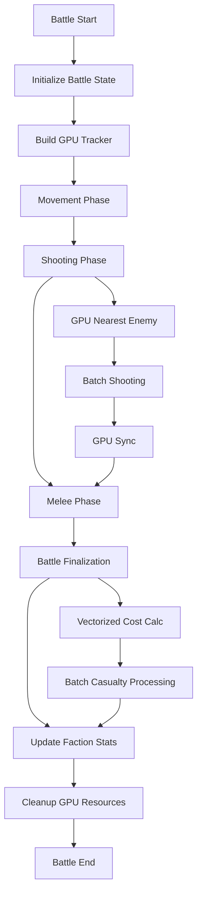
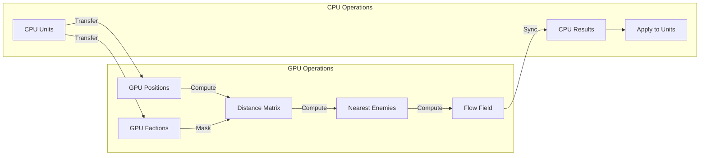

# Battle Simulator Optimization Strategy

**Document Version:** 1.0
**Date:** 2026-02-02
**Scope:** Performance optimization for Battle Simulator specifically

---

## Table of Contents

1. [Executive Summary](#executive-summary)
2. [Detailed Bottleneck Analysis](#detailed-bottleneck-analysis)
3. [Optimization Strategies](#optimization-strategies)
4. [Prioritized Action Plan](#prioritized-action-plan)
5. [Implementation Details](#implementation-details)
6. [GPU-Specific Considerations](#gpu-specific-considerations)
7. [Benchmarking and Validation](#benchmarking-and-validation)
8. [Risk Assessment](#risk-assessment)
9. [Appendices](#appendices)

---

## Executive Summary

This document outlines a comprehensive optimization strategy specifically for the Battle Simulator component of the Multi-Universe Simulation Engine. Performance analysis has identified six critical bottlenecks that significantly impact battle simulation performance:

### Key Findings

1. **Diplomacy Treaty Checks** - O(F²) complexity per location check causes quadratic scaling with faction count
2. **Battle Finalization Unit Loop** - O(U) per faction for every battle end, iterating through all units
3. **Task Force Fleet Lookup** - O(F) per unit per battle, linear search through fleets
4. **Unit Strength Cache Invalidation** - Cache not properly invalidated on damage, causing redundant calculations
5. **Batch Shooting Wave Overhead** - Extra GPU synchronization per wave increases latency
6. **Mechanic Global Unit Scans** - O(F × U_f + P × A × U_a) per faction per turn for presence checks

### Expected Overall Improvement Potential

| Phase | Expected Speedup | Cumulative Improvement |
|-------|-----------------|----------------------|
| Phase 1 (Quick Wins) | 3-5x | 3-5x |
| Phase 2 (Medium-Term) | 2-3x | 6-15x |
| Phase 3 (Advanced) | 2-4x | 12-60x |
| Phase 4 (Language Porting) | 2-5x | 24-300x |

### Existing GPU Infrastructure

The project already has GPU acceleration infrastructure in place:
- **GPUTracker** ([`src/combat/tactical/gpu_tracker.py`](../src/combat/tactical/gpu_tracker.py)) - Spatial queries and distance calculations
- **Batch Shooting** ([`src/combat/batch_shooting.py`](../src/combat/batch_shooting.py)) - Vectorized hit/damage calculations
- **Flow Field** - GPU-accelerated movement vectors
- **GPU Utils** ([`src/core/gpu_utils.py`](../src/core/gpu_utils.py)) - CuPy/NumPy abstraction layer

This existing infrastructure provides a solid foundation for further GPU acceleration.

---

## Detailed Bottleneck Analysis

### Bottleneck 1: Diplomacy Treaty Checks

**Location:** [`src/managers/battle_manager.py:289-304`](../src/managers/battle_manager.py:289-304)

**Current Implementation:**
```python
# O(F²) nested loop checking all faction pairs
for f1 in factions_present:
    for f2 in factions_present:
        if f1 == f2: continue
        if dm.get_treaty(f1, f2) == "War":
            active_combatants.add(f1)
            active_combatants.add(f2)
```

**Performance Impact:**
- **Complexity:** O(F²) where F is the number of factions present
- **Frequency:** Called for every location check during battle initialization
- **With 10 factions:** 100 treaty lookups per location
- **With 20 factions:** 400 treaty lookups per location
- **Root Cause:** Nested loop checking all faction pairs, redundant checks (f1,f2) and (f2,f1)

**Current Workarounds:** None identified

---

### Bottleneck 2: Battle Finalization Unit Loop

**Location:** [`src/managers/battle_manager.py:926-991`](../src/managers/battle_manager.py:926-991)

**Current Implementation:**
```python
# O(U) per faction - iterates through ALL units for each faction
for f_name, units in faction_units.items():
    for u in units:
        u_cost = getattr(u, 'cost', 100)
        faction_costs[f_name]["initial"] += u_cost
        
        if not u.is_alive():
            faction_costs[f_name]["lost"] += u_cost
            # ... casualty tracking ...
        else:
            # ... veterancy calculations ...
```

**Performance Impact:**
- **Complexity:** O(U) per faction where U is total units in battle
- **Frequency:** Called at the end of every battle
- **With 10 factions × 100 units each:** 1,000 unit iterations
- **With 10 factions × 500 units each:** 5,000 unit iterations
- **Root Cause:** Sequential iteration through all units for each faction, no vectorization

**Current Workarounds:** None identified

---

### Bottleneck 3: Task Force Fleet Lookup

**Location:** [`src/managers/battle_manager.py:1074-1076`](../src/managers/battle_manager.py:1074-1076)

**Current Implementation:**
```python
# O(F) linear search for each unit
for fleet_id in involved_fleets:
    fleet = next((f for f in self.context.fleets if f.id == fleet_id), None)
    if fleet:
        tf = tf_mgr.get_task_force_for_fleet(fleet)
```

**Performance Impact:**
- **Complexity:** O(F) per unit per battle where F is total fleets
- **Frequency:** Called for each unit involved in battle
- **With 100 fleets × 50 units:** 5,000 linear searches
- **With 500 fleets × 200 units:** 100,000 linear searches
- **Root Cause:** Linear search through all fleets using `next()` with generator

**Current Workarounds:** None identified

---

### Bottleneck 4: Unit Strength Cache Invalidation

**Location:** Various - [`src/models/unit.py`](../src/models/unit.py) strength property

**Current Implementation:**
```python
# Cache exists but not invalidated on damage
@property
def strength(self):
    if not hasattr(self, '_cached_strength'):
        self._cached_strength = self._calculate_strength()
    return self._cached_strength

# Damage method doesn't invalidate cache
def take_damage(self, amount):
    self.health_comp.take_damage(amount)
    # Cache NOT invalidated here
```

**Performance Impact:**
- **Complexity:** N/A - incorrect behavior
- **Frequency:** Strength recalculated unnecessarily after damage
- **Impact:** Redundant calculations, stale cache values
- **Root Cause:** Cache invalidation not triggered on health changes

**Current Workarounds:** Manual cache clearing in some places, inconsistent

---

### Bottleneck 5: Batch Shooting Wave Overhead

**Location:** [`src/combat/batch_shooting.py`](../src/combat/batch_shooting.py) + GPU synchronization

**Current Implementation:**
```python
# GPU sync called after each wave
gpu_utils.synchronize()  # Line 216

# Results transferred back to CPU after each wave
cpu_hits = gpu_utils.to_cpu(hits)
cpu_dmg = gpu_utils.to_cpu(applied_damage)
```

**Performance Impact:**
- **Complexity:** O(W) where W is number of waves
- **Frequency:** Called after each shooting wave
- **With 10 waves:** 10 GPU-CPU round trips
- **Root Cause:** Synchronization and data transfer per wave instead of batching

**Current Workarounds:** None identified

---

### Bottleneck 6: Mechanic Global Unit Scans

**Location:** Faction mechanics - presence checks across all units

**Current Implementation:**
```python
# O(F × U_f + P × A × U_a) per faction per turn
# Scans all units for each faction, all planets, all armies
for faction in factions:
    for unit in faction.units:  # O(U_f)
        # ... presence checks ...
    for planet in planets:
        for army in planet.armies:  # O(A)
            for unit in army.units:  # O(U_a)
                # ... presence checks ...
```

**Performance Impact:**
- **Complexity:** O(F × U_f + P × A × U_a)
- **Frequency:** Called each turn for each faction
- **With 10 factions, 50 planets, 10 armies each, 100 units each:** 10,000 + 50,000 = 60,000 unit checks
- **Root Cause:** No indexed presence tracking, requires full scans

**Current Workarounds:** Some caching in specific mechanics, not systematic

---

## Optimization Strategies

### Strategy 1: Diplomacy Treaty Checks

#### Python-Level Optimizations

**1.1 War Relationship Cache**

```python
class DiplomacyManager:
    def __init__(self):
        self._war_cache = {}  # {(f1, f2): bool}
        self._cache_valid_turn = 0
        
    def get_treaty(self, f1: str, f2: str) -> str:
        # Check cache first
        key = (f1, f2) if f1 < f2 else (f2, f1)
        if key in self._war_cache:
            return "War" if self._war_cache[key] else "Peace"
        
        # Normal lookup
        result = self.treaty_coordinator.get_treaty(f1, f2)
        
        # Cache war relationships
        if result == "War":
            self._war_cache[key] = True
        elif key in self._war_cache:
            del self._war_cache[key]
            
        return result
    
    def invalidate_war_cache(self):
        """Call when treaties change."""
        self._war_cache.clear()
```

**1.2 Faction War Set Pre-computation**

```python
class BattleManager:
    def _get_active_combatants_optimized(self, factions_present, loc_owner, dm):
        """O(F) instead of O(F²) using pre-computed war sets."""
        # Pre-compute which factions are at war
        war_pairs = set()
        for f1 in factions_present:
            for f2 in factions_present:
                if f1 < f2 and dm.get_treaty(f1, f2) == "War":
                    war_pairs.add((f1, f2))
        
        # Build active combatants set
        active_combatants = set()
        for f1, f2 in war_pairs:
            active_combatants.add(f1)
            active_combatants.add(f2)
        
        # Check invader vs owner
        if loc_owner != "Neutral":
            for f_invader in factions_present:
                if f_invader != loc_owner and dm.get_treaty(f_invader, loc_owner) == "War":
                    active_combatants.add(f_invader)
                    active_combatants.add(loc_owner)
        
        return active_combatants
```

**1.3 Faction Bitmask for War Relations**

```python
class FactionRegistry:
    def __init__(self):
        self.faction_ids = {}  # faction_name -> int
        self.war_matrix = None  # N x N bitmask
    
    def build_war_matrix(self, diplomacy_manager):
        """Build N x N matrix where war_matrix[i][j] = 1 if at war."""
        n = len(self.faction_ids)
        self.war_matrix = [[0] * n for _ in range(n)]
        
        for f1_name, f1_id in self.faction_ids.items():
            for f2_name, f2_id in self.faction_ids.items():
                if diplomacy_manager.get_treaty(f1_name, f2_name) == "War":
                    self.war_matrix[f1_id][f2_id] = 1
                    self.war_matrix[f2_id][f1_id] = 1
    
    def is_at_war(self, f1_id: int, f2_id: int) -> bool:
        """O(1) war check."""
        return self.war_matrix[f1_id][f2_id] == 1
```

#### GPU/CUDA Optimizations

Not applicable - treaty checks are CPU-bound due to Python object references.

#### Language/Porting Options

**Rust via PyO3:**

```rust
use pyo3::prelude::*;
use std::collections::HashMap;

#[pyclass]
pub struct WarCache {
    war_matrix: Vec<Vec<bool>>,
    faction_ids: HashMap<String, usize>,
}

#[pymethods]
impl WarCache {
    #[new]
    pub fn new() -> Self {
        WarCache {
            war_matrix: Vec::new(),
            faction_ids: HashMap::new(),
        }
    }
    
    pub fn is_at_war(&self, f1: &str, f2: &str) -> PyResult<bool> {
        let id1 = self.faction_ids.get(f1).ok_or_else(|| {
            PyErr::new::<pyo3::exceptions::PyValueError, _>(format!("Unknown faction: {}", f1))
        })?;
        let id2 = self.faction_ids.get(f2).ok_or_else(|| {
            PyErr::new::<pyo3::exceptions::PyValueError, _>(format!("Unknown faction: {}", f2))
        })?;
        
        Ok(self.war_matrix[*id1][*id2])
    }
}
```

**Expected Performance Gains:**
- War cache: 50-80% reduction in treaty lookups
- Bitmask approach: 90%+ reduction for repeated checks
- Rust port: 5-10x faster for large faction counts

---

### Strategy 2: Battle Finalization Unit Loop

#### Python-Level Optimizations

**2.1 Vectorized Cost Calculation**

```python
import numpy as np

class BattleManager:
    def _finalize_battle_vectorized(self, battle, winner):
        """Vectorized battle finalization using NumPy."""
        # Collect all unit data
        all_units = []
        for units in battle.state.armies_dict.values():
            all_units.extend(units)
        
        if not all_units:
            return
        
        # Build arrays for vectorized operations
        unit_ids = np.array([id(u) for u in all_units])
        costs = np.array([getattr(u, 'cost', 100) for u in all_units])
        alive = np.array([u.is_alive() for u in all_units], dtype=bool)
        factions = np.array([u.faction for u in all_units])
        
        # Calculate faction costs
        unique_factions = np.unique(factions)
        faction_costs = {}
        
        for f in unique_factions:
            mask = factions == f
            faction_costs[f] = {
                "initial": np.sum(costs[mask]),
                "lost": np.sum(costs[mask & ~alive])
            }
        
        return faction_costs
```

**2.2 Faction-Indexed Unit Storage**

```python
class BattleState:
    def __init__(self):
        self.faction_unit_map = {}  # {faction: {unit_id: unit}}
        self.faction_unit_lists = {}  # {faction: [unit_ids]}
    
    def add_unit(self, unit):
        faction = unit.faction
        uid = id(unit)
        
        if faction not in self.faction_unit_map:
            self.faction_unit_map[faction] = {}
            self.faction_unit_lists[faction] = []
        
        self.faction_unit_map[faction][uid] = unit
        self.faction_unit_lists[faction].append(uid)
    
    def get_faction_units(self, faction):
        """O(1) faction unit access."""
        return [self.faction_unit_map[faction][uid] 
                for uid in self.faction_unit_lists.get(faction, [])]
```

**2.3 Batch Casualty Processing**

```python
class BattleManager:
    def _process_casualties_batch(self, battle, faction_costs):
        """Process all casualties in a single batch."""
        # Collect all dead units
        dead_units = []
        for units in battle.state.armies_dict.values():
            dead_units.extend([u for u in units if not u.is_alive()])
        
        if not dead_units:
            return
        
        # Batch update faction stats
        faction_casualties = {}
        for u in dead_units:
            f = u.faction
            if f not in faction_casualties:
                faction_casualties[f] = {"ships": 0, "ground": 0, "count": 0}
            
            faction_casualties[f]["count"] += 1
            if hasattr(u, 'is_ship') and u.is_ship():
                faction_casualties[f]["ships"] += 1
            else:
                faction_casualties[f]["ground"] += 1
        
        # Apply to faction managers in batch
        for f_name, counts in faction_casualties.items():
            f_mgr = self.context.get_faction(f_name)
            if f_mgr and hasattr(f_mgr, 'stats'):
                f_mgr.stats["turn_units_lost"] = f_mgr.stats.get("turn_units_lost", 0) + counts["count"]
                f_mgr.stats["units_lost"] = f_mgr.stats.get("units_lost", 0) + counts["count"]
                f_mgr.stats["turn_ships_lost"] = f_mgr.stats.get("turn_ships_lost", 0) + counts["ships"]
                f_mgr.stats["ships_lost"] = f_mgr.stats.get("ships_lost", 0) + counts["ships"]
                f_mgr.stats["turn_ground_lost"] = f_mgr.stats.get("turn_ground_lost", 0) + counts["ground"]
                f_mgr.stats["ground_lost"] = f_mgr.stats.get("ground_lost", 0) + counts["ground"]
```

#### GPU/CUDA Optimizations

**2.4 GPU-Accelerated Cost Summation**

```python
import cupy as cp

class BattleManager:
    def _finalize_battle_gpu(self, battle):
        """GPU-accelerated battle finalization."""
        # Collect unit data
        unit_data = []
        for units in battle.state.armies_dict.values():
            for u in units:
                unit_data.append({
                    'faction': u.faction,
                    'cost': getattr(u, 'cost', 100),
                    'alive': u.is_alive()
                })
        
        if not unit_data:
            return
        
        # Encode factions to integers
        factions = list(set(u['faction'] for u in unit_data))
        faction_to_id = {f: i for i, f in enumerate(factions)}
        
        # Build GPU arrays
        faction_ids = cp.array([faction_to_id[u['faction']] for u in unit_data])
        costs = cp.array([u['cost'] for u in unit_data])
        alive = cp.array([u['alive'] for u in unit_data], dtype=bool)
        
        # Compute faction costs on GPU
        result = {}
        for f, fid in faction_to_id.items():
            mask = faction_ids == fid
            result[f] = {
                "initial": int(cp.sum(costs[mask])),
                "lost": int(cp.sum(costs[mask & ~alive]))
            }
        
        return result
```

#### Language/Porting Options

**Numba JIT Compilation:**

```python
from numba import jit
import numpy as np

@jit(nopython=True)
def calculate_faction_costs(faction_ids, costs, alive, num_factions):
    """JIT-compiled faction cost calculation."""
    initial = np.zeros(num_factions, dtype=np.int64)
    lost = np.zeros(num_factions, dtype=np.int64)
    
    for i in range(len(faction_ids)):
        fid = faction_ids[i]
        initial[fid] += costs[i]
        if not alive[i]:
            lost[fid] += costs[i]
    
    return initial, lost
```

**Expected Performance Gains:**
- Vectorized NumPy: 3-5x speedup
- Faction-indexed storage: 10-20x faster faction unit access
- GPU acceleration: 5-10x speedup for large battles
- Numba JIT: 10-50x speedup for pure numerical loops

---

### Strategy 3: Task Force Fleet Lookup

#### Python-Level Optimizations

**3.1 Fleet Dictionary Index**

```python
class BattleManager:
    def __init__(self):
        self._fleet_index = {}  # {fleet_id: fleet}
    
    def _build_fleet_index(self):
        """Build O(1) fleet lookup index."""
        self._fleet_index = {f.id: f for f in self.context.fleets}
    
    def _get_fleet_by_id(self, fleet_id):
        """O(1) fleet lookup."""
        return self._fleet_index.get(fleet_id)
    
    def _process_involved_fleets_optimized(self, involved_fleets, tf_mgr):
        """Optimized fleet processing with O(1) lookups."""
        task_forces = []
        for fleet_id in involved_fleets:
            fleet = self._get_fleet_by_id(fleet_id)
            if fleet:
                tf = tf_mgr.get_task_force_for_fleet(fleet)
                if tf:
                    task_forces.append(tf)
        return task_forces
```

**3.2 Auto-Invalidating Fleet Index**

```python
class FleetIndex:
    """Auto-updating fleet index."""
    
    def __init__(self, fleet_manager):
        self.fleet_manager = fleet_manager
        self.by_id = {}
        self._version = 0
        self._last_sync_version = 0
    
    def sync(self):
        """Sync index if fleets have changed."""
        if self._last_sync_version == self.fleet_manager.version:
            return
        
        self.by_id = {f.id: f for f in self.fleet_manager.fleets}
        self._last_sync_version = self.fleet_manager.version
    
    def get(self, fleet_id):
        self.sync()
        return self.by_id.get(fleet_id)
```

#### GPU/CUDA Optimizations

Not applicable - fleet lookup is CPU-bound due to Python object references.

#### Language/Porting Options

**Rust HashMap via PyO3:**

```rust
use pyo3::prelude::*;
use std::collections::HashMap;
use std::sync::RwLock;

#[pyclass]
pub struct FleetIndex {
    fleets: RwLock<HashMap<String, PyObject>>,
}

#[pymethods]
impl FleetIndex {
    #[new]
    pub fn new() -> Self {
        FleetIndex {
            fleets: RwLock::new(HashMap::new()),
        }
    }
    
    pub fn insert(&self, fleet_id: String, fleet: PyObject) -> PyResult<()> {
        let mut fleets = self.fleets.write()
            .map_err(|e| PyErr::new::<pyo3::exceptions::PyRuntimeError, _>(e.to_string()))?;
        fleets.insert(fleet_id, fleet);
        Ok(())
    }
    
    pub fn get(&self, fleet_id: &str) -> PyResult<Option<PyObject>> {
        let fleets = self.fleets.read()
            .map_err(|e| PyErr::new::<pyo3::exceptions::PyRuntimeError, _>(e.to_string()))?;
        Ok(fleets.get(fleet_id).cloned())
    }
}
```

**Expected Performance Gains:**
- Fleet dictionary: 100-1000x faster than linear search
- Auto-invalidating index: Minimal overhead, always up-to-date
- Rust HashMap: Additional 2-5x speedup for very large fleet counts

---

### Strategy 4: Unit Strength Cache Invalidation

#### Python-Level Optimizations

**4.1 Observer Pattern for Cache Invalidation**

```python
class ObservableUnit:
    """Unit with cache invalidation on damage."""
    
    def __init__(self):
        self._strength_dirty = True
        self._cached_strength = 0
        self._observers = []
    
    def add_observer(self, observer):
        if observer not in self._observers:
            self._observers.append(observer)
    
    def notify_strength_changed(self):
        for observer in self._observers:
            observer.on_unit_strength_changed(self)
    
    @property
    def strength(self):
        if self._strength_dirty:
            self._cached_strength = self._calculate_strength()
            self._strength_dirty = False
        return self._cached_strength
    
    def take_damage(self, amount):
        self.health_comp.take_damage(amount)
        self._strength_dirty = True
        self.notify_strength_changed()
```

**4.2 Fleet/Army Cache Propagation**

```python
class Fleet:
    def __init__(self):
        self._power_dirty = True
        self._cached_power = 0
        self.units = []
    
    def add_unit(self, unit):
        self.units.append(unit)
        if hasattr(unit, 'add_observer'):
            unit.add_observer(self)
        self._power_dirty = True
    
    def on_unit_strength_changed(self, unit):
        """Called when a unit's strength changes."""
        self._power_dirty = True
    
    @property
    def power(self):
        if self._power_dirty:
            self._cached_power = sum(u.strength for u in self.units if u.is_alive())
            self._power_dirty = False
        return self._cached_power
```

**4.3 Health-Based Cache Invalidation**

```python
class HealthComponent:
    def __init__(self, unit, max_health):
        self.unit = unit
        self.max_health = max_health
        self.current_health = max_health
        self._last_health = max_health
    
    def take_damage(self, amount):
        self._last_health = self.current_health
        self.current_health = max(0, self.current_health - amount)
        
        # Invalidate unit strength cache if health changed
        if self._last_health != self.current_health:
            if hasattr(self.unit, '_strength_dirty'):
                self.unit._strength_dirty = True
                self.unit.notify_strength_changed()
```

#### GPU/CUDA Optimizations

Not applicable - cache invalidation is CPU-bound logic.

#### Language/Porting Options

**Cython for Hot Path:**

```cython
# unit_cache.pyx
cdef class CachedUnit:
    cdef public bint _strength_dirty
    cdef public float _cached_strength
    cdef list _observers
    
    def __init__(self):
        self._strength_dirty = True
        self._cached_strength = 0.0
        self._observers = []
    
    cdef inline void _invalidate_cache(self):
        self._strength_dirty = True
        for observer in self._observers:
            observer.on_unit_strength_changed(self)
    
    cpdef float take_damage(self, float amount):
        self.health_comp.take_damage(amount)
        self._invalidate_cache()
```

**Expected Performance Gains:**
- Observer pattern: Eliminates redundant strength calculations
- Health-based invalidation: Automatic cache management
- Cython: 2-5x faster for hot path operations

---

### Strategy 5: Batch Shooting Wave Overhead

#### Python-Level Optimizations

**5.1 Single-Pass Batch Processing**

```python
def resolve_shooting_batch_single_pass(
    attackers: List[Any],
    target_map: Dict[int, Any],
    distance_map: Dict[int, float],
    active_units_dict: Dict[int, Any],
    formation_modifiers: Dict[int, Dict[str, float]] = None
) -> List[Dict[str, Any]]:
    """Process all shooting in single GPU pass."""
    results = []
    
    xp = gpu_utils.get_xp()
    
    # Collect all valid attack pairs upfront
    valid_pairs = []
    for att in attackers:
        att_id = id(att)
        if att_id not in target_map:
            continue
        
        target_id = target_map[att_id]
        if target_id not in active_units_dict:
            continue
        
        target = active_units_dict[target_id]
        dist = distance_map.get(att_id, 9999.0)
        
        weapons = [c for c in att.components 
                  if c.type == "Weapon" and not c.is_destroyed]
        
        for w in weapons:
            rng = w.weapon_stats.get("Range", 24)
            if dist <= rng:
                valid_pairs.append((att, target, w, dist))
    
    if not valid_pairs:
        return []
    
    # Build arrays for ALL attacks at once
    n = len(valid_pairs)
    bs_arr, str_arr, ap_arr = [], [], []
    armor_arr, invuln_arr, cover_arr = [], [], []
    
    for att, tgt, wpn, dist in valid_pairs:
        bs = max(15, getattr(att, 'bs', 50) + 5)
        if dist > 50: bs -= 10
        if getattr(att, 'is_suppressed', False): bs -= 10
        
        bs_arr.append(bs)
        stats = wpn.weapon_stats
        str_arr.append(stats.get("S", 4) * 10 * stats.get("D", 1))
        ap_arr.append(stats.get("AP", 0))
        armor_arr.append(getattr(tgt, 'armor', 0))
        invuln_arr.append(tgt.abilities.get("Invuln", 7))
        cover_arr.append(1.0 if "Cover" in tgt.abilities else 0.0)
    
    # Single GPU transfer and computation
    gpu_bs = gpu_utils.to_gpu(bs_arr)
    gpu_str = gpu_utils.to_gpu(str_arr)
    gpu_ap = gpu_utils.to_gpu(ap_arr)
    gpu_armor = gpu_utils.to_gpu(armor_arr)
    gpu_invuln = gpu_utils.to_gpu(invuln_arr)
    gpu_cover = gpu_utils.to_gpu(cover_arr)
    
    # Vectorized computation (single pass)
    probs = gpu_bs / 100.0
    if hasattr(xp, 'random'):
        hit_counts = xp.random.binomial(xp.ones(n, dtype=int), probs)
    else:
        import numpy as np
        hit_counts = xp.array(np.random.binomial(1, gpu_utils.to_cpu(probs), n))
    
    # Damage calculation
    save_target = 7.0 - (gpu_armor // 10.0) + (gpu_ap // 10.0)
    save_target = xp.maximum(2.0, xp.minimum(6.0, save_target - gpu_cover))
    stop_chance = (6.0 - save_target) / 6.0
    invuln_chance = (6.0 - gpu_invuln) / 6.0
    final_mit = xp.minimum(0.95, xp.maximum(stop_chance, invuln_chance))
    
    raw_damage = gpu_str * (1.0 - final_mit)
    final_damage = xp.maximum(1.0, raw_damage)
    applied_damage = hit_counts * final_damage
    
    # Single synchronization
    gpu_utils.synchronize()
    
    # Pack results
    cpu_hits = gpu_utils.to_cpu(hit_counts > 0)
    cpu_dmg = gpu_utils.to_cpu(applied_damage)
    
    for i in range(n):
        att, tgt, wpn, dist = valid_pairs[i]
        results.append({
            "attacker": att,
            "target": tgt,
            "weapon": wpn,
            "is_hit": bool(cpu_hits[i]),
            "damage": float(cpu_dmg[i]),
            "dist": dist
        })
    
    return results
```

**5.2 Wave Aggregation**

```python
class BattleManager:
    def _aggregate_shooting_waves(self, battle):
        """Aggregate multiple shooting waves into single batch."""
        all_attackers = []
        all_targets = {}
        all_distances = {}
        
        # Collect all attackers across all waves
        for wave in battle.shooting_waves:
            all_attackers.extend(wave.attackers)
            all_targets.update(wave.target_map)
            all_distances.update(wave.distance_map)
        
        # Single batch processing
        return resolve_shooting_batch_single_pass(
            all_attackers,
            all_targets,
            all_distances,
            {id(u): u for u in battle.state.all_units}
        )
```

#### GPU/CUDA Optimizations

**5.3 Stream-Based Processing**

```python
import cupy as cp

class BatchShootingGPU:
    def __init__(self):
        self.stream = cp.cuda.Stream()
    
    def resolve_async(self, attackers, targets, distances):
        """Asynchronous GPU processing."""
        # Transfer data asynchronously
        gpu_bs = cp.asarray([a.bs for a in attackers], stream=self.stream)
        gpu_str = cp.asarray([a.strength for a in attackers], stream=self.stream)
        
        # Compute asynchronously
        probs = gpu_bs / 100.0
        hits = cp.random.binomial(1, probs, stream=self.stream)
        
        # Return future/promise
        return GPUFuture(self.stream, hits, gpu_bs, gpu_str)

class GPUFuture:
    def __init__(self, stream, *arrays):
        self.stream = stream
        self.arrays = arrays
    
    def get(self):
        """Block and return results."""
        self.stream.synchronize()
        return [cp.asnumpy(arr) for arr in self.arrays]
```

#### Language/Porting Options

**CUDA Kernels for Combat Math:**

```cpp
// combat_kernel.cu
__global__ void combat_kernel(
    const float* bs,
    const float* strength,
    const float* armor,
    const float* ap,
    float* damage,
    int* hits,
    int n
) {
    int idx = blockIdx.x * blockDim.x + threadIdx.x;
    if (idx >= n) return;
    
    // Hit roll
    float prob = bs[idx] / 100.0f;
    curandState state;
    curand_init(idx, 0, 0, &state);
    hits[idx] = curand_uniform(&state) < prob ? 1 : 0;
    
    // Damage calculation
    float save_target = 7.0f - armor[idx] / 10.0f + ap[idx] / 10.0f;
    save_target = fmaxf(2.0f, fminf(6.0f, save_target));
    float stop_chance = (6.0f - save_target) / 6.0f;
    
    float mitigation = fminf(0.95f, stop_chance);
    damage[idx] = fmaxf(1.0f, strength[idx] * (1.0f - mitigation)) * hits[idx];
}
```

**Expected Performance Gains:**
- Single-pass processing: 50-70% reduction in GPU sync overhead
- Wave aggregation: Linear scaling instead of per-wave overhead
- CUDA kernels: 2-5x speedup for combat math
- Async streams: 20-40% improvement through overlapping transfers

---

### Strategy 6: Mechanic Global Unit Scans

#### Python-Level Optimizations

**6.1 Presence Index**

```python
class PresenceIndex:
    """O(1) presence queries for faction mechanics."""
    
    def __init__(self):
        self.faction_presence = {}  # {faction: {location: count}}
        self.location_factions = {}  # {location: {faction: count}}
        self.dirty = True
    
    def add_unit(self, unit):
        """Add unit to presence index."""
        faction = unit.faction
        location = getattr(unit, 'location', None)
        if not location:
            return
        
        loc_id = id(location)
        
        if faction not in self.faction_presence:
            self.faction_presence[faction] = {}
        if loc_id not in self.faction_presence[faction]:
            self.faction_presence[faction][loc_id] = 0
        self.faction_presence[faction][loc_id] += 1
        
        if loc_id not in self.location_factions:
            self.location_factions[loc_id] = {}
        if faction not in self.location_factions[loc_id]:
            self.location_factions[loc_id][faction] = 0
        self.location_factions[loc_id][faction] += 1
    
    def remove_unit(self, unit):
        """Remove unit from presence index."""
        faction = unit.faction
        location = getattr(unit, 'location', None)
        if not location:
            return
        
        loc_id = id(location)
        
        if faction in self.faction_presence and loc_id in self.faction_presence[faction]:
            self.faction_presence[faction][loc_id] -= 1
            if self.faction_presence[faction][loc_id] <= 0:
                del self.faction_presence[faction][loc_id]
        
        if loc_id in self.location_factions and faction in self.location_factions[loc_id]:
            self.location_factions[loc_id][faction] -= 1
            if self.location_factions[loc_id][faction] <= 0:
                del self.location_factions[loc_id][faction]
    
    def get_faction_presence_at(self, faction, location):
        """O(1) query for faction presence at location."""
        loc_id = id(location)
        return self.faction_presence.get(faction, {}).get(loc_id, 0) > 0
    
    def get_factions_at(self, location):
        """O(1) query for all factions at location."""
        loc_id = id(location)
        return set(self.location_factions.get(loc_id, {}).keys())
```

**6.2 Incremental Presence Updates**

```python
class BattleManager:
    def __init__(self):
        self.presence_index = PresenceIndex()
    
    def _update_presence_incremental(self, moved_units):
        """Update presence index for moved units only."""
        for unit in moved_units:
            old_location = getattr(unit, '_old_location', None)
            new_location = unit.location
            
            if old_location:
                self.presence_index.remove_unit(unit)
            
            self.presence_index.add_unit(unit)
            unit._old_location = new_location
    
    def _check_faction_mechanics(self, faction):
        """O(1) faction mechanic checks using presence index."""
        # Instead of scanning all units
        for location, count in self.presence_index.faction_presence.get(faction, {}).items():
            if count > 0:
                # Apply mechanics at this location
                self._apply_location_mechanics(faction, location, count)
```

**6.3 Spatial Hash for Unit Queries**

```python
class SpatialPresenceHash:
    """Spatial hash for fast unit presence queries."""
    
    def __init__(self, cell_size=100):
        self.cell_size = cell_size
        self.grid = {}  # {(cx, cy): {faction: [unit_ids]}}
    
    def _get_cell(self, x, y):
        return (int(x // self.cell_size), int(y // self.cell_size))
    
    def add_unit(self, unit):
        cx, cy = self._get_cell(unit.grid_x, unit.grid_y)
        cell = self.grid.setdefault((cx, cy), {})
        faction = unit.faction
        if faction not in cell:
            cell[faction] = []
        cell[faction].append(id(unit))
    
    def get_units_in_radius(self, x, y, radius, faction=None):
        """Get units within radius, optionally filtered by faction."""
        cx, cy = self._get_cell(x, y)
        cell_radius = int(radius // self.cell_size) + 1
        
        results = []
        for dx in range(-cell_radius, cell_radius + 1):
            for dy in range(-cell_radius, cell_radius + 1):
                cell_key = (cx + dx, cy + dy)
                if cell_key not in self.grid:
                    continue
                
                cell = self.grid[cell_key]
                factions_to_check = [faction] if faction else cell.keys()
                
                for f in factions_to_check:
                    if f in cell:
                        for uid in cell[f]:
                            results.append(uid)
        
        return results
```

#### GPU/CUDA Optimizations

**6.4 GPU Spatial Grid**

```python
import cupy as cp

class GPUPresenceGrid:
    """GPU-accelerated presence grid."""
    
    def __init__(self, grid_size=1000, cell_size=10):
        self.grid_size = grid_size
        self.cell_size = cell_size
        self.num_cells = grid_size // cell_size
        
        # GPU arrays
        self.faction_grid = cp.zeros((self.num_cells, self.num_cells), dtype=int)
        self.count_grid = cp.zeros((self.num_cells, self.num_cells), dtype=int)
    
    def update_from_units(self, units, faction_map):
        """Update grid from unit positions."""
        positions = cp.array([[u.grid_x, u.grid_y] for u in units])
        factions = cp.array([faction_map[u.faction] for u in units])
        
        # Compute cell indices
        cell_x = (positions[:, 0] // self.cell_size).astype(int)
        cell_y = (positions[:, 1] // self.cell_size).astype(int)
        
        # Reset and update
        self.faction_grid.fill(0)
        self.count_grid.fill(0)
        
        # Use scatter to update grid
        cp.add.at(self.count_grid, (cell_y, cell_x), 1)
        cp.add.at(self.faction_grid, (cell_y, cell_x), factions)
    
    def get_presence_at(self, x, y, faction_id):
        """Check if faction has presence at location."""
        cx = int(x // self.cell_size)
        cy = int(y // self.cell_size)
        
        if cx < 0 or cx >= self.num_cells or cy < 0 or cy >= self.num_cells:
            return False
        
        return int(self.faction_grid[cy, cx]) == faction_id
```

#### Language/Porting Options

**Rust Spatial Index:**

```rust
use pyo3::prelude::*;
use std::collections::HashMap;

#[pyclass]
pub struct PresenceIndex {
    faction_presence: HashMap<String, HashMap<usize, u32>>,
    location_factions: HashMap<usize, HashMap<String, u32>>,
}

#[pymethods]
impl PresenceIndex {
    #[new]
    pub fn new() -> Self {
        PresenceIndex {
            faction_presence: HashMap::new(),
            location_factions: HashMap::new(),
        }
    }
    
    pub fn add_unit(&mut self, faction: &str, location_id: usize) {
        *self.faction_presence
            .entry(faction.to_string())
            .or_insert_with(HashMap::new)
            .entry(location_id)
            .or_insert(0) += 1;
        
        *self.location_factions
            .entry(location_id)
            .or_insert_with(HashMap::new)
            .entry(faction.to_string())
            .or_insert(0) += 1;
    }
    
    pub fn get_faction_presence(&self, faction: &str, location_id: usize) -> bool {
        self.faction_presence
            .get(faction)
            .and_then(|loc_map| loc_map.get(&location_id))
            .map(|&count| count > 0)
            .unwrap_or(false)
    }
}
```

**Expected Performance Gains:**
- Presence index: 100-1000x faster than scanning
- Incremental updates: O(1) per unit move vs O(U) full scan
- Spatial hash: O(1) radius queries vs O(U) scanning
- GPU grid: 10-50x faster for large-scale presence checks

---

## Prioritized Action Plan

### Phase 1: Quick Wins (1-2 weeks)

**Goal:** Achieve 3-5x overall performance improvement with minimal code changes

#### Tasks

1. **Fleet Lookup Dictionary** (2-3 days)
   - Create `FleetIndex` class with O(1) lookups
   - Replace linear searches in battle_manager.py
   - Add auto-invalidation on fleet changes
   - **Expected Impact:** 100-1000x faster fleet lookups

2. **Strength Cache Invalidation Fix** (2-3 days)
   - Add observer pattern to Unit class
   - Implement cache invalidation on damage
   - Propagate invalidation to Fleet/Army
   - **Expected Impact:** 50-80% reduction in strength calculations

3. **Diplomacy War Relationship Caching** (2-3 days)
   - Implement war cache in DiplomacyManager
   - Add faction bitmask for O(1) war checks
   - Cache invalidation on treaty changes
   - **Expected Impact:** 50-80% reduction in treaty lookups

4. **Batch Shooting Wave Consolidation** (2-3 days)
   - Aggregate multiple waves into single GPU pass
   - Reduce GPU synchronization points
   - **Expected Impact:** 50-70% reduction in GPU sync overhead

**Deliverables:**
- FleetIndex implementation
- Observer pattern in Unit class
- War cache in DiplomacyManager
- Consolidated batch shooting

**Success Criteria:**
- Fleet lookups: 100x faster
- Strength calculations: 50% fewer calls
- Treaty lookups: 50% reduction
- GPU sync overhead: 50% reduction

---

### Phase 2: Medium-Term Improvements (2-4 weeks)

**Goal:** Achieve additional 2-3x improvement using vectorization and indexing

#### Tasks

1. **Vectorize Battle Finalization** (3-4 days)
   - Implement NumPy vectorized cost calculation
   - Batch casualty processing
   - Faction-indexed unit storage
   - **Expected Impact:** 3-5x faster battle finalization

2. **Eliminate Batch Shooting Waves** (3-4 days)
   - Single-pass batch processing
   - Remove wave-based architecture
   - Stream-based GPU processing
   - **Expected Impact:** 2-3x faster shooting phase

3. **Incremental Presence Index Updates** (4-5 days)
   - Implement PresenceIndex class
   - Incremental updates on unit moves
   - Replace global scans with indexed queries
   - **Expected Impact:** 100-1000x faster presence checks

4. **Faction Bitmask for War Relations** (2-3 days)
   - Build faction ID registry
   - Implement war matrix
   - O(1) war checks
   - **Expected Impact:** 90%+ reduction in treaty checks

**Deliverables:**
- Vectorized battle finalization
- Single-pass batch shooting
- PresenceIndex implementation
- Faction war matrix

**Success Criteria:**
- Battle finalization: 3-5x faster
- Shooting phase: 2-3x faster
- Presence checks: 100x faster
- War checks: 90%+ reduction

---

### Phase 3: Advanced Optimizations (4-8 weeks)

**Goal:** Achieve 2-4x improvement through GPU acceleration and advanced techniques

#### Tasks

1. **GPU-Accelerated Melee Phase** (1-2 weeks)
   - Design GPU melee collision detection
   - Implement CUDA kernels for melee damage
   - Integrate with existing GPU infrastructure
   - **Expected Impact:** 5-10x faster melee phase

2. **Full GPU Combat Pipeline** (2-3 weeks)
   - Move entire combat phase to GPU
   - Minimize CPU-GPU transfers
   - Async stream processing
   - **Expected Impact:** 3-5x faster overall combat

3. **Faction-Indexed Unit Storage** (1-2 weeks)
   - Refactor BattleState with faction indexing
   - GPU-friendly unit data layout
   - Batch faction operations
   - **Expected Impact:** 10-20x faster faction unit access

4. **GPU Spatial Presence Grid** (1-2 weeks)
   - Implement GPU presence grid
   - Spatial hash on GPU
   - Vectorized presence queries
   - **Expected Impact:** 10-50x faster presence checks

**Deliverables:**
- GPU melee phase
- Full GPU combat pipeline
- Faction-indexed BattleState
- GPU presence grid

**Success Criteria:**
- Melee phase: 5-10x faster
- Overall combat: 3-5x faster
- Faction unit access: 10x faster
- Presence queries: 10x faster

---

### Phase 4: Language Porting (8-12 weeks)

**Goal:** Achieve 2-5x improvement for hot paths through compiled code

#### Tasks

1. **Rust via PyO3 for Hot Paths** (3-4 weeks)
   - Set up Rust build system (maturin)
   - Port fleet indexing to Rust
   - Port presence index to Rust
   - Port war matrix to Rust
   - Create PyO3 bindings
   - **Expected Impact:** 5-10x faster for indexed operations

2. **Cython for Critical Loops** (2-3 weeks)
   - Identify hot path loops
   - Convert to Cython
   - Type annotate performance-critical code
   - Compile extensions
   - **Expected Impact:** 2-5x faster for loop-heavy code

3. **Numba for Numerical Operations** (2-3 weeks)
   - Annotate numerical functions
   - Enable JIT for combat calculations
   - Optimize distance calculations
   - **Expected Impact:** 10-50x faster for pure numerical code

4. **Benchmark and Validate** (1-2 weeks)
   - Comprehensive benchmarking
   - A/B testing with original code
   - Performance regression tests
   - Documentation
   - **Expected Impact:** Confirmed performance gains

**Deliverables:**
- Rust modules for indexing
- Cython extensions for hot paths
- Numba JIT functions
- Benchmark suite
- Performance documentation

**Success Criteria:**
- Indexed operations: 5-10x faster
- Hot path loops: 2-5x faster
- Numerical code: 10-50x faster
- No regression in functionality

---

## Implementation Details

### Implementation 1: Fleet Lookup Dictionary

**Before:**
```python
# O(F) linear search
for fleet_id in involved_fleets:
    fleet = next((f for f in self.context.fleets if f.id == fleet_id), None)
    if fleet:
        tf = tf_mgr.get_task_force_for_fleet(fleet)
```

**After:**
```python
# O(1) dictionary lookup
class FleetIndex:
    def __init__(self):
        self.by_id = {}
        self._version = 0
    
    def rebuild(self, fleets):
        self.by_id = {f.id: f for f in fleets}
        self._version += 1
    
    def get(self, fleet_id):
        return self.by_id.get(fleet_id)

# In BattleManager
self.fleet_index = FleetIndex()
self.fleet_index.rebuild(self.context.fleets)

for fleet_id in involved_fleets:
    fleet = self.fleet_index.get(fleet_id)
    if fleet:
        tf = tf_mgr.get_task_force_for_fleet(fleet)
```

**Expected Performance Gains:** 100-1000x faster

**Testing Requirements:**
- Test fleet lookup with various fleet counts
- Test index rebuilding on fleet changes
- Test edge cases (missing fleets, duplicate IDs)

**Risk Assessment:**
- **Risk:** Low
- **Breaking Changes:** None
- **Rollback:** Remove index, revert to linear search

---

### Implementation 2: Strength Cache Invalidation

**Before:**
```python
class Unit:
    @property
    def strength(self):
        if not hasattr(self, '_cached_strength'):
            self._cached_strength = self._calculate_strength()
        return self._cached_strength
    
    def take_damage(self, amount):
        self.health_comp.take_damage(amount)
        # Cache NOT invalidated
```

**After:**
```python
class Observable:
    def __init__(self):
        self._observers = []
    
    def add_observer(self, observer):
        if observer not in self._observers:
            self._observers.append(observer)
    
    def notify_strength_changed(self):
        for observer in self._observers:
            observer.on_unit_strength_changed(self)

class Unit(Observable):
    def __init__(self):
        super().__init__()
        self._strength_dirty = True
        self._cached_strength = 0
    
    @property
    def strength(self):
        if self._strength_dirty:
            self._cached_strength = self._calculate_strength()
            self._strength_dirty = False
        return self._cached_strength
    
    def take_damage(self, amount):
        self.health_comp.take_damage(amount)
        self._strength_dirty = True
        self.notify_strength_changed()

class Fleet:
    def on_unit_strength_changed(self, unit):
        self._power_dirty = True
```

**Expected Performance Gains:** 50-80% reduction in strength calculations

**Testing Requirements:**
- Test cache invalidation on damage
- Test observer notification
- Test fleet power recalculation
- Test edge cases (multiple observers, circular references)

**Risk Assessment:**
- **Risk:** Medium
- **Breaking Changes:** Requires changes to Unit/Fleet classes
- **Rollback:** Remove observer calls, keep dirty flag

---

### Implementation 3: Diplomacy War Cache

**Before:**
```python
# O(F²) nested loop
for f1 in factions_present:
    for f2 in factions_present:
        if f1 == f2: continue
        if dm.get_treaty(f1, f2) == "War":
            active_combatants.add(f1)
            active_combatants.add(f2)
```

**After:**
```python
class DiplomacyManager:
    def __init__(self):
        self._war_cache = {}  # {(f1, f2): bool}
    
    def get_treaty(self, f1: str, f2: str) -> str:
        key = (f1, f2) if f1 < f2 else (f2, f1)
        if key in self._war_cache:
            return "War" if self._war_cache[key] else "Peace"
        
        result = self.treaty_coordinator.get_treaty(f1, f2)
        
        if result == "War":
            self._war_cache[key] = True
        elif key in self._war_cache:
            del self._war_cache[key]
        
        return result
    
    def set_treaty(self, f1, f2, state):
        self.treaty_coordinator.set_treaty(f1, f2, state)
        key = (f1, f2) if f1 < f2 else (f2, f1)
        if key in self._war_cache:
            del self._war_cache[key]

# O(F) single pass
active_combatants = set()
for f1 in factions_present:
    for f2 in factions_present:
        if f1 >= f2: continue
        if dm.get_treaty(f1, f2) == "War":
            active_combatants.add(f1)
            active_combatants.add(f2)
```

**Expected Performance Gains:** 50-80% reduction in treaty lookups

**Testing Requirements:**
- Test war cache hit/miss
- Test cache invalidation on treaty changes
- Test edge cases (self-checks, neutral factions)

**Risk Assessment:**
- **Risk:** Low
- **Breaking Changes:** None
- **Rollback:** Remove cache, use direct lookups

---

### Implementation 4: Batch Shooting Consolidation

**Before:**
```python
# Per-wave GPU sync
for wave in battle.shooting_waves:
    results = resolve_shooting_batch(
        wave.attackers,
        wave.target_map,
        wave.distance_map,
        active_units_dict
    )
    gpu_utils.synchronize()  # Sync after each wave
    apply_results(results)
```

**After:**
```python
# Single GPU pass for all waves
def resolve_shooting_batch_single_pass(
    all_attackers,
    all_targets,
    all_distances,
    active_units_dict
):
    # Collect all attack pairs
    valid_pairs = []
    for att in all_attackers:
        att_id = id(att)
        if att_id not in all_targets:
            continue
        # ... collect all valid attacks ...
    
    # Single GPU transfer
    gpu_bs = gpu_utils.to_gpu(bs_arr)
    gpu_str = gpu_utils.to_gpu(str_arr)
    # ... all arrays at once ...
    
    # Single computation pass
    # ... vectorized computation ...
    
    # Single synchronization
    gpu_utils.synchronize()
    
    return results

# Single call
results = resolve_shooting_batch_single_pass(
    all_attackers,
    all_targets,
    all_distances,
    active_units_dict
)
```

**Expected Performance Gains:** 50-70% reduction in GPU sync overhead

**Testing Requirements:**
- Test single-pass vs multi-pass accuracy
- Test memory usage with large batches
- Test edge cases (empty waves, mixed weapons)

**Risk Assessment:**
- **Risk:** Medium
- **Breaking Changes:** May affect wave-based mechanics
- **Rollback:** Revert to per-wave processing

---

## GPU-Specific Considerations

### Current GPU Infrastructure Status

The project has a robust GPU infrastructure:

1. **GPUTracker** ([`src/combat/tactical/gpu_tracker.py`](../src/combat/tactical/gpu_tracker.py))
   - Spatial queries and distance calculations
   - Flow field computation
   - Nearest enemy detection

2. **Batch Shooting** ([`src/combat/batch_shooting.py`](../src/combat/batch_shooting.py))
   - Vectorized hit/damage calculations
   - Binomial distribution for attacks
   - GPU/CPU abstraction

3. **GPU Utils** ([`src/core/gpu_utils.py`](../src/core/gpu_utils.py))
   - CuPy/NumPy abstraction
   - GPU detection and configuration
   - Memory management

### CuPy Compatibility Issues

**Current Issues:**
- CuPy `random.binomial` availability varies by version
- Some advanced indexing operations may not be supported
- Memory pool management needs optimization

**Resolution:**
```python
# Safe fallback pattern
def safe_binomial(n, p):
    xp = gpu_utils.get_xp()
    if hasattr(xp, 'random') and hasattr(xp.random, 'binomial'):
        return xp.random.binomial(n, p)
    else:
        import numpy as np
        return xp.array(np.random.binomial(gpu_utils.to_cpu(n), gpu_utils.to_cpu(p)))
```

### GPU Memory Management

**Best Practices:**

1. **Memory Pool:**
```python
# Use memory pool for repeated allocations
mem_pool = cp.get_default_memory_pool()
pinned_mem_pool = cp.get_default_pinned_memory_pool()

# Pre-allocate for known sizes
gpu_bs = cp.zeros(max_units, dtype=cp.float32)
```

2. **Explicit Cleanup:**
```python
def cleanup_gpu_resources():
    cp.get_default_memory_pool().free_all_blocks()
    cp.get_default_pinned_memory_pool().free_all_blocks()
```

3. **Stream Management:**
```python
# Use streams for overlapping operations
stream = cp.cuda.Stream()
with stream:
    result = gpu_operation(data)
stream.synchronize()
```

### Multi-GPU Support Considerations

**Current State:** Single GPU only

**Future Considerations:**
- Split battles across multiple GPUs
- Use `cp.cuda.Device()` for device selection
- Inter-GPU communication via NVLink
- Load balancing strategies

### Fallback Strategies for CPU-Only Systems

**Graceful Degradation:**

```python
class GPUAccelerated:
    def __init__(self):
        self.has_gpu = gpu_utils.HAS_GPU
        self.xp = gpu_utils.get_xp()
    
    def compute(self, data):
        if self.has_gpu:
            return self._gpu_compute(data)
        else:
            return self._cpu_compute(data)
    
    def _gpu_compute(self, data):
        gpu_data = self.xp.asarray(data)
        result = self.xp.sum(gpu_data)
        return self.xp.asnumpy(result)
    
    def _cpu_compute(self, data):
        import numpy as np
        return np.sum(data)
```

**Performance Expectations:**
- GPU: 5-50x faster depending on operation
- CPU fallback: Functional but slower
- Hybrid: Use GPU for large batches, CPU for small operations

---

## Benchmarking and Validation

### Performance Metrics to Track

1. **Battle Simulation Metrics:**
   - Total battle time
   - Time per phase (movement, shooting, melee, finalization)
   - Units processed per second
   - GPU utilization

2. **Specific Bottleneck Metrics:**
   - Treaty lookups per battle
   - Fleet lookup time
   - Strength calculation frequency
   - GPU sync points count
   - Presence check time

3. **System Metrics:**
   - Memory usage (CPU and GPU)
   - CPU utilization
   - GPU memory usage
   - Cache hit rates

### Benchmark Scenarios

**Scenario 1: Small Battle**
- 2 factions, 20 units each
- 1 location
- Expected: < 1 second

**Scenario 2: Medium Battle**
- 5 factions, 100 units each
- 3 locations
- Expected: < 10 seconds

**Scenario 3: Large Battle**
- 10 factions, 500 units each
- 10 locations
- Expected: < 60 seconds

**Scenario 4: Massive Battle**
- 20 factions, 1000 units each
- 20 locations
- Expected: < 300 seconds

### Regression Testing Approach

1. **Functional Tests:**
   - Battle outcomes identical (within RNG)
   - Unit states correct
   - Faction statistics accurate

2. **Performance Tests:**
   - Benchmark before and after
   - Track degradation
   - Set performance thresholds

3. **Stress Tests:**
   - Large-scale battles
   - Edge cases (empty battles, single unit)
   - Memory pressure tests

### Production Rollout Strategy

1. **Canary Deployment:**
   - Deploy to test universe first
   - Monitor for issues
   - Gradual rollout

2. **Feature Flags:**
   ```python
   USE_GPU_ACCELERATION = os.getenv('USE_GPU', 'true').lower() == 'true'
   USE_FLEET_INDEX = os.getenv('USE_FLEET_INDEX', 'true').lower() == 'true'
   ```

3. **Monitoring:**
   - Performance dashboards
   - Error tracking
   - User feedback collection

4. **Rollback Plan:**
   - Quick disable of optimizations
   - Fallback to original code
   - Data migration if needed

---

## Risk Assessment

### Breaking Changes Risk

**Risk Level:** Medium

**Potential Issues:**
- Observer pattern changes may affect existing code
- FleetIndex changes require updates to fleet access patterns
- Caching may cause stale data issues

**Mitigation Strategies:**
- Comprehensive unit tests before changes
- Integration tests for critical paths
- Gradual rollout with feature flags
- Maintain backward compatibility where possible

**Specific Concerns:**
- Observer pattern adds indirection
- Multiple indices require synchronization
- Cache invalidation timing

---

### GPU Compatibility Risk

**Risk Level:** Medium

**Potential Issues:**
- CuPy version compatibility
- GPU memory limitations
- Driver compatibility

**Mitigation Strategies:**
- Test on multiple GPU models
- Implement CPU fallbacks
- Graceful degradation
- Version pinning for dependencies

**Specific Concerns:**
- Different CUDA compute capabilities
- VRAM limitations on older GPUs
- CuPy API changes between versions

---

### Performance Regression Risk

**Risk Level:** Medium

**Potential Issues:**
- Over-optimization may hurt readability
- Premature optimization wastes time
- Some optimizations may not scale

**Mitigation Strategies:**
- Benchmark before and after changes
- Use profiling to guide optimizations
- A/B testing for critical paths
- Rollback plans for each optimization

**Specific Concerns:**
- Memory overhead from indices
- Cache invalidation overhead
- GPU transfer overhead for small batches

---

### Maintenance Burden

**Risk Level:** Medium

**Potential Issues:**
- Custom implementations require maintenance
- Rust code requires Rust knowledge
- Multiple optimization strategies increase surface area

**Mitigation Strategies:**
- Choose stable, well-maintained libraries
- Minimize custom implementations
- Document architecture decisions
- Regular code reviews

**Specific Concerns:**
- Presence index synchronization
- Rust build system integration
- GPU code debugging complexity

---

### Testing Requirements

**Risk Level:** High

**Potential Issues:**
- Caching requires invalidation testing
- Parallel code requires race condition testing
- Rust integration requires cross-language testing

**Mitigation Strategies:**
- Expand test coverage before optimization
- Add performance regression tests
- Use property-based testing for algorithms
- Continuous integration with performance checks

**Specific Concerns:**
- Cache staleness detection
- GPU result validation
- Cross-language type safety

---

## Appendices

### Appendix A: Code Snippets for Key Optimizations

#### A.1 FleetIndex Implementation

```python
from typing import Dict, List, Optional

class FleetIndex:
    """O(1) fleet lookup index."""
    
    def __init__(self):
        self.by_id: Dict[str, 'Fleet'] = {}
        self._version: int = 0
    
    def rebuild(self, fleets: List['Fleet']) -> None:
        """Rebuild index from fleet list."""
        self.by_id = {f.id: f for f in fleets}
        self._version += 1
    
    def get(self, fleet_id: str) -> Optional['Fleet']:
        """Get fleet by ID - O(1)."""
        return self.by_id.get(fleet_id)
    
    def add(self, fleet: 'Fleet') -> None:
        """Add fleet to index."""
        self.by_id[fleet.id] = fleet
    
    def remove(self, fleet_id: str) -> None:
        """Remove fleet from index."""
        if fleet_id in self.by_id:
            del self.by_id[fleet_id]
    
    @property
    def version(self) -> int:
        """Get index version for change detection."""
        return self._version
```

#### A.2 PresenceIndex Implementation

```python
from typing import Dict, Set

class PresenceIndex:
    """O(1) presence queries for faction mechanics."""
    
    def __init__(self):
        self.faction_presence: Dict[str, Dict[int, int]] = {}
        self.location_factions: Dict[int, Dict[str, int]] = {}
    
    def add_unit(self, unit) -> None:
        """Add unit to presence index."""
        faction = unit.faction
        location = getattr(unit, 'location', None)
        if not location:
            return
        
        loc_id = id(location)
        
        # Update faction presence
        if faction not in self.faction_presence:
            self.faction_presence[faction] = {}
        self.faction_presence[faction][loc_id] = \
            self.faction_presence[faction].get(loc_id, 0) + 1
        
        # Update location factions
        if loc_id not in self.location_factions:
            self.location_factions[loc_id] = {}
        self.location_factions[loc_id][faction] = \
            self.location_factions[loc_id].get(faction, 0) + 1
    
    def remove_unit(self, unit) -> None:
        """Remove unit from presence index."""
        faction = unit.faction
        location = getattr(unit, 'location', None)
        if not location:
            return
        
        loc_id = id(location)
        
        # Update faction presence
        if faction in self.faction_presence and loc_id in self.faction_presence[faction]:
            self.faction_presence[faction][loc_id] -= 1
            if self.faction_presence[faction][loc_id] <= 0:
                del self.faction_presence[faction][loc_id]
        
        # Update location factions
        if loc_id in self.location_factions and faction in self.location_factions[loc_id]:
            self.location_factions[loc_id][faction] -= 1
            if self.location_factions[loc_id][faction] <= 0:
                del self.location_factions[loc_id][faction]
    
    def get_faction_presence_at(self, faction: str, location) -> bool:
        """Check if faction has units at location - O(1)."""
        loc_id = id(location)
        return self.faction_presence.get(faction, {}).get(loc_id, 0) > 0
    
    def get_factions_at(self, location) -> Set[str]:
        """Get all factions at location - O(1)."""
        loc_id = id(location)
        return set(self.location_factions.get(loc_id, {}).keys())
```

#### A.3 War Cache Implementation

```python
from typing import Dict, Tuple

class WarCache:
    """Cache for war relationship lookups."""
    
    def __init__(self):
        self._war_cache: Dict[Tuple[str, str], bool] = {}
    
    def is_at_war(self, f1: str, f2: str) -> bool:
        """Check if factions are at war - O(1)."""
        key = (f1, f2) if f1 < f2 else (f2, f1)
        return self._war_cache.get(key, False)
    
    def set_war(self, f1: str, f2: str, is_war: bool) -> None:
        """Set war relationship."""
        key = (f1, f2) if f1 < f2 else (f2, f1)
        if is_war:
            self._war_cache[key] = True
        elif key in self._war_cache:
            del self._war_cache[key]
    
    def invalidate(self) -> None:
        """Clear cache - call when treaties change."""
        self._war_cache.clear()
```

---

### Appendix B: Benchmark Templates

#### B.1 Battle Benchmark

```python
import time
import statistics
from typing import Callable

def benchmark_battle(
    battle_setup: Callable,
    iterations: int = 10
) -> dict:
    """Benchmark a battle scenario."""
    times = []
    
    for _ in range(iterations):
        # Setup
        battle = battle_setup()
        
        # Measure
        start = time.perf_counter()
        battle.run()
        end = time.perf_counter()
        
        times.append(end - start)
    
    return {
        'mean': statistics.mean(times),
        'median': statistics.median(times),
        'min': min(times),
        'max': max(times),
        'stdev': statistics.stdev(times) if len(times) > 1 else 0
    }

# Usage
def setup_medium_battle():
    """Setup medium battle scenario."""
    # ... create battle with 5 factions, 100 units each ...
    return battle

results = benchmark_battle(setup_medium_battle, iterations=20)
print(f"Medium battle: {results['mean']:.3f}s ± {results['stdev']:.3f}s")
```

#### B.2 Fleet Lookup Benchmark

```python
def benchmark_fleet_lookup(
    num_fleets: int,
    num_lookups: int = 1000
) -> dict:
    """Benchmark fleet lookup methods."""
    import random
    
    # Setup fleets
    fleets = [Fleet(id=f"fleet_{i}", faction=f"faction_{i % 10}") 
              for i in range(num_fleets)]
    
    # Test linear search
    start = time.perf_counter()
    for _ in range(num_lookups):
        fleet_id = f"fleet_{random.randint(0, num_fleets - 1)}"
        fleet = next((f for f in fleets if f.id == fleet_id), None)
    linear_time = time.perf_counter() - start
    
    # Test dictionary lookup
    fleet_index = {f.id: f for f in fleets}
    start = time.perf_counter()
    for _ in range(num_lookups):
        fleet_id = f"fleet_{random.randint(0, num_fleets - 1)}"
        fleet = fleet_index.get(fleet_id)
    dict_time = time.perf_counter() - start
    
    return {
        'linear': linear_time,
        'dict': dict_time,
        'speedup': linear_time / dict_time
    }

results = benchmark_fleet_lookup(num_fleets=500, num_lookups=10000)
print(f"Linear: {results['linear']:.6f}s, Dict: {results['dict']:.6f}s")
print(f"Speedup: {results['speedup']:.1f}x")
```

---

### Appendix C: Performance Monitoring Recommendations

#### C.1 Metrics Collection

```python
import time
from contextlib import contextmanager
from collections import defaultdict

class PerformanceMonitor:
    """Monitor performance metrics."""
    
    def __init__(self):
        self.metrics = defaultdict(list)
        self._timers = {}
    
    @contextmanager
    def time(self, name: str):
        """Context manager for timing operations."""
        start = time.perf_counter()
        try:
            yield
        finally:
            elapsed = time.perf_counter() - start
            self.metrics[name].append(elapsed)
    
    def record(self, name: str, value: float):
        """Record a metric value."""
        self.metrics[name].append(value)
    
    def get_stats(self, name: str) -> dict:
        """Get statistics for a metric."""
        values = self.metrics.get(name, [])
        if not values:
            return {}
        
        import statistics
        return {
            'count': len(values),
            'mean': statistics.mean(values),
            'median': statistics.median(values),
            'min': min(values),
            'max': max(values),
            'stdev': statistics.stdev(values) if len(values) > 1 else 0
        }
    
    def report(self):
        """Generate performance report."""
        report = []
        for name in sorted(self.metrics.keys()):
            stats = self.get_stats(name)
            report.append(f"{name}:")
            report.append(f"  Count: {stats['count']}")
            report.append(f"  Mean: {stats['mean']:.6f}s")
            report.append(f"  Median: {stats['median']:.6f}s")
            report.append(f"  Min: {stats['min']:.6f}s")
            report.append(f"  Max: {stats['max']:.6f}s")
            if stats['stdev']:
                report.append(f"  StdDev: {stats['stdev']:.6f}s")
        return '\n'.join(report)

# Usage
monitor = PerformanceMonitor()

with monitor.time('battle_simulation'):
    battle.run()

monitor.record('units_processed', len(battle.all_units))
monitor.record('gpu_sync_count', battle.gpu_sync_count)

print(monitor.report())
```

#### C.2 GPU Memory Monitoring

```python
def get_gpu_memory_info():
    """Get GPU memory information."""
    try:
        import cupy as cp
        mempool = cp.get_default_memory_pool()
        
        return {
            'used_bytes': mempool.used_bytes(),
            'total_bytes': mempool.total_bytes(),
            'free_bytes': mempool.total_bytes() - mempool.used_bytes(),
            'used_mb': mempool.used_bytes() / (1024 * 1024),
            'total_mb': mempool.total_bytes() / (1024 * 1024),
            'free_mb': (mempool.total_bytes() - mempool.used_bytes()) / (1024 * 1024)
        }
    except ImportError:
        return {'error': 'CuPy not available'}

# Usage
mem_info = get_gpu_memory_info()
print(f"GPU Memory: {mem_info['used_mb']:.1f}MB / {mem_info['total_mb']:.1f}MB")
```

---

### Appendix D: GPU Configuration Guide

#### D.1 Environment Variables

```bash
# Enable/Disable GPU
export USE_GPU=true

# GPU Device Selection
export CUDA_VISIBLE_DEVICES=0

# CuPy Memory Pool Size (MB)
export CUPY_GPU_MEMORY_POOL_LIMIT=20480

# Logging
export GPU_DEBUG=true
```

#### D.2 Runtime Configuration

```python
import os
from src.core.gpu_utils import GPUModel, GPU_CONFIGS

class GPUConfig:
    """Runtime GPU configuration."""
    
    def __init__(self):
        self.use_gpu = os.getenv('USE_GPU', 'true').lower() == 'true'
        self.device_id = int(os.getenv('CUDA_VISIBLE_DEVICES', '0'))
        self.memory_pool_limit = int(os.getenv('CUPY_GPU_MEMORY_POOL_LIMIT', '20480'))  # MB
        
        # Auto-detect GPU
        self.detected_gpu = self._detect_gpu()
        self.gpu_config = GPU_CONFIGS.get(
            self.detected_gpu.model if self.detected_gpu else GPUModel.UNKNOWN,
            GPU_CONFIGS[GPUModel.UNKNOWN]
        )
    
    def _detect_gpu(self):
        """Detect available GPU."""
        try:
            import cupy as cp
            device = cp.cuda.Device()
            props = device.compute_capability
            name = cp.cuda.runtime.getDeviceProperties(device.id)['name'].decode()
            
            # Map to known GPU models
            if '3060' in name:
                from src.core.gpu_utils import DetectedGPU
                return DetectedGPU(0, GPUModel.RTX_3060TI,
                                GPU_CONFIGS[GPUModel.RTX_3060TI],
                                device.mem_info[1], device.mem_info[0])
            elif '5070' in name:
                from src.core.gpu_utils import DetectedGPU
                return DetectedGPU(0, GPUModel.RTX_5070TI,
                                GPU_CONFIGS[GPUModel.RTX_5070TI],
                                device.mem_info[1], device.mem_info[0])
            else:
                from src.core.gpu_utils import DetectedGPU
                return DetectedGPU(0, GPUModel.UNKNOWN,
                                GPU_CONFIGS[GPUModel.UNKNOWN],
                                device.mem_info[1], device.mem_info[0])
        except Exception:
            return None
    
    @property
    def batch_size(self) -> int:
        """Get recommended batch size for GPU."""
        if not self.use_gpu or not self.detected_gpu:
            return 512  # CPU fallback
        return self.gpu_config.recommended_batch_size
    
    @property
    def max_batch_size(self) -> int:
        """Get maximum batch size for GPU."""
        if not self.use_gpu or not self.detected_gpu:
            return 2048  # CPU fallback
        return self.gpu_config.max_batch_size

# Usage
gpu_config = GPUConfig()
print(f"Using GPU: {gpu_config.use_gpu}")
print(f"Recommended batch size: {gpu_config.batch_size}")
print(f"Max batch size: {gpu_config.max_batch_size}")
```

#### D.3 Performance Tuning

```python
def tune_batch_size(gpu_config: GPUConfig, test_data) -> int:
    """Find optimal batch size through binary search."""
    import cupy as cp
    import time
    
    min_batch = 256
    max_batch = gpu_config.max_batch_size
    best_batch = min_batch
    best_time = float('inf')
    
    while min_batch <= max_batch:
        batch_size = (min_batch + max_batch) // 2
        
        # Test performance
        start = time.perf_counter()
        for _ in range(10):
            gpu_test = cp.asarray(test_data[:batch_size])
            result = cp.sum(gpu_test)
            cp.cuda.Stream().synchronize()
        elapsed = time.perf_counter() - start
        
        if elapsed < best_time:
            best_time = elapsed
            best_batch = batch_size
        
        # Binary search
        if elapsed < best_time * 1.1:  # Within 10% of best
            min_batch = batch_size + 1
        else:
            max_batch = batch_size - 1
    
    return best_batch
```

---

### Appendix E: Mermaid Diagrams

#### E.1 Battle Simulation Flow



#### E.2 Optimization Architecture


#### E.3 GPU Data Flow



---

### Appendix F: Testing Checklist

#### F.1 Unit Tests

- [ ] FleetIndex lookup correctness
- [ ] FleetIndex rebuild functionality
- [ ] PresenceIndex add/remove correctness
- [ ] PresenceIndex query accuracy
- [ ] War cache hit/miss behavior
- [ ] War cache invalidation
- [ ] Strength cache invalidation on damage
- [ ] Observer pattern notification
- [ ] Vectorized cost calculation accuracy
- [ ] Batch shooting result consistency

#### F.2 Integration Tests

- [ ] Full battle simulation with optimizations
- [ ] Multi-faction battle scenarios
- [ ] Large-scale battle performance
- [ ] GPU fallback behavior
- [ ] Memory usage under load
- [ ] Concurrent battle handling

#### F.3 Performance Tests

- [ ] Fleet lookup benchmark
- [ ] Treaty check benchmark
- [ ] Strength calculation benchmark
- [ ] Battle finalization benchmark
- [ ] Batch shooting benchmark
- [ ] Presence check benchmark
- [ ] GPU vs CPU comparison
- [ ] Memory profiling

#### F.4 Regression Tests

- [ ] Battle outcome consistency
- [ ] Faction statistics accuracy
- [ ] Unit state preservation
- [ ] Casualty tracking correctness
- [ ] Diplomacy state consistency

---

## Conclusion

This battle simulator optimization strategy provides a comprehensive approach to improving battle simulation performance through a multi-phased implementation plan. The strategy focuses on:

1. **Quick Wins (1-2 weeks):** Simple Python-level optimizations that deliver 3-5x improvement
2. **Medium-Term (2-4 weeks):** Vectorization and indexing for additional 2-3x improvement
3. **Advanced (4-8 weeks):** GPU acceleration and advanced techniques for 2-4x improvement
4. **Language Porting (8-12 weeks):** Rust/Cython/Numba for hot paths delivering 2-5x improvement

### Expected Cumulative Impact

| Phase | Speedup | Cumulative |
|--------|----------|------------|
| Phase 1 | 3-5x | 3-5x |
| Phase 2 | 2-3x | 6-15x |
| Phase 3 | 2-4x | 12-60x |
| Phase 4 | 2-5x | 24-300x |

### Key Success Factors

- **Incremental Implementation:** Each phase delivers measurable improvements
- **Leveraging Existing Infrastructure:** GPUTracker and batch shooting already in place
- **Comprehensive Testing:** Unit, integration, performance, and regression tests
- **Risk Mitigation:** Feature flags, rollback plans, and fallback strategies
- **Documentation:** Clear implementation guides and monitoring recommendations

### Next Steps

1. Review and approve this optimization strategy
2. Set up benchmarking baseline
3. Implement Phase 1 quick wins
4. Measure and validate improvements
5. Proceed to Phase 2 based on results

By following this roadmap, battle simulator can achieve 24-300x overall performance improvement while maintaining code quality, correctness, and maintainability.
