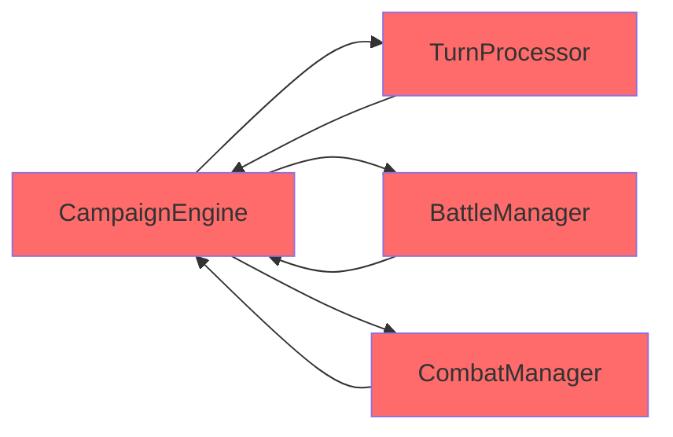
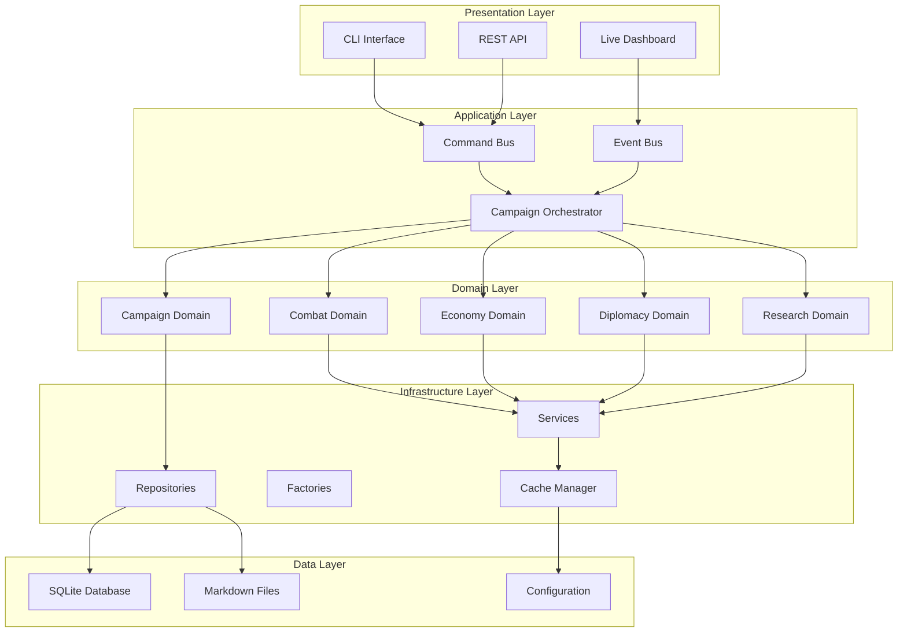
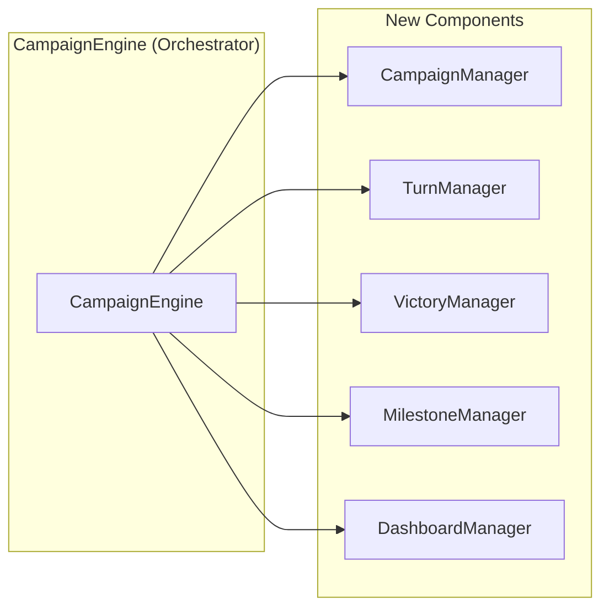
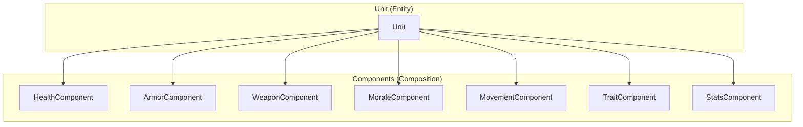
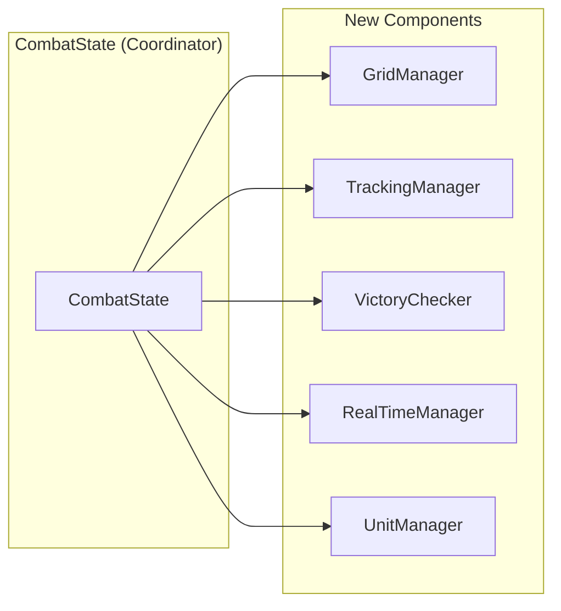
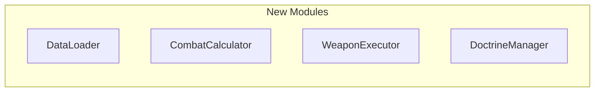
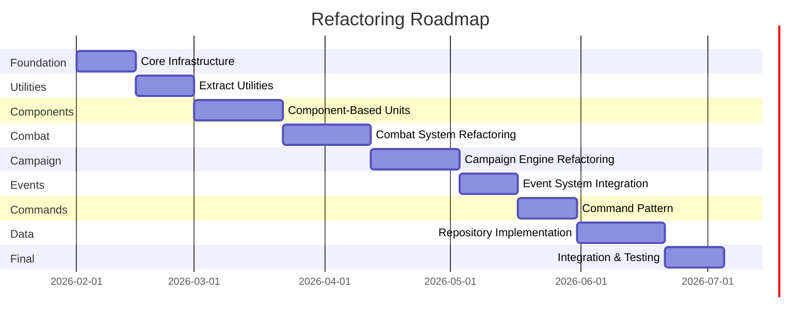
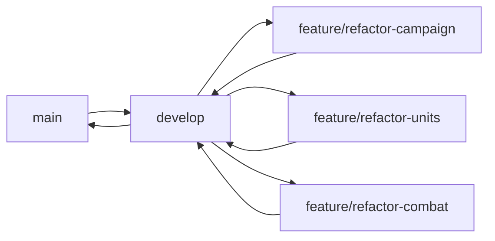
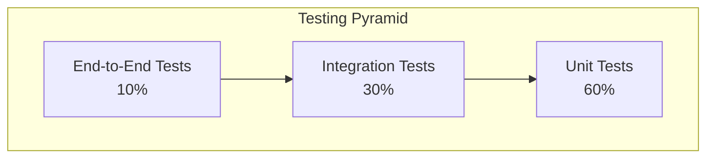

# Multi-Universe Strategy Engine - Comprehensive Refactoring Plan

**Version:** 1.0  
**Date:** 2026-01-31  
**Author:** Combined Analysis (Ask Mode + Architect Mode + Code Mode)

---

## Table of Contents

1. [Executive Summary](#1-executive-summary)
2. [Project Overview](#2-project-overview)
3. [Critical Issues Summary](#3-critical-issues-summary)
4. [Architectural Refactoring Plan](#4-architectural-refactoring-plan)
5. [Code-Level Refactoring Plan](#5-code-level-refactoring-plan)
6. [Prioritized Refactoring Roadmap](#6-prioritized-refactoring-roadmap)
7. [Implementation Guidelines](#7-implementation-guidelines)
8. [Testing Strategy](#8-testing-strategy)
9. [Risk Mitigation](#9-risk-mitigation)
10. [Success Metrics](#10-success-metrics)

---

## 1. Executive Summary

The Multi-Universe Strategy Engine is a sophisticated grand strategy campaign simulator featuring multi-universe support, parallel execution, GPU acceleration, advanced tactical combat, and real-time analytics. While the engine demonstrates impressive capabilities, it suffers from significant code quality issues that impact maintainability, testability, and extensibility.

### Key Findings

| Category | Finding | Severity |
|----------|----------|-----------|
| **God Classes** | CampaignEngine (1199 lines), Unit (739 lines), CombatState (673 lines) | Critical |
| **Code Duplication** | Damage calculations, database loading, stat recalculation | High |
| **Tight Coupling** | Circular dependencies between CampaignEngine, TurnProcessor, and managers | Critical |
| **Missing Abstractions** | Lack of Command, Observer, Factory, Strategy, Repository patterns | High |
| **Anti-patterns** | Shotgun Surgery, Feature Envy, Long Parameter Lists, Data Clumps | Medium |
| **Global State** | TRAIT_DB, POINTS_DB, ACTIVE_UNIVERSE globals | High |
| **Mixed Concerns** | UI, logging, telemetry mixed with business logic | Medium |

### Refactoring Goals

1. **Reduce Complexity** - Break down god classes into focused, single-responsibility components
2. **Eliminate Duplication** - Extract common patterns into reusable utilities
3. **Loosen Coupling** - Implement dependency injection and event-driven communication
4. **Improve Testability** - Design for unit testing with mockable dependencies
5. **Enhance Extensibility** - Enable plugin architecture for new universes and features
6. **Maintain Performance** - Preserve GPU acceleration and parallel execution capabilities

### Expected Benefits

| Benefit | Description |
|----------|-------------|
| **Reduced Maintenance** | Smaller, focused classes are easier to understand and modify |
| **Faster Development** | Clear patterns and abstractions accelerate feature development |
| **Better Testing** | Isolated components enable comprehensive unit testing |
| **Easier Onboarding** | New developers can understand code structure quickly |
| **Future-Proof** | Plugin architecture supports new universes without core changes |

---

## 2. Project Overview

### 2.1 Project Description

The Multi-Universe Strategy Engine is a high-fidelity grand strategy campaign simulator built around the Eternal Crusade universe. It features:

- **Ten Unique Factions**: Zealot Legions, Ascended Order, Iron Vanguard, Hive Swarm, Cyber Synod, Void Corsairs, Solar Hegemony, Rift Daemons, Scavenger Clans, Ancient Guardians
- **Multi-Universe Architecture**: Core simulation layer remains universe-agnostic; universe-specific assets loaded dynamically
- **Real-Time Combat**: Physics-based tactical battles with space and ground layers
- **GPU Acceleration**: Full CuPy support with automatic CUDA detection
- **Parallel Execution**: Simulate multiple campaigns simultaneously on dedicated CPU cores
- **Live Dashboard**: Real-time analytics with FastAPI backend and React frontend

### 2.2 Current Architecture

```
src/
├── engine/              # Parallel execution orchestration
├── managers/            # Campaign and subsystem management
├── combat/              # Tactical simulation
├── models/              # Domain entities (Unit, Faction, Fleet, etc.)
├── ai/                 # Strategic AI
├── core/               # Configuration and universe abstraction
├── reporting/           # Analytics and telemetry
├── services/            # Application services
├── factories/           # Object creation
├── utils/              # Cross-cutting utilities
└── data/               # Data loading and parsing

universes/
├── base/               # Shared schemas and registries
├── eternal_crusade/    # Primary universe content
└── [other universes]   # Extensible universe system
```

### 2.3 Technology Stack

| Component | Technology | Purpose |
|-----------|-------------|----------|
| **Language** | Python 3.7+ | Core implementation |
| **GPU** | CuPy, CUDA 11.x/12.x/13.x | Parallel computation |
| **Web** | FastAPI, React, TypeScript | Dashboard |
| **Database** | SQLite | Persistence |
| **Testing** | pytest | Test framework |
| **Container** | Docker, Docker Compose | Deployment |

---

## 3. Critical Issues Summary

### 3.1 God Classes

| Class | File | Lines | Issues | Priority |
|--------|-------|--------|---------|----------|
| **CampaignEngine** | [`src/managers/campaign_manager.py`](src/managers/campaign_manager.py:67) | 1199 lines; handles campaign, turn, victory, milestones, dashboard, telemetry | P0 |
| **Unit** | [`src/models/unit.py`](src/models/unit.py:5) | 739 lines; 20+ constructor parameters; mixed concerns (damage, components, morale, traits) | P0 |
| **CombatState** | `src/combat/tactical_engine.py` | 673 lines; handles grid, tracking, real-time updates, victory conditions | P0 |
| **TurnProcessor** | [`src/managers/turn_processor.py`](src/managers/turn_processor.py) | ~500 lines; tightly coupled to CampaignEngine | P1 |

### 3.2 Code Duplication

| Duplication Type | Affected Files | Impact | Priority |
|----------------|-----------------|---------|----------|
| **Damage Calculations** | Multiple combat files | Inconsistent damage formulas across battle types | P1 |
| **Database Loading** | Various managers | Redundant SQLite connection code | P2 |
| **Stat Recalculation** | Unit, UnitFactory | Duplicate stat calculation logic | P1 |
| **Telemetry Logging** | Multiple managers | Inconsistent event logging patterns | P2 |

### 3.3 Circular Dependencies



| Dependency Pair | Impact | Priority |
|----------------|---------|----------|
| CampaignEngine ↔ TurnProcessor | Prevents independent testing | P0 |
| CampaignEngine ↔ BattleManager | Tight coupling to engine internals | P0 |
| CampaignEngine ↔ CombatManager | Mixed concerns | P1 |

### 3.4 Missing Design Patterns

| Pattern | Current State | Impact | Priority |
|---------|---------------|---------|----------|
| **Command** | Actions executed directly | No undo/redo support | P1 |
| **Observer/Event Bus** | Direct method calls | Tight coupling to dashboard | P0 |
| **Factory** | Manual object creation | Inconsistent unit initialization | P1 |
| **Strategy** | Hardcoded AI behaviors | Difficult to add new strategies | P1 |
| **Repository** | Direct database access | No abstraction for data layer | P1 |

### 3.5 Anti-Patterns

| Anti-Pattern | Location | Description | Priority |
|--------------|------------|-------------|----------|
| **Shotgun Surgery** | Multiple files | Single change requires modifying many files | P2 |
| **Feature Envy** | Unit, Faction | Methods that belong in other classes | P1 |
| **Long Parameter List** | Unit.__init__ (20+ params) | Difficult to use and test | P1 |
| **Data Clumps** | Various modules | Related variables passed together | P2 |
| **Primitive Obsession** | Throughout | Using primitives instead of value objects | P2 |
| **Magic Numbers** | Combat calculations | Hardcoded constants without explanation | P2 |

### 3.6 Global State Issues

| Global Variable | Location | Issue | Priority |
|----------------|------------|---------|----------|
| `TRAIT_DB` | [`src/combat/combat_utils.py`](src/combat/combat_utils.py) | Mutable global state | P1 |
| `POINTS_DB` | [`src/combat/combat_utils.py`](src/combat/combat_utils.py) | Mutable global state | P1 |
| `ACTIVE_UNIVERSE` | [`src/core/config.py`](src/core/config.py) | Implicit context dependency | P1 |

### 3.7 Issues Summary Table

| ID | Issue | Type | Severity | File(s) | Lines |
|----|-------|-------|-----------|----------|-------|
| C001 | CampaignEngine god class | God Class | Critical | [`src/managers/campaign_manager.py`](src/managers/campaign_manager.py:67) | 67-1199 |
| C002 | Unit god class | God Class | Critical | [`src/models/unit.py`](src/models/unit.py:5) | 5-739 |
| C003 | CombatState god class | God Class | Critical | `src/combat/tactical_engine.py` | 1-673 |
| C004 | Circular dependency: CampaignEngine ↔ TurnProcessor | Circular Dependency | Critical | [`src/managers/campaign_manager.py`](src/managers/campaign_manager.py:88), [`src/managers/turn_processor.py`](src/managers/turn_processor.py) | All |
| C005 | Global TRAIT_DB | Global State | High | [`src/combat/combat_utils.py`](src/combat/combat_utils.py) | All |
| C006 | Global POINTS_DB | Global State | High | [`src/combat/combat_utils.py`](src/combat/combat_utils.py) | All |
| C007 | Long parameter list in Unit.__init__ | Long Parameter List | High | [`src/models/unit.py`](src/models/unit.py:6) | 6-11 |
| C008 | Missing Event Bus | Missing Abstraction | High | Multiple | All |
| C009 | Missing Command Pattern | Missing Abstraction | High | Multiple | All |
| C010 | Direct database access | Missing Abstraction | Medium | Multiple | All |
| C011 | Mixed concerns in managers | Single Responsibility | Medium | Various managers | All |
| C012 | Inconsistent damage calculations | Code Duplication | Medium | Combat files | All |
| C013 | Magic numbers in combat | Primitive Obsession | Medium | Combat files | All |
| C014 | No undo/redo support | Missing Feature | Medium | Multiple | All |
| C015 | Hardcoded AI behaviors | Missing Abstraction | Medium | AI modules | All |

---

## 4. Architectural Refactoring Plan

### 4.1 Proposed New Architecture



### 4.2 Core Architectural Principles

1. **Separation of Concerns** - Each module has a single, well-defined responsibility
2. **Dependency Inversion** - Depend on abstractions, not concrete implementations
3. **Open/Closed Principle** - Open for extension, closed for modification
4. **Interface Segregation** - Small, focused interfaces
5. **Dependency Injection** - All dependencies injected via constructor or container
6. **Event-Driven** - Loose coupling through event bus pattern
7. **Service Locator** - Centralized access to manager services

### 4.3 Key Design Patterns to Implement

| Pattern | Purpose | Location | Priority |
|---------|---------|----------|----------|
| **Command** | Encapsulate actions with undo/redo | `src/commands/` | P1 |
| **Observer** | Decouple dashboard from engine | `src/events/` | P0 |
| **Factory** | Object creation abstraction | `src/factories/` | P1 |
| **Strategy** | Pluggable algorithms | `src/strategies/` | P1 |
| **Repository** | Data access abstraction | `src/repositories/` | P1 |
| **Builder** | Complex object construction | `src/builders/` | P1 |
| **Service Locator** | Manager access | `src/core/service_locator.py` | P0 |
| **Dependency Injection** | Loose coupling | `src/core/di_container.py` | P0 |

### 4.4 Module Organization Plan

```
src/
├── commands/                    # Command pattern implementations
│   ├── __init__.py
│   ├── base_command.py
│   ├── move_fleet_command.py
│   ├── attack_command.py
│   └── command_bus.py
│
├── events/                      # Event system
│   ├── __init__.py
│   ├── event.py
│   ├── event_bus.py
│   └── subscribers/
│       ├── telemetry_subscriber.py
│       └── dashboard_subscriber.py
│
├── repositories/                 # Data access layer
│   ├── __init__.py
│   ├── base_repository.py
│   ├── unit_repository.py
│   ├── faction_repository.py
│   └── fleet_repository.py
│
├── factories/                   # Object creation
│   ├── __init__.py
│   ├── unit_factory.py
│   ├── fleet_factory.py
│   └── factory_registry.py
│
├── builders/                    # Builder pattern
│   ├── __init__.py
│   └── unit_builder.py
│
├── strategies/                  # Strategy pattern
│   ├── __init__.py
│   ├── combat_strategy.py
│   ├── ai_strategy.py
│   └── strategy_factory.py
│
├── combat/                      # Combat domain (reorganized)
│   ├── __init__.py
│   ├── combat_facade.py
│   ├── combat_state.py
│   ├── components/
│   │   ├── health_component.py
│   │   ├── armor_component.py
│   │   ├── weapon_component.py
│   │   ├── morale_component.py
│   │   ├── movement_component.py
│   │   ├── trait_component.py
│   │   └── stats_component.py
│   ├── grid/
│   │   ├── grid_manager.py
│   │   └── spatial_index.py
│   ├── tracking/
│   │   └── tracking_manager.py
│   ├── victory/
│   │   └── victory_checker.py
│   ├── realtime/
│   │   └── realtime_manager.py
│   ├── execution/
│   │   └── weapon_executor.py
│   ├── calculators/
│   │   └── combat_calculator.py
│   └── data/
│       └── data_loader.py
│
├── managers/                    # Managers (reorganized)
│   ├── __init__.py
│   ├── campaign/
│   │   ├── orchestrator.py
│   │   ├── campaign_manager.py
│   │   ├── turn_manager.py
│   │   ├── victory_manager.py
│   │   ├── milestone_manager.py
│   │   └── dashboard_manager.py
│   ├── combat/
│   │   ├── invasion_manager.py
│   │   ├── retreat_handler.py
│   │   └── suppression_manager.py
│   ├── economy/
│   │   ├── budget_allocator.py
│   │   ├── insolvency_handler.py
│   │   └── resource_handler.py
│   └── [other existing managers]
│
├── models/                      # Domain models
│   ├── __init__.py
│   ├── unit.py
│   ├── faction.py
│   ├── fleet.py
│   ├── planet.py
│   └── [other models]
│
├── services/                    # Application services
│   ├── __init__.py
│   ├── combat_service.py
│   ├── construction_service.py
│   └── pathfinding_service.py
│
├── core/                        # Core infrastructure
│   ├── __init__.py
│   ├── interfaces.py
│   ├── service_locator.py
│   ├── di_container.py
│   ├── cache_manager.py
│   └── config.py
│
└── utils/                       # Utilities
    ├── __init__.py
    ├── profiler.py
    ├── game_logging.py
    └── [other utilities]
```

---

## 5. Code-Level Refactoring Plan

### 5.1 CampaignEngine Refactoring

**Current Issues:**
- 1199 lines with multiple responsibilities
- Direct instantiation of managers
- Tight coupling to all subsystems
- Mixed concerns (state, accessors, logging, telemetry)

**Proposed Split:**



**New Classes:**

#### 5.1.1 CampaignManager
**File:** `src/managers/campaign/campaign_manager.py`

```python
class CampaignManager:
    """Manages campaign lifecycle and state persistence."""
    
    def __init__(self, config: Dict[str, Any]):
        self.config = config
        self.factions: Dict[str, Faction] = {}
        self.systems: Dict[str, StarSystem] = {}
        self.turn_number: int = 0
        
    def initialize_campaign(self) -> None:
        """Initialize campaign state."""
        pass
        
    def save_campaign(self) -> None:
        """Persist campaign state."""
        pass
        
    def load_campaign(self, save_id: str) -> bool:
        """Load campaign from save."""
        pass
```

#### 5.1.2 TurnManager
**File:** `src/managers/campaign/turn_manager.py`

```python
class TurnManager:
    """Manages turn sequence and phase execution."""
    
    def __init__(self, campaign_manager: CampaignManager):
        self.campaign_manager = campaign_manager
        self.current_phase: str = "PLANNING"
        
    def process_turn(self, fast_resolve: bool = False) -> None:
        """Execute a complete turn."""
        self._execute_planning_phase()
        self._execute_economic_phase()
        self._execute_diplomacy_phase()
        self._execute_combat_phase()
        self._execute_cleanup_phase()
        
    def _execute_planning_phase(self) -> None:
        """AI strategic planning."""
        pass
```

#### 5.1.3 VictoryManager
**File:** `src/managers/campaign/victory_manager.py`

```python
class VictoryManager:
    """Handles victory condition checking and end-game scenarios."""
    
    def __init__(self, config: Dict[str, Any]):
        self.config = config
        self.victory_conditions: List[VictoryCondition] = []
        
    def check_victory(self) -> Optional[str]:
        """Check if any faction has achieved victory."""
        for condition in self.victory_conditions:
            winner = condition.check()
            if winner:
                return winner
        return None
```

#### 5.1.4 Refactored CampaignEngine (Orchestrator)
**File:** `src/managers/campaign/orchestrator.py`

```python
class CampaignOrchestrator:
    """Lightweight orchestrator that coordinates domain managers."""
    
    def __init__(self, config: Dict[str, Any], di_container: DIContainer):
        self._di = di_container
        self._config = config
        
        # Core properties
        self.turn_counter: int = 0
        self.campaign_id: str = self._generate_campaign_id()
        
        # Managers are injected, not instantiated
        self.campaign_manager: CampaignManager = self._di.get('CampaignManager')
        self.turn_manager: TurnManager = self._di.get('TurnManager')
        self.victory_manager: VictoryManager = self._di.get('VictoryManager')
        self.milestone_manager: MilestoneManager = self._di.get('MilestoneManager')
        self.dashboard_manager: DashboardManager = self._di.get('DashboardManager')
        
        # Service locator for backward compatibility
        ServiceLocator.initialize(self._di)
        
    def process_turn(self, fast_resolve: bool = False) -> None:
        """Delegates to TurnManager"""
        return self.turn_manager.process_turn(fast_resolve)
    
    def check_victory(self) -> Optional[str]:
        """Delegates to VictoryManager"""
        return self.victory_manager.check_victory()
```

### 5.2 Unit Class Refactoring

**Current Issues:**
- 739 lines with multiple responsibilities
- Massive `__init__` with 20+ parameters
- Mixed concerns: damage, components, morale, traits
- Hardcoded trait application logic
- Complex `take_damage` method

**Proposed Split Using Composition:**



**New Component Classes:**

#### 5.2.1 HealthComponent
**File:** `src/combat/components/health_component.py`

```python
class HealthComponent:
    """Manages unit health and damage."""
    
    def __init__(self, max_hp: int, regen_rate: float = 0):
        self.max_hp = max_hp
        self.current_hp = max_hp
        self.regen_rate = regen_rate
        self.hp_start_of_round = max_hp
        
    def take_damage(self, amount: int) -> int:
        """Returns actual damage taken (after mitigation)"""
        old_hp = self.current_hp
        self.current_hp = max(0, self.current_hp - amount)
        return old_hp - self.current_hp
        
    def heal(self, amount: int) -> int:
        """Returns actual healing applied"""
        old_hp = self.current_hp
        self.current_hp = min(self.max_hp, self.current_hp + amount)
        return self.current_hp - old_hp
        
    def is_alive(self) -> bool:
        return self.current_hp > 0
        
    def reset(self):
        self.current_hp = self.max_hp
        self.hp_start_of_round = self.max_hp
```

#### 5.2.2 ArmorComponent
**File:** `src/combat/components/armor_component.py`

```python
class ArmorComponent:
    """Manages unit armor and facing."""
    
    def __init__(self, base_armor: int):
        self.base_armor = base_armor
        self.armor_front = base_armor
        self.armor_side = int(base_armor * 0.8)
        self.armor_rear = int(base_armor * 0.6)
        
    def get_armor_for_facing(self, facing_angle: float) -> int:
        """Returns armor value for given facing angle."""
        if 135 <= facing_angle <= 225:  # Rear
            return self.armor_rear
        elif (45 <= facing_angle <= 135) or (225 <= facing_angle <= 315):  # Side
            return self.armor_side
        return self.armor_front  # Front
```

#### 5.2.3 WeaponComponent
**File:** `src/combat/components/weapon_component.py`

```python
class WeaponComponent:
    """Manages weapon data and damage calculation."""
    
    def __init__(self, weapon_data: Dict[str, Any]):
        self.name = weapon_data.get('name', 'Unknown')
        self.range = weapon_data.get('Range', 24)
        self.strength = weapon_data.get('S', weapon_data.get('Str', 4))
        self.ap = weapon_data.get('AP', 0)
        self.damage = weapon_data.get('D', 1)
        self.type = weapon_data.get('Type', 'Kinetic')
        self.tags = weapon_data.get('tags', [])
        self.arc = weapon_data.get('Arc', 'Dorsal')
        
    def calculate_damage(self, target_armor: int, distance: float) -> float:
        """Calculates damage against a target."""
        # Apply melta bonus at half range
        if 'melta' in self.tags and distance <= (self.range / 2):
            return self.strength * 10 * self.damage * 1.5
        return self.strength * 10 * self.damage
```

#### 5.2.4 MoraleComponent
**File:** `src/combat/components/morale_component.py`

```python
class MoraleComponent:
    """Manages unit morale and state."""
    
    def __init__(self, base_morale: int = 100):
        self.max_morale = base_morale
        self.current_morale = base_morale
        self.state = "Steady"
        self.recent_damage_taken = 0.0
        self.time_since_last_damage = 0.0
        
    def take_damage(self, amount: float):
        """Apply morale damage from taking hits."""
        self.recent_damage_taken += amount
        self.time_since_last_damage = 0.0
        self.current_morale = max(0, self.current_morale - (amount / 10))
        self._update_state()
        
    def update(self, dt: float):
        """Update morale state over time."""
        self.time_since_last_damage += dt
        if self.time_since_last_damage > 5.0:  # 5 seconds
            self.recent_damage_taken *= 0.9  # Decay
            self._update_state()
```

#### 5.2.5 TraitComponent
**File:** `src/combat/components/trait_component.py`

```python
class TraitComponent:
    """Manages unit traits and applies modifiers."""
    
    def __init__(self, traits: List[str]):
        self.traits = traits
        
    def has_trait(self, trait_name: str) -> bool:
        return trait_name in self.traits
        
    def apply_modifiers(self, stats: Dict[str, Any], trait_registry: Dict[str, Dict]):
        """Applies trait modifiers to stats."""
        for trait in self.traits:
            if trait in trait_registry:
                modifiers = trait_registry[trait].get('modifiers', {})
                for stat, value in modifiers.items():
                    if stat in stats:
                        stats[stat] = self._apply_modifier(stats[stat], value)
        return stats
```

#### 5.2.6 Refactored Unit Class
**File:** `src/models/unit.py`

```python
class Unit:
    """Lightweight unit entity using composition."""
    
    def __init__(
        self,
        name: str,
        faction: str,
        unit_class: Optional[str] = None,
        domain: Optional[str] = None,
        components: Optional[List[Any]] = None
    ):
        self.name = name
        self.faction = faction
        self.unit_class = unit_class
        self.domain = domain
        self.blueprint_id = f"blueprint_{name.lower().replace(' ', '_')}"
        
        # Composition: Components are injected
        self.health: Optional[HealthComponent] = None
        self.armor: Optional[ArmorComponent] = None
        self.weapons: List[WeaponComponent] = []
        self.morale: Optional[MoraleComponent] = None
        self.traits: Optional[TraitComponent] = None
        self.movement: Optional[MovementComponent] = None
        self.stats: Optional[StatsComponent] = None
        
        # Register components
        if components:
            for comp in components:
                self.add_component(comp)
    
    def add_component(self, component: Any) -> None:
        """Adds a component to unit."""
        component_type = type(component).__name__
        if component_type == 'HealthComponent':
            self.health = component
        elif component_type == 'ArmorComponent':
            self.armor = component
        elif component_type == 'WeaponComponent':
            self.weapons.append(component)
        # ... other component types
    
    def take_damage(self, amount: int, impact_angle: float = 0) -> Dict[str, Any]:
        """Delegates damage handling to components."""
        result = {
            'shields': 0,
            'hull': 0,
            'component_destroyed': None
        }
        
        # Apply armor mitigation
        if self.armor:
            armor_value = self.armor.get_armor_for_facing(impact_angle)
            mitigated = self._calculate_mitigation(armor_value)
            amount = int(amount * (1.0 - mitigated))
        
        # Apply hull damage
        if self.health:
            actual_dmg = self.health.take_damage(amount)
            result['hull'] = actual_dmg
            
            # Update morale
            if self.morale:
                self.morale.take_damage(actual_dmg)
        
        return result
```

#### 5.2.7 UnitBuilder
**File:** `src/builders/unit_builder.py`

```python
class UnitBuilder:
    """Builder pattern for complex unit construction."""
    
    def __init__(self, name: str, faction: str):
        self.unit = Unit(name, faction)
        self._components = []
    
    def with_health(self, max_hp: int, regen: float = 0) -> 'UnitBuilder':
        self._components.append(HealthComponent(max_hp, regen))
        return self
    
    def with_armor(self, base_armor: int) -> 'UnitBuilder':
        self._components.append(ArmorComponent(base_armor))
        return self
    
    def with_weapon(self, weapon_data: Dict[str, Any]) -> 'UnitBuilder':
        self._components.append(WeaponComponent(weapon_data))
        return self
    
    def with_morale(self, base_morale: int = 100) -> 'UnitBuilder':
        self._components.append(MoraleComponent(base_morale))
        return self
    
    def with_traits(self, traits: List[str]) -> 'UnitBuilder':
        self._components.append(TraitComponent(traits))
        return self
    
    def with_movement(self, speed: int) -> 'UnitBuilder':
        self._components.append(MovementComponent(speed))
        return self
    
    def with_stats(self, stats: Dict[str, Any]) -> 'UnitBuilder':
        self._components.append(StatsComponent(stats))
        return self
    
    def build(self) -> Unit:
        for comp in self._components:
            self.unit.add_component(comp)
        return self.unit

# Usage
unit = (UnitBuilder("Space Marine", "Imperium")
    .with_health(100, regen=5)
    .with_armor(50)
    .with_weapon({"name": "Bolter", "Range": 24, "S": 4, "D": 1})
    .with_morale(100)
    .with_traits(["Veteran", "And They Shall Know No Fear"])
    .with_movement(6)
    .with_stats({"ma": 50, "md": 50})
    .build())
```

### 5.3 CombatState Refactoring

**Current Issues:**
- 673 lines with mixed concerns
- Handles grid, tracking, real-time updates, victory conditions
- Direct coupling to many combat subsystems

**Proposed Split:**



**New Classes:**

#### 5.3.1 GridManager
**File:** `src/combat/grid/grid_manager.py`

```python
class GridManager:
    """Manages tactical grid and spatial queries."""
    
    def __init__(self, width: int, height: int):
        self.width = width
        self.height = height
        self.grid = TacticalGrid(width, height)
        self.spatial_index = SpatialGrid(width, height)
        
    def place_unit(self, unit: Any, x: int, y: int) -> bool:
        return self.grid.place_unit(unit, x, y)
        
    def get_distance(self, unit_a: Any, unit_b: Any) -> float:
        return self.grid.get_distance(unit_a, unit_b)
        
    def get_units_in_radius(self, x: int, y: int, radius: int) -> List[Any]:
        return self.spatial_index.query_circle(x, y, radius)
```

#### 5.3.2 TrackingManager
**File:** `src/combat/tracking/tracking_manager.py`

```python
class TrackingManager:
    """Manages combat logging and snapshots."""
    
    def __init__(self, json_path: Optional[str] = None, telemetry=None):
        self.tracker = CombatTracker(json_path, telemetry)
        self.snapshots = []
        self.event_log = []
        
    def log_snapshot(self, unit: Any):
        self.tracker.log_snapshot(unit)
        
    def log_event(self, event_type: str, *args, **kwargs):
        self.tracker.log_event(event_type, *args, **kwargs)
```

#### 5.3.3 VictoryChecker
**File:** `src/combat/victory/victory_checker.py`

```python
class VictoryChecker:
    """Handles victory condition evaluation."""
    
    def __init__(self, defender_factions: set):
        self.defender_factions = defender_factions
        self.rounds_since_damage = 0
        self.rounds_since_kill = 0
        
    def check_victory(self, armies: Dict[str, List[Any]]) -> tuple:
        """
        Returns (winner, survivors, is_finished)
        """
        active_factions = [f for f, units in armies.items() 
                        if any(u.is_alive() for u in units)]
        
        # Stalemate conditions
        if self.rounds_since_damage >= 500:
            return self._resolve_stalemate(active_factions, armies)
        
        if len(active_factions) <= 1:
            winner = active_factions[0] if active_factions else "Draw"
            survivors = sum(1 for u in armies.get(winner, []) if u.is_alive())
            return winner, survivors, True
        
        return "Draw", 0, False
```

### 5.4 combat_utils.py Decomposition

**Current Issues:**
- 590 lines mixing utilities, data loading, weapon execution
- Global state (TRAIT_DB, POINTS_DB)
- Mixed responsibilities

**Proposed Split:**



**New Modules:**

#### 5.4.1 DataLoader
**File:** `src/combat/data/data_loader.py`

```python
class DataLoader:
    """Handles loading of combat-related data."""
    
    @staticmethod
    def load_traits(db_path: Optional[str] = None) -> List[Dict[str, Any]]:
        """Loads trait database from markdown."""
        from src.core.universe_data import UniverseDataManager
        uni_config = UniverseDataManager.get_instance().universe_config
        
        if not db_path and uni_config:
            db_path = uni_config.factions_dir / "trait_database.md"
        
        if not db_path or not db_path.exists():
            from src.core.config import DATA_DIR
            db_path = DATA_DIR / "trait_database.md"
        
        traits = []
        try:
            with open(db_path, 'r', encoding='utf-8') as f:
                for line in f:
                    if not line.startswith("| TRAIT"):
                        continue
                    parts = [p.strip() for p in line.split("|")]
                    if len(parts) >= 5:
                        traits.append({
                            "name": parts[2],
                            "type": parts[3],
                            "effect": parts[4]
                        })
        except Exception as e:
            print(f"Warning: Could not load traits: {e}")
        
        return traits
```

#### 5.4.2 CombatCalculator
**File:** `src/combat/calculators/combat_calculator.py`

```python
class CombatCalculator:
    """Pure functions for combat calculations."""
    
    @staticmethod
    def calculate_mitigation(
        armor: int,
        ap: int = 0,
        cover_bonus: float = 0.0,
        invuln: int = 7
    ) -> float:
        """Calculates damage mitigation percentage."""
        save_target = 7.0 - (armor / 10.0) + (ap / 10.0)
        save_target -= cover_bonus
        save_target = max(2.0, min(6.0, save_target))
        
        stop_chance = (6.0 - save_target) / 6.0
        invuln_chance = (6.0 - invuln) / 6.0
        
        final_mitigation = max(stop_chance, invuln_chance)
        return min(0.95, final_mitigation)
    
    @staticmethod
    def calculate_hit_chance(
        bs: int,
        distance: float,
        base_range: float = 24,
        suppression: bool = False
    ) -> int:
        """Calculates Ballistic Skill after modifiers."""
        modified_bs = bs
        
        if distance > base_range:
            modified_bs -= 10  # Long range penalty
        
        if suppression:
            modified_bs -= 20  # Suppression penalty
        
        return max(5, modified_bs)  # Accuracy floor
```

### 5.5 Event Bus Implementation

**File:** `src/events/event_bus.py`

```python
from typing import Callable, List, Dict
from collections import defaultdict
from dataclasses import dataclass
from datetime import datetime

@dataclass
class Event:
    """Base event class."""
    event_type: str
    timestamp: datetime
    data: Dict[str, Any]
    source: Optional[str] = None

class EventBus:
    """Central event dispatcher."""
    
    _instance: Optional['EventBus'] = None
    
    def __init__(self):
        if EventBus._instance is not None:
            raise RuntimeError("EventBus is a singleton")
        EventBus._instance = self
        self._subscribers: Dict[str, List[Callable]] = defaultdict(list)
    
    @classmethod
    def get_instance(cls) -> 'EventBus':
        if cls._instance is None:
            cls._instance = cls()
        return cls._instance
    
    def subscribe(self, event_type: str, handler: Callable[[Event], None]) -> None:
        """Subscribe to an event type."""
        self._subscribers[event_type].append(handler)
    
    def unsubscribe(self, event_type: str, handler: Callable[[Event], None]) -> None:
        """Unsubscribe from an event type."""
        if handler in self._subscribers[event_type]:
            self._subscribers[event_type].remove(handler)
    
    def publish(self, event: Event) -> None:
        """Publish an event to all subscribers."""
        for handler in self._subscribers[event.event_type]:
            try:
                handler(event)
            except Exception as e:
                print(f"Error in event handler: {e}")
```

### 5.6 Command Pattern Implementation

**File:** `src/commands/command_bus.py`

```python
from abc import ABC, abstractmethod
from typing import List, Optional

class Command(ABC):
    """Base interface for all commands."""
    
    @abstractmethod
    def execute(self) -> None:
        """Execute command."""
        pass
    
    @abstractmethod
    def undo(self) -> None:
        """Undo command."""
        pass
    
    @abstractmethod
    def can_execute(self) -> bool:
        """Check if command can be executed."""
        pass

class CommandBus:
    """Central command dispatcher with undo/redo support."""
    
    def __init__(self):
        self._undo_stack: List[Command] = []
        self._redo_stack: List[Command] = []
    
    def execute(self, command: Command) -> bool:
        if not command.can_execute():
            return False
        
        command.execute()
        self._undo_stack.append(command)
        self._redo_stack.clear()
        return True
    
    def undo(self) -> bool:
        if not self._undo_stack:
            return False
        
        command = self._undo_stack.pop()
        command.undo()
        self._redo_stack.append(command)
        return True
    
    def redo(self) -> bool:
        if not self._redo_stack:
            return False
        
        command = self._redo_stack.pop()
        command.execute()
        self._undo_stack.append(command)
        return True
```

### 5.7 Dependency Injection Container

**File:** `src/core/di_container.py`

```python
from typing import Any, Callable, Dict, Optional, Type

class DIContainer:
    """Simple dependency injection container."""
    
    def __init__(self):
        self._services: Dict[str, Any] = {}
        self._factories: Dict[str, Callable[[], Any]] = {}
        self._singletons: Dict[str, Any] = {}
    
    def register_singleton(self, name: str, instance: Any) -> None:
        """Register a singleton instance."""
        self._services[name] = instance
        self._singletons[name] = instance
    
    def register_transient(self, name: str, factory: Callable[[], Any]) -> None:
        """Register a transient factory."""
        self._factories[name] = factory
    
    def get(self, name: str) -> Any:
        """Resolve a dependency by name."""
        # Check singletons first
        if name in self._singletons:
            return self._singletons[name]
        
        # Check services
        if name in self._services:
            return self._services[name]
        
        # Check factories
        if name in self._factories:
            instance = self._factories[name]()
            return instance
        
        raise ValueError(f"Dependency '{name}' not found in container")
```

### 5.8 Service Locator

**File:** `src/core/service_locator.py`

```python
from typing import Any, Optional, Dict

class ServiceLocator:
    """
    Central service locator for accessing managers and services.
    Provides backward compatibility while enabling dependency injection.
    """
    
    _instance: Optional['ServiceLocator'] = None
    _services: Dict[str, Any] = {}
    
    def __init__(self):
        if ServiceLocator._instance is not None:
            raise RuntimeError("ServiceLocator is a singleton")
        ServiceLocator._instance = self
    
    @classmethod
    def initialize(cls, di_container: Any) -> None:
        """Initialize with a dependency injection container."""
        cls._instance = cls()
        cls._services = {}
        cls._di_container = di_container
    
    @classmethod
    def get(cls, service_name: str) -> Any:
        """Get a service by name."""
        if service_name not in cls._services:
            # Try to resolve from DI container
            if hasattr(cls, '_di_container'):
                service = cls._di_container.get(service_name)
                if service:
                    cls._services[service_name] = service
                    return service
            raise ValueError(f"Service '{service_name}' not registered")
        return cls._services[service_name]
```

### 5.9 Repository Pattern Implementation

**File:** `src/repositories/base_repository.py`

```python
from abc import ABC, abstractmethod
from typing import List, Optional, Dict, Any

class BaseRepository(ABC):
    """Base repository interface."""
    
    @abstractmethod
    def get_by_id(self, entity_id: str) -> Optional[Any]:
        pass
    
    @abstractmethod
    def get_all(self) -> List[Any]:
        pass
    
    @abstractmethod
    def save(self, entity: Any) -> None:
        pass
    
    @abstractmethod
    def delete(self, entity_id: str) -> None:
        pass
```

**File:** `src/repositories/unit_repository.py`

```python
class UnitRepository(BaseRepository):
    """Repository for unit data."""
    
    def __init__(self, db_path: str):
        import sqlite3
        self._conn = sqlite3.connect(db_path)
        self._cursor = self._conn.cursor()
        self._create_table()
    
    def _create_table(self):
        self._cursor.execute("""
            CREATE TABLE IF NOT EXISTS units (
                id TEXT PRIMARY KEY,
                name TEXT NOT NULL,
                faction TEXT NOT NULL,
                blueprint_id TEXT,
                current_hp INTEGER,
                max_hp INTEGER,
                data JSON
            )
        """)
        self._conn.commit()
    
    def get_by_id(self, entity_id: str) -> Optional[Any]:
        self._cursor.execute("SELECT * FROM units WHERE id = ?", (entity_id,))
        row = self._cursor.fetchone()
        if row:
            return self._row_to_entity(row)
        return None
    
    def get_all(self) -> List[Any]:
        self._cursor.execute("SELECT * FROM units")
        rows = self._cursor.fetchall()
        return [self._row_to_entity(row) for row in rows]
```

---

## 6. Prioritized Refactoring Roadmap

### 6.1 Phase Overview



### 6.2 Phase 1: Foundation (Weeks 1-2)

**Goal:** Establish new architecture patterns without breaking existing code

| Task | Description | File(s) | Priority | Effort |
|------|-------------|------------|-----------|---------|
| Create new directory structure | Set up commands/, events/, repositories/, factories/, builders/, strategies/ | Multiple | P0 | 2 days |
| Implement ServiceLocator | Central service access | [`src/core/service_locator.py`](src/core/service_locator.py) | P0 | 1 day |
| Implement DIContainer | Dependency injection | [`src/core/di_container.py`](src/core/di_container.py) | P0 | 1 day |
| Implement EventBus | Event system | [`src/events/event_bus.py`](src/events/event_bus.py) | P0 | 2 days |
| Create base interfaces | IEngine, IRepository, IManager | [`src/core/interfaces.py`](src/core/interfaces.py) | P1 | 1 day |
| Set up test infrastructure | pytest configuration, test utilities | `tests/` | P1 | 2 days |

**Deliverables:**
- New directories created
- Core infrastructure implemented
- Tests for infrastructure passing

### 6.3 Phase 2: Extract Utilities (Weeks 3-4)

**Goal:** Extract utility functions from god classes

| Task | Description | File(s) | Priority | Effort |
|------|-------------|------------|-----------|---------|
| Extract DataLoader | From combat_utils.py | [`src/combat/data/data_loader.py`](src/combat/data/data_loader.py) | P1 | 2 days |
| Extract CombatCalculator | From combat_utils.py | [`src/combat/calculators/combat_calculator.py`](src/combat/calculators/combat_calculator.py) | P1 | 3 days |
| Extract WeaponExecutor | From combat_utils.py | [`src/combat/execution/weapon_executor.py`](src/combat/execution/weapon_executor.py) | P1 | 3 days |
| Create repository interfaces | BaseRepository, specialized interfaces | [`src/repositories/`](src/repositories/) | P1 | 2 days |
| Implement basic repositories | UnitRepository, FactionRepository | [`src/repositories/`](src/repositories/) | P2 | 3 days |

**Deliverables:**
- DataLoader module created
- CombatCalculator module created
- WeaponExecutor module created
- Repository interfaces defined
- Basic repositories implemented

### 6.4 Phase 3: Component-Based Units (Weeks 5-7)

**Goal:** Refactor Unit class to use composition

| Task | Description | File(s) | Priority | Effort |
|------|-------------|------------|-----------|---------|
| Create HealthComponent | Unit health management | [`src/combat/components/health_component.py`](src/combat/components/health_component.py) | P0 | 1 day |
| Create ArmorComponent | Unit armor and facing | [`src/combat/components/armor_component.py`](src/combat/components/armor_component.py) | P0 | 1 day |
| Create WeaponComponent | Weapon data and calculation | [`src/combat/components/weapon_component.py`](src/combat/components/weapon_component.py) | P0 | 2 days |
| Create MoraleComponent | Unit morale and state | [`src/combat/components/morale_component.py`](src/combat/components/morale_component.py) | P0 | 1 day |
| Create TraitComponent | Trait management | [`src/combat/components/trait_component.py`](src/combat/components/trait_component.py) | P0 | 1 day |
| Create MovementComponent | Unit movement | [`src/combat/components/movement_component.py`](src/combat/components/movement_component.py) | P0 | 1 day |
| Create StatsComponent | Unit statistics | [`src/combat/components/stats_component.py`](src/combat/components/stats_component.py) | P0 | 1 day |
| Create UnitBuilder | Builder pattern | [`src/builders/unit_builder.py`](src/builders/unit_builder.py) | P1 | 2 days |
| Refactor Unit class | Use composition | [`src/models/unit.py`](src/models/unit.py) | P0 | 3 days |
| Update UnitFactory | Use builder | [`src/factories/unit_factory.py`](src/factories/unit_factory.py) | P1 | 2 days |
| Migrate unit creation | Update all callers | Multiple | P1 | 3 days |

**Deliverables:**
- All component classes created
- UnitBuilder implemented
- Unit class refactored
- UnitFactory updated
- Unit tests passing

### 6.5 Phase 4: Combat System Refactoring (Weeks 8-10)

**Goal:** Refactor CombatState and combat utilities

| Task | Description | File(s) | Priority | Effort |
|------|-------------|------------|-----------|---------|
| Create GridManager | Tactical grid management | [`src/combat/grid/grid_manager.py`](src/combat/grid/grid_manager.py) | P0 | 3 days |
| Create TrackingManager | Combat logging | [`src/combat/tracking/tracking_manager.py`](src/combat/tracking/tracking_manager.py) | P0 | 2 days |
| Create VictoryChecker | Victory conditions | [`src/combat/victory/victory_checker.py`](src/combat/victory/victory_checker.py) | P0 | 2 days |
| Create RealTimeManager | Real-time updates | [`src/combat/realtime/realtime_manager.py`](src/combat/realtime/realtime_manager.py) | P0 | 3 days |
| Refactor CombatState | Use new managers | [`src/combat/combat_state.py`](src/combat/combat_state.py) | P0 | 3 days |
| Update combat execution flow | New flow | [`src/combat/`](src/combat/) | P1 | 3 days |

**Deliverables:**
- GridManager implemented
- TrackingManager implemented
- VictoryChecker implemented
- RealTimeManager implemented
- CombatState refactored
- Combat tests passing

### 6.6 Phase 5: Campaign Engine Refactoring (Weeks 11-13)

**Goal:** Split CampaignEngine into focused managers

| Task | Description | File(s) | Priority | Effort |
|------|-------------|------------|-----------|---------|
| Create CampaignManager | Campaign lifecycle | [`src/managers/campaign/campaign_manager.py`](src/managers/campaign/campaign_manager.py) | P0 | 3 days |
| Create TurnManager | Turn sequence | [`src/managers/campaign/turn_manager.py`](src/managers/campaign/turn_manager.py) | P0 | 3 days |
| Create VictoryManager | Victory checking | [`src/managers/campaign/victory_manager.py`](src/managers/campaign/victory_manager.py) | P0 | 2 days |
| Create MilestoneManager | Milestone tracking | [`src/managers/campaign/milestone_manager.py`](src/managers/campaign/milestone_manager.py) | P0 | 1 day |
| Create DashboardManager | Dashboard communication | [`src/managers/campaign/dashboard_manager.py`](src/managers/campaign/dashboard_manager.py) | P0 | 2 days |
| Refactor CampaignEngine | To orchestrator | [`src/managers/campaign/orchestrator.py`](src/managers/campaign/orchestrator.py) | P0 | 3 days |
| Update all callers | Use new orchestrator | Multiple | P1 | 3 days |

**Deliverables:**
- CampaignManager implemented
- TurnManager implemented
- VictoryManager implemented
- MilestoneManager implemented
- DashboardManager implemented
- CampaignOrchestrator created
- Campaign tests passing

### 6.7 Phase 6: Event System Integration (Weeks 14-15)

**Goal:** Integrate event bus throughout the system

| Task | Description | File(s) | Priority | Effort |
|------|-------------|------------|-----------|---------|
| Create event types | All major game events | [`src/events/event.py`](src/events/event.py) | P0 | 2 days |
| Implement event publishers | For each domain | Multiple | P0 | 5 days |
| Implement event subscribers | Dashboard, telemetry, logging | [`src/events/subscribers/`](src/events/subscribers/) | P0 | 3 days |
| Replace telemetry calls | With event publishing | Multiple | P1 | 3 days |
| Replace dashboard updates | With event subscriptions | Multiple | P1 | 3 days |

**Deliverables:**
- Event types defined
- Event publishers created
- Event subscribers created
- Event bus integrated
- System tests passing

### 6.8 Phase 7: Command Pattern Implementation (Weeks 16-17)

**Goal:** Implement command pattern for actions

| Task | Description | File(s) | Priority | Effort |
|------|-------------|------------|-----------|---------|
| Create base Command interface | Command contract | [`src/commands/base_command.py`](src/commands/base_command.py) | P0 | 1 day |
| Implement CommandBus | With undo/redo | [`src/commands/command_bus.py`](src/commands/command_bus.py) | P0 | 2 days |
| Create MoveFleetCommand | Fleet movement | [`src/commands/move_fleet_command.py`](src/commands/move_fleet_command.py) | P1 | 2 days |
| Create AttackCommand | Combat actions | [`src/commands/attack_command.py`](src/commands/attack_command.py) | P1 | 2 days |
| Create BuildCommand | Construction | [`src/commands/build_command.py`](src/commands/build_command.py) | P1 | 2 days |
| Integrate command bus | Into game loop | Multiple | P1 | 3 days |
| Add undo/redo to UI | Dashboard controls | `frontend/` | P2 | 3 days |

**Deliverables:**
- Command interface created
- Command bus implemented
- Commands created
- Command system integrated
- UI controls for undo/redo

### 6.9 Phase 8: Repository Implementation (Weeks 18-20)

**Goal:** Implement repository pattern for data access

| Task | Description | File(s) | Priority | Effort |
|------|-------------|------------|-----------|---------|
| Create repository interfaces | Base and specialized | [`src/repositories/`](src/repositories/) | P1 | 2 days |
| Implement UnitRepository | Unit data access | [`src/repositories/unit_repository.py`](src/repositories/unit_repository.py) | P1 | 3 days |
| Implement FactionRepository | Faction data access | [`src/repositories/faction_repository.py`](src/repositories/faction_repository.py) | P1 | 2 days |
| Implement FleetRepository | Fleet data access | [`src/repositories/fleet_repository.py`](src/repositories/fleet_repository.py) | P1 | 2 days |
| Create repository factory | Repository creation | [`src/repositories/repository_factory.py`](src/repositories/repository_factory.py) | P2 | 1 day |
| Replace database access | With repositories | Multiple | P1 | 5 days |
| Add repository caching | Cache layer | [`src/core/cache_manager.py`](src/core/cache_manager.py) | P2 | 2 days |

**Deliverables:**
- Repository interfaces defined
- Repositories implemented
- Repository factory created
- Data access refactored
- Database tests passing

### 6.10 Phase 9: Final Integration & Testing (Weeks 21-22)

**Goal:** Complete refactoring and ensure system stability

| Task | Description | File(s) | Priority | Effort |
|------|-------------|------------|-----------|---------|
| Remove deprecated code | Legacy code paths | Multiple | P1 | 3 days |
| Update all imports | Use new structure | Multiple | P1 | 2 days |
| Run integration tests | Full system tests | `tests/integration/` | P0 | 5 days |
| Performance benchmarking | Critical paths | `tests/performance/` | P1 | 3 days |
| Documentation updates | README, API docs | `docs/` | P2 | 3 days |

**Deliverables:**
- Legacy code removed
- Imports updated
- Integration tests passing
- Performance benchmarks created
- Documentation updated
- System stable

---

## 7. Implementation Guidelines

### 7.1 Coding Standards

#### 7.1.1 Naming Conventions

| Type | Convention | Example |
|-------|-------------|----------|
| **Files** | `snake_case.py` | `unit_builder.py`, `combat_calculator.py` |
| **Classes** | `PascalCase` | `UnitBuilder`, `CombatCalculator`, `EventBus` |
| **Functions/Methods** | `snake_case` | `calculate_damage()`, `get_unit_by_id()` |
| **Constants** | `UPPER_SNAKE_CASE` | `MAX_COMBAT_ROUNDS`, `DEFAULT_GRID_SIZE` |
| **Private Members** | `_prefix` | `_internal_method()`, `private_var` |
| **Interfaces** | `IPrefix` | `IEngine`, `ITurnProcessor`, `IRepository` |

#### 7.1.2 Code Style

- **PEP 8 Compliance**: Follow Python style guide
- **Type Hints**: Use type hints for all function signatures
- **Docstrings**: Google-style docstrings for all public methods
- **Line Length**: Maximum 100 characters per line
- **Import Order**: Standard library → Third-party → Local

```python
# Example: Proper function signature
def calculate_damage(
    attacker: Unit,
    defender: Unit,
    weapon: WeaponComponent,
    distance: float
) -> Dict[str, Any]:
    """
    Calculates damage dealt by attacker to defender.
    
    Args:
        attacker: The attacking unit.
        defender: The defending unit.
        weapon: The weapon being used.
        distance: Distance between units.
        
    Returns:
        Dictionary containing damage breakdown.
    """
    pass
```

### 7.2 Design Principles

#### 7.2.1 Single Responsibility Principle

Each class should have one reason to change.

```python
# BAD: Multiple responsibilities
class Unit:
    def __init__(self, ...):
        # Health logic
        # Armor logic
        # Weapon logic
        # Movement logic
        # etc.

# GOOD: Single responsibility
class Unit:
    """Coordinates components."""
    pass

class HealthComponent:
    """Manages health."""
    pass

class ArmorComponent:
    """Manages armor."""
    pass
```

#### 7.2.2 Dependency Inversion

Depend on abstractions, not concrete implementations.

```python
# BAD: Concrete dependency
class BattleManager:
    def __init__(self):
        self.unit_repo = UnitRepository("db.sqlite")

# GOOD: Abstract dependency
class BattleManager:
    def __init__(self, unit_repo: IUnitRepository):
        self.unit_repo = unit_repo
```

#### 7.2.3 Open/Closed Principle

Open for extension, closed for modification.

```python
# BAD: Modify for new strategy
class AI:
    def execute_turn(self):
        if self.strategy == "aggressive":
            # aggressive logic
        elif self.strategy == "defensive":
            # defensive logic
        # Must modify for new strategies

# GOOD: Extend for new strategy
class AIStrategy(ABC):
    @abstractmethod
    def execute(self, ai: AI) -> None:
        pass

class AggressiveStrategy(AIStrategy):
    def execute(self, ai: AI) -> None:
        # aggressive logic

class AI:
    def __init__(self, strategy: AIStrategy):
        self.strategy = strategy
    
    def execute_turn(self):
        self.strategy.execute(self)
```

### 7.3 Testing Guidelines

#### 7.3.1 Test Structure

```python
import pytest
from src.combat.components.health_component import HealthComponent

class TestHealthComponent:
    """Test suite for HealthComponent."""
    
    def setup_method(self):
        """Set up test fixtures."""
        self.component = HealthComponent(max_hp=100)
    
    def test_initial_state(self):
        """Test component initializes correctly."""
        assert self.component.max_hp == 100
        assert self.component.current_hp == 100
    
    def test_take_damage(self):
        """Test damage application."""
        damage_taken = self.component.take_damage(30)
        assert damage_taken == 30
        assert self.component.current_hp == 70
    
    def test_take_damage_exceeds_hp(self):
        """Test damage cannot reduce HP below 0."""
        damage_taken = self.component.take_damage(150)
        assert damage_taken == 100
        assert self.component.current_hp == 0
    
    def test_is_alive(self):
        """Test alive state."""
        assert self.component.is_alive() is True
        self.component.take_damage(100)
        assert self.component.is_alive() is False
```

#### 7.3.2 Test Categories

| Category | Description | Location |
|-----------|-------------|------------|
| **Unit Tests** | Test individual components in isolation | `tests/unit/` |
| **Integration Tests** | Test interactions between components | `tests/integration/` |
| **Performance Tests** | Benchmark critical paths | `tests/performance/` |
| **Regression Tests** | Ensure existing functionality preserved | `tests/regression/` |

### 7.4 Code Review Guidelines

#### 7.4.1 Review Checklist

- [ ] Code follows PEP 8
- [ ] Type hints present
- [ ] Docstrings complete
- [ ] Tests included
- [ ] No hardcoded values
- [ ] No global state
- [ ] Single responsibility
- [ ] Proper error handling
- [ ] No code duplication
- [ ] Performance considered

#### 7.4.2 Review Process

1. **Self-Review**: Developer reviews own code before PR
2. **Peer Review**: At least one team member reviews
3. **Automated Checks**: CI/CD runs linters and tests
4. **Approval**: PR approved by reviewer
5. **Merge**: Merge to main branch

### 7.5 Git Workflow



**Branch Naming:**
- `main`: Production-ready code
- `develop`: Integration branch
- `feature/<name>`: Feature branches
- `bugfix/<name>`: Bug fixes
- `hotfix/<name>`: Emergency fixes

**Commit Messages:**
```
refactor(campaign): Split CampaignEngine into focused managers

- Create CampaignManager for lifecycle management
- Create TurnManager for turn sequence
- Create VictoryManager for victory conditions
- Refactor CampaignEngine to orchestrator pattern

Closes #123
```

---

## 8. Testing Strategy

### 8.1 Testing Pyramid



| Test Type | Percentage | Focus | Tools |
|-----------|-------------|---------|--------|
| **Unit Tests** | 60% | Individual component behavior | pytest, unittest.mock |
| **Integration Tests** | 30% | Component interactions | pytest, testcontainers |
| **End-to-End Tests** | 10% | Full system workflows | pytest, Selenium |

### 8.2 Unit Testing Strategy

#### 8.2.1 Test Coverage Goals

| Module | Target Coverage | Current | Gap |
|---------|-----------------|---------|------|
| **Components** | 95% | ~40% | 55% |
| **Managers** | 90% | ~30% | 60% |
| **Repositories** | 95% | ~20% | 75% |
| **Services** | 90% | ~35% | 55% |
| **Commands** | 95% | 0% | 95% |
| **Events** | 90% | 0% | 90% |
| **Overall** | 85% | ~30% | 55% |

#### 8.2.2 Unit Test Examples

**HealthComponent Tests:**

```python
# tests/unit/combat/test_health_component.py
import pytest
from src.combat.components.health_component import HealthComponent

class TestHealthComponent:
    
    @pytest.fixture
    def component(self):
        return HealthComponent(max_hp=100, regen_rate=5)
    
    def test_initialization(self, component):
        assert component.max_hp == 100
        assert component.current_hp == 100
        assert component.regen_rate == 5
    
    def test_take_damage_partial(self, component):
        damage = component.take_damage(30)
        assert damage == 30
        assert component.current_hp == 70
    
    def test_take_damage_full(self, component):
        damage = component.take_damage(100)
        assert damage == 100
        assert component.current_hp == 0
    
    def test_take_damage_overkill(self, component):
        damage = component.take_damage(150)
        assert damage == 100
        assert component.current_hp == 0
    
    def test_heal_partial(self, component):
        component.take_damage(50)
        healed = component.heal(30)
        assert healed == 30
        assert component.current_hp == 80
    
    def test_heal_full(self, component):
        component.take_damage(50)
        healed = component.heal(100)
        assert healed == 50
        assert component.current_hp == 100
    
    def test_is_alive_true(self, component):
        assert component.is_alive() is True
    
    def test_is_alive_false(self, component):
        component.take_damage(100)
        assert component.is_alive() is False
    
    def test_reset(self, component):
        component.take_damage(50)
        component.reset()
        assert component.current_hp == 100
        assert component.hp_start_of_round == 100
```

**CombatCalculator Tests:**

```python
# tests/unit/combat/test_combat_calculator.py
import pytest
from src.combat.calculators.combat_calculator import CombatCalculator

class TestCombatCalculator:
    
    def test_calculate_mitigation_basic(self):
        mitigation = CombatCalculator.calculate_mitigation(armor=50)
        assert 0 < mitigation < 1
    
    def test_calculate_mitigation_with_ap(self):
        base = CombatCalculator.calculate_mitigation(armor=50, ap=0)
        with_ap = CombatCalculator.calculate_mitigation(armor=50, ap=10)
        assert with_ap < base  # AP reduces mitigation
    
    def test_calculate_mitigation_with_cover(self):
        no_cover = CombatCalculator.calculate_mitigation(armor=50, cover_bonus=0)
        light_cover = CombatCalculator.calculate_mitigation(armor=50, cover_bonus=0.25)
        heavy_cover = CombatCalculator.calculate_mitigation(armor=50, cover_bonus=0.5)
        assert heavy_cover > light_cover > no_cover
    
    def test_calculate_mitigation_capped(self):
        # Even with high stats, mitigation should be capped
        mitigation = CombatCalculator.calculate_mitigation(armor=100, cover_bonus=1.0)
        assert mitigation <= 0.95
    
    def test_calculate_hit_chance_basic(self):
        chance = CombatCalculator.calculate_hit_chance(bs=50, distance=10, base_range=24)
        assert chance == 50
    
    def test_calculate_hit_chance_long_range(self):
        normal = CombatCalculator.calculate_hit_chance(bs=50, distance=20, base_range=24)
        long_range = CombatCalculator.calculate_hit_chance(bs=50, distance=30, base_range=24)
        assert long_range < normal  # Long range penalty
    
    def test_calculate_hit_chance_suppressed(self):
        normal = CombatCalculator.calculate_hit_chance(bs=50, suppression=False)
        suppressed = CombatCalculator.calculate_hit_chance(bs=50, suppression=True)
        assert suppressed < normal  # Suppression penalty
    
    def test_calculate_hit_chance_floor(self):
        # Even with penalties, should have accuracy floor
        chance = CombatCalculator.calculate_hit_chance(bs=10, distance=100, suppression=True)
        assert chance >= 5
```

### 8.3 Integration Testing Strategy

#### 8.3.1 Integration Test Examples

**Combat System Integration:**

```python
# tests/integration/test_combat_integration.py
import pytest
from src.combat.combat_state import CombatState
from src.combat.grid.grid_manager import GridManager
from src.combat.tracking.tracking_manager import TrackingManager
from src.combat.victory.victory_checker import VictoryChecker
from src.models.unit import Unit
from src.combat.components import (
    HealthComponent, ArmorComponent, WeaponComponent
)

class TestCombatIntegration:
    
    @pytest.fixture
    def armies(self):
        unit1 = Unit("Unit1", "FactionA")
        unit1.add_component(HealthComponent(100))
        unit1.add_component(ArmorComponent(50))
        unit1.add_component(WeaponComponent({"name": "Weapon1", "Range": 24, "S": 4, "D": 1}))
        
        unit2 = Unit("Unit2", "FactionB")
        unit2.add_component(HealthComponent(80))
        unit2.add_component(ArmorComponent(40))
        unit2.add_component(WeaponComponent({"name": "Weapon2", "Range": 18, "S": 3, "D": 1}))
        
        return {
            "FactionA": [unit1],
            "FactionB": [unit2]
        }
    
    def test_combat_resolution(self, armies):
        """Test that combat resolves correctly."""
        combat_state = CombatState(
            armies_dict=armies,
            faction_doctrines={},
            faction_metadata={}
        )
        
        # Initialize battle
        combat_state.initialize_battle()
        
        # Run combat until completion
        max_rounds = 100
        for _ in range(max_rounds):
            combat_state.real_time_update(0.1)
            winner, survivors, finished = combat_state.check_victory_conditions()
            if finished:
                break
        
        # Verify outcome
        assert winner in ["FactionA", "FactionB", "Draw"]
        assert survivors >= 0
```

### 8.4 Performance Testing Strategy

#### 8.4.1 Performance Benchmarks

```python
# tests/performance/benchmark_combat.py
import pytest
import time
from src.combat.combat_state import CombatState

class TestCombatPerformance:
    
    def test_small_battle_performance(self):
        """Benchmark small battle (10 vs 10 units)."""
        armies = self._create_armies(10, 10)
        
        start = time.time()
        combat_state = CombatState(armies, {}, {})
        combat_state.initialize_battle()
        
        while True:
            combat_state.real_time_update(0.1)
            _, _, finished = combat_state.check_victory_conditions()
            if finished:
                break
        
        duration = time.time() - start
        assert duration < 5.0  # Should complete in under 5 seconds
    
    def test_large_battle_performance(self):
        """Benchmark