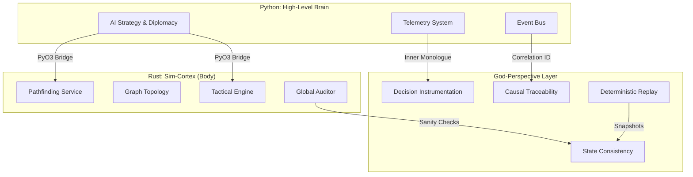

# God-Perspective Architecture & Rust Integration - Implementation Plan

## Executive Summary

This plan implements a transition to **God-Perspective Observability** (complete simulation transparency) and **Rust Integration** (performance optimization) for the Void Reckoning Engine. The implementation is organized into 6 major phases, each with multiple subtasks distributed across multiple subagents to ensure manageable workloads.

---

## Architecture Overview

---

## Phase 1: Foundation - Decision Instrumentation & Causal Traceability

**Objective:** Establish the infrastructure for tracking AI decisions and tracing causal chains throughout the simulation.

### 1.1 CorrelationID System

**File:** `src/observability/correlation_manager.py` (NEW)

**Description:** Create a centralized CorrelationID manager that generates and tracks unique IDs for all simulation actions.

**Requirements:**
- Generate UUID-based CorrelationIDs
- Maintain parent-child relationships for nested actions
- Thread-safe implementation
- Integration with existing EventBus

**Deliverables:**
- `CorrelationManager` class with `create_id()`, `get_parent()`, `set_parent()` methods
- Context manager for automatic ID scoping
- Unit tests for ID generation and tracking

---

### 1.2 Decision Logging Infrastructure

**File:** `src/observability/decision_logger.py` (NEW)

**Description:** Create a logging system that captures AI decision-making with full context including input weights, scoring matrices, and personality biases.

**Requirements:**
- Structured logging for decision events
- Capture decision context (turn, faction, personality, weights)
- Store decision rationale (scoring breakdown)
- Integration with TelemetryCollector

**Deliverables:**
- `DecisionLogger` class with `log_decision()` method
- Decision event schema
- Integration with existing telemetry system

---

### 1.3 Instrument AI Expansion Decisions

**Files:** 
- `src/ai/management/expansion_logic.py` (MODIFY)
- `src/services/target_scoring_service.py` (MODIFY)

**Description:** Add decision instrumentation to expansion target selection logic.

**Requirements:**
- Log all expansion target evaluations with scores
- Capture scoring breakdown (distance, resources, threats, personality bias)
- Attach CorrelationID to each decision
- Log final target selection with rationale

**Deliverables:**
- Instrumented `calculate_expansion_target_score()` method
- Instrumented `handle_expansion_logic()` method
- Decision logs include: planet, faction, turn, score, breakdown, correlation_id

---

### 1.4 Instrument AI Production Decisions

**Files:**
- `src/ai/management/production_planner.py` (MODIFY)
- `src/managers/economy_manager.py` (MODIFY)

**Description:** Add decision instrumentation to production planning.

**Requirements:**
- Log production queue decisions
- Capture economic constraints and priorities
- Log unit/building selection rationale
- Attach CorrelationID to production chains

**Deliverables:**
- Instrumented production planning methods
- Decision logs include: faction, turn, queue_items, priorities, constraints

---

### 1.5 Instrument AI Combat Decisions

**Files:**
- `src/combat/tactical_engine.py` (MODIFY)
- `src/combat/tactical/target_selector.py` (MODIFY)

**Description:** Add decision instrumentation to combat target selection and engagement.

**Requirements:**
- Log target selection with scoring
- Capture doctrine and role considerations
- Log engagement decisions
- Attach CorrelationID to combat actions

**Deliverables:**
- Instrumented combat decision methods
- Decision logs include: attacker, target, doctrine, score, correlation_id

---

### 1.6 Causal Chain Tracer

**File:** `src/observability/causal_tracer.py` (NEW)

**Description:** Create a system to trace actions through the simulation lifecycle using CorrelationIDs.

**Requirements:**
- Track entity lifecycle (production -> movement -> combat -> destruction)
- Build causal graphs from event logs
- Query interface for tracing outcomes back to causes
- Visualization support for causal chains

**Deliverables:**
- `CausalTracer` class with `trace_entity()`, `trace_outcome()`, `build_chain()` methods
- Causal graph data structure
- Query API for historical analysis

---

## Phase 2: State Consistency Auditing

**Objective:** Create a background layer that continuously verifies simulation state integrity.

### 2.1 Auditor Core Infrastructure

**File:** `src/observability/auditor_core.py` (NEW)

**Description:** Create the core infrastructure for state consistency auditing.

**Requirements:**
- Define audit rule interface
- Create audit scheduler
- Implement audit result reporting
- Integration with alert system

**Deliverables:**
- `AuditRule` abstract base class
- `AuditorCore` class with scheduling and rule management
- Audit result data structures

---

### 2.2 Fleet Movement Audits

**File:** `src/observability/audits/fleet_audit.py` (NEW)

**Description:** Implement audits for fleet movement consistency.

**Requirements:**
- Verify fleet location matches current node
- Check movement paths are valid (traversable edges)
- Validate destination exists and is reachable
- Detect fleets stuck in invalid states

**Deliverables:**
- `FleetMovementAudit` class
- Audit rules for movement validation
- Integration with fleet manager

---

### 2.3 Resource Balance Audits

**File:** `src/observability/audits/resource_audit.py` (NEW)

**Description:** Implement audits for economic consistency.

**Requirements:**
- Verify faction resource balances match transaction history
- Check for negative stockpiles (unless allowed)
- Validate income/upkeep calculations
- Detect resource leaks

**Deliverables:**
- `ResourceBalanceAudit` class
- Audit rules for economic validation
- Integration with economy manager

---

### 2.4 Combat State Audits

**File:** `src/observability/audits/combat_audit.py` (NEW)

**Description:** Implement audits for combat state consistency.

**Requirements:**
- Verify HP values are within valid ranges
- Check destroyed units are properly removed
- Validate combat phase transitions
- Detect stuck combat states

**Deliverables:**
- `CombatStateAudit` class
- Audit rules for combat validation
- Integration with combat system

---

### 2.5 Portal Cross-Universe Audits

**File:** `src/observability/audits/portal_audit.py` (NEW)

**Description:** Implement audits for cross-universe portal consistency.

**Requirements:**
- Verify portal destinations exist
- Check portal traversal validity
- Validate cross-universe entity tracking
- Detect portal state corruption

**Deliverables:**
- `PortalAudit` class
- Audit rules for portal validation
- Integration with portal manager

---

### 2.6 Background Audit Scheduler

**File:** `src/observability/audit_scheduler.py` (NEW)

**Description:** Create a scheduler that runs audits in the background without impacting simulation performance.

**Requirements:**
- Configurable audit intervals
- Priority-based audit execution
- Resource-aware scheduling (pause during heavy load)
- Async/Threaded execution

**Deliverables:**
- `AuditScheduler` class
- Configuration system for audit intervals
- Integration with main simulation loop

---

## Phase 3: Deterministic Replay

**Objective:** Implement total control over the simulation timeline through snapshotting and replay.

### 3.1 State Snapshot Infrastructure

**File:** `src/observability/snapshot_manager.py` (NEW)

**Description:** Create infrastructure for capturing simulation state at specific turns.

**Requirements:**
- Define snapshot format (binary or efficient JSON)
- Capture all simulation state (entities, relationships, RNG seed)
- Incremental snapshot support (delta from previous)
- Compression for storage efficiency

**Deliverables:**
- `SnapshotManager` class with `create_snapshot()`, `load_snapshot()` methods
- Snapshot schema definition
- Storage backend abstraction

---

### 3.2 Random Seed Management

**File:** `src/observability/rng_snapshot.py` (NEW)

**Description:** Enhance RNG management to support deterministic replay.

**Requirements:**
- Capture RNG state at snapshot points
- Restore RNG state on replay
- Support multiple RNG streams (combat, movement, etc.)
- Verify deterministic behavior

**Deliverables:**
- Enhanced `RNGManager` with snapshot support
- RNG state serialization/deserialization
- Determinism verification tests

---

### 3.3 Replay Engine

**File:** `src/observability/replay_engine.py` (NEW)

**Description:** Create an engine that can replay simulation from snapshots.

**Requirements:**
- Load snapshot and resume simulation
- Execute events deterministically
- Support branching (what-if scenarios)
- Compare replay results with original

**Deliverables:**
- `ReplayEngine` class
- Replay execution logic
- Branch/what-if scenario support
- Result comparison utilities

---

### 3.4 Replay Analysis Tools

**File:** `src/observability/replay_analyzer.py` (NEW)

**Description:** Create tools for analyzing replay differences and understanding divergence.

**Requirements:**
- Compare two simulation runs
- Identify divergence points
- Visualize state differences
- Generate divergence reports

**Deliverables:**
- `ReplayAnalyzer` class
- Diff algorithms for simulation state
- Visualization support
- Report generation

---

### 3.5 Multiverse Branching UI

**File:** `src/observability/multiverse_ui.py` (NEW)

**Description:** Create a UI for exploring alternative simulation branches.

**Requirements:**
- Display simulation timeline with branch points
- Allow creating new branches at any snapshot
- Compare branch outcomes
- Export branch scenarios

**Deliverables:**
- UI component for multiverse exploration
- Branch management logic
- Comparison visualization

---

## Phase 4: Rust Integration - Phase 1 (Pathfinder & GraphTopology)

**Objective:** Migrate pathfinding and graph topology to Rust for performance gains.

### 4.1 Rust Project Setup

**Location:** `rust/` (NEW DIRECTORY)

**Description:** Initialize Rust project structure for the Sim-Cortex.

**Requirements:**
- Initialize Cargo workspace
- Set up PyO3 bindings
- Configure build system
- Set up development tooling

**Deliverables:**
- `rust/Cargo.toml` with workspace configuration
- `rust/sim_cortex/Cargo.toml` for main library
- `rust/sim_cortex/src/lib.rs` with PyO3 setup
- Build scripts and tooling configuration

---

### 4.2 PyO3 Bridge Layer

**File:** `rust/sim_cortex/src/bridge.rs` (NEW)

**Description:** Create the Python-Rust bridge layer for data exchange.

**Requirements:**
- Define Python-compatible data structures
- Implement serialization/deserialization
- Handle memory sharing between Python and Rust
- Error handling and type conversion

**Deliverables:**
- Bridge data structures
- Serialization utilities
- Type conversion functions
- Error handling layer

---

### 4.3 Graph Topology in Rust

**File:** `rust/sim_cortex/src/graph.rs` (NEW)

**Description:** Port the graph topology system to Rust.

**Requirements:**
- Implement GraphNode and GraphEdge
- Support spatial indexing
- Implement graph traversal algorithms
- Memory-efficient storage

**Deliverables:**
- Rust implementation of graph structures
- Spatial indexing
- Traversal algorithms
- Unit tests

---

### 4.4 A* Pathfinding in Rust

**File:** `rust/sim_cortex/src/pathfinding.rs` (NEW)

**Description:** Port the A* pathfinding algorithm to Rust.

**Requirements:**
- Implement A* with heuristics
- Support terrain-based cost modifiers
- Implement path caching
- Handle portal traversal

**Deliverables:**
- Rust A* implementation
- Heuristic functions
- Cache management
- Portal handling

---

### 4.5 Python Pathfinding Service Wrapper

**File:** `src/services/pathfinding_service.py` (MODIFY)

**Description:** Update Python service to use Rust implementation.

**Requirements:**
- Call Rust pathfinding through PyO3
- Maintain backward compatibility
- Fallback to Python implementation if needed
- Performance benchmarking

**Deliverables:**
- Updated pathfinding service
- Rust integration tests
- Performance benchmarks
- Fallback mechanism

---

### 4.6 Distance Matrix in Rust

**File:** `rust/sim_cortex/src/distance.rs` (NEW)

**Description:** Port the distance matrix service to Rust.

**Requirements:**
- Pre-compute system-to-system distances
- Efficient storage (sparse matrix)
- Fast lookup
- Update on topology changes

**Deliverables:**
- Rust distance matrix implementation
- Pre-computation logic
- Storage optimization
- Update handlers

---

### 4.7 Performance Validation

**File:** `rust/benchmarks/pathfinding_bench.rs` (NEW)

**Description:** Create benchmarks to validate Rust performance improvements.

**Requirements:**
- Benchmark Python vs Rust implementations
- Measure memory usage
- Validate correctness
- Profile hot spots

**Deliverables:**
- Benchmark suite
- Performance comparison report
- Memory usage analysis
- Optimization recommendations

---

## Phase 5: Rust Integration - Phase 2 (CombatResolution)

**Objective:** Migrate the tactical combat engine to Rust for performance gains.

### 5.1 Combat Data Structures in Rust

**File:** `rust/sim_cortex/src/combat/types.rs` (NEW)

**Description:** Define Rust data structures for combat simulation.

**Requirements:**
- Unit, Fleet, and CombatState structures
- Weapon and ability definitions
- Component system (health, armor, etc.)
- Efficient memory layout

**Deliverables:**
- Rust combat data structures
- Component definitions
- Memory layout optimization
- Serialization support

---

### 5.2 Damage Calculation in Rust

**File:** `rust/sim_cortex/src/combat/damage.rs` (NEW)

**Description:** Port damage calculation logic to Rust.

**Requirements:**
- Implement damage formulas
- Handle mitigation and armor
- Support weapon types and special effects
- Vectorized calculations for performance

**Deliverables:**
- Rust damage calculation
- Mitigation logic
- Weapon type handling
- Vectorization optimizations

---

### 5.3 Target Selection in Rust

**File:** `rust/sim_cortex/src/combat/targeting.rs` (NEW)

**Description:** Port target selection logic to Rust.

**Requirements:**
- Implement target scoring
- Support doctrine-based selection
- Spatial partitioning for performance
- Efficient candidate filtering

**Deliverables:**
- Rust target selection
- Doctrine integration
- Spatial partitioning
- Performance optimization

---

### 5.4 Combat Phase Execution in Rust

**File:** `rust/sim_cortex/src/combat/phases.rs` (NEW)

**Description:** Port combat phase execution to Rust.

**Requirements:**
- Implement movement, shooting, ability phases
- Support phase ordering
- Handle phase transitions
- Maintain deterministic execution

**Deliverables:**
- Rust combat phases
- Phase ordering system
- Transition logic
- Determinism verification

---

### 5.5 Python Combat Engine Wrapper

**File:** `src/combat/tactical_engine.py` (MODIFY)

**Description:** Update Python combat engine to use Rust implementation.

**Requirements:**
- Call Rust combat through PyO3
- Maintain backward compatibility
- Support hybrid execution (Python + Rust)
- Performance benchmarking

**Deliverables:**
- Updated tactical engine
- Rust integration tests
- Performance benchmarks
- Hybrid execution mode

---

### 5.6 GPU Acceleration Bridge

**File:** `rust/sim_cortex/src/combat/gpu.rs` (NEW)

**Description:** Create bridge for GPU-accelerated combat calculations.

**Requirements:**
- Interface with existing GPU tracking
- Support vectorized operations
- Handle GPU memory management
- Fallback to CPU when needed

**Deliverables:**
- GPU bridge implementation
- Vectorized operations
- Memory management
- CPU fallback

---

### 5.7 Combat Performance Validation

**File:** `rust/benchmarks/combat_bench.rs` (NEW)

**Description:** Create benchmarks to validate Rust combat performance.

**Requirements:**
- Benchmark Python vs Rust combat
- Measure large-scale combat performance
- Validate deterministic behavior
- Profile hot spots

**Deliverables:**
- Combat benchmark suite
- Performance comparison report
- Determinism verification
- Optimization recommendations

---

## Phase 6: Rust Integration - Phase 3 (GlobalAuditor)

**Objective:** Migrate state consistency auditing to Rust for performance gains.

### 6.1 Auditor Data Structures in Rust

**File:** `rust/sim_cortex/src/audit/types.rs` (NEW)

**Description:** Define Rust data structures for auditing.

**Requirements:**
- Audit rule definitions
- Audit result structures
- State snapshot format
- Efficient comparison structures

**Deliverables:**
- Rust audit data structures
- Rule definitions
- Result structures
- Comparison utilities

---

### 6.2 Fleet Audits in Rust

**File:** `rust/sim_cortex/src/audit/fleet.rs` (NEW)

**Description:** Port fleet movement audits to Rust.

**Requirements:**
- Implement movement validation
- Check path validity
- Detect invalid states
- Parallel audit execution

**Deliverables:**
- Rust fleet audit implementation
- Movement validation
- State detection
- Parallel execution

---

### 6.3 Resource Audits in Rust

**File:** `rust/sim_cortex/src/audit/resource.rs` (NEW)

**Description:** Port resource balance audits to Rust.

**Requirements:**
- Implement balance validation
- Check transaction consistency
- Detect resource leaks
- Efficient transaction tracking

**Deliverables:**
- Rust resource audit implementation
- Balance validation
- Transaction tracking
- Leak detection

---

### 6.4 Parallel Audit Execution

**File:** `rust/sim_cortex/src/audit/scheduler.rs` (NEW)

**Description:** Implement parallel audit execution in Rust.

**Requirements:**
- Multi-threaded audit execution
- Work stealing for load balancing
- Resource-aware scheduling
- Result aggregation

**Deliverables:**
- Parallel scheduler
- Work stealing
- Resource awareness
- Result aggregation

---

### 6.5 Python Auditor Wrapper

**File:** `src/observability/auditor_core.py` (MODIFY)

**Description:** Update Python auditor to use Rust implementation.

**Requirements:**
- Call Rust audits through PyO3
- Maintain backward compatibility
- Support hybrid execution
- Performance benchmarking

**Deliverables:**
- Updated auditor core
- Rust integration tests
- Performance benchmarks
- Hybrid execution mode

---

### 6.6 Audit Performance Validation

**File:** `rust/benchmarks/audit_bench.rs` (NEW)

**Description:** Create benchmarks to validate Rust audit performance.

**Requirements:**
- Benchmark Python vs Rust audits
- Measure parallel execution benefits
- Validate correctness
- Profile hot spots

**Deliverables:**
- Audit benchmark suite
- Performance comparison report
- Parallel execution analysis
- Optimization recommendations

---

## Subagent Task Distribution

### Subagent 1: Foundation Infrastructure
**Tasks:**
- 1.1 CorrelationID System
- 1.2 Decision Logging Infrastructure
- 1.6 Causal Chain Tracer

### Subagent 2: AI Decision Instrumentation
**Tasks:**
- 1.3 Instrument AI Expansion Decisions
- 1.4 Instrument AI Production Decisions
- 1.5 Instrument AI Combat Decisions

### Subagent 3: Audit Core & Fleet Audits
**Tasks:**
- 2.1 Auditor Core Infrastructure
- 2.2 Fleet Movement Audits
- 2.6 Background Audit Scheduler

### Subagent 4: Resource & Combat Audits
**Tasks:**
- 2.3 Resource Balance Audits
- 2.4 Combat State Audits
- 2.5 Portal Cross-Universe Audits

### Subagent 5: Snapshot & RNG Management
**Tasks:**
- 3.1 State Snapshot Infrastructure
- 3.2 Random Seed Management
- 3.5 Multiverse Branching UI

### Subagent 6: Replay Engine & Analysis
**Tasks:**
- 3.3 Replay Engine
- 3.4 Replay Analysis Tools

### Subagent 7: Rust Project Setup & Bridge
**Tasks:**
- 4.1 Rust Project Setup
- 4.2 PyO3 Bridge Layer
- 4.3 Graph Topology in Rust

### Subagent 8: Rust Pathfinding
**Tasks:**
- 4.4 A* Pathfinding in Rust
- 4.6 Distance Matrix in Rust
- 4.7 Performance Validation

### Subagent 9: Python-Rust Pathfinding Integration
**Tasks:**
- 4.5 Python Pathfinding Service Wrapper
- Integration testing
- Documentation

### Subagent 10: Combat Data Structures & Damage
**Tasks:**
- 5.1 Combat Data Structures in Rust
- 5.2 Damage Calculation in Rust
- 5.6 GPU Acceleration Bridge

### Subagent 11: Combat Phases & Targeting
**Tasks:**
- 5.3 Target Selection in Rust
- 5.4 Combat Phase Execution in Rust
- 5.7 Combat Performance Validation

### Subagent 12: Python-Rust Combat Integration
**Tasks:**
- 5.5 Python Combat Engine Wrapper
- Integration testing
- Documentation

### Subagent 13: Auditor Data Structures
**Tasks:**
- 6.1 Auditor Data Structures in Rust
- 6.2 Fleet Audits in Rust
- 6.3 Resource Audits in Rust

### Subagent 14: Parallel Audits & Integration
**Tasks:**
- 6.4 Parallel Audit Execution
- 6.5 Python Auditor Wrapper
- 6.6 Audit Performance Validation

---

## Success Metrics

### Performance Metrics
| Metric | Python (Current) | Target (Rust) |
|--------|------------------|---------------|
| Max Units | ~50k | 1M+ |
| Decisions/Sec | ~200 | 10,000+ |
| Pathfinding Latency | High | Near-Zero |
| Combat Resolution | High | Near-Zero |
| Audit Overhead | High | <5% |

### Observability Metrics
- 100% of AI decisions logged with full context
- 100% of entity actions traceable via CorrelationID
- State consistency verified every N turns
- Deterministic replay accuracy: 100%

### Code Quality Metrics
- All Rust code passes clippy
- Test coverage > 80% for new code
- Documentation coverage > 90%
- Zero memory leaks in Rust code

---

## Dependencies & Prerequisites

### Required Tools
- Rust 1.70+ with Cargo
- PyO3 0.20+
- Python 3.10+
- pytest for testing
- Criterion for Rust benchmarks

### External Dependencies
- `pyo3` - Python-Rust bindings
- `numpy` - For data exchange (optional)
- `serde` - Rust serialization
- `rayon` - Rust parallelism

---

## Risk Mitigation

### Performance Risks
- **Risk:** PyO3 overhead negates Rust benefits
- **Mitigation:** Batch operations, minimize crossing boundary
- **Fallback:** Keep Python implementations available

### Compatibility Risks
- **Risk:** Rust changes break Python integration
- **Mitigation:** Version the bridge API, comprehensive integration tests
- **Fallback:** Feature flags to disable Rust modules

### Complexity Risks
- **Risk:** System becomes too complex to maintain
- **Mitigation:** Clear documentation, modular design, regular refactoring
- **Fallback:** Simplify architecture if needed

---

## Timeline Estimate

- **Phase 1:** 2-3 weeks (Foundation)
- **Phase 2:** 2-3 weeks (Auditing)
- **Phase 3:** 2-3 weeks (Replay)
- **Phase 4:** 3-4 weeks (Rust Pathfinding)
- **Phase 5:** 3-4 weeks (Rust Combat)
- **Phase 6:** 2-3 weeks (Rust Auditor)

**Total:** 14-20 weeks

---

## Notes

- Each subagent should complete their tasks independently
- Integration points should be clearly defined and tested
- Regular sync meetings to coordinate between subagents
- Continuous integration to catch issues early
- Performance benchmarks should run after each phase
