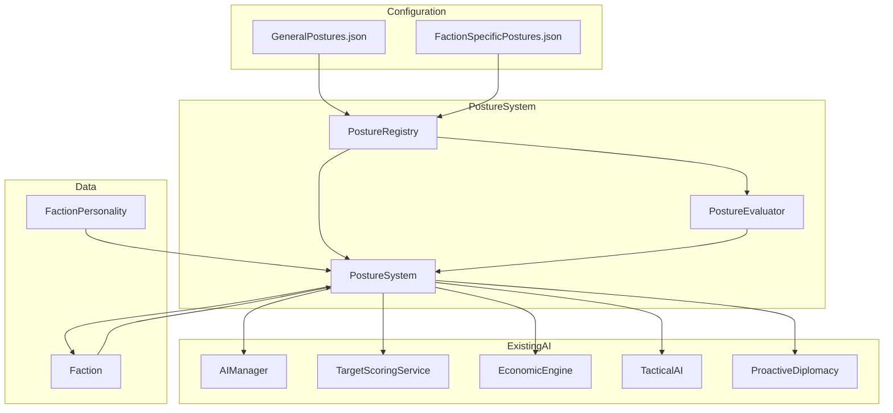
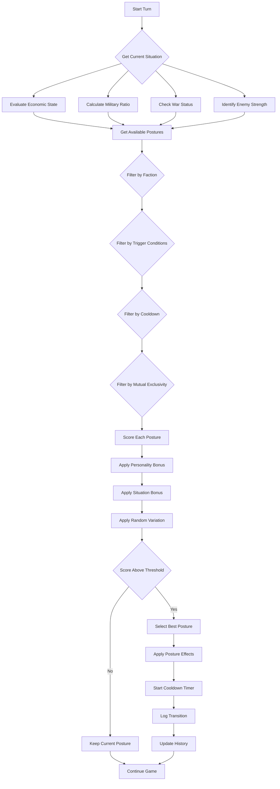

# POST (Posture) System Expansion Plan
## Multi-Universe Strategy Engine - Void Reckoning Universe

---

## Table of Contents
1. [Current System Analysis](#current-system-analysis)
2. [51 General Postures](#51-general-postures)
3. [50 Faction-Specific Postures](#50-faction-specific-postures)
4. [Posture Conflicts and Mutual Exclusivity](#posture-conflicts-and-mutual-exclusivity)
5. [Implementation Plan](#implementation-plan)
6. [Configuration Format](#configuration-format)
7. [Testing Strategy](#testing-strategy)
8. [Migration Path](#migration-path)

---

## Current System Analysis

### Current Posture Implementation

The current posture system is implemented across several files:

#### Core Files
- **[`src/models/faction.py`](src/models/faction.py:63)** - Stores `strategic_posture` attribute (default: "BALANCED")
- **[`src/services/target_scoring_service.py`](src/services/target_scoring_service.py:229)** - Evaluates and switches postures
- **[`src/managers/ai_manager.py`](src/managers/ai_manager.py:926)** - Uses posture for operational state determination

#### Current Postures
| Posture | Abbreviation | Description |
|---------|--------------|-------------|
| BALANCED | BAL | Default balanced approach |
| EXPANSION | EXP | Aggressive territorial expansion |
| CONSOLIDATION | CON | Defensive consolidation of gains |
| TOTAL_WAR | WAR | All-out war mode |
| THREATENED | THREAT | Reactive defensive posture |

#### Posture Evaluation Logic
Postures are evaluated based on:
- **Overextension Score**: `(territory_count * 1000) / fleet_power`
- **Fleet Strength Ratio**: `my_fleet_power / (neighbor_power / neighbor_count)`
- **Economic Health State**: HEALTHY, STRESSED, CRISIS, BANKRUPT

#### Posture Effects
When a posture changes, it modifies:
- **Personality.aggression**: Multiplied by 0.7 (CONSOLIDATION) or 1.3 (EXPANSION)
- **Personality.expansion_bias**: Multiplied by 0.5 (CONSOLIDATION) or 1.5 (EXPANSION)
- **Strategic Plan Phase**: Forces phase to CONSOLIDATION when appropriate

### Limitations of Current System
1. Only 5 basic postures
2. Limited effect modifiers (only aggression and expansion_bias)
3. No faction-specific postures
4. Posture selection is simplistic
5. No configuration-driven posture definitions
6. Hardcoded posture evaluation logic

---

## 51 General Postures

### Category 1: Aggressive Postures (11)

| # | Name | Abbrev | Description | AI Behavior | Economy | Combat | Diplomacy | Trigger Conditions |
|---|------|--------|-------------|-------------|----------|--------|-----------|-------------------|
| 1 | Blitzkrieg | BLITZ | Rapid, overwhelming offensive | Prioritize speed, ignore defense | High spending on military | All-out attack, no retreat | Declare war freely | Strong military, enemy weak |
| 2 | Shock and Awe | SHOCK | Decisive early-game strike | Rush production, early aggression | Sacrifice economy for military | Hit with maximum force immediately | Aggressive first contact | Early game, strong starting units |
| 3 | Total War | WAR | All resources to war effort | 100% military focus | Minimal economy, max military | Fight to the death | All enemies are targets | Multiple wars or existential threat |
| 4 | Preemptive Strike | PREEM | Attack before being attacked | Target strongest threats | High military spending | Strike first at threats | Deterrence through aggression | Strong neighbor detected |
| 5 | Denial | DENY | Destroy enemy infrastructure during retreat | Retreat while sabotaging enemy | Destroy enemy assets | Deny resources to enemy | Burn bridges with all | Losing war, territory under threat |
| 6 | Raiding | RAID | Hit-and-run resource theft | Target undefended assets | Gain resources from combat | Avoid fair fights, loot | No long-term treaties | Weak military, rich neighbors |
| 7 | Guerrilla | GUER | Asymmetric warfare | Use small, fast forces | Low cost, high mobility | Ambush, avoid direct combat | Support rebel factions | Weaker than enemies |
| 8 | Flanking | FLANK | Attack from unexpected angles | Use fast units for positioning | Invest in mobility | Hit weak points | Betrayal opportunities | Mobile forces available |
| 9 | Overwhelming Force | OVER | Mass everything at one target | Concentrate all forces | All resources to one attack | Numerical superiority | Single enemy focus | Military advantage |
| 10 | Ambush | AMBUSH | Hide and strike | Use terrain and stealth | Low visibility | Surprise attacks | Secret alliances | Forest/terrain advantage |

### Category 2: Defensive Postures (11)

| # | Name | Abbrev | Description | AI Behavior | Economy | Combat | Diplomacy | Trigger Conditions |
|---|------|--------|-------------|-------------|----------|--------|-----------|-------------------|
| 11 | Turtle | TURT | Turtle behind defenses | Build static defenses | High infrastructure spending | Wait for attacks, counter-attack | Defensive pacts | Territory under threat |
| 12 | Consolidation | CON | Strengthen holdings | Upgrade existing territory | Focus on development | Defend borders | Peace treaties | Overextended territory |
| 13 | War of Attrition | ATTR | Wear down enemy over time | Prolong conflicts, preserve forces | Sustainable economy | Trade space for time | Long-term alliances | Strong economy, weak military |
| 14 | Zone Control | ZONE | Control strategic areas | Occupy key locations | Garrison spending | Hold positions, deny movement | Border agreements | Strategic chokepoints available |
| 15 | Counter-Attack | COUNTER | Wait then strike | Defensive until opportunity | Balanced spending | Retaliate after attacks | Defensive until provoked | Enemy overextends |
| 16 | Deep Defense | DEEP | Layered defensive lines | Multiple fallback positions | Infrastructure depth | Fighting retreat | Mutual defense | Large territory to defend |
| 17 | Holding Action | HOLD | Delay enemy advance | Sacrifice units to buy time | Emergency economy | Fight to delay | Request allies | Enemy overwhelming force |
| 18 | Perimeter | PERI | Secure all borders | Garrison all frontiers | Border infrastructure | Defend all equally | Border treaties | Many neighbors |
| 19 | Citadel | CITI | Protect core territory | Abandon periphery, protect core | Core investment | Defend capital at all costs | Abandon outer allies | Capital under threat |
| 20 | Siege Warfare | SIEGE | Methodical, patient attacks | Focus on chokepoints | Steady military buildup | Starve enemies out | Defensive alliances | Strong defensive positions |

### Category 3: Economic Postures (9)

| # | Name | Abbrev | Description | AI Behavior | Economy | Combat | Diplomacy | Trigger Conditions |
|---|------|--------|-------------|-------------|----------|--------|-----------|-------------------|
| 21 | Boom | BOOM | Rapid economic expansion | Prioritize development | Max infrastructure, min military | Avoid conflict | Trade agreements | Safe position, opportunity |
| 22 | Trade Empire | TRADE | Commerce-focused | Build trade routes | Trade infrastructure | Escort trade fleets | Trade pacts | Peaceful neighbors |
| 23 | Industrial | IND | Production powerhouse | Build factories | Production bonuses | Mass production | Sell weapons | Large territory |
| 24 | Research | RES | Technology focus | Max research spending | Research infrastructure | Tech-advantaged units | Share tech | Research opportunities |
| 25 | Mercantile | MERC | Profit from conflict | Sell to both sides | Trade with all | Minimal combat | Neutral | War between others |
| 26 | Colonial | COL | Expand through settlement | Colonize new worlds | Colony ships | Light defense | Peaceful expansion | Unclaimed territory |
| 27 | Resource Control | RCTRL | Monopolize resources | Secure resource nodes | Resource infrastructure | Protect assets | Trade embargoes | Resource scarcity |
| 28 | Optimization | OPTM | Optimize everything | Minimize waste | Cost reduction | Elite units | Minimal commitments | Stagnant growth |
| 29 | Investment | INV | Long-term planning | Save for future | High savings | Avoid expensive units | Long treaties | Stable position |

### Category 4: Diplomatic Postures (10)

| # | Name | Abbrev | Description | AI Behavior | Economy | Combat | Diplomacy | Trigger Conditions |
|---|------|--------|-------------|-------------|----------|--------|-----------|-------------------|
| 31 | Federation | FED | Build alliances | Integrate allies | Shared economy | Coalition warfare | Multiple alliances | Strong diplomatic position |
| 32 | Hegemony | HEG | Dominate through influence | Vassalize others | Tribute income | Enforce demands | Vassal treaties | Strongest faction |
| 33 | Isolationist | ISO | Avoid all contact | Close borders | Self-sufficient | Defensive only | No treaties | Threatened or xenophobic |
| 34 | Balance of Power | BALP | Weaken strongest | Support underdogs | Aid to weaker | Fight strongest | Counter-alliances | One dominant faction |
| 35 | Peacekeeper | PEACE | Enforce peace | Intervene in conflicts | Peacekeeping costs | Peace enforcement | Peace treaties | Strong military, peaceful |
| 36 | Manipulator | MANIP | Play factions against each other | Secret agreements | Espionage budget | Proxy wars | False promises | Diplomatic skill |
| 37 | Mediator | MED | Resolve conflicts | Negotiate peace | Diplomatic spending | Peace enforcement | Mediation | Neutral position |
| 38 | Integration | INT | Absorb others peacefully | Cultural assimilation | Integration costs | Minimal combat | Cultural treaties | Cultural advantage |
| 39 | Patron | PATR | Support weaker factions | Aid allies | Foreign aid | Protect allies | Protection treaties | Strong economy |
| 40 | Subversion | SUB | Destabilize enemies | Support rebels | Espionage | Proxy warfare | Secret support | Enemy strong |

### Category 5: Specialized Postures (11)

| # | Name | Abbrev | Description | AI Behavior | Economy | Combat | Diplomacy | Trigger Conditions |
|---|------|--------|-------------|-------------|----------|--------|-----------|-------------------|
| 41 | Exploration | EXPLO | Discover new territory | Scout aggressively | Exploration spending | Light combat | First contact bonuses | Unknown territory |
| 42 | Naval Domination | NAV | Control space | Build fleets | Navy spending | Space superiority | Blockade enemies | Strong navy |
| 43 | Ground Superiority | GRND | Control planets | Build armies | Army spending | Planetary warfare | Planetary treaties | Strong army |
| 44 | Special Operations | SPEC | Elite unit warfare | Train specialists | High cost units | Surgical strikes | Covert ops | Elite units available |
| 45 | Swarm | SWARM | Mass cheap units | Quantity over quality | Low cost units | Overwhelm with numbers | No allies | High production capacity |
| 46 | Elite | ELITE | Quality over quantity | Few, powerful units | High cost units | Surgical combat | Selective alliances | Elite unit tech |
| 47 | Adaptive | ADAPT | Change based on situation | Flexible strategy | Balanced | Counter enemy tactics | Flexible treaties | Facing varied enemies |
| 48 | Opportunist | OPP | Exploit enemy weakness | Target weak points | Raid economy | Hit when enemies weak | No long commitments | Enemy weakness detected |
| 49 | Survival | SURV | Do whatever to survive | Desperate measures | Extreme measures | Fight to death | Beg for help | Existential threat |
| 50 | Balanced | BAL | Default balanced approach | Mix of all | Balanced spending | Balanced tactics | Neutral diplomacy | Default state |
| 51 | Scavenging | SCAV | Scavenge from battles | Fight for loot | Combat for resources | Target rich enemies | No allies | Poor economy |

---

## Posture Conflicts and Mutual Exclusivity

### Naming Conflicts Resolved

The following naming conflicts have been resolved to ensure unique posture names:

| Conflict | Resolution |
|----------|------------|
| General #13 "Attrition" vs Steel-Bound Syndicate #2 "Attrition Warfare" | Renamed General #13 to **War of Attrition** |
| General #25 "Salvage" vs Scrap-Lord Marauders #2 "Salvage" | Renamed General #25 to **Scavenging** (moved to Specialized), renamed Scrap-Lord #2 to **Tech Salvage** |
| General #11 "Fortress" vs Steel-Bound Syndicate #4 "Fortress World" | Renamed General #11 to **Turtle**, renamed Steel-Bound #4 to **Planetary Fortress** |
| General #29 "Efficiency" vs Steel-Bound Syndicate #5 "Efficiency Protocol" | Renamed General #29 to **Optimization**, renamed Steel-Bound #5 to **Industrial Efficiency** |
| Transcendent Order #2 "Ascension" vs Transcendent Order #5 "Liberation" | Renamed #5 to **Ascension**, renamed #2 to **Transcendence** |

### Category Changes

| Posture | Original Category | New Category | Reason |
|---------|------------------|---------------|---------|
| Siege Warfare | Aggressive | Defensive | Better fits defensive, methodical gameplay |
| Ambush | Defensive | Aggressive | Better fits offensive, surprise attack gameplay |
| Scavenging (Salvage) | Economic | Specialized | Unique combat-focused mechanic |

### Mutual Exclusivity Rules

Certain postures are mutually exclusive due to conflicting gameplay mechanics:

#### Aggressive Postures Conflicts
- **Denial** conflicts with: TURT, CONS, ATTR, ZONE, SCAV, GUER, RAID
- **Ambush** conflicts with: HOLD, DEEP, CITI, SIEGE, TURT

#### Defensive Postures Conflicts
- **Turtle** conflicts with: BLITZ, DENY, AMBUSH, OVER, RAID, GUER
- **War of Attrition** conflicts with: BLITZ, SHOCK, OVER, PREEM
- **Siege Warfare** conflicts with: BLITZ, AMBUSH, OVER, FLANK

#### Economic Postures Conflicts
- **Boom** conflicts with: WAR, DENY, SURV, HOLD
- **Optimization** conflicts with: MASS, GUER, SWARM, SURV

#### Specialized Postures Conflicts
- **Scavenging** conflicts with: BOOM, TRADE, MERC, INV
- **Swarm** conflicts with: ELITE, SPEC, OPTM
- **Elite** conflicts with: SWARM, GUER, RAID

### Trigger Condition Thresholds

Posture trigger conditions use specific thresholds to determine when a posture should be activated:

| Condition | Description | Example Threshold |
|-----------|-------------|-------------------|
| `min_military_ratio` | Minimum ratio of player military power to enemy average | 1.2 (20% stronger than average enemy) |
| `max_military_ratio` | Maximum ratio before posture becomes unavailable | 0.8 (weaker than enemies) |
| `min_economy_value` | Minimum total economy (credits + resources) | 500 credits |
| `max_economy_value` | Maximum economy before posture unavailable | 2000 credits |
| `min_fleet_power` | Minimum total fleet power | 1000 power |
| `max_fleet_power` | Maximum fleet power before posture unavailable | 10000 power |
| `territory_loss_threshold` | Percentage of territory lost before posture triggers | 0.25 (25% lost) |
| `enemy_proximity` | Distance to nearest enemy fleet/system | "close" (≤3 jumps), "medium" (4-6 jumps), "far" (>6 jumps) |
| `min_turn` | Earliest turn posture can activate | 5 (after early game) |
| `max_turn` | Latest turn posture can activate | 100 (before late game) |

---

## 50 Faction-Specific Postures

### Templars of the Flux (5)

| # | Name | Abbrev | Description | Unique Mechanics | AI Behavior | Trigger Conditions |
|---|------|--------|-------------|------------------|-------------|-------------------|
| 1 | Crusade | CRUS | Holy war for conviction | Gain Conviction stacks on kills | Aggressive, morale-focused | At war, conviction available |
| 2 | Sanctification | SANC | Purge heretics from territory | Burn enemy structures for conviction | Defensive purges | Enemy in territory |
| 3 | Pilgrimage | PILG | Relocate to holy sites | Move toward Flux anomalies | Religious expansion | Flux anomaly discovered |
| 4 | Martyrdom | MART | Sacrifice for the cause | Units deal damage on death | Fight to death | Losing war |
| 5 | Inquisition | INQ | Hunt down resonators | Bonus vs psychic units | Target resonators | Psychic enemies detected |

### Transcendent Order (5)

| # | Name | Abbrev | Description | Unique Mechanics | AI Behavior | Trigger Conditions |
|---|------|--------|-------------|------------------|-------------|-------------------|
| 1 | Communion | COMM | Shared consciousness across units | All units share morale | Coordinated attacks | Commander alive |
| 2 | Transcendence | TRAN | Prepare for transcendence ritual | Research bonus, combat penalty | Focus research | Late game |
| 3 | Mind Control | MIND | Dominate enemy minds | Convert enemy units | Target enemy leaders | Psychic advantage |
| 4 | Resonance | RESO | Amplify psychic abilities | Area-of-effect psychic attacks | Cluster units | Multiple resonators |
| 5 | Ascension | ASCN | "Free" organic minds | Convert enemies to energy | Aggressive conversion | Organic enemies |

### Steel-Bound Syndicate (5)

| # | Name | Abbrev | Description | Unique Mechanics | AI Behavior | Trigger Conditions |
|---|------|--------|-------------|------------------|-------------|-------------------|
| 1 | Industrial Machine | INDM | Maximum production output | 25% production speed bonus | Build factories | Territory secure |
| 2 | Mass Attrition | MASS | Wear down through sheer numbers | 90% casualty tolerance | Mass attacks | Enemy stronger |
| 3 | Mechanization | MECH | Augment soldiers with cybernetics | Units gain health over time | Upgrade units | Technology available |
| 4 | Planetary Fortress | PFOR | Turn planets into fortresses | Building cost reduction | Build defenses | Territory under threat |
| 5 | Industrial Efficiency | IEFF | Optimize all operations | Maintenance cost reduction | Balanced approach | Economic stress |

### Bio-Tide Collective (5)

| # | Name | Abbrev | Description | Unique Mechanics | AI Behavior | Trigger Conditions |
|---|------|--------|-------------|------------------|-------------|-------------------|
| 1 | Consumption | CONS | Devour all biomass | Gain biomass from kills | Aggressive expansion | Food shortage |
| 2 | Adaptation | ADAPT | Evolve counter to enemy threats | Adapt to enemy weapons | Target diverse enemies | Facing new enemy |
| 3 | Hive Mind | HIVEM | Perfect coordination | No morale penalties | Swarm tactics | Multiple queens |
| 4 | Infestation | INFEST | Spread bio-forms across territory | Convert enemy buildings | Spread organically | Enemy territory |
| 5 | Metamorphosis | META | Evolve entire swarm | Global unit upgrade | Research evolution | Biomass surplus |

### Algorithmic Hierarchy (5)

| # | Name | Abbrev | Description | Unique Mechanics | AI Behavior | Trigger Conditions |
|---|------|--------|-------------|------------------|-------------|-------------------|
| 1 | Logic Core | LOGIC | Centralized processing efficiency | 30% research speed bonus | Focus research | New tech available |
| 2 | Reanimation | REAN | Repair and reboot destroyed units | Instant unit repair | Preserve units | Combat losses |
| 3 | Optimization | OPTI | Calculate optimal paths | Movement speed bonus | Efficient positioning | Large territory |
| 4 | Assimilation | ASSIM | Convert organics to digital | Convert organic units | Target organics | Organic enemies |
| 5 | Calculation | CALC | Predict enemy movements | Intel generation bonus | Strategic planning | Intel advantage |

### Nebula Drifters (5)

| # | Name | Abbrev | Description | Unique Mechanics | AI Behavior | Trigger Conditions |
|---|------|--------|-------------|------------------|-------------|-------------------|
| 1 | Raider Economy | RAID | Profit from violence | 50% loot bonus | Raid undefended targets | Rich targets |
| 2 | Hit and Run | HITR | Strike and flee | 40% strategic speed bonus | Avoid prolonged combat | Enemy stronger |
| 3 | Glass Cannon | GLAS | Max damage, min defense | Damage bonus, armor penalty | Aggressive attacks | Opportunity |
| 4 | Freebooter | FREE | Live on ships only | No planetary upkeep | Stay mobile | Territory lost |
| 5 | Pirate Council | COUN | Democratic leadership structure | Council votes on major decisions | Balanced approach | Prestige low |

### Aurelian Hegemony (5)

| # | Name | Abbrev | Description | Unique Mechanics | AI Behavior | Trigger Conditions |
|---|------|--------|-------------|------------------|-------------|-------------------|
| 1 | Diplomatic Corps | DIPLO | Integration over destruction | 20 diplomacy bonus | Seek vassals | Peaceful opportunity |
| 2 | Plasma Mastery | PLAS | Overcharge plasma weapons | Volatility damage bonus | Use plasma units | Plasma tech available |
| 3 | Combined Arms | COMB | Synergize unit types | Unit synergy bonus | Mixed armies | Diverse units |
| 4 | Civilizing Mission | CIVI | "Uplift" conquered populations | Vassal integration speed | Integrate vassals | Vassals available |
| 5 | Order Enforcement | ORDR | Maintain galactic order | Peacekeeper bonus | Intervene in conflicts | Strong military |

### Void-Spawn Entities (5)

| # | Name | Abbrev | Description | Unique Mechanics | AI Behavior | Trigger Conditions |
|---|------|--------|-------------|------------------|-------------|-------------------|
| 1 | Aetheric Instability | AETH | Reality breaks around them | Enemy morale debuff | Target morale | Organic enemies |
| 2 | Phase Shift | PHASE | Flicker in and out of existence | Random dodge chance | Unpredictable movement | Combat |
| 3 | Fear Aura | FEAR | Terrify nearby enemies | Area morale damage | Cluster near enemies | Multiple entities |
| 4 | Reality Warp | WARP | Break physics rules | Ignore terrain | Move anywhere | Terrain obstacles |
| 5 | Reality Erosion | EROS | Break down reality around entities | Reality degrades near entities | Spread reality damage | Strong enemies |

### Scrap-Lord Marauders (5)

| # | Name | Abbrev | Description | Unique Mechanics | AI Behavior | Trigger Conditions |
|---|------|--------|-------------|------------------|-------------|-------------------|
| 1 | The Furor | FUROR | Build momentum from fighting | Damage/fire rate bonus | Constant fighting | In combat |
| 2 | Tech Salvage | TSAL | Loot blueprints from wrecks | Unlock enemy tech | Target advanced enemies | Enemy tech advantage |
| 3 | Jury-Rigging | JURY | Repair with enemy parts | Mid-battle repair | Use mechanics | Combat losses |
| 4 | WAAAGH | WAAA | Massive charge when excited | Speed/damage on charge | Charge enemies | Momentum built |
| 5 | Scrap Fort | SCRP | Build from debris | Free fortifications from wrecks | Fight in debris | Recent battles |

### Primeval Sentinels (5)

| # | Name | Abbrev | Description | Unique Mechanics | AI Behavior | Trigger Conditions |
|---|------|--------|-------------|------------------|-------------|-------------------|
| 1 | Eternal Warriors | ETER | Souls preserved in spirit stones | Units go dormant instead of dying | Preserve elites | Elite units |
| 2 | Star-Lattice | LATI | Instant portal travel | Teleport across galaxy | Strike unexpectedly | Portals available |
| 3 | Foresight | FORE | See future through prophecy | Predict enemy moves | Strategic planning | Farseer available |
| 4 | Maiden World | MAID | Protect ancient worlds | Defense bonus on ancient planets | Defend maiden worlds | Maiden world threatened |
| 5 | Avatar of War | AVAT | Summon war god embodiment | Massive melee unit | Focus melee | Leader sacrifice available |

---

## Implementation Plan

### Phase 1: Data Structure Design

#### New Posture Registry Schema
```json
{
  "postures": {
    "posture_id": {
      "name": "Posture Name",
      "abbreviation": "POST",
      "category": "aggressive|defensive|economic|diplomatic|specialized",
      "description": "Description text",
      "general": true|false,
      "faction_affinity": ["faction_id"]|null,
      "effects": {
        "personality_modifiers": {
          "aggression": 1.0,
          "expansion_bias": 1.0,
          "diplomatic_tendency": 1.0,
          "adaptation_speed": 1.0
        },
        "economy_modifiers": {
          "production_speed": 0.0,
          "research_speed": 0.0,
          "maintenance_cost": 0.0,
          "trade_income": 0.0,
          "loot_bonus": 0.0
        },
        "combat_modifiers": {
          "damage_bonus": 0.0,
          "defense_bonus": 0.0,
          "morale_bonus": 0.0,
          "retreat_threshold": 0.0,
          "optimal_range_mod": 0.0
        },
        "diplomacy_modifiers": {
          "diplomacy_bonus": 0,
          "trade_bonus": 0,
          "vassal_chance": 0.0,
          "war_declare_chance": 0.0,
          "peace_chance": 0.0
        },
        "strategic_modifiers": {
          "exploration_bias": 0.0,
          "navy_bias": 0.0,
          "army_bias": 0.0,
          "defense_bias": 0.0,
          "offense_bias": 0.0
        }
      },
      "unique_mechanics": {
        "mechanic_id": "mechanic_value"
      },
      "ai_behavior": {
        "target_priority": ["target_type"],
        "fleet_behavior": "aggressive|defensive|balanced",
        "building_priority": ["building_type"],
        "research_priority": ["tech_type"],
        "diplomatic_approach": "friendly|hostile|neutral|manipulative"
      },
      "trigger_conditions": {
        "min_turn": 0,
        "max_turn": null,
        "min_economic_state": "BANKRUPT|CRISIS|STRESSED|HEALTHY",
        "max_economic_state": "BANKRUPT|CRISIS|STRESSED|HEALTHY",
        "min_military_ratio": 0.0,
        "max_military_ratio": null,
        "min_territory": 0,
        "max_territory": null,
        "at_war": true|false|null,
        "enemy_strength": "weaker|equal|stronger|null",
        "requires_mechanic": ["mechanic_id"]|null,
        "min_fleet_power": 0|null,
        "max_fleet_power": null,
        "min_economy_value": 0|null,
        "max_economy_value": null,
        "territory_loss_threshold": 0.0|null,
        "enemy_proximity": "close|medium|far|null"
      },
      "cooldown_turns": 0,
      "duration_turns": null,
      "mutually_exclusive": ["posture_id"]|null,
      "conflicts_with": ["posture_id"]|null
    }
  }
}
```

### Phase 2: Code Modifications

#### New Files to Create
1. **`src/ai/posture_system.py`** - Core posture management
2. **`src/ai/posture_registry.py`** - Posture definition loader
3. **`universes/void_reckoning/postures/posture_registry.json`** - Posture definitions
4. **`universes/void_reckoning/postures/faction_postures.json`** - Faction-specific postures

#### Files to Modify
1. **`src/models/faction.py`**
   - Add posture history tracking
   - Add posture-specific modifiers
   - Add posture cooldown timers

2. **`src/services/target_scoring_service.py`**
   - Replace hardcoded posture evaluation with registry-based
   - Add posture trigger condition checking
   - Implement posture selection algorithm

3. **`src/managers/ai_manager.py`**
   - Integrate posture system into AI decision making
   - Apply posture modifiers to behavior
   - Handle posture transitions

4. **`src/ai/economic_engine.py`**
   - Apply economy modifiers from current posture
   - Factor posture into economic decisions

5. **`src/ai/tactical_ai.py`**
   - Apply combat modifiers from current posture
   - Use posture for tactical decisions

6. **`src/ai/proactive_diplomacy.py`**
   - Apply diplomacy modifiers from current posture
   - Use posture for diplomatic initiatives

### Phase 3: Posture Selection Algorithm

```
Posture Selection Flow:

1. Get Available Postures
   - Filter by: general OR faction-specific
   - Filter by: trigger conditions met
   - Filter by: not on cooldown
   - Filter by: not mutually exclusive with current

2. Score Each Posture
   - Base score from trigger condition match
   - Personality alignment bonus
   - Current situation bonus
   - Random variation (based on adaptation_speed)

3. Select Best Posture
   - Choose highest scoring posture
   - Check if score exceeds threshold
   - Apply transition if valid

4. Apply Posture
   - Set new posture
   - Apply all modifiers
   - Start cooldown timer
   - Log transition
```

### Phase 4: Testing Strategy

#### Unit Tests
1. **Posture Registry Loading**
   - Test JSON parsing
   - Test schema validation
   - Test faction-specific filtering

2. **Posture Selection**
   - Test trigger condition evaluation
   - Test scoring algorithm
   - Test mutual exclusivity

3. **Posture Effects**
   - Test modifier application
   - Test modifier removal
   - Test stacking behavior

4. **Posture Transitions**
   - Test cooldown enforcement
   - Test duration limits
   - Test history tracking

#### Integration Tests
1. **AI Behavior with Postures**
   - Test aggressive postures increase attacks
   - Test defensive postures reduce expansion
   - Test economic postures prioritize development

2. **Faction-Specific Postures**
   - Test faction-specific postures available
   - Test unique mechanics work
   - Test faction affinity filtering

3. **Posture Evolution**
   - Test posture changes over time
   - Test posture adapts to situation
   - Test posture history tracking

#### Simulation Tests
1. **Balanced Game**
   - Run 100 games with new posture system
   - Compare win rates across factions
   - Verify no posture is overpowered

2. **Stress Tests**
   - Test with all 100 postures active
   - Test rapid posture switching
   - Test edge cases (all postures on cooldown)

---

## Configuration Format

### Posture Registry JSON Structure

```json
{
  "$schema": "posture_schema.json",
  "version": "1.0",
  "postures": {
    "BLITZ": {
      "name": "Blitzkrieg",
      "abbreviation": "BLITZ",
      "category": "aggressive",
      "description": "Rapid, overwhelming offensive strategy",
      "general": true,
      "faction_affinity": null,
      "effects": {
        "personality_modifiers": {
          "aggression": 1.5,
          "expansion_bias": 1.5,
          "diplomatic_tendency": 0.5,
          "adaptation_speed": 1.0
        },
        "economy_modifiers": {
          "production_speed": 0.2,
          "research_speed": -0.2,
          "maintenance_cost": 0.1,
          "trade_income": -0.3,
          "loot_bonus": 0.3
        },
        "combat_modifiers": {
          "damage_bonus": 0.2,
          "defense_bonus": -0.1,
          "morale_bonus": 0.1,
          "retreat_threshold": -0.2,
          "optimal_range_mod": 0.0
        },
        "diplomacy_modifiers": {
          "diplomacy_bonus": -10,
          "trade_bonus": -0.3,
          "vassal_chance": -0.2,
          "war_declare_chance": 0.5,
          "peace_chance": -0.5
        },
        "strategic_modifiers": {
          "exploration_bias": 0.0,
          "navy_bias": 0.3,
          "army_bias": 0.3,
          "defense_bias": -0.3,
          "offense_bias": 0.5
        }
      },
      "unique_mechanics": {},
      "ai_behavior": {
        "target_priority": ["enemy_capital", "enemy_fleets"],
        "fleet_behavior": "aggressive",
        "building_priority": ["military", "production"],
        "research_priority": ["military", "speed"],
        "diplomatic_approach": "hostile"
      },
      "trigger_conditions": {
        "min_turn": 5,
        "max_turn": null,
        "min_economic_state": "STRESSED",
        "max_economic_state": "HEALTHY",
        "min_military_ratio": 1.2,
        "max_military_ratio": null,
        "min_territory": 2,
        "max_territory": null,
        "at_war": null,
        "enemy_strength": "weaker",
        "requires_mechanic": null,
        "min_fleet_power": 1000,
        "max_fleet_power": null,
        "min_economy_value": 500,
        "max_economy_value": null,
        "territory_loss_threshold": null,
        "enemy_proximity": "close"
      },
      "cooldown_turns": 10,
      "duration_turns": null,
      "mutually_exclusive": ["TURT", "CONS", "ATTR", "ZONE", "SCAV"],
      "conflicts_with": ["DENY", "GUER", "RAID"]
    }
  }
}
```

### Faction-Specific Posture Example

```json
{
  "CRUS": {
    "name": "Crusade",
    "abbreviation": "CRUS",
    "category": "aggressive",
    "description": "Holy war for conviction",
    "general": false,
    "faction_affinity": ["Templars_of_the_Flux"],
    "effects": {
      "personality_modifiers": {
        "aggression": 1.8,
        "expansion_bias": 1.5,
        "diplomatic_tendency": 0.3,
        "adaptation_speed": 0.8
      },
      "combat_modifiers": {
        "damage_bonus": 0.3,
        "morale_bonus": 0.5,
        "retreat_threshold": -0.3
      },
      "diplomacy_modifiers": {
        "war_declare_chance": 0.7,
        "peace_chance": -0.7
      },
      "strategic_modifiers": {
        "offense_bias": 0.7
      }
    },
    "unique_mechanics": {
      "conviction_generation": 2,
      "conviction_max_stacks": 10,
      "conviction_damage_bonus": 0.05
    },
    "ai_behavior": {
      "target_priority": ["heretics", "resonators"],
      "fleet_behavior": "aggressive",
      "diplomatic_approach": "hostile"
    },
    "trigger_conditions": {
      "min_turn": 0,
      "max_turn": null,
      "min_economic_state": null,
      "max_economic_state": null,
      "min_military_ratio": null,
      "max_military_ratio": null,
      "min_territory": null,
      "max_territory": null,
      "at_war": true,
      "enemy_strength": null,
      "requires_mechanic": ["Mech_Crusade"],
      "min_fleet_power": 500,
      "max_fleet_power": null,
      "min_economy_value": null,
      "max_economy_value": null,
      "territory_loss_threshold": null,
      "enemy_proximity": null
    },
    "cooldown_turns": 15,
    "duration_turns": null,
    "mutually_exclusive": ["SANC", "PILG", "ASCN"]
  }
}
```

### JSON Schema for Validation

```json
{
  "$schema": "http://json-schema.org/draft-07/schema#",
  "title": "Posture Registry Schema",
  "type": "object",
  "properties": {
    "$schema": {"type": "string"},
    "version": {"type": "string"},
    "postures": {
      "type": "object",
      "patternProperties": {
        "^[A-Z_]+$|^[A-Z]{5}$": {
          "type": "object",
          "required": ["name", "abbreviation", "category", "description", "general", "effects", "ai_behavior", "trigger_conditions"],
          "properties": {
            "name": {"type": "string"},
            "abbreviation": {"type": "string", "maxLength": 5},
            "category": {"enum": ["aggressive", "defensive", "economic", "diplomatic", "specialized"]},
            "description": {"type": "string"},
            "general": {"type": "boolean"},
            "faction_affinity": {
              "type": ["array", "null"],
              "items": {"type": "string"}
            },
            "effects": {
              "type": "object",
              "properties": {
                "personality_modifiers": {"$ref": "#/definitions/modifier_object"},
                "economy_modifiers": {"$ref": "#/definitions/modifier_object"},
                "combat_modifiers": {"$ref": "#/definitions/modifier_object"},
                "diplomacy_modifiers": {"$ref": "#/definitions/modifier_object"},
                "strategic_modifiers": {"$ref": "#/definitions/modifier_object"}
              }
            },
            "unique_mechanics": {"type": "object"},
            "ai_behavior": {
              "type": "object",
              "properties": {
                "target_priority": {"type": "array", "items": {"type": "string"}},
                "fleet_behavior": {"enum": ["aggressive", "defensive", "balanced"]},
                "building_priority": {"type": "array", "items": {"type": "string"}},
                "research_priority": {"type": "array", "items": {"type": "string"}},
                "diplomatic_approach": {"enum": ["friendly", "hostile", "neutral", "manipulative"]}
              }
            },
            "trigger_conditions": {
              "type": "object",
              "properties": {
                "min_turn": {"type": "integer"},
                "max_turn": {"type": ["integer", "null"]},
                "min_economic_state": {"enum": ["BANKRUPT", "CRISIS", "STRESSED", "HEALTHY"]},
                "max_economic_state": {"enum": ["BANKRUPT", "CRISIS", "STRESSED", "HEALTHY"]},
                "min_military_ratio": {"type": "number"},
                "max_military_ratio": {"type": ["number", "null"]},
                "min_territory": {"type": "integer"},
                "max_territory": {"type": ["integer", "null"]},
                "at_war": {"type": ["boolean", "null"]},
                "enemy_strength": {"enum": ["weaker", "equal", "stronger", null]},
                "requires_mechanic": {"type": ["array", "null"], "items": {"type": "string"}},
                "min_fleet_power": {"type": ["integer", "null"]},
                "max_fleet_power": {"type": ["integer", "null"]},
                "min_economy_value": {"type": ["integer", "null"]},
                "max_economy_value": {"type": ["integer", "null"]},
                "territory_loss_threshold": {"type": ["number", "null"]},
                "enemy_proximity": {"enum": ["close", "medium", "far", null]}
              }
            },
            "cooldown_turns": {"type": "integer"},
            "duration_turns": {"type": ["integer", "null"]},
            "mutually_exclusive": {"type": ["array", "null"], "items": {"type": "string"}},
            "conflicts_with": {"type": ["array", "null"], "items": {"type": "string"}}
          }
        }
      }
    }
  },
  "definitions": {
    "modifier_object": {
      "type": "object",
      "properties": {
        "aggression": {"type": "number"},
        "expansion_bias": {"type": "number"},
        "diplomatic_tendency": {"type": "number"},
        "adaptation_speed": {"type": "number"},
        "production_speed": {"type": "number"},
        "research_speed": {"type": "number"},
        "maintenance_cost": {"type": "number"},
        "trade_income": {"type": "number"},
        "loot_bonus": {"type": "number"},
        "damage_bonus": {"type": "number"},
        "defense_bonus": {"type": "number"},
        "morale_bonus": {"type": "number"},
        "retreat_threshold": {"type": "number"},
        "optimal_range_mod": {"type": "number"},
        "diplomacy_bonus": {"type": "integer"},
        "trade_bonus": {"type": "number"},
        "vassal_chance": {"type": "number"},
        "war_declare_chance": {"type": "number"},
        "peace_chance": {"type": "number"},
        "exploration_bias": {"type": "number"},
        "navy_bias": {"type": "number"},
        "army_bias": {"type": "number"},
        "defense_bias": {"type": "number"},
        "offense_bias": {"type": "number"}
      }
    }
  }
}
```

---

## Testing Strategy

### Unit Test Coverage

#### Posture Registry Tests
- [ ] Test loading posture registry from JSON
- [ ] Test schema validation
- [ ] Test filtering by category
- [ ] Test filtering by faction affinity
- [ ] Test getting posture by ID
- [ ] Test getting all general postures
- [ ] Test getting all faction-specific postures

#### Posture Selection Tests
- [ ] Test trigger condition evaluation (all conditions)
- [ ] Test scoring algorithm
- [ ] Test mutual exclusivity
- [ ] Test cooldown enforcement
- [ ] Test duration limits
- [ ] Test posture availability check

#### Posture Effect Tests
- [ ] Test personality modifier application
- [ ] Test economy modifier application
- [ ] Test combat modifier application
- [ ] Test diplomacy modifier application
- [ ] Test strategic modifier application
- [ ] Test unique mechanics application
- [ ] Test modifier stacking
- [ ] Test modifier removal

#### Posture Transition Tests
- [ ] Test posture change
- [ ] Test posture history tracking
- [ ] Test cooldown timer start
- [ ] Test duration timer start
- [ ] Test transition logging

### Integration Test Scenarios

#### Scenario 1: Aggressive Faction in Early Game
- Setup: Templars of the Flux, turn 5, strong military
- Expected: Select BLITZ or CRUS posture
- Verify: Increased aggression, expansion bias
- Verify: War declarations increase

#### Scenario 2: Defensive Faction Under Attack
- Setup: Steel-Bound Syndicate, at war, enemy stronger
- Expected: Select FORT or DEEP posture
- Verify: Defense bias increases
- Verify: Building priority shifts to defenses

#### Scenario 3: Economic Boom Opportunity
- Setup: Aurelian Hegemony, peaceful neighbors, healthy economy
- Expected: Select BOOM or TRADE posture
- Verify: Production speed increases
- Verify: Trade agreements sought

#### Scenario 4: Faction-Specific Posture
- Setup: Void-Spawn Entities, organic enemies nearby
- Expected: Select AETH or FEAR posture
- Verify: Morale debuff applied to enemies
- Verify: Unique mechanics active

### Simulation Test Plan

#### Test 1: Balanced Gameplay
- Run 100 games with all 10 factions
- Track posture usage statistics
- Verify no single posture dominates
- Verify win rates are balanced

#### Test 2: Posture Evolution
- Run 50 games, track posture changes per faction
- Verify postures change based on situation
- Verify posture cooldowns work
- Verify posture history is tracked

#### Test 3: Faction Diversity
- Run 50 games, compare posture usage by faction
- Verify faction-specific postures are used
- Verify postures align with faction archetype

#### Test 4: Edge Cases
- Test with all postures on cooldown
- Test with no valid postures available
- Test rapid posture switching
- Test with all 100 postures active

---

## Migration Path

### Phase 1: Backward Compatibility (Week 1)
1. Keep existing posture system intact
2. Add new posture system alongside
3. Create adapter layer for old postures
4. Ensure existing functionality not broken

### Phase 2: Gradual Rollout (Week 2-3)
1. Enable new posture system for testing
2. Run parallel systems with logging
3. Compare behavior between old and new
4. Fix any discrepancies

### Phase 3: Full Migration (Week 4)
1. Switch to new posture system as default
2. Keep old system as fallback
3. Monitor for issues
4. Address any problems

### Phase 4: Cleanup (Week 5)
1. Remove old posture code
2. Update documentation
3. Remove adapter layer
4. Final testing

### Migration Checklist
- [ ] Create posture registry JSON files
- [ ] Implement PostureSystem class
- [ ] Implement PostureRegistry class
- [ ] Modify Faction class for new posture attributes
- [ ] Update target_scoring_service.py
- [ ] Update ai_manager.py
- [ ] Update economic_engine.py
- [ ] Update tactical_ai.py
- [ ] Update proactive_diplomacy.py
- [ ] Write unit tests
- [ ] Write integration tests
- [ ] Run simulation tests
- [ ] Update documentation
- [ ] Create migration guide

---

## Architecture Diagram



## Posture Selection Flow Diagram



---

## Appendix A: Complete Posture Reference

### General Postures Quick Reference
| Abbrev | Name | Category | Key Effect |
|--------|------|----------|------------|
| BLITZ | Blitzkrieg | Aggressive | +50% aggression, +20% damage |
| SHOCK | Shock and Awe | Aggressive | Early game rush bonus |
| WAR | Total War | Aggressive | All resources to military |
| PREEM | Preemptive Strike | Aggressive | Strike first at threats |
| DENY | Denial | Aggressive | Destroy enemy infrastructure on retreat |
| RAID | Raiding | Aggressive | +50% loot bonus |
| GUER | Guerrilla | Aggressive | Hit-and-run tactics |
| FLANK | Flanking | Aggressive | Attack from angles |
| OVER | Overwhelming Force | Aggressive | Mass everything |
| AMBUSH | Ambush | Aggressive | Hide and strike from stealth |
| TURT | Turtle | Defensive | Build static defenses |
| CON | Consolidation | Defensive | Strengthen holdings |
| ATTR | War of Attrition | Defensive | Wear down enemy over time |
| ZONE | Zone Control | Defensive | Control strategic areas |
| COUNTER | Counter-Attack | Defensive | Wait then strike |
| DEEP | Deep Defense | Defensive | Layered defenses |
| HOLD | Holding Action | Defensive | Delay enemy |
| PERI | Perimeter | Defensive | Secure all borders |
| CITI | Citadel | Defensive | Protect core |
| SIEGE | Siege Warfare | Defensive | Starve enemies methodically |
| BOOM | Boom | Economic | Max infrastructure |
| TRADE | Trade Empire | Economic | Commerce focus |
| IND | Industrial | Economic | Production powerhouse |
| RES | Research | Economic | Technology focus |
| MERC | Mercantile | Economic | Profit from conflict |
| COL | Colonial | Economic | Expand through settlement |
| RCTRL | Resource Control | Economic | Monopolize resources |
| OPTM | Optimization | Economic | Optimize everything |
| INV | Investment | Economic | Long-term planning |
| FED | Federation | Diplomatic | Build alliances |
| HEG | Hegemony | Diplomatic | Dominate through influence |
| ISO | Isolationist | Diplomatic | Avoid all contact |
| BALP | Balance of Power | Diplomatic | Weaken strongest |
| PEACE | Peacekeeper | Diplomatic | Enforce peace |
| MANIP | Manipulator | Diplomatic | Play factions against each other |
| MED | Mediator | Diplomatic | Resolve conflicts |
| INT | Integration | Diplomatic | Absorb others peacefully |
| PATR | Patron | Diplomatic | Support weaker factions |
| SUB | Subversion | Diplomatic | Destabilize enemies |
| EXPLO | Exploration | Specialized | Discover new territory |
| NAV | Naval Domination | Specialized | Control space |
| GRND | Ground Superiority | Specialized | Control planets |
| SPEC | Special Operations | Specialized | Elite unit warfare |
| SWARM | Swarm | Specialized | Mass cheap units |
| ELITE | Elite | Specialized | Quality over quantity |
| ADAPT | Adaptive | Specialized | Change based on situation |
| OPP | Opportunist | Specialized | Exploit enemy weakness |
| SURV | Survival | Specialized | Do whatever to survive |
| BAL | Balanced | Specialized | Default balanced approach |
| SCAV | Scavenging | Specialized | Scavenge from battles |

---

## Appendix B: Implementation Priority

### High Priority (Core Functionality)
1. PostureRegistry class and JSON loading
2. PostureSystem class for management
3. Basic posture selection algorithm
4. Modifier application system
5. Integration with existing AI

### Medium Priority (Enhanced Features)
1. Faction-specific postures
2. Unique mechanics system
3. Cooldown and duration tracking
4. Posture history
5. Advanced trigger conditions

### Low Priority (Polish)
1. Posture transition animations
2. Posture UI indicators
3. Posture analytics
4. Posture balancing tools
5. Posture recommendation system

---

## Conclusion

This plan provides a comprehensive framework for expanding the POST (Posture) system from 5 basic postures to 101 total postures (51 general + 50 faction-specific). The system is designed to be:

- **Data-Driven**: All posture definitions in JSON
- **Extensible**: Easy to add new postures
- **Balanced**: Proper testing and validation
- **Faction-Diverse**: Each faction has unique postures
- **Backward Compatible**: Gradual migration path
- **Conflict-Resolving**: Mutual exclusivity rules prevent incompatible posture combinations
- **Flexible**: 5-letter abbreviations allow more descriptive identifiers

### Key Revisions Applied

1. **Critical Fixes** (8 postures):
   - Scorched Earth → Denial (fixed mechanic description)
   - Siege Warfare moved to Defensive category
   - Ambush moved to Aggressive category
   - Salvage → Scavenging (moved to Specialized)
   - Liberation → Ascension (Transcendent Order)
   - Mutiny Risk → Pirate Council (Nebula Drifters)
   - Name Eating → Reality Erosion (Void-Spawn)
   - Avatar of Khaine → Avatar of War (Primeval Sentinels)

2. **Naming Conflicts Resolved** (4 conflicts):
   - Attrition → War of Attrition (General)
   - Salvage → Scavenging (General), Tech Salvage (Scrap-Lord)
   - Fortress → Turtle (General), Planetary Fortress (Steel-Bound)
   - Efficiency → Optimization (General), Industrial Efficiency (Steel-Bound)
   - Transcendence vs Ascension (Transcendent Order)

3. **Schema Enhancements**:
   - Expanded abbreviation length from 4 to 5 characters
   - Added `conflicts_with` field for posture conflicts
   - Added new trigger condition fields: `min_fleet_power`, `max_fleet_power`, `min_economy_value`, `max_economy_value`, `territory_loss_threshold`, `enemy_proximity`
   - Documented mutual exclusivity rules
   - Clarified trigger condition thresholds

The implementation will significantly enhance AI behavior variety, faction distinctiveness, and strategic depth in the Multi-Universe Strategy Engine.
