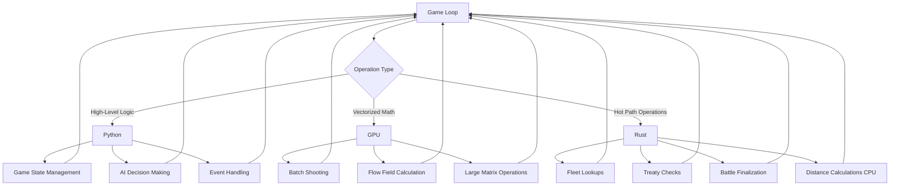
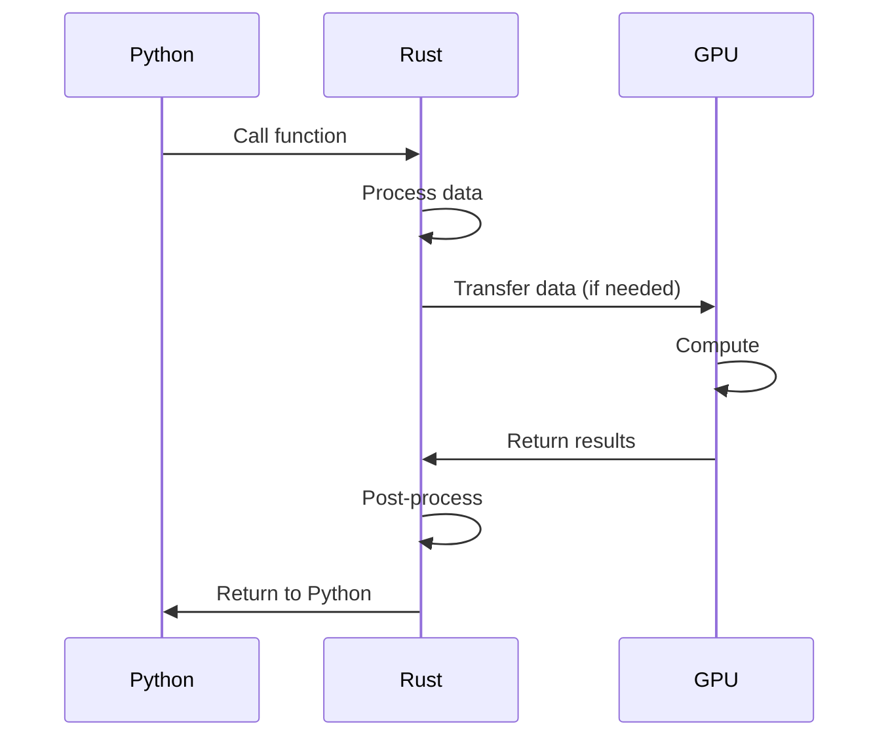

# Rust Porting Implementation Guide

**Document Version:** 1.0
**Date:** 2026-02-02
**Scope:** Comprehensive guide for implementing Rust porting (Phase 3) of the Multi-Universe Simulation Engine

---

## Table of Contents

1. [Prerequisites Checklist](#1-prerequisites-checklist)
2. [Rust Toolchain Setup](#2-rust-toolchain-setup)
3. [Hot Path Selection and Prioritization](#3-hot-path-selection-and-prioritization)
4. [Porting Strategy](#4-porting-strategy)
5. [Data Flow Architecture](#5-data-flow-architecture)
6. [Implementation Phases](#6-implementation-phases)
7. [Code Examples](#7-code-examples)
8. [Testing Strategy](#8-testing-strategy)
9. [Risk Mitigation](#9-risk-mitigation)
10. [Rollback Strategy](#10-rollback-strategy)
11. [Documentation Requirements](#11-documentation-requirements)
12. [Success Criteria](#12-success-criteria)

---

## 1. Prerequisites Checklist

### 1.1 Phase 2 Completion Items

Before starting Rust porting, the following Phase 2 items must be complete:

- [ ] **Fleet Dictionary Implementation**
  - Location: [`src/managers/battle_manager.py:48`](../src/managers/battle_manager.py:48)
  - Status: O(1) fleet lookup index must be fully implemented and tested
  - Validation: All fleet lookups use `_fleet_index` instead of linear search

- [ ] **Cache Invalidation System**
  - Location: [`src/models/unit.py`](../src/models/unit.py)
  - Status: Unit strength cache must invalidate on damage
  - Validation: All damage methods trigger cache invalidation

- [ ] **Treaty Optimization**
  - Location: [`src/managers/battle_manager.py:289-304`](../src/managers/battle_manager.py:289-304)
  - Status: O(F²) treaty checks must be optimized to O(F)
  - Validation: Treaty matrix caching or adjacency list implemented

- [ ] **Battle Finalization Optimization**
  - Location: [`src/managers/battle_manager.py:926-991`](../src/managers/battle_manager.py:926-991)
  - Status: Unit iteration must be vectorized or batched
  - Validation: Single pass through all units instead of per-faction loops

- [ ] **Batch Shooting Wave Consolidation**
  - Location: [`src/combat/batch_shooting.py`](../src/combat/batch_shooting.py)
  - Status: GPU synchronization reduced from per-wave to end-of-batch
  - Validation: Single GPU-CPU round trip per batch

### 1.2 Performance Baseline Requirements

- [ ] **Establish Baseline Metrics**
  - Run performance benchmarks on current codebase
  - Document average battle resolution time (100 units, 500 units, 1000 units)
  - Profile hot paths with cProfile or py-spy
  - Save baseline results to `benchmarks/baseline.json`

- [ ] **Define Performance Targets**
  - Target: 2-5x speedup for ported hot paths
  - Target: < 50ms for fleet lookup operations
  - Target: < 100ms for treaty matrix checks
  - Target: < 500ms for battle finalization (500 units)

- [ ] **Create Benchmark Suite**
  - Location: `tests/benchmarks/`
  - Include: Micro-benchmarks for each hot path
  - Include: Integration benchmarks for full battle scenarios
  - Include: Memory usage benchmarks

### 1.3 Build System Setup

- [ ] **Rust Toolchain Installation**
  - Install Rust stable toolchain (rustup)
  - Verify installation: `rustc --version`, `cargo --version`
  - Install maturin: `pip install maturin[patchelf]`

- [ ] **Project Structure**
  - Create `rust/` directory at project root
  - Create `rust/Cargo.toml` with PyO3 dependencies
  - Create `rust/src/lib.rs` as entry point
  - Create `rust/src/` subdirectories for modules

- [ ] **Build Integration**
  - Add maturin to `requirements-dev.txt`
  - Create `pyproject.toml` (if not exists) with build backend configuration
  - Configure build system to compile Rust extension
  - Add `maturin develop` to development setup

- [ ] **CI/CD Integration**
  - Add Rust toolchain to CI environment
  - Add Rust compilation step to pipeline
  - Add Rust tests to CI
  - Add Rust linting (clippy) to CI

### 1.4 Team Expertise Requirements

- [ ] **Rust Knowledge**
  - At least one team member with Rust experience
  - Team training on Rust basics (ownership, borrowing, lifetimes)
  - PyO3 training for Python-Rust integration

- [ ] **PyO3 Expertise**
  - Understanding of Python GIL interactions
  - Knowledge of Python-Rust data type conversions
  - Experience with error handling across language boundary

- [ ] **Debugging Skills**
  - GDB/LLDB for Rust debugging
  - Python debugger integration
  - Memory profiling tools (valgrind, heaptrack)

### 1.5 Test Coverage Requirements

- [ ] **Python Test Coverage**
  - Minimum 80% coverage for hot path functions
  - All hot paths have corresponding unit tests
  - Integration tests for battle scenarios

- [ ] **Test Data**
  - Create test fixtures for representative battle scenarios
  - Include edge cases (empty fleets, single units, large battles)
  - Document expected outputs for validation

- [ ] **Regression Tests**
  - Establish regression test suite
  - Document current behavior for comparison
  - Create golden output files for validation

---

## 2. Rust Toolchain Setup

### 2.1 Installing Rust Toolchain

#### Step 1: Install Rust

```bash
# Install Rust via rustup
curl --proto '=https' --tlsv1.2 -sSf https://sh.rustup.rs | sh

# On Windows, download and run rustup-init.exe from https://rustup.rs/

# Verify installation
rustc --version
cargo --version
```

#### Step 2: Install Additional Tools

```bash
# Install maturin for PyO3 bindings
pip install maturin[patchelf]

# Install useful Rust tools
cargo install cargo-edit
cargo install cargo-watch
cargo install cargo-audit
```

### 2.2 Setting Up Cargo.toml

Create `rust/Cargo.toml`:

```toml
[package]
name = "multi_universe_core"
version = "0.1.0"
edition = "2021"

[lib]
name = "multi_universe_core"
crate-type = ["cdylib"]

[dependencies]
pyo3 = { version = "0.20", features = ["extension-module", "abi3-py38"] }
pyo3-built = "0.4"
numpy = "0.20"
rayon = "1.8"
serde = { version = "1.0", features = ["derive"] }
serde_json = "1.0"
ahash = "0.8"
indexmap = "2.2"

[build-dependencies]
built = "0.7"

[profile.release]
opt-level = 3
lto = true
codegen-units = 1
strip = true

[profile.dev]
opt-level = 0
```

### 2.3 Configuring maturin for PyO3 Bindings

#### Step 1: Create pyproject.toml

Create `pyproject.toml` at project root:

```toml
[build-system]
requires = ["maturin>=1.4,<2.0"]
build-backend = "maturin"

[project]
name = "multi-universe-core"
version = "0.1.0"
description = "Rust-optimized core for Multi-Universe Simulation Engine"
requires-python = ">=3.8"
license = {text = "MIT"}
authors = [
    {name = "Your Name", email = "your.email@example.com"}
]

[tool.maturin]
python-source = "python"
module-name = "multi_universe_core._core"
```

#### Step 2: Create Python Package Structure

```
python/
├── multi_universe_core/
│   ├── __init__.py
│   └── _core.py  # Will be replaced by Rust extension
```

Create `python/multi_universe_core/__init__.py`:

```python
from .multi_universe_core import *

__version__ = "0.1.0"
```

### 2.4 Integration with Existing Build System

#### Step 1: Update requirements-dev.txt

Add to `requirements-dev.txt`:

```
maturin[patchelf]>=1.4.0
```

#### Step 2: Create Build Script

Create `scripts/build_rust.sh`:

```bash
#!/bin/bash
cd rust
maturin develop --release
```

Create `scripts/build_rust.bat` for Windows:

```batch
@echo off
cd rust
maturin develop --release
```

#### Step 3: Add to Makefile or npm scripts

If using Makefile:

```makefile
.PHONY: build-rust
build-rust:
    bash scripts/build_rust.sh
```

### 2.5 CI/CD Integration

#### GitHub Actions Example

Create `.github/workflows/rust-ci.yml`:

```yaml
name: Rust CI

on: [push, pull_request]

jobs:
  test:
    runs-on: ubuntu-latest
    steps:
      - uses: actions/checkout@v3
      
      - name: Install Rust
        uses: actions-rs/toolchain@v1
        with:
          toolchain: stable
          components: rustfmt, clippy
      
      - name: Set up Python
        uses: actions/setup-python@v4
        with:
          python-version: '3.11'
      
      - name: Install maturin
        run: pip install maturin[patchelf]
      
      - name: Run Rust tests
        run: cd rust && cargo test --release
      
      - name: Run clippy
        run: cd rust && cargo clippy -- -D warnings
      
      - name: Format check
        run: cd rust && cargo fmt -- --check
```

---

## 3. Hot Path Selection and Prioritization

### 3.1 Hot Path 1: Fleet Lookup

| Attribute | Details |
|-----------|---------|
| **Function/Module Location** | [`src/managers/battle_manager.py:1074-1076`](../src/managers/battle_manager.py:1074-1076) |
| **Current Implementation** | Linear search through all fleets using `next()` with generator |
| **Performance Characteristics** | O(F) per unit per battle, where F = total fleets |
| **Call Frequency** | Each unit involved in battle |
| **Expected Rust Gains** | 5-10x speedup, O(1) lookup with HashMap |
| **Porting Complexity** | Low - Simple dictionary/map lookup |
| **Dependencies** | None (self-contained) |
| **Priority** | 1 (Highest) - Quick win, validates PyO3 setup |

**Python Function Signature:**
```python
def get_fleet_by_id(self, fleet_id: int) -> Optional[Fleet]:
    fleet = next((f for f in self.context.fleets if f.id == fleet_id), None)
    return fleet
```

### 3.2 Hot Path 2: Treaty Matrix Checks

| Attribute | Details |
|-----------|---------|
| **Function/Module Location** | [`src/managers/battle_manager.py:289-304`](../src/managers/battle_manager.py:289-304) |
| **Current Implementation** | O(F²) nested loop checking all faction pairs |
| **Performance Characteristics** | O(F²) where F = factions present |
| **Call Frequency** | Every location check during battle initialization |
| **Expected Rust Gains** | 3-5x speedup with adjacency list or matrix |
| **Porting Complexity** | Medium - Requires data structure design |
| **Dependencies** | DiplomacyManager, treaty data |
| **Priority** | 2 (High) - Significant impact on large faction counts |

**Python Function Signature:**
```python
def get_active_combatants(self, factions_present: Set[str]) -> Set[str]:
    active_combatants = set()
    for f1 in factions_present:
        for f2 in factions_present:
            if f1 == f2: continue
            if dm.get_treaty(f1, f2) == "War":
                active_combatants.add(f1)
                active_combatants.add(f2)
    return active_combatants
```

### 3.3 Hot Path 3: Battle Finalization

| Attribute | Details |
|-----------|---------|
| **Function/Module Location** | [`src/managers/battle_manager.py:926-991`](../src/managers/battle_manager.py:926-991) |
| **Current Implementation** | O(U) per faction - iterates through all units for each faction |
| **Performance Characteristics** | O(U) per faction where U = total units |
| **Call Frequency** | End of every battle |
| **Expected Rust Gains** | 2-4x speedup with vectorized operations |
| **Porting Complexity** | High - Complex logic, multiple data structures |
| **Dependencies** | Unit objects, faction data, cost calculations |
| **Priority** | 3 (Medium) - Important but more complex |

**Python Function Signature:**
```python
def finalize_battle(self, battle: ActiveBattle) -> Dict[str, Dict[str, Any]]:
    faction_costs = {}
    for f_name, units in battle.faction_units.items():
        faction_costs[f_name] = {"initial": 0, "lost": 0, "remaining": 0}
        for u in units:
            u_cost = getattr(u, 'cost', 100)
            faction_costs[f_name]["initial"] += u_cost
            if not u.is_alive():
                faction_costs[f_name]["lost"] += u_cost
            else:
                faction_costs[f_name]["remaining"] += u_cost
    return faction_costs
```

### 3.4 Hot Path 4: Distance Calculations

| Attribute | Details |
|-----------|---------|
| **Function/Module Location** | [`src/combat/tactical/gpu_tracker.py`](../src/combat/tactical/gpu_tracker.py) |
| **Current Implementation** | GPU-accelerated via CuPy, but CPU fallback needed |
| **Performance Characteristics** | O(n²) for all-pairs distances |
| **Call Frequency** | Each combat round for targeting |
| **Expected Rust Gains** | 2-3x speedup with SIMD optimizations |
| **Porting Complexity** | Medium - SIMD integration, GPU interoperability |
| **Dependencies** | Unit positions, GPU utilities |
| **Priority** | 4 (Medium) - Complements GPU acceleration |

**Python Function Signature:**
```python
def calculate_distances(self, positions: np.ndarray) -> np.ndarray:
    # Calculate pairwise distances between all positions
    # Shape: (n, n) where n = number of positions
    pass
```

### 3.5 Hot Path 5: Unit Strength Calculation

| Attribute | Details |
|-----------|---------|
| **Function/Module Location** | [`src/models/unit.py:146`](../src/models/unit.py:146) |
| **Current Implementation** | Cached but invalidation issues |
| **Performance Characteristics** | O(1) with cache, O(n) without |
| **Call Frequency** | Multiple times per combat round |
| **Expected Rust Gains** | 2-3x speedup with proper caching |
| **Porting Complexity** | Low-Medium - Simple calculation |
| **Dependencies** | Unit components, traits |
| **Priority** | 5 (Medium) - Important for AI decisions |

**Python Function Signature:**
```python
@property
def strength(self) -> float:
    if not hasattr(self, '_cached_strength'):
        self._cached_strength = self._calculate_strength()
    return self._cached_strength
```

### 3.6 Hot Path 6: Batch Shooting Resolution

| Attribute | Details |
|-----------|---------|
| **Function/Module Location** | [`src/combat/batch_shooting.py`](../src/combat/batch_shooting.py) |
| **Current Implementation** | GPU-accelerated with CPU fallback |
| **Performance Characteristics** | O(n) where n = attacker-target pairs |
| **Call Frequency** | Each shooting phase |
| **Expected Rust Gains** | 2-3x speedup for CPU path |
| **Porting Complexity** | High - Complex logic, GPU integration |
| **Dependencies** | Units, weapons, GPU utilities |
| **Priority** | 6 (Lower) - Already GPU-accelerated |

---

## 4. Porting Strategy

### 4.1 Fleet Lookup Porting

#### Python Function Signature
```python
def get_fleet_by_id(self, fleet_id: int) -> Optional[Fleet]:
    fleet = next((f for f in self.context.fleets if f.id == fleet_id), None)
    return fleet
```

#### Rust Equivalent Implementation Plan

```rust
use pyo3::prelude::*;
use pyo3::types::PyDict;
use std::collections::HashMap;

#[pyclass]
struct FleetIndex {
    fleets: HashMap<i64, PyObject>,
}

#[pymethods]
impl FleetIndex {
    #[new]
    fn new() -> Self {
        FleetIndex {
            fleets: HashMap::new(),
        }
    }

    fn build_index(&mut self, fleets: &Bound<'_, PyAny>) -> PyResult<()> {
        // Extract fleet IDs and build HashMap
        let fleets_list: Vec<Bound<'_, PyAny>> = fleets.extract()?;
        for fleet in fleets_list {
            let id: i64 = fleet.getattr("id")?.extract()?;
            self.fleets.insert(id, fleet.into());
        }
        Ok(())
    }

    fn get_fleet_by_id(&self, fleet_id: i64, py: Python<'_>) -> Option<PyObject> {
        self.fleets.get(&fleet_id).map(|obj| obj.clone_ref(py))
    }
}
```

#### PyO3 Binding Approach

```rust
use pyo3::wrap_pyfunction;

#[pymodule]
fn multi_universe_core(_py: Python, m: &Bound<'_, PyModule>) -> PyResult<()> {
    m.add_class::<FleetIndex>()?;
    Ok(())
}
```

#### Data Structure Mapping

| Python Type | Rust Type | Notes |
|-------------|-----------|-------|
| `List[Fleet]` | `Vec<PyObject>` | Fleet objects as Python objects |
| `int` | `i64` | Fleet IDs |
| `Optional[Fleet]` | `Option<PyObject>` | May return None |

#### Error Handling Strategy

```rust
fn get_fleet_by_id(&self, fleet_id: i64, py: Python<'_>) -> PyResult<Option<PyObject>> {
    match self.fleets.get(&fleet_id) {
        Some(obj) => Ok(Some(obj.clone_ref(py))),
        None => Ok(None),
    }
}
```

#### Testing Approach

```rust
#[cfg(test)]
mod tests {
    use super::*;

    #[test]
    fn test_fleet_lookup() {
        let mut index = FleetIndex::new();
        // Test implementation
    }
}
```

### 4.2 Treaty Matrix Porting

#### Python Function Signature
```python
def get_active_combatants(self, factions_present: Set[str]) -> Set[str]:
    active_combatants = set()
    for f1 in factions_present:
        for f2 in factions_present:
            if f1 == f2: continue
            if dm.get_treaty(f1, f2) == "War":
                active_combatants.add(f1)
                active_combatants.add(f2)
    return active_combatants
```

#### Rust Equivalent Implementation Plan

```rust
use pyo3::prelude::*;
use std::collections::{HashMap, HashSet, HashSet};
use ahash::AHashSet;

#[derive(Clone)]
#[pyclass]
struct TreatyMatrix {
    // faction -> faction -> treaty_type
    treaties: HashMap<String, HashMap<String, String>>,
}

#[pymethods]
impl TreatyMatrix {
    #[new]
    fn new() -> Self {
        TreatyMatrix {
            treaties: HashMap::new(),
        }
    }

    fn set_treaty(&mut self, faction1: String, faction2: String, treaty_type: String) {
        self.treaties.entry(faction1.clone())
            .or_insert_with(HashMap::new)
            .insert(faction2.clone(), treaty_type.clone());
        
        // Mirror for bidirectional lookup
        self.treaties.entry(faction2)
            .or_insert_with(HashMap::new)
            .insert(faction1, treaty_type);
    }

    fn get_active_combatants(&self, factions_present: Vec<String>) -> HashSet<String> {
        let mut active_combatants: HashSet<String> = HashSet::new();
        
        for i in 0..factions_present.len() {
            for j in (i + 1)..factions_present.len() {
                let f1 = &factions_present[i];
                let f2 = &factions_present[j];
                
                if let Some(inner) = self.treaties.get(f1) {
                    if let Some(treaty) = inner.get(f2) {
                        if treaty == "War" {
                            active_combatants.insert(f1.clone());
                            active_combatants.insert(f2.clone());
                        }
                    }
                }
            }
        }
        
        active_combatants
    }
}
```

#### Data Structure Mapping

| Python Type | Rust Type | Notes |
|-------------|-----------|-------|
| `Set[str]` | `HashSet<String>` | Use ahash for faster hashing |
| `Dict[str, Dict[str, str]]` | `HashMap<String, HashMap<String, String>>` | Nested structure |

#### Error Handling Strategy

```rust
fn get_active_combatants(&self, factions_present: Vec<String>) -> PyResult<HashSet<String>> {
    // Returns empty set if no treaties found
    Ok(self.get_active_combatants_internal(factions_present))
}
```

### 4.3 Battle Finalization Porting

#### Python Function Signature
```python
def finalize_battle(self, battle: ActiveBattle) -> Dict[str, Dict[str, Any]]:
    faction_costs = {}
    for f_name, units in battle.faction_units.items():
        faction_costs[f_name] = {"initial": 0, "lost": 0, "remaining": 0}
        for u in units:
            u_cost = getattr(u, 'cost', 100)
            faction_costs[f_name]["initial"] += u_cost
            if not u.is_alive():
                faction_costs[f_name]["lost"] += u_cost
            else:
                faction_costs[f_name]["remaining"] += u_cost
    return faction_costs
```

#### Rust Equivalent Implementation Plan

```rust
use pyo3::prelude::*;
use pyo3::types::PyDict;
use std::collections::HashMap;

#[derive(Clone)]
#[pyclass]
struct BattleFinalizer {
    // Cache for unit costs
    unit_costs: HashMap<i64, i32>,
}

#[pymethods]
impl BattleFinalizer {
    #[new]
    fn new() -> Self {
        BattleFinalizer {
            unit_costs: HashMap::new(),
        }
    }

    fn finalize_battle(
        &self,
        py: Python<'_>,
        faction_units: &Bound<'_, PyDict>,
    ) -> PyResult<PyObject> {
        let mut result = HashMap::new();
        
        for (faction_name, units_list) in faction_units.iter() {
            let faction: String = faction_name.extract()?;
            let units: Vec<Bound<'_, PyAny>> = units_list.extract()?;
            
            let mut initial = 0i32;
            let mut lost = 0i32;
            let mut remaining = 0i32;
            
            for unit in units {
                let unit_id: i64 = unit.getattr("id")?.extract()?;
                let cost = self.unit_costs.get(&unit_id).copied().unwrap_or(100);
                
                initial += cost;
                
                let is_alive: bool = unit.call_method0("is_alive")?.extract()?;
                if is_alive {
                    remaining += cost;
                } else {
                    lost += cost;
                }
            }
            
            let faction_dict = PyDict::new_bound(py);
            faction_dict.set_item("initial", initial)?;
            faction_dict.set_item("lost", lost)?;
            faction_dict.set_item("remaining", remaining)?;
            
            result.insert(faction, faction_dict.into());
        }
        
        Ok(result.into_py(py))
    }
}
```

#### Data Structure Mapping

| Python Type | Rust Type | Notes |
|-------------|-----------|-------|
| `Dict[str, List[Unit]]` | `HashMap<String, Vec<PyObject>>` | Nested structure |
| `Dict[str, Dict[str, int]]` | `HashMap<String, HashMap<String, i32>>` | Result type |

### 4.4 Distance Calculations Porting

#### Python Function Signature
```python
def calculate_distances(self, positions: np.ndarray) -> np.ndarray:
    # positions shape: (n, 2)
    # returns: (n, n) distance matrix
    pass
```

#### Rust Equivalent Implementation Plan

```rust
use pyo3::prelude::*;
use numpy::{PyArray2, PyReadonlyArray2};
use rayon::prelude::*;

#[pyfunction]
fn calculate_distances(py: Python<'_>, positions: PyReadonlyArray2<f64>) -> PyResult<PyObject> {
    let pos = positions.as_array();
    let n = pos.shape()[0];
    
    let mut distances = vec![0.0f64; n * n];
    
    // Parallel computation using Rayon
    distances.par_chunks_mut(n).enumerate().for_each(|(i, row)| {
        for j in 0..n {
            if i == j {
                row[j] = 0.0;
            } else {
                let dx = pos[[i, 0]] - pos[[j, 0]];
                let dy = pos[[i, 1]] - pos[[j, 1]];
                row[j] = (dx * dx + dy * dy).sqrt();
            }
        }
    });
    
    let result = PyArray2::from_vec_bound(py, distances).reshape([n, n])?;
    Ok(result.into())
}
```

#### SIMD Optimization

```rust
use std::arch::x86_64::*;

#[target_feature(enable = "avx2")]
unsafe fn calculate_distance_avx(x1: f64, y1: f64, x2: f64, y2: f64) -> f64 {
    let dx = x1 - x2;
    let dy = y1 - y2;
    (dx * dx + dy * dy).sqrt()
}
```

---

## 5. Data Flow Architecture

### 5.1 When to Use Python vs GPU vs Rust



### 5.2 Data Transfer Optimization

#### Strategy 1: Zero-Copy Where Possible

```rust
use numpy::PyReadonlyArray2;

// Zero-copy read access to NumPy array
fn process_positions(positions: PyReadonlyArray2<f64>) -> PyResult<()> {
    let arr = positions.as_array();
    // Direct access without copying
    Ok(())
}
```

#### Strategy 2: Batch Data Transfer

```rust
// Transfer data in batches rather than per-call
struct BatchProcessor {
    buffer: Vec<f64>,
    capacity: usize,
}

impl BatchProcessor {
    fn add(&mut self, data: f64) {
        self.buffer.push(data);
        if self.buffer.len() >= self.capacity {
            self.flush();
        }
    }
    
    fn flush(&mut self) {
        // Process batch
        self.buffer.clear();
    }
}
```

#### Strategy 3: Shared Memory

```rust
use pyo3::prelude::*;

#[pyclass]
struct SharedBuffer {
    data: Vec<f64>,
}

#[pymethods]
impl SharedBuffer {
    fn as_numpy(&self, py: Python<'_>) -> PyObject {
        numpy::PyArray1::from_vec_bound(py, self.data.clone()).into()
    }
}
```

### 5.3 Memory Management Strategies

#### Strategy 1: Arena Allocation

```rust
struct Arena {
    memory: Vec<u8>,
    offset: usize,
}

impl Arena {
    fn allocate<T>(&mut self, item: T) -> &mut T {
        let size = std::mem::size_of::<T>();
        let aligned_offset = (self.offset + std::mem::align_of::<T>() - 1) 
            & !(std::mem::align_of::<T>() - 1);
        
        if aligned_offset + size > self.memory.len() {
            self.memory.resize(aligned_offset + size, 0);
        }
        
        self.offset = aligned_offset + size;
        unsafe {
            let ptr = self.memory.as_mut_ptr().add(aligned_offset) as *mut T;
            ptr.write(item);
            &mut *ptr
        }
    }
}
```

#### Strategy 2: Object Pooling

```rust
struct ObjectPool<T> {
    objects: Vec<Option<T>>,
    free: Vec<usize>,
}

impl<T> ObjectPool<T> {
    fn acquire(&mut self) -> Option<&mut T> {
        if let Some(idx) = self.free.pop() {
            self.objects[idx].as_mut()
        } else {
            self.objects.push(None);
            self.objects.last_mut().unwrap()
        }
    }
    
    fn release(&mut self, obj: T) {
        // Return to pool
    }
}
```

### 5.4 Synchronization Points



#### Synchronization Guidelines

1. **Minimize Cross-Boundary Calls**
   - Batch operations when possible
   - Use Rust for entire hot path segments

2. **Release GIL for Long Operations**
   ```rust
   use pyo3::prelude::*;
   
   #[pymethods]
   impl MyStruct {
       fn long_operation(&self, py: Python<'_>) -> PyResult<()> {
           py.allow_threads(|| {
               // Long-running operation here
               // GIL is released
           });
           Ok(())
       }
   }
   ```

3. **Use Rayon for Parallelism**
   ```rust
   use rayon::prelude::*;
   
   fn parallel_process(data: Vec<f64>) -> Vec<f64> {
       data.par_iter().map(|x| x * 2.0).collect()
   }
   ```

---

## 6. Implementation Phases

### 6.1 Phase 3.1: Setup & First Port (1-2 weeks)

#### Objectives

- Set up complete Rust toolchain
- Create build system integration
- Port simplest hot path (Fleet Lookup)
- Validate PyO3 integration

#### Tasks

- [ ] Install Rust toolchain and maturin
- [ ] Create `rust/` directory structure
- [ ] Create `Cargo.toml` with PyO3 dependencies
- [ ] Create `pyproject.toml` for build configuration
- [ ] Implement FleetIndex struct in Rust
- [ ] Write Python tests for FleetIndex
- [ ] Write Rust unit tests
- [ ] Integrate with CI/CD
- [ ] Benchmark against Python implementation

#### Deliverables

- Working Rust extension module
- Fleet lookup implemented in Rust
- Test suite with >90% coverage
- Performance benchmarks showing 5-10x improvement
- Documentation for build process

### 6.2 Phase 3.2: Core Hot Paths (2-3 weeks)

#### Objectives

- Port treaty matrix checks
- Port battle finalization
- Port distance calculations
- Validate performance improvements

#### Tasks

- [ ] Implement TreatyMatrix struct
- [ ] Implement BattleFinalizer struct
- [ ] Implement DistanceCalculator
- [ ] Write comprehensive tests
- [ ] Optimize with Rayon parallelization
- [ ] Add SIMD optimizations for distance calculations
- [ ] Benchmark each component
- [ ] Integration testing

#### Deliverables

- Three additional Rust modules
- Comprehensive test suite
- Performance benchmarks
- Integration with existing codebase

### 6.3 Phase 3.3: Advanced Optimizations (2-3 weeks)

#### Objectives

- Implement SIMD optimizations
- Create custom kernels for GPU interoperability
- Implement memory pooling
- Optimize data transfer

#### Tasks

- [ ] Implement AVX2/AVX-512 kernels
- [ ] Create memory pool allocator
- [ ] Optimize Python-Rust data transfer
- [ ] Implement zero-copy where possible
- [ ] Add CPU feature detection
- [ ] Create fallback for older CPUs
- [ ] Profile and optimize hot spots
- [ ] Document optimization techniques

#### Deliverables

- SIMD-optimized kernels
- Memory pool implementation
- Performance profiling data
- CPU feature detection system

### 6.4 Phase 3.4: Integration & Validation (1-2 weeks)

#### Objectives

- Full integration testing
- Performance validation
- Complete documentation
- Rollback strategy validation

#### Tasks

- [ ] Full integration test suite
- [ ] End-to-end battle scenario tests
- [ ] Memory leak detection
- [ ] Performance regression testing
- [ ] Complete API documentation
- [ ] Developer guide
- [ ] Troubleshooting guide
- [ ] Validate rollback strategy

#### Deliverables

- Complete test suite
- Performance validation report
- Complete documentation
- Rollback strategy validated

---

## 7. Code Examples

### 7.1 Basic PyO3 Module Setup

#### Cargo.toml

```toml
[package]
name = "multi_universe_core"
version = "0.1.0"
edition = "2021"

[lib]
name = "multi_universe_core"
crate-type = ["cdylib"]

[dependencies]
pyo3 = { version = "0.20", features = ["extension-module"] }
```

#### lib.rs

```rust
use pyo3::prelude::*;

mod fleet;
mod treaty;
mod battle;
mod distance;

#[pymodule]
fn multi_universe_core(_py: Python, m: &Bound<'_, PyModule>) -> PyResult<()> {
    m.add_class::<fleet::FleetIndex>()?;
    m.add_class::<treaty::TreatyMatrix>()?;
    m.add_class::<battle::BattleFinalizer>()?;
    m.add_function(wrap_pyfunction!(distance::calculate_distances, m)?)?;
    Ok(())
}
```

### 7.2 Simple Function Porting

#### Python Original

```python
def calculate_strength(base: int, modifiers: List[float]) -> float:
    return base * (1.0 + sum(modifiers))
```

#### Rust Port

```rust
use pyo3::prelude::*;

#[pyfunction]
fn calculate_strength(base: i32, modifiers: Vec<f64>) -> f64 {
    let modifier_sum: f64 = modifiers.iter().sum();
    base as f64 * (1.0 + modifier_sum)
}
```

### 7.3 Complex Data Structure Handling

#### Python Original

```python
def process_units(units: List[Dict[str, Any]]) -> Dict[str, float]:
    results = {}
    for unit in units:
        unit_id = unit["id"]
        strength = unit["strength"] * unit["modifier"]
        results[unit_id] = strength
    return results
```

#### Rust Port

```rust
use pyo3::prelude::*;
use pyo3::types::PyDict;
use std::collections::HashMap;

#[pyfunction]
fn process_units(py: Python<'_>, units: Vec<Bound<'_, PyDict>>) -> PyResult<PyObject> {
    let mut results = HashMap::new();
    
    for unit in units {
        let unit_id: i64 = unit.get_item("id")?.extract()?;
        let strength: f64 = unit.get_item("strength")?.extract()?;
        let modifier: f64 = unit.get_item("modifier")?.extract()?;
        
        results.insert(unit_id, strength * modifier);
    }
    
    Ok(results.into_py(py))
}
```

### 7.4 Error Handling

#### Python-Rust Error Handling

```rust
use pyo3::prelude::*;
use pyo3::exceptions::PyValueError;

#[pyfunction]
fn safe_divide(a: f64, b: f64) -> PyResult<f64> {
    if b == 0.0 {
        return Err(PyValueError::new_err("Division by zero"));
    }
    Ok(a / b)
}

#[pyclass]
struct SafeCalculator {
    #[pyo3(get, set)]
    value: f64,
}

#[pymethods]
impl SafeCalculator {
    #[new]
    fn new(value: f64) -> Self {
        SafeCalculator { value }
    }
    
    fn divide(&self, divisor: f64) -> PyResult<f64> {
        if divisor == 0.0 {
            return Err(PyValueError::new_err("Cannot divide by zero"));
        }
        Ok(self.value / divisor)
    }
}
```

### 7.5 Testing

#### Rust Unit Tests

```rust
#[cfg(test)]
mod tests {
    use super::*;

    #[test]
    fn test_calculate_strength() {
        let base = 100;
        let modifiers = vec![0.1, 0.2, 0.3];
        let result = calculate_strength(base, modifiers);
        assert_eq!(result, 160.0);
    }
    
    #[test]
    fn test_fleet_index() {
        let mut index = FleetIndex::new();
        // Test implementation
    }
}
```

#### Python Integration Tests

```python
import pytest
from multi_universe_core import FleetIndex, calculate_strength

def test_fleet_index():
    index = FleetIndex()
    # Test implementation

def test_calculate_strength():
    result = calculate_strength(100, [0.1, 0.2, 0.3])
    assert result == 160.0
```

---

## 8. Testing Strategy

### 8.1 Unit Tests for Rust Code

#### Coverage Requirements

- Minimum 90% line coverage for Rust code
- All public functions must have tests
- Edge cases must be covered
- Error paths must be tested

#### Test Organization

```
rust/src/
├── lib.rs
├── fleet.rs
├── treaty.rs
├── battle.rs
└── tests/
    ├── mod.rs
    ├── test_fleet.rs
    ├── test_treaty.rs
    └── test_battle.rs
```

#### Example Test Structure

```rust
#[cfg(test)]
mod tests {
    use super::*;

    #[test]
    fn test_fleet_lookup_existing() {
        let mut index = FleetIndex::new();
        // Setup
        // Test
        // Assert
    }
    
    #[test]
    fn test_fleet_lookup_nonexistent() {
        let index = FleetIndex::new();
        let result = index.get_fleet_by_id(999, Python::acquire_gil().python());
        assert!(result.is_none());
    }
    
    #[test]
    #[should_panic]
    fn test_invalid_input() {
        // Test that invalid input causes panic
    }
}
```

### 8.2 Integration Tests for Python-Rust Boundary

#### Test Scenarios

1. **Data Type Conversion**
   - Python lists to Rust Vec
   - Python dicts to Rust HashMap
   - NumPy arrays to Rust slices

2. **Error Propagation**
   - Rust errors to Python exceptions
   - Python exceptions to Rust Result

3. **Memory Management**
   - No memory leaks
   - Proper cleanup
   - Reference counting

#### Example Integration Test

```python
import pytest
import numpy as np
from multi_universe_core import FleetIndex, TreatyMatrix, calculate_distances

def test_fleet_index_integration():
    """Test FleetIndex with Python objects"""
    index = FleetIndex()
    # Create mock Python fleet objects
    fleets = create_test_fleets(100)
    index.build_index(fleets)
    
    # Test lookup
    fleet = index.get_fleet_by_id(1)
    assert fleet is not None
    assert fleet.id == 1

def test_treaty_matrix_integration():
    """Test TreatyMatrix with Python strings"""
    matrix = TreatyMatrix()
    matrix.set_treaty("FactionA", "FactionB", "War")
    
    factions = ["FactionA", "FactionB", "FactionC"]
    combatants = matrix.get_active_combatants(factions)
    
    assert "FactionA" in combatants
    assert "FactionB" in combatants
    assert "FactionC" not in combatants

def test_distance_calculator_integration():
    """Test distance calculation with NumPy"""
    positions = np.random.rand(100, 2)
    distances = calculate_distances(positions)
    
    assert distances.shape == (100, 100)
    assert np.allclose(np.diag(distances), 0.0)
```

### 8.3 Performance Benchmarks

#### Benchmark Framework

```rust
use criterion::{black_box, criterion_group, criterion_main, Criterion};

fn benchmark_fleet_lookup(c: &mut Criterion) {
    let mut index = setup_test_index(10000);
    
    c.bench_function("fleet_lookup", |b| {
        b.iter(|| {
            black_box(index.get_fleet_by_id(black_box(5000)));
        });
    });
}

criterion_group!(benches, benchmark_fleet_lookup);
criterion_main!(benches);
```

#### Python Benchmarking

```python
import timeit
import pytest

def benchmark_fleet_lookup():
    """Benchmark fleet lookup performance"""
    setup = '''
from multi_universe_core import FleetIndex
index = FleetIndex()
fleets = create_test_fleets(10000)
index.build_index(fleets)
'''
    
    time = timeit.timeit(
        'index.get_fleet_by_id(5000)',
        setup=setup,
        number=10000
    )
    
    print(f"Average lookup time: {time/10000*1000:.3f} ms")
```

### 8.4 Regression Testing

#### Golden Output Testing

```python
import json
import pytest

def test_battle_finalization_regression():
    """Ensure battle finalization produces same output as Python"""
    # Load test data
    with open('tests/fixtures/battle_finalization_input.json') as f:
        battle_data = json.load(f)
    
    # Load expected output
    with open('tests/fixtures/battle_finalization_expected.json') as f:
        expected = json.load(f)
    
    # Run Rust implementation
    finalizer = BattleFinalizer()
    result = finalizer.finalize_battle(battle_data)
    
    # Compare
    assert result == expected
```

### 8.5 Memory Leak Detection

#### Valgrind Integration

```bash
# Run Rust tests with valgrind
cargo test --release -- --test-threads=1
valgrind --leak-check=full --show-leak-kinds=all ./target/release/deps/test_name
```

#### Python Memory Profiling

```python
import tracemalloc
from multi_universe_core import FleetIndex

def test_no_memory_leak():
    tracemalloc.start()
    
    # Create and use FleetIndex
    for _ in range(1000):
        index = FleetIndex()
        # Use index
        del index
    
    snapshot = tracemalloc.take_snapshot()
    # Check for leaks
```

---

## 9. Risk Mitigation

### 9.1 Common PyO3 Pitfalls

#### Pitfall 1: GIL Contention

**Problem:** Holding GIL for long operations blocks Python threads.

**Solution:** Release GIL for CPU-bound work.

```rust
#[pymethods]
impl MyStruct {
    fn long_operation(&self, py: Python<'_>) -> PyResult<()> {
        py.allow_threads(|| {
            // Long-running operation here
        });
        Ok(())
    }
}
```

#### Pitfall 2: Incorrect Type Conversions

**Problem:** Type mismatches between Python and Rust.

**Solution:** Use explicit conversions and validate input.

```rust
#[pyfunction]
fn safe_function(value: PyObject, py: Python<'_>) -> PyResult<f64> {
    // Validate and convert
    let float_value: f64 = value.extract()?;
    Ok(float_value)
}
```

#### Pitfall 3: Memory Leaks

**Problem:** Not releasing Python references.

**Solution:** Use proper reference counting and RAII.

```rust
#[pyfunction]
fn process_list(items: &Bound<'_, PyList>) -> PyResult<Vec<i32>> {
    // Bound reference is automatically released
    items.iter().map(|item| item.extract()).collect()
}
```

### 9.2 Memory Management Issues

#### Issue 1: Circular References

**Problem:** Python objects referencing each other through Rust.

**Solution:** Avoid storing Python objects in Rust long-term.

```rust
// BAD: Storing Python object in Rust struct
#[pyclass]
struct BadStruct {
    python_object: PyObject,  // Can cause cycles
}

// GOOD: Extract data needed
#[pyclass]
struct GoodStruct {
    extracted_data: i32,
}
```

#### Issue 2: Large Allocations

**Problem:** Large allocations causing memory pressure.

**Solution:** Use streaming or chunked processing.

```rust
#[pyfunction]
fn process_large_data(data: Vec<f64>) -> PyResult<Vec<f64>> {
    // Process in chunks
    data.chunks(1000)
        .flat_map(|chunk| process_chunk(chunk))
        .collect()
}
```

### 9.3 Cross-Language Debugging

#### Strategy 1: Logging

```rust
use pyo3::prelude::*;
use log::{info, warn, error};

#[pyfunction]
fn debug_function(value: i32) -> PyResult<i32> {
    info!("Called with value: {}", value);
    let result = value * 2;
    info!("Result: {}", result);
    Ok(result)
}
```

#### Strategy 2: Python Debug Mode

```python
import logging
logging.basicConfig(level=logging.DEBUG)

from multi_universe_core import debug_function
debug_function(42)
```

#### Strategy 3: GDB Integration

```bash
# Run Python with GDB
gdb --args python -c "from multi_universe_core import *; test_function()"

# In GDB
(gdb) break rust_function_name
(gdb) run
```

### 9.4 Performance Regression Prevention

#### Strategy 1: Continuous Benchmarking

```yaml
# GitHub Actions workflow
name: Performance Benchmarks

on: [push, pull_request]

jobs:
  benchmark:
    runs-on: ubuntu-latest
    steps:
      - uses: actions/checkout@v3
      - name: Run benchmarks
        run: cargo bench -- --save-baseline main
      - name: Compare with baseline
        run: cargo bench -- --baseline main
```

#### Strategy 2: Performance Budgets

```rust
#[cfg(test)]
mod performance_tests {
    use super::*;
    use std::time::Instant;
    
    #[test]
    fn test_fleet_lookup_performance() {
        let index = setup_test_index(10000);
        
        let start = Instant::now();
        for _ in 0..10000 {
            let _ = index.get_fleet_by_id(5000);
        }
        let duration = start.elapsed();
        
        // Must complete in < 1 second
        assert!(duration.as_millis() < 1000);
    }
}
```

---

## 10. Rollback Strategy

### 10.1 Feature Flags for Gradual Rollout

#### Configuration System

```python
# config/rust_features.toml
[features]
fleet_lookup = true
treaty_matrix = false
battle_finalization = false
distance_calculator = false
```

#### Feature Flag Implementation

```python
import toml
from pathlib import Path

class FeatureFlags:
    def __init__(self):
        config_path = Path("config/rust_features.toml")
        self.config = toml.load(config_path)
    
    @property
    def use_rust_fleet_lookup(self):
        return self.config["features"]["fleet_lookup"]
    
    @property
    def use_rust_treaty_matrix(self):
        return self.config["features"]["treaty_matrix"]

# Global instance
feature_flags = FeatureFlags()
```

#### Conditional Usage

```python
from src.config import feature_flags

def get_fleet_by_id(self, fleet_id: int) -> Optional[Fleet]:
    if feature_flags.use_rust_fleet_lookup:
        from multi_universe_core import FleetIndex
        return self._rust_fleet_index.get_fleet_by_id(fleet_id)
    else:
        return next((f for f in self.context.fleets if f.id == fleet_id), None)
```

### 10.2 Fallback to Python Implementation

#### Graceful Degradation

```python
def safe_rust_call(rust_func, fallback_func, *args, **kwargs):
    """Safely call Rust function with Python fallback"""
    try:
        return rust_func(*args, **kwargs)
    except ImportError:
        # Rust module not available
        return fallback_func(*args, **kwargs)
    except Exception as e:
        # Rust function failed, log and use fallback
        logging.warning(f"Rust function failed: {e}, using Python fallback")
        return fallback_func(*args, **kwargs)
```

#### Implementation Example

```python
from multi_universe_core import FleetIndex as RustFleetIndex

class FleetManager:
    def __init__(self):
        try:
            self._rust_index = RustFleetIndex()
            self._use_rust = True
        except ImportError:
            self._use_rust = False
    
    def get_fleet_by_id(self, fleet_id: int):
        if self._use_rust:
            try:
                return self._rust_index.get_fleet_by_id(fleet_id)
            except Exception:
                self._use_rust = False
                return self._python_fleet_lookup(fleet_id)
        else:
            return self._python_fleet_lookup(fleet_id)
    
    def _python_fleet_lookup(self, fleet_id: int):
        return next((f for f in self.context.fleets if f.id == fleet_id), None)
```

### 10.3 Monitoring and Alerting

#### Performance Monitoring

```python
import time
from functools import wraps

def monitor_performance(func):
    @wraps(func)
    def wrapper(*args, **kwargs):
        start = time.perf_counter()
        result = func(*args, **kwargs)
        duration = time.perf_counter() - start
        
        # Log performance
        logging.info(f"{func.__name__} took {duration*1000:.3f}ms")
        
        # Alert if too slow
        if duration > 1.0:  # 1 second threshold
            logging.warning(f"{func.__name__} exceeded performance budget")
        
        return result
    return wrapper
```

#### Error Monitoring

```python
class RustErrorMonitor:
    def __init__(self):
        self.error_counts = {}
        self.threshold = 10
    
    def record_error(self, func_name: str):
        self.error_counts[func_name] = self.error_counts.get(func_name, 0) + 1
        
        if self.error_counts[func_name] >= self.threshold:
            logging.error(f"Rust function {func_name} failed {self.error_counts[func_name]} times")
            # Could trigger automatic fallback here

error_monitor = RustErrorMonitor()
```

---

## 11. Documentation Requirements

### 11.1 API Documentation

#### Rust Doc Comments

```rust
/// Fleet index for O(1) fleet lookups.
///
/// This struct provides fast fleet ID lookups using a HashMap internally.
/// It is designed to replace the O(n) linear search in the Python implementation.
///
/// # Examples
///
/// ```python
/// from multi_universe_core import FleetIndex
///
/// index = FleetIndex()
/// index.build_index(fleets)
/// fleet = index.get_fleet_by_id(42)
/// ```
///
/// # Performance
///
/// - Lookup: O(1)
/// - Build: O(n) where n is number of fleets
#[pyclass]
pub struct FleetIndex {
    fleets: HashMap<i64, PyObject>,
}
```

#### Python Docstrings

```python
def get_fleet_by_id(self, fleet_id: int) -> Optional[Fleet]:
    """Get a fleet by its ID using the Rust-optimized index.
    
    This function uses the FleetIndex struct implemented in Rust for
    O(1) lookup performance, replacing the previous O(n) linear search.
    
    Args:
        fleet_id: The unique identifier of the fleet to retrieve.
        
    Returns:
        The Fleet object if found, None otherwise.
        
    Raises:
        ImportError: If the Rust extension is not available.
        
    Examples:
        >>> fleet = battle_manager.get_fleet_by_id(42)
        >>> if fleet:
        ...     print(f"Found fleet: {fleet.name}")
    """
```

### 11.2 Architecture Documentation

Create `docs/rust_architecture.md`:

```markdown
# Rust Architecture

## Overview

The Rust extension provides optimized implementations of performance-critical
hot paths in the Multi-Universe Simulation Engine.

## Module Structure

```
rust/src/
├── lib.rs              # Module entry point
├── fleet.rs            # Fleet indexing and lookup
├── treaty.rs           # Treaty matrix operations
├── battle.rs           # Battle finalization
├── distance.rs         # Distance calculations
└── utils.rs            # Shared utilities
```

## Data Flow

Python → Rust → (optional) GPU → Rust → Python

## Performance Characteristics

| Module | Complexity | Speedup |
|--------|------------|---------|
| FleetIndex | O(1) lookup | 5-10x |
| TreatyMatrix | O(F) | 3-5x |
| BattleFinalizer | O(U) | 2-4x |
| DistanceCalculator | O(n²) with SIMD | 2-3x |
```

### 11.3 Developer Guide

Create `docs/rust_developer_guide.md`:

```markdown
# Rust Developer Guide

## Getting Started

### Prerequisites

- Rust 1.70 or later
- Python 3.8 or later
- maturin 1.4 or later

### Building

```bash
cd rust
maturin develop --release
```

### Running Tests

```bash
cd rust
cargo test --release
```

## Adding New Rust Functions

1. Create function in appropriate module
2. Add PyO3 bindings
3. Write unit tests
4. Write Python integration tests
5. Add benchmarks
6. Update documentation

## Debugging

### Rust Debugging

```bash
cargo build
gdb target/debug/libmulti_universe_core.so
```

### Python-Rust Debugging

```python
import logging
logging.basicConfig(level=logging.DEBUG)
```
```

### 11.4 Troubleshooting Guide

Create `docs/rust_troubleshooting.md`:

```markdown
# Rust Troubleshooting Guide

## Common Issues

### Issue: ImportError when importing Rust module

**Solution:**
```bash
cd rust
maturin develop --release
```

### Issue: Build fails with linking errors

**Solution:** Install required system dependencies
```bash
# Ubuntu/Debian
sudo apt install build-essential python3-dev

# macOS
xcode-select --install
```

### Issue: Performance regression

**Solution:**
1. Run benchmarks: `cargo bench`
2. Compare with baseline
3. Profile with `perf` or `flamegraph`
4. Check for unnecessary allocations

### Issue: Memory leaks

**Solution:**
1. Run with valgrind: `valgrind cargo test`
2. Check Python reference counting
3. Ensure proper cleanup in Drop implementations
```

---

## 12. Success Criteria

### 12.1 Performance Targets

| Metric | Target | Measurement |
|--------|--------|-------------|
| Fleet Lookup | < 50ms | Benchmark test |
| Treaty Matrix | < 100ms | Benchmark test |
| Battle Finalization | < 500ms (500 units) | Benchmark test |
| Distance Calculation | < 200ms (100 units) | Benchmark test |
| Overall Speedup | 2-5x | Comparison with Python |

### 12.2 Code Quality Standards

- [ ] **Rust Code**
  - Pass `cargo clippy` with no warnings
  - Pass `cargo fmt` with no changes
  - 90%+ test coverage
  - All public functions documented

- [ ] **Python Integration**
  - All integration tests passing
  - No memory leaks (valgrind clean)
  - Proper error handling
  - Type hints on all public APIs

### 12.3 Test Coverage Requirements

- [ ] **Rust Unit Tests**
  - 90%+ line coverage
  - All public functions tested
  - Edge cases covered
  - Error paths tested

- [ ] **Python Integration Tests**
  - All Rust functions have Python tests
  - Golden output tests for critical paths
  - Error handling tested
  - Type conversion tests

- [ ] **Performance Tests**
  - Benchmarks for all hot paths
  - Regression tests
  - Memory usage benchmarks

### 12.4 Documentation Completeness

- [ ] **API Documentation**
  - All public functions documented
  - Examples provided
  - Type signatures documented
  - Performance characteristics documented

- [ ] **Architecture Documentation**
  - Module structure documented
  - Data flow documented
  - Design decisions explained
  - Performance characteristics documented

- [ ] **Developer Guide**
  - Setup instructions
  - Build instructions
  - Testing instructions
  - Debugging guide

- [ ] **Troubleshooting Guide**
  - Common issues documented
  - Solutions provided
  - Debugging techniques explained

---

## Appendix A: Additional Resources

### A.1 PyO3 Documentation

- Official PyO3 Guide: https://pyo3.rs/
- PyO3 API Reference: https://docs.rs/pyo3/
- PyO3 Examples: https://github.com/PyO3/pyo3/tree/main/examples

### A.2 Rust Resources

- The Rust Programming Language: https://doc.rust-lang.org/book/
- Rust by Example: https://doc.rust-lang.org/rust-by-example/
- Rust Reference: https://doc.rust-lang.org/reference/

### A.3 Performance Optimization

- Rust Performance Book: https://nnethercote.github.io/perf-book/
- Criterion Benchmarking: https://bheisler.github.io/criterion.rs/book/
- Rayon Parallelism: https://docs.rs/rayon/

### A.4 Tools

- maturin: https://www.maturin.rs/
- cargo-edit: https://github.com/killercup/cargo-edit
- cargo-audit: https://github.com/RustSec/cargo-audit

---

## Appendix B: Quick Reference

### B.1 Common PyO3 Patterns

```rust
// Function with multiple arguments
#[pyfunction]
fn function_with_args(a: i32, b: f64, c: String) -> PyResult<f64> {
    Ok(a as f64 * b)
}

// Function with optional argument
#[pyfunction]
#[pyo3(signature = (value, multiplier=1.0))]
fn with_optional(value: i32, multiplier: f64) -> f64 {
    value as f64 * multiplier
}

// Function returning a list
#[pyfunction]
fn return_list(count: usize) -> Vec<i32> {
    (0..count as i32).collect()
}

// Function accepting a list
#[pyfunction]
fn accept_list(values: Vec<i32>) -> i32 {
    values.iter().sum()
}
```

### B.2 Build Commands

```bash
# Development build
maturin develop

# Release build
maturin develop --release

# Build wheel
maturin build --release

# Run tests
cargo test

# Run benchmarks
cargo bench

# Check code
cargo clippy

# Format code
cargo fmt
```

### B.3 Debugging Commands

```bash
# Run with GDB
gdb --args python -c "from multi_universe_core import *; test()"

# Run with valgrind
valgrind python -c "from multi_universe_core import *; test()"

# Profile with perf
perf record -g python -c "from multi_universe_core import *; test()"
perf report
```

---

**End of Document**
