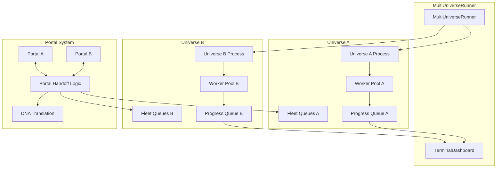
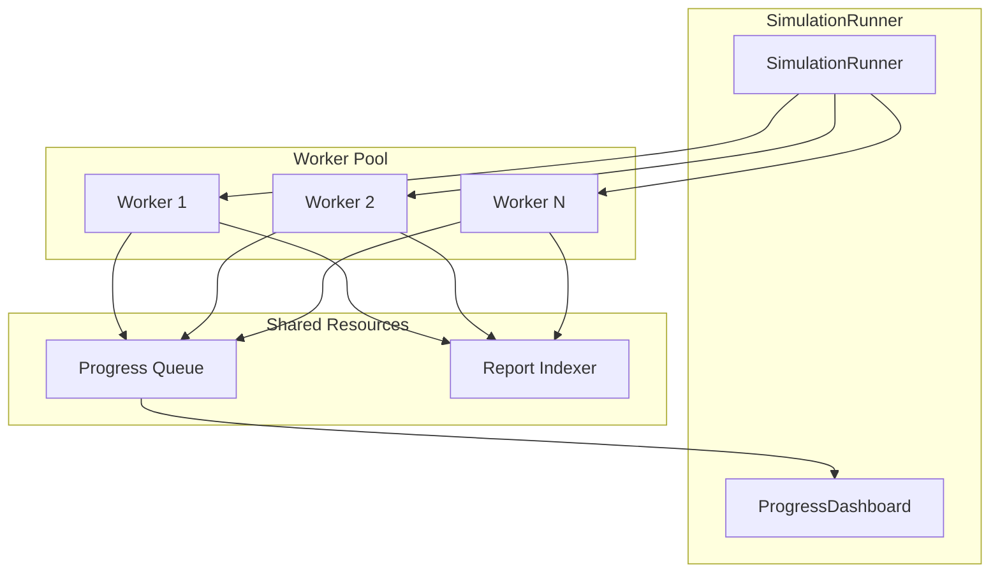

# Single-Universe vs Multi-Universe Architecture Analysis

## Executive Summary

**Recommendation: Simplify to a Single-Universe Engine**

After analyzing the current multi-universe architecture, I recommend simplifying to a single-universe engine. The multi-universe/portal system adds significant complexity with limited practical value for the current use case, and the core simulation capabilities (batch processing, parallel execution) can be preserved without the portal infrastructure.

---

## Current Architecture Overview

### Multi-Universe Components

The current architecture consists of several interconnected systems:

1. **[`MultiUniverseRunner`](src/engine/multi_universe_runner.py:87)** - Orchestrates parallel execution of different universes on designated CPU cores
2. **[`SimulationRunner`](src/engine/simulation_runner.py:1)** - Single-universe batch simulation runner
3. **[`SimulationWorker`](src/engine/runner/simulation_worker.py:29)** - Worker process for running individual campaigns
4. **Portal System** - Cross-universe fleet traversal and handoff mechanism
5. **Universe Registry** - Multiple universes: `void_alpha`, `void_beta`, `void_reckoning`, `cosmic_ascendancy`, `procedural_sandbox`

### Portal System Complexity

The portal system involves:
- Portal configuration schema ([`portal_config_schema.json`](universes/base/portal_config_schema.json:1))
- Portal nodes in topology graph ([`PortalNode`](src/core/simulation_topology.py))
- Fleet portal traversal logic ([`test_fleet_portal_traversal.py`](tests/test_fleet_portal_traversal.py:1))
- Cross-universe handoff mechanism ([`handle_portal_handoff`](src/engine/multi_universe_runner.py:730))
- DNA translation between universes ([`UniverseDataManager.rehydrate_for_universe`](src/engine/multi_universe_runner.py:855))
- Bidirectional portal linking ([`_attempt_portal_linking`](src/engine/multi_universe_runner.py:694))
- Multiple test files: `test_fleet_portal_traversal.py`, `test_portal_handoff.py`, `test_portal_integration_real.py`, `test_portal_system.py`, `test_portal_topology.py`

---

## Trade-Off Analysis

### 1. Development Complexity

| Aspect | Multi-Universe | Single-Universe |
|--------|---------------|----------------|
| **Code Complexity** | ~906 lines in [`multi_universe_runner.py`](src/engine/multi_universe_runner.py:1) + portal infrastructure | Simplified to ~221 lines in [`simulation_runner.py`](src/engine/simulation_runner.py:1) |
| **Configuration** | Multiple universe configs + portal configs + multi-universe config | Single universe config |
| **Testing Surface** | 5+ portal test files + multi-universe tests | Core simulation tests only |
| **Debugging** | Cross-process communication issues, race conditions in handoffs | Standard multiprocessing debugging |
| **Onboarding** | Complex: requires understanding universes, portals, handoffs, DNA translation | Straightforward: single simulation context |

**Complexity Reduction Estimate:** ~40-50% reduction in engine code complexity by removing multi-universe/portal infrastructure.

### 2. Performance Implications

#### Batch Processing
Both approaches support batch processing, but implementation differs:

**Multi-Universe:**
- Each universe runs in its own process pool
- CPU affinity can isolate universes to specific cores
- More complex resource allocation
- Overhead from inter-process communication for portals

**Single-Universe:**
- Single process pool for all simulations
- Simpler worker management
- No IPC overhead
- Can still utilize all available cores

**Verdict:** Single-universe may actually be **faster** due to reduced IPC overhead and simpler scheduling.

#### Parallel Execution
Both approaches support parallel execution via multiprocessing:

```python
# Current: Multi-universe with NoDaemonPool
pool = NoDaemonPool(processes=len(self.universe_configs))

# Simplified: Single-universe standard Pool
pool = multiprocessing.Pool(processes=workers)
```

The [`NoDaemonPool`](src/engine/multi_universe_runner.py:58) exists specifically to allow nested multiprocessing (universe processes spawning worker processes). This complexity disappears in single-universe mode.

**Verdict:** No performance loss; potential improvement from simpler process management.

### 3. Future Extensibility

#### Adding Portals Later

**Difficulty:** Moderate

If portals are needed in the future, the architecture can be extended:

1. **Preserve the universe abstraction** - Keep `universe_name` as a parameter
2. **Preserve `UniverseDataManager`** - Already handles universe-specific data loading
3. **Add portal system as optional module** - Design as plugin/extension

**Key preserved components:**
- [`GameConfig`](src/core/game_config.py:8) - Already supports universe selection
- [`UniverseLoader`](universes/base/universe_loader.py) - Universe discovery and loading
- [`UniverseDataManager`](src/core/universe_data.py) - Universe-specific data management

**Re-implementation effort:** ~2-3 weeks to add portal system back (vs. 0 weeks if never needed)

### 4. Functionality Lost by Removing Portals

| Functionality | Impact | Workaround |
|--------------|--------|------------|
| **Cross-universe fleet traversal** | High (if this is a core feature) | N/A - this is the primary feature being removed |
| **Multi-universe comparison reports** | Medium | Run separate single-universe batches and compare manually |
| **CPU affinity per universe** | Low | OS-level process affinity or just let scheduler handle it |
| **Cross-universe events** | Low | Not currently implemented (`cross_universe_events` flag exists but unused) |
| **DNA translation between universes** | Low | Only needed for portals |

### 5. What Single-Universe Engine Retains

All core simulation capabilities remain:

✅ **Batch Processing** - Run hundreds of simulations in parallel
✅ **Parallel Execution** - Full CPU utilization via multiprocessing
✅ **Campaign Simulation** - Complete campaign mechanics
✅ **Fleet Management** - All fleet operations (except portal traversal)
✅ **Economy System** - Full economic simulation
✅ **Combat System** - Complete combat mechanics
✅ **Diplomacy** - Faction interactions
✅ **Reporting** - Telemetry, indexing, CSV exports
✅ **Dashboard** - Live simulation monitoring
✅ **Universe Switching** - Can still switch between universes (just not simultaneously)

---

## Recommended Changes for Simplification

### Phase 1: Core Engine Simplification

#### 1.1 Deprecate `MultiUniverseRunner`
- Archive [`multi_universe_runner.py`](src/engine/multi_universe_runner.py:1) to `src/engine/deprecated/`
- Keep as reference for future re-implementation if needed

#### 1.2 Enhance `SimulationRunner`
- Make [`simulation_runner.py`](src/engine/simulation_runner.py:1) the primary entry point
- Add optional universe parameter (already exists)
- Remove any portal-related code paths from [`SimulationWorker`](src/engine/runner/simulation_worker.py:29)

#### 1.3 Remove Portal Infrastructure
- Delete or archive portal-related test files:
  - `test_fleet_portal_traversal.py`
  - `test_portal_handoff.py`
  - `test_portal_integration_real.py`
  - `test_portal_system.py`
  - `test_portal_topology.py`
- Remove [`PortalNode`](src/core/simulation_topology.py) from topology
- Remove portal generation from [`GalaxyGenerator`](src/managers/galaxy_generator.py)

#### 1.4 Simplify Configuration
- Keep single-universe config structure
- Remove `mode: "multi"` from config schema
- Remove portal config schema
- Archive [`MULTI_UNIVERSE_CONFIG.md`](docs/MULTI_UNIVERSE_CONFIG.md)

### Phase 2: Preserve Key Abstractions

#### 2.1 Keep Universe System
- **Why:** Allows switching between different game universes (e.g., void_reckoning vs void_beta)
- **How:** Preserve [`UniverseLoader`](universes/base/universe_loader.py), [`GameConfig.universe`](src/core/game_config.py:8), universe directory structure

#### 2.2 Keep `UniverseDataManager`
- **Why:** Handles universe-specific data loading; useful even for single-universe
- **How:** No changes needed; it's already decoupled from multi-universe logic

#### 2.3 Keep `FleetQueueManager`
- **Why:** May be useful for other fleet injection/removal scenarios
- **How:** Remove portal-specific usage but keep the infrastructure

### Phase 3: Code Cleanup

#### 3.1 Remove Portal References
- Search for "portal" in codebase and remove unused code
- Remove `enable_portals` flags
- Remove `portal_dest_universe` metadata
- Remove `PORTAL_HANDOFF` event handling

#### 3.2 Update Documentation
- Update architecture docs to reflect single-universe focus
- Update API docs to remove multi-universe examples
- Create migration guide for anyone using multi-universe features

---

## Architecture Diagrams

### Current Multi-Universe Architecture



### Proposed Single-Universe Architecture



---

## Implementation Plan

### Immediate Actions (Week 1)

1. **Create feature branch** for simplification
2. **Archive portal test files** - Move to `tests/deprecated/`
3. **Remove portal code** from [`GalaxyGenerator`](src/managers/galaxy_generator.py)
4. **Remove portal code** from [`simulation_topology.py`](src/core/simulation_topology.py)
5. **Update [`SimulationWorker`](src/engine/runner/simulation_worker.py:29)** - Remove portal handoff logic
6. **Run test suite** - Identify and fix broken tests

### Medium Actions (Week 2)

1. **Archive [`MultiUniverseRunner`](src/engine/multi_universe_runner.py:1)**
2. **Update [`simulation_runner.py`](src/engine/simulation_runner.py:1)** - Add any missing features from MUR
3. **Remove portal config schemas**
4. **Update documentation**
5. **Performance testing** - Compare before/after metrics

### Long-term Actions (Optional)

1. **Create migration guide** for future portal re-implementation
2. **Design plugin architecture** for optional portal module
3. **Benchmark single vs multi** for definitive performance data

---

## Risk Assessment

| Risk | Likelihood | Impact | Mitigation |
|------|------------|--------|------------|
| **Loss of critical functionality** | Low | High | Confirm with stakeholders that portals aren't needed |
| **Performance regression** | Low | Medium | Benchmark before/after; optimize if needed |
| **Future need for portals** | Medium | Medium | Archive code; design for future extensibility |
| **Breaking existing workflows** | Low | Medium | Provide migration guide; support transition period |

---

## Conclusion

### Summary of Findings

1. **Complexity:** The multi-universe/portal system adds ~40-50% code complexity with limited practical benefit
2. **Performance:** Single-universe may actually be faster due to reduced IPC overhead
3. **Extensibility:** Portals can be added later (~2-3 weeks) if needed
4. **Functionality:** Core simulation capabilities (batch, parallel) are fully preserved

### Final Recommendation

**Proceed with simplification to single-universe engine.** The benefits significantly outweigh the costs:

- **Faster development** - Less code to maintain and debug
- **Simpler architecture** - Easier onboarding and understanding
- **Better performance** - Reduced overhead, simpler scheduling
- **Preserved capabilities** - All core simulation features remain
- **Future-proof** - Key abstractions preserved for potential re-implementation

### Next Steps

1. Confirm with stakeholders that portal functionality is not required
2. Create implementation branch
3. Execute phased simplification plan
4. Validate with comprehensive testing
5. Update documentation and provide migration guide

---

## Appendix: Code References

### Key Files to Modify/Archive

| File | Action | Notes |
|------|--------|-------|
| [`src/engine/multi_universe_runner.py`](src/engine/multi_universe_runner.py:1) | Archive | 906 lines, complex orchestration |
| [`tests/test_fleet_portal_traversal.py`](tests/test_fleet_portal_traversal.py:1) | Delete | Portal traversal tests |
| [`tests/test_portal_handoff.py`](tests/test_portal_handoff.py:1) | Delete | Portal handoff tests |
| [`tests/test_portal_integration_real.py`](tests/test_portal_integration_real.py:1) | Delete | Integration tests |
| [`tests/test_portal_system.py`](tests/test_portal_system.py:1) | Delete | Portal system tests |
| [`tests/test_portal_topology.py`](tests/test_portal_topology.py:1) | Delete | Portal topology tests |
| [`universes/base/portal_config_schema.json`](universes/base/portal_config_schema.json:1) | Delete | Portal config schema |
| [`docs/MULTI_UNIVERSE_CONFIG.md`](docs/MULTI_UNIVERSE_CONFIG.md:1) | Archive | Documentation |
| [`src/engine/simulation_runner.py`](src/engine/simulation_runner.py:1) | Enhance | Make primary entry point |
| [`src/engine/runner/simulation_worker.py`](src/engine/runner/simulation_worker.py:29) | Clean | Remove portal logic |

### Key Files to Preserve

| File | Reason |
|------|--------|
| [`src/core/game_config.py`](src/core/game_config.py:8) | Universe selection, config management |
| [`universes/base/universe_loader.py`](universes/base/universe_loader.py) | Universe discovery and loading |
| [`src/core/universe_data.py`](src/core/universe_data.py) | Universe-specific data management |
| [`src/managers/campaign_manager.py`](src/managers/campaign_manager.py) | Core simulation engine |
| [`src/engine/runner/simulation_worker.py`](src/engine/runner/simulation_worker.py:29) | Worker process (cleaned) |
| [`src/engine/simulation_runner.py`](src/engine/simulation_runner.py:1) | Primary entry point |

---

*Analysis completed: 2025-02-01*
*Architectural Recommendation: Simplify to Single-Universe Engine*
