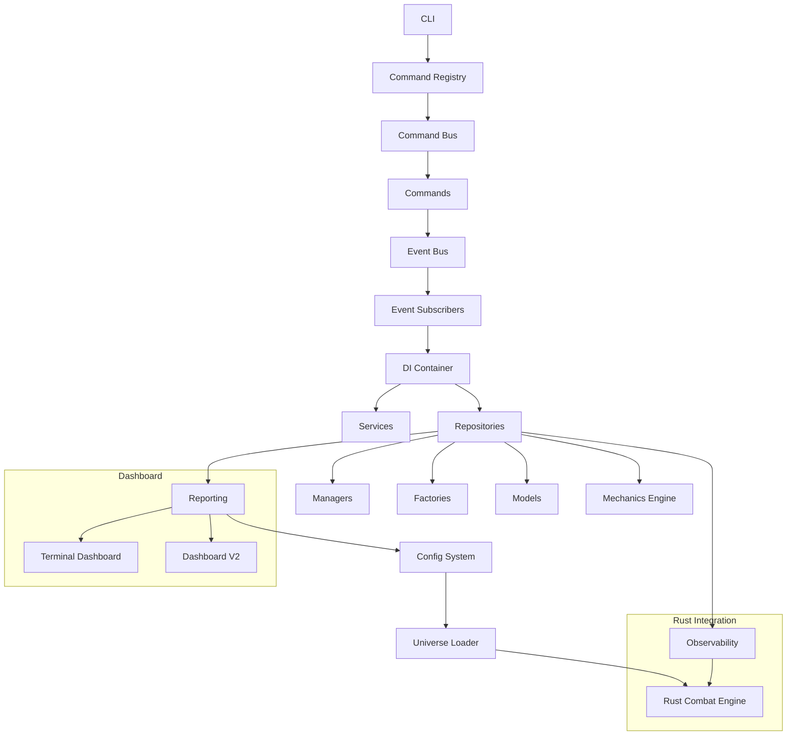

# Architecture Overview

The Multi-Universe Strategy Engine is a sophisticated grand strategy simulator with a modular, event-driven architecture supporting multiple game universes.

## Core Architecture

### Design Philosophy

The engine follows these key architectural principles:

- **Multi-Universe Architecture**: Core engine remains universe-agnostic while universe-specific assets, rules, and AI behaviors are loaded dynamically
- **Event-Driven Design**: Central event bus enables loose coupling between systems
- **Command Pattern**: Actions are encapsulated as commands with undo/redo support
- **Dependency Injection**: Services and managers are injected via DI container
- **Repository Pattern**: Data access layer provides clean separation of concerns
- **Factory Pattern**: Consistent object creation via factories

### System Diagram



## Core Systems

### Event Bus

Central event dispatcher for loose coupling between systems.

**File**: [`src/events/event_bus.py`](src/events/event_bus.py:1)

**Usage**:
```python
from src.events.event_bus import EventBus

# Get singleton
event_bus = EventBus.get_instance()

# Subscribe to events
def handle_combat(event):
    pass

# Publish events
event_bus.publish("combat_started", {"faction": "Templars"})
```

### Command Pattern

Action system with command bus for undo/redo and audit trails.

**Files**:
- [`src/commands/command_bus.py`](src/commands/command_bus.py:1)
- [`src/commands/attack_command.py`](src/commands/attack_command.py:1)
- [`src/commands/build_command.py`](src/commands/build_command.py:1)
- [`src/commands/move_fleet_command.py`](src/commands/move_fleet_command.py:1)

### Dependency Injection

Services and managers are injected via DI container.

**Files**:
- [`src/core/di_container.py`](src/core/di_container.py:1)
- [`src/core/service_locator.py`](src/core/service_locator.py:1)

### Repository Pattern

Data access layer for clean separation of concerns.

**Files**:
- [`src/repositories/base_repository.py`](src/repositories/base_repository.py:1)
- [`src/repositories/faction_repository.py`](src/repositories/faction_repository.py:1)
- [`src/repositories/fleet_repository.py`](src/repositories/fleet_repository.py:1)
- [`src/repositories/planet_repository.py`](src/repositories/planet_repository.py:1)
- [`src/repositories/system_repository.py`](src/repositories/system_repository.py:1)
- [`src/repositories/unit_repository.py`](src/repositories/unit_repository.py:1)

### Factory Pattern

Consistent object creation via factories.

**Files**:
- [`src/factories/unit_factory.py`](src/factories/unit_factory.py:1)
- [`src/factories/weapon_factory.py`](src/factories/weapon_factory.py:1)
- [`src/factories/tech_factory.py`](src/factories/tech_factory.py:1)
- [`src/factories/design_factory.py`](src/factories/design_factory.py:1)
- [`src/factories/hull_mutation_factory.py`](src/factories/hull_mutation_factory.py:1)
- [`src/factories/land_factory.py`](src/factories/land_factory.py:1)

### Mechanics Engine

Pluggable faction-specific mechanics system.

**Files**:
- [`src/mechanics/faction_mechanics_engine.py`](src/mechanics/faction_mechanics_engine.py:1)
- [`src/mechanics/mechanics_loader.py`](src/mechanics/mechanics_loader.py:1)

### Observability System

Causal tracing, replay analysis, and snapshot management for debugging complex interactions.

**Files**:
- [`src/observability/causal_tracer.py`](src/observability/causal_tracer.py:1)
- [`src/observability/replay_analyzer.py`](src/observability/replay_analyzer.py:1)
- [`src/observability/snapshot_manager.py`](src/observability/snapshot_manager.py:1)
- [`src/observability/replay_engine.py`](src/observability/replay_engine.py:1)
- [`src/observability/graph_store.py`](src/observability/graph_store.py:1)

## AI System

Modular AI architecture with strategic planner, theater manager, and coordinators.

**Files**:
- [`src/ai/strategic_planner.py`](src/ai/strategic_planner.py:1)
- [`src/ai/theater_manager.py`](src/ai/theater_manager.py:1)
- [`src/ai/economic_engine.py`](src/ai/economic_engine.py:1)
- [`src/ai/coordinators/intelligence_coordinator.py`](src/ai/coordinators/intelligence_coordinator.py:1)
- [`src/ai/coordinators/personality_manager.py`](src/ai/coordinators/personality_manager.py:1)
- [`src/ai/coordinators/tech_doctrine_manager.py`](src/ai/coordinators/tech_doctrine_manager.py:1)

### Dashboard Systems

Terminal dashboard and Dashboard v2 (FastAPI + WebSocket).

**Files**:
- [`src/reporting/terminal/`](src/reporting/terminal/)
- [`src/reporting/dashboard_v2/`](src/reporting/dashboard_v2/)

## Technology Stack

- **Language**: Python 3.8+
- **Rust**: Native combat engine via PyO3
- **Web Framework**: FastAPI for Dashboard v2
- **Testing**: pytest
- **GPU**: CuPy with CUDA support
- **Database**: SQLite for persistence

## Design Patterns Used

1. **Singleton**: EventBus, ServiceLocator, DIContainer
2. **Observer/Subscriber**: Event subscribers
3. **Strategy**: AI strategies
4. **Factory**: Object creation
5. **Repository**: Data access abstraction
6. **Command**: Action encapsulation
7. **Dependency Injection**: Service locator

## Data Flow

1. **Universe Loading**: [`UniverseLoader`](universes/base/universe_loader.py:1) loads universe configuration
2. **Initialization**: [`CampaignOrchestrator`](src/managers/campaign/orchestrator.py:1) coordinates managers
3. **Event Processing**: [`EventBus`](src/events/event_bus.py:1) dispatches events to subscribers
4. **Command Execution**: [`CommandBus`](src/commands/command_bus.py:1) executes actions
5. **Simulation**: [`TurnProcessor`](src/managers/turn_processor.py:1) processes game turns

## Key Files Reference

| System | Key Files |
|---------|-----------|
| **CLI** | [`src/cli/main.py`](src/cli/main.py:1) |
| **Commands** | [`src/cli/commands/`](src/cli/commands/) |
| **Managers** | [`src/managers/`](src/managers/) |
| **Combat** | [`src/combat/`](src/combat/) |
| **Core** | [`src/core/`](src/core/) |
| **Events** | [`src/events/`](src/events/) |
| **Factories** | [`src/factories/`](src/factories/) |
| **Mechanics** | [`src/mechanics/`](src/mechanics/) |
| **Observability** | [`src/observability/`](src/observability/) |
| **Reporting** | [`src/reporting/`](src/reporting/) |
| **Repositories** | [`src/repositories/`](src/repositories/) |
| **Services** | [`src/services/`](src/services/) |
| **Models** | [`src/models/`](src/models/) |
| **AI** | [`src/ai/`](src/ai/) |
