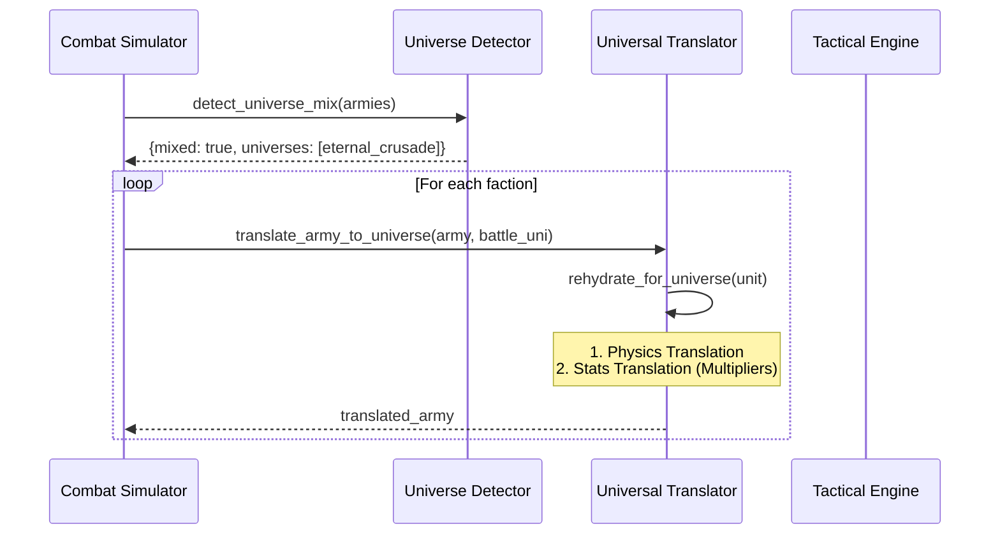

# Cross-Universe Combat System

> **Note:** This guide describes a cross-universe combat system for future expansion. The simulator currently focuses on the **eternal_crusade** universe, with cross-universe capabilities available for future development when additional universes are added.

## Overview

The Cross-Universe Combat System enables mixed-faction battles where factions from different universes can engage each other in a unified tactical simulation.

Because different universes use different stat scales, the system uses a **Universal Translator** to normalize stats before combat.

## Key Components

1. **Universal Translator**: A two-layer system (Physics + Stats) that normalizes foreign units to host universe's reality.
2. **Portals & Anchors**: Mechanisms for traversing universes and modifying local laws of physics.
3. **Memory Profiler**: Tracks heavy cost of maintaining multiple reality states.
4. **Validator**: Ensures bidirectional translation symmetry.

## The Universal Translator Paradigm

The system uses a **Two-Layer Translation System** to ensure fair combat between vastly different power scales.

### Layer 1: Physics Translation

This layer handles the fundamental "reality" of objects using `PhysicsProfile`.

1. **Denormalization**: `source_physics.inverse_apply()` removes the source universe's physics bias.
2. **Normalization**: `target_physics.apply_to_signature(denormalized)` applies the target universe's physics.

**Example**: An Eternal Crusade unit (High Aether) entering a custom universe (Low Aether).

* **Source (EC)**: Aether 20 / 1.0 = 20
* **Target (Custom)**: Aether 20 × 0.5 = 10
* **Result**: Aether-based powers reduced by 50%.

### Layer 2: Universal Stats Translation

This layer scales specific combat metrics using the Translation Table (`universes/base/translation_table.json`).

**Sample Multipliers (Future Expansion):**

| Source → Target | Hull Integrity | Shield Absorption | Weapon Energy | Mobility Speed |
| :--- | :--- | :--- | :--- | :--- |
| **EC → Custom** | 1.2× | 0.9× | 1.1× | 0.95× |

> **Note**: Forward and reverse multipliers are reciprocal ($A \to B \times B \to A \approx 1.0$) to ensure balance.

## Combat Flow Diagram



## Portals and Reality Anchors

### Portal System

Fleets traverse universes via **Portals** defined in `portal_config.json`.

* **Structure**:
  * `portal_id`: Unique ID (e.g., "ec_expansion_link").
  * `dest_universe`: Target universe name.
  * `dest_coords`: [x, y] coordinates in destination.
  * **Mechanics**:
    * `portal_discovery_turn`: When portals become active.
    * `portal_transit_cost`: Resource cost to jump.
    * `require_portal_control`: Must own system to use it.

### Reality Anchors

**Reality Anchors** (`src/core/reality_anchor.py`) create zones that enforce specific physical laws, overriding the host universe.

| Anchor Type | Aether | Energy | Volatility | Effect |
| :--- | :--- | :--- | :--- | :--- |
| **Null Zone** | 0.0× | 1.0× | 0.5× | Suppresses aetheric powers. |
| **Phase Rift** | 2.0× | 1.5× | 3.0× | Amplifies aetheric volatility. |
| **Reality Stabilizer** | 1.0× | 1.0× | 0.3× | Base reality for fleet operations. |
| **Nebula** | 1.0× | 0.7× | 1.2× | Reduces energy range/damage. |

## Configuration and CLI

### CLI Usage (Future Expansion)

**Cross-Universe Duel**:

```bash
python run.py cross-universe-duel --unit1 eternal_crusade:Zealot_Legions:Zealot_Infantry --unit2 eternal_crusade:Iron_Vanguard:Iron_Legionary
```

**Fleet Battles**:

```bash
python run.py cross-universe-battle --config config/cross_universe_battle_config.json
```

### Battle Configuration JSON

`config/cross_universe_battle_config.json` example:

```json
{
  "mode": "cross-universe-duel",
  "faction1": {"name": "Zealot_Legions", "universe": "eternal_crusade", "unit": "Zealot_Infantry"},
  "faction2": {"name": "Iron_Vanguard", "universe": "eternal_crusade", "unit": "Iron_Legionary"},
  "battle_universe": "eternal_crusade",
  "profile_memory": true,
  "enable_tech_theft": true
}
```

## Memory Profiling

The `MemoryProfiler` (`src/utils/memory_profiler.py`) tracks the heavy cost of maintaining multiple reality states. Use `--profile-memory` to generate reports.

**Report Stages**:

1. **Start**: Baseline memory.
2. **Before Translation**: Memory after loading units but before scaling.
3. **After Translation**: Memory after creating translated unit copies (Expect ~2x spike).
4. **After Combat**: Peak memory during simulation.

## Validation

Ensure your translation tables are valid:

```bash
python run.py validate --universe all --verbose
```

* **TranslationValidator**: Checks reciprocity and sanity bounds (0.1 - 10.0).
* **CrossUniverseValidator**: Checks mapping completeness.
