# Game Loop Documentation

This document describes the complete game loop flow for the Multi-Universe Strategy Engine.

## Overview

The game loop is orchestrated by the [`TurnProcessor`](../src/managers/turn_processor.py:11) class, which manages sequential execution of game turns including global phases, faction turns, and end-of-turn processing.

## Complete Game Loop Flow

```mermaid
graph TB
    Start[Game Start] --> Init[Campaign Initialization]
    Init --> GalaxyGen[Galaxy Generation]
    GalaxyGen --> LoadAssets[Load Blueprints & Assets]
    LoadAssets --> Turn0[Turn 0 Start]
    
    Turn0 --> GlobalPhase[Global Phase]
    
    GlobalPhase --> Cleanup[Prune Empty Armies]
    Cleanup --> FleetConsolidate[Fleet Consolidation]
    FleetConsolidate --> ClearCaches[Clear Turn Caches]
    ClearCaches --> RebuildIndices[Rebuild Planet Indices]
    RebuildIndices --> ResetFleetFlags[Reset Fleet Arrival Flags]
    ResetFleetFlags --> ResetFactionStats[Reset Per-Faction Stats]
    ResetFactionStats --> ResetBattleCounter[Reset Battle Counter]
    ResetBattleCounter --> PrepareReports[Prepare Turn Reports]
    PrepareReports --> LogTurnStart[Log Turn Start Event]
    LogTurnStart --> UpdateStorms[Update Warp Storms]
    UpdateStorms --> SanitizeCombat[Sanitize Combat State]
    SanitizeCombat --> GlobalDiplomacy[Global Diplomacy]
    
    GlobalDiplomacy --> FactionLoopStart[Start Faction Loop]
    
    FactionLoopStart --> PreCalcEcon[Pre-Calculate Economics]
    PreCalcEcon --> PreCalcStrat[Pre-Calculate Strategy]
    PreCalcStrat --> FactionLoop{For Each Faction}
    
    FactionLoop --> FactionTurnStart[Faction Turn Start]
    FactionTurnStart --> UpdateVisibility[Update Visibility / Fog of War]
    UpdateVisibility --> RegenerateUnits[Regenerate Units]
    RegenerateUnits --> FactionStrategy[Process Faction Strategy]
    FactionStrategy --> MechanicsEconHook[Mechanics Hook: Economy Phase]
    MechanicsEconHook --> FactionEconomy[Process Faction Economy]
    FactionEconomy --> FleetOrders[Fleet Orders & Movement]
    FleetOrders --> FleetMove{Fleet Movement?}
    
    FleetMove -->|Yes| UpdateMovement[Update Fleet Movement]
    FleetMove -->|No| StarbaseConstruction
    
    UpdateMovement --> Arrival{Fleet Arrived?}
    Arrival -->|Yes| LogArrival[Log Arrival]
    LogArrival --> UpdateVisArrival[Update Visibility]
    UpdateVisArrival --> ResolveSpaceBattles[Resolve Space Battles]
    ResolveSpaceBattles --> ProcessInvasions[Process Invasions]
    ProcessInvasions --> StarbaseConstruction[Starbase Construction Progress]
    Arrival -->|No| StarbaseConstruction
    
    StarbaseConstruction --> MechanicsEndHook[Mechanics Hook: Turn End]
    MechanicsEndHook --> Reinforcements[Army Cleanup & Reinforcements]
    Reinforcements --> FactionLoop
    
    FactionLoop -->|All Factions Complete| EconTotal[Calculate Economy Total Time]
    EconTotal --> PeriodicTelemetry{Turn % 10?}
    
    PeriodicTelemetry -->|Yes| LogSystemTelemetry[Log System Telemetry]
    LogSystemTelemetry --> LogTechProgress[Log Tech Progress]
    LogTechProgress --> LogErrorPatterns[Log Error Patterns]
    LogErrorPatterns --> LifecycleMetrics[Lifecycle Metrics]
    LifecycleMetrics --> FlushTelemetry[Flush Telemetry]
    PeriodicTelemetry -->|No| ProductionAdvancement
    
    FlushTelemetry --> ProductionAdvancement[Production Advancement]
    ProductionAdvancement --> PlanetQueue[Process Planet Queues]
    PlanetQueue --> StarbaseQueue[Process Starbase Queues]
    StarbaseQueue --> LogTurnEnd[Log Turn End]
    
    LogTurnEnd --> EndOfTurnCombat[End-of-Turn Combat]
    EndOfTurnCombat --> ProcessActiveBattles[Process Active Battles]
    ProcessActiveBattles --> ResolveGroundWar[Resolve Ground War]
    ResolveGroundWar --> CleanupDestroyed[Cleanup Destroyed Fleets]
    CleanupDestroyed --> CollectStats[Collect Statistics]
    CollectStats --> FlushAnalytics{History >= 100?}
    
    FlushAnalytics -->|Yes| WriteAnalytics[Write Analytics to Disk]
    WriteAnalytics --> NarrativePoints[Detect Narrative Turning Points]
    FlushAnalytics -->|No| NarrativePoints
    
    NarrativePoints --> FinalizeReports[Finalize Turn Reports]
    FinalizeReports --> PerformanceLog{Turn % Interval?}
    
    PerformanceLog -->|Yes| LogPerformance[Log Performance Metrics]
    LogPerformance --> VictoryCheck[Check Victory Conditions]
    PerformanceLog -->|No| VictoryCheck
    
    VictoryCheck --> Victory{Winner Decided?}
    Victory -->|Yes| GameEnd[Game End]
    Victory -->|No| IncrementTurn[Increment Turn Counter]
    IncrementTurn --> GlobalPhase
```

## Turn Phases Breakdown

### 1. Global Phase

The global phase executes once per turn before any faction turns:

| Step | Description | Component |
|-------|-------------|------------|
| Prune Empty Armies | Remove empty army groups to save memory | [`CampaignEngine.prune_empty_armies()`](../src/managers/campaign_manager.py) |
| Fleet Consolidation | Merge idle fleets in same system to form battle groups | [`FleetManager.consolidate_fleets()`](../src/managers/fleet_manager.py) |
| Clear Turn Caches | Clear all turn-based caches consistently | [`CampaignEngine.clear_turn_caches()`](../src/managers/campaign_manager.py:204) |
| Rebuild Planet Indices | Rebuild planets_by_faction index | [`CampaignEngine.rebuild_planet_indices()`](../src/managers/campaign_manager.py:485) |
| Reset Fleet Flags | Reset arrival flags for all fleets | [`Fleet.reset_turn_flags()`](../src/models/fleet.py) |
| Reset Faction Stats | Reset per-turn statistics for all factions | [`Faction.reset_turn_stats()`](../src/models/faction.py) |
| Prepare Turn Reports | Prepare turn folder for reporting | [`ReportOrganizer.prepare_turn_folder()`](../src/reporting/organizer.py) |
| Log Turn Start | Log turn_start telemetry event | [`TelemetryCollector.log_event()`](../src/reporting/telemetry.py) |
| Update Warp Storms | Update storm positions and effects | [`WarpStormManager.update_storms()`](../src/managers/weather_manager.py) |
| Sanitize Combat State | Prevent stale combat state | [`BattleManager.sanitize_state()`](../src/managers/battle_manager.py) |
| Global Diplomacy | Process diplomatic events | [`DiplomacyManager.process_turn()`](../src/managers/diplomacy_manager.py) |

### 2. Faction Turn Loop

Each faction processes its turn sequentially:

#### 2.1 Faction Turn Start

| Step | Description |
|-------|-------------|
| Mechanics Hook: Turn Start | Execute faction-specific turn start mechanics |
| Update Visibility | Update Fog of War for the faction |
| Regenerate Units | Apply faction-specific unit regeneration |

#### 2.2 Strategy & Economy

| Step | Description | Component |
|-------|-------------|------------|
| Process Faction Strategy | Execute strategic AI decisions | [`StrategicAI.process_faction_strategy()`](../src/managers/ai_manager.py) |
| Mechanics Hook: Economy Phase | Execute faction-specific economy mechanics |
| Process Faction Economy | Calculate income, expenses, and handle insolvency | [`EconomyManager.process_faction_economy()`](../src/managers/economy_manager.py) |

#### 2.3 Fleet Orders & Movement

| Step | Description | Component |
|-------|-------------|------------|
| Fleet Orders | Process orders for idle fleets | [`Fleet.update_movement()`](../src/models/fleet.py) |
| Update Visibility | Update visibility upon fleet arrival | [`IntelligenceManager.update_faction_visibility()`](../src/managers/intelligence_manager.py) |
| Resolve Space Battles | Resolve battles at fleet location | [`BattleManager.resolve_battles_at()`](../src/managers/battle_manager.py) |
| Process Invasions | Handle planet invasions | [`BattleManager.process_invasions()`](../src/managers/battle_manager.py) |

#### 2.4 Construction

| Step | Description | Component |
|-------|-------------|------------|
| Starbase Construction | Process starbase construction queues | [`ConstructionService.process_starbase_queues()`](../src/services/construction_service.py) |

#### 2.5 Faction Turn End

| Step | Description | Component |
|-------|-------------|------------|
| Mechanics Hook: Turn End | Execute faction-specific turn end mechanics |
| Army Cleanup | Clean up destroyed armies and handle reinforcements | [`Strategy.process_reinforcements()`](../src/ai/strategies/standard.py) |

### 3. End-of-Turn Phase

Executed after all faction turns complete:

| Step | Description | Component |
|-------|-------------|------------|
| Production Advancement | Process planet and starbase production queues | [`Planet.process_queue()`](../src/models/planet.py) |
| End-of-Turn Combat | Resolve persistent battles and ground wars | [`BattleManager.process_active_battles()`](../src/managers/battle_manager.py) |
| Cleanup Destroyed Fleets | Remove destroyed fleets from game state | [`CampaignEngine.unregister_fleet()`](../src/managers/campaign_manager.py) |
| Collect Statistics | Collect turn statistics for all factions | [`TurnProcessor.flush_analytics()`](../src/managers/turn_processor.py:204) |
| Flush Analytics | Write buffered stats to disk (every 100 turns) | [`TurnProcessor.flush_analytics()`](../src/managers/turn_processor.py:204) |
| Narrative Turning Points | Detect and log narrative events | [`CampaignEngine.detect_narrative_turning_points()`](../src/managers/campaign_manager.py) |
| Finalize Reports | Finalize turn reports | [`FactionReporter.finalize_turn()`](../src/reporting/faction_reporter.py) |
| Performance Logging | Log performance metrics (at interval) | [`CampaignEngine.log_performance_metrics()`](../src/managers/campaign_manager.py:160) |
| Victory Check | Check if victory conditions are met | [`CampaignEngine.check_victory_conditions()`](../src/managers/campaign_manager.py) |

## Periodic Operations

Certain operations occur at specific turn intervals:

| Interval | Operation | Description |
|-----------|-------------|-------------|
| Every 10 turns | Telemetry Flush | Flush telemetry events to disk |
| Every 10 turns | Tech Progress | Log technology tree progress for all factions |
| Every 10 turns | Error Logging | Log error patterns for diagnostics |
| Every 20 turns | Doctrine Effectiveness | Log doctrine effectiveness metrics |
| Every 15 turns (lookback) | Tech ROI | Analyze technology return on investment |
| Every 100 turns | Analytics Flush | Write analytics statistics to disk |
| Performance Interval | Performance Logging | Log performance metrics (configurable) |

## Performance Tracking

The engine tracks performance metrics for optimization:

| Metric | Description |
|---------|-------------|
| Economy Phase Total | Total time spent processing economy for all factions |
| Upkeep Calculation Time | Time spent calculating upkeep costs |
| Insolvency Time | Time spent checking for insolvency |
| Units Disbanded | Count of units disbanded due to insolvency |
| Cache Statistics | Number of caches registered and cleared |

## Telemetry Events

Key telemetry events logged during the game loop:

| Event | Category | Description |
|--------|-----------|-------------|
| `turn_start` | SYSTEM | Logged at start of each turn |
| `turn_end` | SYSTEM | Logged at end of each turn |
| `campaign_started` | CAMPAIGN | Logged when campaign initializes |
| `campaign_ended` | CAMPAIGN | Logged when campaign completes |
| `galaxy_generated` | SYSTEM | Logged when galaxy is generated |
| `planet_update` | SYSTEM | Logged when planet ownership changes |
| `battle_start` | COMBAT | Logged when a battle begins |
| `battle_end` | COMBAT | Logged when a battle ends |
| `resource_production` | ECONOMY | Logged when resources are produced |
| `resource_consumption` | ECONOMY | Logged when resources are consumed |
| `tech_researched` | TECHNOLOGY | Logged when technology is researched |
| `treaty_signed` | DIPLOMACY | Logged when a treaty is signed |

## Related Components

- [`CampaignEngine`](../src/managers/campaign_manager.py:67) - Central controller for simulation
- [`TurnProcessor`](../src/managers/turn_processor.py:11) - Orchestrates turn execution
- [`BattleManager`](../src/managers/battle_manager.py) - Manages combat resolution
- [`EconomyManager`](../src/managers/economy_manager.py) - Handles economic calculations
- [`StrategicAI`](../src/managers/ai_manager.py) - AI decision making
- [`FleetManager`](../src/managers/fleet_manager.py) - Manages fleet operations
- [`TelemetryCollector`](../src/reporting/telemetry.py) - Event tracking and metrics
- [`DiplomacyManager`](../src/managers/diplomacy_manager.py) - Diplomatic relations

## See Also

- [README.md](../README.md) - Main project documentation
- [SYSTEM_ARCHITECTURE.md](SYSTEM_ARCHITECTURE.md) - System architecture overview
- [PERFORMANCE.md](PERFORMANCE.md) - Performance optimization guide
