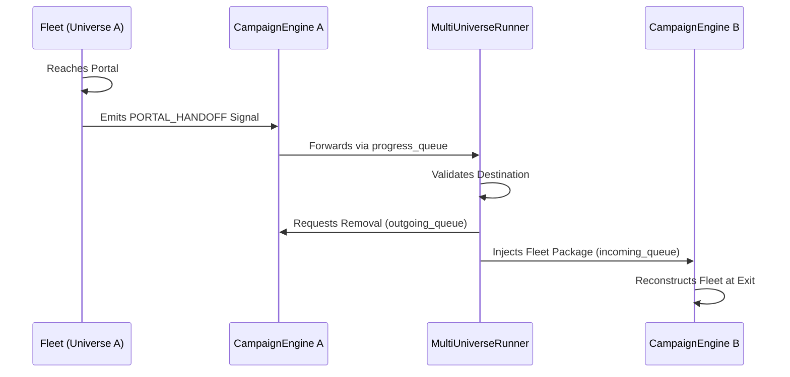

# Multi-Universe Simulation Guide

> **Note:** This guide describes the multi-universe simulation architecture for future expansion. The simulator currently focuses on the **eternal_crusade** universe, with multi-universe capabilities available for future development.

This guide details the architecture and mechanics of the Multi-Universe Simulation system, enabling cross-universe fleet travel and parallel execution.

## Architecture

The system uses a nested multiprocessing architecture:

1.  **MultiUniverseRunner (Main Process)**: Orchestrates the simulation, managing parallel pools for each universe.
2.  **Universe Process (Worker)**: Each universe runs in its own process, managing its own `CampaignEngine`.
3.  **Communication**:
    - `progress_queue`: Standard method for universes to report status (turns, errors) to the Runner.
    - `incoming_fleet_queue`: Channel for Runner to inject fleets into a universe.
    - `outgoing_fleet_queue`: Channel for Universe to confirm fleet removal to Runner.

## Portal Traversal Flow

Fleet transfer between universes follows a safe, process-synchronized hand-off protocol.



## Configuring Portals

Portals are defined in `portal_config.json` for each universe.

### Example Configuration (Future Expansion)
```json
{
  "portals": [
    {
      "id": "gate_alpha",
      "destination_universe": "eternal_crusade_expansion",
      "destination_coords": [0, 0],
      "requires_handoff": true
    }
  ]
}
```

## Current Status

The simulator currently runs in single-universe mode with **eternal_crusade** as the default and only universe. The multi-universe architecture is preserved for future expansion when additional universes are added.

## Troubleshooting

### Fleet Lost in Transit
If a fleet enters a portal but never arrives:
1. Check `multi_universe_runner.log` for `[PORTAL_HANDOFF]` errors.
2. Verify destination universe is running (if it crashes, incoming queue is lost).
3. Ensure `portal_id` matches on both sides.

### Process Issues
On Windows, `pool_worker_init` uses global variables to bind queues because complex objects cannot be pickled in `initargs` easily. If queues fail to attach, check for `PicklingError`.
