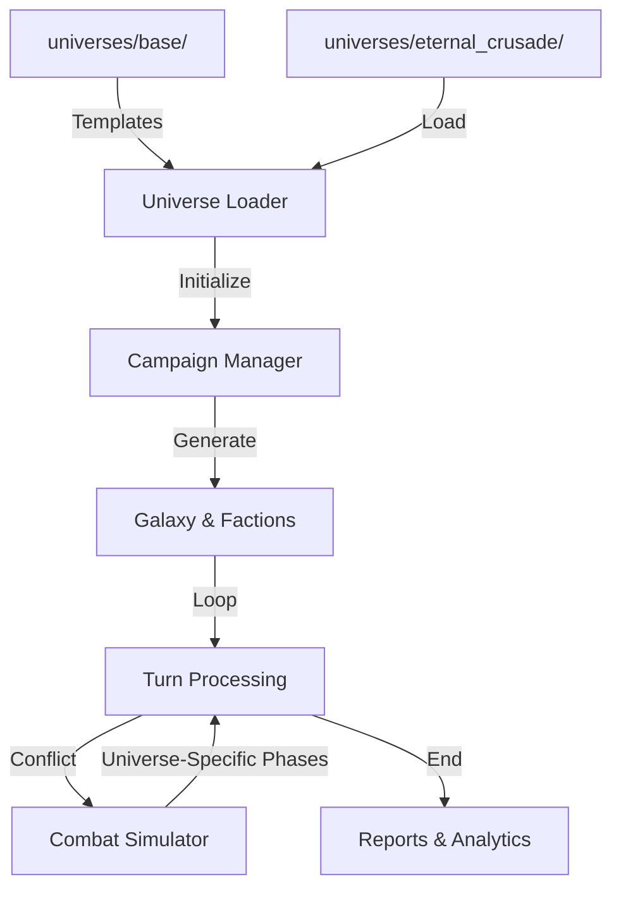

# Strategy Engine - Project Structure

This project is a modular **Grand Strategy Campaign Simulator**. It uses a "Core vs. Universe" architecture where the game engine remains agnostic while loading specific assets, rules, and AI behaviors from the `universes/` directory. The simulator currently focuses on the **eternal_crusade** universe.

## Root Directory Layout

| Path | Purpose |
|------|---------|
| `run.py` | **Main CLI Entry Point**. Mode selection. |
| `universes/` | **Content Layer**. All universe-specific data, rules, and AI. |
| `src/` | **Engine Layer**. Core simulation logic. |
| `docs/` | Comprehensive documentation, guides, and migration notes. |
| `reports/` | Organized simulation output. |
| `tools/` | Cross-universe analyzers and maintenance scripts. |

## Universe Structure (`universes/`)

Each universe is isolated within its own directory under `universes/`.

- **`universes/base/`**: Abstract base classes and configuration schemas.
- **`universes/eternal_crusade/`**: Complete eternal_crusade implementation.

### Standard Universe Layout

```text
universes/<name>/
├── config.json           # Universe metadata and file mappings
├── game_data.json         # Planet classes, terrain, buildings
├── factions/             # Faction-specific Markdown and unit data
├── infrastructure/       # Building definitions and registries
├── technology/           # Technology trees and unlock logic
├── combat_phases.py      # (Optional) Universe-specific combat logic
└── ai_personalities.py   # (Optional) Faction behavioral overrides
```

## Core Engine Architecture (`src/`)

### `engine/` (Parallel Execution)

- **`simulation_runner.py`**: Handles batch simulation.

### `managers/` (Universe-Agnostic Logic)

- **`campaign_manager.py`**: Manages the strategic turn loop, economy, and diplomacy.
- **`intelligence_manager.py`**: Handles Fog of War and scouting.

### `combat/` (Tactical Framework)

- **`combat_simulator.py`**: Executes the tactical simulation using pluggable rules.
- **`combat_utils.py`**: Shared mathematical helpers for combat resolution.

## Data Flow Architecture

The engine loads universe data through the `UniverseLoader`, which hydrates the campaign and combat managers.



## Source Code Layout Detail

- `src/core/`: Configuration, universe abstraction interfaces, and system topology.
- `src/repositories/`: Data access layer (Repositories).
- `src/commands/`: Command Pattern implementation (Actions, Undo/Redo).
- `src/data/`: Universal parsers and registry management.
- `src/models/`: Base data structures (Unit, Fleet, Planet) used by all universes.
- `src/reporting/`: Multi-format generators and aggregated indexers.

## Usage Patterns

**Single Universe Campaign:**

```bash
python run.py campaign --quick
```

**With Explicit Universe (Optional):**

```bash
python run.py campaign --universe eternal_crusade --quick
```

**Data Validation:**

```bash
python run.py validate
```

## Future Expansion

The multi-universe architecture is preserved for future expansion. When additional universes are added, the following features will be available:

- **Multi-Universe Batch**: Run multiple universes in parallel

  ```bash
  python run.py multi-universe --config simulation_config_multi_universe.json
  ```

- **Cross-universe portal travel** and **multi-universe configuration** will be enabled.
