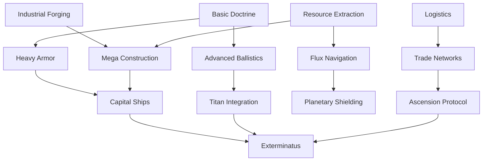

# Aurelian Hegemony Technology

## Tech Tree Visualization

## Tier 1

### Basic Doctrine

- **Cost:** 1000
- **Name:** Aurelian Codex
- **Description:** Standardized drills used across a million worlds.
- **Effects:** +5% Discipline.

### Logistics

- **Cost:** 1000
- **Name:** Departmento Munitorum
- **Description:** A bureaucracy dedictated to supply.
- **Effects:** -10% Upkeep.

### Industrial Forging

- **Cost:** 800
- **Name:** Hive Manufactorums
- **Description:** Cities dedicated to production.
- **Effects:** +10% Production.

### Resource Extraction

- **Cost:** 800
- **Name:** Tithe Grades
- **Description:** Exacting efficiency from subject worlds.
- **Effects:** +10% Tax Income.

## Tier 2

### Heavy Armor

- **Cost:** 2500
- **Name:** Ceramite Casting
- **Prerequisites:** Basic Doctrine
- **Description:** Standard issue protection for the elite.
- **Effects:** +10% Armor.

### Advanced Ballistics

- **Cost:** 2500
- **Name:** Las-Tech Refinement
- **Prerequisites:** Basic Doctrine
- **Description:** Improving the reliability of the standard lasgun.
- **Effects:** +5% Critical Chance.

### Flux Navigation

- **Cost:** 3000
- **Name:** Navis Nobilite
- **Prerequisites:** Resource Extraction
- **Description:** Guild navigators guiding the fleets.
- **Effects:** Safe Flux Travel.

### Mega Construction

- **Cost:** 2500
- **Name:** Orbital Dockyards
- **Prerequisites:** Industrial Forging, Resource Extraction
- **Description:** Massive shipyards for the Aurelian Navy.
- **Effects:** Unlocks Cruisers, Unlocks Destroyer, Unlocks [Orbital Structures].

### Trade Networks

- **Cost:** 2000
- **Name:** Merchant Charters
- **Prerequisites:** Logistics
- **Description:** Licensed rogue traders exploring the stars.
- **Effects:** +20% Exploration Income.

## Tier 3

### Capital Ships

- **Cost:** 5000
- **Name:** Apocalypse Class
- **Prerequisites:** Heavy Armor, Mega Construction
- **Description:** Battleships capable of erasing continents.
- **Effects:** Unlocks Battleships, Unlocks Battleship.

### Titan Integration

- **Cost:** 6000
- **Name:** God-Machines
- **Prerequisites:** Advanced Ballistics
- **Description:** Ancient walkers from the dark age of technology.
- **Effects:** Unlocks Warlord Titans.

### Planetary Shielding

- **Cost:** 4500
- **Name:** Void Shields
- **Prerequisites:** Flux Navigation
- **Description:** Layered energy shields protecting hive cities.
- **Effects:** +40% Defense.

### Ascension Protocol

- **Cost:** 8000
- **Name:** Pax Aurelianis
- **Prerequisites:** Trade Networks
- **Description:** Total unification under the throne.
- **Effects:** +20% Stability, No Rebellion.
- **Unlocks:** [Legionnaire], [Solar Class]

## Tier 4

### Exterminatus

- **Cost:** 15000
- **Name:** Cyclonic Torpedoes
- **Prerequisites:** Capital Ships, Titan Integration
- **Description:** The ultimate sanction. Destruction of entire biospheres.
- **Effects:** +200% Orbital Bombardment Damage, +50% Strategic Threat.
